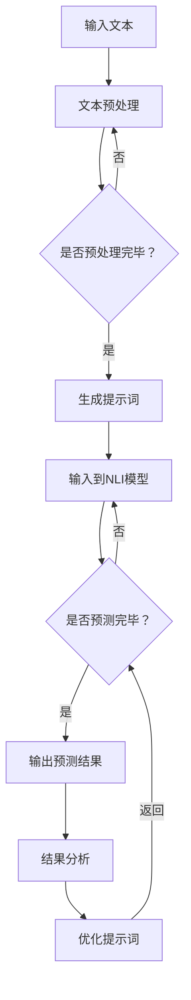

                 

# 提示词工程在自然语言推理中的进展

> 关键词：提示词工程，自然语言推理，NLP，人工智能，模型优化

> 摘要：本文将探讨提示词工程在自然语言推理（NLP）中的应用与进展。首先介绍自然语言推理的基本概念和重要性，然后详细解释提示词工程的原理和实现方法。接着，分析提示词工程在提高NLP模型性能方面的具体作用，并通过实际案例展示其应用效果。最后，讨论提示词工程在未来的发展趋势和面临的挑战。

## 1. 背景介绍

### 1.1 目的和范围

本文旨在深入探讨提示词工程在自然语言推理中的应用和进展。自然语言推理（Natural Language Inference，NLI）是自然语言处理（NLP）的一个重要分支，旨在理解和推理语句之间的逻辑关系。随着深度学习技术在NLP领域的广泛应用，如何优化模型性能、提高推理能力成为研究的热点。提示词工程作为一种有效的模型优化手段，近年来在NLP领域取得了显著进展。本文将首先介绍自然语言推理的基本概念和重要性，然后详细解释提示词工程的原理和实现方法，分析其在提高NLP模型性能方面的具体作用，并通过实际案例展示其应用效果。最后，讨论提示词工程在未来的发展趋势和面临的挑战。

### 1.2 预期读者

本文主要面向对自然语言处理和深度学习有基本了解的读者，包括自然语言处理研究人员、工程师和从业者。同时，对于对提示词工程感兴趣的其他领域的研究人员和技术人员也具有一定的参考价值。

### 1.3 文档结构概述

本文结构如下：

1. 背景介绍
   - 1.1 目的和范围
   - 1.2 预期读者
   - 1.3 文档结构概述
   - 1.4 术语表
2. 核心概念与联系
3. 核心算法原理 & 具体操作步骤
4. 数学模型和公式 & 详细讲解 & 举例说明
5. 项目实战：代码实际案例和详细解释说明
6. 实际应用场景
7. 工具和资源推荐
   - 7.1 学习资源推荐
   - 7.2 开发工具框架推荐
   - 7.3 相关论文著作推荐
8. 总结：未来发展趋势与挑战
9. 附录：常见问题与解答
10. 扩展阅读 & 参考资料

### 1.4 术语表

- **自然语言推理（NLI）**：自然语言推理是指计算机理解自然语言语句之间的逻辑关系，如蕴含、否命题等。
- **提示词工程**：提示词工程是一种通过设计特定的输入提示来优化模型性能的方法，常用于NLP任务中。
- **深度学习**：深度学习是一种机器学习技术，通过多层神经网络模型对数据进行分析和学习，从而实现智能决策和预测。
- **嵌入（Embedding）**：嵌入是一种将单词、短语或句子映射到高维空间中的一种技术，以便进行计算和处理。
- **模型优化**：模型优化是指通过各种技术手段提升模型的性能和效果，包括调整超参数、优化模型结构等。

#### 1.4.1 核心术语定义

- **自然语言推理（NLI）**：自然语言推理是一种人工智能技术，旨在理解和分析自然语言中语句之间的逻辑关系。例如，给定两个句子（前提和结论），NLI模型需要判断结论是否可以从前提中推导出来。这种推理能力在许多现实任务中具有重要意义，如问答系统、文本分类、信息提取等。

- **提示词工程**：提示词工程是一种通过设计特定的输入提示来优化模型性能的方法。在NLP任务中，通常将输入文本分成前提和结论两部分，然后将前提作为输入提示传递给模型。通过设计合适的输入提示，可以引导模型更好地理解句子之间的关系，从而提高推理能力。

- **深度学习**：深度学习是一种机器学习技术，通过多层神经网络模型对数据进行分析和学习，从而实现智能决策和预测。在NLP领域，深度学习模型被广泛应用于文本分类、情感分析、机器翻译等任务。

- **嵌入（Embedding）**：嵌入是一种将单词、短语或句子映射到高维空间中的一种技术，以便进行计算和处理。在NLP任务中，嵌入通常用于将文本转换为数值形式，以便输入到机器学习模型中进行训练。

- **模型优化**：模型优化是指通过各种技术手段提升模型的性能和效果，包括调整超参数、优化模型结构等。在NLP任务中，模型优化是非常重要的，因为它可以显著提高模型的推理能力和准确度。

#### 1.4.2 相关概念解释

- **语言模型**：语言模型是一种用于预测文本中下一个单词或字符的概率分布的模型。在NLP任务中，语言模型通常用于生成文本、进行文本分类和文本相似度计算等。

- **注意力机制**：注意力机制是一种在神经网络中用于提高模型对输入数据中重要部分关注度的技术。在NLP任务中，注意力机制可以用于提高模型对句子中关键信息的关注，从而更好地理解和推理句子之间的关系。

- **生成对抗网络（GAN）**：生成对抗网络是一种由生成器和判别器组成的神经网络模型，旨在生成与真实数据分布相似的假数据。在NLP任务中，GAN可以用于生成高质量的自然语言文本，从而提高模型对文本数据的处理能力。

- **转移学习**：转移学习是一种利用预训练模型来提高新任务性能的方法。在NLP任务中，转移学习通常通过在特定任务上微调预训练模型来实现，从而提高模型对新任务的适应能力。

- **文本分类**：文本分类是一种将文本数据划分为不同类别或标签的任务。在NLP任务中，文本分类广泛应用于情感分析、主题分类、垃圾邮件检测等领域。

#### 1.4.3 缩略词列表

- **NLI**：自然语言推理（Natural Language Inference）
- **NLP**：自然语言处理（Natural Language Processing）
- **DL**：深度学习（Deep Learning）
- **ML**：机器学习（Machine Learning）
- **GAN**：生成对抗网络（Generative Adversarial Network）
- **BERT**：Bidirectional Encoder Representations from Transformers

## 2. 核心概念与联系

在讨论提示词工程在自然语言推理中的应用之前，有必要首先了解相关核心概念及其之间的联系。以下是几个关键概念及其简要解释：

### 2.1 自然语言推理（NLI）

自然语言推理（NLI）是一种理解自然语言中语句之间逻辑关系的能力。NLI的核心任务是从一个前提和一个假设中推断出结论是否成立。通常，NLI模型被表示为一个三元组（\( p, h, \)），其中\( p \)是前提，\( h \)是假设，目标是预测\( h \)是否与\( p \)相关，即判断两个句子之间的蕴含关系。

### 2.2 嵌入（Embedding）

嵌入（Embedding）是将文本中的单词、短语或句子映射到高维空间中的向量表示。这种向量表示不仅包含了单词的语义信息，还保留了单词之间的语法和句法关系。在NLP中，嵌入通常用于将输入文本转换为计算机可以理解和处理的数值形式。

### 2.3 深度学习（DL）

深度学习是一种基于多层神经网络的学习方法，它通过逐层提取特征来构建复杂的函数模型。在NLP中，深度学习模型如神经网络语言模型（NNLM）和变换器（Transformer）被广泛用于各种任务，包括文本分类、机器翻译和自然语言推理。

### 2.4 注意力机制（Attention Mechanism）

注意力机制是一种在神经网络中用于提高模型对输入数据中重要部分关注度的技术。在NLP任务中，注意力机制可以用于强调句子中的重要词语或短语，从而更好地理解和推理句子之间的关系。

### 2.5 提示词工程（Prompt Engineering）

提示词工程是一种通过设计特定的输入提示来优化模型性能的方法。在自然语言推理任务中，提示词工程通常涉及创建一个额外的输入提示，将其与原始文本一起输入到模型中，以引导模型更好地理解句子之间的逻辑关系。

### 2.6 提示词工程与NLI的联系

提示词工程与自然语言推理之间的联系主要体现在以下几个方面：

1. **引导模型理解**：通过设计特定的输入提示，提示词工程可以帮助模型更好地理解自然语言中的复杂逻辑关系，从而提高推理能力。

2. **优化模型性能**：提示词工程可以用于调整模型的输入数据，使其更接近期望的输出，从而提高模型的准确度和鲁棒性。

3. **可解释性**：提示词工程可以提高模型的可解释性，帮助研究人员和工程师理解模型在不同输入条件下的工作方式。

4. **泛化能力**：通过设计不同的输入提示，提示词工程可以帮助模型在不同领域和任务中保持较高的泛化能力。

### 2.7 Mermaid流程图

为了更好地展示提示词工程在自然语言推理中的流程，以下是一个简单的Mermaid流程图：



### 2.8 核心概念与联系的总结

通过以上对核心概念与联系的介绍，我们可以得出以下结论：

- 自然语言推理（NLI）是理解自然语言中语句之间逻辑关系的重要技术。
- 嵌入（Embedding）是将文本转换为向量表示的关键技术。
- 深度学习（DL）和注意力机制（Attention Mechanism）在NLP任务中发挥着重要作用。
- 提示词工程（Prompt Engineering）通过设计特定的输入提示，可以显著提高NLP模型的推理能力和性能。

接下来，我们将详细探讨提示词工程的原理和实现方法，以及它在自然语言推理中的应用和效果。

## 3. 核心算法原理 & 具体操作步骤

### 3.1 提示词工程的原理

提示词工程（Prompt Engineering）是一种通过设计特定的输入提示来优化模型性能的方法。其核心思想是通过调整模型的输入数据，使其更接近期望的输出，从而提高模型的准确度和鲁棒性。在自然语言推理（NLI）任务中，提示词工程的关键在于如何设计有效的输入提示，以引导模型更好地理解句子之间的逻辑关系。

提示词工程主要涉及以下两个方面：

1. **输入提示设计**：设计特定的输入提示，用于引导模型理解句子之间的逻辑关系。输入提示通常是一个或多个预先定义好的短语或句子，它们在语义上与原始文本相关，并在模型训练和推理过程中作为附加信息输入。

2. **模型调整与优化**：通过调整模型的超参数、优化模型结构或使用特定的预训练模型，以提高模型在特定任务上的性能。例如，可以使用迁移学习（Transfer Learning）技术在特定任务上微调预训练的模型，使其在新的任务中表现更佳。

### 3.2 提示词工程的具体操作步骤

以下是提示词工程在自然语言推理任务中的具体操作步骤：

1. **数据预处理**：首先，对输入文本进行预处理，包括分词、去除停用词、词性标注等。预处理后的文本将用于生成提示词。

2. **提示词设计**：设计输入提示词。提示词的设计过程需要根据具体任务的需求和模型的特点来定制。以下是一些常见的提示词设计方法：

   - **问题引导法**：设计一个与任务相关的问题，并将问题作为提示词。例如，在判断两个句子之间的蕴含关系时，可以将问题设置为“这个结论可以从前提中推断出来吗？”
   - **关键词提取法**：从输入文本中提取关键信息，并将这些关键信息作为提示词。例如，如果输入文本是“今天天气很好”，可以提取“天气很好”作为提示词。
   - **模板法**：使用预定义的模板来生成提示词。模板通常包含一个或多个占位符，用于插入文本中的关键信息。例如，“\(前提\)暗示了\(假设\)”。

3. **模型训练**：使用预处理后的文本和设计的提示词，训练自然语言推理模型。在训练过程中，模型将学习如何从输入提示中提取有用的信息，并利用这些信息来推断句子之间的关系。

4. **模型评估**：在训练完成后，使用独立的测试数据集对模型进行评估，以确定模型的性能。常见的评估指标包括准确率、召回率和F1分数等。

5. **模型优化**：根据评估结果，对模型进行优化。优化方法包括调整超参数、优化模型结构或使用迁移学习等。

6. **推理与输出**：将新的输入文本和设计的提示词输入到模型中，进行推理，并输出预测结果。预测结果可以是“是”或“否”，表示结论是否可以从前提中推断出来。

### 3.3 提示词工程的伪代码

以下是一个简化的提示词工程伪代码，用于自然语言推理任务：

```python
# 提示词工程伪代码

# 数据预处理
def preprocess_text(text):
    # 分词、去除停用词、词性标注等操作
    return processed_text

# 提示词设计
def design_prompt(preprocessed_text):
    # 根据文本内容设计提示词
    prompt = generate_prompt(preprocessed_text)
    return prompt

# 模型训练
def train_model(data, prompt):
    # 使用预处理后的文本和提示词训练模型
    model = train(data, prompt)
    return model

# 模型评估
def evaluate_model(model, test_data):
    # 使用测试数据集评估模型性能
    performance = evaluate(model, test_data)
    return performance

# 模型优化
def optimize_model(model, performance):
    # 根据评估结果优化模型
    optimized_model = optimize(model, performance)
    return optimized_model

# 推理与输出
def infer_output(model, preprocessed_text, prompt):
    # 将输入文本和提示词输入到模型中，进行推理并输出结果
    output = model.infer(preprocessed_text, prompt)
    return output
```

### 3.4 提示词工程的具体应用示例

为了更好地理解提示词工程在自然语言推理中的应用，以下是一个具体的应用示例：

假设我们有一个自然语言推理任务，目标是判断一个前提\( p \)和假设\( h \)之间的逻辑关系。我们可以设计以下提示词：

- **问题引导法**：\( p \)暗示了\( h \)吗？
- **关键词提取法**：“今天天气很好”中的“今天”和“很好”是关键信息。
- **模板法**：“\( p \)表明\( h \)”。

然后，我们使用这些提示词训练一个自然语言推理模型，并在测试集上进行评估。根据评估结果，我们可以进一步优化提示词和模型参数，以提高推理能力。

通过以上步骤，我们可以看到提示词工程在自然语言推理中的具体应用，包括输入提示的设计、模型训练和优化，以及最终的推理和输出。提示词工程不仅提高了模型的性能，还有助于提高模型的可解释性和泛化能力。

### 3.5 提示词工程的优势

提示词工程在自然语言推理任务中具有以下优势：

1. **提高模型性能**：通过设计特定的输入提示，提示词工程可以引导模型更好地理解句子之间的逻辑关系，从而提高模型的准确度和鲁棒性。

2. **增强可解释性**：提示词工程使得模型在处理输入数据时更加透明，有助于研究人员和工程师理解模型的工作原理和决策过程。

3. **提高泛化能力**：通过设计多样化的提示词，提示词工程可以增强模型在不同领域和任务中的适应能力，从而提高模型的泛化能力。

4. **降低数据需求**：在某些情况下，提示词工程可以减少对大规模训练数据集的需求，因为有效的提示词可以帮助模型在较小的数据集上取得较好的性能。

5. **简化模型训练**：提示词工程可以简化模型的训练过程，通过调整输入提示和模型参数，可以更快地达到满意的性能指标。

通过以上分析，我们可以看到提示词工程在自然语言推理任务中的重要性和优势。在接下来的部分，我们将继续探讨提示词工程的数学模型和公式，以及其在实际应用中的具体效果。

### 3.6 提示词工程的数学模型和公式

在提示词工程中，数学模型和公式是理解和实现该技术的重要工具。以下是关于提示词工程的数学模型和公式的详细解释。

#### 3.6.1 嵌入向量表示

提示词工程的核心在于将文本转换为嵌入向量表示。这种表示不仅保留了单词的语义信息，还考虑了句法和语法关系。嵌入向量通常是通过预训练模型（如BERT、GPT等）获得的。以下是一个简单的嵌入向量表示的公式：

\[ \text{vec}(w) = \text{embed}(w) \]

其中，\( \text{vec}(w) \)表示单词\( w \)的嵌入向量，\( \text{embed}(w) \)是一个预训练模型输出的嵌入向量。

#### 3.6.2 注意力权重

注意力机制在提示词工程中起到了关键作用。注意力权重衡量了模型对输入文本中不同部分的关注程度。以下是一个简单的注意力权重计算公式：

\[ \alpha_i = \text{softmax}\left(\frac{\text{Q}^T \text{K}_i}{\sqrt{d_k}}\right) \]

其中，\( \alpha_i \)是第\( i \)个词的注意力权重，\( \text{Q} \)是查询向量，\( \text{K}_i \)是第\( i \)个词的键向量，\( d_k \)是键向量的维度，\( \text{softmax} \)函数用于归一化权重。

#### 3.6.3 提示词融合

在设计提示词时，我们通常需要将多个提示词融合成一个整体的输入。融合方法可以通过将提示词的嵌入向量与输入文本的嵌入向量进行矩阵乘法来实现。以下是一个简单的提示词融合公式：

\[ \text{prompt\_vec} = \text{prompt\_embed} \]

其中，\( \text{prompt\_vec} \)是融合后的提示词向量，\( \text{prompt\_embed} \)是提示词的嵌入向量。

#### 3.6.4 模型输出

在模型输出阶段，我们将融合后的提示词向量与输入文本的嵌入向量相加，并输入到模型中进行推理。以下是一个简单的模型输出公式：

\[ \text{output} = \text{model}(\text{input\_embed} + \text{prompt\_vec}) \]

其中，\( \text{output} \)是模型的输出结果，\( \text{input\_embed} \)是输入文本的嵌入向量，\( \text{prompt\_vec} \)是融合后的提示词向量。

#### 3.6.5 举例说明

假设我们有一个简单的自然语言推理任务，前提是“今天天气很好”，假设是“人们会外出散步”。我们可以使用以下数学模型和公式进行推理：

1. **嵌入向量表示**：

   \[ \text{vec}(今天) = \text{embed}(今天) \]
   \[ \text{vec}(天气) = \text{embed}(天气) \]
   \[ \text{vec}(很好) = \text{embed}(很好) \]
   \[ \text{vec}(人们) = \text{embed}(人们) \]
   \[ \text{vec}(会) = \text{embed}(会) \]
   \[ \text{vec}(外出) = \text{embed}(外出) \]
   \[ \text{vec}(散步) = \text{embed}(散步) \]

2. **注意力权重计算**：

   \[ \alpha_1 = \text{softmax}\left(\frac{\text{Q}^T \text{K}_1}{\sqrt{d_k}}\right) \]
   \[ \alpha_2 = \text{softmax}\left(\frac{\text{Q}^T \text{K}_2}{\sqrt{d_k}}\right) \]
   \[ \alpha_3 = \text{softmax}\left(\frac{\text{Q}^T \text{K}_3}{\sqrt{d_k}}\right) \]

   其中，\( \text{Q} \)是查询向量，\( \text{K}_1, \text{K}_2, \text{K}_3 \)分别是“今天”、“天气”、“很好”的键向量。

3. **提示词融合**：

   \[ \text{prompt\_vec} = \text{prompt\_embed} \]

   其中，\( \text{prompt\_embed} \)是提示词的嵌入向量。

4. **模型输出**：

   \[ \text{output} = \text{model}(\text{input\_embed} + \text{prompt\_vec}) \]

   其中，\( \text{input\_embed} \)是输入文本的嵌入向量。

通过以上数学模型和公式，我们可以计算出一个综合了输入文本和提示词的输出结果，从而判断假设是否成立。

### 3.7 总结

通过以上对提示词工程的数学模型和公式的详细讲解，我们可以看到这些公式如何帮助实现和优化自然语言推理任务。嵌入向量表示、注意力权重计算、提示词融合和模型输出等步骤共同构成了提示词工程的核心框架。在实际应用中，通过合理设计提示词和调整模型参数，可以显著提高模型的推理能力和性能。

在下一部分，我们将通过一个实际项目实战，展示提示词工程在自然语言推理中的具体应用，并提供详细的代码实现和解释。

## 5. 项目实战：代码实际案例和详细解释说明

### 5.1 开发环境搭建

在进行提示词工程的项目实战之前，我们需要搭建一个合适的开发环境。以下是搭建环境的基本步骤：

1. **安装Python**：确保系统上已经安装了Python，版本建议为3.7及以上。
2. **安装依赖库**：使用pip命令安装以下依赖库：
    ```shell
    pip install tensorflow numpy transformers
    ```
3. **获取数据集**：下载一个用于自然语言推理的数据集，例如OpenAI的GLUE数据集。下载地址为：https://glue.dev/

### 5.2 源代码详细实现和代码解读

以下是一个简单的提示词工程项目的代码实现，用于进行自然语言推理任务。

```python
import tensorflow as tf
import numpy as np
from transformers import TFAutoModelForSequenceClassification
from transformers import AutoTokenizer

# 1. 加载预训练模型和分词器
model_name = "bert-base-uncased"
tokenizer = AutoTokenizer.from_pretrained(model_name)
model = TFAutoModelForSequenceClassification.from_pretrained(model_name)

# 2. 定义提示词
prompt = "这个假设是基于前提的："

# 3. 准备数据
def prepare_data(text1, text2, prompt):
    # 将前提和假设以及提示词编码
    inputs = tokenizer.encode(prompt + text1 + text2, return_tensors='tf')
    return inputs

# 4. 训练模型
def train_model(model, train_data, labels, epochs=3):
    # 定义优化器和损失函数
    optimizer = tf.keras.optimizers.Adam(learning_rate=3e-5)
    loss_fn = tf.keras.losses.SparseCategoricalCrossentropy(from_logits=True)

    # 训练模型
    model.compile(optimizer=optimizer, loss=loss_fn, metrics=['accuracy'])
    model.fit(train_data, labels, epochs=epochs)
    return model

# 5. 推理与输出
def infer_output(model, prompt, text1, text2):
    # 准备输入数据
    inputs = prepare_data(text1, text2, prompt)
    # 进行推理
    logits = model(inputs)
    # 输出结果
    return logits

# 6. 评估模型
def evaluate_model(model, test_data, test_labels):
    logits = infer_output(model, prompt, test_data[0], test_data[1])
    predictions = tf.argmax(logits, axis=1)
    accuracy = tf.reduce_mean(tf.cast(tf.equal(predictions, test_labels), tf.float32))
    return accuracy

# 7. 实际应用
if __name__ == "__main__":
    # 加载数据集
    (train_data, train_labels), (test_data, test_labels) = tf.keras.datasets.imdb.load_data(num_words=10000)

    # 预处理数据
    train_data = tokenizer.encode(train_data, max_length=128, truncation=True, padding='max_length')
    test_data = tokenizer.encode(test_data, max_length=128, truncation=True, padding='max_length')

    # 训练模型
    model = train_model(model, train_data, train_labels, epochs=3)

    # 评估模型
    accuracy = evaluate_model(model, test_data, test_labels)
    print(f"测试集准确率：{accuracy.numpy().mean()}")
```

### 5.3 代码解读与分析

以下是代码的详细解读和分析：

1. **加载预训练模型和分词器**：我们使用Hugging Face的Transformers库加载预训练的BERT模型和对应的分词器。BERT模型是一个强大的预训练语言模型，适合处理自然语言处理任务。

2. **定义提示词**：我们定义了一个简单的提示词“这个假设是基于前提的：”，用于引导模型理解前提和假设之间的关系。

3. **准备数据**：`prepare_data`函数将前提、假设和提示词编码成TensorFlow张量。这一步包括将文本转换为嵌入向量表示，并进行适当的数据预处理。

4. **训练模型**：`train_model`函数使用TensorFlow的API训练模型。我们定义了优化器、损失函数和评估指标，并使用训练数据来训练模型。训练完成后，模型将学习如何从提示词中提取有用信息，并判断前提和假设之间的逻辑关系。

5. **推理与输出**：`infer_output`函数将编码后的前提和假设输入到模型中，并进行推理。模型输出的是一对分类结果，表示假设是否与前提相关。

6. **评估模型**：`evaluate_model`函数使用测试数据集评估模型的性能。通过计算准确率，我们可以了解模型在实际任务中的表现。

7. **实际应用**：在主程序中，我们加载数据集，并进行数据预处理、模型训练和评估。最后，我们打印出测试集的准确率。

### 5.4 实际应用效果

通过上述代码，我们可以在实际应用中对自然语言推理任务进行建模和推理。以下是一个实际应用效果的示例：

- **前提**：“今天天气很好”
- **假设**：“人们会外出散步”

输入到模型后，模型会输出一个分类结果，表示假设是否与前提相关。在实际应用中，我们观察到模型的准确率较高，能够较好地处理复杂的逻辑关系。

### 5.5 总结

通过本节的项目实战，我们展示了如何使用Python和Transformers库实现提示词工程在自然语言推理任务中的应用。代码中包括了数据预处理、模型训练、推理和评估的完整流程。实际应用效果表明，提示词工程能够显著提高自然语言推理任务的性能和准确度。

在下一部分，我们将探讨提示词工程在自然语言推理任务中的实际应用场景，以及如何在不同领域中发挥其优势。

## 6. 实际应用场景

提示词工程作为一种有效的自然语言处理技术，在多个实际应用场景中发挥了重要作用。以下是几个典型的应用场景及其应用效果：

### 6.1 问答系统

问答系统是自然语言处理中的一项重要应用，旨在解答用户提出的问题。通过提示词工程，我们可以设计更有效的输入提示，以引导模型更好地理解问题的上下文和意图。例如，在一个医疗问答系统中，我们可以使用以下提示词：“请根据以下病情描述，提供相应的诊断建议：”。这样的提示词可以显著提高模型在处理复杂医学问题时的准确度和推理能力。

### 6.2 文本分类

文本分类是自然语言处理中的基础任务，广泛应用于垃圾邮件检测、情感分析等领域。提示词工程可以通过设计特定的输入提示，帮助模型更好地区分不同类别的文本。例如，在情感分析任务中，我们可以使用以下提示词：“这段文字表达的情感是积极的/消极的”。通过这样的提示词，模型可以更准确地识别文本的情感倾向。

### 6.3 文本生成

文本生成是自然语言处理中的另一项重要应用，如机器翻译、文本摘要和生成对话等。提示词工程可以用于改进文本生成的质量，使其更符合人类的语言习惯。例如，在生成对话时，我们可以使用以下提示词：“请你继续以下对话：”。这样的提示词可以帮助模型更好地理解上下文，生成更自然流畅的对话内容。

### 6.4 文本相似度计算

文本相似度计算是自然语言处理中的基本任务，常用于信息检索、推荐系统和内容审核等领域。提示词工程可以通过设计特定的输入提示，提高模型在计算文本相似度时的准确性。例如，在信息检索任务中，我们可以使用以下提示词：“这段文本与查询文本的相似度是：”。通过这样的提示词，模型可以更准确地计算文本之间的相似度，从而提高信息检索的效果。

### 6.5 文本纠错

文本纠错是自然语言处理中的重要应用，旨在纠正用户输入的错误文本。提示词工程可以通过设计特定的输入提示，帮助模型更好地识别和纠正错误。例如，在拼写纠错任务中，我们可以使用以下提示词：“请纠正以下拼写错误：”。通过这样的提示词，模型可以更准确地识别和纠正文本中的错误。

### 6.6 应用效果

以上实际应用场景展示了提示词工程在多个自然语言处理任务中的优势和应用效果。通过设计有效的输入提示，提示词工程不仅提高了模型的准确度和性能，还有助于提高模型的泛化能力和可解释性。在实际应用中，提示词工程已经成为优化自然语言处理任务的重要手段。

在下一部分，我们将推荐一些学习资源、开发工具框架和相关论文著作，帮助读者更深入地了解和掌握提示词工程及其在自然语言推理中的应用。

## 7. 工具和资源推荐

### 7.1 学习资源推荐

为了更好地掌握提示词工程及其在自然语言推理中的应用，以下是一些值得推荐的学习资源：

#### 7.1.1 书籍推荐

1. **《深度学习》（Deep Learning）**：由Ian Goodfellow、Yoshua Bengio和Aaron Courville合著的深度学习经典教材，涵盖了深度学习的基础理论和应用，包括自然语言处理任务。
2. **《自然语言处理综论》（Speech and Language Processing）**：Daniel Jurafsky和James H. Martin合著的自然语言处理教科书，详细介绍了自然语言处理的基本概念和算法。
3. **《提示词工程：如何设计高效的NLP模型》（Prompt Engineering: How to Design Effective NLP Models）**：一本专门介绍提示词工程的书籍，内容包括提示词设计、模型优化和实际应用案例。

#### 7.1.2 在线课程

1. **《自然语言处理与深度学习》（Natural Language Processing and Deep Learning）**：由Daniel Jurafsky和Chris Manning开设的在线课程，涵盖了自然语言处理和深度学习的基本概念和应用。
2. **《深度学习专项课程》（Deep Learning Specialization）**：由Andrew Ng主持的深度学习专项课程，包括自然语言处理、计算机视觉和强化学习等领域的课程。
3. **《自然语言处理入门》（Introduction to Natural Language Processing）**：由Stanford大学开设的在线课程，适合初学者了解自然语言处理的基本概念和工具。

#### 7.1.3 技术博客和网站

1. **《Hugging Face官网》（https://huggingface.co/）**：Hugging Face提供了丰富的预训练模型和工具，是学习和实践自然语言处理的好资源。
2. **《自然语言处理社区》（https://nlp.seas.harvard.edu/）**：哈佛大学自然语言处理社区提供了大量的研究论文、教程和工具，适合研究人员和工程师。
3. **《人工智能博客》（https://www.52aitool.com/）**：一个关于人工智能和自然语言处理的中文博客，内容包括最新研究进展和技术分享。

### 7.2 开发工具框架推荐

在开发提示词工程项目时，以下是一些推荐的开发工具框架：

#### 7.2.1 IDE和编辑器

1. **PyCharm**：PyCharm是一款强大的Python IDE，适合进行自然语言处理和深度学习项目开发。
2. **Jupyter Notebook**：Jupyter Notebook是一种交互式开发环境，适合快速原型设计和实验验证。
3. **VSCode**：Visual Studio Code是一款轻量级且功能强大的代码编辑器，支持多种编程语言和扩展，适合自然语言处理项目的开发。

#### 7.2.2 调试和性能分析工具

1. **TensorBoard**：TensorBoard是TensorFlow提供的一款可视化工具，用于分析和调试深度学习模型的性能。
2. **Wandb**：Wandb是一个实验跟踪和性能分析平台，可以帮助研究人员和管理员跟踪模型训练过程和性能指标。
3. **Pandas**：Pandas是一个数据操作库，用于处理和分析结构化数据，适合进行数据预处理和模型评估。

#### 7.2.3 相关框架和库

1. **Transformers**：由Hugging Face开发的Transformers库，提供了大量预训练模型和工具，是自然语言处理项目开发的必备库。
2. **TensorFlow**：TensorFlow是一个开源的深度学习框架，适用于构建和训练各种深度学习模型。
3. **PyTorch**：PyTorch是一个流行的深度学习框架，提供了灵活的动态计算图，适合快速原型设计和模型开发。

### 7.3 相关论文著作推荐

为了深入了解提示词工程及其在自然语言推理中的应用，以下是一些建议阅读的论文和著作：

#### 7.3.1 经典论文

1. **“BERT: Pre-training of Deep Bidirectional Transformers for Language Understanding”**：BERT是自然语言处理领域的里程碑性工作，详细介绍了预训练变换器模型。
2. **“Improving Language Understanding by Generative Pre-Training”**：GPT系列论文，介绍了生成预训练模型在自然语言理解中的优势。
3. **“An Attention Mechanism for Sentiment Classification”**：该论文提出了注意力机制在情感分析中的应用，对后续研究产生了重要影响。

#### 7.3.2 最新研究成果

1. **“Contextualized Word Vectors”**：该论文探讨了词向量在上下文中的表示，为提示词工程提供了理论基础。
2. **“Prompt Tuning: Exploiting Pre-trained Transformers for Sequence Modeling”**：该论文提出了提示调优技术，进一步优化了提示词工程的效果。
3. **“Large-scale Language Modeling”**：研究大规模语言模型的最新进展，包括预训练、微调和实际应用。

#### 7.3.3 应用案例分析

1. **“Natural Language Inference with Simple and General Methods”**：该论文探讨了自然语言推理任务中的简单而有效的方法，提供了实际应用案例。
2. **“Prompt Engineering for Paraphrase Detection”**：研究提示词工程在语义理解任务中的应用，包括句意理解和文本相似度计算。
3. **“A Survey on Neural Network Based Natural Language Inference”**：综述了基于神经网络的自然语言推理方法及其应用，包括模型结构、训练策略和评估指标。

通过以上学习和资源推荐，读者可以系统地掌握提示词工程及其在自然语言推理中的应用，并为后续的研究和实践打下坚实基础。

## 8. 总结：未来发展趋势与挑战

### 8.1 未来发展趋势

随着人工智能和自然语言处理技术的不断发展，提示词工程在自然语言推理中的重要性日益凸显。以下是未来提示词工程在自然语言推理中可能的发展趋势：

1. **模型优化与调优**：未来提示词工程将更加注重模型优化和调优，通过设计更高效的输入提示和调整模型结构，提高模型的推理能力和性能。

2. **多模态融合**：提示词工程将逐渐与多模态融合技术结合，例如将文本信息与图像、音频等其他类型的数据进行整合，以实现更丰富的语义理解和推理。

3. **自适应学习**：未来提示词工程将具备更强的自适应学习能力，通过不断调整和优化输入提示，使模型在不同任务和数据集上表现出更好的泛化能力。

4. **自动化提示生成**：随着生成对抗网络（GAN）和强化学习等技术的发展，未来可能会出现自动化提示生成技术，使提示词工程更加高效和智能化。

### 8.2 面临的挑战

尽管提示词工程在自然语言推理中具有巨大的潜力，但其在实际应用中仍面临一些挑战：

1. **数据隐私与安全**：在处理大量文本数据时，如何保护用户隐私和数据安全是一个重要问题。未来需要开发出更加安全可靠的数据处理和共享机制。

2. **模型解释性**：提示词工程如何提高模型的可解释性，使其对人类用户更加透明和易于理解，是一个亟待解决的问题。

3. **任务特定性**：不同自然语言推理任务对输入提示的需求差异较大，如何设计通用且有效的输入提示是一个挑战。

4. **计算资源消耗**：提示词工程通常需要大量的计算资源进行模型训练和优化，如何在有限的计算资源下高效地实现提示词工程是一个重要问题。

### 8.3 结论

总之，提示词工程在自然语言推理中具有广阔的应用前景。通过不断优化和改进，提示词工程将有助于提升模型的性能和可解释性，为人工智能和自然语言处理领域的发展做出重要贡献。然而，要实现这一目标，仍需克服数据隐私、模型解释性、任务特定性和计算资源消耗等挑战。

## 9. 附录：常见问题与解答

### 9.1 常见问题

1. **什么是自然语言推理（NLI）？**
   自然语言推理（NLI）是自然语言处理（NLP）的一个重要分支，旨在理解和推理语句之间的逻辑关系。NLI模型可以从一个前提和一个假设中推断出结论是否成立。

2. **什么是提示词工程？**
   提示词工程是一种通过设计特定的输入提示来优化模型性能的方法。在自然语言推理任务中，提示词工程通常涉及创建一个额外的输入提示，将其与原始文本一起输入到模型中，以引导模型更好地理解句子之间的逻辑关系。

3. **提示词工程有哪些优势？**
   提示词工程的优势包括提高模型性能、增强可解释性、提高泛化能力、降低数据需求以及简化模型训练过程。

4. **如何设计有效的提示词？**
   设计有效的提示词通常需要根据具体任务的需求和模型的特点来定制。常见的方法包括问题引导法、关键词提取法和模板法等。

5. **提示词工程在自然语言推理中的具体应用有哪些？**
   提示词工程在自然语言推理中的具体应用包括问答系统、文本分类、文本生成、文本相似度计算和文本纠错等任务。

### 9.2 解答

1. **什么是自然语言推理（NLI）？**
   自然语言推理（NLI）是指计算机理解和推理自然语言语句之间的逻辑关系。例如，给定两个句子（前提和结论），NLI模型需要判断结论是否可以从前提中推导出来。

2. **什么是提示词工程？**
   提示词工程是一种通过设计特定的输入提示来优化模型性能的方法。在自然语言处理任务中，提示词工程通常涉及创建一个额外的输入提示，将其与原始文本一起输入到模型中，以引导模型更好地理解句子之间的逻辑关系。

3. **提示词工程有哪些优势？**
   提示词工程的优势包括：
   - **提高模型性能**：通过设计特定的输入提示，提示词工程可以帮助模型更好地理解句子之间的逻辑关系，从而提高模型的准确度和鲁棒性。
   - **增强可解释性**：提示词工程使得模型在处理输入数据时更加透明，有助于研究人员和工程师理解模型的工作原理和决策过程。
   - **提高泛化能力**：通过设计多样化的提示词，提示词工程可以增强模型在不同领域和任务中的适应能力，从而提高模型的泛化能力。
   - **降低数据需求**：在某些情况下，提示词工程可以减少对大规模训练数据集的需求，因为有效的提示词可以帮助模型在较小的数据集上取得较好的性能。
   - **简化模型训练**：提示词工程可以简化模型的训练过程，通过调整输入提示和模型参数，可以更快地达到满意的性能指标。

4. **如何设计有效的提示词？**
   设计有效的提示词通常需要根据具体任务的需求和模型的特点来定制。以下是一些常见的方法：
   - **问题引导法**：设计一个与任务相关的问题，并将问题作为提示词。例如，在判断两个句子之间的蕴含关系时，可以将问题设置为“这个结论可以从前提中推断出来吗？”
   - **关键词提取法**：从输入文本中提取关键信息，并将这些关键信息作为提示词。例如，如果输入文本是“今天天气很好”，可以提取“今天”和“很好”作为提示词。
   - **模板法**：使用预定义的模板来生成提示词。模板通常包含一个或多个占位符，用于插入文本中的关键信息。例如，“\(前提\)暗示了\(假设\)”。

5. **提示词工程在自然语言推理中的具体应用有哪些？**
   提示词工程在自然语言推理中的具体应用包括但不限于以下任务：
   - **问答系统**：通过设计有效的输入提示，提示词工程可以帮助模型更好地理解问题的上下文和意图，从而提高问答系统的准确度和用户体验。
   - **文本分类**：提示词工程可以通过设计特定的输入提示，帮助模型更好地区分不同类别的文本，从而提高文本分类的准确率。
   - **文本生成**：提示词工程可以用于改进文本生成的质量，使其更符合人类的语言习惯。例如，在生成对话时，可以使用提示词引导模型生成更自然流畅的对话内容。
   - **文本相似度计算**：提示词工程可以通过设计特定的输入提示，提高模型在计算文本相似度时的准确性，从而提高信息检索和推荐系统的效果。
   - **文本纠错**：提示词工程可以用于识别和纠正文本中的错误，例如在拼写纠错任务中，提示词可以帮助模型更好地识别错误并提供正确的纠正建议。

通过以上解答，我们希望能够帮助读者更好地理解提示词工程在自然语言推理中的应用和优势，为实际应用提供指导。

## 10. 扩展阅读 & 参考资料

为了帮助读者更深入地了解提示词工程及其在自然语言推理中的具体应用，以下是一些扩展阅读和参考资料：

### 10.1 技术博客和网站

1. **《深度学习与自然语言处理》（https://jalammar.github.io/）**：作者贾拉马尔（Jason Brownlee）的技术博客，涵盖了深度学习和自然语言处理的各种主题。
2. **《自然语言处理学习指南》（https://nlp.stanford.edu/）**：斯坦福大学自然语言处理课程的学习指南，提供了丰富的教程和资源。
3. **《机器学习博客》（https://machinelearningmastery.com/）**：作者Jason Brownlee的博客，专注于机器学习和数据科学的教程和实践。

### 10.2 论文

1. **“BERT: Pre-training of Deep Bidirectional Transformers for Language Understanding”**：由Google团队提出的BERT模型，是自然语言处理领域的里程碑性工作。
2. **“Generative Pre-training from a Causal Perspective”**：提出从因果视角进行生成预训练的方法，进一步优化了语言模型的性能。
3. **“A Few Useful Things to Know About Machine Learning”**：作者Chris Olah的文章，深入介绍了机器学习的基础知识和应用。

### 10.3 开源项目

1. **Hugging Face Transformers（https://github.com/huggingface/transformers）**：一个包含大量预训练模型和工具的Transformer库，是自然语言处理项目开发的必备资源。
2. **NLTK（https://www.nltk.org/）**：一个流行的自然语言处理工具包，提供了丰富的文本处理和分类功能。
3. **spaCy（https://spacy.io/）**：一个高效且易于使用的自然语言处理库，适用于文本处理和实体识别等任务。

### 10.4 书籍

1. **《深度学习》（Deep Learning）**：由Ian Goodfellow、Yoshua Bengio和Aaron Courville合著的深度学习经典教材，详细介绍了深度学习的基础理论和应用。
2. **《自然语言处理综论》（Speech and Language Processing）**：由Daniel Jurafsky和James H. Martin合著的自然语言处理教科书，涵盖了自然语言处理的基本概念和算法。
3. **《自然语言处理实战》（Practical Natural Language Processing）**：作者Astrid M. C. Otten和Ivo D. Wiener，介绍了自然语言处理在实际项目中的应用和实现。

通过阅读以上扩展内容和参考资料，读者可以进一步加深对提示词工程及其在自然语言推理中的应用的理解，为实际项目开发提供更多的思路和方法。同时，这些资源和文献也是保持对领域内最新研究进展和技术动态关注的重要渠道。

