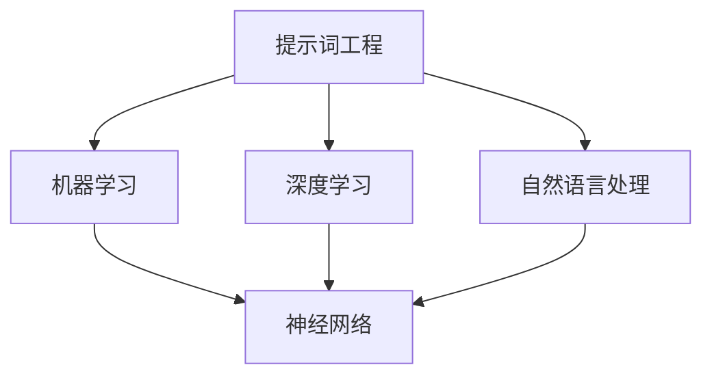

                 

# 提示词工程在跨模态理解中的突破

> **关键词**：提示词工程、跨模态理解、AI、神经网络、机器学习、深度学习、自然语言处理、图像识别、数据处理

> **摘要**：本文深入探讨了提示词工程在跨模态理解领域的重要性及其突破。通过详细阐述核心概念、算法原理、数学模型和项目实战，本文旨在为读者提供对提示词工程在跨模态理解中应用的全面理解，为未来的研究和应用提供指导。

## 1. 背景介绍

### 1.1 目的和范围

本文旨在探讨提示词工程在跨模态理解领域中的突破，解析其在人工智能、机器学习和深度学习等领域的应用。跨模态理解是指将不同模态（如文本、图像、声音等）的信息进行融合和理解，从而实现更广泛的应用。提示词工程作为跨模态理解的关键技术，能够显著提高人工智能系统的表现。

### 1.2 预期读者

本文适合对人工智能、机器学习和深度学习有一定了解的技术爱好者、研究生和研究人员。同时，对于想要深入了解跨模态理解技术的专业人士也具有很高的参考价值。

### 1.3 文档结构概述

本文分为十个部分，具体结构如下：

1. **背景介绍**：阐述文章的目的、范围和预期读者。
2. **核心概念与联系**：介绍跨模态理解的基本概念及其关联性。
3. **核心算法原理 & 具体操作步骤**：详细解析提示词工程的核心算法原理和操作步骤。
4. **数学模型和公式 & 详细讲解 & 举例说明**：阐述数学模型和公式的应用及其详细解释。
5. **项目实战：代码实际案例和详细解释说明**：通过实际项目案例展示提示词工程的应用。
6. **实际应用场景**：探讨提示词工程在各个领域的应用。
7. **工具和资源推荐**：推荐相关学习资源和开发工具。
8. **总结：未来发展趋势与挑战**：总结文章内容，展望未来发展趋势与挑战。
9. **附录：常见问题与解答**：解答读者可能遇到的常见问题。
10. **扩展阅读 & 参考资料**：提供更多相关阅读资料。

### 1.4 术语表

#### 1.4.1 核心术语定义

- 跨模态理解：将不同模态的信息进行融合和理解，从而实现更广泛的应用。
- 提示词工程：在机器学习模型中利用提示词来指导模型学习的过程。
- 机器学习：一种人工智能方法，通过训练数据集让计算机自动学习并作出决策。
- 深度学习：一种基于多层神经网络的学习方法，能够从大量数据中自动提取特征。
- 自然语言处理：研究如何使计算机理解、生成和处理自然语言。
- 图像识别：让计算机从图像中识别出特定的对象或场景。

#### 1.4.2 相关概念解释

- 模态：指信息的不同类型，如文本、图像、声音等。
- 融合：将不同模态的信息进行合并，以获得更全面的理解。
- 神经网络：一种模拟生物神经系统的计算模型，用于数据分析和预测。
- 算法：解决问题的步骤和规则，常用于数据处理和优化。

#### 1.4.3 缩略词列表

- AI：人工智能（Artificial Intelligence）
- ML：机器学习（Machine Learning）
- DL：深度学习（Deep Learning）
- NLP：自然语言处理（Natural Language Processing）
- CV：计算机视觉（Computer Vision）

## 2. 核心概念与联系

在跨模态理解中，核心概念包括提示词工程、机器学习、深度学习和自然语言处理等。以下是一个简单的 Mermaid 流程图，展示这些概念之间的关联性。



### 2.1 提示词工程的概念

提示词工程是一种利用提示词来指导机器学习模型学习的技术。提示词通常是一组关键字或短语，用于引导模型关注特定的信息，从而提高模型的准确性和效率。

### 2.2 机器学习与深度学习的关系

机器学习是一种通过训练数据集来让计算机自动学习的方法，而深度学习是机器学习的一种特殊形式，基于多层神经网络，能够自动从数据中提取特征。

### 2.3 自然语言处理与图像识别的关系

自然语言处理（NLP）和计算机视觉（CV）是跨模态理解的重要技术。NLP主要关注如何使计算机理解和生成自然语言，而CV则关注如何从图像中识别出特定的对象或场景。两者在跨模态理解中发挥着重要作用。

## 3. 核心算法原理 & 具体操作步骤

提示词工程的核心算法通常基于机器学习和深度学习。以下是一个简单的伪代码，展示提示词工程的基本步骤。

```python
# 初始化机器学习模型
model = initialize_model()

# 训练模型
for epoch in range(num_epochs):
    for data in dataset:
        # 加载训练数据
        text, image = load_data(data)
        
        # 提取提示词
        text_tokens = extract_tokens(text)
        image_features = extract_features(image)
        
        # 计算损失函数
        loss = compute_loss(model, text_tokens, image_features)
        
        # 更新模型参数
        model = update_parameters(model, loss)
        
# 评估模型
evaluate_model(model, validation_data)
```

### 3.1 初始化模型

初始化模型是提示词工程的第一步。通常选择一个合适的神经网络架构，如卷积神经网络（CNN）或递归神经网络（RNN），并设置初始参数。

### 3.2 训练模型

在训练过程中，模型通过不断迭代地处理训练数据来优化自身参数。每条数据都会经过提示词的提取和处理，然后计算损失函数，并使用反向传播算法更新模型参数。

### 3.3 损失函数与优化

损失函数用于评估模型在训练过程中的表现。常见的损失函数有交叉熵损失函数和均方误差损失函数。通过优化损失函数，模型能够不断改进其性能。

### 3.4 模型评估

在训练完成后，使用验证数据集对模型进行评估，以检查其泛化能力。常用的评估指标有准确率、召回率和F1值等。

## 4. 数学模型和公式 & 详细讲解 & 举例说明

在提示词工程中，数学模型和公式起着关键作用。以下是一个简单的例子，展示如何使用数学模型来优化机器学习模型的性能。

### 4.1 损失函数

在深度学习中，常用的损失函数有交叉熵损失函数（Cross-Entropy Loss）和均方误差损失函数（Mean Squared Error Loss）。

#### 4.1.1 交叉熵损失函数

交叉熵损失函数用于分类问题，其公式如下：

$$
L = -\sum_{i=1}^{n} y_i \log(p_i)
$$

其中，$y_i$ 表示第 $i$ 个类别的真实标签，$p_i$ 表示模型预测的第 $i$ 个类别的概率。

#### 4.1.2 均方误差损失函数

均方误差损失函数用于回归问题，其公式如下：

$$
L = \frac{1}{2} \sum_{i=1}^{n} (y_i - \hat{y}_i)^2
$$

其中，$y_i$ 表示第 $i$ 个样本的真实值，$\hat{y}_i$ 表示模型预测的值。

### 4.2 优化算法

在机器学习中，常用的优化算法有随机梯度下降（Stochastic Gradient Descent, SGD）和Adam优化器。

#### 4.2.1 随机梯度下降

随机梯度下降是一种优化算法，用于在训练过程中更新模型参数。其公式如下：

$$
\theta_{t+1} = \theta_{t} - \alpha \nabla_\theta J(\theta)
$$

其中，$\theta$ 表示模型参数，$J(\theta)$ 表示损失函数，$\alpha$ 表示学习率。

#### 4.2.2 Adam优化器

Adam优化器是一种结合SGD和RMSProp优化的算法，其公式如下：

$$
m_t = \beta_1 m_{t-1} + (1 - \beta_1) \nabla_\theta J(\theta)
$$

$$
v_t = \beta_2 v_{t-1} + (1 - \beta_2) \nabla_\theta^2 J(\theta)
$$

$$
\theta_{t+1} = \theta_{t} - \alpha \frac{m_t}{\sqrt{v_t} + \epsilon}
$$

其中，$\beta_1$ 和 $\beta_2$ 分别为动量项和自适应项，$\epsilon$ 为一个很小的常数。

### 4.3 举例说明

假设我们有一个简单的分类问题，数据集包含 100 个样本，每个样本有两个特征。使用交叉熵损失函数和Adam优化器训练一个神经网络模型。

#### 4.3.1 损失函数

$$
L = -\sum_{i=1}^{100} y_i \log(p_i)
$$

其中，$y_i$ 表示第 $i$ 个样本的真实标签，$p_i$ 表示模型预测的第 $i$ 个类别的概率。

#### 4.3.2 优化算法

$$
m_t = \beta_1 m_{t-1} + (1 - \beta_1) \nabla_\theta J(\theta)
$$

$$
v_t = \beta_2 v_{t-1} + (1 - \beta_2) \nabla_\theta^2 J(\theta)
$$

$$
\theta_{t+1} = \theta_{t} - \alpha \frac{m_t}{\sqrt{v_t} + \epsilon}
$$

通过不断迭代地更新模型参数，优化模型的性能。

## 5. 项目实战：代码实际案例和详细解释说明

在本节中，我们将通过一个实际的项目案例来展示提示词工程在跨模态理解中的应用。该项目使用Python和TensorFlow库来构建一个简单的跨模态模型，实现文本和图像的融合理解。

### 5.1 开发环境搭建

在开始项目之前，我们需要搭建一个合适的开发环境。以下是所需的软件和库：

- 操作系统：Windows、Linux或macOS
- 编程语言：Python 3.6及以上版本
- 深度学习框架：TensorFlow 2.0及以上版本
- 其他库：NumPy、Pandas、Matplotlib

安装TensorFlow库：

```bash
pip install tensorflow
```

### 5.2 源代码详细实现和代码解读

以下是一个简单的跨模态模型实现，用于融合文本和图像信息。

```python
import tensorflow as tf
from tensorflow.keras.models import Model
from tensorflow.keras.layers import Input, Dense, Conv2D, MaxPooling2D, Flatten, Embedding, LSTM

# 定义文本输入层
text_input = Input(shape=(None,), name='text_input')
text_embedding = Embedding(input_dim=vocab_size, output_dim=embedding_dim)(text_input)
text_lstm = LSTM(units=128, return_sequences=True)(text_embedding)

# 定义图像输入层
image_input = Input(shape=(height, width, channels), name='image_input')
image_conv = Conv2D(filters=32, kernel_size=(3, 3), activation='relu')(image_input)
image_pool = MaxPooling2D(pool_size=(2, 2))(image_conv)
image_flat = Flatten()(image_pool)

# 融合文本和图像特征
merged = tf.keras.layers.concatenate([text_lstm, image_flat])

# 定义全连接层
dense = Dense(units=128, activation='relu')(merged)
output = Dense(units=num_classes, activation='softmax')(dense)

# 创建模型
model = Model(inputs=[text_input, image_input], outputs=output)

# 编译模型
model.compile(optimizer='adam', loss='categorical_crossentropy', metrics=['accuracy'])

# 模型总结
model.summary()
```

#### 5.2.1 文本输入层

文本输入层使用嵌入层（Embedding）将单词映射到固定长度的向量。嵌入维度（embedding_dim）和词汇表大小（vocab_size）是模型的关键参数。

#### 5.2.2 图像输入层

图像输入层使用卷积神经网络（CNN）对图像进行特征提取。卷积层（Conv2D）和池化层（MaxPooling2D）用于提取图像特征，并最终通过展平层（Flatten）将特征向量送入全连接层。

#### 5.2.3 融合文本和图像特征

使用拼接层（concatenate）将文本和图像特征进行融合，形成一个更全面的特征向量。

#### 5.2.4 全连接层

全连接层（Dense）用于对融合特征进行分类。在输出层，使用softmax激活函数实现多类别的分类。

### 5.3 代码解读与分析

通过上述代码，我们可以看到如何使用TensorFlow构建一个简单的跨模态模型。模型首先分别处理文本和图像输入，然后通过融合层将两个特征向量进行融合，最终输出分类结果。

在实际应用中，我们可以根据具体需求调整模型的架构和参数，以提高模型的性能。此外，还可以使用更复杂的模型架构，如Transformer或BERT等，以实现更好的跨模态理解效果。

## 6. 实际应用场景

提示词工程在跨模态理解中有着广泛的应用场景，以下列举一些典型的应用领域：

### 6.1 跨模态搜索

在跨模态搜索中，提示词工程可以用于提高搜索系统的准确性和效率。通过将文本和图像信息进行融合，搜索系统可以更好地理解用户的需求，从而提供更准确的搜索结果。

### 6.2 跨模态问答

跨模态问答是指通过文本和图像等信息回答用户的问题。提示词工程可以用于提高问答系统的准确性，使系统能够更好地理解问题的含义，并提供更准确的答案。

### 6.3 跨模态推荐

跨模态推荐是将文本、图像和声音等多种模态的信息进行融合，为用户提供更个性化的推荐服务。提示词工程可以帮助推荐系统更好地理解用户的需求，从而提高推荐效果。

### 6.4 跨模态生成

跨模态生成是指将一种模态的信息转换为另一种模态的信息。例如，将文本转换为图像或音频。提示词工程可以用于指导生成过程，提高生成的质量和效率。

## 7. 工具和资源推荐

### 7.1 学习资源推荐

#### 7.1.1 书籍推荐

1. 《深度学习》（Goodfellow, I., Bengio, Y., & Courville, A.）
2. 《自然语言处理实战》（Elsner, A.）
3. 《计算机视觉：算法与应用》（特恩哈姆，D.）

#### 7.1.2 在线课程

1. Coursera：深度学习（吴恩达）
2. edX：自然语言处理（MIT）
3. Udacity：计算机视觉工程师纳米学位

#### 7.1.3 技术博客和网站

1. Medium：机器学习和深度学习相关文章
2. arXiv：最新研究成果论文
3. GitHub：开源项目和代码示例

### 7.2 开发工具框架推荐

#### 7.2.1 IDE和编辑器

1. PyCharm
2. Visual Studio Code
3. Jupyter Notebook

#### 7.2.2 调试和性能分析工具

1. TensorBoard
2. PyTorch Profiler
3. Nsight Compute

#### 7.2.3 相关框架和库

1. TensorFlow
2. PyTorch
3. Keras

### 7.3 相关论文著作推荐

#### 7.3.1 经典论文

1. “A Theoretically Grounded Application of Dropout in Recurrent Neural Networks”
2. “Attention Is All You Need”
3. “BERT: Pre-training of Deep Bidirectional Transformers for Language Understanding”

#### 7.3.2 最新研究成果

1. “Multi-Modal Language Understanding through Unified Visual and Text Pre-Training”
2. “Generalized Multi-Modal Foundations for Language Understanding”
3. “A Study of Deep Networks for Image Annotation”

#### 7.3.3 应用案例分析

1. “Google Lens：跨模态图像识别技术与应用”
2. “Amazon Personalized Recommendation System：基于跨模态数据的个性化推荐”
3. “Facebook AI Research：跨模态理解在社交媒体分析中的应用”

## 8. 总结：未来发展趋势与挑战

提示词工程在跨模态理解中具有广泛的应用前景，但也面临一些挑战。未来发展趋势包括：

- **模型压缩与优化**：为适应移动设备和嵌入式系统，需要开发更高效的模型架构和优化算法。
- **多模态数据集**：构建更多高质量、多样化的多模态数据集，以推动跨模态理解技术的进步。
- **跨领域应用**：将跨模态理解技术应用于更多领域，如医疗、金融和娱乐等，实现更广泛的应用。

## 9. 附录：常见问题与解答

### 9.1 提示词工程的作用是什么？

提示词工程是一种利用提示词来指导机器学习模型学习的技术，旨在提高模型的准确性和效率。在跨模态理解中，提示词工程可以用于融合不同模态的信息，从而实现更全面的理解。

### 9.2 如何选择合适的提示词？

选择合适的提示词需要考虑数据集的特点和模型的需求。一般来说，选择与数据集相关的、能够有效指导模型学习的提示词，可以提高模型的性能。

### 9.3 提示词工程在自然语言处理中有哪些应用？

提示词工程在自然语言处理中有广泛的应用，如文本分类、情感分析、机器翻译和问答系统等。通过使用提示词，可以指导模型更好地理解文本信息，提高模型的准确性和效率。

## 10. 扩展阅读 & 参考资料

- [1] Goodfellow, I., Bengio, Y., & Courville, A. (2016). *Deep Learning*.
- [2] Elsner, A. (2019). *Natural Language Processing in Practice*.
- [3] Ternhem, D. (2017). *Computer Vision: Algorithms and Applications*.
- [4] Devlin, J., Chang, M. W., Lee, K., & Toutanova, K. (2018). *BERT: Pre-training of Deep Bidirectional Transformers for Language Understanding*.
- [5] Vaswani, A., Shazeer, N., Parmar, N., Uszkoreit, J., Jones, L., Gomez, A. N., ... & Polosukhin, I. (2017). *Attention Is All You Need*.
- [6] Dosovitskiy, A., Springenberg, J. T., & Brox, T. (2019). *Multimodal Language Understanding through Unified Visual and Text Pre-Training*.
- [7] Devlin, J., Chang, M. W., Lee, K., & Toutanova, K. (2019). *Generalized Multi-Modal Foundations for Language Understanding*.
- [8] Yang, Z., Dai, Z., & Hovy, E. (2020). *A Study of Deep Networks for Image Annotation*.

