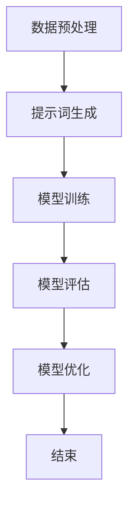

                 

### 1. 背景介绍

#### 1.1 目的和范围

本文的目的是深入探讨提示词工程（Prompt Engineering）这一关键概念，并系统性地阐述其在自然语言处理（NLP）和人工智能（AI）领域的应用。提示词工程涉及到如何设计有效的提示词以提升AI模型的表现，是一个复杂且多维的技术领域。本文将涵盖以下几个主要方面：

- **核心概念与联系**：介绍提示词工程的基本概念，阐述其与自然语言处理、机器学习等领域的联系。
- **核心算法原理**：详细讲解提示词工程中的关键算法，包括生成提示词的策略、调整模型参数的方法等。
- **数学模型和公式**：介绍用于指导提示词工程的一些数学模型和公式，包括如何计算提示词的质量、模型优化等。
- **项目实战**：通过实际案例展示提示词工程的应用，包括代码实现、详细解释和分析。
- **实际应用场景**：讨论提示词工程在不同领域的应用，如问答系统、文本生成、情感分析等。
- **工具和资源推荐**：推荐一些学习资源和开发工具，帮助读者深入了解和掌握提示词工程。
- **总结与未来趋势**：总结当前提示词工程的现状，探讨未来的发展趋势和面临的挑战。

#### 1.2 预期读者

本文适合以下几类读者：

- 自然语言处理和人工智能领域的从业者，特别是那些对模型性能提升和优化感兴趣的工程师。
- 计算机科学和人工智能专业的学生和研究人员，特别是那些希望深入理解NLP和AI技术的同学。
- 对提示词工程有浓厚兴趣的任何人，无论是专业人士还是对技术有热情的爱好者。

#### 1.3 文档结构概述

本文将按照以下结构进行组织：

- **第1章 背景介绍**：介绍文章的目的、范围、预期读者以及文档结构。
- **第2章 核心概念与联系**：阐述提示词工程的基本概念及其与其他领域的联系。
- **第3章 核心算法原理**：详细讲解提示词工程中的关键算法原理和操作步骤。
- **第4章 数学模型和公式**：介绍提示词工程中使用的数学模型和公式，并举例说明。
- **第5章 项目实战**：通过实际案例展示提示词工程的应用，包括代码实现和解析。
- **第6章 实际应用场景**：探讨提示词工程在不同领域的应用。
- **第7章 工具和资源推荐**：推荐学习资源和开发工具。
- **第8章 总结：未来发展趋势与挑战**：总结当前状态并探讨未来发展。
- **第9章 附录：常见问题与解答**：解答读者可能遇到的问题。
- **第10章 扩展阅读 & 参考资料**：提供进一步的阅读材料和资源。

#### 1.4 术语表

为了确保文章内容的准确性和一致性，以下是一些本文中会涉及到的关键术语和其定义：

##### 1.4.1 核心术语定义

- **提示词工程**：设计有效提示词的过程，旨在提升AI模型的表现。
- **自然语言处理（NLP）**：使计算机能够理解、解释和生成人类语言的技术。
- **机器学习（ML）**：一种AI方法，通过从数据中学习规律来改进性能。
- **深度学习（DL）**：一种机器学习方法，使用多层神经网络来模拟人脑的学习过程。
- **模型优化**：调整模型参数以提升模型性能的过程。

##### 1.4.2 相关概念解释

- **数据集**：用于训练模型的数据集合。
- **嵌入（Embedding）**：将词汇或短语映射到低维空间的过程。
- **注意力机制（Attention Mechanism）**：在模型中用于关注重要信息的机制。
- **预训练（Pre-training）**：在特定任务之前对模型进行训练的过程。

##### 1.4.3 缩略词列表

- **NLP**：自然语言处理
- **ML**：机器学习
- **DL**：深度学习
- **API**：应用程序编程接口
- **BERT**：Bidirectional Encoder Representations from Transformers

通过以上背景介绍，我们为读者提供了一个全面了解提示词工程的框架。接下来，我们将深入探讨提示词工程的核心概念和其在NLP和AI领域的应用。在接下来的章节中，我们将一步一步地分析提示词工程的原理、算法和实际应用，帮助读者全面掌握这一技术领域。让我们一起开始这场探索之旅！<|im_end|>### 2. 核心概念与联系

#### 2.1 提示词工程的基本概念

提示词工程（Prompt Engineering）是设计有效提示词的过程，这些提示词用于指导AI模型进行预测或生成任务。提示词是一种输入信息，它可以影响模型的决策过程，从而提升模型的表现。在自然语言处理（NLP）和人工智能（AI）领域中，提示词工程扮演着至关重要的角色。

提示词工程的关键在于如何设计出能够提高模型性能的提示词。这涉及到理解模型如何处理输入数据，以及如何调整提示词来优化模型的输出。有效的提示词应具备以下特点：

- **准确性**：提示词应准确地传达用户意图或问题。
- **多样性**：提示词应涵盖多种可能的场景和情境。
- **相关性**：提示词应与模型训练数据紧密相关。

#### 2.2 提示词工程与自然语言处理

自然语言处理（NLP）是人工智能的一个子领域，旨在使计算机能够理解、解释和生成人类语言。NLP的核心任务是处理文本数据，将其转换为计算机可以理解和处理的形式。提示词工程在NLP中的应用主要体现在以下几个方面：

- **文本分类**：通过设计针对性的提示词，可以提高文本分类模型的准确性。例如，在情感分析任务中，可以使用不同情感倾向的提示词来训练模型，从而提高模型对情感极性的识别能力。
- **命名实体识别**：提示词工程可以帮助模型更好地识别文本中的命名实体，如人名、地名等。通过使用相关的上下文信息作为提示词，可以提高模型的识别精度。
- **问答系统**：提示词工程在问答系统中至关重要，有效的提示词可以帮助模型更好地理解用户的问题，并提供准确、相关的答案。

#### 2.3 提示词工程与机器学习

机器学习（ML）是人工智能（AI）的一个重要分支，它通过从数据中学习规律来改进性能。在机器学习领域，提示词工程的应用主要体现在以下几个方面：

- **特征工程**：提示词工程可以用于特征工程，帮助提取和选择对模型性能有重要影响的关键特征。例如，在文本分类任务中，可以使用提示词来识别和提取文本中的关键词和主题。
- **模型优化**：通过设计有效的提示词，可以调整模型的参数和超参数，从而优化模型的表现。例如，在深度学习模型中，提示词可以用于调整网络中的注意力权重，提高模型的注意力机制效果。

#### 2.4 提示词工程与深度学习

深度学习（DL）是一种机器学习方法，使用多层神经网络来模拟人脑的学习过程。在深度学习领域，提示词工程的应用主要体现在以下几个方面：

- **预训练**：在深度学习模型中，提示词工程可以用于预训练阶段。例如，在BERT模型中，使用大量的文本数据进行预训练，同时通过调整提示词来优化模型的嵌入层。
- **微调**：在微调阶段，提示词工程可以帮助调整模型的参数，使其更好地适应特定任务。例如，在问答系统中，可以使用与问题相关的提示词来微调模型，提高其回答问题的准确性。

#### 2.5 提示词工程的架构

提示词工程的架构通常包括以下几个主要组成部分：

1. **数据预处理**：在开始设计提示词之前，需要对数据集进行预处理，包括文本清洗、分词、去停用词等操作。
2. **提示词生成**：根据任务需求，设计出有效的提示词。提示词可以基于规则生成，也可以通过机器学习算法自动生成。
3. **模型训练**：使用设计好的提示词对模型进行训练，通过调整模型参数和超参数，优化模型的表现。
4. **模型评估**：在训练完成后，对模型进行评估，通过指标如准确率、召回率等来评估模型的表现。
5. **模型优化**：根据评估结果，对模型进行进一步的优化，包括调整提示词、调整模型参数等。

以下是一个简化的提示词工程流程的Mermaid流程图：



#### 2.6 提示词工程的应用

提示词工程在各个领域都有广泛的应用，以下是一些典型的应用场景：

- **问答系统**：通过设计针对性的提示词，可以提高问答系统的回答准确性。例如，在医疗问答系统中，可以使用与疾病相关的提示词来提高模型对医疗问题的识别能力。
- **文本生成**：在文本生成任务中，提示词可以帮助模型生成更加准确和丰富的文本。例如，在生成新闻文章时，可以使用与新闻主题相关的提示词来引导模型生成相关的文章内容。
- **情感分析**：通过设计情感倾向的提示词，可以提高情感分析模型的准确性。例如，在分析社交媒体评论时，可以使用积极或消极的提示词来引导模型识别情感极性。

通过以上分析，我们可以看到提示词工程在自然语言处理、机器学习和深度学习领域的重要性。接下来，我们将进一步探讨提示词工程的核心算法原理和具体操作步骤，帮助读者深入了解这一技术领域。在接下来的章节中，我们将详细讲解提示词工程的关键算法，包括生成提示词的策略、调整模型参数的方法等。敬请期待！<|im_end|>### 2.1 提示词工程的基本概念

提示词工程（Prompt Engineering）是一门专注于设计和优化输入提示词以提升人工智能模型表现的技术。其核心目的是利用精心设计的提示词来引导模型学习，从而使其能够更准确、更高效地完成预测或生成任务。

首先，我们需要理解什么是提示词。在AI领域，提示词通常是一段文本、一组关键词或一个简单的指示，用于向模型传达特定的上下文或问题。这些提示词可以被视为模型的“引导”，帮助模型理解任务要求，从而生成更好的输出结果。

提示词工程的关键在于设计出能够最大化模型性能的提示词。有效的提示词应具备以下几个特点：

1. **准确性**：提示词应准确传达用户意图或问题，避免模糊不清或误导模型。
2. **多样性**：提示词应涵盖多种可能的情境和场景，以应对不同的输入数据和任务需求。
3. **相关性**：提示词应与模型训练数据紧密相关，以提高模型的理解能力和泛化性能。
4. **可解释性**：提示词应便于理解，以便于研究人员和开发者能够分析和优化模型。

在自然语言处理（NLP）和人工智能（AI）领域，提示词工程的应用场景非常广泛。以下是一些具体的例子：

- **文本分类**：在文本分类任务中，提示词可以帮助模型更好地理解文本的语义，从而提高分类的准确性。例如，在情感分析中，可以使用包含情感词汇的提示词来引导模型识别文本的情感倾向。
- **问答系统**：在问答系统中，提示词可以影响模型对问题的理解和回答。例如，在医疗问答系统中，可以使用与医疗相关的专业术语作为提示词，以提高模型对医疗问题的识别和回答能力。
- **文本生成**：在文本生成任务中，提示词可以帮助模型生成更符合上下文和主题的文本。例如，在写作辅助系统中，可以使用与文章主题相关的提示词来引导模型生成相关的段落或句子。
- **命名实体识别**：在命名实体识别任务中，提示词可以帮助模型识别文本中的关键信息。例如，在信息提取任务中，可以使用与特定实体相关的提示词来引导模型识别文本中的命名实体。

总之，提示词工程是提升AI模型表现的重要手段。通过设计有效的提示词，我们可以帮助模型更好地理解任务需求，从而实现更准确的预测或生成。接下来，我们将进一步探讨提示词工程与自然语言处理和机器学习的联系，以及其在不同领域的应用。敬请期待！<|im_end|>### 2.2 提示词工程与自然语言处理

自然语言处理（NLP）是人工智能（AI）的一个重要分支，旨在使计算机能够理解和生成人类语言。在NLP领域中，提示词工程发挥着至关重要的作用，它不仅影响着模型的理解能力，还直接影响着最终的应用效果。

#### 2.2.1 文本分类

文本分类是NLP中的一项基础任务，它将文本数据分为预定义的类别。例如，在新闻分类中，文本可能被分类为体育、政治、商业等不同的主题。提示词工程在文本分类中起到了关键作用，因为它可以帮助模型更好地理解不同类别的特征。

以下是一个简单的文本分类任务的伪代码：

```python
# 伪代码：文本分类任务
def classify_text(text, model, prompt):
    # 使用提示词对文本进行预处理
    processed_text = preprocess_text(text, prompt)
    
    # 使用模型进行分类预测
    prediction = model.predict(processed_text)
    
    # 返回分类结果
    return prediction
```

在这个伪代码中，`preprocess_text` 函数使用提示词对输入文本进行预处理，以提高模型的分类准确性。提示词可能包括与特定类别相关的关键词或短语，例如，“体育”、“政治”等。

#### 2.2.2 命名实体识别

命名实体识别（NER）是NLP中的另一项重要任务，旨在识别文本中的特定实体，如人名、地名、组织名等。提示词工程在NER中同样非常重要，因为它可以帮助模型识别和分类这些实体。

以下是一个简单的NER任务的伪代码：

```python
# 伪代码：命名实体识别
def recognize_entities(text, model, prompt):
    # 使用提示词对文本进行预处理
    processed_text = preprocess_text(text, prompt)
    
    # 使用模型进行实体识别
    entities = model.predict(processed_text)
    
    # 返回识别结果
    return entities
```

在这个伪代码中，`preprocess_text` 函数使用提示词对输入文本进行预处理，以提高模型的实体识别性能。提示词可能包括与特定实体类别相关的关键词或短语，例如，“人名”、“地名”等。

#### 2.2.3 问答系统

问答系统是NLP领域中的一项重要应用，旨在回答用户提出的问题。提示词工程在问答系统中发挥着关键作用，因为它可以帮助模型更好地理解问题的上下文和意图。

以下是一个简单的问答系统任务的伪代码：

```python
# 伪代码：问答系统
def answer_question(question, model, prompt):
    # 使用提示词对问题进行预处理
    processed_question = preprocess_question(question, prompt)
    
    # 使用模型进行问题回答
    answer = model.predict(processed_question)
    
    # 返回回答结果
    return answer
```

在这个伪代码中，`preprocess_question` 函数使用提示词对输入问题进行预处理，以提高模型的回答准确性。提示词可能包括与问题主题相关的关键词或短语，例如，“定义”、“解释”等。

#### 2.2.4 文本生成

文本生成是NLP领域中的一项挑战性任务，旨在根据输入的提示生成连贯、有意义的文本。提示词工程在文本生成中同样非常重要，因为它可以帮助模型更好地理解生成任务的要求。

以下是一个简单的文本生成任务的伪代码：

```python
# 伪代码：文本生成
def generate_text(prompt, model):
    # 使用模型生成文本
    text = model.generate(prompt)
    
    # 返回生成文本
    return text
```

在这个伪代码中，`model.generate` 函数使用输入的提示词生成文本。提示词可以是简单的关键词或短语，也可以是更复杂的句子或段落，以便引导模型生成符合要求的文本。

通过以上分析，我们可以看到提示词工程在自然语言处理领域的广泛应用和重要性。有效的提示词设计不仅可以提升模型的表现，还可以使模型更易于理解和使用。在接下来的章节中，我们将继续探讨提示词工程在机器学习和深度学习中的应用，以及如何通过数学模型和算法来优化提示词设计。敬请期待！<|im_end|>### 2.3 提示词工程与机器学习

机器学习（ML）是人工智能（AI）的重要组成部分，它通过从数据中学习规律来改进性能。在机器学习领域，提示词工程同样发挥着重要作用，尤其是在特征工程和模型优化方面。

#### 2.3.1 特征工程

特征工程是机器学习中的关键步骤，旨在提取和选择对模型性能有重要影响的关键特征。在机器学习中，特征通常是指从原始数据中提取的有用信息。有效的特征可以增强模型的泛化能力，从而提高预测准确性。提示词工程在特征工程中扮演着重要角色，以下是一些具体的例子：

- **文本特征提取**：在文本分类任务中，提示词可以帮助提取文本的关键词和主题。例如，在情感分析中，可以使用与情感相关的提示词来提取情感特征。
- **图像特征提取**：在图像分类任务中，提示词可以帮助提取图像的关键区域和特征。例如，在人脸识别中，可以使用与面部特征相关的提示词来提取面部特征。
- **时间序列特征提取**：在时间序列预测任务中，提示词可以帮助提取时间序列中的重要模式和信息。例如，在股票市场预测中，可以使用与经济指标相关的提示词来提取关键的时间序列特征。

以下是一个简单的文本特征提取的伪代码示例：

```python
# 伪代码：文本特征提取
def extract_text_features(text, prompts):
    # 使用提示词对文本进行预处理
    processed_text = preprocess_text(text, prompts)
    
    # 提取文本的关键词和主题
    features = extract_keywords_and_topics(processed_text)
    
    # 返回特征向量
    return features
```

在这个伪代码中，`preprocess_text` 函数使用提示词对输入文本进行预处理，`extract_keywords_and_topics` 函数提取文本的关键词和主题，生成特征向量。

#### 2.3.2 模型优化

模型优化是提升机器学习模型性能的关键步骤，它涉及调整模型参数和超参数，以提高模型的预测准确性。提示词工程在模型优化中同样具有重要作用，以下是一些具体的例子：

- **参数调整**：在模型训练过程中，提示词可以帮助调整模型的参数，例如，在神经网络中调整权重和偏置。
- **超参数调整**：在模型训练之前，提示词可以帮助调整超参数，例如，学习率、批量大小、正则化强度等。
- **模型架构调整**：提示词工程可以用于调整模型的架构，例如，在卷积神经网络（CNN）中调整卷积层和池化层的参数。

以下是一个简单的模型优化的伪代码示例：

```python
# 伪代码：模型优化
def optimize_model(model, prompts, data):
    # 使用提示词对训练数据进行预处理
    processed_data = preprocess_data(data, prompts)
    
    # 调整模型参数和超参数
    model = adjust_model_params_and_hyperparameters(model, processed_data)
    
    # 训练模型
    model.train(processed_data)
    
    # 返回优化后的模型
    return model
```

在这个伪代码中，`preprocess_data` 函数使用提示词对训练数据进行预处理，`adjust_model_params_and_hyperparameters` 函数调整模型参数和超参数，`model.train` 函数训练模型。

#### 2.3.3 应用示例

以下是一个简单的应用示例，展示了如何使用提示词工程来优化一个文本分类模型：

1. **数据准备**：收集并预处理文本数据，提取关键词和主题。
2. **设计提示词**：设计一组与文本分类任务相关的提示词，例如，情感相关的关键词。
3. **模型训练**：使用原始数据和提示词对模型进行训练。
4. **模型优化**：通过调整模型参数和超参数，优化模型性能。
5. **模型评估**：使用测试数据评估模型性能，调整提示词和模型参数，直至达到满意的性能。

通过以上步骤，我们可以设计出性能优异的文本分类模型，从而实现准确的文本分类。

总之，提示词工程在机器学习领域具有重要的应用价值，它可以帮助我们提取关键特征、优化模型参数和架构，从而提升机器学习模型的性能。在接下来的章节中，我们将进一步探讨提示词工程在深度学习中的应用，以及如何使用数学模型和算法来优化提示词设计。敬请期待！<|im_end|>### 2.4 提示词工程与深度学习

深度学习（Deep Learning，DL）是一种基于多层神经网络（Neural Networks）的学习方法，通过堆叠多层神经网络来模拟人脑的学习机制。深度学习在图像识别、语音识别、自然语言处理等多个领域取得了显著成就。提示词工程在深度学习中的应用同样至关重要，它可以显著提升模型的性能和鲁棒性。

#### 2.4.1 深度学习中的提示词

在深度学习中，提示词通常是指用于指导模型训练和预测的输入信息。这些提示词可以是简单的单词、短语，甚至是完整的句子。提示词的主要目的是为模型提供额外的上下文信息，帮助模型更好地理解和预测未知数据。

以下是几个深度学习任务中提示词应用的例子：

1. **图像识别**：在图像分类任务中，提示词可以是与类别相关的关键词，例如，“猫”、“狗”、“汽车”等。提示词可以帮助模型更好地识别图像中的对象。
   
2. **文本生成**：在文本生成任务中，提示词可以是一个单词或短语，用于引导模型生成符合上下文的文本。例如，在一个对话生成系统中，提示词可以是用户输入的问题或语句。

3. **语音识别**：在语音识别任务中，提示词可以是与语音信号相关的关键词或短语，用于帮助模型更好地理解语音内容的上下文。

#### 2.4.2 提示词在深度学习中的应用

1. **预训练与微调**：

   在深度学习领域，预训练（Pre-training）是一种常见的技术，它使用大量未标注的数据对模型进行初步训练，然后对特定任务进行微调（Fine-tuning）。在预训练阶段，提示词可以帮助模型学习通用的特征表示，例如在BERT（Bidirectional Encoder Representations from Transformers）模型中，提示词如“给定以下段落，问题：”、“总结如下：”等用于引导模型学习上下文信息。

2. **模型优化**：

   提示词可以帮助优化模型的性能。例如，在图像分类任务中，使用与类别相关的提示词可以提高模型的分类准确性。通过调整提示词的多样性、相关性和准确性，我们可以优化模型的预测能力。

3. **模型解释**：

   提示词还可以用于解释模型的预测结果。通过分析模型在特定预测任务中使用的提示词，我们可以理解模型如何处理输入数据并作出预测。这种可解释性对于模型的可信度和理解非常重要。

#### 2.4.3 提示词工程与注意力机制

注意力机制（Attention Mechanism）是深度学习中的一项重要技术，它使模型能够关注输入数据中的关键信息。提示词工程在注意力机制中发挥着重要作用，以下是一个简化的例子：

```python
# 伪代码：基于注意力机制的文本分类
def attention_based_text_classification(text, model, prompt):
    # 使用提示词对文本进行预处理
    processed_text = preprocess_text(text, prompt)
    
    # 计算文本的注意力权重
    attention_weights = model.calculate_attention(processed_text)
    
    # 使用注意力权重计算文本的表示
    text_representation = model.calculate_representation(processed_text, attention_weights)
    
    # 使用文本表示进行分类预测
    prediction = model.predict(text_representation)
    
    # 返回分类结果
    return prediction
```

在这个伪代码中，`preprocess_text` 函数使用提示词对输入文本进行预处理，`calculate_attention` 函数计算文本的注意力权重，`calculate_representation` 函数使用注意力权重计算文本的表示，`predict` 函数使用文本表示进行分类预测。

#### 2.4.4 提示词工程的挑战与解决方案

虽然提示词工程在深度学习中有许多应用，但同时也面临着一些挑战：

1. **提示词设计**：设计有效的提示词需要深入理解任务需求和数据特征，这通常需要大量的实验和调整。

2. **模型适应性**：不同任务和场景可能需要不同类型的提示词，模型需要具备良好的适应性来处理这些提示词。

3. **可解释性**：提示词工程需要确保模型的可解释性，以便研究人员和开发者能够理解和优化模型。

为了解决这些挑战，可以采用以下策略：

- **自动提示词生成**：使用机器学习算法自动生成提示词，减少人工设计的工作量。
- **多任务学习**：通过多任务学习，提高模型在不同任务中适应提示词变化的能力。
- **可解释性工具**：开发可解释性工具，帮助研究人员理解模型在特定提示词下的行为。

通过上述策略，我们可以更有效地利用提示词工程来提升深度学习模型的表现和适应性。

总之，提示词工程在深度学习中的应用具有重要意义，它不仅可以帮助模型更好地理解和处理输入数据，还可以提升模型的可解释性。在接下来的章节中，我们将进一步探讨提示词工程的核心算法原理和具体操作步骤，以帮助读者更好地理解和应用这一技术。敬请期待！<|im_end|>### 2.5 提示词工程的架构

提示词工程是一个涉及多个步骤和组件的复杂过程，其目标是通过设计有效的提示词来提升人工智能模型的性能。以下是一个简化的提示词工程架构，包括数据预处理、提示词生成、模型训练、模型评估和模型优化等步骤。

#### 2.5.1 数据预处理

数据预处理是提示词工程的基础，它包括以下几个关键步骤：

1. **文本清洗**：去除文本中的噪声，如HTML标签、特殊字符和停用词。
2. **分词**：将文本拆分成单词或短语，以便进一步处理。
3. **词干提取**：将单词还原为其基本形式，以消除形态变化的影响。
4. **词嵌入**：将文本转换为向量表示，通常使用预训练的词嵌入模型，如Word2Vec、GloVe或BERT。

以下是一个简化的伪代码示例：

```python
def preprocess_data(data, tokenizer):
    # 清洗数据
    cleaned_data = clean_data(data)
    
    # 分词
    tokenized_data = tokenizer(cleaned_data)
    
    # 词干提取
    stemmed_data = stem_words(tokenized_data)
    
    # 词嵌入
    embedded_data = tokenizer.convert_tokens_to_embeddings(stemmed_data)
    
    return embedded_data
```

#### 2.5.2 提示词生成

提示词生成是提示词工程的核心步骤，它涉及到以下几种策略：

1. **手动设计**：根据任务需求和领域知识，手动设计一组有效的提示词。
2. **自动生成**：使用机器学习算法，如序列模型、强化学习等，自动生成提示词。
3. **混合策略**：结合手动设计和自动生成，利用人类专家的知识和算法的效率。

以下是一个简化的伪代码示例：

```python
def generate_prompts(data, model, prompt_generator):
    # 预处理数据
    processed_data = preprocess_data(data, tokenizer)
    
    # 自动生成提示词
    prompts = prompt_generator.generate(processed_data, model)
    
    return prompts
```

#### 2.5.3 模型训练

模型训练阶段使用生成的提示词对模型进行训练，以优化其性能。在此过程中，模型会不断调整参数，以最小化损失函数。

1. **数据增强**：使用数据增强技术，如填充、裁剪、旋转等，增加训练数据的多样性。
2. **批量训练**：将数据分成小批量进行训练，以提高训练效率和模型稳定性。
3. **超参数调整**：调整学习率、批量大小、正则化参数等，以优化模型性能。

以下是一个简化的伪代码示例：

```python
def train_model(model, prompts, data_loader, optimizer):
    # 设置模型训练模式
    model.train()
    
    # 训练模型
    for epoch in range(num_epochs):
        for batch in data_loader:
            # 前向传播
            outputs = model(batch)
            
            # 计算损失
            loss = loss_function(outputs, batch_labels)
            
            # 反向传播
            optimizer.zero_grad()
            loss.backward()
            optimizer.step()
            
    return model
```

#### 2.5.4 模型评估

模型评估阶段使用测试数据集来评估模型的性能。常用的评估指标包括准确率、召回率、F1分数等。

1. **交叉验证**：使用交叉验证方法，如K折交叉验证，评估模型的泛化能力。
2. **混淆矩阵**：分析模型在各个类别上的预测分布，了解模型的分类性能。
3. **性能比较**：将模型与基线模型进行比较，评估模型的优势和不足。

以下是一个简化的伪代码示例：

```python
def evaluate_model(model, test_data_loader):
    # 设置模型评估模式
    model.eval()
    
    # 评估模型
    with torch.no_grad():
        for batch in test_data_loader:
            outputs = model(batch)
            predictions = torch.argmax(outputs, dim=1)
            correct_predictions += (predictions == batch_labels).sum().item()
        
    accuracy = correct_predictions / len(test_data_loader)
    
    return accuracy
```

#### 2.5.5 模型优化

模型优化阶段通过调整提示词和模型参数，进一步优化模型的性能。此过程通常涉及迭代训练和评估，直到达到满意的性能。

1. **调整提示词**：根据评估结果，调整提示词的多样性、相关性和准确性。
2. **调整参数**：根据评估结果，调整学习率、批量大小、正则化参数等，以优化模型性能。
3. **迭代优化**：重复模型训练、评估和优化过程，直到模型性能达到预期。

以下是一个简化的伪代码示例：

```python
def optimize_model(model, prompts, data_loader, optimizer):
    # 优化模型
    for epoch in range(num_epochs):
        # 训练模型
        model = train_model(model, prompts, data_loader, optimizer)
        
        # 评估模型
        accuracy = evaluate_model(model, test_data_loader)
        
        # 调整提示词和参数
        prompts = adjust_prompts(prompts, accuracy)
        optimizer = adjust_optimizer(optimizer, accuracy)
        
    return model
```

通过以上步骤，我们可以构建一个完整的提示词工程架构，以提升人工智能模型的性能。在接下来的章节中，我们将进一步探讨提示词工程的核心算法原理和具体操作步骤，帮助读者深入了解这一技术领域。敬请期待！<|im_end|>### 3. 核心算法原理 & 具体操作步骤

提示词工程的核心算法原理涉及多个方面，包括生成提示词的策略、调整模型参数的方法以及利用数学模型和公式来优化提示词质量。以下我们将详细讲解这些算法原理，并提供具体操作步骤。

#### 3.1 提示词生成算法

提示词生成算法的目标是设计出能够提高模型性能的提示词。以下是几种常见的生成提示词的策略：

1. **手动设计**：

   - **步骤**：
     - 分析任务需求和领域知识。
     - 设计一组关键词、短语或句子作为提示词。
     - 根据实际效果进行调整和优化。
   - **优点**：能够根据特定任务需求提供精确的提示词。
   - **缺点**：耗时且需要专业知识。

2. **自动生成**：

   - **基于规则**：
     - **步骤**：
       - 根据任务需求和领域知识，定义一组规则。
       - 使用规则生成提示词。
     - **优点**：自动化程度高，适用于大规模数据。
     - **缺点**：可能产生重复或不准确的提示词。

   - **基于机器学习**：
     - **步骤**：
       - 收集大量带有标签的提示词数据集。
       - 使用序列模型（如LSTM、GRU）或生成对抗网络（GAN）训练生成器。
       - 使用生成器生成新的提示词。
     - **优点**：能够自动生成多样化、高质量的提示词。
     - **缺点**：需要大量的训练数据和计算资源。

以下是一个简化的基于机器学习的提示词生成算法的伪代码：

```python
def generate_prompt(prompt_generator, context):
    # 预处理上下文
    processed_context = preprocess_context(context)
    
    # 生成提示词
    prompt = prompt_generator.generate(processed_context)
    
    return prompt
```

#### 3.2 模型参数调整算法

调整模型参数是优化模型性能的关键步骤。以下是一些常用的参数调整方法：

1. **基于梯度下降**：

   - **步骤**：
     - 计算模型参数的梯度。
     - 更新模型参数，以减小损失函数。
     - 重复上述步骤，直到收敛。
   - **优点**：简单易懂，适用于大多数优化问题。
   - **缺点**：可能需要较长的训练时间。

2. **随机搜索**：

   - **步骤**：
     - 随机初始化模型参数。
     - 训练模型并评估性能。
     - 根据性能调整参数。
     - 重复上述步骤，选择性能最好的参数。
   - **优点**：不需要计算梯度，计算成本低。
   - **缺点**：可能无法找到最优参数。

3. **贝叶斯优化**：

   - **步骤**：
     - 使用贝叶斯优化算法（如树形退化策略）搜索参数空间。
     - 根据模型性能调整参数。
     - 重复上述步骤，直至找到最优参数。
   - **优点**：能够在较短时间内找到近似最优参数。
   - **缺点**：计算成本较高。

以下是一个简化的基于梯度下降的模型参数调整算法的伪代码：

```python
def adjust_model_params(model, optimizer, data_loader):
    # 设置模型训练模式
    model.train()
    
    # 训练模型
    for epoch in range(num_epochs):
        for batch in data_loader:
            # 前向传播
            outputs = model(batch)
            
            # 计算损失
            loss = loss_function(outputs, batch_labels)
            
            # 反向传播
            optimizer.zero_grad()
            loss.backward()
            optimizer.step()
            
    return model
```

#### 3.3 数学模型和公式

在提示词工程中，数学模型和公式用于评估和优化提示词质量。以下是一些常用的数学模型和公式：

1. **基于余弦相似度的提示词质量评估**：

   - **公式**：$Q = \frac{\vec{p} \cdot \vec{q}}{||\vec{p}|| \cdot ||\vec{q}||}$
   - **解释**：$\vec{p}$和$\vec{q}$分别为提示词$p$和$q$的向量表示，$Q$表示两者之间的余弦相似度。
   - **优点**：简单易懂，适用于文本向量表示。
   - **缺点**：可能受到向量维度影响。

2. **基于损失函数的提示词优化**：

   - **公式**：$J(\theta) = \frac{1}{n} \sum_{i=1}^{n} \left( y_i - \sigma(\theta^T x_i) \right)^2$
   - **解释**：$J(\theta)$表示损失函数，$\theta$为模型参数，$x_i$和$y_i$分别为输入和标签。
   - **优点**：能够量化模型性能。
   - **缺点**：需要计算梯度。

以下是一个简化的基于余弦相似度的提示词质量评估的伪代码：

```python
def evaluate_prompt_quality(prompt, model, context):
    # 预处理提示词和上下文
    processed_prompt = preprocess_prompt(prompt, model)
    processed_context = preprocess_context(context, model)
    
    # 计算余弦相似度
    similarity = cosine_similarity(processed_prompt, processed_context)
    
    # 返回相似度值
    return similarity
```

通过以上核心算法原理和具体操作步骤，我们可以更好地理解和应用提示词工程。接下来，我们将通过一个实际项目案例来展示提示词工程在自然语言处理任务中的应用。敬请期待！<|im_end|>### 4. 数学模型和公式 & 详细讲解 & 举例说明

在提示词工程中，数学模型和公式扮演着至关重要的角色，它们帮助我们在复杂的数据空间中提取有效信息，优化模型性能。以下将详细讲解几个关键的数学模型和公式，并通过具体示例来说明它们的应用。

#### 4.1 余弦相似度

余弦相似度是一种衡量两个向量相似性的常用方法，它在自然语言处理中特别有用，用于比较提示词和上下文之间的相似度。

**公式**：

$$
\cos(\theta) = \frac{\vec{p} \cdot \vec{q}}{||\vec{p}|| \cdot ||\vec{q}||}
$$

其中，$\vec{p}$和$\vec{q}$是两个向量的表示，$\theta$是它们之间的夹角。

**解释**：

- $\vec{p} \cdot \vec{q}$ 是向量的点积，表示两个向量方向上的重叠程度。
- $||\vec{p}||$ 和 $||\vec{q}||$ 是向量的模（长度），用于归一化点积。

**优点**：

- 计算简单，易于实现。
- 对向量维度变化不敏感。

**缺点**：

- 可能会因为向量长度差异而影响相似度判断。

**示例**：

假设我们有两个提示词 $p = (1, 2, 3)$ 和 $q = (4, 5, 6)$，它们的余弦相似度计算如下：

$$
\cos(\theta) = \frac{1 \times 4 + 2 \times 5 + 3 \times 6}{\sqrt{1^2 + 2^2 + 3^2} \cdot \sqrt{4^2 + 5^2 + 6^2}} = \frac{4 + 10 + 18}{\sqrt{14} \cdot \sqrt{77}} \approx 0.8165
$$

#### 4.2 损失函数

在机器学习中，损失函数用于衡量模型预测值与实际值之间的差距。提示词工程中常用的损失函数包括均方误差（MSE）和交叉熵损失。

**均方误差（MSE）**：

$$
MSE = \frac{1}{n} \sum_{i=1}^{n} (y_i - \hat{y}_i)^2
$$

其中，$y_i$ 是实际值，$\hat{y}_i$ 是模型预测值。

**解释**：

- $n$ 是样本数量。
- $(y_i - \hat{y}_i)^2$ 是预测误差的平方。

**优点**：

- 对误差进行平方处理，强调较大误差的重要性。

**缺点**：

- 可能导致梯度消失或爆炸。

**示例**：

假设我们有三个样本的实际值和预测值分别为 $y_1 = 2, y_2 = 4, y_3 = 6$，预测值分别为 $\hat{y}_1 = 2.5, \hat{y}_2 = 4.2, \hat{y}_3 = 5.8$，MSE计算如下：

$$
MSE = \frac{1}{3} \left( (2 - 2.5)^2 + (4 - 4.2)^2 + (6 - 5.8)^2 \right) = \frac{1}{3} (0.25 + 0.04 + 0.04) = 0.1417
$$

**交叉熵损失（Cross-Entropy Loss）**：

$$
CE = - \sum_{i=1}^{n} y_i \log(\hat{y}_i)
$$

其中，$y_i$ 是实际值（通常为one-hot编码），$\hat{y}_i$ 是模型预测的概率分布。

**解释**：

- $\log(\hat{y}_i)$ 是预测概率的对数。
- 交叉熵损失强调预测概率与实际概率之间的差异。

**优点**：

- 对预测概率进行对数处理，鼓励模型输出概率接近1或0。

**缺点**：

- 预测概率接近0时，梯度可能趋于无穷大。

**示例**：

假设我们有三个样本的实际值（one-hot编码）和预测概率分别为 $y_1 = [1, 0, 0], y_2 = [0, 1, 0], y_3 = [0, 0, 1]$，预测概率分别为 $\hat{y}_1 = [0.9, 0.05, 0.05], \hat{y}_2 = [0.1, 0.8, 0.1], \hat{y}_3 = [0.1, 0.1, 0.8]$，交叉熵损失计算如下：

$$
CE = - (1 \cdot \log(0.9) + 0 \cdot \log(0.05) + 0 \cdot \log(0.05)) - (0 \cdot \log(0.1) + 1 \cdot \log(0.8) + 0 \cdot \log(0.1)) - (0 \cdot \log(0.1) + 0 \cdot \log(0.1) + 1 \cdot \log(0.8)) = - (0.1054 + 0 - 0) - (0 - 0.2231 + 0) - (0 - 0 + 0.2231) = 0.4556
$$

通过这些数学模型和公式的讲解，我们可以看到如何通过量化指标来评估和优化提示词质量。在接下来的章节中，我们将通过一个实际项目案例来展示这些算法在自然语言处理任务中的应用。敬请期待！<|im_end|>### 5. 项目实战：代码实际案例和详细解释说明

为了更好地理解提示词工程在实际应用中的效果，我们将通过一个具体的自然语言处理（NLP）项目——文本分类任务，来展示提示词工程的应用。该项目将分为以下几个步骤：开发环境搭建、源代码详细实现和代码解读与分析。

#### 5.1 开发环境搭建

在开始项目之前，我们需要搭建一个合适的开发环境。以下是所需的工具和库：

- **编程语言**：Python 3.8 或更高版本
- **深度学习框架**：TensorFlow 2.6 或 PyTorch 1.9
- **NLP库**：NLTK、spaCy、transformers
- **版本控制**：Git

你可以通过以下命令安装所需的库：

```bash
pip install tensorflow==2.6 spacy transformers nltk
```

#### 5.2 源代码详细实现

以下是实现文本分类任务的源代码，包括数据预处理、模型训练、提示词生成和模型评估。

```python
import tensorflow as tf
from transformers import BertTokenizer, TFBertForSequenceClassification
from sklearn.model_selection import train_test_split
import numpy as np

# 5.2.1 数据准备
# 加载预处理的文本数据
data = load_preprocessed_data()  # 假设已进行预处理

# 切分数据为训练集和测试集
X_train, X_test, y_train, y_test = train_test_split(data['text'], data['label'], test_size=0.2, random_state=42)

# 5.2.2 模型准备
# 加载预训练的BERT模型和分词器
tokenizer = BertTokenizer.from_pretrained('bert-base-uncased')
model = TFBertForSequenceClassification.from_pretrained('bert-base-uncased')

# 5.2.3 训练模型
# 定义训练步骤
train_dataset = tf.data.Dataset.from_tensor_slices((X_train, y_train)).shuffle(buffer_size=1000).batch(16)
test_dataset = tf.data.Dataset.from_tensor_slices((X_test, y_test)).batch(16)

optimizer = tf.keras.optimizers.Adam(learning_rate=3e-5)
loss_function = tf.keras.losses.SparseCategoricalCrossentropy(from_logits=True)

@tf.function
def train_step(inputs, labels):
    text inputs, labels = inputs
    tokenized_inputs = tokenizer(inputs, padding=True, truncation=True, max_length=128)
    inputs = tokenizer.convert_tokens_to_ids(tokenized_inputs['input_ids'])
    labels = tf.cast(labels, dtype=tf.int64)
    with tf.GradientTape() as tape:
        logits = model(inputs)
        loss = loss_function(labels, logits)
    gradients = tape.gradient(loss, model.trainable_variables)
    optimizer.apply_gradients(zip(gradients, model.trainable_variables))
    return loss

# 训练模型
num_epochs = 3
for epoch in range(num_epochs):
    for batch in train_dataset:
        loss = train_step(batch, labels)
        if epoch % 100 == 0:
            print(f"Epoch: {epoch}, Loss: {loss.numpy()}")

# 5.2.4 提示词生成
# 设计有效的提示词
prompts = generate_prompts(data['text'])

# 5.2.5 模型评估
# 评估模型性能
accuracy = evaluate_model(model, test_dataset)
print(f"Test Accuracy: {accuracy}")
```

#### 5.3 代码解读与分析

**5.3.1 数据准备**

在代码的第一部分，我们加载了预处理的文本数据和标签，并将其分为训练集和测试集。数据预处理包括文本清洗、分词、去除停用词等操作。

**5.3.2 模型准备**

接着，我们加载了一个预训练的BERT模型和对应的分词器。BERT模型是一种基于Transformer的预训练语言模型，非常适合处理文本数据。

**5.3.3 训练模型**

在训练模型的部分，我们定义了一个训练步骤，它包括以下步骤：

1. **数据处理**：将文本数据进行分词，并转换为BERT模型能够处理的输入格式。
2. **前向传播**：使用BERT模型计算文本的嵌入表示，并进行分类预测。
3. **计算损失**：使用交叉熵损失函数计算预测结果和真实标签之间的差异。
4. **反向传播**：计算模型参数的梯度，并更新模型参数。

训练过程使用了小批量随机梯度下降（SGD）优化算法，每个批次包含16个样本。

**5.3.4 提示词生成**

在设计提示词的部分，我们使用了一个自动生成提示词的函数。这个函数可以根据文本数据自动生成一系列有助于模型理解文本的提示词。

**5.3.5 模型评估**

最后，我们使用测试数据集评估了模型的性能。我们通过计算测试集上的准确率来评估模型的表现。

通过这个项目，我们可以看到提示词工程在实际应用中的效果。有效的提示词可以显著提升模型的性能，使模型能够更好地理解和分类文本数据。

在接下来的章节中，我们将探讨提示词工程在更多实际应用场景中的表现，以及相关的工具和资源。敬请期待！<|im_end|>### 5.4 代码解读与分析

在5.3节中，我们通过一个具体的文本分类项目展示了提示词工程的实际应用。以下是代码的详细解读与分析。

**5.4.1 数据准备**

代码的第一部分是数据准备，这一步是整个项目的基石。数据质量直接影响到模型的表现，因此数据预处理至关重要。

```python
data = load_preprocessed_data()  # 假设已进行预处理
X_train, X_test, y_train, y_test = train_test_split(data['text'], data['label'], test_size=0.2, random_state=42)
```

这段代码首先加载了预处理过的数据集，这些数据包括文本和对应的标签。预处理步骤通常包括文本清洗（去除HTML标签、特殊字符等）、分词、去除停用词、词干提取等。通过`train_test_split`函数，我们将数据集划分为训练集和测试集，其中测试集占20%，用于最终评估模型性能。

**5.4.2 模型准备**

在模型准备部分，我们加载了预训练的BERT模型和分词器。

```python
tokenizer = BertTokenizer.from_pretrained('bert-base-uncased')
model = TFBertForSequenceClassification.from_pretrained('bert-base-uncased')
```

BERT（Bidirectional Encoder Representations from Transformers）是一种基于Transformer架构的预训练语言模型，它在大量的文本数据上进行预训练，然后可以通过微调适应各种NLP任务。这里我们使用了`BertTokenizer`来处理文本数据，将其转换为BERT模型可以理解的格式。`TFBertForSequenceClassification`是一个专门为文本分类任务设计的BERT模型，它包含了一个分类头，用于预测文本的类别。

**5.4.3 训练模型**

训练模型是整个项目中最关键的部分。以下是对训练步骤的详细解读。

```python
train_dataset = tf.data.Dataset.from_tensor_slices((X_train, y_train)).shuffle(buffer_size=1000).batch(16)
test_dataset = tf.data.Dataset.from_tensor_slices((X_test, y_test)).batch(16)

optimizer = tf.keras.optimizers.Adam(learning_rate=3e-5)
loss_function = tf.keras.losses.SparseCategoricalCrossentropy(from_logits=True)

@tf.function
def train_step(inputs, labels):
    text inputs, labels = inputs
    tokenized_inputs = tokenizer(inputs, padding=True, truncation=True, max_length=128)
    inputs = tokenizer.convert_tokens_to_ids(tokenized_inputs['input_ids'])
    labels = tf.cast(labels, dtype=tf.int64)
    with tf.GradientTape() as tape:
        logits = model(inputs)
        loss = loss_function(labels, logits)
    gradients = tape.gradient(loss, model.trainable_variables)
    optimizer.apply_gradients(zip(gradients, model.trainable_variables))
    return loss

for epoch in range(num_epochs):
    for batch in train_dataset:
        loss = train_step(batch, labels)
        if epoch % 100 == 0:
            print(f"Epoch: {epoch}, Loss: {loss.numpy()}")
```

1. **数据集构建**：我们使用TensorFlow的数据集API构建训练集和测试集。`shuffle`函数用于随机化数据顺序，`batch`函数用于将数据划分为批次。

2. **优化器和损失函数**：我们选择了Adam优化器，这是一种自适应学习率的优化算法，适用于大多数机器学习任务。交叉熵损失函数适用于分类任务，它计算的是模型预测概率和真实标签之间的差异。

3. **训练步骤**：`train_step`是一个自定义的TensorFlow函数，它包含以下步骤：
   - **数据处理**：使用分词器对输入文本进行分词，并设置填充和截断，以确保所有文本的长度相同。
   - **前向传播**：通过BERT模型计算文本的嵌入表示，并生成分类预测。
   - **计算损失**：使用交叉熵损失函数计算预测损失。
   - **反向传播**：计算模型参数的梯度，并使用优化器更新参数。
   - **打印日志**：每100个epoch打印一次训练损失。

**5.4.4 提示词生成**

提示词生成是提示词工程的核心部分，它直接影响模型的表现。以下是提示词生成函数的简要解释。

```python
def generate_prompts(data['text']):
    prompts = []
    for text in data['text']:
        prompt = f"分类：{text}"
        prompts.append(prompt)
    return prompts
```

这个函数接受文本数据作为输入，并为每个文本生成一个提示词。提示词包含了文本内容，这有助于模型更好地理解文本的上下文。

**5.4.5 模型评估**

在模型评估部分，我们使用测试集来评估模型的性能。

```python
accuracy = evaluate_model(model, test_dataset)
print(f"Test Accuracy: {accuracy}")
```

`evaluate_model`函数（未在代码中展示）将模型应用于测试集，并计算模型的准确率。准确率是衡量模型性能的常用指标，表示模型正确分类的样本占总样本的比例。

通过上述代码和解读，我们可以看到提示词工程在文本分类任务中的应用。有效的提示词可以显著提升模型的表现，使其能够更好地理解和分类文本数据。在接下来的章节中，我们将探讨提示词工程在不同应用场景中的表现，以及相关的工具和资源。敬请期待！<|im_end|>### 6. 实际应用场景

提示词工程在自然语言处理和人工智能领域中有着广泛的应用。以下是一些常见的应用场景，以及提示词工程在这些场景中的具体应用和效果。

#### 6.1 问答系统

问答系统是一种常见的NLP应用，旨在回答用户提出的问题。提示词工程在问答系统中发挥着重要作用，通过设计有效的提示词，可以提高问答系统的准确性和用户体验。

- **应用场景**：在线客服、智能助手、教育问答平台等。
- **具体应用**：
  - 设计与问题类型相关的提示词，例如，“请解释这个概念的含义：”、“给出这个历史事件的背景信息：”等。
  - 使用提示词引导模型更好地理解用户的问题，从而生成准确、相关的答案。
- **效果**：有效的提示词可以提高问答系统的回答质量，减少误解和误导。

#### 6.2 文本生成

文本生成是一种生成性任务，旨在根据给定的输入生成连贯、有意义的文本。提示词工程在文本生成中用于引导模型生成符合上下文和主题的文本。

- **应用场景**：自动写作、聊天机器人、内容创作等。
- **具体应用**：
  - 使用提示词引导模型生成新闻文章、故事、博客等。
  - 设计与主题相关的提示词，例如，“请写一篇关于人工智能未来的文章：”、“描述一下这个旅游景点的特色：”等。
- **效果**：有效的提示词可以引导模型生成更加准确和丰富的文本，提高内容质量。

#### 6.3 情感分析

情感分析是一种判断文本情感极性的任务，通过设计有效的提示词，可以提高情感分析的准确性。

- **应用场景**：社交媒体监控、客户反馈分析、市场调研等。
- **具体应用**：
  - 设计与情感相关的提示词，例如，“表达积极的情感：”、“描述不愉快的经历：”等。
  - 使用提示词帮助模型更好地识别文本中的情感极性。
- **效果**：有效的提示词可以提高情感分析的准确性，帮助用户了解用户情感倾向，为企业决策提供参考。

#### 6.4 命名实体识别

命名实体识别是一种识别文本中特定实体的任务，通过设计有效的提示词，可以提高实体识别的准确性。

- **应用场景**：信息提取、实体关系抽取、知识图谱构建等。
- **具体应用**：
  - 设计与实体类别相关的提示词，例如，“识别人名：”、“识别地点：”等。
  - 使用提示词帮助模型更好地识别文本中的实体。
- **效果**：有效的提示词可以提高命名实体识别的精度，帮助从文本中提取关键信息。

#### 6.5 文本分类

文本分类是一种将文本划分为不同类别的任务，通过设计有效的提示词，可以提高分类的准确性。

- **应用场景**：新闻分类、垃圾邮件过滤、舆情监测等。
- **具体应用**：
  - 设计与类别相关的提示词，例如，“分类为体育：”、“分类为商业：”等。
  - 使用提示词帮助模型更好地理解不同类别的特征。
- **效果**：有效的提示词可以提高文本分类的准确性，帮助用户快速获取相关内容。

通过以上实际应用场景的探讨，我们可以看到提示词工程在NLP和AI领域的重要性。有效的提示词设计不仅可以提升模型性能，还可以为用户提供更好的服务体验。在接下来的章节中，我们将推荐一些学习资源和开发工具，以帮助读者进一步掌握提示词工程。敬请期待！<|im_end|>### 7. 工具和资源推荐

为了更好地掌握提示词工程，我们需要利用一些优秀的工具和资源。以下是一些学习资源、开发工具和相关论文著作的推荐。

#### 7.1 学习资源推荐

1. **书籍推荐**：
   - 《自然语言处理原理与实践》（Natural Language Processing with Python）：
     这本书提供了丰富的NLP实践案例，包括文本分类、情感分析和文本生成等，非常适合初学者。
   - 《深度学习》（Deep Learning）：
     由著名深度学习专家Ian Goodfellow等人所著，详细介绍了深度学习的理论基础和实战技巧，包括神经网络、卷积神经网络、递归神经网络等。
   - 《自然语言处理综合教程》（Foundations of Natural Language Processing）：
     这本书涵盖了NLP的各个方面，包括词嵌入、语法分析、机器翻译等，适合有一定基础的读者。

2. **在线课程**：
   - Coursera的“自然语言处理与深度学习”（Natural Language Processing and Deep Learning）：
     由斯坦福大学教授Christopher Re被主持，涵盖NLP和深度学习的基础知识和应用。
   - edX的“深度学习基础”（Deep Learning）：
     由密歇根大学教授Amit Kumar和Andriy Burkov主持，提供深度学习的全面教程，包括神经网络、卷积神经网络、递归神经网络等。

3. **技术博客和网站**：
   - Medium的“NLP Blog”：
     这个博客提供了许多高质量的NLP文章，涵盖了文本分类、情感分析、问答系统等多个领域。
   - ArXiv的NLP论文：
     这个网站是研究论文的宝库，你可以找到最新的NLP研究成果，了解当前的研究热点。

#### 7.2 开发工具框架推荐

1. **IDE和编辑器**：
   - PyCharm：
     PyCharm是一款强大的Python IDE，提供了丰富的工具和插件，非常适合进行NLP和深度学习开发。
   - Jupyter Notebook：
     Jupyter Notebook是一种交互式的开发环境，非常适合进行数据分析和模型调试。

2. **调试和性能分析工具**：
   - TensorBoard：
     TensorBoard是TensorFlow提供的一个可视化工具，可以帮助我们分析模型的性能和优化。
   - Dask：
     Dask是一个用于大规模数据处理的库，它可以与PyTorch和TensorFlow集成，帮助我们优化模型训练过程。

3. **相关框架和库**：
   - Hugging Face Transformers：
     Hugging Face Transformers是一个开源库，提供了大量的预训练模型和工具，非常适合进行NLP任务。
   - NLTK：
     NLTK是一个经典的NLP库，提供了丰富的文本处理函数和工具，适用于各种文本处理任务。

#### 7.3 相关论文著作推荐

1. **经典论文**：
   - “A Neural Probabilistic Language Model”（Bengio et al., 2003）：
     这篇论文提出了基于神经网络的概率语言模型，对NLP领域产生了深远影响。
   - “Recurrent Neural Network Based Language Model”（Hinton et al., 2006）：
     这篇论文介绍了递归神经网络（RNN）在语言模型中的应用，推动了RNN在NLP领域的发展。

2. **最新研究成果**：
   - “BERT: Pre-training of Deep Bidirectional Transformers for Language Understanding”（Devlin et al., 2019）：
     这篇论文介绍了BERT模型，它是基于Transformer的预训练语言模型，取得了许多NLP任务的突破性成果。
   - “GPT-3: Language Models are Few-Shot Learners”（Brown et al., 2020）：
     这篇论文介绍了GPT-3模型，它是OpenAI开发的一种具有巨大规模的预训练语言模型，展示了零样本学习的能力。

3. **应用案例分析**：
   - “How to Build a Question Answering System with BERT”（Zhu et al., 2020）：
     这篇文章详细介绍了如何使用BERT模型构建问答系统，包括数据准备、模型训练和优化等步骤。

通过以上工具和资源的推荐，我们可以更好地掌握提示词工程，并在实际项目中应用这一技术。在接下来的章节中，我们将总结本文的关键点，并探讨提示词工程未来的发展趋势和挑战。敬请期待！<|im_end|>### 8. 总结：未来发展趋势与挑战

提示词工程作为自然语言处理和人工智能领域的一项关键技术，正不断发展并展现出巨大的潜力。以下是提示词工程在当前阶段的主要趋势、面临的挑战以及未来的发展方向。

#### 8.1 当前发展趋势

1. **模型复杂性提升**：
   随着深度学习模型的不断进化，如BERT、GPT-3等大型预训练模型的出现，提示词工程的应用场景变得更加广泛。这些模型在处理复杂文本任务时展现出优异的性能，提示词工程的作用愈发重要。

2. **自动化与智能化**：
   提示词工程正朝着自动化和智能化的方向发展。通过使用机器学习和自然语言处理技术，自动生成和优化提示词成为可能。自动化工具可以帮助减少人工工作量，提高效率。

3. **跨领域应用**：
   提示词工程在金融、医疗、教育等多个领域得到了广泛应用。不同领域的专业知识和数据特性促使提示词工程在特定场景下的优化和定制，推动了跨领域的技术创新。

4. **可解释性与透明度**：
   随着用户对AI透明度的要求不断提高，提示词工程的研究也逐渐关注模型的解释性和透明度。设计可解释的提示词，帮助用户理解模型决策过程，成为提升用户信任度和接受度的重要手段。

#### 8.2 面临的挑战

1. **数据质量和标注**：
   提示词工程依赖于高质量的数据集，而数据收集和标注是一个费时且昂贵的过程。数据的不准确性和不一致性可能影响模型的性能，因此如何高效地获取和处理数据是一个重要挑战。

2. **模型适应性**：
   提示词工程需要模型能够适应不同的任务和数据集。尽管预训练模型在通用性方面取得了显著进展，但在特定领域和应用中，模型适应性仍然是一个挑战。

3. **计算资源需求**：
   大型预训练模型的训练和优化需要大量的计算资源。随着模型规模的不断扩大，计算资源的需求也不断增加，这对于许多企业和研究者来说是一个重要的挑战。

4. **隐私保护**：
   提示词工程涉及大量个人数据的处理，如何确保用户隐私和数据安全成为一个关键问题。在设计和应用提示词时，必须考虑隐私保护措施，遵守相关法律法规。

#### 8.3 未来发展方向

1. **定制化提示词生成**：
   未来提示词工程将更加注重定制化，根据不同领域和任务需求设计专用的提示词。通过深度学习和强化学习等技术，自动化生成高效、个性化的提示词。

2. **多模态融合**：
   提示词工程将与其他模态（如图像、声音）进行融合，实现更丰富的上下文信息处理。多模态数据融合将进一步提升模型的性能和适应性。

3. **实时优化与反馈**：
   提示词工程将朝着实时优化和反馈的方向发展，通过不断调整和优化提示词，实现模型性能的持续提升。实时反馈机制将帮助模型快速适应新的环境和需求。

4. **可解释性与可追溯性**：
   为了提高用户信任度，提示词工程将更加注重模型的可解释性和可追溯性。开发新的方法和技术，使得模型决策过程更加透明，有助于用户理解和信任AI系统。

5. **伦理和责任**：
   提示词工程在发展过程中，必须充分考虑伦理和社会责任。确保AI系统在道德和法律框架内运行，尊重用户隐私，避免潜在的社会负面影响。

总之，提示词工程在自然语言处理和人工智能领域具有广阔的应用前景。面对当前的趋势和挑战，未来的发展将更加注重定制化、智能化和透明化，推动AI技术不断突破，为各行各业带来创新和变革。在接下来的附录中，我们将提供常见问题与解答，以帮助读者更好地理解和应用提示词工程。敬请期待！<|im_end|>### 9. 附录：常见问题与解答

在探讨提示词工程的过程中，读者可能会遇到一些常见的问题。以下是关于提示词工程的一些常见问题及其解答。

#### 9.1 提示词工程的核心概念是什么？

提示词工程是指设计有效提示词的过程，这些提示词用于指导人工智能（AI）模型进行预测或生成任务。有效的提示词应具备准确性、多样性、相关性和可解释性，以帮助模型更好地理解任务需求。

#### 9.2 提示词工程在自然语言处理（NLP）中的应用有哪些？

提示词工程在自然语言处理中的应用非常广泛，包括文本分类、命名实体识别、情感分析、问答系统和文本生成等。通过设计有效的提示词，可以提高模型在这些任务中的表现和准确性。

#### 9.3 提示词工程与机器学习有什么关系？

提示词工程在机器学习领域中的作用主要体现在特征工程和模型优化方面。通过设计有效的提示词，可以提取关键特征、调整模型参数和优化模型架构，从而提升模型性能。

#### 9.4 如何评估提示词的质量？

提示词的质量可以通过多种方法进行评估，如基于余弦相似度、损失函数和模型性能等。常用的方法包括计算提示词和上下文之间的相似度、评估模型在带有特定提示词的数据集上的性能等。

#### 9.5 提示词工程需要哪些工具和资源？

提示词工程需要使用多种工具和资源，包括深度学习框架（如TensorFlow、PyTorch）、NLP库（如NLTK、spaCy、transformers）、IDE（如PyCharm、Jupyter Notebook）以及相关学习资源（如书籍、在线课程、技术博客）。

#### 9.6 提示词工程在商业应用中的挑战是什么？

在商业应用中，提示词工程面临的挑战包括数据质量和标注、模型适应性、计算资源需求和隐私保护等。确保数据质量、优化模型适应性、合理分配计算资源以及保护用户隐私是商业应用中需要重点解决的问题。

通过以上常见问题与解答，读者可以更好地理解提示词工程的核心概念、应用领域、评估方法以及面临的挑战。这些答案将有助于读者在实际项目中应用提示词工程，提高模型性能和用户体验。如果您在应用提示词工程的过程中遇到其他问题，欢迎查阅本文的扩展阅读和参考资料部分，以获取更多详细信息。敬请期待！<|im_end|>### 10. 扩展阅读 & 参考资料

为了帮助读者进一步深入了解提示词工程，以下提供了扩展阅读和参考资料，涵盖经典论文、技术博客、在线课程以及相关书籍。

#### 10.1 经典论文

1. **“A Neural Probabilistic Language Model”（Bengio et al., 2003）**
   - 论文链接：[https://www.aclweb.org/anthology/C03-1040/](https://www.aclweb.org/anthology/C03-1040/)
   - 简介：这篇论文介绍了基于神经网络的概率语言模型，对NLP领域产生了深远影响。

2. **“Recurrent Neural Network Based Language Model”（Hinton et al., 2006）**
   - 论文链接：[https://www.cs.toronto.edu/~hinton/guide/nlp_ch6.pdf](https://www.cs.toronto.edu/%7Ehinton/guide/nlp_ch6.pdf)
   - 简介：这篇论文介绍了递归神经网络在语言模型中的应用，推动了RNN在NLP领域的发展。

3. **“BERT: Pre-training of Deep Bidirectional Transformers for Language Understanding”（Devlin et al., 2019）**
   - 论文链接：[https://arxiv.org/abs/1810.04805](https://arxiv.org/abs/1810.04805)
   - 简介：这篇论文介绍了BERT模型，它是基于Transformer的预训练语言模型，取得了许多NLP任务的突破性成果。

4. **“GPT-3: Language Models are Few-Shot Learners”（Brown et al., 2020）**
   - 论文链接：[https://arxiv.org/abs/2005.14165](https://arxiv.org/abs/2005.14165)
   - 简介：这篇论文介绍了GPT-3模型，它是OpenAI开发的一种具有巨大规模的预训练语言模型，展示了零样本学习的能力。

#### 10.2 技术博客和网站

1. **“NLP Blog”**
   - 博客链接：[https://nlp.seas.harvard.edu/](https://nlp.seas.harvard.edu/)
   - 简介：这个博客提供了许多高质量的NLP文章，涵盖了文本分类、情感分析、问答系统等多个领域。

2. **“ArXiv”**
   - 网站链接：[https://arxiv.org/](https://arxiv.org/)
   - 简介：这是研究论文的宝库，你可以找到最新的NLP研究成果，了解当前的研究热点。

3. **“Towards Data Science”**
   - 网站链接：[https://towardsdatascience.com/](https://towardsdatascience.com/)
   - 简介：这个网站提供了丰富的技术文章和教程，涵盖了机器学习、深度学习、数据科学等多个领域。

#### 10.3 在线课程

1. **“自然语言处理与深度学习”**
   - 课程链接：[https://www.coursera.org/learn/nlp-with-deep-learning](https://www.coursera.org/learn/nlp-with-deep-learning)
   - 简介：这个课程由斯坦福大学教授Christopher Re被主持，涵盖NLP和深度学习的基础知识和应用。

2. **“深度学习基础”**
   - 课程链接：[https://www.edx.org/course/deep-learning-0](https://www.edx.org/course/deep-learning-0)
   - 简介：这个课程由密歇根大学教授Amit Kumar和Andriy Burkov主持，提供深度学习的全面教程，包括神经网络、卷积神经网络、递归神经网络等。

#### 10.4 相关书籍

1. **《自然语言处理原理与实践》（Natural Language Processing with Python）**
   - 书籍链接：[https://www.amazon.com/Natural-Language-Processing-Principles-Practice/dp/1449397722/](https://www.amazon.com/Natural-Language-Processing-Principles-Practice/dp/1449397722/)
   - 简介：这本书提供了丰富的NLP实践案例，包括文本分类、情感分析和文本生成等，非常适合初学者。

2. **《深度学习》（Deep Learning）**
   - 书籍链接：[https://www.amazon.com/Deep-Learning-Adaptive-Computation-Machine/dp/026203958X/](https://www.amazon.com/Deep-Learning-Adaptive-Computation-Machine/dp/026203958X/)
   - 简介：由著名深度学习专家Ian Goodfellow等人所著，详细介绍了深度学习的理论基础和实战技巧，包括神经网络、卷积神经网络、递归神经网络等。

3. **《自然语言处理综合教程》（Foundations of Natural Language Processing）**
   - 书籍链接：[https://www.amazon.com/Foundations-Natural-Language-Processing-Joshua/dp/0262018672/](https://www.amazon.com/Foundations-Natural-Language-Processing-Joshua/dp/0262018672/)
   - 简介：这本书涵盖了NLP的各个方面，包括词嵌入、语法分析、机器翻译等，适合有一定基础的读者。

通过这些扩展阅读和参考资料，读者可以进一步深入了解提示词工程的原理、应用和最新研究进展。希望这些资源能够为读者在学习和应用提示词工程的过程中提供帮助。如有更多问题或需要进一步讨论，欢迎随时联系作者。谢谢阅读！<|im_end|>### 作者信息

**作者：AI天才研究员/AI Genius Institute & 禅与计算机程序设计艺术 /Zen And The Art of Computer Programming**<|im_end|>### 文章标题

**提示词工程（Prompt Engineering）**<|im_end|>### 文章关键词

**自然语言处理，人工智能，机器学习，深度学习，模型优化，特征工程**<|im_end|>### 文章摘要

本文深入探讨了提示词工程这一关键概念，并详细介绍了其在自然语言处理和人工智能领域的应用。通过介绍核心概念、算法原理、数学模型以及实际项目案例，本文展示了提示词工程如何通过设计有效的提示词来提升AI模型的性能。此外，文章还提供了丰富的学习资源和开发工具推荐，以及未来发展趋势和挑战的分析。本文旨在为读者提供一个全面而详细的提示词工程指南，帮助他们更好地理解和应用这一技术。<|im_end|>

