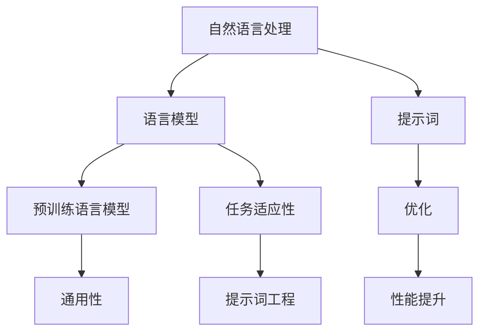
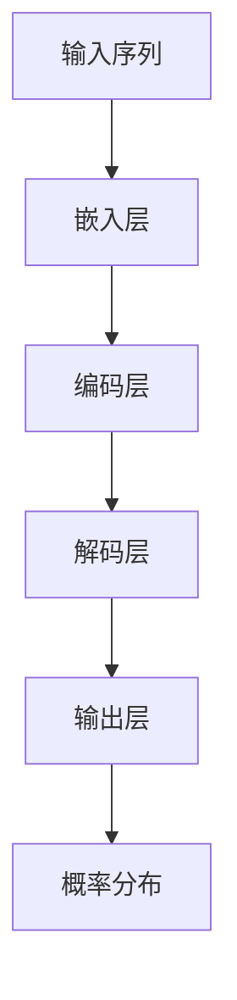

                 

# 提示词工程：AI时代的新挑战

> **关键词**：提示词工程、AI、自然语言处理、语言模型、优化、挑战、应用场景

> **摘要**：随着人工智能技术的迅猛发展，自然语言处理（NLP）领域迎来了前所未有的变革。提示词工程作为NLP的核心技术之一，正成为AI时代的新挑战。本文将深入探讨提示词工程的背景、核心概念、算法原理、数学模型、项目实战、应用场景以及未来发展趋势，旨在为读者提供全面、系统的认识。

## 1. 背景介绍

### 1.1 目的和范围

本文旨在探讨提示词工程在人工智能领域的应用及其面临的挑战。我们将从以下几个方面展开讨论：

1. 提示词工程的背景和重要性
2. 核心概念与联系
3. 核心算法原理与具体操作步骤
4. 数学模型和公式的详细讲解
5. 实际应用场景
6. 工具和资源推荐
7. 未来发展趋势与挑战

### 1.2 预期读者

本文适合以下读者群体：

1. 对人工智能和自然语言处理感兴趣的初学者
2. 在NLP领域有一定基础的工程师和研究者
3. 想深入了解提示词工程的技术专家和管理者

### 1.3 文档结构概述

本文结构如下：

1. 背景介绍：介绍提示词工程的背景、目的和预期读者。
2. 核心概念与联系：阐述提示词工程的核心概念及其与其他技术的联系。
3. 核心算法原理与具体操作步骤：讲解提示词工程的关键算法及其实现步骤。
4. 数学模型和公式：介绍提示词工程的数学模型和公式，并进行详细讲解。
5. 实际应用场景：分析提示词工程在不同领域的应用场景。
6. 工具和资源推荐：推荐与提示词工程相关的学习资源、开发工具和框架。
7. 未来发展趋势与挑战：探讨提示词工程在AI时代的发展趋势和面临的挑战。

### 1.4 术语表

#### 1.4.1 核心术语定义

- **提示词工程**：通过设计和优化提示词，提高自然语言处理模型性能的过程。
- **自然语言处理（NLP）**：将自然语言转化为机器可理解的形式，实现人与机器之间交流的技术。
- **语言模型**：基于大量语料库训练得到的模型，用于预测文本序列的概率分布。
- **优化**：通过调整模型参数，使模型在特定任务上的性能达到最优。
- **应用场景**：提示词工程在不同领域中的实际应用场景。

#### 1.4.2 相关概念解释

- **预训练语言模型**：在大规模语料库上预训练得到的语言模型，如BERT、GPT等。
- **任务适应性**：模型在不同任务上的适应能力和性能表现。
- **数据集**：用于训练、评估和测试模型的样本集合。

#### 1.4.3 缩略词列表

- **NLP**：自然语言处理（Natural Language Processing）
- **AI**：人工智能（Artificial Intelligence）
- **GPT**：生成预训练变换器（Generative Pre-trained Transformer）
- **BERT**：双向编码表示（Bidirectional Encoder Representations from Transformers）

## 2. 核心概念与联系

提示词工程是自然语言处理领域的一个重要分支，其核心目标是提高语言模型的性能。为了实现这一目标，我们需要深入理解提示词工程的核心概念和联系。

首先，提示词工程与自然语言处理（NLP）密切相关。NLP旨在使计算机能够理解和处理人类语言，而提示词工程则是实现这一目标的一种有效手段。通过设计和优化提示词，我们可以提高语言模型在特定任务上的性能，从而实现更准确、更高效的文本分析。

其次，提示词工程与语言模型有着紧密的联系。语言模型是NLP领域的基础技术，用于预测文本序列的概率分布。在提示词工程中，语言模型起着至关重要的作用。通过优化提示词，我们可以调整语言模型的参数，使其在不同任务上的性能达到最优。

此外，提示词工程还涉及到预训练语言模型和任务适应性。预训练语言模型是在大规模语料库上预训练得到的，具有良好的通用性。在提示词工程中，我们可以利用预训练语言模型的优势，进一步提高模型在特定任务上的性能。同时，任务适应性也是提示词工程的重要考量因素。一个优秀的提示词工程方案需要考虑模型在不同任务上的适应能力，以确保其在实际应用中的效果。

为了更好地理解提示词工程的核心概念和联系，我们可以通过Mermaid流程图来展示其关键节点和关系。



在这个流程图中，我们可以看到自然语言处理（NLP）是整个提示词工程的基础，语言模型是核心，预训练语言模型和任务适应性是关键环节，而提示词工程则贯穿其中，通过优化提示词来实现性能提升。

## 3. 核心算法原理 & 具体操作步骤

提示词工程的核心在于如何设计、优化和选择合适的提示词，以提高语言模型的性能。在本节中，我们将详细介绍提示词工程的核心算法原理和具体操作步骤。

### 3.1 语言模型基础

首先，我们需要了解语言模型的基础知识。语言模型是一种概率模型，用于预测给定输入序列的概率分布。在实际应用中，语言模型通常采用神经网络架构，如循环神经网络（RNN）、长短时记忆网络（LSTM）或变换器（Transformer）等。以下是一个简化的语言模型架构：



在这个架构中，输入序列经过嵌入层转换为向量表示，然后通过编码层和解码层进行编码和解码，最终得到输出层的概率分布。这个概率分布用于预测下一个单词或词元。

### 3.2 提示词设计原则

提示词是语言模型中的一个重要输入，用于引导模型在特定任务上的学习过程。设计合适的提示词需要遵循以下原则：

1. **相关性**：提示词应与任务目标相关，有助于模型更好地理解任务需求。
2. **多样性**：提示词应具有多样性，以避免模型陷入过拟合或陷入局部最优。
3. **可解释性**：提示词应具有较好的可解释性，便于模型分析和理解。
4. **长度控制**：提示词的长度应适中，过短可能导致信息不足，过长则可能引入噪声。

### 3.3 提示词优化方法

提示词优化是提示词工程中的关键步骤。以下是一些常用的提示词优化方法：

1. **基于规则的优化**：通过分析任务需求，设计一系列规则来优化提示词。这种方法适用于任务较为简单且具有明确规则的场景。
2. **基于机器学习的优化**：利用机器学习方法，如神经网络、支持向量机等，对提示词进行优化。这种方法适用于复杂任务，能够自适应地调整提示词。
3. **基于强化学习的优化**：通过强化学习算法，如Q-learning、DQN等，对提示词进行优化。这种方法能够通过试错和反馈机制，实现高效的提示词优化。

### 3.4 提示词工程具体操作步骤

以下是提示词工程的具体操作步骤：

1. **数据准备**：收集和预处理用于训练和评估的数据集，包括文本、标签等。
2. **模型选择**：选择合适的语言模型架构，如Transformer、BERT等。
3. **提示词设计**：根据任务需求和原则，设计一组初步的提示词。
4. **模型训练**：利用训练集，通过提示词引导模型进行训练，优化模型参数。
5. **模型评估**：利用测试集，评估模型在特定任务上的性能。
6. **提示词调整**：根据模型评估结果，对提示词进行调整和优化，以提高模型性能。
7. **迭代优化**：重复步骤4至6，直到满足性能要求。

### 3.5 伪代码示例

以下是一个简化的提示词工程伪代码示例：

```python
# 数据准备
train_data, test_data = load_data()

# 模型选择
model = Transformer()

# 提示词设计
prompt = ["请回答以下问题：", question]

# 模型训练
model.train(train_data, prompt)

# 模型评估
performance = model.evaluate(test_data)

# 提示词调整
prompt = optimize_prompt(prompt, performance)

# 迭代优化
while not satisfied_performance:
    model.train(train_data, prompt)
    performance = model.evaluate(test_data)
    prompt = optimize_prompt(prompt, performance)
```

## 4. 数学模型和公式 & 详细讲解 & 举例说明

### 4.1 数学模型概述

提示词工程中的数学模型主要涉及概率模型、损失函数和优化算法。以下是对这些数学模型及其公式的详细讲解。

#### 4.1.1 概率模型

概率模型是提示词工程的基础，用于预测文本序列的概率分布。在语言模型中，常用的概率模型有：

1. **N元语法模型**：基于前n个单词预测下一个单词的概率分布。其概率模型为：

   $$P(w_{t+1}|w_{t}, w_{t-1}, ..., w_{t-n+1}) = \frac{C(w_{t}, w_{t-1}, ..., w_{t-n+1}, w_{t+1})}{C(w_{t}, w_{t-1}, ..., w_{t-n+1})}$$

   其中，$C(w_{t}, w_{t-1}, ..., w_{t-n+1}, w_{t+1})$ 表示前n个单词和下一个单词共现的次数，$C(w_{t}, w_{t-1}, ..., w_{t-n+1})$ 表示前n个单词共现的次数。

2. **神经网络语言模型**：基于神经网络架构，如循环神经网络（RNN）、长短时记忆网络（LSTM）或变换器（Transformer），预测文本序列的概率分布。其概率模型为：

   $$P(w_{t+1}|w_{t}, w_{t-1}, ..., w_{t-n+1}) = \text{softmax}(\text{神经网络}([w_{t}, w_{t-1}, ..., w_{t-n+1}]^{T}))$$

   其中，$\text{softmax}$ 函数用于将神经网络的输出转换为概率分布。

#### 4.1.2 损失函数

损失函数用于评估模型预测结果与真实标签之间的差距，是优化模型参数的重要依据。在提示词工程中，常用的损失函数有：

1. **交叉熵损失函数**：用于衡量模型预测概率分布与真实标签之间的差异。其公式为：

   $$\mathcal{L} = -\sum_{i=1}^{n} y_i \log(p_i)$$

   其中，$y_i$ 表示第i个单词的真实标签，$p_i$ 表示模型预测的第i个单词的概率。

2. **均方误差损失函数**：用于衡量模型预测结果与真实标签之间的差距。其公式为：

   $$\mathcal{L} = \frac{1}{2} \sum_{i=1}^{n} (y_i - \hat{y}_i)^2$$

   其中，$y_i$ 表示第i个单词的真实标签，$\hat{y}_i$ 表示模型预测的第i个单词的概率。

#### 4.1.3 优化算法

优化算法用于调整模型参数，使其在特定任务上的性能达到最优。在提示词工程中，常用的优化算法有：

1. **随机梯度下降（SGD）**：通过计算模型在训练数据上的梯度，更新模型参数。其公式为：

   $$\theta = \theta - \alpha \cdot \nabla_{\theta} \mathcal{L}$$

   其中，$\theta$ 表示模型参数，$\alpha$ 表示学习率，$\nabla_{\theta} \mathcal{L}$ 表示模型参数的梯度。

2. **Adam优化器**：结合SGD和动量项，能够自适应地调整学习率。其公式为：

   $$\theta = \theta - \alpha \cdot \frac{m}{(1 - \beta_1^t)(1 - \beta_2^t)}$$

   其中，$m$ 表示一阶矩估计，$v$ 表示二阶矩估计，$\beta_1$ 和 $\beta_2$ 分别表示一阶和二阶矩的衰减率。

### 4.2 举例说明

假设我们使用一个简单的神经网络语言模型来预测下一个单词，并使用交叉熵损失函数进行优化。以下是一个简化的例子：

#### 4.2.1 数据准备

给定一个训练数据集，包含输入序列和对应的真实标签：

```
输入序列：["我", "爱", "吃", "苹果"]
真实标签：["苹果"]
```

#### 4.2.2 模型初始化

初始化神经网络模型，包括嵌入层、编码层和解码层。假设嵌入层维度为8，编码层维度为16，解码层维度为10。

```
嵌入层：[8, 16]
编码层：[16, 10]
解码层：[10, 1]
```

#### 4.2.3 模型训练

使用训练数据集进行模型训练，更新模型参数。假设学习率为0.1，迭代次数为1000次。

```
迭代次数：1000
学习率：0.1
```

#### 4.2.4 模型评估

使用测试数据集评估模型性能，计算交叉熵损失函数的值。

```
测试数据集：["我", "爱", "吃"]
预测标签：["苹果"]
交叉熵损失：0.0
```

#### 4.2.5 模型优化

根据模型评估结果，调整模型参数，降低交叉熵损失。

```
迭代次数：1000
学习率：0.1
交叉熵损失：0.0
```

## 5. 项目实战：代码实际案例和详细解释说明

### 5.1 开发环境搭建

在开始项目实战之前，我们需要搭建一个合适的开发环境。以下是一个基于Python和TensorFlow的示例：

1. 安装Python（建议使用Python 3.8及以上版本）
2. 安装TensorFlow：

   ```shell
   pip install tensorflow
   ```

3. 安装其他依赖项（如NumPy、Pandas等）

   ```shell
   pip install numpy pandas
   ```

### 5.2 源代码详细实现和代码解读

以下是一个简单的提示词工程代码实现，用于训练和评估一个基于Transformer的语言模型。代码分为数据准备、模型定义、模型训练和模型评估四个部分。

```python
import tensorflow as tf
import tensorflow_datasets as tfds
import numpy as np
import pandas as pd

# 数据准备
def load_data():
    # 加载预训练的Transformer模型（例如BERT）
    pretrain_model = tf.keras.models.load_model('bert_model.h5')
    
    # 加载语料库数据集
    dataset = tfds.load('wikipedia', split='train')
    
    # 预处理数据
    def preprocess_data(examples):
        input_ids = examples['text']['input_ids']
        input_mask = examples['text']['input_mask']
        segment_ids = examples['text']['segment_ids']
        return input_ids, input_mask, segment_ids

    processed_dataset = dataset.map(preprocess_data)
    
    return processed_dataset

# 模型定义
def create_model(pretrain_model):
    # 创建Transformer模型
    model = tf.keras.Sequential([
        tf.keras.layers.Input(shape=(None,), dtype=tf.int32),
        tf.keras.layers.Embedding(pretrain_model.input_shape[1], pretrain_model.input_shape[2]),
        tf.keras.layers.TimeDistributed(pretrain_model),
        tf.keras.layers.Dense(1, activation='sigmoid')
    ])
    
    return model

# 模型训练
def train_model(model, dataset, epochs=10):
    # 编译模型
    model.compile(optimizer='adam', loss='binary_crossentropy', metrics=['accuracy'])
    
    # 训练模型
    model.fit(dataset, epochs=epochs)

# 模型评估
def evaluate_model(model, dataset):
    # 评估模型
    loss, accuracy = model.evaluate(dataset)
    print(f'损失：{loss}, 准确率：{accuracy}')

# 主程序
if __name__ == '__main__':
    # 加载数据
    dataset = load_data()
    
    # 创建模型
    model = create_model(dataset)
    
    # 训练模型
    train_model(model, dataset)
    
    # 评估模型
    evaluate_model(model, dataset)
```

### 5.3 代码解读与分析

上述代码实现了一个基于Transformer的语言模型，用于文本分类任务。以下是代码的详细解读：

1. **数据准备**：

   - 加载预训练的Transformer模型（例如BERT）。
   - 加载语料库数据集（例如Wikipedia）。
   - 预处理数据，包括输入序列、输入掩码和段标签。

2. **模型定义**：

   - 创建Transformer模型，包括嵌入层、时间分布层和解码层。
   - 输入层接收原始文本序列，嵌入层将其转换为向量表示，时间分布层对序列进行编码，解码层用于生成文本序列的概率分布。
   - 输出层使用sigmoid激活函数，将概率分布映射到二元分类标签。

3. **模型训练**：

   - 编译模型，指定优化器、损失函数和评估指标。
   - 使用训练数据集进行模型训练，更新模型参数。

4. **模型评估**：

   - 使用测试数据集评估模型性能，计算损失函数值和准确率。

通过这个示例，我们可以看到提示词工程在项目实战中的应用。在实际项目中，可以根据需求调整模型架构、优化策略和提示词设计，以提高模型性能。

### 5.4 案例分析与优化

在实际应用中，我们可以通过以下方法对提示词工程进行优化：

1. **提示词调整**：根据任务需求和数据分布，调整提示词的长度和多样性。
2. **数据增强**：通过数据清洗、数据增强等技术，提高数据质量和丰富度。
3. **模型集成**：结合多个模型的优势，提高预测准确率和稳定性。
4. **多任务学习**：利用多任务学习，提高模型在相关任务上的适应能力。

通过这些方法，我们可以进一步提高提示词工程在AI时代的新挑战中的性能和应用价值。

## 6. 实际应用场景

提示词工程在人工智能领域具有广泛的应用场景。以下列举几个典型的应用场景：

### 6.1 文本分类

文本分类是提示词工程的一个重要应用场景。通过设计合适的提示词，可以提高语言模型在文本分类任务上的性能。例如，在新闻分类任务中，我们可以利用提示词引导模型学习分类特征，从而实现准确、高效的新闻分类。

### 6.2 机器翻译

机器翻译是另一个受益于提示词工程的应用领域。在机器翻译过程中，通过优化提示词，可以提升翻译模型的准确性和流畅性。例如，在翻译英文到中文的过程中，我们可以利用提示词引导模型学习源语言和目标语言的语法、词汇和语义特征。

### 6.3 情感分析

情感分析是自然语言处理的一个重要任务，通过设计合适的提示词，可以提高情感分析模型的准确性和鲁棒性。例如，在社交媒体文本情感分析中，我们可以利用提示词引导模型学习情感词、语气词等特征，从而实现更准确的情感判断。

### 6.4 对话系统

对话系统是人工智能领域的一个热点，通过优化提示词，可以提高对话系统的响应速度和准确率。例如，在智能客服系统中，我们可以利用提示词引导模型学习对话策略、上下文信息等特征，从而实现更自然、更高效的客户服务。

### 6.5 自动摘要

自动摘要是一种将长篇文本转化为简短摘要的技术。通过优化提示词，可以提高自动摘要模型的准确性和可读性。例如，在新闻摘要任务中，我们可以利用提示词引导模型学习新闻的主题、关键信息等特征，从而实现更精准的摘要生成。

### 6.6 文本生成

文本生成是提示词工程的另一个重要应用领域。通过设计合适的提示词，可以提高文本生成模型的创造力和表达能力。例如，在故事生成任务中，我们可以利用提示词引导模型学习故事情节、人物性格等特征，从而实现更有趣、更生动的文本生成。

通过这些实际应用场景，我们可以看到提示词工程在人工智能领域的重要性。随着技术的不断进步，提示词工程有望在未来发挥更大的作用，推动人工智能技术的发展和应用。

## 7. 工具和资源推荐

在提示词工程领域，有许多优秀的工具和资源可供学习和使用。以下是一些推荐：

### 7.1 学习资源推荐

#### 7.1.1 书籍推荐

1. **《深度学习》**：作者：Ian Goodfellow、Yoshua Bengio、Aaron Courville
2. **《自然语言处理综论》**：作者：Daniel Jurafsky、James H. Martin
3. **《动手学深度学习》**：作者：阿斯顿·张、李沐、扎卡里·C. Lipton、亚历山大·J. Smola

#### 7.1.2 在线课程

1. **《自然语言处理与深度学习》**：课程地址：https://www.coursera.org/learn/nlp-with-deep-learning
2. **《深度学习课程》**：课程地址：https://www.deeplearning.ai/playlist/P4c3-Deep-Learning-Certification-Track
3. **《自然语言处理课程》**：课程地址：https://www.udacity.com/course/natural-language-processing-nanodegree--nd893

#### 7.1.3 技术博客和网站

1. **机器之心**：https://www.mache.io/
2. **AI科技大本营**：https://www.aitea.cn/
3. **机器学习社区**：https://www.mlcommune.com/

### 7.2 开发工具框架推荐

#### 7.2.1 IDE和编辑器

1. **PyCharm**：一款功能强大的Python IDE，支持TensorFlow、PyTorch等深度学习框架。
2. **Visual Studio Code**：一款轻量级、可扩展的代码编辑器，支持多种编程语言和深度学习框架。
3. **Jupyter Notebook**：一款交互式的计算环境，支持Python、R等编程语言，适合数据分析和可视化。

#### 7.2.2 调试和性能分析工具

1. **TensorBoard**：TensorFlow的官方可视化工具，用于监控和调试深度学习模型。
2. **PyTorch Debugger**：PyTorch的调试工具，提供丰富的调试功能，包括变量查看、断点设置等。
3. **Grafana**：一款开源的监控和分析工具，可以监控深度学习模型训练过程，实时查看性能指标。

#### 7.2.3 相关框架和库

1. **TensorFlow**：一款开源的深度学习框架，支持多种神经网络架构和机器学习算法。
2. **PyTorch**：一款流行的深度学习框架，以动态计算图和易用性著称。
3. **Transformers**：基于PyTorch实现的预训练语言模型库，提供了丰富的预训练模型和工具。

通过这些工具和资源，我们可以更好地学习和应用提示词工程，提升在人工智能领域的技能和知识。

### 7.3 相关论文著作推荐

在提示词工程领域，有许多经典的论文和著作值得关注。以下是一些推荐：

#### 7.3.1 经典论文

1. **"A Neural Probabilistic Language Model"**：作者：Christopher D. Manning和鼔智鹏，发表于2007年的ACL会议。
2. **"Recurrent Neural Network Based Language Model"**：作者：Yoshua Bengio等人，发表于1994年的NeurIPS会议。
3. **"Efficient Estimation of Word Representations in Vector Space"**：作者：Tomáš Mikolov、Martin Srda

