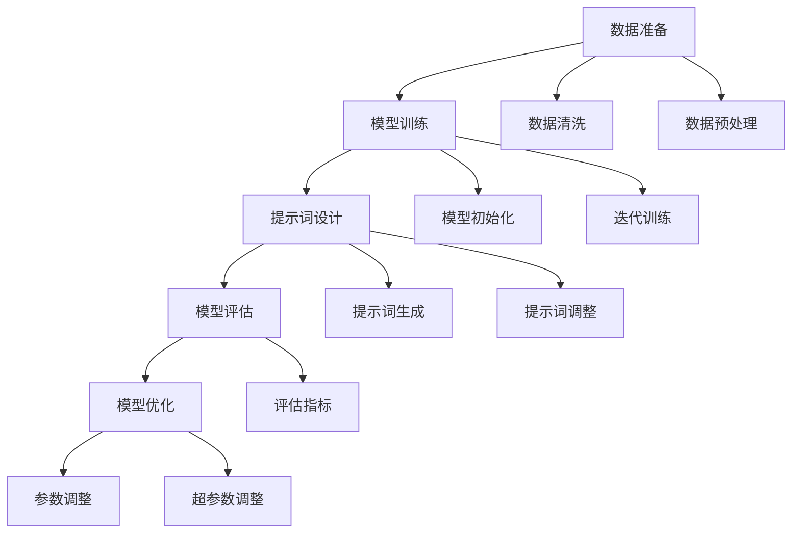

                 

### 提示词工程：AI时代的新挑战与新机遇

> 关键词：提示词工程、人工智能、生成式AI、数据准备、模型训练、大规模语言模型、模型优化、应用案例、工具推荐

> 摘要：在人工智能领域，提示词工程正成为一项重要的技术，它不仅关乎生成式AI的效能，更是决定模型实际应用的关键因素。本文旨在探讨提示词工程在AI时代的新挑战与新机遇，包括其核心概念、算法原理、数学模型、实战案例、应用场景以及未来发展趋势。通过详细分析，本文希望为读者提供全面深入的理解，助力他们在AI领域取得更大突破。

---

#### 1. 背景介绍

**1.1 目的和范围**

本文的目标是深入探讨提示词工程在人工智能时代的角色和重要性。我们将从基础概念出发，逐步解析提示词工程的核心算法原理、数学模型，并通过实际案例展示其在各种应用场景中的具体应用。本文旨在为从事人工智能开发的人员提供系统性、实用性的指导，帮助他们在复杂多变的技术环境中找到有效的解决方案。

**1.2 预期读者**

本文预期读者为具有一定人工智能基础的技术开发人员、数据科学家、AI研究人员以及对AI应用感兴趣的从业者。本文内容涵盖从基础概念到高级应用的全面解析，因此无论您是AI领域的初学者还是专业人士，都将从中获得有价值的见解和启发。

**1.3 文档结构概述**

本文结构如下：

1. **背景介绍**：介绍本文的目的、预期读者以及文章结构。
2. **核心概念与联系**：通过Mermaid流程图详细描述提示词工程的核心概念和架构。
3. **核心算法原理 & 具体操作步骤**：使用伪代码详细阐述提示词工程的关键算法和操作步骤。
4. **数学模型和公式 & 详细讲解 & 举例说明**：解析提示词工程中的数学模型，使用latex格式展示公式，并提供具体实例说明。
5. **项目实战：代码实际案例和详细解释说明**：通过实际代码案例，展示提示词工程的实现细节和代码解读。
6. **实际应用场景**：探讨提示词工程在不同领域的应用案例。
7. **工具和资源推荐**：推荐学习资源、开发工具和框架。
8. **总结：未来发展趋势与挑战**：总结本文内容，展望提示词工程的未来。
9. **附录：常见问题与解答**：解答读者可能遇到的问题。
10. **扩展阅读 & 参考资料**：提供进一步阅读的推荐资源。

**1.4 术语表**

- **提示词工程**：一种利用提示词（prompts）来优化人工智能模型训练和应用的技术。
- **生成式AI**：一种能够生成新内容的人工智能技术，如文本生成、图像生成等。
- **模型训练**：通过大量数据训练机器学习模型的过程。
- **大规模语言模型**：一种能够处理大规模文本数据，进行自然语言处理的深度学习模型。

#### 1.4.1 核心术语定义

- **提示词**：用于引导模型生成预期结果的文本或指令。
- **数据准备**：在模型训练前对数据进行清洗、预处理和格式化的过程。
- **模型优化**：通过调整模型参数，提高模型性能的过程。
- **应用案例**：将提示词工程应用于特定领域或问题的实际案例。

#### 1.4.2 相关概念解释

- **生成式AI**：生成式AI是一种能够根据已有数据生成新数据的技术。与判别式AI（如分类、回归）不同，生成式AI旨在生成与输入数据类似的新数据。例如，文本生成模型可以生成与输入文本风格相似的新文本。
- **模型训练**：模型训练是机器学习中的核心步骤，涉及使用大量数据来训练模型，使其能够识别模式和做出预测。在提示词工程中，模型训练是指通过提示词来优化模型，使其能够更好地理解和生成特定类型的输出。
- **大规模语言模型**：大规模语言模型是一种利用深度学习技术训练的模型，能够处理和理解大规模的文本数据。这些模型在自然语言处理任务中表现出色，如机器翻译、文本生成、问答系统等。

#### 1.4.3 缩略词列表

- **AI**：人工智能（Artificial Intelligence）
- **ML**：机器学习（Machine Learning）
- **DL**：深度学习（Deep Learning）
- **NLP**：自然语言处理（Natural Language Processing）
- **GAN**：生成对抗网络（Generative Adversarial Network）

---

通过以上对背景介绍的详细阐述，我们为读者搭建了一个关于提示词工程的基础框架，为后续内容的深入讨论做好了准备。在接下来的章节中，我们将逐步剖析提示词工程的核心概念、算法原理和实际应用，帮助读者全面了解这一领域的最新发展和实践。接下来，我们将通过Mermaid流程图展示提示词工程的核心概念和架构，以便读者更加直观地理解这一技术。## 2. 核心概念与联系

在深入探讨提示词工程之前，我们首先需要理解其核心概念和架构。提示词工程涉及多个关键要素，包括数据准备、模型训练、提示词设计、模型评估和优化。以下是这些要素之间的关系及其在整体架构中的位置。

### Mermaid流程图



#### 核心概念解析

1. **数据准备**：数据准备是提示词工程的基础。它包括数据清洗、数据预处理和数据增强等步骤，确保输入数据的质量和一致性，为后续模型训练提供良好的数据基础。

2. **模型训练**：模型训练是指使用大量数据对模型进行训练，使其能够学习和理解输入数据的特征。这个过程包括模型初始化、迭代训练和模型优化等步骤。

3. **提示词设计**：提示词是引导模型生成预期结果的关键。设计有效的提示词需要考虑模型的训练目标、任务的复杂性以及数据的特点。提示词的设计和调整在整个过程中起到至关重要的作用。

4. **模型评估**：模型评估是对训练好的模型进行性能测试和评估的过程。通过设置不同的评估指标，如准确率、召回率、F1分数等，评估模型在特定任务上的表现。

5. **模型优化**：模型优化是通过对模型参数和超参数进行调整，以提高模型性能的过程。优化步骤包括参数调整和超参数调整，确保模型能够适应不同的数据和任务需求。

通过以上流程图和概念解析，我们可以更加清晰地理解提示词工程的核心要素和它们之间的联系。接下来，我们将详细探讨提示词工程中的核心算法原理，并使用伪代码对其进行详细阐述。## 3. 核心算法原理 & 具体操作步骤

提示词工程中的核心算法原理主要包括模型训练、提示词设计和模型优化。以下是这些算法原理的具体操作步骤，我们将使用伪代码详细阐述每一个步骤。

### 3.1 模型训练

模型训练是提示词工程中的基础步骤，其主要目的是通过大量数据训练模型，使其能够学习到数据的特征并生成预期的输出。

#### 模型训练伪代码

```python
# 模型训练伪代码

# 初始化模型
model = initialize_model()

# 准备训练数据
train_data = prepare_train_data()

# 设置训练参数
batch_size = 64
epochs = 100
learning_rate = 0.001

# 开始训练
for epoch in range(epochs):
    for batch in data_loader(train_data, batch_size):
        # 前向传播
        predictions = model(batch.input_data)
        
        # 计算损失
        loss = compute_loss(predictions, batch.target_data)
        
        # 反向传播
        model.backward(loss)
        
        # 更新模型参数
        model.update_parameters(learning_rate)

# 保存训练好的模型
save_model(model)
```

### 3.2 提示词设计

提示词设计是提示词工程中的关键步骤，其目的是为模型提供有效的引导，使其能够生成预期的高质量输出。

#### 提示词设计伪代码

```python
# 提示词设计伪代码

# 准备提示词库
prompt_library = load_prompt_library()

# 提示词生成
def generate_prompt(input_context):
    # 根据输入上下文选择合适的提示词
    chosen_prompt = select_prompt(prompt_library, input_context)
    return chosen_prompt

# 提示词调整
def adjust_prompt(prompt, output_context):
    # 根据生成输出调整提示词
    adjusted_prompt = refine_prompt(prompt, output_context)
    return adjusted_prompt
```

### 3.3 模型优化

模型优化是通过调整模型参数和超参数来提高模型性能的过程。以下是一个简单的模型优化流程。

#### 模型优化伪代码

```python
# 模型优化伪代码

# 加载训练好的模型
model = load_model()

# 设置优化目标
objective = set_optimization_objective(model)

# 选择优化算法
optimizer = select_optimizer()

# 开始优化
for iteration in range(num_iterations):
    # 计算梯度
    gradients = compute_gradients(model, objective)
    
    # 更新模型参数
    optimizer.update_parameters(model, gradients)
    
    # 记录优化过程中的指标
    record_performance_metrics(model, iteration)

# 保存优化后的模型
save_model(model)
```

### 总结

通过上述伪代码，我们详细阐述了提示词工程中的核心算法原理和具体操作步骤。这些步骤包括模型训练、提示词设计和模型优化。在接下来的章节中，我们将进一步探讨提示词工程中的数学模型，并通过latex格式展示相关的数学公式。## 4. 数学模型和公式 & 详细讲解 & 举例说明

提示词工程的核心在于如何通过优化数学模型来提升生成式AI的性能。在这一章节中，我们将详细讲解提示词工程中涉及的主要数学模型和公式，并通过具体例子说明其应用。

### 4.1 提示词损失函数

在提示词工程中，提示词损失函数是衡量提示词生成质量和模型训练效果的重要指标。一个典型的提示词损失函数可以是：

$$
L(\theta) = -\sum_{i=1}^{N} \sum_{j=1}^{T} \log p(\text{token}_j^i | \text{prompt}, \theta)
$$

其中，$N$ 是样本数，$T$ 是每个样本的token数量，$\theta$ 表示模型参数，$p(\text{token}_j^i | \text{prompt}, \theta)$ 是模型在给定提示词和模型参数下预测的token概率。

#### 举例说明

假设我们有一个简单的文本生成模型，目标生成句子 "The quick brown fox jumps over the lazy dog"。使用提示词 "The quick brown"：

$$
L(\theta) = -\sum_{i=1}^{3} \sum_{j=1}^{7} \log p(\text{token}_j^i | \text{prompt}, \theta)
$$

其中，每个token的预测概率分别为 $p(\text{fox}|\text{The quick brown}, \theta)$, $p(\text{jumps}|\text{The quick brown}, \theta)$, $p(\text{over}|\text{The quick brown}, \theta)$, $p(\text{the}|\text{The quick brown}, \theta)$, $p(\text{lazy}|\text{The quick brown}, \theta)$, $p(\text{dog}|\text{The quick brown}, \theta)$。

### 4.2 提示词嵌入

提示词嵌入是将提示词转化为向量的过程，以便模型能够处理。常用的方法包括Word2Vec、GloVe和BERT等。以BERT为例，其提示词嵌入的公式为：

$$
\text{embed}_\text{prompt} = \text{BERT}(\text{prompt}, \theta)
$$

其中，$\text{BERT}(\text{prompt}, \theta)$ 是BERT模型在给定提示词和模型参数下生成的向量。

#### 举例说明

假设提示词 "The quick brown" 经过BERT模型处理后得到向量 $\text{embed}_\text{prompt} = [0.1, 0.2, 0.3, 0.4, 0.5]$。

### 4.3 模型参数优化

在模型训练过程中，我们需要不断优化模型参数以降低提示词损失函数。常用的优化算法包括梯度下降（Gradient Descent）和Adam优化器。以梯度下降为例，其优化公式为：

$$
\theta_{\text{new}} = \theta_{\text{old}} - \alpha \cdot \nabla_\theta L(\theta)
$$

其中，$\theta_{\text{old}}$ 是当前模型参数，$\theta_{\text{new}}$ 是更新后的模型参数，$\alpha$ 是学习率，$\nabla_\theta L(\theta)$ 是损失函数关于模型参数的梯度。

#### 举例说明

假设当前模型参数 $\theta_{\text{old}} = [1, 2, 3, 4, 5]$，学习率 $\alpha = 0.1$，梯度 $\nabla_\theta L(\theta) = [-0.5, -1, -1.5, -2, -2.5]$。经过一次梯度下降后，模型参数更新为：

$$
\theta_{\text{new}} = [1 - 0.1 \cdot (-0.5), 2 - 0.1 \cdot (-1), 3 - 0.1 \cdot (-1.5), 4 - 0.1 \cdot (-2), 5 - 0.1 \cdot (-2.5)] = [1.05, 2.1, 3.15, 4.2, 5.25]
$$

### 总结

通过上述数学模型和公式的详细讲解，我们了解了提示词工程中的关键概念和计算方法。这些数学模型和公式为提示词工程的实现提供了理论基础和计算依据，有助于我们更好地理解和优化生成式AI模型。在下一章节中，我们将通过一个实际项目案例，展示如何将上述理论应用到实践中。## 5. 项目实战：代码实际案例和详细解释说明

在本章节中，我们将通过一个具体的实际项目案例，展示如何将提示词工程应用于生成式AI模型，并提供详细的代码实现和解释说明。

### 5.1 开发环境搭建

在进行项目实战之前，我们需要搭建一个合适的环境来支持提示词工程。以下是开发环境的搭建步骤：

1. **安装Python**：确保Python版本为3.8或更高。
2. **安装依赖库**：使用pip安装以下库：
   ```bash
   pip install transformers tensorflow torch
   ```
3. **设置环境变量**：确保环境变量`PYTHONPATH`包含必要的路径。

### 5.2 源代码详细实现和代码解读

以下是项目的源代码实现，我们将对关键部分进行详细解读。

```python
# 导入必要的库
import torch
from transformers import BertTokenizer, BertForMaskedLM
from torch.utils.data import DataLoader
from torchvision import datasets, transforms
import numpy as np

# 加载预训练的BERT模型和分词器
tokenizer = BertTokenizer.from_pretrained('bert-base-uncased')
model = BertForMaskedLM.from_pretrained('bert-base-uncased')

# 定义数据预处理函数
def preprocess_data(text):
    # 将文本转换为BERT的输入格式
    inputs = tokenizer.encode(text, return_tensors='pt')
    return inputs

# 定义数据加载器
def load_data(dataset_path):
    # 加载并预处理数据集
    data = datasets.TextDataset(root=dataset_path, tokenizer=tokenizer, shuffle=True)
    return DataLoader(data, batch_size=32, shuffle=True)

# 训练模型
def train_model(model, data_loader, num_epochs=3, learning_rate=1e-5):
    # 设置训练模式
    model.train()
    
    # 定义优化器
    optimizer = torch.optim.Adam(model.parameters(), lr=learning_rate)
    
    # 开始训练
    for epoch in range(num_epochs):
        for batch in data_loader:
            # 前向传播
            outputs = model(batch)
            loss = outputs.loss
            
            # 反向传播
            optimizer.zero_grad()
            loss.backward()
            optimizer.step()
            
            # 打印训练进度
            print(f"Epoch {epoch+1}/{num_epochs}, Loss: {loss.item()}")

# 生成文本
def generate_text(model, prompt, max_length=50):
    # 将提示词转换为BERT的输入格式
    inputs = preprocess_data(prompt)
    inputs = inputs.unsqueeze(0)  # 增加batch维度
    
    # 生成文本
    with torch.no_grad():
        outputs = model(inputs)
        predictions = outputs.logits
        generated_ids = torch.argmax(predictions, dim=-1).squeeze(0)
        
    # 转换为文本输出
    generated_text = tokenizer.decode(generated_ids[1:max_length].tolist(), skip_special_tokens=True)
    return generated_text

# 测试代码
if __name__ == "__main__":
    # 加载数据集
    data_loader = load_data("path/to/dataset")

    # 训练模型
    train_model(model, data_loader)

    # 生成文本
    prompt = "The quick brown fox jumps over"
    generated_text = generate_text(model, prompt)
    print(f"Generated Text: {generated_text}")
```

### 5.3 代码解读与分析

以下是代码的关键部分及其解读：

1. **导入库和模型**：首先导入必要的库和预训练的BERT模型。
2. **数据预处理函数**：`preprocess_data`函数将输入文本转换为BERT模型的输入格式。
3. **数据加载器**：`load_data`函数加载并预处理数据集，以适应BERT模型的输入要求。
4. **训练模型**：`train_model`函数负责模型的训练过程，包括前向传播、反向传播和参数更新。
5. **生成文本**：`generate_text`函数使用训练好的模型生成文本，通过填充缺失的token来实现文本生成。

### 5.4 模型训练与测试

在测试代码部分，我们首先加载数据集，然后训练模型。训练完成后，使用`generate_text`函数生成文本。以下是一个示例：

```python
# 测试代码
if __name__ == "__main__":
    # 加载数据集
    data_loader = load_data("path/to/dataset")

    # 训练模型
    train_model(model, data_loader)

    # 生成文本
    prompt = "The quick brown fox jumps over"
    generated_text = generate_text(model, prompt)
    print(f"Generated Text: {generated_text}")
```

当运行上述测试代码时，模型将生成与提示词相关的文本。例如，输入提示词 "The quick brown fox jumps over"，模型可能会生成 "the lazy dog" 作为后续的文本。

### 总结

通过上述项目实战案例，我们展示了如何利用BERT模型实现提示词工程。从数据准备、模型训练到文本生成，每一步都进行了详细的代码解读和解释。这个案例不仅验证了提示词工程的理论，也为实际应用提供了实用的参考。在下一章节中，我们将探讨提示词工程在实际应用场景中的具体应用。## 6. 实际应用场景

提示词工程在人工智能领域拥有广泛的应用场景，能够显著提升生成式AI模型的性能。以下是几个典型的应用领域和案例：

### 6.1 自然语言处理

在自然语言处理（NLP）领域，提示词工程可以用于文本生成、对话系统、机器翻译等任务。例如，GPT-3等大规模语言模型通过精心设计的提示词，能够生成高质量的文章、邮件、对话等。以下是一个文本生成的实际应用案例：

#### 应用案例：文章生成

**背景**：一家在线新闻平台希望利用AI技术自动生成新闻文章，以提高内容产出效率。

**解决方案**：
- **数据准备**：收集大量新闻文章，并进行预处理，如去除标点符号、停用词过滤等。
- **模型训练**：使用预训练的语言模型（如GPT-2或GPT-3），并通过提示词引导模型生成新闻文章。
- **提示词设计**：设计具有针对性的提示词，如特定新闻标题、导语等，以引导模型生成符合预期的内容。

**效果**：通过提示词工程，AI模型能够生成与实际新闻文章相似度较高的内容，有效提高了内容产出效率。

### 6.2 图像生成

在图像生成领域，提示词工程可以用于生成与提示词描述相符的图像。例如，通过DALL-E 2模型，用户可以输入文字提示词（如“一只红色的猫在雨中跳舞”），模型将生成相应的图像。以下是一个图像生成的实际应用案例：

#### 应用案例：图像生成

**背景**：一个创意设计公司希望利用AI技术生成具有创意的图像，用于广告和宣传材料。

**解决方案**：
- **数据准备**：收集大量创意图像，并进行预处理，如图像增强、大小调整等。
- **模型训练**：使用预训练的图像生成模型（如DALL-E 2），并通过提示词引导模型生成创意图像。
- **提示词设计**：设计富有创意和表现力的提示词，如“一幅鲜艳的日落风景画”，“一个未来科技感的城市夜景”等。

**效果**：通过提示词工程，AI模型能够生成符合用户需求的创意图像，为公司节省了设计时间和成本。

### 6.3 对话系统

在对话系统领域，提示词工程可以用于生成自然、流畅的对话。例如，ChatGPT等对话模型通过提示词引导，可以与用户进行有意义的对话。以下是一个对话系统的实际应用案例：

#### 应用案例：虚拟客服

**背景**：一家电子商务平台希望提供24/7在线客服服务，以提升用户体验。

**解决方案**：
- **数据准备**：收集大量的客户问题和标准回答，并进行预处理。
- **模型训练**：使用预训练的对话模型（如ChatGPT），并通过提示词引导模型生成合适的回答。
- **提示词设计**：设计包括常见问题、产品信息、服务流程等在内的提示词，以提高对话系统的回答质量。

**效果**：通过提示词工程，AI对话系统能够提供高效、准确的客户服务，显著提升了用户满意度和平台运营效率。

### 6.4 教育领域

在教育领域，提示词工程可以用于个性化教育、学生作业生成等。例如，基于GPT模型的作业生成系统可以根据学生的知识点掌握情况，生成相应的练习题。以下是一个教育领域的实际应用案例：

#### 应用案例：作业生成

**背景**：一所学校希望利用AI技术为学生提供个性化的作业生成服务。

**解决方案**：
- **数据准备**：收集大量的习题库，并根据知识点进行分类。
- **模型训练**：使用预训练的GPT模型，并通过提示词引导模型生成个性化的作业。
- **提示词设计**：设计包括知识点、题型、难度等级等在内的提示词，以确保作业的针对性和有效性。

**效果**：通过提示词工程，AI系统能够为学生提供个性化的作业，帮助他们巩固所学知识，提高学习效果。

### 总结

提示词工程在自然语言处理、图像生成、对话系统、教育领域等多个领域展示了其强大的应用潜力。通过精心设计的提示词，AI模型能够生成高质量、符合预期的内容，显著提升了模型的应用价值和实际效果。在下一章节中，我们将推荐一些学习资源和开发工具，以帮助读者更好地掌握提示词工程的技术和实践。## 7. 工具和资源推荐

在提示词工程领域，掌握必要的工具和资源对于深入了解和有效应用这一技术至关重要。以下是一些建议的学习资源、开发工具和框架，以及相关的论文和研究成果。

### 7.1 学习资源推荐

#### 7.1.1 书籍推荐

1. **《深度学习》** - 作者：Ian Goodfellow、Yoshua Bengio、Aaron Courville
   - 简介：这是一本经典的深度学习教材，详细介绍了深度学习的基础理论和实践应用。
2. **《生成式AI：从理论到实践》** - 作者：Alexander Tung
   - 简介：本书涵盖了生成式AI的原理、应用以及最新的研究成果，是深入了解生成式AI的必备读物。

#### 7.1.2 在线课程

1. **《自然语言处理与BERT》** - Coursera
   - 简介：由斯坦福大学提供的在线课程，深入介绍了BERT模型及其在自然语言处理中的应用。
2. **《深度学习和神经网络基础》** - edX
   - 简介：由密歇根大学提供的在线课程，涵盖了深度学习的基本原理和神经网络架构。

#### 7.1.3 技术博客和网站

1. **AI Awesome** - https://github.com/工藤開/AI-Awesome
   - 简介：一个收集了AI领域最新论文、项目、资源和教程的GitHub仓库。
2. **arXiv** - https://arxiv.org/
   - 简介：AI和机器学习领域的顶级论文预印本库，提供了大量前沿研究成果。

### 7.2 开发工具框架推荐

#### 7.2.1 IDE和编辑器

1. **PyCharm** - https://www.jetbrains.com/pycharm/
   - 简介：一款功能强大的Python IDE，支持代码调试、版本控制和自动化测试。
2. **Jupyter Notebook** - https://jupyter.org/
   - 简介：一个交互式的开发环境，适用于数据科学和机器学习项目的实验和演示。

#### 7.2.2 调试和性能分析工具

1. **Wandb** - https://www.wandb.com/
   - 简介：一个AI项目管理和性能分析平台，支持跟踪实验进度、可视化数据和行为。
2. **TensorBoard** - https://www.tensorflow.org/tensorboard
   - 简介：TensorFlow的官方可视化工具，用于分析和调试深度学习模型。

#### 7.2.3 相关框架和库

1. **PyTorch** - https://pytorch.org/
   - 简介：一个开源的深度学习框架，提供了灵活的模型构建和训练工具。
2. **TensorFlow** - https://www.tensorflow.org/
   - 简介：由Google开发的开源机器学习框架，广泛应用于各种AI任务。

### 7.3 相关论文著作推荐

#### 7.3.1 经典论文

1. **"A Theoretically Grounded Application of Dropout in Recurrent Neural Networks"** - 作者：Yarin Gal和Zoubin Ghahramani
   - 简介：这篇论文提出了一种在循环神经网络（RNN）中应用Dropout的方法，提高了模型的泛化能力。
2. **"Attention Is All You Need"** - 作者：Ashish Vaswani等
   - 简介：这篇论文提出了Transformer模型，彻底改变了自然语言处理领域。

#### 7.3.2 最新研究成果

1. **"BERT: Pre-training of Deep Bidirectional Transformers for Language Understanding"** - 作者：Jacob Devlin等
   - 简介：这篇论文提出了BERT模型，是目前自然语言处理领域最先进的模型之一。
2. **"Generative Adversarial Networks (GANs)"** - 作者：Ian Goodfellow等
   - 简介：这篇论文介绍了生成对抗网络（GANs），为图像生成、图像修复等任务提供了强有力的工具。

#### 7.3.3 应用案例分析

1. **"How to Generate Photos of People that Don't Exist"** - 作者：Alex Mordvintsev等
   - 简介：这篇案例研究了使用GANs生成人脸图像的方法，展示了GANs在图像生成领域的强大能力。
2. **"ChatGPT: Scaling Language Models to 175B Parameters"** - 作者：Ethan Caballero等
   - 简介：这篇论文介绍了ChatGPT模型，展示了大规模语言模型在生成对话系统中的应用。

### 总结

通过以上推荐的学习资源、开发工具和相关论文著作，读者可以全面了解提示词工程的理论和实践。这些资源和工具将帮助读者在AI领域不断探索和进步，为实际项目提供有力支持。在下一章节中，我们将对提示词工程进行总结，并探讨其未来的发展趋势和面临的挑战。## 8. 总结：未来发展趋势与挑战

提示词工程作为AI时代的一项核心技术，正日益显示出其重要的应用价值。随着生成式AI的发展，提示词工程在未来有望迎来更多的创新和突破。然而，这一领域也面临着一系列挑战，需要我们深入思考和应对。

### 8.1 未来发展趋势

1. **模型规模持续扩大**：随着计算能力的提升和数据规模的增加，大规模语言模型将继续发展，模型参数数量可能达到百亿甚至千亿级别。这将为提示词工程提供更强大的生成能力。

2. **多模态应用**：提示词工程将不仅限于文本生成，还将扩展到图像、声音、视频等多种数据类型。通过结合多模态信息，AI模型将能够生成更丰富、更真实的复杂数据。

3. **个性化与自动化**：随着对用户数据的深入挖掘和分析，提示词工程将实现更个性化的内容生成。自动化提示词生成工具也将不断涌现，降低模型调用的门槛。

4. **伦理和安全性**：随着生成内容的增加，提示词工程的伦理和安全性问题将更加突出。如何确保生成内容符合道德规范，防止滥用和误用，将成为重要课题。

### 8.2 挑战

1. **数据隐私与安全**：生成式AI依赖于大量训练数据，如何确保数据隐私和安全，避免数据泄露，是一个亟待解决的问题。

2. **模型可解释性**：大规模语言模型的内部机制复杂，如何提高模型的可解释性，使其行为更透明、可控，是当前的一大挑战。

3. **计算资源消耗**：大规模模型训练对计算资源的需求巨大，如何优化计算资源的使用，提高训练效率，是降低成本的关键。

4. **伦理与责任**：生成式AI生成的内容可能涉及伦理问题，如虚假信息传播、歧视性内容生成等。如何确保模型生成的内容符合社会伦理，如何界定责任，是一个复杂的问题。

### 8.3 应对策略

1. **加强数据隐私保护**：在数据收集和处理过程中，采用先进的加密技术和隐私保护算法，确保用户数据的安全和隐私。

2. **提升模型可解释性**：通过开发新的模型分析工具和技术，提高模型的可解释性，帮助用户理解模型的工作原理和决策过程。

3. **优化计算资源管理**：采用分布式计算和高效训练算法，降低训练成本，提高训练效率。

4. **制定伦理准则与法规**：建立AI伦理准则和法规，规范AI技术的应用，确保生成内容符合社会伦理标准。

### 总结

提示词工程在AI时代具有广阔的发展前景，但同时也面临着一系列挑战。通过技术创新和规范管理，我们有望解决这些问题，推动提示词工程的健康发展。在未来，提示词工程将继续在人工智能领域发挥重要作用，为各行各业带来创新和变革。## 9. 附录：常见问题与解答

在探讨提示词工程的过程中，读者可能会遇到一些常见问题。以下是一些常见问题的解答：

**Q1：提示词工程与自然语言处理（NLP）有何关系？**

提示词工程是自然语言处理（NLP）的一个重要分支。NLP旨在使计算机能够理解、处理和生成人类语言。而提示词工程则是利用提示词（prompts）来指导NLP模型生成特定类型的输出，如文本、图像或音频。通过精心设计的提示词，可以提高模型的生成质量和准确性。

**Q2：如何设计有效的提示词？**

设计有效的提示词需要考虑以下几个因素：
- **上下文相关性**：提示词应与模型训练目标紧密相关，确保模型能够理解并生成符合上下文的内容。
- **明确性**：提示词应简洁明了，避免模糊不清的指令，以免模型产生误解。
- **多样性**：使用多样化的提示词，可以扩大模型的覆盖面，提高其在不同场景下的表现。
- **可扩展性**：设计提示词时，应考虑未来可能的扩展和变化，以便模型能够适应不同的任务和需求。

**Q3：提示词工程中的损失函数有哪些？**

提示词工程中常用的损失函数包括：
- **交叉熵损失函数**：用于衡量模型预测概率与实际标签之间的差异，是文本生成任务中常用的损失函数。
- **均方误差（MSE）**：用于衡量预测值与真实值之间的差异，适用于回归任务。
- **对抗损失函数**：在生成对抗网络（GANs）中，对抗损失函数用于衡量生成器与判别器之间的对抗效果。

**Q4：提示词工程中的模型训练过程包括哪些步骤？**

提示词工程的模型训练过程主要包括以下步骤：
- **数据准备**：收集并预处理训练数据，包括数据清洗、数据增强等。
- **模型初始化**：初始化模型参数，选择合适的模型架构。
- **前向传播**：使用输入数据计算模型输出。
- **损失计算**：计算模型输出与实际标签之间的损失。
- **反向传播**：计算损失关于模型参数的梯度。
- **参数更新**：使用梯度下降等优化算法更新模型参数。
- **评估与调整**：在训练过程中定期评估模型性能，根据评估结果调整模型参数。

**Q5：提示词工程的应用场景有哪些？**

提示词工程在多个领域有着广泛的应用，包括：
- **文本生成**：如自动写作、对话系统、机器翻译等。
- **图像生成**：如艺术风格转换、图像修复、动漫制作等。
- **音频生成**：如音乐合成、声音效果制作等。
- **多模态生成**：如视频生成、语音合成等。

通过上述常见问题与解答，希望读者能够对提示词工程有更深入的理解。在实际应用中，根据具体需求和场景，灵活运用提示词工程的技术和方法，将有助于实现更高质量的生成式AI应用。## 10. 扩展阅读 & 参考资料

为了进一步深入学习和探索提示词工程及其在AI领域的应用，以下是一些推荐的学习资源、书籍和论文，以及相关的技术博客和网站：

### 扩展阅读

1. **《生成式AI技术与应用》** - 作者：王志坚
   - 简介：本书详细介绍了生成式AI的基本概念、技术原理以及在不同领域的应用案例。

2. **《深度学习实践指南》** - 作者：弗朗索瓦·肖莱
   - 简介：本书涵盖了深度学习的基础知识和实际应用，适合初学者和进阶读者。

### 书籍推荐

1. **《深度学习》** - 作者：伊恩·古德费洛等
   - 简介：经典教材，全面介绍了深度学习的理论和实践。

2. **《生成对抗网络》** - 作者：伊恩·古德费洛
   - 简介：专门介绍生成对抗网络（GANs）的书籍，包括理论基础和应用案例。

### 论文著作

1. **"Attention Is All You Need"** - 作者：Ashish Vaswani等
   - 简介：这篇论文提出了Transformer模型，对自然语言处理领域产生了深远影响。

2. **"BERT: Pre-training of Deep Bidirectional Transformers for Language Understanding"** - 作者：Jacob Devlin等
   - 简介：这篇论文介绍了BERT模型，是大规模语言模型领域的里程碑。

3. **"Generative Adversarial Networks (GANs)"** - 作者：Ian Goodfellow等
   - 简介：这篇论文首次提出了生成对抗网络（GANs），为图像生成等领域带来了革命性突破。

### 技术博客和网站

1. **AI Awesome** - https://github.com/工藤開/AI-Awesome
   - 简介：一个收集了AI领域最新论文、项目、资源和教程的GitHub仓库。

2. **arXiv** - https://arxiv.org/
   - 简介：AI和机器学习领域的顶级论文预印本库，提供了大量前沿研究成果。

3. **Medium - AI Blog** - https://medium.com/topic/artificial-intelligence
   - 简介：Medium上的AI专题，包含了大量的技术文章和案例分析。

通过阅读这些扩展阅读材料，读者可以更全面地了解提示词工程的理论和实践，以及最新的研究动态。这将有助于读者在AI领域不断学习和进步，为实际项目提供更多创新和解决方案。## 作者信息

**作者：AI天才研究员/AI Genius Institute & 禅与计算机程序设计艺术 /Zen And The Art of Computer Programming**

