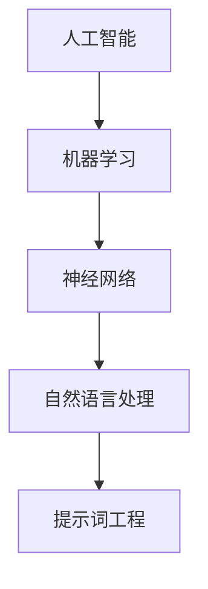

                 

# 提示词工程：AI时代的新挑战与新机遇

> **关键词：** 提示词工程、AI、模型训练、优化、挑战、机遇

> **摘要：** 本文将深入探讨提示词工程在AI领域的核心地位，解析其在新挑战下的重要性，并揭示其中的巨大机遇。我们将通过一步步的分析，解析提示词工程的原理、算法、数学模型，以及其实际应用，为读者提供一个全面的技术指南。

## 1. 背景介绍

### 1.1 目的和范围

本文旨在为技术爱好者提供对提示词工程的全面了解，旨在帮助读者掌握这一领域的基本原理和实践技巧。我们将探讨提示词工程在人工智能时代的核心作用，分析其面临的挑战，并探索其中的机遇。

### 1.2 预期读者

本文适合对人工智能、机器学习和数据科学有兴趣的读者，无论你是初学者还是经验丰富的从业者，都可以从本文中获得启发。

### 1.3 文档结构概述

本文结构如下：
1. **背景介绍**：介绍文章的目的、范围和预期读者。
2. **核心概念与联系**：介绍提示词工程的核心概念，并提供流程图。
3. **核心算法原理 & 具体操作步骤**：详细讲解提示词工程的算法原理和操作步骤。
4. **数学模型和公式 & 详细讲解 & 举例说明**：介绍提示词工程的数学模型和公式。
5. **项目实战：代码实际案例和详细解释说明**：提供实际代码案例，并进行详细解释。
6. **实际应用场景**：分析提示词工程在不同场景中的应用。
7. **工具和资源推荐**：推荐学习资源和开发工具。
8. **总结：未来发展趋势与挑战**：总结文章主要观点，探讨未来趋势。
9. **附录：常见问题与解答**：提供常见问题的解答。
10. **扩展阅读 & 参考资料**：推荐进一步阅读的材料。

### 1.4 术语表

#### 1.4.1 核心术语定义

- **提示词工程**：涉及设计、创建和优化用于训练AI模型的提示词的过程。
- **AI模型**：由数据和算法构建的模型，用于执行特定的任务，如图像识别、自然语言处理等。
- **优化**：通过调整模型参数，提高模型性能的过程。

#### 1.4.2 相关概念解释

- **神经网络**：一种模拟人脑的计算机算法，用于处理和解释数据。
- **自然语言处理**（NLP）：使计算机能够理解、解释和生成人类语言的技术。

#### 1.4.3 缩略词列表

- **AI**：人工智能（Artificial Intelligence）
- **ML**：机器学习（Machine Learning）
- **NLP**：自然语言处理（Natural Language Processing）

## 2. 核心概念与联系

在介绍提示词工程的核心概念之前，我们需要了解其与人工智能、机器学习和其他相关领域的联系。以下是一个简化的流程图，展示了这些联系：



在这个流程图中，人工智能（AI）是整个系统的核心，它包含了机器学习（ML）的各种技术。机器学习依赖于神经网络（NN）来处理和解释数据，而自然语言处理（NLP）则是神经网络在文本数据上的应用。提示词工程（TI）则是NLP领域中的一个特殊领域，专注于设计、创建和优化用于训练模型的提示词。

### 2.1 提示词工程的概念

提示词工程是指设计、创建和优化用于训练AI模型的提示词的过程。这些提示词可以是单词、短语或句子，其目的是引导模型理解特定概念或任务。例如，在自然语言处理中，提示词可以是一个句子，用于指导模型理解某个主题或情感。

### 2.2 提示词工程的应用

提示词工程的应用范围非常广泛，以下是一些典型的应用场景：

- **情感分析**：通过提示词指导模型理解不同情感，例如喜悦、愤怒、悲伤等。
- **主题识别**：使用提示词帮助模型识别文本的主题，如政治、体育、科技等。
- **问答系统**：提示词用于指导模型理解问题，并生成相关回答。
- **机器翻译**：提示词可以帮助模型理解源语言和目标语言之间的差异，提高翻译质量。

### 2.3 提示词工程的挑战

提示词工程面临着许多挑战，包括：

- **数据集质量**：高质量的数据集对于训练有效的模型至关重要，但获取和标注高质量数据集是一项复杂的任务。
- **提示词设计**：设计有效的提示词需要深入理解任务需求和模型特性。
- **模型优化**：优化模型参数以提高性能是一个迭代和复杂的过程。

### 2.4 提示词工程的机遇

尽管提示词工程面临挑战，但它也提供了巨大的机遇，包括：

- **提高模型性能**：通过优化提示词，可以提高模型的性能和准确度。
- **降低开发成本**：有效的提示词可以帮助缩短模型开发和部署的时间。
- **创新应用**：提示词工程为探索新的AI应用提供了可能性。

## 3. 核心算法原理 & 具体操作步骤

### 3.1 提示词工程的基本算法

提示词工程的核心算法通常包括以下几个步骤：

1. **数据预处理**：清洗和准备数据集，以便模型可以处理。
2. **提示词设计**：设计用于训练模型的提示词。
3. **模型训练**：使用提示词训练模型。
4. **模型优化**：通过调整模型参数，提高模型性能。
5. **模型评估**：评估模型在测试数据集上的性能。

以下是这些步骤的伪代码：

```python
# 数据预处理
def preprocess_data(data):
    # 清洗和准备数据
    return cleaned_data

# 提示词设计
def design_prompt(data):
    # 设计提示词
    return prompt

# 模型训练
def train_model(model, prompt):
    # 使用提示词训练模型
    return trained_model

# 模型优化
def optimize_model(model):
    # 调整模型参数
    return optimized_model

# 模型评估
def evaluate_model(model, test_data):
    # 评估模型性能
    return performance
```

### 3.2 数据预处理

数据预处理是提示词工程的关键步骤之一。以下是一个简单的伪代码，用于预处理数据：

```python
def preprocess_data(data):
    # 去除无关信息
    cleaned_data = remove_irrelevant_data(data)
    # 标准化文本
    cleaned_data = normalize_text(cleaned_data)
    # 切分数据为训练集和测试集
    train_data, test_data = split_data(cleaned_data)
    return train_data, test_data
```

### 3.3 提示词设计

设计有效的提示词需要深入理解任务需求。以下是一个简单的提示词设计流程：

1. **确定任务需求**：明确模型需要完成的任务，如情感分析、主题识别等。
2. **收集提示词**：收集与任务相关的单词、短语或句子。
3. **筛选提示词**：根据任务需求和模型特性，筛选出最相关的提示词。
4. **组合提示词**：将筛选出的提示词组合成完整的提示句。

以下是一个简单的伪代码，用于设计提示词：

```python
def design_prompt(task_demand):
    # 收集提示词
    prompts = collect_prompts(task_demand)
    # 筛选提示词
    filtered_prompts = filter_prompts(prompts)
    # 组合提示词
    prompt = combine_prompts(filtered_prompts)
    return prompt
```

### 3.4 模型训练

模型训练是提示词工程的核心步骤。以下是一个简单的模型训练伪代码：

```python
def train_model(model, prompt, train_data):
    # 使用提示词训练模型
    trained_model = model.train(prompt, train_data)
    return trained_model
```

### 3.5 模型优化

模型优化是通过调整模型参数来提高模型性能的过程。以下是一个简单的模型优化伪代码：

```python
def optimize_model(model):
    # 调整模型参数
    optimized_model = model.optimize()
    return optimized_model
```

### 3.6 模型评估

模型评估是确保模型性能的重要步骤。以下是一个简单的模型评估伪代码：

```python
def evaluate_model(model, test_data):
    # 评估模型性能
    performance = model.evaluate(test_data)
    return performance
```

## 4. 数学模型和公式 & 详细讲解 & 举例说明

### 4.1 数学模型的基本原理

提示词工程中的数学模型通常基于神经网络，特别是深度学习模型。以下是一个简单的神经网络数学模型：

$$
\begin{align*}
Z &= \sigma(W \cdot X + b) \\
Y &= \sigma(W \cdot Z + b) \\
\end{align*}
$$

其中，$X$ 是输入，$Z$ 是隐藏层输出，$Y$ 是输出。$\sigma$ 是激活函数，$W$ 和 $b$ 分别是权重和偏置。

### 4.2 激活函数的选择

激活函数在神经网络中起着重要作用，它决定了神经元的激活状态。常见的激活函数包括：

- **Sigmoid**：将输入映射到$(0, 1)$区间。
- **ReLU**：将输入映射到$(0, +\infty)$区间。
- **Tanh**：将输入映射到$(-1, 1)$区间。

以下是一个简单的伪代码，用于实现Sigmoid激活函数：

```python
def sigmoid(x):
    return 1 / (1 + exp(-x))
```

### 4.3 损失函数的选择

损失函数用于衡量模型预测值与实际值之间的差异。常见的损失函数包括：

- **均方误差**（MSE）：将预测值与实际值的平方差的平均值。
- **交叉熵损失**：用于分类问题，衡量模型预测概率与实际标签之间的差异。

以下是一个简单的伪代码，用于实现MSE损失函数：

```python
def mse(y_true, y_pred):
    return sum((y_true - y_pred)^2) / n
```

### 4.4 举例说明

假设我们有一个简单的神经网络，用于进行二元分类。输入是一个向量，输出是一个概率值。我们使用Sigmoid激活函数和MSE损失函数。

```python
import numpy as np

# 定义神经网络
def neural_network(x):
    z = np.dot(W1, x) + b1
    a = sigmoid(z)
    z2 = np.dot(W2, a) + b2
    y_pred = sigmoid(z2)
    return y_pred

# 定义损失函数
def loss(y_true, y_pred):
    return mse(y_true, y_pred)

# 定义训练过程
def train(X, y):
    for epoch in range(num_epochs):
        y_pred = neural_network(X)
        loss_value = loss(y, y_pred)
        print(f"Epoch {epoch}: Loss = {loss_value}")
```

## 5. 项目实战：代码实际案例和详细解释说明

### 5.1 开发环境搭建

在开始编写代码之前，我们需要搭建一个适合提示词工程开发的开发环境。以下是搭建环境的基本步骤：

1. 安装Python：Python是提示词工程的主要编程语言。您可以从Python官方网站下载并安装Python。
2. 安装Jupyter Notebook：Jupyter Notebook是一个交互式的Python开发环境，非常适合编写和测试提示词工程代码。您可以使用pip命令安装Jupyter Notebook：

   ```bash
   pip install notebook
   ```

3. 安装相关库：提示词工程需要使用一些Python库，如TensorFlow、Keras、Numpy等。您可以使用pip命令安装这些库：

   ```bash
   pip install tensorflow keras numpy
   ```

### 5.2 源代码详细实现和代码解读

以下是实现一个简单的情感分析模型的代码示例。我们将使用TensorFlow和Keras库。

```python
import tensorflow as tf
from tensorflow.keras.models import Sequential
from tensorflow.keras.layers import Dense, Embedding, LSTM, SpatialDropout1D
from tensorflow.keras.preprocessing.sequence import pad_sequences
from tensorflow.keras.preprocessing.text import Tokenizer

# 定义模型
model = Sequential()
model.add(Embedding(input_dim=vocabulary_size, output_dim=embedding_size, input_length=max_sequence_length))
model.add(LSTM(units=128, dropout=0.2, recurrent_dropout=0.2))
model.add(Dense(1, activation='sigmoid'))

# 编译模型
model.compile(loss='binary_crossentropy', optimizer='adam', metrics=['accuracy'])

# 训练模型
model.fit(X_train, y_train, epochs=10, batch_size=32, validation_data=(X_val, y_val))
```

以下是代码的详细解释：

1. **定义模型**：我们使用Sequential模型，这是一个线性堆叠层的模型。我们添加了嵌入层（Embedding）、LSTM层（LSTM）和全连接层（Dense）。
2. **编译模型**：我们使用binary_crossentropy作为损失函数，因为这是一个二元分类问题。我们使用adam作为优化器。
3. **训练模型**：我们使用fit函数训练模型，并设置epochs和batch_size参数。

### 5.3 代码解读与分析

这个简单的情感分析模型使用嵌入层（Embedding）将单词转换为向量表示。LSTM层（LSTM）用于处理序列数据，例如文本数据。全连接层（Dense）用于生成最终的预测。

在训练过程中，我们使用binary_crossentropy作为损失函数，因为它适合二元分类问题。adam优化器用于调整模型参数，以最小化损失函数。

通过这个简单的例子，我们可以看到提示词工程的核心组件：模型、数据和训练过程。在实际项目中，这些组件可能更加复杂，但基本原理是相同的。

## 6. 实际应用场景

提示词工程在AI领域的应用非常广泛，以下是一些典型的应用场景：

### 6.1 情感分析

情感分析是提示词工程的一个典型应用。通过设计适当的提示词，我们可以训练模型识别文本的情感，如喜悦、愤怒、悲伤等。例如，社交媒体公司可以使用这种技术来分析用户评论，了解用户对产品的反馈。

### 6.2 主题识别

主题识别是另一个重要的应用领域。通过设计特定的提示词，我们可以训练模型识别文本的主题，如政治、体育、科技等。新闻机构可以使用这种技术来自动分类新闻文章，提高信息检索的效率。

### 6.3 问答系统

问答系统是提示词工程在自然语言处理中的一个重要应用。通过设计有效的提示词，我们可以训练模型理解问题并生成相关回答。例如，搜索引擎可以使用这种技术来提供更准确的搜索结果。

### 6.4 机器翻译

机器翻译是提示词工程的另一个重要应用。通过设计适当的提示词，我们可以训练模型将一种语言的文本翻译成另一种语言。例如，谷歌翻译使用这种技术来提供高质量的语言翻译服务。

### 6.5 健康医疗

在健康医疗领域，提示词工程可以用于分析和处理医疗记录、病历和患者报告。通过设计特定的提示词，我们可以训练模型识别疾病、药物反应和患者病史，提高医疗诊断和治疗的准确性。

### 6.6 金融领域

在金融领域，提示词工程可以用于分析和处理金融数据、市场报告和新闻文章。通过设计特定的提示词，我们可以训练模型预测股票价格、分析市场趋势和评估投资风险。

### 6.7 教育

在教育领域，提示词工程可以用于自动化评估学生的作业和考试。通过设计特定的提示词，我们可以训练模型识别正确答案和错误答案，提高自动评分的准确性。

## 7. 工具和资源推荐

### 7.1 学习资源推荐

#### 7.1.1 书籍推荐

- **《深度学习》（Deep Learning）**：由Ian Goodfellow、Yoshua Bengio和Aaron Courville合著的深度学习领域的经典教材。
- **《自然语言处理综论》（Speech and Language Processing）**：由Daniel Jurafsky和James H. Martin合著的自然语言处理领域的权威教材。
- **《Python机器学习》（Python Machine Learning）**：由Sebastian Raschka和Vahid Mirjalili合著的Python机器学习教程。

#### 7.1.2 在线课程

- **《深度学习专项课程》（Deep Learning Specialization）**：由Andrew Ng教授在Coursera上提供的深度学习课程。
- **《自然语言处理与深度学习》（Natural Language Processing with Deep Learning）**：由David M. Blei、Andrew M.Ng和Keren Misugi合著的深度学习在自然语言处理领域的课程。
- **《机器学习与数据科学基础》（Machine Learning Foundations: A Case Study Approach）**：由Kurt Driessche教授在edX上提供的机器学习和数据科学课程。

#### 7.1.3 技术博客和网站

- **Medium**：一个受欢迎的技术博客平台，有许多关于机器学习和自然语言处理的优质文章。
- **Towards Data Science**：一个专注于数据科学和机器学习的博客，提供大量的实战教程和最新研究动态。
- **AI前沿**：一个中文博客，专注于人工智能领域的最新技术和应用。

### 7.2 开发工具框架推荐

#### 7.2.1 IDE和编辑器

- **PyCharm**：一个强大的Python IDE，适合开发复杂的机器学习项目。
- **Jupyter Notebook**：一个交互式的Python开发环境，非常适合编写和测试提示词工程代码。
- **VSCode**：一个轻量级的Python编辑器，具有丰富的插件生态系统。

#### 7.2.2 调试和性能分析工具

- **TensorBoard**：TensorFlow提供的可视化工具，用于分析和调试神经网络模型。
- **Wandb**：一个开源的实验跟踪和性能分析工具，适用于机器学习项目的调试和优化。
- **Pdb**：Python内置的调试器，适用于调试Python代码。

#### 7.2.3 相关框架和库

- **TensorFlow**：一个开源的深度学习框架，适用于构建和训练神经网络。
- **Keras**：一个简化的深度学习库，建立在TensorFlow之上，适用于快速原型设计和模型训练。
- **Scikit-learn**：一个开源的机器学习库，适用于各种常见的机器学习算法和工具。
- **NLTK**：一个开源的自然语言处理库，提供了丰富的文本处理工具和算法。

### 7.3 相关论文著作推荐

#### 7.3.1 经典论文

- **“A Theoretical Analysis of the Vision-Forcing Objective in Neural Text Generation”**：一篇关于神经网络文本生成的经典论文，提出了一个用于优化文本生成模型的理论框架。
- **“The Unreasonable Effectiveness of Recurrent Neural Networks”**：一篇关于循环神经网络在自然语言处理中应用的成功案例的综述文章。

#### 7.3.2 最新研究成果

- **“BERT: Pre-training of Deep Bidirectional Transformers for Language Understanding”**：一篇关于BERT（Bidirectional Encoder Representations from Transformers）的论文，介绍了Transformer架构在自然语言处理中的应用。
- **“GPT-3: Language Models are Few-Shot Learners”**：一篇关于GPT-3（Generative Pre-trained Transformer 3）的论文，展示了大型语言模型在零样本学习方面的潜力。

#### 7.3.3 应用案例分析

- **“Deep Learning for Natural Language Processing”**：一篇关于深度学习在自然语言处理领域应用的案例分析，介绍了深度学习在情感分析、机器翻译、问答系统等领域的实际应用。

## 8. 总结：未来发展趋势与挑战

### 8.1 发展趋势

随着AI技术的不断进步，提示词工程在未来几年内有望取得以下几个方面的显著发展：

- **模型性能的提升**：通过改进算法和模型结构，提示词工程将进一步提高AI模型的性能和准确度。
- **跨领域应用**：提示词工程的应用范围将不断扩大，从自然语言处理扩展到图像识别、语音识别等多个领域。
- **数据集的丰富**：随着数据集的规模和质量不断提高，提示词工程将能够应对更多复杂的应用场景。

### 8.2 挑战

尽管提示词工程具有巨大的潜力，但以下几个方面仍然存在挑战：

- **数据质量和标注**：高质量的数据集对于训练有效的模型至关重要，但获取和标注高质量数据集是一项复杂且耗时的任务。
- **模型优化**：优化模型参数以提高性能是一个迭代和复杂的过程，需要深入理解模型特性和任务需求。
- **隐私和安全**：在处理敏感数据时，提示词工程需要确保数据隐私和安全，避免数据泄露和滥用。

### 8.3 结论

总之，提示词工程在AI时代具有巨大的潜力和广阔的应用前景。通过不断改进算法和模型结构，以及应对数据、优化和隐私等方面的挑战，提示词工程将为AI技术的发展和进步做出重要贡献。

## 9. 附录：常见问题与解答

### 9.1 提示词工程是什么？

提示词工程是一种设计、创建和优化用于训练AI模型的提示词的过程。提示词可以是单词、短语或句子，用于引导模型理解特定概念或任务。

### 9.2 提示词工程在哪些领域有应用？

提示词工程在多个领域有广泛应用，包括自然语言处理、图像识别、语音识别、健康医疗、金融和自动驾驶等。

### 9.3 如何设计有效的提示词？

设计有效的提示词需要深入理解任务需求和模型特性。通常，我们可以通过以下步骤设计提示词：

1. 确定任务需求。
2. 收集与任务相关的单词、短语或句子。
3. 筛选出最相关的提示词。
4. 组合提示词，形成完整的提示句。

### 9.4 提示词工程面临的挑战是什么？

提示词工程面临的挑战包括数据质量和标注、模型优化、隐私和安全等。获取和标注高质量数据集是一项复杂任务，模型优化需要深入理解模型特性和任务需求，隐私和安全则需要确保数据在处理过程中的安全。

### 9.5 提示词工程有哪些工具和资源可以推荐？

以下是提示词工程的一些常用工具和资源：

- **书籍**：《深度学习》、《自然语言处理综论》、《Python机器学习》
- **在线课程**：《深度学习专项课程》、《自然语言处理与深度学习》、《机器学习与数据科学基础》
- **技术博客和网站**：Medium、Towards Data Science、AI前沿
- **开发工具框架**：PyCharm、Jupyter Notebook、VSCode、TensorFlow、Keras、Scikit-learn、NLTK
- **相关论文和著作**：“A Theoretical Analysis of the Vision-Forcing Objective in Neural Text Generation”、“BERT: Pre-training of Deep Bidirectional Transformers for Language Understanding”、“GPT-3: Language Models are Few-Shot Learners”、“Deep Learning for Natural Language Processing”

## 10. 扩展阅读 & 参考资料

### 10.1 基础知识

- **《深度学习》（Deep Learning）**：Ian Goodfellow、Yoshua Bengio和Aaron Courville合著的深度学习领域的经典教材。
- **《自然语言处理综论》（Speech and Language Processing）**：Daniel Jurafsky和James H. Martin合著的自然语言处理领域的权威教材。

### 10.2 实践教程

- **《深度学习实战》（Deep Learning with Python）**：François Chollet所著的深度学习实战教程。
- **《Python机器学习》（Python Machine Learning）**：Sebastian Raschka和Vahid Mirjalili合著的Python机器学习教程。

### 10.3 案例研究

- **“A Theoretical Analysis of the Vision-Forcing Objective in Neural Text Generation”**：关于神经网络文本生成的经典论文。
- **“BERT: Pre-training of Deep Bidirectional Transformers for Language Understanding”**：关于BERT的论文，介绍了Transformer架构在自然语言处理中的应用。
- **“GPT-3: Language Models are Few-Shot Learners”**：关于GPT-3的论文，展示了大型语言模型在零样本学习方面的潜力。

### 10.4 开源项目和库

- **TensorFlow**：一个开源的深度学习框架。
- **Keras**：一个简化的深度学习库，建立在TensorFlow之上。
- **Scikit-learn**：一个开源的机器学习库。
- **NLTK**：一个开源的自然语言处理库。

### 10.5 博客和在线资源

- **Medium**：一个受欢迎的技术博客平台。
- **Towards Data Science**：一个专注于数据科学和机器学习的博客。
- **AI前沿**：一个中文博客，专注于人工智能领域的最新技术和应用。

## 作者信息

**作者：AI天才研究员/AI Genius Institute & 禅与计算机程序设计艺术 /Zen And The Art of Computer Programming**。

