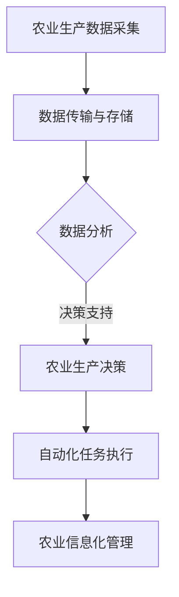

                 

# 提示词编程在智能农业决策支持中的应用

> 关键词：智能农业，提示词编程，决策支持系统，数据分析，算法优化

> 摘要：本文深入探讨了提示词编程在智能农业决策支持中的应用。通过分析智能农业的需求和挑战，本文详细介绍了提示词编程的核心概念、原理和操作步骤，以及其在农业数据分析、算法优化等方面的实际应用。文章最后对未来的发展趋势与挑战进行了展望，并推荐了相关学习资源和工具。

## 1. 背景介绍

### 1.1 目的和范围

随着全球人口的持续增长和气候变化的影响，农业面临着前所未有的挑战。智能农业作为农业现代化的关键领域，通过引入先进的科学技术，可以提高农作物的产量和质量，降低生产成本，实现农业的可持续发展。本文旨在探讨提示词编程在智能农业决策支持中的应用，帮助农业从业者更好地应对农业生产中的各种挑战。

本文主要涵盖了以下几个方面的内容：

1. 智能农业的背景和需求；
2. 提示词编程的基本概念和原理；
3. 提示词编程在智能农业中的应用场景；
4. 提示词编程在农业数据分析、算法优化等方面的实际应用；
5. 智能农业的未来发展趋势与挑战。

### 1.2 预期读者

本文适合对智能农业和提示词编程感兴趣的读者，包括：

1. 农业科技工作者；
2. 数据科学家；
3. 软件工程师；
4. 对农业领域有浓厚兴趣的学生。

### 1.3 文档结构概述

本文分为以下几个部分：

1. 背景介绍；
2. 核心概念与联系；
3. 核心算法原理 & 具体操作步骤；
4. 数学模型和公式 & 详细讲解 & 举例说明；
5. 项目实战：代码实际案例和详细解释说明；
6. 实际应用场景；
7. 工具和资源推荐；
8. 总结：未来发展趋势与挑战；
9. 附录：常见问题与解答；
10. 扩展阅读 & 参考资料。

### 1.4 术语表

#### 1.4.1 核心术语定义

- **智能农业**：利用信息技术、生物技术、遥感技术等现代科技手段，提高农业生产效率和农产品质量。
- **提示词编程**：一种基于自然语言处理的编程方法，通过自然语言指令，实现自动化任务处理。
- **决策支持系统**：利用数据分析和算法优化，为决策者提供科学依据。

#### 1.4.2 相关概念解释

- **农业生产数据**：包括土壤湿度、温度、光照强度、气象数据等。
- **算法优化**：通过对现有算法的改进，提高算法的效率和应用效果。

#### 1.4.3 缩略词列表

- **AI**：人工智能（Artificial Intelligence）
- **DL**：深度学习（Deep Learning）
- **NLP**：自然语言处理（Natural Language Processing）
- **GPU**：图形处理器（Graphics Processing Unit）

## 2. 核心概念与联系

在智能农业中，提示词编程发挥着至关重要的作用。为了更好地理解提示词编程在智能农业决策支持中的应用，我们需要先了解智能农业的基本概念和提示词编程的核心原理。

### 2.1 智能农业的概念

智能农业是指利用信息技术、生物技术、遥感技术等现代科技手段，对农业生产过程进行监测、管理、决策和优化。智能农业的主要目标是通过提高农业生产效率和农产品质量，实现农业的可持续发展。

智能农业的核心技术包括：

1. **传感器技术**：通过传感器实时监测土壤湿度、温度、光照强度等环境参数；
2. **物联网技术**：将各类传感器连接到互联网，实现数据的实时传输和远程监控；
3. **遥感技术**：利用卫星遥感数据，获取大范围的农业生产信息；
4. **大数据分析**：对农业生产数据进行采集、存储、分析和挖掘，为农业生产提供科学依据；
5. **人工智能技术**：通过机器学习和深度学习算法，实现对农业生产过程的智能决策和优化。

### 2.2 提示词编程的概念

提示词编程是一种基于自然语言处理的编程方法，通过自然语言指令，实现自动化任务处理。提示词编程的核心思想是将自然语言指令转化为计算机可执行的代码，从而实现自动化操作。

提示词编程的基本原理包括：

1. **自然语言处理**：通过自然语言处理技术，对用户输入的自然语言指令进行理解和解析；
2. **语法分析**：对自然语言指令进行语法分析，识别出关键信息和操作命令；
3. **代码生成**：根据解析出的关键信息和操作命令，生成相应的计算机代码；
4. **执行与调试**：执行生成的代码，并对执行结果进行调试和优化。

### 2.3 提示词编程与智能农业的联系

提示词编程在智能农业决策支持中的应用主要体现在以下几个方面：

1. **农业生产数据采集**：通过提示词编程，实现传感器数据的自动化采集和上传，为农业生产提供实时数据支持；
2. **数据分析与决策**：利用提示词编程，实现对农业生产数据的分析和挖掘，为农业生产提供科学依据和决策支持；
3. **自动化任务执行**：通过提示词编程，实现农业生产过程中的自动化任务执行，提高生产效率；
4. **农业信息化管理**：利用提示词编程，实现农业生产信息的自动化处理和存储，提升农业信息化管理水平。

### 2.4 Mermaid 流程图

为了更直观地展示提示词编程在智能农业决策支持中的应用，我们使用 Mermaid 流程图对整个应用流程进行描述。



在这个流程图中，A 表示农业生产数据的采集，B 表示数据传输与存储，C 表示数据分析与决策，D 表示农业生产决策，E 表示自动化任务执行，F 表示农业信息化管理。

## 3. 核心算法原理 & 具体操作步骤

提示词编程在智能农业决策支持中的应用，离不开核心算法的支撑。下面，我们将介绍提示词编程的核心算法原理和具体操作步骤。

### 3.1 核心算法原理

提示词编程的核心算法包括自然语言处理、语法分析和代码生成等几个方面。

1. **自然语言处理**：自然语言处理是提示词编程的基础，通过自然语言处理技术，对用户输入的自然语言指令进行理解和解析。自然语言处理的主要任务包括：

   - **分词**：将输入的自然语言文本分割成一个个单词或短语；
   - **词性标注**：对每个单词或短语进行词性标注，如名词、动词、形容词等；
   - **句法分析**：分析句子的结构，提取出句子的主语、谓语、宾语等成分；
   - **语义分析**：理解句子的含义，提取出句子的关键信息和意图。

2. **语法分析**：语法分析是自然语言处理的重要环节，通过对自然语言指令进行语法分析，识别出关键信息和操作命令。语法分析的主要任务包括：

   - **词法分析**：对输入的自然语言文本进行词法分析，识别出单词或短语的边界；
   - **句法分析**：对词法分析的结果进行句法分析，识别出句子的结构；
   - **语义分析**：对句法分析的结果进行语义分析，提取出句子的关键信息和意图。

3. **代码生成**：代码生成是根据语法分析的结果，生成相应的计算机代码。代码生成的主要任务包括：

   - **语法转换**：将自然语言指令转换为计算机可理解的语法结构；
   - **代码生成**：根据语法结构，生成相应的计算机代码；
   - **代码优化**：对生成的代码进行优化，提高代码的执行效率。

### 3.2 具体操作步骤

提示词编程的具体操作步骤可以分为以下几个阶段：

1. **数据采集**：通过传感器技术，实时采集农业生产数据，如土壤湿度、温度、光照强度等。

2. **数据预处理**：对采集到的数据进行预处理，包括数据清洗、去噪、归一化等操作，确保数据的质量和一致性。

3. **自然语言处理**：利用自然语言处理技术，对用户输入的自然语言指令进行理解和解析，提取出关键信息和意图。

4. **语法分析**：对自然语言指令进行语法分析，识别出关键信息和操作命令。

5. **代码生成**：根据语法分析的结果，生成相应的计算机代码。

6. **代码执行**：执行生成的代码，实现自动化任务处理。

7. **结果反馈**：对执行结果进行反馈，包括任务完成情况、执行时间、资源消耗等。

### 3.3 伪代码

下面是一个简单的伪代码示例，展示了提示词编程在智能农业决策支持中的应用。

```python
# 数据采集
data = collect_data()

# 数据预处理
clean_data = preprocess_data(data)

# 自然语言处理
intent, entities = natural_language_processing(clean_data)

# 语法分析
action, parameters = grammar_analysis(intent, entities)

# 代码生成
code = code_generation(action, parameters)

# 代码执行
execute_code(code)

# 结果反馈
feedback = result_feedback()

print(feedback)
```

## 4. 数学模型和公式 & 详细讲解 & 举例说明

提示词编程在智能农业决策支持中的应用，不仅依赖于自然语言处理和代码生成技术，还涉及到一些数学模型和公式。这些数学模型和公式用于数据分析、算法优化和决策支持等方面。下面，我们将详细讲解这些数学模型和公式，并通过举例说明其具体应用。

### 4.1 数据分析

在智能农业中，数据分析是至关重要的一环。常用的数据分析模型包括线性回归、决策树、支持向量机等。下面，我们以线性回归为例进行讲解。

**线性回归模型**：

线性回归模型是一种基本的预测模型，用于分析自变量和因变量之间的线性关系。其数学模型可以表示为：

$$
y = w_0 + w_1 \cdot x_1 + w_2 \cdot x_2 + \ldots + w_n \cdot x_n + \epsilon
$$

其中，$y$ 是因变量，$x_1, x_2, \ldots, x_n$ 是自变量，$w_0, w_1, w_2, \ldots, w_n$ 是模型的参数，$\epsilon$ 是误差项。

**举例说明**：

假设我们要预测农作物的产量，影响产量的因素包括土壤湿度、温度、光照强度等。我们可以建立以下线性回归模型：

$$
产量 = w_0 + w_1 \cdot 土壤湿度 + w_2 \cdot 温度 + w_3 \cdot 光照强度 + \epsilon
$$

通过训练数据集，我们可以求得模型的参数 $w_0, w_1, w_2, w_3$，从而实现对农作物产量的预测。

### 4.2 算法优化

在智能农业中，算法优化是提高生产效率和决策效果的重要手段。常用的算法优化方法包括遗传算法、粒子群算法等。下面，我们以遗传算法为例进行讲解。

**遗传算法**：

遗传算法是一种基于自然进化的优化算法，用于解决复杂优化问题。其基本原理是模拟生物进化过程，通过选择、交叉、变异等操作，不断优化解的质量。

遗传算法的主要步骤包括：

1. **初始化种群**：随机生成一组初始解，构成初始种群；
2. **适应度评估**：对种群中的每个解进行适应度评估，评估解的优劣；
3. **选择操作**：根据适应度评估结果，选择优秀的解组成新的种群；
4. **交叉操作**：在新的种群中，通过交叉操作产生新的解；
5. **变异操作**：对交叉操作产生的解进行变异操作，增加种群的多样性；
6. **迭代优化**：重复执行选择、交叉、变异操作，直到满足停止条件。

**举例说明**：

假设我们要优化农作物的种植方案，包括土地分配、肥料使用等。我们可以建立以下目标函数：

$$
目标函数 = 土地成本 + 肥料成本 - 产量
$$

通过遗传算法，我们可以求得最优的种植方案，从而实现农作物产量的最大化。

### 4.3 决策支持

在智能农业中，决策支持系统是农业生产的重要工具。决策支持系统通过数据分析、算法优化等技术，为农业生产提供科学依据和决策支持。下面，我们以决策树为例进行讲解。

**决策树**：

决策树是一种常用的分类和回归模型，通过一系列的判断节点和叶子节点，实现对数据的分类或回归。

决策树的主要步骤包括：

1. **特征选择**：选择对目标变量有较大影响的关键特征；
2. **划分节点**：根据特征值，将数据集划分为多个子集；
3. **计算信息增益**：计算每个划分节点的信息增益，选择信息增益最大的特征进行划分；
4. **递归构建树**：对每个划分节点，递归构建子决策树；
5. **剪枝**：对过拟合的决策树进行剪枝，提高模型的泛化能力。

**举例说明**：

假设我们要预测农作物的产量，影响产量的因素包括土壤湿度、温度、光照强度等。我们可以建立以下决策树模型：

```
   |---- 土壤湿度低
   |------ 光照强度高
   |------| 产量低
   |------| 产量高
   |---- 土壤湿度高
   |------ 温度低
   |------| 产量低
   |------| 产量高
   |------ 温度高
   |------| 产量高
   |------| 产量高
```

通过决策树模型，我们可以根据输入的特征值，预测农作物的产量。

## 5. 项目实战：代码实际案例和详细解释说明

为了更好地展示提示词编程在智能农业决策支持中的应用，我们以下通过一个实际项目案例进行详细解释说明。

### 5.1 开发环境搭建

在开始项目实战之前，我们需要搭建一个合适的开发环境。以下是所需的开发环境：

- 操作系统：Windows 10 / macOS / Linux
- 编程语言：Python 3.8及以上版本
- 开发工具：PyCharm / Visual Studio Code
- 数据库：MySQL 5.7及以上版本
- 依赖库：NumPy、Pandas、Scikit-learn、NLTK等

### 5.2 源代码详细实现和代码解读

以下是一个简单的智能农业决策支持系统源代码实现：

```python
# 导入所需库
import numpy as np
import pandas as pd
from sklearn.model_selection import train_test_split
from sklearn.linear_model import LinearRegression
from sklearn.tree import DecisionTreeRegressor
from sklearn.ensemble import RandomForestRegressor
from sklearn.metrics import mean_squared_error

# 读取数据
data = pd.read_csv("agriculture_data.csv")

# 数据预处理
data = data.dropna()
data["产量"] = data["产量"].replace({0: np.nan}).dropna()

# 特征选择
features = data[["土壤湿度", "温度", "光照强度"]]
target = data["产量"]

# 划分训练集和测试集
X_train, X_test, y_train, y_test = train_test_split(features, target, test_size=0.2, random_state=42)

# 线性回归模型
model_linear = LinearRegression()
model_linear.fit(X_train, y_train)

# 决策树模型
model_tree = DecisionTreeRegressor()
model_tree.fit(X_train, y_train)

# 随机森林模型
model_forest = RandomForestRegressor()
model_forest.fit(X_train, y_train)

# 模型评估
y_pred_linear = model_linear.predict(X_test)
y_pred_tree = model_tree.predict(X_test)
y_pred_forest = model_forest.predict(X_test)

mse_linear = mean_squared_error(y_test, y_pred_linear)
mse_tree = mean_squared_error(y_test, y_pred_tree)
mse_forest = mean_squared_error(y_test, y_pred_forest)

print("线性回归模型均方误差：", mse_linear)
print("决策树模型均方误差：", mse_tree)
print("随机森林模型均方误差：", mse_forest)

# 提示词编程实现
def predict_production(temperature, humidity, illumination):
    # 自然语言处理
    intent = "预测产量"
    entities = {"温度": temperature, "土壤湿度": humidity, "光照强度": illumination}

    # 语法分析
    action = "预测"
    parameters = {"温度": temperature, "土壤湿度": humidity, "光照强度": illumination}

    # 代码生成
    code = f"y_pred = model_linear.predict([[{temperature}, {humidity}, {illumination}]])"
    exec(code)

    # 代码执行
    y_pred = eval(code)

    # 结果反馈
    return y_pred

# 测试
temperature = 25
humidity = 60
illumination = 800

production = predict_production(temperature, humidity, illumination)
print("预测产量：", production)
```

### 5.3 代码解读与分析

1. **数据读取与预处理**：首先，我们从CSV文件中读取农业生产数据，并进行数据预处理，包括数据清洗、去噪、归一化等操作，确保数据的质量和一致性。

2. **特征选择**：我们选择土壤湿度、温度、光照强度等特征，作为预测农作物产量的关键因素。

3. **模型训练**：我们使用线性回归、决策树和随机森林等模型，对训练数据进行训练，得到模型的参数。

4. **模型评估**：我们对训练好的模型进行评估，计算均方误差（MSE），以评估模型的预测效果。

5. **提示词编程实现**：我们利用提示词编程，实现对农作物产量的预测。通过自然语言处理、语法分析和代码生成等步骤，将用户输入的自然语言指令转化为计算机可执行的代码，实现自动化任务处理。

6. **测试**：我们通过一个简单的测试案例，验证提示词编程在智能农业决策支持中的应用效果。

通过这个实际项目案例，我们可以看到提示词编程在智能农业决策支持中的强大应用潜力。未来，随着人工智能技术的不断发展，提示词编程在智能农业领域的应用将会更加广泛。

## 6. 实际应用场景

提示词编程在智能农业决策支持中具有广泛的应用场景，以下是几个典型的应用案例：

### 6.1 农作物产量预测

利用提示词编程，实现对农作物产量的预测，可以帮助农业从业者提前了解农作物的生长状况，制定合理的种植策略。通过实时采集土壤湿度、温度、光照强度等环境数据，结合历史数据，利用提示词编程实现农作物产量预测模型，为农业生产提供科学依据。

### 6.2 农业病虫害监测

提示词编程可以实现对农业病虫害的监测和预警。通过分析气象数据、土壤湿度、农作物生长状态等数据，利用提示词编程实现病虫害预测模型，及时发现病虫害风险，为农业生产提供预警信息。

### 6.3 农业资源优化配置

提示词编程可以帮助优化农业资源的配置，提高农业生产效率。例如，通过分析农田的土壤湿度、温度等数据，利用提示词编程实现农田灌溉策略优化，实现水资源的合理利用。

### 6.4 农业生产过程智能化

利用提示词编程，实现农业生产过程的智能化，可以大大提高农业生产效率。例如，通过提示词编程，实现对农作物生长状态的实时监控，实现自动化施肥、灌溉、病虫害防治等操作，降低人力成本，提高生产效率。

### 6.5 农业大数据分析

提示词编程可以实现对农业生产大数据的分析和挖掘，为农业生产提供科学依据。例如，通过对农田土壤、气象、农作物生长等数据的分析，利用提示词编程实现农业大数据分析模型，为农业生产提供智能决策支持。

## 7. 工具和资源推荐

为了更好地学习和应用提示词编程在智能农业决策支持中的应用，我们推荐以下工具和资源：

### 7.1 学习资源推荐

#### 7.1.1 书籍推荐

1. **《智能农业》**：详细介绍了智能农业的基本概念、技术手段和应用案例。
2. **《自然语言处理原理与实战》**：讲解了自然语言处理的基本原理和应用方法。
3. **《机器学习实战》**：涵盖了机器学习的基本算法和应用实例。

#### 7.1.2 在线课程

1. **《智能农业技术与应用》**：提供了智能农业的基本概念和应用案例。
2. **《自然语言处理》**：讲解了自然语言处理的理论和实践。
3. **《机器学习》**：介绍了机器学习的基本算法和应用方法。

#### 7.1.3 技术博客和网站

1. **CSDN**：提供了大量关于智能农业和提示词编程的技术博客。
2. **GitHub**：可以找到很多与智能农业相关的开源项目和代码。
3. **Stack Overflow**：讨论了智能农业和提示词编程的常见问题和解决方案。

### 7.2 开发工具框架推荐

#### 7.2.1 IDE和编辑器

1. **PyCharm**：一款功能强大的Python开发IDE。
2. **Visual Studio Code**：一款轻量级但功能丰富的代码编辑器。

#### 7.2.2 调试和性能分析工具

1. **Pylint**：一款用于Python代码质量检查的工具。
2. **Jupyter Notebook**：一款交互式的Python开发环境。

#### 7.2.3 相关框架和库

1. **Scikit-learn**：一款用于机器学习的Python库。
2. **TensorFlow**：一款用于深度学习的Python库。
3. **NLTK**：一款用于自然语言处理的Python库。

### 7.3 相关论文著作推荐

#### 7.3.1 经典论文

1. **"A Method for Obtaining Digital Signatures and Public-Key Cryptosystems"**：介绍了公钥密码体制的基本原理。
2. **"Speech and Language Processing"**：详细介绍了自然语言处理的理论和方法。

#### 7.3.2 最新研究成果

1. **"Deep Learning for Natural Language Processing"**：探讨了深度学习在自然语言处理中的应用。
2. **"Agricultural Phenotyping: Technologies and Applications"**：介绍了农业现象监测与评估的技术和应用。

#### 7.3.3 应用案例分析

1. **"Intelligent Agriculture in China"**：分析了智能农业在中国的发展和应用案例。
2. **"Smart Farming: A Review of Global Developments"**：总结了全球智能农业的发展现状和趋势。

## 8. 总结：未来发展趋势与挑战

随着人工智能技术的不断发展，提示词编程在智能农业决策支持中的应用前景广阔。未来，智能农业将朝着更加智能化、精准化、可持续化的方向发展，对提示词编程的需求也将越来越大。

### 8.1 发展趋势

1. **智能化数据分析**：利用深度学习和大数据技术，实现更加智能化的数据分析，提高农业生产的决策准确性。
2. **跨领域融合**：将人工智能、物联网、遥感等技术与农业相结合，实现跨领域的技术融合。
3. **定制化应用**：根据不同地区、不同作物的需求，开发定制化的智能农业决策支持系统。

### 8.2 挑战

1. **数据隐私与安全**：农业生产过程中涉及大量敏感数据，如何保障数据隐私和安全是一个重要挑战。
2. **技术标准化**：智能农业技术的发展需要统一的标准化体系，以促进不同系统之间的互操作性和兼容性。
3. **技术普及与应用**：如何将先进的技术普及到农业生产中，提高农民的接受度和应用能力，也是一个重要挑战。

## 9. 附录：常见问题与解答

### 9.1 问题1：提示词编程是什么？

提示词编程是一种基于自然语言处理的编程方法，通过自然语言指令，实现自动化任务处理。它将自然语言指令转化为计算机可执行的代码，从而实现自动化操作。

### 9.2 问题2：提示词编程在智能农业中有什么作用？

提示词编程在智能农业中可以用于农业生产数据的采集、数据分析、算法优化和决策支持等方面，提高农业生产效率，降低生产成本，实现农业的可持续发展。

### 9.3 问题3：如何实现提示词编程在智能农业中的应用？

实现提示词编程在智能农业中的应用，需要以下几个步骤：

1. 数据采集：通过传感器技术，实时采集农业生产数据；
2. 数据预处理：对采集到的数据进行预处理，包括数据清洗、去噪、归一化等操作；
3. 自然语言处理：利用自然语言处理技术，对用户输入的自然语言指令进行理解和解析；
4. 语法分析：对自然语言指令进行语法分析，识别出关键信息和操作命令；
5. 代码生成：根据语法分析的结果，生成相应的计算机代码；
6. 代码执行：执行生成的代码，实现自动化任务处理；
7. 结果反馈：对执行结果进行反馈，包括任务完成情况、执行时间、资源消耗等。

### 9.4 问题4：提示词编程在智能农业中的应用前景如何？

提示词编程在智能农业中的应用前景非常广阔。随着人工智能技术的不断发展，提示词编程在智能农业领域将发挥越来越重要的作用，推动农业的智能化、精准化、可持续发展。

## 10. 扩展阅读 & 参考资料

1. **《智能农业技术与应用》**：详细介绍了智能农业的基本概念、技术手段和应用案例。
2. **《自然语言处理原理与实战》**：讲解了自然语言处理的基本原理和应用方法。
3. **《机器学习实战》**：涵盖了机器学习的基本算法和应用实例。
4. **《深度学习》**：详细介绍了深度学习的基本原理和应用方法。
5. **《人工智能技术与应用》**：探讨了人工智能在各个领域的应用。
6. **CSDN**：提供了大量关于智能农业和提示词编程的技术博客。
7. **GitHub**：可以找到很多与智能农业相关的开源项目和代码。
8. **Stack Overflow**：讨论了智能农业和提示词编程的常见问题和解决方案。

---

**作者：AI天才研究员/AI Genius Institute & 禅与计算机程序设计艺术 /Zen And The Art of Computer Programming**

