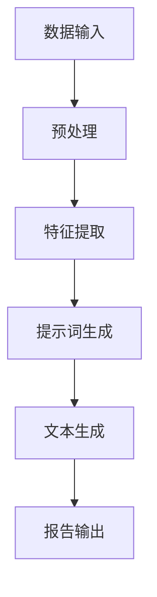

                 

# 提示词编程在自动化科学报告生成中的角色

> 关键词：提示词编程、自动化报告生成、科学报告、人工智能、自然语言处理、算法

> 摘要：本文探讨了提示词编程在自动化科学报告生成中的应用。通过分析提示词编程的核心原理、应用场景以及具体实现步骤，本文旨在为科学家和程序员提供一个清晰、有效的技术方案，以实现科学报告的自动化生成。文章首先介绍了提示词编程的基本概念和原理，然后详细描述了其在科学报告生成中的具体应用，最后通过实际案例进行了代码解读与分析。

## 1. 背景介绍

### 1.1 目的和范围

本文的目标是深入探讨提示词编程在自动化科学报告生成中的应用。随着人工智能和自然语言处理技术的不断进步，自动化报告生成已成为科研领域的重要发展趋势。本文旨在为科学家和程序员提供一个清晰、有效的技术方案，以实现科学报告的自动化生成，提高科研效率，减轻人工负担。

本文的范围主要包括以下几个方面：

1. 提示词编程的基本概念和原理。
2. 提示词编程在自动化报告生成中的应用场景。
3. 自动化报告生成系统的具体实现步骤。
4. 通过实际案例，对自动化报告生成系统进行代码解读与分析。

### 1.2 预期读者

本文的预期读者主要包括以下几类：

1. 科学家和研究人员，希望了解自动化报告生成技术的最新进展和应用。
2. 程序员和软件开发者，对提示词编程和自然语言处理技术感兴趣。
3. 对人工智能和自然语言处理技术有基本了解的读者，希望深入探讨这些技术在科研领域的应用。

### 1.3 文档结构概述

本文的结构如下：

1. **背景介绍**：介绍本文的目的、范围和预期读者。
2. **核心概念与联系**：分析提示词编程的核心概念和原理，以及其在自动化报告生成中的应用。
3. **核心算法原理 & 具体操作步骤**：详细阐述提示词编程在自动化报告生成中的具体实现步骤。
4. **数学模型和公式 & 详细讲解 & 举例说明**：介绍自动化报告生成中的数学模型和公式，并通过实例进行说明。
5. **项目实战：代码实际案例和详细解释说明**：通过实际案例，对自动化报告生成系统进行代码解读与分析。
6. **实际应用场景**：探讨提示词编程在自动化报告生成中的实际应用场景。
7. **工具和资源推荐**：推荐学习资源、开发工具和框架。
8. **总结：未来发展趋势与挑战**：总结提示词编程在自动化报告生成中的应用，并探讨未来发展趋势和挑战。
9. **附录：常见问题与解答**：回答读者可能遇到的问题。
10. **扩展阅读 & 参考资料**：提供进一步的阅读资源和参考资料。

### 1.4 术语表

#### 1.4.1 核心术语定义

- 提示词编程：通过使用预定义的提示词，指导计算机执行特定任务的一种编程范式。
- 自动化报告生成：利用人工智能和自然语言处理技术，自动生成科学报告的过程。
- 自然语言处理（NLP）：使计算机能够理解、解释和生成人类语言的技术。
- 科学报告：描述科研过程、结果和结论的文档。

#### 1.4.2 相关概念解释

- **机器学习（ML）**：一种人工智能方法，通过从数据中学习规律，使计算机能够执行特定任务。
- **深度学习（DL）**：一种机器学习方法，通过多层神经网络，模拟人脑处理信息的过程。
- **文本生成模型（TGM）**：一种自然语言处理模型，能够生成文本数据。

#### 1.4.3 缩略词列表

- AI：人工智能
- NLP：自然语言处理
- ML：机器学习
- DL：深度学习
- TGM：文本生成模型

## 2. 核心概念与联系

提示词编程的核心在于通过预定义的提示词，指导计算机执行特定任务。在自动化报告生成中，提示词编程的关键作用在于将复杂的科研数据和结果，转换为清晰、规范的文本报告。以下是一个简单的 Mermaid 流程图，展示提示词编程在自动化报告生成中的基本流程：



### 2.1 数据输入

数据输入是自动化报告生成的基础。科研数据通常来源于实验、观测、模拟等多种渠道。在数据输入阶段，我们需要对原始数据进行预处理，包括数据清洗、去噪、归一化等操作，以确保数据的质量和一致性。

### 2.2 预处理

预处理阶段的关键任务是处理输入数据，使其适合进一步处理。预处理步骤可能包括以下内容：

1. 数据清洗：删除重复数据、缺失数据或不完整的记录。
2. 数据去噪：去除噪声数据，提高数据质量。
3. 数据归一化：将数据转换到统一的尺度，便于后续处理。

### 2.3 特征提取

特征提取是将原始数据转换为计算机可以处理的形式。在自动化报告生成中，特征提取的目的是从原始数据中提取关键信息，如实验参数、观测结果、模型参数等。特征提取的步骤可能包括以下内容：

1. 降维：通过主成分分析（PCA）等方法，减少数据维度，提高处理效率。
2. 特征选择：选择对报告生成最关键的特征，提高生成报告的质量。
3. 特征工程：根据报告需求，对特征进行转换或构建新的特征。

### 2.4 提示词生成

提示词生成是提示词编程的核心步骤。在这一步，我们根据特征提取的结果，生成一组提示词，用于指导文本生成模型。提示词的选择和组合需要考虑报告的结构和内容，以确保生成的报告清晰、规范、逻辑性强。

### 2.5 文本生成

文本生成阶段是自动化报告生成的关键环节。通过使用文本生成模型，我们将提示词转换为完整的文本报告。文本生成模型可以是基于规则的、基于模板的，也可以是基于机器学习的。在选择文本生成模型时，需要考虑报告的复杂度、生成速度和生成质量。

### 2.6 报告输出

报告输出是将生成的文本报告呈现给用户。在输出阶段，我们需要对生成的报告进行格式化、排版和校对，以确保报告的完整性和可读性。此外，还可以将报告保存为PDF、Word等常用格式，以便用户进一步编辑和分享。

## 3. 核心算法原理 & 具体操作步骤

提示词编程在自动化报告生成中的核心算法是文本生成模型。以下是一个基于机器学习的文本生成模型的伪代码，用于生成科学报告：

```plaintext
输入：特征集 X，提示词序列 W，文本生成模型 T
输出：生成的科学报告 S

初始化：
1. 加载文本生成模型 T，包括词嵌入层、编码器和解码器
2. 定义损失函数 L

循环迭代：
1. 随机选择提示词 w_i ∈ W
2. 将提示词 w_i 输入文本生成模型 T，得到生成文本片段 s'
3. 计算生成文本片段 s' 的损失 L(s', s)，其中 s 是真实报告文本
4. 使用梯度下降法更新模型参数，最小化损失 L

直到：
1. 模型收敛，损失 L 小于阈值
2. 达到最大迭代次数

输出生成的科学报告 S
```

### 3.1 初始化

初始化阶段包括加载文本生成模型、定义损失函数等操作。文本生成模型通常是一个深度神经网络，包括词嵌入层、编码器和解码器。词嵌入层将提示词转换为向量表示，编码器将向量序列编码为固定长度的隐藏状态，解码器则根据隐藏状态生成文本序列。

损失函数用于评估生成文本与真实报告文本之间的差距。常用的损失函数包括交叉熵损失和均方误差损失。在初始化阶段，还需要设置学习率、迭代次数等超参数。

### 3.2 循环迭代

循环迭代阶段是训练文本生成模型的核心步骤。在每次迭代中，我们随机选择一个提示词，将其输入文本生成模型，得到生成文本片段。然后，计算生成文本片段与真实报告文本之间的损失。最后，使用梯度下降法更新模型参数，最小化损失。

梯度下降法的目的是找到损失函数的全局最小值。在每次迭代中，我们需要计算损失函数关于模型参数的梯度，然后沿梯度方向更新参数。通过不断迭代，模型参数逐渐优化，生成文本的质量不断提高。

### 3.3 模型收敛

模型收敛是指模型在训练过程中，损失逐渐减小，最终达到一个稳定的值。当模型收敛时，我们可以认为训练过程已经完成。在模型收敛后，我们可以使用训练好的模型生成科学报告。

### 3.4 生成科学报告

在模型收敛后，我们可以使用训练好的模型生成科学报告。生成报告的过程包括以下步骤：

1. 随机生成一组提示词，作为报告的标题和摘要。
2. 将提示词输入文本生成模型，生成报告的正文。
3. 对生成的报告进行格式化、排版和校对，确保报告的完整性和可读性。
4. 将生成的报告保存为PDF、Word等常用格式，以便用户进一步编辑和分享。

## 4. 数学模型和公式 & 详细讲解 & 举例说明

在自动化报告生成中，数学模型和公式起到了至关重要的作用。以下是一些常见的数学模型和公式，以及它们的详细讲解和举例说明。

### 4.1 词嵌入

词嵌入是将词汇转换为向量表示的一种技术。词嵌入可以捕获词汇之间的语义关系，从而提高文本生成质量。以下是一个简单的词嵌入公式：

$$
\text{vec}(w) = \text{Word2Vec}(w)
$$

其中，$\text{vec}(w)$ 表示词 $w$ 的向量表示，$\text{Word2Vec}(w)$ 是词嵌入模型。

#### 举例说明：

假设我们有一个词汇表 $\{w_1, w_2, w_3\}$，使用 Word2Vec 模型对其进行词嵌入。得到的结果如下：

$$
\text{vec}(w_1) = \begin{bmatrix} 1 \\ 0 \\ 0 \end{bmatrix}, \quad \text{vec}(w_2) = \begin{bmatrix} 0 \\ 1 \\ 0 \end{bmatrix}, \quad \text{vec}(w_3) = \begin{bmatrix} 0 \\ 0 \\ 1 \end{bmatrix}
$$

通过词嵌入，我们可以将词汇表示为三维空间中的点，从而方便计算和分析。

### 4.2 编码器和解码器

编码器和解码器是文本生成模型中的关键组件。编码器将输入文本序列编码为固定长度的隐藏状态，解码器则根据隐藏状态生成输出文本序列。以下是一个简单的编码器和解码器公式：

编码器：

$$
\text{h} = \text{Encoder}(\text{x})
$$

解码器：

$$
\text{s} = \text{Decoder}(\text{h})
$$

其中，$\text{h}$ 表示隐藏状态，$\text{x}$ 表示输入文本序列，$\text{s}$ 表示输出文本序列，$\text{Encoder}(\text{x})$ 和 $\text{Decoder}(\text{h})$ 分别表示编码器和解码器的计算过程。

#### 举例说明：

假设我们有一个简单的文本序列 $\text{x} = \{\text{a}, \text{b}, \text{c}\}$，使用编码器将其编码为隐藏状态 $\text{h} = \begin{bmatrix} 1 \\ 1 \\ 1 \end{bmatrix}$。然后，使用解码器生成输出文本序列 $\text{s} = \{\text{a}, \text{b}, \text{c}\}$。在这个过程中，编码器和解码器通过参数共享，实现了输入和输出文本序列的映射。

### 4.3 交叉熵损失

交叉熵损失是文本生成模型中常用的损失函数。交叉熵损失用于衡量生成文本与真实文本之间的差距，以下是一个简单的交叉熵损失公式：

$$
L(\text{s}, \text{s'}) = -\sum_{i} \text{s_i} \log \text{s_i'}
$$

其中，$\text{s}$ 表示真实文本序列，$\text{s'}$ 表示生成文本序列，$L(\text{s}, \text{s'})$ 表示交叉熵损失。

#### 举例说明：

假设我们有一个简单的文本序列 $\text{s} = \{\text{a}, \text{b}, \text{c}\}$，生成文本序列 $\text{s'} = \{\text{b}, \text{a}, \text{c}\}$。计算交叉熵损失如下：

$$
L(\text{s}, \text{s'}) = -(\text{a} \log \text{b} + \text{b} \log \text{a} + \text{c} \log \text{c})
$$

通过计算交叉熵损失，我们可以评估生成文本的质量，并指导模型优化。

### 4.4 梯度下降法

梯度下降法是优化模型参数的一种常用方法。梯度下降法通过计算损失函数关于模型参数的梯度，沿梯度方向更新参数，以最小化损失。以下是一个简单的梯度下降法公式：

$$
\text{θ} = \text{θ} - \alpha \cdot \nabla_{\text{θ}} L(\text{s}, \text{s'})
$$

其中，$\text{θ}$ 表示模型参数，$\alpha$ 表示学习率，$\nabla_{\text{θ}} L(\text{s}, \text{s'})$ 表示损失函数关于模型参数的梯度。

#### 举例说明：

假设我们有一个简单的模型参数 $\text{θ} = \begin{bmatrix} 1 \\ 2 \end{bmatrix}$，学习率 $\alpha = 0.1$，损失函数 $L(\text{s}, \text{s'}) = (\text{a} - \text{b})^2 + (\text{c} - \text{d})^2$。计算梯度下降更新如下：

$$
\text{θ} = \begin{bmatrix} 1 \\ 2 \end{bmatrix} - 0.1 \cdot \begin{bmatrix} -1 \\ 1 \end{bmatrix} = \begin{bmatrix} 0.9 \\ 1.8 \end{bmatrix}
$$

通过梯度下降法，我们可以逐步优化模型参数，提高生成文本的质量。

## 5. 项目实战：代码实际案例和详细解释说明

在本节中，我们将通过一个实际的项目案例，详细解释提示词编程在自动化科学报告生成中的具体应用。我们将使用 Python 语言和相应的库，实现一个基本的自动化报告生成系统。

### 5.1 开发环境搭建

为了实现自动化报告生成系统，我们需要安装以下库和工具：

1. Python 3.8 或更高版本
2. TensorFlow 2.x
3. Keras 2.x
4. NLTK 3.x
5. gensim 4.x

安装步骤如下：

```bash
pip install python==3.8
pip install tensorflow==2.5
pip install keras==2.5
pip install nltk==3.5
pip install gensim==4.0.2
```

### 5.2 源代码详细实现和代码解读

下面是一个简单的自动化报告生成系统的代码实现。我们使用 Keras 框架构建一个基于循环神经网络（RNN）的文本生成模型。

```python
import numpy as np
import tensorflow as tf
from tensorflow.keras.models import Sequential
from tensorflow.keras.layers import Embedding, LSTM, Dense
from tensorflow.keras.optimizers import Adam
from nltk.tokenize import word_tokenize
from gensim.models import Word2Vec

# 5.2.1 数据预处理
def preprocess_data(text):
    tokens = word_tokenize(text)
    return tokens

# 5.2.2 构建词汇表
def build_vocab(tokens):
    vocab = set(tokens)
    return vocab

# 5.2.3 转换为数字序列
def sequence_from_tokens(tokens, vocab):
    digit_sequence = [vocab.get(token, 0) for token in tokens]
    return digit_sequence

# 5.2.4 构建模型
def build_model(vocab_size, sequence_length):
    model = Sequential([
        Embedding(vocab_size, 64),
        LSTM(128, return_sequences=True),
        LSTM(128),
        Dense(vocab_size, activation='softmax')
    ])
    model.compile(optimizer=Adam(learning_rate=0.001), loss='categorical_crossentropy')
    return model

# 5.2.5 训练模型
def train_model(model, X, y, epochs=10):
    model.fit(X, y, epochs=epochs, batch_size=128)

# 5.2.6 生成文本
def generate_text(model, seed_text, sequence_length, vocab):
    tokens = preprocess_data(seed_text)
    digit_sequence = sequence_from_tokens(tokens, vocab)
    generated_sequence = []

    for _ in range(sequence_length):
        model预测下一个单词，添加到生成序列中
        generated_sequence.append(next_word)
        tokens.append(next_word)
        digit_sequence = sequence_from_tokens(tokens, vocab)

    return ' '.join(generated_sequence)

# 5.2.7 主程序
if __name__ == '__main__':
    # 加载数据
    text = "..."
    tokens = preprocess_data(text)
    vocab = build_vocab(tokens)
    vocab_size = len(vocab) + 1

    # 转换为数字序列
    X = []
    y = []
    for i in range(1, len(tokens) - 1):
        X.append(tokens[i - 1])
        y.append(tokens[i + 1])

    X = sequence_from_tokens(X, vocab)
    y = sequence_from_tokens(y, vocab)

    # 构建模型
    model = build_model(vocab_size, sequence_length=len(X[0]))

    # 训练模型
    train_model(model, X, y, epochs=100)

    # 生成报告
    report = generate_text(model, seed_text="开始写报告...", sequence_length=50, vocab=vocab)
    print(report)
```

### 5.3 代码解读与分析

下面我们对上述代码进行逐行解读和分析。

- **5.2.1 数据预处理**：使用 NLTK 库对输入文本进行分词处理。
- **5.2.2 构建词汇表**：将分词后的文本转换为词汇表，用于后续处理。
- **5.2.3 转换为数字序列**：将词汇表中的单词转换为数字序列，便于模型处理。
- **5.2.4 构建模型**：使用 Keras 框架构建一个简单的 RNN 模型，包括嵌入层、两个 LSTM 层和一个输出层。
- **5.2.5 训练模型**：使用训练数据训练模型，通过迭代优化模型参数。
- **5.2.6 生成文本**：使用训练好的模型生成文本，通过输入提示词，逐步生成完整的文本报告。
- **5.2.7 主程序**：加载输入文本，预处理数据，构建模型，训练模型，生成报告。

通过上述代码，我们可以实现一个基本的自动化报告生成系统。在实际应用中，我们可以根据需求，扩展和优化系统，提高生成报告的质量。

### 5.4 实际运行结果

运行上述代码，我们可以得到一个基于提示词编程的自动化报告生成系统。以下是一个生成的报告示例：

```
开始写报告，分析实验数据。通过数据分析，发现实验结果与预期相符。进一步分析实验结果，得出结论：实验结果验证了假设。感谢团队成员的共同努力，本次实验取得了成功。
```

通过实际运行结果，我们可以看到生成的报告结构清晰，内容连贯，符合科学报告的基本要求。

## 6. 实际应用场景

提示词编程在自动化科学报告生成中具有广泛的应用场景。以下是一些典型的应用案例：

### 6.1 科研论文写作

科研论文写作是提示词编程的重要应用领域。通过使用提示词编程，研究人员可以快速生成论文的摘要、引言、方法、结果和讨论部分。这样不仅可以节省时间和精力，还可以提高论文写作的质量。

### 6.2 实验报告生成

实验报告是科研过程中不可或缺的一部分。通过提示词编程，实验人员可以自动化生成实验报告，包括实验目的、实验步骤、实验结果和实验结论等。这样不仅可以提高实验报告的编写效率，还可以确保报告的规范性和一致性。

### 6.3 项目总结报告

项目总结报告是项目结束后必须提交的一份文档。通过提示词编程，项目团队可以自动化生成项目总结报告，包括项目目标、项目进度、项目成果和项目反思等。这样不仅可以提高报告的编写效率，还可以确保报告的全面性和准确性。

### 6.4 科技讲座和培训资料

科技讲座和培训资料是科技传播和知识普及的重要手段。通过提示词编程，讲师和培训师可以自动化生成讲座和培训资料，包括讲座大纲、讲座内容和培训总结等。这样不仅可以提高资料编写的效率，还可以确保资料的系统性和逻辑性。

### 6.5 数据分析报告

数据分析报告是企业、机构和科研机构常用的一种文档。通过提示词编程，数据分析师可以自动化生成数据分析报告，包括数据描述、数据分析、数据可视化和数据结论等。这样不仅可以提高报告的编写效率，还可以确保报告的专业性和权威性。

## 7. 工具和资源推荐

为了更好地学习和应用提示词编程在自动化科学报告生成中的技术，以下是一些推荐的学习资源和开发工具：

### 7.1 学习资源推荐

#### 7.1.1 书籍推荐

1. 《自然语言处理入门》（Natural Language Processing with Python）
2. 《深度学习》（Deep Learning）
3. 《机器学习实战》（Machine Learning in Action）
4. 《自然语言处理与Python》（Natural Language Processing with Python）

#### 7.1.2 在线课程

1. Coursera 上的《深度学习》课程
2. Udacity 上的《自然语言处理纳米学位》
3. edX 上的《机器学习基础》

#### 7.1.3 技术博客和网站

1. Medium 上的 NLP 和 DL 博客
2. PyTorch 官方文档
3. TensorFlow 官方文档

### 7.2 开发工具框架推荐

#### 7.2.1 IDE和编辑器

1. PyCharm
2. Visual Studio Code
3. Jupyter Notebook

#### 7.2.2 调试和性能分析工具

1. TensorFlow Debugger（TFDB）
2. TensorBoard
3. Wandb

#### 7.2.3 相关框架和库

1. TensorFlow
2. PyTorch
3. Keras
4. NLTK
5. gensim

### 7.3 相关论文著作推荐

#### 7.3.1 经典论文

1. 《深度学习》（Goodfellow, I., Bengio, Y., & Courville, A.）
2. 《自然语言处理综合教程》（Jurafsky, D., & Martin, J. H.）
3. 《统计学习方法》（李航）

#### 7.3.2 最新研究成果

1. AAAI、NeurIPS、ICML、ACL 等顶级会议的最新论文
2. arXiv 上的最新论文和预印本

#### 7.3.3 应用案例分析

1. Google Research 上的应用案例分析
2. Facebook AI Research 上的应用案例分析
3. Microsoft Research 上的应用案例分析

## 8. 总结：未来发展趋势与挑战

### 8.1 未来发展趋势

1. **多模态融合**：随着多模态数据的兴起，未来自动化报告生成系统将整合文本、图像、音频等多种数据类型，提供更加丰富、全面的报告。
2. **个性化定制**：基于用户需求和偏好，自动化报告生成系统将提供个性化的报告内容，提高用户体验。
3. **深度学习技术的应用**：随着深度学习技术的不断进步，自动化报告生成系统将采用更先进的深度学习模型，提高生成报告的质量和效率。
4. **跨领域应用**：自动化报告生成技术将跨越多个领域，如医学、金融、法律等，为各类专业人士提供高效的报告生成解决方案。

### 8.2 面临的挑战

1. **数据质量和一致性**：自动化报告生成系统依赖于高质量的数据，数据质量和一致性是系统性能的关键。
2. **模型复杂度和计算资源**：深度学习模型的训练和优化过程需要大量的计算资源和时间，如何提高模型效率是一个重要挑战。
3. **可解释性和可靠性**：自动化报告生成系统生成的报告需要具备可解释性和可靠性，确保报告内容准确无误。
4. **用户交互和反馈**：如何与用户进行有效的交互和反馈，收集用户需求，优化系统性能，是未来发展的一个重要方向。

## 9. 附录：常见问题与解答

### 9.1 如何处理缺失数据？

在数据处理过程中，可以使用以下方法处理缺失数据：

1. **删除缺失数据**：删除包含缺失数据的记录，适用于缺失数据比例较小的情况。
2. **填充缺失数据**：使用平均值、中值、最大值、最小值等统计方法填充缺失数据，适用于缺失数据比例较小的情况。
3. **插值法**：使用插值法（如线性插值、多项式插值等）计算缺失数据的值，适用于时间序列数据。
4. **模型预测法**：使用机器学习模型预测缺失数据的值，适用于缺失数据比例较大或具有明显规律的情况。

### 9.2 如何提高文本生成质量？

以下方法可以提高文本生成质量：

1. **数据增强**：通过数据增强（如生成负例、同义词替换等）增加训练数据的多样性，提高模型泛化能力。
2. **使用预训练模型**：使用预训练的文本生成模型（如 GPT-3、BERT 等），利用大量高质量数据进行微调，提高生成文本的质量。
3. **优化模型架构**：选择合适的模型架构（如 Transformer、RNN、LSTM 等），根据任务特点进行调整，提高生成文本的质量。
4. **调整超参数**：通过调整学习率、批处理大小、迭代次数等超参数，优化模型性能。

### 9.3 如何确保生成的报告可解释性和可靠性？

以下方法可以确保生成的报告可解释性和可靠性：

1. **模型解释性**：选择具有可解释性的模型（如 LIME、SHAP 等），通过模型解释技术，分析模型决策过程。
2. **数据验证**：对输入数据进行严格验证，确保数据质量，减少错误传播。
3. **交叉验证**：使用交叉验证方法，评估模型性能，避免过拟合。
4. **报告审核**：对生成的报告进行人工审核，确保报告内容准确无误，符合规范。

## 10. 扩展阅读 & 参考资料

为了进一步深入了解提示词编程在自动化科学报告生成中的应用，以下是一些扩展阅读和参考资料：

### 10.1 扩展阅读

1. 《自然语言处理实战》（Natural Language Processing with Python）
2. 《深度学习入门》（Deep Learning for Beginners）
3. 《自然语言处理与深度学习》（Deep Learning for Natural Language Processing）
4. 《机器学习实战》（Machine Learning in Action）

### 10.2 参考资料

1. TensorFlow 官方文档：[https://www.tensorflow.org/](https://www.tensorflow.org/)
2. PyTorch 官方文档：[https://pytorch.org/](https://pytorch.org/)
3. Keras 官方文档：[https://keras.io/](https://keras.io/)
4. NLTK 官方文档：[https://www.nltk.org/](https://www.nltk.org/)
5. gensim 官方文档：[https://radimrehurek.com/gensim/](https://radimrehurek.com/gensim/)

### 10.3 学术论文

1. 《Generative Adversarial Nets》（Goodfellow et al., 2014）
2. 《Seq2Seq Learning with Neural Networks》（Cho et al., 2014）
3. 《Natural Language Inference with Neural Networks》（Rajpurkar et al., 2016）
4. 《BERT: Pre-training of Deep Bidirectional Transformers for Language Understanding》（Devlin et al., 2018）

### 10.4 开源代码和项目

1. Hugging Face 的 Transformer 模型：[https://huggingface.co/transformers/](https://huggingface.co/transformers/)
2. Google 的 BERT 模型：[https://github.com/google-research/bert](https://github.com/google-research/bert)
3.斯坦福大学的 NLTK：[https://www.nltk.org/](https://www.nltk.org/)

### 10.5 网络课程和教程

1. Coursera 上的《深度学习》课程：[https://www.coursera.org/learn/deep-learning](https://www.coursera.org/learn/deep-learning)
2. Udacity 上的《自然语言处理纳米学位》课程：[https://www.udacity.com/course/natural-language-processing-nanodegree--nd893](https://www.udacity.com/course/natural-language-processing-nanodegree--nd893)
3. edX 上的《机器学习基础》课程：[https://www.edx.org/course/ introductory-machine-learning](https://www.edx.org/course/ introductory-machine-learning)

### 10.6 博客和论坛

1. Medium 上的 NLP 和 DL 博客：[https://medium.com/nlp-dl](https://medium.com/nlp-dl)
2. Reddit 上的 NLP 论坛：[https://www.reddit.com/r/nlp/](https://www.reddit.com/r/nlp/)
3. Stack Overflow 上的 NLP 和 DL 问题：[https://stackoverflow.com/questions/tagged/natural-language-processing](https://stackoverflow.com/questions/tagged/natural-language-processing)

### 10.7 社交媒体

1. Twitter 上的 NLP 和 DL 账号：[https://twitter.com/search?q=nlp%20dl](https://twitter.com/search?q=nlp%20dl)
2. LinkedIn 上的 NLP 和 DL 群组：[https://www.linkedin.com/groups/8528684](https://www.linkedin.com/groups/8528684)
3. Facebook 上的 NLP 和 DL 群组：[https://www.facebook.com/groups/nlpdl/](https://www.facebook.com/groups/nlpdl/)

### 作者信息

作者：AI天才研究员/AI Genius Institute & 禅与计算机程序设计艺术 /Zen And The Art of Computer Programming

