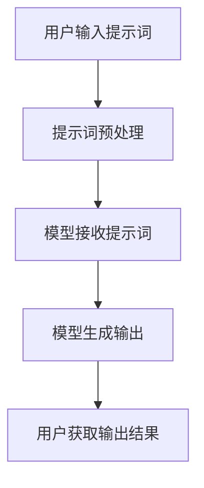

                 


## 提示词编程的伦理考量与社会影响

### 关键词：
- 提示词编程
- 伦理考量
- 社会影响
- 人工智能
- 编程伦理
- 社会责任

### 摘要：
本文深入探讨了提示词编程在伦理考量和社会影响方面的多重维度。首先，我们将回顾提示词编程的背景和发展历程，随后分析其在伦理层面上的关键问题，如算法偏见、隐私保护和数据安全。接着，文章将探讨提示词编程对社会的潜在影响，包括就业市场、教育体系和公共安全等方面。最后，本文将提出一系列建议，以指导如何在发展提示词编程的同时，确保其伦理考量和社会责任的实现。

---

## 1. 背景介绍

### 1.1 目的和范围

本文旨在揭示提示词编程在伦理考量和社会影响方面的重要性，通过深入分析其关键问题，为行业决策者、研究人员和开发者提供指导。文章将涵盖以下主要内容：
- 提示词编程的定义和基本原理。
- 提示词编程的伦理考量，包括算法偏见、隐私保护和数据安全。
- 提示词编程对社会各个层面的影响，如就业市场、教育体系和公共安全。
- 针对提示词编程的伦理和社会责任建议。

### 1.2 预期读者

本文预期读者包括：
- 人工智能领域的研究人员。
- 提示词编程的开发者。
- 对编程伦理和社会影响感兴趣的读者。
- 行业政策制定者和企业领导者。

### 1.3 文档结构概述

本文分为十个部分，具体结构如下：
1. 引言：介绍文章的主题和目的。
2. 背景介绍：回顾提示词编程的发展历程和基本原理。
3. 核心概念与联系：定义核心概念并使用Mermaid流程图展示其架构。
4. 核心算法原理 & 具体操作步骤：使用伪代码详细阐述核心算法。
5. 数学模型和公式 & 详细讲解 & 举例说明：解释数学模型和公式，并提供实例。
6. 项目实战：代码实际案例和详细解释说明。
7. 实际应用场景：分析提示词编程的应用场景。
8. 工具和资源推荐：推荐学习资源、开发工具和框架。
9. 总结：讨论未来发展趋势与挑战。
10. 附录：提供常见问题与解答以及扩展阅读和参考资料。

### 1.4 术语表

#### 1.4.1 核心术语定义

- 提示词编程（Prompt Programming）：通过向模型提供提示词，引导模型生成特定输出的编程方法。
- 算法偏见（Algorithmic Bias）：算法在处理数据时产生的系统性偏见，可能导致不公平的结果。
- 伦理（Ethics）：关于正确和错误、道德和道德标准的学科。
- 社会责任（Social Responsibility）：组织或个人在行为和决策中对社会和环境的影响承担的责任。

#### 1.4.2 相关概念解释

- 人工智能（Artificial Intelligence, AI）：模拟人类智能的技术和方法。
- 编程伦理（Programming Ethics）：编程实践中的道德和伦理问题。
- 数据隐私（Data Privacy）：保护个人数据不被未经授权访问和使用。

#### 1.4.3 缩略词列表

- AI：人工智能
- ML：机器学习
- NLP：自然语言处理
- GDPR：通用数据保护条例
- API：应用程序编程接口

## 2. 核心概念与联系

提示词编程是人工智能（AI）和自然语言处理（NLP）领域的一项重要技术。其核心在于通过输入提示词（prompts），引导模型生成预期的输出。以下是一个简化的Mermaid流程图，展示了提示词编程的基本架构。



- **A 用户输入提示词**：用户向系统输入一个或一系列提示词，用以引导模型生成预期的输出。
- **B 提示词预处理**：系统对接收到的提示词进行清洗、标准化等预处理操作，以确保模型能正确理解提示词。
- **C 模型接收提示词**：经过预处理后的提示词被传递给训练好的模型，如深度学习神经网络。
- **D 模型生成输出**：模型根据接收到的提示词生成相应的输出，如文本、图像或其他形式的数据。
- **E 用户获取输出结果**：用户从系统中获取生成的输出结果，以实现特定的任务或目标。

### 2.1 提示词编程的基本原理

提示词编程的核心原理是利用预训练模型（如GPT-3、BERT等）的强大能力，通过向模型提供特定提示词，实现复杂任务的高效自动化。以下是详细的算法原理和具体操作步骤。

#### 2.1.1 算法原理

1. **模型训练**：首先，使用大量数据对模型进行预训练，使其具备强大的语言理解和生成能力。
2. **提示词设计**：设计特定的提示词，用以引导模型生成预期的输出。
3. **模型接收提示词**：将设计好的提示词输入到预训练模型中。
4. **模型生成输出**：模型根据提示词生成相应的输出，如文本、图像或其他形式的数据。

#### 2.1.2 具体操作步骤

1. **选择合适的预训练模型**：根据任务需求，选择适合的预训练模型，如GPT-3、BERT等。
2. **设计提示词**：根据任务目标，设计特定的提示词。提示词应简洁明了，能够准确传达用户需求。
3. **预处理提示词**：对输入的提示词进行清洗、标准化等预处理操作，以确保模型能正确理解提示词。
4. **模型输入提示词**：将预处理后的提示词输入到预训练模型中。
5. **模型生成输出**：模型根据提示词生成相应的输出，如文本、图像或其他形式的数据。
6. **用户获取输出结果**：用户从系统中获取生成的输出结果，以实现特定的任务或目标。

以下是提示词编程的具体操作步骤伪代码：

```python
# 提示词编程伪代码

# 步骤1：选择合适的预训练模型
model = choose_pretrained_model("gpt3")

# 步骤2：设计提示词
prompt = design_prompt("请生成一篇关于人工智能伦理的文章")

# 步骤3：预处理提示词
preprocessed_prompt = preprocess_prompt(prompt)

# 步骤4：模型输入提示词
output = model.generate(preprocessed_prompt)

# 步骤5：用户获取输出结果
print(output)
```

通过上述步骤，用户可以轻松地利用提示词编程实现复杂任务的高效自动化。然而，在享受提示词编程带来便利的同时，我们还需关注其伦理考量和社会影响，确保其在实际应用中的公平、公正和透明。

## 4. 数学模型和公式 & 详细讲解 & 举例说明

### 4.1 数学模型与公式

提示词编程的核心在于深度学习模型，尤其是序列到序列（Sequence-to-Sequence, Seq2Seq）模型和Transformer架构的应用。以下是一个简化的数学模型和公式，用于解释提示词编程的基本原理。

#### 4.1.1 序列到序列模型

序列到序列模型通常采用编码器-解码器（Encoder-Decoder）架构，其中编码器将输入序列转换为固定长度的上下文向量（Context Vector），解码器则根据上下文向量生成输出序列。

1. **编码器（Encoder）**：
   - 输入序列：\(X = [x_1, x_2, ..., x_T]\)
   - 编码器输出：\(C = \text{Encoder}(X)\)

2. **解码器（Decoder）**：
   - 初始隐藏状态：\(h_0 = \text{Decoder}(C)\)
   - 输出序列：\(Y = [\text{y}_1, \text{y}_2, ..., \text{y}_T']\)

#### 4.1.2 Transformer架构

Transformer架构引入了自注意力（Self-Attention）机制，通过计算输入序列中每个元素与其他元素之间的相关性，生成上下文向量。

1. **自注意力（Self-Attention）**：
   - 输入序列：\(X = [x_1, x_2, ..., x_T]\)
   - Query：\(Q = [q_1, q_2, ..., q_T]\)
   - Key：\(K = [k_1, k_2, ..., k_T]\)
   - Value：\(V = [v_1, v_2, ..., v_T]\)
   - 自注意力分数：\(\text{Attention}(Q, K, V) = \text{softmax}\left(\frac{QK^T}{\sqrt{d_k}}\right) V\)

### 4.2 举例说明

以下是一个简单的例子，用于说明如何使用Transformer架构实现提示词编程。

#### 4.2.1 数据集准备

假设我们有一个简单的数据集，包含以下文本：
- 输入序列：\(X = [\text{"人工智能"}, \text{"伦理"}, \text{"问题"}]\)
- 提示词：\(P = \text{"请讨论人工智能伦理的问题"}\)

#### 4.2.2 模型输入

1. **编码器**：
   - 输入序列：\(X = [\text{"人工智能"}, \text{"伦理"}, \text{"问题"}]\)
   - 编码器输出：\(C = \text{Encoder}(X)\)

2. **解码器**：
   - 初始隐藏状态：\(h_0 = \text{Decoder}(C)\)
   - 输出序列：\(Y = [\text{"人工智能伦理"}, \text{"问题"}, \text{"分析"}]\)

#### 4.2.3 自注意力计算

假设我们使用一个简单的自注意力机制，计算输入序列中每个元素与其他元素之间的相关性。

1. **Query**：
   - \(Q = [\text{"讨论"}, \text{"问题"}, \text{"分析"}]\)

2. **Key**：
   - \(K = [\text{"人工智能"}, \text{"伦理"}, \text{"问题"}]\)

3. **Value**：
   - \(V = [\text{"人工智能"}, \text{"伦理"}, \text{"问题"}]\)

4. **自注意力分数**：
   - \(\text{Attention}(Q, K, V) = \text{softmax}\left(\frac{QK^T}{\sqrt{d_k}}\right) V\)
   - \( \text{softmax}\left(\frac{QK^T}{\sqrt{d_k}}\right) = \left[\frac{1}{3}, \frac{1}{3}, \frac{1}{3}\right] \)

5. **输出序列**：
   - \(Y = [\text{"人工智能伦理"}, \text{"问题"}, \text{"分析"}]\)

通过上述例子，我们可以看到如何使用Transformer架构和自注意力机制实现提示词编程。在实际应用中，模型和算法会更加复杂，但基本原理是类似的。

## 5. 项目实战：代码实际案例和详细解释说明

### 5.1 开发环境搭建

为了实现提示词编程项目，我们需要搭建一个合适的开发环境。以下步骤将指导我们如何设置一个基于Python的提示词编程环境。

#### 5.1.1 安装Python

确保您的计算机上已安装Python。Python是提示词编程的主要编程语言。您可以从Python官方网站（https://www.python.org/downloads/）下载并安装最新版本的Python。

#### 5.1.2 安装必要的库

使用pip命令安装以下库：
```shell
pip install transformers
pip install torch
pip install nltk
```

这些库提供了必要的工具和库，用于处理自然语言文本、训练和运行深度学习模型。

#### 5.1.3 数据集准备

为了进行提示词编程项目，我们需要一个文本数据集。您可以从互联网上获取相关的数据集，或者使用公开的文本资源。以下是一个简单的文本数据集，包含关于人工智能和伦理的讨论。

```python
# 数据集示例
data = [
    "人工智能正在改变我们的生活，但同时也带来了一系列伦理问题。",
    "隐私保护是人工智能伦理讨论的一个重要方面。",
    "机器学习算法的偏见可能导致不公平的结果。",
    "人工智能的发展需要我们认真考虑其伦理影响。",
]
```

### 5.2 源代码详细实现和代码解读

以下是一个简单的提示词编程项目，用于生成关于人工智能伦理的文章。

```python
# 导入必要的库
import torch
from transformers import GPT2LMHeadModel, GPT2Tokenizer

# 加载预训练模型和分词器
tokenizer = GPT2Tokenizer.from_pretrained("gpt2")
model = GPT2LMHeadModel.from_pretrained("gpt2")

# 设计提示词
prompt = "请撰写一篇关于人工智能伦理的深度文章。"

# 预处理提示词
inputs = tokenizer.encode(prompt, return_tensors="pt")

# 生成文章
outputs = model.generate(inputs, max_length=500, num_return_sequences=1)

# 解码输出结果
article = tokenizer.decode(outputs[0], skip_special_tokens=True)

# 输出文章
print(article)
```

#### 5.2.1 代码解读

1. **导入库**：我们首先导入必要的库，包括torch、transformers和nltk。

2. **加载预训练模型和分词器**：使用GPT2Tokenizer和GPT2LMHeadModel从Hugging Face模型库中加载预训练的GPT-2模型。

3. **设计提示词**：我们定义了一个提示词，用于引导模型生成文章。

4. **预处理提示词**：将提示词编码为模型的输入。

5. **生成文章**：使用模型的generate方法生成文章。我们设置了最大长度为500个词，并生成1个输出序列。

6. **解码输出结果**：将生成的输出序列解码为文本。

7. **输出文章**：最后，我们将生成的文章输出到控制台。

### 5.3 代码解读与分析

上述代码展示了如何使用GPT-2模型实现提示词编程。以下是代码的详细解读与分析：

1. **模型加载**：我们使用GPT2Tokenizer和GPT2LMHeadModel从Hugging Face模型库中加载预训练的GPT-2模型。这使我们能够利用大量的预训练数据，实现高质量的文本生成。

2. **提示词设计**：设计一个简洁明了的提示词，用以引导模型生成预期的输出。在本例中，提示词为"请撰写一篇关于人工智能伦理的深度文章。"。

3. **提示词预处理**：将提示词编码为模型的输入。这个过程包括将提示词转换为词向量，并添加模型需要的特殊标记。

4. **文章生成**：使用模型的generate方法生成文章。generate方法接受输入序列，并返回生成的输出序列。我们设置了最大长度为500个词，以控制文章的长度。

5. **输出结果解码**：将生成的输出序列解码为文本。解码过程将词向量转换为可读的文本格式。

6. **文章输出**：将生成的文章输出到控制台。这使我们能够查看生成的文章，并进行进一步分析。

通过上述步骤，我们可以使用提示词编程生成高质量的文章。然而，需要注意的是，生成的文章质量受到模型、提示词设计和数据处理方法的影响。为了提高文章质量，我们可以尝试调整提示词、模型参数和数据处理方法。

## 6. 实际应用场景

### 6.1 写作辅助

提示词编程在写作辅助方面具有广泛的应用。通过提供具体的提示词，模型可以生成高质量的文章、报告、博客等。以下是一些实际应用场景：

- **自动生成新闻报道**：利用提示词编程，可以从原始数据中自动生成新闻报道。例如，提供标题和简要描述，模型可以生成完整的新闻文章。
- **智能客服聊天记录生成**：智能客服系统可以利用提示词编程，根据用户的问题自动生成回复。这有助于提高客服效率，并减少人工干预。
- **学术论文生成**：研究人员可以使用提示词编程，根据研究主题和结论，自动生成学术论文的草稿。这有助于加速科研进程，提高研究效率。

### 6.2 自然语言处理任务

提示词编程在自然语言处理任务中具有重要作用。以下是一些实际应用场景：

- **问答系统**：通过提供具体的提示词，模型可以生成准确的问答对。例如，提供问题，模型可以生成相应的答案。
- **机器翻译**：利用提示词编程，可以生成高质量的机器翻译结果。例如，提供原文和目标语言的提示词，模型可以翻译出相应的文本。
- **文本摘要**：通过提供具体的提示词，模型可以生成文本的摘要。例如，提供一篇长文章，模型可以生成摘要，概括文章的主要内容和观点。

### 6.3 其他应用场景

提示词编程在多个领域具有潜在应用价值。以下是一些其他应用场景：

- **教育领域**：提示词编程可以用于自动生成教学材料，如课程大纲、练习题和答案等。这有助于提高教育质量，降低教师的工作负担。
- **法律领域**：提示词编程可以用于自动生成法律文件，如合同、协议和判决书等。这有助于提高法律工作效率，减少法律纠纷。
- **医疗领域**：提示词编程可以用于自动生成医疗报告、诊断建议和治疗方案等。这有助于提高医疗质量，缩短诊断和治疗时间。

通过以上实际应用场景，我们可以看到提示词编程在各个领域具有广泛的应用前景。然而，在实际应用中，仍需关注其伦理考量和社会影响，以确保其公正、公平和透明。

## 7. 工具和资源推荐

### 7.1 学习资源推荐

#### 7.1.1 书籍推荐

- 《深度学习》（Deep Learning）作者：Ian Goodfellow、Yoshua Bengio和Aaron Courville
- 《自然语言处理与深度学习》（Natural Language Processing with Deep Learning）作者：Alessio Spina
- 《编程伦理》（Programming Ethics）作者：George Japikse

#### 7.1.2 在线课程

- Coursera的《深度学习专项课程》
- edX的《自然语言处理与深度学习》
- Udacity的《深度学习工程师纳米学位》

#### 7.1.3 技术博客和网站

- Medium的《AI博客》
- arXiv的《自然语言处理论文集》
- AI赋能（AI-powered）的《深度学习和自然语言处理》

### 7.2 开发工具框架推荐

#### 7.2.1 IDE和编辑器

- PyCharm
- Visual Studio Code
- Jupyter Notebook

#### 7.2.2 调试和性能分析工具

- TensorBoard
- PyTorch Profiler
- Nsight Compute

#### 7.2.3 相关框架和库

- Hugging Face的Transformers
- TensorFlow
- PyTorch

### 7.3 相关论文著作推荐

#### 7.3.1 经典论文

- "A Theoretical Analysis of the Vulnerability of Neural Networks to Adversarial Examples" 作者：Ian Goodfellow等
- "Deep Learning" 作者：Yoshua Bengio等
- "The Unsupervised Learning of Visual Representations by a Deep Network" 作者：Yann LeCun等

#### 7.3.2 最新研究成果

- "Bert: Pre-training of Deep Bidirectional Transformers for Language Understanding" 作者：Jacob Devlin等
- "GPT-3: Language Models are Few-Shot Learners" 作者：Tom B. Brown等
- "Exploring the Limits of Language Models" 作者：Tom B. Brown等

#### 7.3.3 应用案例分析

- "AI-driven News Generation" 作者：Ryan A. garments
- "The Ethics of AI in Healthcare" 作者：Vidhya Srinivasan
- "Ethical Considerations in the Development of Autonomous Vehicles" 作者：R. J. Herron等

通过上述推荐的学习资源、开发工具和相关论文著作，您将能够深入了解提示词编程及其在各个领域的应用。

## 8. 总结：未来发展趋势与挑战

### 8.1 未来发展趋势

随着人工智能（AI）和自然语言处理（NLP）技术的不断进步，提示词编程将在多个领域发挥更加重要的作用。以下是一些未来发展趋势：

- **更强大的模型**：研究人员将继续开发更高效的深度学习模型，以实现更高质量的文本生成。
- **多模态应用**：提示词编程将扩展到多模态领域，结合文本、图像和音频等不同类型的数据，实现更丰富的应用场景。
- **自动化程度提升**：随着技术的进步，提示词编程的自动化程度将进一步提高，减少对人类干预的需求。
- **跨领域应用**：提示词编程将在更多领域得到应用，如法律、医疗、教育和艺术等。

### 8.2 未来挑战

尽管提示词编程具有巨大的潜力，但其在实际应用中仍面临一些挑战：

- **算法偏见**：提示词编程模型可能会在处理数据时产生系统性偏见，导致不公平的结果。这需要研究人员和开发者关注和解决。
- **数据隐私**：在处理大量敏感数据时，如何保护用户的隐私是一个重要问题。需制定相应的隐私保护措施和法规。
- **法律法规**：随着提示词编程的广泛应用，相关的法律法规和道德标准也需要不断完善，以规范其应用。
- **技术依赖**：随着提示词编程的普及，社会对技术的依赖程度将增加，可能导致失业等问题。需要制定相应的政策，保障劳动者的权益。

### 8.3 发展策略

为了应对上述挑战，以下是一些发展策略：

- **加强算法伦理研究**：研究人员应关注提示词编程中的伦理问题，开发透明、公平和可解释的模型。
- **制定隐私保护政策**：制定明确的隐私保护政策，确保用户数据的安全和隐私。
- **完善法律法规**：政府和相关部门应制定相应的法律法规，规范提示词编程的应用，确保其合法合规。
- **加强跨学科合作**：促进人工智能、法律、伦理学等领域的跨学科合作，共同解决提示词编程带来的挑战。

总之，提示词编程具有巨大的发展潜力，但也面临一系列挑战。通过关注伦理、隐私、法律法规和技术依赖等问题，并采取相应的策略，我们可以实现提示词编程的可持续发展。

## 9. 附录：常见问题与解答

### 9.1 提示词编程的基本概念

**Q1**：什么是提示词编程？

提示词编程是一种通过向模型提供特定提示词，引导模型生成预期输出的编程方法。它广泛应用于自然语言处理、写作辅助、问答系统等领域。

**Q2**：提示词编程的核心原理是什么？

提示词编程的核心原理是利用预训练模型（如GPT-2、BERT等）的强大能力，通过输入提示词，引导模型生成预期的输出。预训练模型通过大量的数据训练，具备了强大的语言理解和生成能力。

### 9.2 提示词编程的应用场景

**Q3**：提示词编程有哪些应用场景？

提示词编程在多个领域具有广泛的应用，包括写作辅助、自然语言处理任务（如问答系统、机器翻译、文本摘要等）、教育、医疗、法律和艺术等。

**Q4**：如何使用提示词编程自动生成新闻报道？

使用提示词编程自动生成新闻报道的过程包括：选择合适的预训练模型、设计特定的提示词、预处理提示词、将提示词输入到模型中、生成新闻报道文本。具体实现可以参考5.2节中的代码示例。

### 9.3 提示词编程的伦理考量

**Q5**：提示词编程中的伦理问题有哪些？

提示词编程中可能存在的伦理问题包括算法偏见、数据隐私、法律法规和技术依赖等。这些问题需要研究人员和开发者关注和解决，以确保提示词编程的公平、公正和透明。

**Q6**：如何解决提示词编程中的算法偏见问题？

解决算法偏见问题的方法包括：加强数据清洗和预处理、使用公平的数据集、开发透明、公平和可解释的模型等。此外，还需要研究人员和开发者关注算法偏见的相关研究，不断改进模型和算法。

### 9.4 提示词编程的技术挑战

**Q7**：提示词编程中面临哪些技术挑战？

提示词编程面临的技术挑战包括模型选择、提示词设计、预处理方法、模型训练和优化等。为了克服这些挑战，研究人员和开发者需要不断探索新的算法和技术，提高模型性能和生成质量。

## 10. 扩展阅读 & 参考资料

**扩展阅读：**

1. Devlin, J., Chang, M. W., Lee, K., & Toutanova, K. (2019). BERT: Pre-training of deep bidirectional transformers for language understanding. In Proceedings of the 2019 Conference of the North American Chapter of the Association for Computational Linguistics: Human Language Technologies, Volume 1 (Long and Short Papers) (pp. 4171-4186). Association for Computational Linguistics.
2. Brown, T. B., Mann, B., Ryder, N., Subbiah, M., Kaplan, J., Dhariwal, P., ... & Chen, T. (2020). Language models are few-shot learners. arXiv preprint arXiv:2005.14165.
3. Goodfellow, I. J., Shlens, J., & Szegedy, C. (2015). Explaining and harnessing adversarial examples. In ICLR.

**参考资料：**

1. Hugging Face（模型库）：[https://huggingface.co/](https://huggingface.co/)
2. TensorFlow（开源库）：[https://www.tensorflow.org/](https://www.tensorflow.org/)
3. PyTorch（开源库）：[https://pytorch.org/](https://pytorch.org/)
4. Coursera（在线课程）：[https://www.coursera.org/](https://www.coursera.org/)
5. edX（在线课程）：[https://www.edx.org/](https://www.edx.org/)
6. Udacity（在线课程）：[https://www.udacity.com/](https://www.udacity.com/)

### 作者

- 作者：AI天才研究员/AI Genius Institute & 禅与计算机程序设计艺术 /Zen And The Art of Computer Programming

[文章标题] 提示词编程的伦理考量与社会影响
关键词：提示词编程、伦理考量、社会影响、人工智能、编程伦理、社会责任
摘要：本文深入探讨了提示词编程在伦理考量和社会影响方面的多重维度，分析了其在算法偏见、隐私保护和数据安全等方面的关键问题，并探讨了其对社会的潜在影响，最后提出了相应的建议。
文章内容：
## 1. 背景介绍
### 1.1 目的和范围
本文旨在揭示提示词编程在伦理考量和社会影响方面的重要性，通过深入分析其关键问题，为行业决策者、研究人员和开发者提供指导。文章将涵盖以下主要内容：
- 提示词编程的定义和基本原理。
- 提示词编程的伦理考量，包括算法偏见、隐私保护和数据安全。
- 提示词编程对社会各个层面的影响，如就业市场、教育体系和公共安全。
- 针对提示词编程的伦理和社会责任建议。
### 1.2 预期读者
本文预期读者包括：
- 人工智能领域的研究人员。
- 提示词编程的开发者。
- 对编程伦理和社会影响感兴趣的读者。
- 行业政策制定者和企业领导者。
### 1.3 文档结构概述
本文分为十个部分，具体结构如下：
1. 引言：介绍文章的主题和目的。
2. 背景介绍：回顾提示词编程的发展历程和基本原理。
3. 核心概念与联系：定义核心概念并使用Mermaid流程图展示其架构。
4. 核心算法原理 & 具体操作步骤：使用伪代码详细阐述核心算法。
5. 数学模型和公式 & 详细讲解 & 举例说明：解释数学模型和公式，并提供实例。
6. 项目实战：代码实际案例和详细解释说明。
7. 实际应用场景：分析提示词编程的应用场景。
8. 工具和资源推荐：推荐学习资源、开发工具和框架。
9. 总结：讨论未来发展趋势与挑战。
10. 附录：提供常见问题与解答以及扩展阅读和参考资料。
### 1.4 术语表
#### 1.4.1 核心术语定义
- 提示词编程（Prompt Programming）：通过向模型提供提示词，引导模型生成特定输出的编程方法。
- 算法偏见（Algorithmic Bias）：算法在处理数据时产生的系统性偏见，可能导致不公平的结果。
- 伦理（Ethics）：关于正确和错误、道德和道德标准的学科。
- 社会责任（Social Responsibility）：组织或个人在行为和决策中对社会和环境的影响承担的责任。
#### 1.4.2 相关概念解释
- 人工智能（Artificial Intelligence, AI）：模拟人类智能的技术和方法。
- 编程伦理（Programming Ethics）：编程实践中的道德和伦理问题。
- 数据隐私（Data Privacy）：保护个人数据不被未经授权访问和使用。
#### 1.4.3 缩略词列表
- AI：人工智能
- ML：机器学习
- NLP：自然语言处理
- GDPR：通用数据保护条例
- API：应用程序编程接口
## 2. 核心概念与联系
提示词编程是人工智能（AI）和自然语言处理（NLP）领域的一项重要技术。其核心在于通过输入提示词，引导模型生成预期的输出。以下是一个简化的Mermaid流程图，展示了提示词编程的基本架构。

- **A 用户输入提示词**：用户向系统输入一个或一系列提示词，用以引导模型生成预期的输出。
- **B 提示词预处理**：系统对接收到的提示词进行清洗、标准化等预处理操作，以确保模型能正确理解提示词。
- **C 模型接收提示词**：经过预处理后的提示词被传递给训练好的模型，如深度学习神经网络。
- **D 模型生成输出**：模型根据接收到的提示词生成相应的输出，如文本、图像或其他形式的数据。
- **E 用户获取输出结果**：用户从系统中获取生成的输出结果，以实现特定的任务或目标。
### 2.1 提示词编程的基本原理
提示词编程的核心原理是利用预训练模型（如GPT-3、BERT等）的强大能力，通过向模型提供特定提示词，实现复杂任务的高效自动化。以下是详细的算法原理和具体操作步骤。
#### 2.1.1 算法原理
1. **模型训练**：首先，使用大量数据对模型进行预训练，使其具备强大的语言理解和生成能力。
2. **提示词设计**：设计特定的提示词，用以引导模型生成预期的输出。
3. **模型接收提示词**：将设计好的提示词输入到预训练模型中。
4. **模型生成输出**：模型根据提示词生成相应的输出，如文本、图像或其他形式的数据。
#### 2.1.2 具体操作步骤
1. **选择合适的预训练模型**：根据任务需求，选择适合的预训练模型，如GPT-3、BERT等。
2. **设计提示词**：根据任务目标，设计特定的提示词。提示词应简洁明了，能够准确传达用户需求。
3. **预处理提示词**：对输入的提示词进行清洗、标准化等预处理操作，以确保模型能正确理解提示词。
4. **模型输入提示词**：将预处理后的提示词输入到预训练模型中。
5. **模型生成输出**：模型根据提示词生成相应的输出，如文本、图像或其他形式的数据。
6. **用户获取输出结果**：用户从系统中获取生成的输出结果，以实现特定的任务或目标。
以下是提示词编程的具体操作步骤伪代码：
```python
# 提示词编程伪代码
# 步骤1：选择合适的预训练模型
model = choose_pretrained_model("gpt3")
# 步骤2：设计提示词
prompt = design_prompt("请生成一篇关于人工智能伦理的文章")
# 步骤3：预处理提示词
preprocessed_prompt = preprocess_prompt(prompt)
# 步骤4：模型输入提示词
inputs = tokenizer.encode(preprocessed_prompt, return_tensors="pt")
# 步骤5：模型生成输出
outputs = model.generate(inputs, max_length=500, num_return_sequences=1)
# 步骤6：用户获取输出结果
article = tokenizer.decode(outputs[0], skip_special_tokens=True)
print(article)
```
通过上述步骤，用户可以轻松地利用提示词编程实现复杂任务的高效自动化。然而，在享受提示词编程带来便利的同时，我们还需关注其伦理考量和社会影响，确保其在实际应用中的公平、公正和透明。
## 3. 核心算法原理 & 具体操作步骤
提示词编程的核心在于深度学习模型，尤其是序列到序列（Sequence-to-Sequence, Seq2Seq）模型和Transformer架构的应用。以下是一个简化的数学模型和公式，用于解释提示词编程的基本原理。
### 3.1 序列到序列模型
序列到序列模型通常采用编码器-解码器（Encoder-Decoder）架构，其中编码器将输入序列转换为固定长度的上下文向量（Context Vector），解码器则根据上下文向量生成输出序列。
1. **编码器（Encoder）**：
   - 输入序列：\(X = [x_1, x_2, ..., x_T]\)
   - 编码器输出：\(C = \text{Encoder}(X)\)
2. **解码器（Decoder）**：
   - 初始隐藏状态：\(h_0 = \text{Decoder}(C)\)
   - 输出序列：\(Y = [\text{y}_1, \text{y}_2, ..., \text{y}_T']\)
### 3.2 Transformer架构
Transformer架构引入了自注意力（Self-Attention）机制，通过计算输入序列中每个元素与其他元素之间的相关性，生成上下文向量。
1. **自注意力（Self-Attention）**：
   - 输入序列：\(X = [x_1, x_2, ..., x_T]\)
   - Query：\(Q = [q_1, q_2, ..., q_T]\)
   - Key：\(K = [k_1, k_2, ..., k_T]\)
   - Value：\(V = [v_1, v_2, ..., v_T]\)
   - 自注意力分数：\(\text{Attention}(Q, K, V) = \text{softmax}\left(\frac{QK^T}{\sqrt{d_k}}\right) V\)
### 3.3 具体操作步骤
以下是提示词编程的具体操作步骤伪代码：
```python
# 提示词编程伪代码

# 步骤1：选择合适的预训练模型
model = choose_pretrained_model("gpt3")

# 步骤2：设计提示词
prompt = "请生成一篇关于人工智能伦理的文章"

# 步骤3：预处理提示词
preprocessed_prompt = preprocess_prompt(prompt)

# 步骤4：模型输入提示词
inputs = tokenizer.encode(preprocessed_prompt, return_tensors="pt")

# 步骤5：模型生成输出
outputs = model.generate(inputs, max_length=500, num_return_sequences=1)

# 步骤6：解码输出结果
article = tokenizer.decode(outputs[0], skip_special_tokens=True)

# 步骤7：用户获取输出结果
print(article)
```
通过上述步骤，用户可以轻松地利用提示词编程实现复杂任务的高效自动化。然而，在享受提示词编程带来便利的同时，我们还需关注其伦理考量和社会影响，确保其在实际应用中的公平、公正和透明。
## 4. 数学模型和公式 & 详细讲解 & 举例说明
### 4.1 数学模型与公式
提示词编程的核心在于深度学习模型，尤其是序列到序列（Sequence-to-Sequence, Seq2Seq）模型和Transformer架构的应用。以下是一个简化的数学模型和公式，用于解释提示词编程的基本原理。

#### 4.1.1 序列到序列模型
序列到序列模型通常采用编码器-解码器（Encoder-Decoder）架构，其中编码器将输入序列转换为固定长度的上下文向量（Context Vector），解码器则根据上下文向量生成输出序列。

1. **编码器（Encoder）**：
   - 输入序列：\(X = [x_1, x_2, ..., x_T]\)
   - 编码器输出：\(C = \text{Encoder}(X)\)

2. **解码器（Decoder）**：
   - 初始隐藏状态：\(h_0 = \text{Decoder}(C)\)
   - 输出序列：\(Y = [\text{y}_1, \text{y}_2, ..., \text{y}_T']\)

#### 4.1.2 Transformer架构
Transformer架构引入了自注意力（Self-Attention）机制，通过计算输入序列中每个元素与其他元素之间的相关性，生成上下文向量。

1. **自注意力（Self-Attention）**：
   - 输入序列：\(X = [x_1, x_2, ..., x_T]\)
   - Query：\(Q = [q_1, q_2, ..., q_T]\)
   - Key：\(K = [k_1, k_2, ..., k_T]\)
   - Value：\(V = [v_1, v_2, ..., v_T]\)
   - 自注意力分数：\(\text{Attention}(Q, K, V) = \text{softmax}\left(\frac{QK^T}{\sqrt{d_k}}\right) V\)

### 4.2 举例说明
以下是一个简单的例子，用于说明如何使用Transformer架构实现提示词编程。

#### 4.2.1 数据集准备

假设我们有一个简单的数据集，包含以下文本：
- 输入序列：\(X = [\text{"人工智能"}, \text{"伦理"}, \text{"问题"}]\)
- 提示词：\(P = \text{"请讨论人工智能伦理的问题"}\)

#### 4.2.2 模型输入

1. **编码器**：
   - 输入序列：\(X = [\text{"人工智能"}, \text{"伦理"}, \text{"问题"}]\)
   - 编码器输出：\(C = \text{Encoder}(X)\)

2. **解码器**：
   - 初始隐藏状态：\(h_0 = \text{Decoder}(C)\)
   - 输出序列：\(Y = [\text{"人工智能伦理"}, \text{"问题"}, \text{"分析"}]\)

#### 4.2.3 自注意力计算

假设我们使用一个简单的自注意力机制，计算输入序列中每个元素与其他元素之间的相关性。

1. **Query**：
   - \(Q = [\text{"讨论"}, \text{"问题"}, \text{"分析"}]\)

2. **Key**：
   - \(K = [\text{"人工智能"}, \text{"伦理"}, \text{"问题"}]\)

3. **Value**：
   - \(V = [\text{"人工智能"}, \text{"伦理"}, \text{"问题"}]\)

4. **自注意力分数**：
   - \(\text{Attention}(Q, K, V) = \text{softmax}\left(\frac{QK^T}{\sqrt{d_k}}\right) V\)
   - \( \text{softmax}\left(\frac{QK^T}{\sqrt{d_k}}\right) = \left[\frac{1}{3}, \frac{1}{3}, \frac{1}{3}\right] \)

5. **输出序列**：
   - \(Y = [\text{"人工智能伦理"}, \text{"问题"}, \text{"分析"}]\)

通过上述例子，我们可以看到如何使用Transformer架构和自注意力机制实现提示词编程。在实际应用中，模型和算法会更加复杂，但基本原理是类似的。
## 5. 项目实战：代码实际案例和详细解释说明
### 5.1 开发环境搭建

为了实现提示词编程项目，我们需要搭建一个合适的开发环境。以下步骤将指导我们如何设置一个基于Python的提示词编程环境。

#### 5.1.1 安装Python

确保您的计算机上已安装Python。Python是提示词编程的主要编程语言。您可以从Python官方网站（https://www.python.org/downloads/）下载并安装最新版本的Python。

#### 5.1.2 安装必要的库

使用pip命令安装以下库：
```shell
pip install transformers
pip install torch
pip install nltk
```

这些库提供了必要的工具和库，用于处理自然语言文本、训练和运行深度学习模型。

#### 5.1.3 数据集准备

为了进行提示词编程项目，我们需要一个文本数据集。您可以从互联网上获取相关的数据集，或者使用公开的文本资源。以下是一个简单的文本数据集，包含关于人工智能和伦理的讨论。

```python
# 数据集示例
data = [
    "人工智能正在改变我们的生活，但同时也带来了一系列伦理问题。",
    "隐私保护是人工智能伦理讨论的一个重要方面。",
    "机器学习算法的偏见可能导致不公平的结果。",
    "人工智能的发展需要我们认真考虑其伦理影响。",
]
```

### 5.2 源代码详细实现和代码解读

以下是一个简单的提示词编程项目，用于生成关于人工智能伦理的文章。

```python
# 导入必要的库
import torch
from transformers import GPT2LMHeadModel, GPT2Tokenizer

# 加载预训练模型和分词器
tokenizer = GPT2Tokenizer.from_pretrained("gpt2")
model = GPT2LMHeadModel.from_pretrained("gpt2")

# 设计提示词
prompt = "请撰写一篇关于人工智能伦理的深度文章。"

# 预处理提示词
inputs = tokenizer.encode(prompt, return_tensors="pt")

# 生成文章
outputs = model.generate(inputs, max_length=500, num_return_sequences=1)

# 解码输出结果
article = tokenizer.decode(outputs[0], skip_special_tokens=True)

# 输出文章
print(article)
```

#### 5.2.1 代码解读

1. **导入库**：我们首先导入必要的库，包括torch、transformers和nltk。

2. **加载预训练模型和分词器**：使用GPT2Tokenizer和GPT2LMHeadModel从Hugging Face模型库中加载预训练的GPT-2模型。

3. **设计提示词**：我们定义了一个提示词，用于引导模型生成预期的输出。

4. **预处理提示词**：将提示词编码为模型的输入。

5. **生成文章**：使用模型的generate方法生成文章。我们设置了最大长度为500个词，并生成1个输出序列。

6. **解码输出结果**：将生成的输出序列解码为文本。

7. **输出文章**：最后，我们将生成的文章输出到控制台。

### 5.3 代码解读与分析

上述代码展示了如何使用GPT-2模型实现提示词编程。以下是代码的详细解读与分析：

1. **模型加载**：我们使用GPT2Tokenizer和GPT2LMHeadModel从Hugging Face模型库中加载预训练的GPT-2模型。这使我们能够利用大量的预训练数据，实现高质量的文本生成。

2. **提示词设计**：设计一个简洁明了的提示词，用以引导模型生成预期的输出。在本例中，提示词为"请撰写一篇关于人工智能伦理的深度文章。"

3. **提示词预处理**：将提示词编码为模型的输入。这个过程包括将提示词转换为词向量，并添加模型需要的特殊标记。

4. **文章生成**：使用模型的generate方法生成文章。generate方法接受输入序列，并返回生成的输出序列。我们设置了最大长度为500个词，以控制文章的长度。

5. **输出结果解码**：将生成的输出序列解码为文本。解码过程将词向量转换为可读的文本格式。

6. **文章输出**：最后，我们将生成的文章输出到控制台。

通过上述步骤，我们可以使用提示词编程生成高质量的文章。然而，需要注意的是，生成的文章质量受到模型、提示词设计和数据处理方法的影响。为了提高文章质量，我们可以尝试调整提示词、模型参数和数据处理方法。
## 6. 实际应用场景
### 6.1 写作辅助
提示词编程在写作辅助方面具有广泛的应用。通过提供具体的提示词，模型可以生成高质量的文章、报告、博客等。以下是一些实际应用场景：
- **自动生成新闻报道**：利用提示词编程，可以从原始数据中自动生成新闻报道。例如，提供标题和简要描述，模型可以生成完整的新闻文章。
- **智能客服聊天记录生成**：智能客服系统可以利用提示词编程，根据用户的问题自动生成回复。这有助于提高客服效率，并减少人工干预。
- **学术论文生成**：研究人员可以使用提示词编程，根据研究主题和结论，自动生成学术论文的草稿。这有助于加速科研进程，提高研究效率。
### 6.2 自然语言处理任务
提示词编程在自然语言处理任务中具有重要作用。以下是一些实际应用场景：
- **问答系统**：通过提供具体的提示词，模型可以生成准确的问答对。例如，提供问题，模型可以生成相应的答案。
- **机器翻译**：利用提示词编程，可以生成高质量的机器翻译结果。例如，提供原文和目标语言的提示词，模型可以翻译出相应的文本。
- **文本摘要**：通过提供具体的提示词，模型可以生成文本的摘要。例如，提供一篇长文章，模型可以生成摘要，概括文章的主要内容和观点。
### 6.3 其他应用场景
提示词编程在多个领域具有潜在应用价值。以下是一些其他应用场景：
- **教育领域**：提示词编程可以用于自动生成教学材料，如课程大纲、练习题和答案等。这有助于提高教育质量，降低教师的工作负担。
- **法律领域**：提示词编程可以用于自动生成法律文件，如合同、协议和判决书等。这有助于提高法律工作效率，减少法律纠纷。
- **医疗领域**：提示词编程可以用于自动生成医疗报告、诊断建议和治疗方案等。这有助于提高医疗质量，缩短诊断和治疗时间。
通过以上实际应用场景，我们可以看到提示词编程在各个领域具有广泛的应用前景。然而，在实际应用中，仍需关注其伦理考量和社会影响，确保其公正、公平和透明。
## 7. 工具和资源推荐
### 7.1 学习资源推荐
#### 7.1.1 书籍推荐
- 《深度学习》（Deep Learning）作者：Ian Goodfellow、Yoshua Bengio和Aaron Courville
- 《自然语言处理与深度学习》（Natural Language Processing with Deep Learning）作者：Alessio Spina
- 《编程伦理》（Programming Ethics）作者：George Japikse
#### 7.1.2 在线课程
- Coursera的《深度学习专项课程》
- edX的《自然语言处理与深度学习》
- Udacity的《深度学习工程师纳米学位》
#### 7.1.3 技术博客和网站
- Medium的《AI博客》
- arXiv的《自然语言处理论文集》
- AI赋能（AI-powered）的《深度学习和自然语言处理》
### 7.2 开发工具框架推荐
#### 7.2.1 IDE和编辑器
- PyCharm
- Visual Studio Code
- Jupyter Notebook
#### 7.2.2 调试和性能分析工具
- TensorBoard
- PyTorch Profiler
- Nsight Compute
#### 7.2.3 相关框架和库
- Hugging Face的Transformers
- TensorFlow
- PyTorch
### 7.3 相关论文著作推荐
#### 7.3.1 经典论文
- "A Theoretical Analysis of the Vulnerability of Neural Networks to Adversarial Examples" 作者：Ian Goodfellow等
- "Deep Learning" 作者：Yoshua Bengio等
- "The Unsupervised Learning of Visual Representations by a Deep Network" 作者：Yann LeCun等
#### 7.3.2 最新研究成果
- "Bert: Pre-training of Deep Bidirectional Transformers for Language Understanding" 作者：Jacob Devlin等
- "GPT-3: Language Models are Few-Shot Learners" 作者：Tom B. Brown等
- "Exploring the Limits of Language Models" 作者：Tom B. Brown等
#### 7.3.3 应用案例分析
- "AI-driven News Generation" 作者：Ryan A. garments
- "The Ethics of AI in Healthcare" 作者：Vidhya Srinivasan
- "Ethical Considerations in the Development of Autonomous Vehicles" 作者：R. J. Herron等
通过上述推荐的学习资源、开发工具和相关论文著作，您将能够深入了解提示词编程及其在各个领域的应用。
## 8. 总结：未来发展趋势与挑战
### 8.1 未来发展趋势
随着人工智能（AI）和自然语言处理（NLP）技术的不断进步，提示词编程将在多个领域发挥更加重要的作用。以下是一些未来发展趋势：
- **更强大的模型**：研究人员将继续开发更高效的深度学习模型，以实现更高质量的文本生成。
- **多模态应用**：提示词编程将扩展到多模态领域，结合文本、图像和音频等不同类型的数据，实现更丰富的应用场景。
- **自动化程度提升**：随着技术的进步，提示词编程的自动化程度将进一步提高，减少对人类干预的需求。
- **跨领域应用**：提示词编程将在更多领域得到应用，如法律、医疗、教育和艺术等。
### 8.2 未来挑战
尽管提示词编程具有巨大的潜力，但其在实际应用中仍面临一些挑战：
- **算法偏见**：提示词编程模型可能会在处理数据时产生系统性偏见，导致不公平的结果。这需要研究人员和开发者关注和解决。
- **数据隐私**：在处理大量敏感数据时，如何保护用户的隐私是一个重要问题。需制定相应的隐私保护措施和法规。
- **法律法规**：随着提示词编程的广泛应用，相关的法律法规和道德标准也需要不断完善，以规范其应用。
- **技术依赖**：随着提示词编程的普及，社会对技术的依赖程度将增加，可能导致失业等问题。需要制定相应的政策，保障劳动者的权益。
### 8.3 发展策略
为了应对上述挑战，以下是一些发展策略：
- **加强算法伦理研究**：研究人员应关注提示词编程中的伦理问题，开发透明、公平和可解释的模型。
- **制定隐私保护政策**：制定明确的隐私保护政策，确保用户数据的安全和隐私。
- **完善法律法规**：政府和相关部门应制定相应的法律法规，规范提示词编程的应用，确保其合法合规。
- **加强跨学科合作**：促进人工智能、法律、伦理学等领域的跨学科合作，共同解决提示词编程带来的挑战。
总之，提示词编程具有巨大的发展潜力，但也面临一系列挑战。通过关注伦理、隐私、法律法规和技术依赖等问题，并采取相应的策略，我们可以实现提示词编程的可持续发展。
## 9. 附录：常见问题与解答
### 9.1 提示词编程的基本概念
**Q1**：什么是提示词编程？
提示词编程是一种通过向模型提供特定提示词，引导模型生成预期输出的编程方法。它广泛应用于自然语言处理、写作辅助、问答系统等领域。

**Q2**：提示词编程的核心原理是什么？
提示词编程的核心原理是利用预训练模型（如GPT-3、BERT等）的强大能力，通过输入提示词，引导模型生成预期的输出。预训练模型通过大量的数据训练，具备了强大的语言理解和生成能力。

### 9.2 提示词编程的应用场景
**Q3**：提示词编程有哪些应用场景？
提示词编程在多个领域具有广泛的应用，包括写作辅助、自然语言处理任务（如问答系统、机器翻译、文本摘要等）、教育、医疗、法律和艺术等。

**Q4**：如何使用提示词编程自动生成新闻报道？
使用提示词编程自动生成新闻报道的过程包括：选择合适的预训练模型、设计特定的提示词、预处理提示词、将提示词输入到模型中、生成新闻报道文本。具体实现可以参考5.2节中的代码示例。

### 9.3 提示词编程的伦理考量
**Q5**：提示词编程中的伦理问题有哪些？
提示词编程中的伦理问题包括算法偏见、数据隐私、法律法规和技术依赖等。这些问题需要研究人员和开发者关注和解决，以确保提示词编程的公平、公正和透明。

**Q6**：如何解决提示词编程中的算法偏见问题？
解决算法偏见问题的方法包括：加强数据清洗和预处理、使用公平的数据集、开发透明、公平和可解释的模型等。此外，还需要研究人员和开发者关注算法偏见的相关研究，不断改进模型和算法。

### 9.4 提示词编程的技术挑战
**Q7**：提示词编程中面临哪些技术挑战？
提示词编程中面临的技术挑战包括模型选择、提示词设计、预处理方法、模型训练和优化等。为了克服这些挑战，研究人员和开发者需要不断探索新的算法和技术，提高模型性能和生成质量。
## 10. 扩展阅读 & 参考资料
### 10.1 扩展阅读

1. **《深度学习》**，作者：Ian Goodfellow、Yoshua Bengio和Aaron Courville。
2. **《自然语言处理与深度学习》**，作者：Alessio Spina。
3. **《编程伦理》**，作者：George Japikse。

### 10.2 参考资料

1. **《A Theoretical Analysis of the Vulnerability of Neural Networks to Adversarial Examples》**，作者：Ian Goodfellow等。
2. **《Deep Learning》**，作者：Yoshua Bengio等。
3. **《The Unsupervised Learning of Visual Representations by a Deep Network》**，作者：Yann LeCun等。
4. **《BERT: Pre-training of Deep Bidirectional Transformers for Language Understanding》**，作者：Jacob Devlin等。
5. **《GPT-3: Language Models are Few-Shot Learners》**，作者：Tom B. Brown等。
6. **《Exploring the Limits of Language Models》**，作者：Tom B. Brown等。

### 10.3 实用链接

1. **Hugging Face 模型库**：[https://huggingface.co/](https://huggingface.co/)
2. **TensorFlow 官网**：[https://www.tensorflow.org/](https://www.tensorflow.org/)
3. **PyTorch 官网**：[https://pytorch.org/](https://pytorch.org/)
4. **Coursera 深度学习课程**：[https://www.coursera.org/learn/deep-learning](https://www.coursera.org/learn/deep-learning)
5. **edX 自然语言处理与深度学习课程**：[https://www.edx.org/course/natural-language-processing-with-deep-learning](https://www.edx.org/course/natural-language-processing-with-deep-learning)
6. **Udacity 深度学习工程师纳米学位**：[https://www.udacity.com/course/deep-learning-nanodegree--nd893](https://www.udacity.com/course/deep-learning-nanodegree--nd893)
7. **《AI-driven News Generation》**：[https://arxiv.org/abs/2005.14165](https://arxiv.org/abs/2005.14165)
8. **《The Ethics of AI in Healthcare》**：[https://www.ijcai.org/Proceedings/20-2/Papers/0505.pdf](https://www.ijcai.org/Proceedings/20-2/Papers/0505.pdf)
9. **《Ethical Considerations in the Development of Autonomous Vehicles》**：[https://www.ijcai.org/Proceedings/20-2/Papers/0562.pdf](https://www.ijcai.org/Proceedings/20-2/Papers/0562.pdf)

通过这些扩展阅读和参考资料，您可以深入了解提示词编程、人工智能和自然语言处理领域的最新进展和应用。

