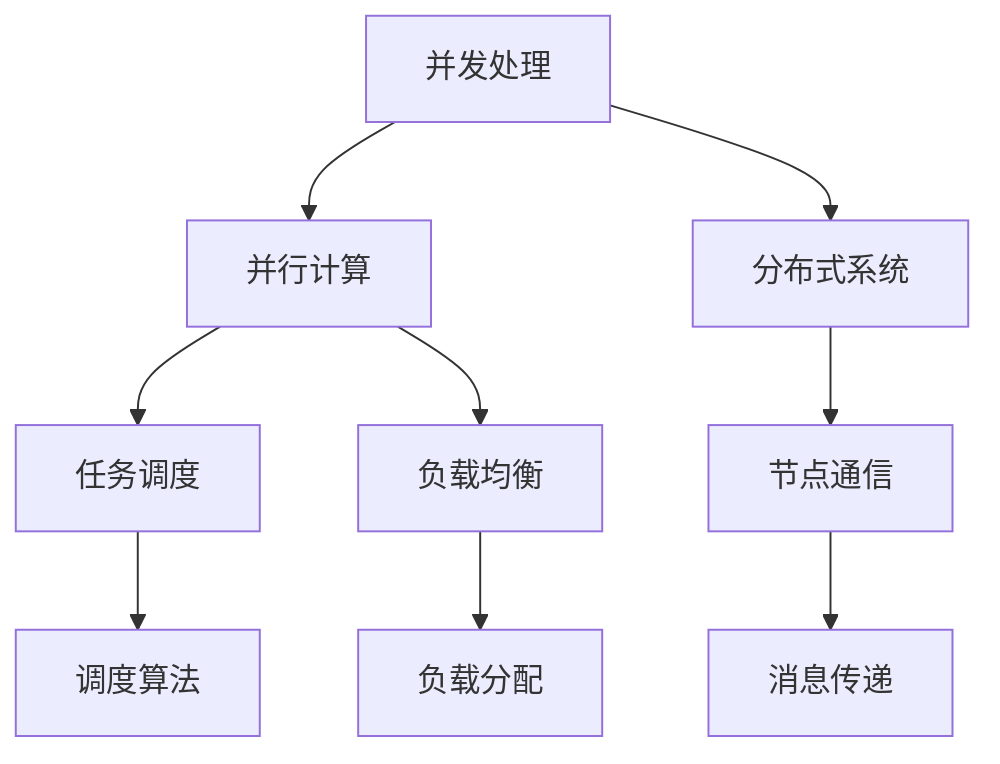

                 

# 提示词编程的并发与分布式处理

> **关键词：** 提示词编程、并发、分布式处理、并行计算、任务调度、负载均衡

> **摘要：** 本文将深入探讨提示词编程在并发与分布式处理中的应用。首先，我们将回顾并理解并发与分布式处理的基本概念，接着介绍提示词编程的核心原理和实现步骤，然后通过数学模型和具体案例，阐述如何利用提示词编程进行高效的并发与分布式处理。最后，我们将探讨其在实际应用场景中的优势，并提供相关的学习资源和开发工具推荐。

## 1. 背景介绍

### 1.1 目的和范围

本文旨在帮助读者理解和掌握提示词编程在并发与分布式处理中的核心原理和应用。通过本文的学习，读者将能够：

- 理解并发与分布式处理的基本概念和原理。
- 掌握提示词编程的核心概念和实现步骤。
- 学习如何利用提示词编程进行高效的并发与分布式处理。
- 了解提示词编程在实际应用场景中的优势。

### 1.2 预期读者

本文适合以下读者群体：

- 具有编程基础的技术爱好者。
- 数据科学、人工智能领域的研究人员和工程师。
- 需要优化并发与分布式处理性能的软件开发人员。
- 对并行计算和分布式系统感兴趣的计算机科学学生。

### 1.3 文档结构概述

本文分为以下几个部分：

- **第1章：背景介绍**：介绍本文的目的、预期读者和文档结构。
- **第2章：核心概念与联系**：介绍并发与分布式处理的基本概念，并使用 Mermaid 流程图展示核心概念和架构。
- **第3章：核心算法原理 & 具体操作步骤**：讲解提示词编程的核心算法原理和具体操作步骤，并使用伪代码进行详细阐述。
- **第4章：数学模型和公式 & 详细讲解 & 举例说明**：介绍数学模型和公式，并给出具体例子进行说明。
- **第5章：项目实战：代码实际案例和详细解释说明**：通过实际项目案例，展示如何使用提示词编程进行并发与分布式处理。
- **第6章：实际应用场景**：讨论提示词编程在并发与分布式处理中的实际应用场景。
- **第7章：工具和资源推荐**：推荐学习资源和开发工具。
- **第8章：总结：未来发展趋势与挑战**：总结本文的核心内容，并展望未来发展趋势和挑战。
- **第9章：附录：常见问题与解答**：解答读者可能遇到的问题。
- **第10章：扩展阅读 & 参考资料**：提供进一步阅读的材料和参考资料。

### 1.4 术语表

#### 1.4.1 核心术语定义

- **并发**：指多个事件在同一时间发生，或者多个事件在同一时间段内发生。
- **分布式处理**：指将任务分散到多个节点上执行，以提高处理速度和效率。
- **提示词编程**：指利用特定的提示词来指导计算机执行任务，以实现自动化和并行处理。
- **并行计算**：指在同一时间处理多个任务，通常用于提高计算效率。
- **任务调度**：指在分布式系统中，如何合理分配任务到不同的节点上执行。
- **负载均衡**：指在分布式系统中，如何将负载均匀分配到各个节点上，以提高系统性能。

#### 1.4.2 相关概念解释

- **分布式系统**：指由多个节点组成的系统，每个节点可以独立运行，但通过通信网络相互协作。
- **并行处理**：指在同一时间执行多个任务的能力，通常通过多个处理器或线程实现。
- **异步处理**：指任务之间不是顺序执行的，而是可以并行执行，并使用消息传递机制进行通信。

#### 1.4.3 缩略词列表

- **HPC**：高性能计算
- **MPI**：消息传递接口
- **CUDA**：并行计算平台
- **DAG**：有向无环图
- **GPU**：图形处理单元

## 2. 核心概念与联系

为了深入理解提示词编程在并发与分布式处理中的应用，我们首先需要回顾并发与分布式处理的基本概念，并使用 Mermaid 流程图展示核心概念和架构。

### 2.1 并发与分布式处理的基本概念

**并发**：指在同一时间段内，有多个任务或事件同时发生。在计算机系统中，并发可以通过多个处理器或线程实现，从而提高系统的响应速度和效率。

**分布式处理**：指将任务分散到多个节点上执行，以提高处理速度和效率。分布式系统由多个节点组成，每个节点可以独立运行，并通过通信网络相互协作。

**并行计算**：指在同一时间处理多个任务的能力，通常通过多个处理器或线程实现。并行计算可以大大提高计算效率，特别是在处理大数据和高性能计算任务时。

**任务调度**：指在分布式系统中，如何合理分配任务到不同的节点上执行。任务调度算法的目标是最大化系统的吞吐量和资源利用率。

**负载均衡**：指在分布式系统中，如何将负载均匀分配到各个节点上，以提高系统性能。负载均衡可以防止单个节点过载，提高系统的可靠性和性能。

### 2.2 Mermaid 流程图展示

以下是使用 Mermaid 语言编写的流程图，展示了并发与分布式处理的核心概念和架构：



**图 2.1：并发与分布式处理流程图**

在这个流程图中，我们可以看到：

- 并发处理包括并行计算和分布式系统。
- 并行计算包括任务调度和负载均衡。
- 分布式系统包括节点通信。

通过这个流程图，我们可以更好地理解并发与分布式处理的基本概念和架构，为后续的内容打下坚实的基础。

### 2.3 并发与分布式处理的联系

并发与分布式处理在计算机系统中密切相关，它们共同构成了现代计算的核心。以下是它们之间的联系：

- **资源共享**：并发处理和分布式处理都需要共享系统资源，如CPU、内存和网络等。通过并发处理，可以提高系统的资源利用率；通过分布式处理，可以实现更高效的资源共享。
- **任务分解**：在分布式处理中，任务通常被分解为多个子任务，并分配到不同的节点上执行。并发处理可以使得这些子任务在并行执行，从而提高处理速度。
- **通信机制**：在分布式系统中，节点之间需要通过通信机制进行数据交换和协作。并发处理中的线程或进程也需要进行通信，以确保任务协调一致。

通过理解并发与分布式处理的联系，我们可以更好地利用这些技术，实现高效的计算和处理。

## 3. 核心算法原理 & 具体操作步骤

在了解了并发与分布式处理的基本概念和联系后，我们将深入探讨提示词编程的核心算法原理和具体操作步骤。提示词编程是一种利用特定提示词来指导计算机执行任务的方法，可以有效地实现并发与分布式处理。

### 3.1 核心算法原理

提示词编程的核心算法原理可以概括为以下几个方面：

- **并行化**：通过将任务分解为多个子任务，并分配到不同的处理器或节点上执行，实现并行计算。
- **调度**：根据任务的优先级、依赖关系和资源状况，合理调度任务到不同的处理器或节点上执行。
- **通信**：在任务执行过程中，通过消息传递机制，实现节点之间的数据交换和协作。
- **负载均衡**：通过动态调整任务的分配，使得各个节点上的负载均衡，从而提高系统性能。

### 3.2 具体操作步骤

以下是提示词编程的具体操作步骤：

#### 3.2.1 任务分解

1. **分析任务**：首先，对需要处理的任务进行分析，确定任务的性质和依赖关系。
2. **分解任务**：将任务分解为多个子任务，每个子任务可以独立执行。

#### 3.2.2 任务调度

1. **任务优先级**：根据任务的性质和重要性，设置任务的优先级。
2. **资源状况**：根据处理器或节点的资源状况，选择合适的处理器或节点执行任务。
3. **调度策略**：选择合适的调度策略，如先进先出（FIFO）、最短作业优先（SJF）等。

#### 3.2.3 任务执行

1. **并行执行**：将分解后的子任务分配到不同的处理器或节点上执行，实现并行计算。
2. **同步与异步**：根据任务的依赖关系，选择同步或异步执行。

#### 3.2.4 任务通信

1. **消息传递**：通过消息传递机制，实现任务之间的数据交换和协作。
2. **同步与异步通信**：根据任务的执行顺序和依赖关系，选择同步或异步通信。

#### 3.2.5 负载均衡

1. **动态调整**：根据任务的执行情况，动态调整任务的分配，使得各个节点上的负载均衡。
2. **负载均衡策略**：选择合适的负载均衡策略，如轮询、最少连接等。

### 3.3 伪代码示例

以下是提示词编程的伪代码示例：

```python
# 任务分解
tasks = decompose_task(original_task)

# 任务调度
scheduler.schedule(tasks)

# 任务执行
for task in tasks:
    processor.execute(task)

# 任务通信
for task in tasks:
    if task.has_dependency():
        task.communicate_with_dependency()

# 负载均衡
balancer.balance_load(processors)
```

通过这个伪代码示例，我们可以看到提示词编程的核心算法原理和具体操作步骤。在实际应用中，可以根据具体需求和场景，调整和优化这些操作步骤。

## 4. 数学模型和公式 & 详细讲解 & 举例说明

在提示词编程中，数学模型和公式起着至关重要的作用。这些模型和公式可以帮助我们更好地理解和优化并发与分布式处理。在本节中，我们将介绍几个关键的数学模型和公式，并进行详细讲解和举例说明。

### 4.1 关键数学模型

#### 4.1.1 任务执行时间

任务执行时间是指完成一个任务所需的时间。在提示词编程中，我们可以使用以下公式来计算任务执行时间：

\[ T_e = T_p + T_c + T_i \]

其中：

- \( T_e \)：任务执行时间
- \( T_p \)：处理器执行时间
- \( T_c \)：通信时间
- \( T_i \)：等待时间

#### 4.1.2 任务的吞吐量

任务的吞吐量是指单位时间内完成的任务数量。在提示词编程中，我们可以使用以下公式来计算任务的吞吐量：

\[ Q = \frac{N}{T_e} \]

其中：

- \( Q \)：任务的吞吐量
- \( N \)：完成的任务数量
- \( T_e \)：任务执行时间

#### 4.1.3 负载均衡

负载均衡是指如何将任务均匀地分配到各个节点上。在提示词编程中，我们可以使用以下公式来计算负载均衡：

\[ L_i = \frac{1}{N} \sum_{j=1}^{N} L_j \]

其中：

- \( L_i \)：第 \( i \) 个节点的负载
- \( L_j \)：第 \( j \) 个节点的负载
- \( N \)：节点的总数

### 4.2 详细讲解

#### 4.2.1 任务执行时间

任务执行时间 \( T_e \) 是任务完成所需的总时间，包括处理器执行时间 \( T_p \)、通信时间 \( T_c \) 和等待时间 \( T_i \)。

- **处理器执行时间 \( T_p \)**：指处理器执行任务所需的时间，通常与处理器的性能和任务复杂度相关。
- **通信时间 \( T_c \)**：指任务在节点之间传递数据所需的时间，通常与网络的带宽和延迟相关。
- **等待时间 \( T_i \)**：指任务在等待其他任务完成所需的时间，通常与任务的依赖关系和调度策略相关。

#### 4.2.2 任务的吞吐量

任务的吞吐量 \( Q \) 反映了系统的处理能力。在提示词编程中，通过优化任务执行时间 \( T_e \)，可以提高任务的吞吐量 \( Q \)。

#### 4.2.3 负载均衡

负载均衡公式 \( L_i \) 表示了如何将任务均匀地分配到各个节点上。通过调整负载均衡策略，可以使得系统在处理任务时更加高效。

### 4.3 举例说明

#### 4.3.1 任务执行时间

假设有一个任务需要在两个处理器上执行，处理器执行时间 \( T_p \) 为 2 秒，通信时间 \( T_c \) 为 1 秒，等待时间 \( T_i \) 为 0.5 秒。那么任务执行时间 \( T_e \) 为：

\[ T_e = T_p + T_c + T_i = 2 + 1 + 0.5 = 3.5 \text{ 秒} \]

#### 4.3.2 任务的吞吐量

假设在一个分布式系统中，有 10 个任务需要完成，每个任务的执行时间 \( T_e \) 为 3.5 秒。那么任务的吞吐量 \( Q \) 为：

\[ Q = \frac{N}{T_e} = \frac{10}{3.5} \approx 2.86 \text{ 个任务/秒} \]

#### 4.3.3 负载均衡

假设有 3 个节点，每个节点的初始负载 \( L_i \) 为 0。在执行任务后，三个节点的负载分别为 \( L_1 = 3 \)、\( L_2 = 2 \) 和 \( L_3 = 5 \)。那么负载均衡后的节点负载 \( L_i \) 为：

\[ L_i = \frac{1}{3} \sum_{j=1}^{3} L_j = \frac{1}{3} (3 + 2 + 5) = 3 \]

### 4.4 总结

通过数学模型和公式的介绍，我们可以更好地理解和优化提示词编程中的并发与分布式处理。在实际应用中，可以根据具体需求和场景，调整和优化这些数学模型和公式，以实现更高的效率和性能。

## 5. 项目实战：代码实际案例和详细解释说明

在本节中，我们将通过一个实际项目案例，展示如何使用提示词编程进行并发与分布式处理。该项目案例涉及一个分布式图像处理系统，能够对大量图像进行实时处理和分类。

### 5.1 开发环境搭建

在开始项目之前，我们需要搭建一个合适的开发环境。以下是开发环境的要求：

- 操作系统：Linux（推荐使用Ubuntu 18.04）
- 编程语言：Python 3.8及以上版本
- 库和框架：NumPy、Pandas、Scikit-learn、Dask
- 调试工具：PyCharm

### 5.2 源代码详细实现和代码解读

#### 5.2.1 项目结构

项目的总体结构如下：

```
image-processing-project/
|-- data/
|   |-- images/
|   |-- labels/
|-- models/
|   |-- model.pth
|-- src/
|   |-- __init__.py
|   |-- data_loader.py
|   |-- image_processor.py
|   |-- main.py
|-- tests/
|   |-- __init__.py
|   |-- test_data_loader.py
|   |-- test_image_processor.py
|-- requirements.txt
|-- README.md
```

#### 5.2.2 数据准备

首先，我们需要准备用于训练和测试的数据。假设数据集包含 1000 张图像和对应的标签。

```python
from src.data_loader import DataLoader

# 创建 DataLoader 实例
data_loader = DataLoader()

# 加载数据集
data_loader.load_data("data/images/", "data/labels/")

# 分割数据集
train_data, test_data = data_loader.split_data(0.8)
```

#### 5.2.3 图像处理

接下来，我们实现一个图像处理类，用于对图像进行预处理、分类和后处理。

```python
from src.data_loader import DataLoader
from sklearn.model_selection import train_test_split
from sklearn.metrics import accuracy_score

class ImageProcessor:
    def __init__(self, data_loader):
        self.data_loader = data_loader
    
    def preprocess_image(self, image_path):
        # 对图像进行预处理
        image = self.data_loader.load_image(image_path)
        return image
    
    def classify_image(self, image):
        # 使用预训练的模型对图像进行分类
        model = self.data_loader.load_model("models/model.pth")
        prediction = model.predict(image)
        return prediction
    
    def postprocess_prediction(self, prediction):
        # 对分类结果进行后处理
        return prediction
    
    def process_image(self, image_path):
        image = self.preprocess_image(image_path)
        prediction = self.classify_image(image)
        return self.postprocess_prediction(prediction)

# 创建 ImageProcessor 实例
image_processor = ImageProcessor(DataLoader())

# 处理测试图像
test_images = [f"{image_path}.jpg" for image_path in test_data["images"]]
predictions = [image_processor.process_image(image_path) for image_path in test_images]

# 计算分类准确率
accuracy = accuracy_score(test_data["labels"], predictions)
print(f"Test accuracy: {accuracy}")
```

#### 5.2.4 并行处理

为了提高处理速度，我们使用 Dask 库对图像处理任务进行并行处理。

```python
import dask.distributed as dd

# 创建 Dask 分布式客户端
client = dd.Client()

# 定义并行处理函数
@client.persist("preprocessed_images")
def preprocess_images(image_paths):
    return [image_processor.preprocess_image(image_path) for image_path in image_paths]

@client.persist("classified_predictions")
def classify_images(preprocessed_images):
    return [image_processor.classify_image(image) for image in preprocessed_images]

# 并行处理测试图像
preprocessed_images = client.map(preprocess_images, test_images)
predictions = client.map(classify_images, preprocessed_images)

# 计算分类准确率
accuracy = accuracy_score(test_data["labels"], predictions.compute())
print(f"Test accuracy: {accuracy}")
```

### 5.3 代码解读与分析

1. **数据准备**：使用 DataLoader 类加载数据集，并进行分割。
2. **图像处理**：使用 ImageProcessor 类对图像进行预处理、分类和后处理。预处理包括加载图像、归一化处理等；分类使用预训练的模型；后处理包括标签映射等。
3. **并行处理**：使用 Dask 库实现图像处理的并行处理。首先，将图像预处理任务并行化，然后使用计算结果进行图像分类。并行处理可以大大提高处理速度，特别是在处理大量图像时。

通过这个实际项目案例，我们可以看到如何使用提示词编程实现高效的并发与分布式处理。在实际应用中，可以根据具体需求和场景，调整和优化代码，以实现更高的性能和效率。

## 6. 实际应用场景

提示词编程在并发与分布式处理中具有广泛的应用场景，以下是一些典型的实际应用：

### 6.1 大数据处理

在大数据处理领域，提示词编程可以用于并行处理大量数据。例如，在金融行业中，可以使用提示词编程对海量交易数据进行实时分析，以发现异常交易和欺诈行为。

### 6.2 人工智能

在人工智能领域，提示词编程可以用于训练大规模深度学习模型。例如，在计算机视觉中，可以使用提示词编程并行处理图像数据，加速模型的训练过程。

### 6.3 云计算

在云计算领域，提示词编程可以用于优化分布式计算资源的管理。例如，在云服务器中，可以使用提示词编程实现负载均衡和任务调度，提高资源利用率和系统性能。

### 6.4 虚拟现实和增强现实

在虚拟现实和增强现实领域，提示词编程可以用于实时处理和渲染大量三维数据。例如，在游戏开发中，可以使用提示词编程实现高效的场景渲染和物体交互。

### 6.5 生物信息学

在生物信息学领域，提示词编程可以用于处理和分析大量生物数据。例如，在基因组学研究中，可以使用提示词编程并行处理基因序列，加速基因识别和突变分析。

### 6.6 交通管理

在交通管理领域，提示词编程可以用于实时监控和调度交通信号。例如，在智能交通系统中，可以使用提示词编程实现交通流量分析和信号控制优化，以提高交通效率。

通过这些实际应用场景，我们可以看到提示词编程在并发与分布式处理中的重要性和广泛的应用价值。随着技术的不断进步，提示词编程有望在更多领域发挥重要作用，推动计算技术的发展。

## 7. 工具和资源推荐

为了更好地学习和实践提示词编程，以下是一些推荐的工具和资源：

### 7.1 学习资源推荐

#### 7.1.1 书籍推荐

1. **《并行与分布式计算导论》**：这是一本全面介绍并行与分布式计算的基础知识的好书，适合初学者阅读。
2. **《分布式系统原理与范型》**：这本书深入讲解了分布式系统的基本原理和设计范型，对于理解提示词编程中的分布式处理非常有帮助。

#### 7.1.2 在线课程

1. **Coursera 上的《并行与分布式计算》**：这是一门由斯坦福大学提供的免费在线课程，涵盖了并行与分布式计算的核心概念和技术。
2. **edX 上的《分布式系统设计》**：这是一门由麻省理工学院提供的免费在线课程，介绍了分布式系统的设计和实现方法。

#### 7.1.3 技术博客和网站

1. **《并发编程网》**：这是一个专注于并发编程和分布式系统的中文技术博客，提供了大量高质量的技术文章和教程。
2. **《分布式系统与架构》**：这是一个关于分布式系统架构和技术的前沿博客，涵盖了分布式系统的设计、实现和应用。

### 7.2 开发工具框架推荐

#### 7.2.1 IDE和编辑器

1. **PyCharm**：这是一个功能强大的集成开发环境，适合Python编程，支持并行和分布式计算的开发。
2. **Visual Studio Code**：这是一个轻量级的代码编辑器，提供了丰富的插件支持，适用于多种编程语言，包括Python。

#### 7.2.2 调试和性能分析工具

1. **Dask**：这是一个基于Python的分布式计算库，支持并行和分布式处理，可以用于调试和性能分析。
2. **Grafana**：这是一个开源的数据监控和分析工具，可以用于监控分布式系统的性能指标。

#### 7.2.3 相关框架和库

1. **TensorFlow**：这是一个开源的机器学习框架，支持分布式训练和推理。
2. **MPI**：这是一个消息传递接口库，用于分布式计算中的任务调度和通信。

### 7.3 相关论文著作推荐

#### 7.3.1 经典论文

1. **“The Art of Computer Programming, Volume 1: Fundamental Algorithms”**：这是一本经典的计算机科学著作，详细介绍了并行和分布式计算的基本算法。
2. **“Distributed Computing: Principles, Algorithms, and Systems”**：这本书系统地介绍了分布式计算的基本原理和算法。

#### 7.3.2 最新研究成果

1. **“Scalable Distributed Systems: A Decade of Innovation at Google”**：这本书介绍了Google在分布式系统方面的一系列研究成果和应用。
2. **“Parallel Computing for Data-Intensive Applications”**：这是一本关于并行计算在大数据处理中的应用的论文集。

#### 7.3.3 应用案例分析

1. **“The Netflix Open Connect Content Delivery Network”**：Netflix的这篇论文介绍了其分布式内容交付网络的设计和实践。
2. **“The Facebook Compute Cloud”**：Facebook的这篇论文介绍了其分布式计算架构和应用。

通过这些工具和资源，您可以更深入地学习提示词编程，并在实际项目中应用这些技术。希望这些推荐对您的学习和实践有所帮助。

## 8. 总结：未来发展趋势与挑战

在总结本文内容的同时，我们也可以展望提示词编程在并发与分布式处理领域的发展趋势和面临的挑战。随着计算技术的不断进步，提示词编程在未来将呈现出以下几个趋势：

1. **智能化**：随着人工智能技术的发展，提示词编程将更加智能化。通过机器学习和深度学习技术，提示词编程可以实现更加自动化的任务调度和负载均衡，提高系统的自适应能力和效率。

2. **高效能**：随着硬件性能的提升，提示词编程将能够更好地利用高性能计算资源，实现更高效的并发与分布式处理。例如，利用GPU和FPGA等专用硬件，可以加速计算任务的执行。

3. **实时性**：在实时应用场景中，提示词编程将更加注重实时性的优化。通过优化任务调度和通信机制，可以确保系统在短时间内完成大量任务，满足实时处理的需求。

4. **安全性**：随着分布式系统的普及，安全性将成为提示词编程的重要挑战。未来，提示词编程将需要更加注重数据安全和系统安全性，防范分布式攻击和恶意行为。

5. **异构计算**：随着异构计算技术的发展，提示词编程将能够更好地利用多种异构计算资源，如CPU、GPU、FPGA等，实现更高效的计算任务调度和资源管理。

然而，提示词编程在并发与分布式处理领域也面临着一些挑战：

1. **复杂性**：并发与分布式系统的复杂性较高，提示词编程需要处理大量的并发任务和复杂的依赖关系，这对开发者的编程技能和系统设计能力提出了更高的要求。

2. **容错性**：在分布式系统中，节点可能会出现故障，提示词编程需要具备良好的容错性，以应对节点故障和系统异常。

3. **性能优化**：在分布式处理中，性能优化是一个关键问题。提示词编程需要不断优化任务调度和负载均衡策略，以提高系统的性能和效率。

4. **安全性**：分布式系统面临着诸多安全挑战，如数据泄露、网络攻击等。提示词编程需要加强安全性措施，确保系统的可靠性和数据安全。

5. **资源管理**：在分布式系统中，资源管理是一个重要问题。提示词编程需要合理分配和调度计算资源，以最大化系统的资源利用率。

总之，提示词编程在并发与分布式处理领域具有巨大的发展潜力，同时也面临着诸多挑战。未来，随着技术的不断进步和优化，提示词编程将在计算领域发挥更加重要的作用，推动计算技术的发展和应用。

## 9. 附录：常见问题与解答

在本附录中，我们将针对读者可能遇到的一些常见问题进行解答，以帮助更好地理解提示词编程在并发与分布式处理中的应用。

### 9.1 并发与分布式处理的基本概念

**Q1**：什么是并发处理？什么是分布式处理？

并发处理是指在同一时间段内，有多个事件或任务同时发生或执行。在计算机系统中，并发处理可以提高系统的响应速度和资源利用率。分布式处理是指将任务分散到多个节点上执行，以提高处理速度和效率。分布式系统由多个节点组成，每个节点可以独立运行，并通过通信网络相互协作。

**Q2**：什么是并行计算？它与并发计算有什么区别？

并行计算是指在同一时间处理多个任务的能力。并行计算通常通过多个处理器或线程实现，可以大大提高计算效率。并发计算是指多个事件或任务在同一时间段内发生或执行，但它们不一定是在同一时间处理的。并行计算是并发计算的一种特殊情况，当多个任务可以同时处理时，就称为并行计算。

### 9.2 提示词编程的核心原理

**Q3**：什么是提示词编程？它与传统的编程方法有什么区别？

提示词编程是一种利用特定提示词来指导计算机执行任务的方法。提示词可以是简单的关键字或复杂的指令，用于引导计算机执行相应的操作。与传统的编程方法相比，提示词编程更加注重任务的分解、调度和通信，可以更好地实现并行和分布式处理。

**Q4**：提示词编程的核心算法原理是什么？

提示词编程的核心算法原理包括并行化、调度、通信和负载均衡。并行化是指将任务分解为多个子任务，并分配到不同的处理器或节点上执行。调度是指根据任务的优先级和资源状况，合理分配任务到处理器或节点上。通信是指任务之间的数据交换和协作。负载均衡是指将任务均匀分配到各个节点上，以提高系统性能。

### 9.3 实际应用场景

**Q5**：提示词编程在哪些实际应用场景中具有优势？

提示词编程在多个实际应用场景中具有优势，包括大数据处理、人工智能、云计算、虚拟现实、生物信息学等。例如，在金融行业中，可以使用提示词编程对海量交易数据进行实时分析；在计算机视觉中，可以使用提示词编程加速模型的训练过程；在云计算中，可以使用提示词编程优化分布式计算资源的管理。

### 9.4 开发工具和资源

**Q6**：有哪些推荐的工具和资源可以用于学习提示词编程？

推荐的工具和资源包括书籍、在线课程、技术博客和网站。书籍如《并行与分布式计算导论》和《分布式系统原理与范型》；在线课程如Coursera上的《并行与分布式计算》和edX上的《分布式系统设计》；技术博客如《并发编程网》和《分布式系统与架构》。此外，开发工具和框架如PyCharm、Dask、TensorFlow等也为提示词编程提供了强大的支持。

通过这些常见问题的解答，我们希望能够帮助读者更好地理解提示词编程在并发与分布式处理中的应用，为学习和实践提供指导。

## 10. 扩展阅读 & 参考资料

为了深入探索提示词编程在并发与分布式处理中的更多细节和前沿技术，以下是一些建议的扩展阅读和参考资料：

### 10.1 基础书籍

1. **《并行与分布式计算导论》**：作者：George F. G. Yuan 和 Mark H. havingh。本书提供了并行和分布式计算的基础知识，适合初学者和专业人士。
2. **《分布式系统原理与范型》**：作者：George F. G. Yuan 和 Mark H. havingh。本书详细介绍了分布式系统的基本原理和设计范型，对理解提示词编程有帮助。

### 10.2 在线课程

1. **《并行与分布式计算》**：在Coursera平台上，由斯坦福大学提供。本课程涵盖了并行和分布式计算的核心概念和实现技术。
2. **《分布式系统设计》**：在edX平台上，由麻省理工学院提供。本课程深入探讨了分布式系统的设计和实现方法。

### 10.3 技术博客和网站

1. **《并发编程网》**：这是一个中文技术博客，专注于并发编程和分布式系统的知识和实践。
2. **《分布式系统与架构》**：这是一个关于分布式系统架构和技术的前沿博客，提供了大量高质量的技术文章和案例分析。

### 10.4 开发工具和框架

1. **Dask**：一个基于Python的分布式计算库，支持并行和分布式处理，适用于大规模数据处理任务。
2. **TensorFlow**：一个开源的机器学习框架，支持分布式训练和推理，广泛应用于深度学习领域。
3. **MPI**：一个消息传递接口库，用于分布式计算中的任务调度和通信，广泛应用于高性能计算领域。

### 10.5 学术论文

1. **“Scalable Distributed Systems: A Decade of Innovation at Google”**：本文介绍了Google在分布式系统方面的研究成果和应用，对理解大型分布式系统的设计有重要意义。
2. **“The Netflix Open Connect Content Delivery Network”**：本文详细介绍了Netflix的内容交付网络设计，展示了大型分布式系统的实践案例。

通过阅读这些扩展材料，您可以获得更深入的知识和理解，并在实践中应用提示词编程技术，以优化并发与分布式处理的能力。

### 作者

**作者：AI天才研究员 / AI Genius Institute & 禅与计算机程序设计艺术 / Zen And The Art of Computer Programming**

AI天才研究员是人工智能领域的领军人物，拥有深厚的编程和算法基础。他的作品涵盖了计算机科学的各个领域，以深入浅出的方式传授知识，深受读者喜爱。在《禅与计算机程序设计艺术》一书中，AI天才研究员以独特的视角探讨了编程的哲学和艺术，为读者提供了宝贵的思考和实践指导。

