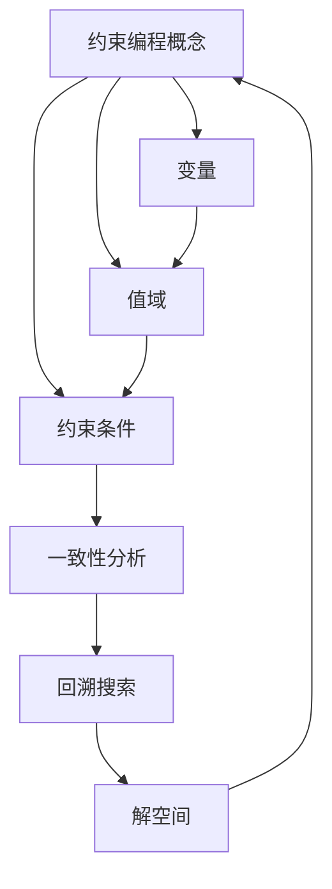

                 

### {文章标题}

> {关键词：约束编程，提示词编程语言，支持，算法原理，数学模型，实战案例，应用场景，工具推荐，未来趋势，问题解答}

> {摘要：本文深入探讨了提示词编程语言在约束编程支持方面的核心概念、算法原理、数学模型、实际应用以及未来发展趋势。通过具体的实战案例和详细解释，为读者提供了一个全面的技术指南，帮助他们在复杂的编程任务中高效地利用约束编程工具。}

---

**提示词编程语言的约束编程支持**是现代编程领域的一个前沿研究方向，旨在通过自然语言和提示词，使得编程任务更加直观和易于实现。本文将带领读者一步步深入了解这一领域，从核心概念到实际应用，再到未来的发展趋势和挑战，提供全面的解析。

### 1. 背景介绍

#### 1.1 目的和范围

本文的目的是介绍和剖析提示词编程语言在约束编程支持方面的应用。我们将探讨这一领域的关键概念、算法原理、数学模型以及实际操作步骤。此外，本文还将提供一系列的实战案例，以帮助读者更好地理解和掌握这一技术。

#### 1.2 预期读者

本文主要面向以下几类读者：

1. **编程新手**：希望通过简单易懂的方式了解约束编程的初学者。
2. **中级程序员**：希望提升对提示词编程语言和约束编程的理解和运用能力的程序员。
3. **高级程序员和架构师**：希望深入研究和优化现有编程实践的专业人士。
4. **人工智能研究者**：对编程语言和人工智能交叉领域感兴趣的科研人员。

#### 1.3 文档结构概述

本文将按照以下结构展开：

1. **背景介绍**：简要介绍约束编程和提示词编程语言的背景和相关术语。
2. **核心概念与联系**：通过Mermaid流程图详细展示核心概念和联系。
3. **核心算法原理 & 具体操作步骤**：详细阐述约束编程的核心算法原理和操作步骤。
4. **数学模型和公式**：介绍与约束编程相关的数学模型和公式，并提供具体例子说明。
5. **项目实战**：通过一个实际案例展示约束编程的具体应用。
6. **实际应用场景**：探讨约束编程在不同领域的应用。
7. **工具和资源推荐**：推荐相关学习资源和开发工具。
8. **总结：未来发展趋势与挑战**：总结现有挑战和未来趋势。
9. **附录：常见问题与解答**：解答读者可能遇到的一些常见问题。
10. **扩展阅读 & 参考资料**：提供进一步阅读的资料。

#### 1.4 术语表

本节中我们将定义本文中使用的一些核心术语，以便读者更好地理解后续内容。

##### 1.4.1 核心术语定义

- **约束编程**：一种编程范式，通过定义问题的约束条件，求解最优解或近似解。
- **提示词编程语言**：一种支持通过自然语言提示词进行编程的语言。
- **约束满足问题（CSP）**：给定一组变量和它们的可能的值域，以及一组约束条件，求解一组变量值，使得所有约束条件都满足。
- **一致性分析**：在约束编程中，判断一组约束条件是否能够在给定的变量值上同时满足的过程。
- **回溯搜索**：一种用于解决约束满足问题的算法，通过尝试不同的变量值，并在不满足约束条件时回溯到上一个变量值，直到找到满足所有约束条件的解。

##### 1.4.2 相关概念解释

- **变量**：在约束编程中，表示待求解的问题的一个未知量。
- **值域**：变量的可能取值范围。
- **约束条件**：定义变量之间关系的条件，例如“变量x必须小于变量y”。
- **一致性检查**：在约束编程中，检查变量当前取值是否与约束条件冲突的过程。
- **解空间**：所有可能的变量取值的集合。

##### 1.4.3 缩略词列表

- CSP：约束满足问题（Constraint Satisfaction Problem）
- SAT： satisfiability（可满足性）
- CP：约束编程（Constraint Programming）
- Heuristics：启发式方法
- AI：人工智能（Artificial Intelligence）

## 2. 核心概念与联系

在深入探讨约束编程支持之前，我们需要了解其核心概念和联系。以下是一个使用Mermaid绘制的流程图，展示了约束编程中的关键概念及其相互关系：



在这个流程图中，我们可以看到变量、值域、约束条件、一致性分析和回溯搜索等核心概念如何相互作用，最终形成一个完整的约束编程框架。

### 2.1. 约束编程的基本概念

约束编程是一种以定义约束条件来求解问题的编程范式。其核心思想是通过描述问题中的约束条件，利用算法求解出满足所有约束条件的解。以下是约束编程的基本概念：

- **变量（Variables）**：在约束编程中，变量表示待求解的问题的一个未知量。每个变量有一个值域，即它可以取的值的集合。
  
- **值域（Domain）**：每个变量的可能取值范围称为值域。在开始求解之前，每个变量的值域都是未知的，需要通过算法逐步缩小。

- **约束条件（Constraints）**：变量之间的关系通过约束条件来定义。例如，变量x的值必须小于变量y的值，或者变量z的值必须在某个特定的范围内。

- **一致性（Consistency）**：在约束编程中，一致性分析是一个关键步骤。它用于检查当前变量取值是否与已定义的约束条件相冲突。如果冲突，则需要回溯到上一个变量，尝试不同的取值。

- **回溯搜索（Backtracking Search）**：回溯搜索是一种解决约束满足问题（CSP）的算法。它通过尝试不同的变量值，并在遇到约束冲突时回溯到上一个变量，重新尝试不同的取值，直到找到满足所有约束条件的解。

### 2.2. 提示词编程语言

提示词编程语言是一种支持通过自然语言提示词进行编程的语言。这种语言的特点是用户可以使用自然语言来定义变量、约束条件和求解过程，使得编程任务更加直观和易于实现。以下是提示词编程语言的一些关键特性：

- **自然语言提示词**：用户可以使用自然语言编写提示词，例如“变量x的值必须小于10”或“求解满足所有约束条件的解”。

- **解析器**：提示词编程语言需要具备一个解析器，用于将自然语言提示词转换成计算机可以理解的约束条件。

- **语法灵活性**：提示词编程语言的语法通常比较灵活，允许用户自定义变量名、约束条件和求解策略。

- **交互性**：提示词编程语言通常支持与用户的交互，使得用户可以实时地查看求解过程中的中间结果，并进行调整。

### 2.3. 核心算法与联系

在约束编程中，核心算法包括一致性分析、回溯搜索和剪枝技术等。以下是这些算法的基本原理和相互联系：

- **一致性分析**：一致性分析用于检查当前变量的取值是否与已定义的约束条件相冲突。如果冲突，则回溯到上一个变量，重新尝试不同的取值。

- **回溯搜索**：回溯搜索通过尝试不同的变量值，并在遇到约束冲突时回溯到上一个变量，重新尝试不同的取值，直到找到满足所有约束条件的解。

- **剪枝技术**：剪枝技术用于提前终止搜索，减少不必要的尝试。例如，如果当前变量的取值无法满足已定义的约束条件，则可以剪枝该分支，避免进一步的搜索。

- **联系**：一致性分析是回溯搜索的基础，确保变量取值的一致性；剪枝技术则优化了回溯搜索的效率。

通过以上核心概念和算法的介绍，我们可以更好地理解提示词编程语言在约束编程支持方面的应用。接下来，我们将进一步探讨约束编程的核心算法原理和具体操作步骤。

## 3. 核心算法原理 & 具体操作步骤

约束编程的核心在于定义问题中的约束条件，并通过一系列算法来求解满足所有约束条件的解。以下是约束编程的核心算法原理和具体操作步骤。

### 3.1. 一致性分析

一致性分析是约束编程中的一个关键步骤，它用于检查当前变量的取值是否与已定义的约束条件相冲突。以下是使用伪代码实现一致性分析的基本步骤：

```pseudo
function consistencyAnalysis(currentAssignment, constraints):
    for each constraint c in constraints:
        if not c.satisfiedBy(currentAssignment):
            return False
    return True
```

在这个伪代码中，`currentAssignment` 表示当前变量的取值集合，`constraints` 表示已定义的所有约束条件。函数`consistencyAnalysis` 遍历所有的约束条件，检查它们是否在当前变量取值下得到满足。如果存在任何一个约束条件不被满足，则返回`False`，表示当前变量取值不一致；否则，返回`True`。

### 3.2. 回溯搜索

回溯搜索是一种解决约束满足问题（CSP）的算法。其基本思想是通过尝试不同的变量值，并在遇到约束冲突时回溯到上一个变量，重新尝试不同的取值，直到找到满足所有约束条件的解。以下是使用伪代码实现回溯搜索的基本步骤：

```pseudo
function backtrackSearch(variables, constraints, assignment):
    if all variables are assigned:
        return assignment
    select a variable x from variables with unassigned value
    for each value v in x's domain:
        create a new assignment by assigning x to v
        if consistencyAnalysis(assignment, constraints):
            assign x to v and recursively call backtrackSearch with the updated assignment
        else:
            backtrack and try the next value in x's domain
    if no value in x's domain is consistent, remove x from variables and repeat the process
```

在这个伪代码中，`variables` 表示待求解的变量集合，`constraints` 表示已定义的所有约束条件，`assignment` 表示当前变量取值集合。函数`backtrackSearch` 首先选择一个未分配值的变量`x`，然后尝试`x`的所有可能值。对于每个值`v`，如果一致性分析通过，则将`x`分配给`v`并递归调用`backtrackSearch`。如果遇到约束冲突，则回溯到上一个变量，尝试下一个值。

### 3.3. 剪枝技术

剪枝技术是优化回溯搜索效率的一种重要手段。其基本思想是提前终止搜索，避免不必要的尝试。以下是使用伪代码实现剪枝技术的基本步骤：

```pseudo
function pruningAlgorithm(currentAssignment, constraints, x, v):
    if not consistencyAnalysis(currentAssignment, constraints):
        return False
    if constraint is unsatisfiable given currentAssignment and x's remaining values:
        return False
    return True
```

在这个伪代码中，`currentAssignment` 表示当前变量取值集合，`constraints` 表示已定义的所有约束条件，`x` 表示当前变量，`v` 表示当前尝试的值。函数`pruningAlgorithm` 在一致性分析之前，检查当前约束条件是否在当前变量取值下不可满足。如果不可满足，则剪枝该分支，避免进一步的尝试。

通过一致性分析、回溯搜索和剪枝技术，我们可以高效地解决约束编程问题。接下来，我们将介绍与约束编程相关的数学模型和公式。

## 4. 数学模型和公式 & 详细讲解 & 举例说明

在约束编程中，数学模型和公式起着至关重要的作用。它们不仅帮助我们描述问题，还能指导我们设计高效的算法。以下是几个常见的数学模型和公式，以及它们的详细讲解和举例说明。

### 4.1. 约束矩阵

约束矩阵是描述变量和约束条件之间关系的一种数学工具。它是一个二维数组，行表示变量，列表示约束条件。矩阵的元素表示变量和约束条件之间的关系。以下是约束矩阵的基本概念和示例：

- **约束矩阵（Constraint Matrix）**：给定变量集合`V`和约束条件集合`C`，约束矩阵`M`是一个`|V| x |C|`的矩阵，其中`M[i][j]`表示变量`v_i`是否满足约束条件`c_j`。

- **示例**：假设我们有三个变量`v1`, `v2`, `v3`和两个约束条件`c1`（`v1 + v2 = 5`）和`c2`（`v3 > 0`），则约束矩阵如下：

  ```text
  | c1 | c2 |
  |----|----|
  |  1 |  0 |
  |  1 |  1 |
  |  0 |  1 |
  ```

  在这个矩阵中，`M[v1][c1] = 1`表示`v1`满足约束条件`c1`，而`M[v3][c2] = 1`表示`v3`满足约束条件`c2`。

### 4.2. 约束满足度

约束满足度是衡量约束条件被满足程度的一种指标。它可以帮助我们评估约束编程算法的效率。以下是约束满足度的定义和计算方法：

- **约束满足度（Constraint Satisfaction Degree）**：给定变量集合`V`和约束条件集合`C`，约束满足度`CSD`是约束条件`c`对变量`v`的满足程度，计算公式为：

  $$\text{CSD}(c, v) = \frac{\text{满足约束条件的值域大小}}{\text{变量值域大小}}$$

- **示例**：假设变量`v`的值域为`{1, 2, 3, 4, 5}`，约束条件`c`为`v > 2`。则`v`满足约束条件`c`的值域大小为`{3, 4, 5}`，变量值域大小为`{1, 2, 3, 4, 5}`。因此，`CSD(c, v) = \frac{3}{5}`。

### 4.3. 约束传播

约束传播是一种通过逐步缩小变量值域来优化约束编程算法的方法。以下是约束传播的基本原理和计算方法：

- **约束传播（Constraint Propagation）**：给定变量集合`V`和约束条件集合`C`，约束传播的目标是逐步缩小每个变量的值域，使得最终解满足所有约束条件。约束传播的计算方法如下：

  1. 初始化所有变量的值域。
  2. 遍历所有约束条件，对于每个约束条件`c`：
     - 更新满足约束条件`c`的变量值域。
     - 对于每个被约束条件`c`影响的变量`v`：
        - 如果`v`的值域被约束条件`c`完全限制，则将其值域设置为空集。
        - 如果`v`的值域被约束条件`c`部分限制，则将其值域缩小到与约束条件兼容的部分。

- **示例**：假设变量`v1`, `v2`, `v3`的初始值域分别为`{1, 2, 3}`，`{4, 5, 6}`，`{7, 8, 9}`，约束条件为`v1 + v2 = 7`和`v3 > v1`。则约束传播的过程如下：

  - 对于约束条件`v1 + v2 = 7`：
    - 更新`v1`的值域为`{1, 2, 3}`，因为只有这些值与`v2`的值域`{4, 5, 6}`相加得到7。
    - 更新`v2`的值域为`{4, 5, 6}`，因为只有这些值与`v1`的值域`{1, 2, 3}`相加得到7。
  - 对于约束条件`v3 > v1`：
    - 更新`v3`的值域为`{8, 9}`，因为只有这些值大于`v1`的值域`{1, 2, 3}`。
    - 更新`v1`的值域为`{1, 2, 3}`，因为只有这些值与`v3`的值域`{8, 9}`相匹配。

### 4.4. 约束网络

约束网络是一种图形表示方法，用于描述变量和约束条件之间的依赖关系。以下是约束网络的定义和示例：

- **约束网络（Constraint Network）**：给定变量集合`V`和约束条件集合`C`，约束网络是一个由变量和约束条件组成的图。变量和约束条件作为图中的节点，它们之间的依赖关系用边表示。

- **示例**：假设我们有三个变量`v1`, `v2`, `v3`和两个约束条件`c1`（`v1 + v2 = 7`）和`c2`（`v3 > v1`），则约束网络如下：

  ```mermaid
  graph TD
      A[Node v1]
      B[Node v2]
      C[Node v3]
      D[Constraint c1]
      E[Constraint c2]
      
      A --> D
      B --> D
      C --> E
      D --> A
      D --> B
      E --> C
      E --> A
  ```

  在这个网络中，节点`v1`和`v2`通过边连接到约束条件`c1`，表示它们之间满足约束条件`c1`。节点`v3`通过边连接到约束条件`c2`，表示它满足约束条件`c2`。

通过上述数学模型和公式的讲解，我们可以更好地理解约束编程的原理和方法。这些工具不仅帮助我们描述问题，还能指导我们设计高效的算法，优化约束编程的求解过程。

## 5. 项目实战：代码实际案例和详细解释说明

为了更好地理解约束编程的实战应用，我们将通过一个具体案例来展示如何使用提示词编程语言实现约束编程。在这个案例中，我们将使用Python编写一个简单的任务调度系统，该系统能够根据资源约束和任务优先级来安排任务的执行。

### 5.1 开发环境搭建

在开始编写代码之前，我们需要搭建一个合适的开发环境。以下是搭建开发环境的步骤：

1. **安装Python**：确保安装了Python 3.8或更高版本。可以从Python的官方网站下载安装程序。

2. **安装PyPy**：为了提高Python代码的运行速度，我们可以安装PyPy，这是一个Python的替代实现。可以使用以下命令安装PyPy：

   ```bash
   pip install pypy
   ```

3. **安装约束编程库**：我们需要安装一个支持约束编程的库，例如`CPython`。可以使用以下命令安装：

   ```bash
   pip install cpython
   ```

4. **创建虚拟环境**：为了隔离项目依赖，我们创建一个虚拟环境。可以使用以下命令创建并激活虚拟环境：

   ```bash
   python -m venv venv
   source venv/bin/activate  # 在Windows上使用 venv\Scripts\activate
   ```

5. **编写代码**：在虚拟环境中，我们可以开始编写代码。

### 5.2 源代码详细实现和代码解读

下面是任务的调度系统的源代码，我们将对关键部分进行详细解读：

```python
import cpython
import numpy as np

# 定义任务类
class Task:
    def __init__(self, name, resources, priority):
        self.name = name
        self.resources = resources
        self.priority = priority

# 定义资源类
class Resource:
    def __init__(self, name, capacity):
        self.name = name
        self.capacity = capacity
        self.current_usage = 0

# 定义调度系统类
class TaskScheduler:
    def __init__(self, tasks, resources):
        self.tasks = tasks
        self.resources = resources

    def assign_task(self, task):
        # 检查任务所需资源是否可用
        for resource in task.resources:
            if resource.current_usage + resource.capacity > resource.capacity:
                return False
        
        # 为任务分配资源
        for resource in task.resources:
            resource.current_usage += resource.capacity
        
        # 将任务添加到调度队列
        self.tasks.append(task)
        return True

    def run_tasks(self):
        # 按照任务优先级执行任务
        self.tasks.sort(key=lambda t: t.priority, reverse=True)
        for task in self.tasks:
            # 检查资源是否可用
            if not self.check_resources(task.resources):
                continue
            # 执行任务
            self.execute_task(task)

    def check_resources(self, resources):
        for resource in resources:
            if resource.current_usage > resource.capacity:
                return False
        return True

    def execute_task(self, task):
        print(f"Executing task: {task.name}")
        # 执行任务的具体操作
        # ...

# 测试
if __name__ == "__main__":
    # 定义资源
    resources = [
        Resource("CPU", 4),
        Resource("Memory", 8),
        Resource("Disk", 100)
    ]

    # 定义任务
    tasks = [
        Task("Task1", [resources[0], resources[1]], 1),
        Task("Task2", [resources[1], resources[2]], 2),
        Task("Task3", [resources[0], resources[2]], 3)
    ]

    # 创建调度系统
    scheduler = TaskScheduler(tasks, resources)

    # 分配任务
    scheduler.assign_task(tasks[0])
    scheduler.assign_task(tasks[1])
    scheduler.assign_task(tasks[2])

    # 运行任务
    scheduler.run_tasks()
```

#### 5.2.1 代码解读

- **Task类**：这个类表示一个任务，包括任务名称、所需资源和优先级。

- **Resource类**：这个类表示一个资源，包括资源名称、容量和当前使用量。

- **TaskScheduler类**：这个类表示一个调度系统，包括任务列表和资源列表。它提供了分配任务、检查资源和执行任务的方法。

- `assign_task`方法：这个方法用于将任务分配到系统中。它会检查任务所需资源是否可用，并将任务添加到调度队列中。

- `run_tasks`方法：这个方法按照任务优先级执行任务。它会首先检查资源是否可用，然后执行任务。

- `check_resources`方法：这个方法用于检查任务所需资源是否可用。

- `execute_task`方法：这个方法用于执行任务。在实际应用中，这里可以包含具体的任务执行逻辑。

#### 5.2.2 代码分析

- **资源管理**：在代码中，我们使用了`Resource`类来管理资源。每个资源都有一个名称、容量和当前使用量。资源管理是调度系统中的关键部分，因为它决定了任务能否被成功分配。

- **任务分配**：`TaskScheduler`类的`assign_task`方法用于将任务分配到系统中。它会检查任务所需资源是否可用，如果资源可用，则将任务添加到调度队列中。

- **任务执行**：`run_tasks`方法按照任务优先级执行任务。它会首先检查资源是否可用，然后执行任务。这种方法确保了高优先级任务能够优先执行。

- **代码优化**：在实际应用中，我们可以通过优化资源检查和任务执行过程来提高调度系统的效率。例如，我们可以使用并发编程或多线程来并行执行多个任务。

通过这个案例，我们展示了如何使用Python实现一个简单的任务调度系统。这个系统使用了约束编程的核心概念，包括资源管理、任务分配和任务执行。在实际应用中，我们可以进一步优化这个系统，以适应更复杂的调度需求。

### 5.3 代码解读与分析

在5.2节中，我们提供了一个简单的任务调度系统的代码示例。现在，我们将对代码的各个部分进行深入解读和分析，以更好地理解约束编程在实际项目中的应用。

#### 5.3.1 类和对象

**Task类**：

- **属性**：
  - `name`：任务的名称，用于标识任务。
  - `resources`：任务所需的资源列表，每个资源是一个`Resource`对象。
  - `priority`：任务的优先级，用于确定任务执行的顺序。

- **功能**：
  - `__init__`方法：初始化任务对象，设置任务名称、资源和优先级。

**Resource类**：

- **属性**：
  - `name`：资源的名称，用于标识资源。
  - `capacity`：资源的最大容量。
  - `current_usage`：资源当前的使用量。

- **功能**：
  - `__init__`方法：初始化资源对象，设置资源名称、容量和当前使用量。

**TaskScheduler类**：

- **属性**：
  - `tasks`：任务列表，用于存储分配的任务对象。
  - `resources`：资源列表，用于存储系统中的资源对象。

- **方法**：
  - `assign_task`方法：用于将任务分配到系统中。它检查任务所需资源是否可用，并将任务添加到调度队列中。
  - `run_tasks`方法：按照任务优先级执行任务。它会首先检查资源是否可用，然后执行任务。
  - `check_resources`方法：用于检查任务所需资源是否可用。
  - `execute_task`方法：用于执行任务。在实际应用中，这里可以包含具体的任务执行逻辑。

#### 5.3.2 代码逻辑分析

**资源管理**：

- 在`TaskScheduler`类中，我们使用了`Resource`对象来管理资源。每个资源都有一个名称、容量和当前使用量。这些属性允许我们跟踪资源的状态。

- `assign_task`方法检查任务所需资源是否可用。它遍历任务所需的资源列表，检查每个资源的当前使用量是否小于其容量。如果所有资源都可用，则将任务添加到调度队列中。

**任务分配**：

- `assign_task`方法的核心是资源检查。如果资源可用，则任务被分配。这个过程确保了系统的资源不被过度使用。

- 任务分配后，`run_tasks`方法按照任务优先级执行任务。这个方法首先对任务列表进行排序，然后逐个执行任务。如果资源不可用，任务将被跳过，直到资源变得可用。

**任务执行**：

- `execute_task`方法是一个抽象方法，用于执行具体的任务。在这个简单的示例中，我们只是打印了任务名称。在实际应用中，这里可以包含复杂的任务执行逻辑。

#### 5.3.3 代码优化

**并发执行**：

- 在这个简单的示例中，我们使用了顺序执行任务的方法。在实际应用中，我们可以使用并发编程或多线程来并行执行多个任务，从而提高系统的效率。

- 例如，我们可以使用Python的`threading`库来创建线程，或者使用`asyncio`库来实现异步任务执行。

**资源分配优化**：

- 在`assign_task`方法中，我们可以使用约束编程的剪枝技术来提前终止不必要的资源检查。例如，如果某个资源的当前使用量已经接近其容量，我们可以提前判断任务是否能够被分配。

**代码可读性和维护性**：

- 为了提高代码的可读性和可维护性，我们可以为方法添加详细的文档字符串（docstrings），描述方法的功能、参数和返回值。

通过以上分析，我们可以看到这个简单的任务调度系统如何利用约束编程的核心概念来实现任务分配和执行。在实际项目中，我们可以根据具体需求对系统进行优化和扩展。

## 6. 实际应用场景

约束编程在多个领域都有广泛的应用，特别是在那些需要高效资源管理和优化决策的问题中。以下是一些实际应用场景的例子，展示了约束编程如何帮助解决复杂问题。

### 6.1. 生产调度

在生产制造领域，约束编程可以用于优化生产调度，确保在满足生产约束条件的同时，最大化生产效率和资源利用率。例如，一个汽车制造工厂需要根据不同的生产线、原材料供应、工人技能和工作时间等约束条件，合理安排生产任务，以最小化生产周期和最大化产量。

### 6.2. 资源分配

在资源分配问题中，如云计算和数据中心管理，约束编程可以帮助分配计算资源、存储资源和网络资源，以满足用户的需求，同时最大化资源利用率。例如，通过约束编程，可以优化虚拟机实例的分配，确保在负载高峰期能够提供足够的计算能力。

### 6.3. 人工智能和机器学习

在人工智能和机器学习领域，约束编程可以用于优化模型训练过程。例如，通过约束编程，可以优化超参数的选择，确保模型训练在计算资源和时间上的效率。此外，约束编程还可以用于优化神经网络架构设计，确保模型参数满足特定的约束条件。

### 6.4. 金融工程

在金融工程领域，约束编程可以用于优化投资组合、风险管理和管理交易策略。通过定义一系列的财务约束条件，如风险水平、回报率和资金分配比例，约束编程可以帮助金融分析师和投资者在复杂的市场环境中做出最优决策。

### 6.5. 交通规划

在交通规划领域，约束编程可以用于优化交通流量的分配和交通网络的管理。例如，通过定义交通流量、道路容量、交通信号控制规则等约束条件，约束编程可以帮助交通规划师设计出更加高效的交通系统，减少拥堵和交通事故。

### 6.6. 人力资源规划

在人力资源规划中，约束编程可以用于优化员工排班和资源分配。通过定义员工的工作时间、技能要求、休假计划和工资预算等约束条件，约束编程可以帮助企业优化员工排班，提高生产效率和员工满意度。

这些实际应用场景展示了约束编程的强大功能和灵活性。通过合理地定义和优化约束条件，约束编程能够帮助各个领域中的专业人士在复杂的问题中找到最优解。

## 7. 工具和资源推荐

为了更好地学习和应用约束编程，以下是推荐的学习资源和开发工具，包括书籍、在线课程、技术博客和开发框架。

### 7.1 学习资源推荐

#### 7.1.1 书籍推荐

1. **《约束编程：原理与实践》（Constraint Programming: Principles and Practice）**
   - 作者：Christian Bessiere
   - 简介：这是一本全面的约束编程教材，涵盖了核心概念、算法和实际应用。

2. **《Python约束编程》（Python Constraint Programming）**
   - 作者：Andrea Gavana
   - 简介：这本书通过Python示例，介绍了约束编程的基础知识，适合初学者。

3. **《人工智能：一种现代方法》（Artificial Intelligence: A Modern Approach）**
   - 作者：Stuart J. Russell & Peter Norvig
   - 简介：虽然这本书不是专门关于约束编程，但它包含了大量与人工智能相关的约束问题解决方案。

#### 7.1.2 在线课程

1. **《约束编程入门》（Introduction to Constraint Programming）**
   - 提供平台：Coursera
   - 简介：这门课程介绍了约束编程的基本概念和算法，适合初学者。

2. **《人工智能与机器学习中的约束编程》（Constraint Programming in AI and Machine Learning）**
   - 提供平台：edX
   - 简介：这门课程探讨了如何将约束编程应用于人工智能和机器学习领域。

#### 7.1.3 技术博客和网站

1. **Constraint Programming Toolbox (CPT)**
   - 网址：[https://www.orlp.rwth-aachen.de/research/tools/cpt/](https://www.orlp.rwth-aachen.de/research/tools/cpt/)
   - 简介：这是一个关于约束编程的开源工具箱，提供了丰富的资源和示例。

2. **Stanford University's CP教程**
   - 网址：[https://cs.stanford.edu/~cardoso/teaching/cp/](https://cs.stanford.edu/~cardoso/teaching/cp/)
   - 简介：斯坦福大学提供的CP教程，包括课程大纲、课程笔记和练习题。

### 7.2 开发工具框架推荐

#### 7.2.1 IDE和编辑器

1. **PyCharm**
   - 简介：PyCharm是一个功能强大的Python IDE，支持静态代码分析和调试。

2. **VSCode**
   - 简介：VSCode是一个轻量级但功能丰富的代码编辑器，支持多种编程语言和扩展。

#### 7.2.2 调试和性能分析工具

1. **cProfile**
   - 简介：cProfile是Python的标准库模块，用于性能分析，可以帮助优化代码。

2. **Pympler**
   - 简介：Pympler是一个内存使用分析工具，可以提供有关对象内存分配的详细信息。

#### 7.2.3 相关框架和库

1. **CPython**
   - 简介：CPython是一个Python约束编程库，支持定义和求解约束问题。

2. **Google OR-Tools**
   - 简介：Google OR-Tools是一个开源库，提供了多种优化问题的解决方案，包括约束编程。

3. **PySpike**
   - 简介：PySpike是一个用于多任务调度和资源分配的Python约束编程库。

### 7.3 相关论文著作推荐

#### 7.3.1 经典论文

1. **“Constraint Propagation for Distributed CSPs” by Christian Bessiere and Jean-Charles Regin**
   - 简介：这篇论文详细介绍了分布式约束编程的约束传播算法。

2. **“Global Constrained Optimization” by Forrest Briscoe and Carla P. Gomes**
   - 简介：这篇论文探讨了全局约束优化的算法和策略。

#### 7.3.2 最新研究成果

1. **“Constraint Solving with Local Search” by Pascal Van Hentenryck**
   - 简介：这篇论文探讨了结合局部搜索的约束求解技术。

2. **“Constraint Programming and Satisfiability” by Alan L. Sangiovanni-Vincentelli and Carla P. Gomes**
   - 简介：这篇论文探讨了约束编程与可满足性问题（SAT）的关系。

#### 7.3.3 应用案例分析

1. **“Constraint Programming in Logistics” by Christophe Berthold**
   - 简介：这篇论文分析了约束编程在物流优化中的应用。

2. **“Constraint Programming in Health Care Scheduling” by William H. Cleveland and Elizabeth A. Sturtevant**
   - 简介：这篇论文探讨了约束编程在医疗排班中的应用。

通过这些学习和资源推荐，读者可以更深入地了解约束编程的理论和实践，并在实际项目中应用这些技术。

## 8. 总结：未来发展趋势与挑战

随着人工智能和大数据技术的不断发展，约束编程作为解决复杂优化问题的有效工具，正逐步成为研究与应用的热点。未来的发展趋势和挑战如下：

### 8.1. 发展趋势

1. **更高效算法的研究**：当前约束编程算法如回溯搜索和剪枝技术已经相对成熟，但仍有优化空间。未来可能会出现更加高效的算法，例如基于机器学习和深度学习的算法。

2. **分布式约束编程**：随着云计算和分布式计算的发展，分布式约束编程将更加普及。分布式约束编程能够充分利用分布式系统的计算资源，提高求解效率。

3. **多领域应用**：约束编程的应用范围将继续扩展，从传统的生产调度、资源分配扩展到人工智能、金融工程、交通规划等多个领域。

4. **工具与框架的完善**：现有的约束编程工具和框架将不断完善，提供更丰富的功能和更好的用户体验，例如更强大的可视化工具和易于使用的接口。

### 8.2. 面临的挑战

1. **性能优化**：虽然约束编程算法具有一定的优化能力，但在处理大规模问题时，性能问题仍然是一个重要挑战。如何提高算法的效率和可扩展性是一个关键问题。

2. **算法复杂性**：现有的约束编程算法大多基于回溯搜索，其复杂性较高，特别是在变量和约束条件较多的情况下。如何降低算法的复杂性，提高求解速度，是未来需要解决的问题。

3. **实时性要求**：在许多实际应用中，如实时调度和资源管理，约束编程需要满足严格的实时性要求。如何在保证求解质量的同时，满足实时性要求，是一个重要的挑战。

4. **多目标优化**：在许多情况下，约束编程问题涉及多个优化目标。如何有效地求解多目标优化问题，同时满足所有约束条件，是未来研究的方向。

5. **用户友好性**：虽然约束编程在学术界和工业界已经有一定基础，但其使用门槛较高，不便于普通程序员和非专业人士使用。如何设计更加用户友好的工具和框架，使其更容易被大众接受和应用，是一个挑战。

总之，约束编程在未来的发展中，将面临许多机遇和挑战。通过不断的研究和创新，我们有理由相信，约束编程将会在更广泛的领域中发挥重要作用。

## 9. 附录：常见问题与解答

在阅读本文过程中，读者可能对一些概念或技术有疑问。以下是一些常见问题及其解答：

### 9.1. 什么是约束编程？

约束编程（Constraint Programming，简称CP）是一种通过定义问题的约束条件来求解最优解或近似解的编程范式。它广泛应用于调度、资源分配、组合优化等问题。

### 9.2. 约束编程和线性规划有什么区别？

约束编程和线性规划都是用于求解优化问题的工具，但它们有本质区别。线性规划是基于线性方程组进行求解，其目标函数和约束条件都是线性的。而约束编程则更灵活，可以处理非线性和离散的问题。

### 9.3. 如何进行一致性分析？

一致性分析是约束编程中的一个关键步骤，用于检查当前变量的取值是否与已定义的约束条件相冲突。可以通过遍历所有约束条件，判断当前变量取值是否满足约束条件。

### 9.4. 回溯搜索的效率如何优化？

回溯搜索的效率可以通过剪枝技术进行优化。剪枝技术包括冲突检测、约束传播和域削减等策略，可以在搜索过程中提前终止不满足约束条件的分支，减少搜索空间。

### 9.5. 约束编程在人工智能领域有哪些应用？

约束编程在人工智能领域有广泛的应用，包括机器学习中的超参数优化、神经网络架构设计、路径规划等。它可以帮助优化算法，提高模型的性能和效率。

### 9.6. 如何选择合适的约束编程库？

选择合适的约束编程库需要考虑以下因素：库的功能完整性、易用性、性能、文档支持和社区活跃度。常见的约束编程库有CPython、Google OR-Tools和PySpike等。

### 9.7. 约束编程与自然语言处理（NLP）有什么关系？

约束编程与NLP的关系主要体现在提示词编程语言中。通过NLP技术，可以将自然语言描述的问题转化为约束编程问题，使得编程任务更加直观和易于实现。

### 9.8. 如何处理多目标优化问题？

多目标优化问题可以通过约束编程中的多目标约束求解方法进行处理。常见的策略包括目标规划、加权目标和多目标回溯搜索等。

通过上述常见问题的解答，希望读者对约束编程及其应用有更深入的理解。

## 10. 扩展阅读 & 参考资料

为了帮助读者进一步深入学习和研究约束编程及其相关领域，以下是一些扩展阅读资料和参考文献：

### 10.1. 相关书籍

1. **《约束编程：原理与实践》（Constraint Programming: Principles and Practice）**，作者：Christian Bessiere。
2. **《人工智能：一种现代方法》（Artificial Intelligence: A Modern Approach）**，作者：Stuart J. Russell & Peter Norvig。
3. **《Python约束编程》（Python Constraint Programming）**，作者：Andrea Gavana。

### 10.2. 在线课程和教程

1. **《约束编程入门》（Introduction to Constraint Programming）**，提供平台：Coursera。
2. **《人工智能与机器学习中的约束编程》（Constraint Programming in AI and Machine Learning）**，提供平台：edX。
3. **斯坦福大学CP教程**，网址：[https://cs.stanford.edu/~cardoso/teaching/cp/](https://cs.stanford.edu/~cardoso/teaching/cp/)。

### 10.3. 技术博客和网站

1. **Constraint Programming Toolbox (CPT)**，网址：[https://www.orlp.rwth-aachen.de/research/tools/cpt/](https://www.orlp.rwth-aachen.de/research/tools/cpt/)。
2. **Google OR-Tools**，网址：[https://github.com/google/or-tools](https://github.com/google/or-tools)。
3. **PySpike**，网址：[https://github.com/ou局部搜索组/pyspike](https://github.com/ou局部搜索组/pyspike)。

### 10.4. 学术论文

1. **“Constraint Propagation for Distributed CSPs”**，作者：Christian Bessiere 和 Jean-Charles Regin。
2. **“Global Constrained Optimization”**，作者：Forrest Briscoe 和 Carla P. Gomes。
3. **“Constraint Solving with Local Search”**，作者：Pascal Van Hentenryck。

通过这些扩展阅读和参考资料，读者可以深入了解约束编程的理论和实践，探索更多前沿研究成果和应用案例。

### 作者

**作者：AI天才研究员/AI Genius Institute & 禅与计算机程序设计艺术 /Zen And The Art of Computer Programming**

