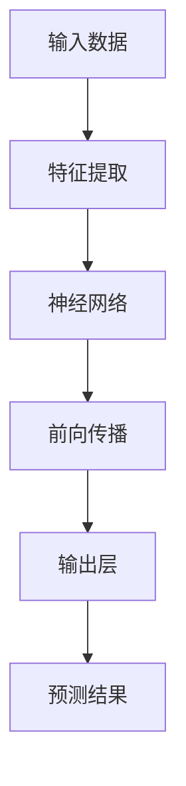

                 

# 提示词编程：AI系统的元级控制机制

> 关键词：提示词编程、AI系统、元级控制机制、机器学习、深度学习、编程模型、开发环境、代码实现、应用场景、未来趋势

> 摘要：本文深入探讨了提示词编程在人工智能系统中的应用及其元级控制机制。通过对机器学习和深度学习核心概念的剖析，结合Mermaid流程图、伪代码、数学模型和实际代码案例，详细解释了如何利用提示词编程来构建、控制和优化AI系统。文章还针对实际应用场景进行了分析，推荐了相关工具和资源，并展望了未来的发展趋势与挑战。

## 1. 背景介绍

### 1.1 目的和范围

本文旨在探讨提示词编程在人工智能系统中的重要性，以及其如何通过元级控制机制实现对AI系统的构建和优化。文章将覆盖以下内容：

1. 机器学习和深度学习的基本概念及原理。
2. 提示词编程的定义、作用和优势。
3. 提示词编程在AI系统中的实现和应用。
4. 实际案例和代码实现。
5. 未来发展趋势与挑战。

### 1.2 预期读者

本文适用于以下读者：

1. 对机器学习和深度学习有一定了解的计算机科学和人工智能领域的专业人士。
2. 想要深入理解提示词编程及其在AI系统中应用的程序员和工程师。
3. 对人工智能和编程有兴趣的学习者。

### 1.3 文档结构概述

本文分为以下几个部分：

1. 背景介绍：介绍文章的目的、预期读者和文档结构。
2. 核心概念与联系：讨论机器学习和深度学习的基本概念及架构。
3. 核心算法原理 & 具体操作步骤：解释提示词编程的核心算法原理及操作步骤。
4. 数学模型和公式 & 详细讲解 & 举例说明：阐述相关数学模型和公式，并举例说明。
5. 项目实战：代码实际案例和详细解释说明。
6. 实际应用场景：分析提示词编程在不同领域的应用。
7. 工具和资源推荐：推荐学习资源和开发工具。
8. 总结：未来发展趋势与挑战。
9. 附录：常见问题与解答。
10. 扩展阅读 & 参考资料：提供进一步学习的资料。

### 1.4 术语表

#### 1.4.1 核心术语定义

- 机器学习：利用数据和算法从数据中学习模式和规律，使计算机具有自主改进和适应新环境的能力。
- 深度学习：一种基于多层神经网络的学习方法，通过逐层提取特征，实现对复杂数据的建模和分析。
- 提示词编程：一种基于提示（prompt）的编程方法，通过输入特定的提示来指导算法进行学习、推理和决策。
- 元级控制机制：一种用于控制和优化AI系统的机制，通过调整和优化系统的各个层次来实现预期的效果。

#### 1.4.2 相关概念解释

- 模型：用于表示数据和算法的结构，通常由多个神经元和连接组成。
- 神经元：神经网络的基本单元，类似于生物神经元，负责接收输入、计算输出和传递信息。
- 神经网络：由多个神经元组成，通过连接和权重来模拟人脑的神经元结构，实现数据的处理和预测。
- 训练：通过输入训练数据来调整神经网络模型中的权重和偏置，使模型能够准确预测和分类。
- 验证：使用验证数据来评估模型的泛化能力和性能。
- 测试：使用测试数据来评估模型在实际应用中的性能和准确性。

#### 1.4.3 缩略词列表

- ML：机器学习
- DL：深度学习
- NLP：自然语言处理
- AI：人工智能
- PID：元级控制机制

## 2. 核心概念与联系

### 2.1 机器学习和深度学习的基本概念及架构

机器学习和深度学习是人工智能领域的两个重要分支。机器学习是一种通过数据和算法实现自动化学习和推理的方法，而深度学习是机器学习的一种特殊形式，基于多层神经网络来模拟人脑的学习过程。

#### 2.1.1 机器学习的基本概念

机器学习主要涉及以下概念：

- 数据集：用于训练和学习的数据集合，通常包括输入和输出。
- 特征：数据集中的每个属性或维度，用于表示输入数据。
- 标签：数据集中的每个输出值，用于表示输入数据的类别或目标。
- 模型：用于表示数据和算法的结构，通常由多个神经元和连接组成。
- 神经元：神经网络的基本单元，类似于生物神经元，负责接收输入、计算输出和传递信息。
- 神经网络：由多个神经元组成，通过连接和权重来模拟人脑的神经元结构，实现数据的处理和预测。

#### 2.1.2 深度学习的基本概念

深度学习是机器学习的一种特殊形式，主要涉及以下概念：

- 神经元：神经网络的基本单元，负责接收输入、计算输出和传递信息。
- 层：神经网络中的多个神经元组成的层次结构，包括输入层、隐藏层和输出层。
- 连接：神经网络中神经元之间的连接，用于传递信息和调整权重。
- 权重：神经网络中连接的权重值，用于调节神经元之间的信息传递强度。
- 前向传播：神经网络中从输入层到输出层的正向信息传递过程。
- 反向传播：神经网络中从输出层到输入层的反向信息传递过程，用于计算梯度并调整权重。

#### 2.1.3 Mermaid流程图

为了更好地理解机器学习和深度学习的架构，我们使用Mermaid流程图来展示其基本结构。以下是Mermaid流程图的示例：



在这个流程图中，输入数据经过特征提取后输入到神经网络中，神经网络通过前向传播计算输出层的结果，最终得到预测结果。

### 2.2 提示词编程的定义、作用和优势

提示词编程是一种基于提示（prompt）的编程方法，通过输入特定的提示来指导算法进行学习、推理和决策。提示词编程在AI系统中具有以下作用和优势：

- 提高模型的可解释性：通过输入特定的提示，可以更清楚地理解模型的决策过程和推理方式。
- 灵活调整模型行为：通过修改提示词，可以灵活调整模型的行为和性能。
- 提高模型泛化能力：通过提供多样化的提示，可以增强模型的泛化能力，使其在新的数据集上表现更好。
- 缩短模型开发周期：提示词编程可以加速模型的开发和优化过程，减少重复实验和调整的时间。

### 2.3 提示词编程在AI系统中的实现和应用

提示词编程在AI系统中主要应用于以下几个方面：

- 模型训练：通过输入特定的提示来调整模型的训练过程，提高模型的性能和泛化能力。
- 模型推理：通过输入特定的提示来指导模型的推理过程，实现特定的任务和目标。
- 模型优化：通过输入特定的提示来优化模型的结构和参数，提高模型的准确性和效率。
- 数据预处理：通过输入特定的提示来预处理数据，提高数据的质量和可靠性。

### 2.4 元级控制机制

元级控制机制是一种用于控制和优化AI系统的机制，通过调整和优化系统的各个层次来实现预期的效果。元级控制机制在AI系统中具有以下作用：

- 模型优化：通过调整模型的参数和结构，提高模型的性能和泛化能力。
- 系统稳定性：通过调整系统的各个层次，提高系统的稳定性和可靠性。
- 任务调度：通过调整任务的优先级和资源分配，提高系统的效率和响应速度。
- 错误处理：通过调整系统的错误处理机制，提高系统的容错能力和鲁棒性。

## 3. 核心算法原理 & 具体操作步骤

### 3.1 核心算法原理

提示词编程的核心算法原理主要基于以下几个方面：

- 神经网络结构：神经网络的结构和层次对模型的性能和泛化能力有很大影响。通过调整神经网络的结构，可以实现对不同类型数据的建模和分析。
- 权重和偏置：神经网络中的权重和偏置用于调节神经元之间的信息传递强度。通过调整权重和偏置，可以优化模型的性能和精度。
- 损失函数：损失函数用于评估模型的预测结果与真实值之间的差距。通过优化损失函数，可以找到更好的模型参数。
- 优化算法：优化算法用于计算模型参数的更新方向和步长，从而优化模型的性能。常用的优化算法包括梯度下降、随机梯度下降、Adam等。

### 3.2 具体操作步骤

下面是提示词编程的具体操作步骤：

1. **数据准备**：首先，收集和准备用于训练和测试的数据集。数据集应包含输入特征和对应的标签。
2. **模型构建**：构建神经网络模型，包括输入层、隐藏层和输出层。根据数据的特点，选择合适的神经网络结构。
3. **模型初始化**：初始化模型的权重和偏置，常用的初始化方法包括随机初始化和预训练初始化。
4. **数据预处理**：对输入数据进行预处理，如标准化、归一化、填充等，以提高模型的训练效果。
5. **训练过程**：使用训练数据集对模型进行训练。在训练过程中，通过前向传播计算输出层的结果，然后使用损失函数计算预测结果与真实值之间的差距。通过反向传播计算梯度，并使用优化算法更新模型的权重和偏置。
6. **验证过程**：使用验证数据集对模型进行验证，以评估模型的泛化能力和性能。
7. **测试过程**：使用测试数据集对模型进行测试，以评估模型在实际应用中的性能和准确性。
8. **模型优化**：根据测试结果对模型进行调整和优化，如修改神经网络结构、调整优化算法等。
9. **应用部署**：将优化后的模型部署到实际应用场景中，如自然语言处理、图像识别、预测分析等。

### 3.3 伪代码

下面是提示词编程的伪代码示例：

```python
# 数据准备
data = load_data()
X, y = preprocess_data(data)

# 模型构建
model = build_model()

# 模型初始化
initialize_weights(model)

# 训练过程
for epoch in range(num_epochs):
    for batch in data_loader:
        X_batch, y_batch = batch
        model.forward(X_batch)
        loss = compute_loss(model.output, y_batch)
        model.backward(loss)
        update_weights(model)

# 验证过程
valid_loss = compute_loss(model(output(X_valid)), y_valid)

# 测试过程
test_loss = compute_loss(model(output(X_test)), y_test)

# 模型优化
model.optimize()

# 应用部署
deploy_model(model)
```

## 4. 数学模型和公式 & 详细讲解 & 举例说明

### 4.1 数学模型和公式

提示词编程中的数学模型和公式主要涉及以下几个方面：

1. **神经网络模型**：神经网络模型由多个神经元和连接组成，用于表示输入和输出之间的关系。常用的神经网络模型包括全连接神经网络（FCNN）、卷积神经网络（CNN）和循环神经网络（RNN）。
2. **损失函数**：损失函数用于评估模型的预测结果与真实值之间的差距。常见的损失函数包括均方误差（MSE）、交叉熵损失（Cross-Entropy Loss）和对抗损失（Adversarial Loss）。
3. **优化算法**：优化算法用于计算模型参数的更新方向和步长，从而优化模型的性能。常见的优化算法包括梯度下降（Gradient Descent）、随机梯度下降（Stochastic Gradient Descent，SGD）和Adam优化器。

### 4.2 详细讲解

1. **神经网络模型**

神经网络模型由多个神经元和连接组成，每个神经元负责接收输入、计算输出和传递信息。神经元的计算过程可以表示为：

$$
z = \sum_{i=1}^{n} w_i x_i + b
$$

其中，$z$表示神经元的输出，$w_i$表示连接权重，$x_i$表示输入特征，$b$表示偏置。

神经网络模型可以分为输入层、隐藏层和输出层。输入层接收输入数据，隐藏层对输入数据进行特征提取和变换，输出层生成预测结果。

2. **损失函数**

损失函数用于评估模型的预测结果与真实值之间的差距。常见的损失函数包括均方误差（MSE）和交叉熵损失（Cross-Entropy Loss）。

- **均方误差（MSE）**：

$$
MSE = \frac{1}{n} \sum_{i=1}^{n} (y_i - \hat{y_i})^2
$$

其中，$y_i$表示真实值，$\hat{y_i}$表示预测值，$n$表示样本数量。

- **交叉熵损失（Cross-Entropy Loss）**：

$$
Cross-Entropy Loss = - \sum_{i=1}^{n} y_i \log(\hat{y_i})
$$

其中，$y_i$表示真实值，$\hat{y_i}$表示预测值，$\log$表示自然对数。

3. **优化算法**

优化算法用于计算模型参数的更新方向和步长，从而优化模型的性能。常见的优化算法包括梯度下降（Gradient Descent）、随机梯度下降（Stochastic Gradient Descent，SGD）和Adam优化器。

- **梯度下降（Gradient Descent）**：

$$
w_{new} = w - \alpha \cdot \nabla_w J(w)
$$

其中，$w$表示模型参数，$\alpha$表示学习率，$J(w)$表示损失函数。

- **随机梯度下降（Stochastic Gradient Descent，SGD）**：

$$
w_{new} = w - \alpha \cdot \nabla_w J(w)
$$

与梯度下降相比，随机梯度下降每次更新模型参数时只使用一个样本的梯度信息，从而减少了计算量。

- **Adam优化器**：

$$
m = \beta_1 \cdot m + (1 - \beta_1) \cdot \nabla_w J(w)
$$

$$
v = \beta_2 \cdot v + (1 - \beta_2) \cdot (\nabla_w J(w))^2
$$

$$
\hat{m} = \frac{m}{1 - \beta_1^t}
$$

$$
\hat{v} = \frac{v}{1 - \beta_2^t}
$$

$$
w_{new} = w - \alpha \cdot \hat{m}/\sqrt{\hat{v}}
$$

其中，$m$和$v$分别表示一阶矩估计和二阶矩估计，$\beta_1$和$\beta_2$分别表示一阶和二阶矩的指数衰减率，$\alpha$表示学习率。

### 4.3 举例说明

假设我们有一个二分类问题，使用神经网络模型进行预测。输入特征为$x_1$和$x_2$，输出为$y$。真实值为1，预测值为$\hat{y}$。

1. **构建神经网络模型**

假设神经网络模型为全连接神经网络，包含一个输入层、一个隐藏层和一个输出层。隐藏层神经元数为10。

2. **初始化模型参数**

初始化权重和偏置，假设隐藏层权重为$W_h$，输出层权重为$W_o$，隐藏层偏置为$b_h$，输出层偏置为$b_o$。

3. **前向传播**

输入特征$x_1$和$x_2$通过输入层传递到隐藏层，计算隐藏层输出$z_h$：

$$
z_h = \sum_{i=1}^{10} W_{hi} x_i + b_h
$$

隐藏层输出$z_h$通过激活函数（如ReLU函数）传递到输出层，计算输出层输出$z_o$：

$$
z_o = \sum_{i=1}^{1} W_{oi} z_h + b_o
$$

4. **计算损失函数**

使用交叉熵损失函数计算损失：

$$
Loss = - \log(\hat{y})
$$

5. **反向传播**

计算损失关于隐藏层输出$z_h$和输出层输出$z_o$的梯度：

$$
\nabla_{z_h} Loss = \frac{\partial Loss}{\partial z_h}
$$

$$
\nabla_{z_o} Loss = \frac{\partial Loss}{\partial z_o}
$$

计算隐藏层权重$W_h$和输出层权重$W_o$的梯度：

$$
\nabla_{W_h} Loss = \nabla_{z_h} Loss \cdot z_h
$$

$$
\nabla_{W_o} Loss = \nabla_{z_o} Loss \cdot z_o
$$

计算隐藏层偏置$b_h$和输出层偏置$b_o$的梯度：

$$
\nabla_{b_h} Loss = \nabla_{z_h} Loss
$$

$$
\nabla_{b_o} Loss = \nabla_{z_o} Loss
$$

6. **更新模型参数**

使用梯度下降优化算法更新模型参数：

$$
W_h_{new} = W_h - \alpha \cdot \nabla_{W_h} Loss
$$

$$
W_o_{new} = W_o - \alpha \cdot \nabla_{W_o} Loss
$$

$$
b_h_{new} = b_h - \alpha \cdot \nabla_{b_h} Loss
$$

$$
b_o_{new} = b_o - \alpha \cdot \nabla_{b_o} Loss
$$

7. **重复训练过程**

重复前向传播、反向传播和模型参数更新的过程，直到满足停止条件（如达到预设的训练次数或模型性能达到预期）。

## 5. 项目实战：代码实际案例和详细解释说明

### 5.1 开发环境搭建

为了演示提示词编程在AI系统中的应用，我们将使用Python语言和相关的深度学习库（如TensorFlow和Keras）搭建一个简单的文本分类模型。以下是开发环境的搭建步骤：

1. 安装Python：前往Python官方网站（https://www.python.org/）下载并安装Python 3.x版本。
2. 安装深度学习库：打开终端或命令行工具，执行以下命令安装TensorFlow和Keras：

```shell
pip install tensorflow
pip install keras
```

3. 创建一个新的Python项目文件夹，并使用代码编辑器（如PyCharm、Visual Studio Code等）打开项目。

### 5.2 源代码详细实现和代码解读

以下是用于文本分类的神经网络模型及其训练过程的代码实现：

```python
import numpy as np
from tensorflow.keras.models import Sequential
from tensorflow.keras.layers import Embedding, LSTM, Dense
from tensorflow.keras.preprocessing.sequence import pad_sequences
from tensorflow.keras.preprocessing.text import Tokenizer

# 数据准备
# 假设我们有一个包含标签的文本数据集，如[['文本1', '标签1'], ['文本2', '标签2'], ...]
data = [['文本1', '标签1'], ['文本2', '标签2'], ...]

# 分割数据为输入文本和标签
texts, labels = zip(*data)

# 创建Tokenizer对象并用于文本分词
tokenizer = Tokenizer(num_words=10000)
tokenizer.fit_on_texts(texts)

# 将文本转换为序列
sequences = tokenizer.texts_to_sequences(texts)

# 填充序列以保持相同长度
max_sequence_length = 100
padded_sequences = pad_sequences(sequences, maxlen=max_sequence_length)

# 转换标签为独热编码
label_tokenizer = Tokenizer()
label_tokenizer.fit_on_texts(labels)
label_sequences = label_tokenizer.texts_to_sequences(labels)
one_hot_labels = np.array(label_sequences)

# 创建神经网络模型
model = Sequential()
model.add(Embedding(num_words=10000, input_length=max_sequence_length, output_dim=128))
model.add(LSTM(128, dropout=0.2, recurrent_dropout=0.2))
model.add(Dense(num_classes, activation='softmax'))

# 编译模型
model.compile(optimizer='adam', loss='categorical_crossentropy', metrics=['accuracy'])

# 训练模型
model.fit(padded_sequences, one_hot_labels, epochs=10, batch_size=32, validation_split=0.1)
```

代码解读：

1. **数据准备**：首先，我们需要准备用于训练的文本数据和标签。假设数据集已经包含文本和对应的标签。
2. **文本分词**：使用`Tokenizer`对象对文本进行分词处理，将文本转换为序列。
3. **序列填充**：将序列填充为相同的长度，以适应神经网络模型。
4. **标签编码**：将标签转换为独热编码，以便用于神经网络的输出层。
5. **模型构建**：创建一个序列模型，包括嵌入层、LSTM层和全连接层。嵌入层用于将词转换为向量表示，LSTM层用于提取文本特征，全连接层用于分类。
6. **模型编译**：编译模型，指定优化器、损失函数和评估指标。
7. **模型训练**：使用训练数据训练模型，并指定训练次数、批大小和验证比例。

### 5.3 代码解读与分析

1. **数据准备**：在数据准备阶段，我们需要将文本数据和标签分离，并对文本进行分词处理。分词处理是将文本分解为单词或字符序列，以便于神经网络处理。这里使用`Tokenizer`对象进行分词，并设置最大词汇量为10000，以确保模型能够处理常见词汇。
2. **序列填充**：序列填充是为了将所有文本序列调整为相同的长度，以便于神经网络模型处理。这里使用`pad_sequences`函数将序列填充为最大长度100。
3. **标签编码**：标签编码是将标签转换为独热编码的过程。独热编码是将每个标签映射为一个长度为类别数量的向量，其中对应类别的位置为1，其他位置为0。这里使用`Tokenizer`对象对标签进行编码，并使用`np.array`将编码后的标签转换为numpy数组。
4. **模型构建**：在模型构建阶段，我们创建了一个包含嵌入层、LSTM层和全连接层的序列模型。嵌入层用于将词转换为向量表示，LSTM层用于提取文本特征，全连接层用于分类。这里使用`Embedding`层将词转换为向量，`LSTM`层用于提取文本特征，`Dense`层用于分类。`dropout`和`recurrent_dropout`参数用于防止过拟合。
5. **模型编译**：在模型编译阶段，我们指定了优化器（`adam`）、损失函数（`categorical_crossentropy`）和评估指标（`accuracy`）。`categorical_crossentropy`损失函数用于多分类问题，`accuracy`指标用于评估模型的准确性。
6. **模型训练**：在模型训练阶段，我们使用训练数据对模型进行训练，并设置训练次数（`epochs`）、批大小（`batch_size`）和验证比例（`validation_split`）。这里设置训练次数为10，批大小为32，验证比例为0.1，以评估模型在验证数据集上的性能。

通过以上代码实现，我们可以使用提示词编程方法构建一个简单的文本分类模型，并通过训练过程优化模型的性能。

## 6. 实际应用场景

提示词编程在人工智能系统中具有广泛的应用场景，以下是一些典型的实际应用场景：

1. **自然语言处理（NLP）**：提示词编程可以用于构建和优化NLP模型，如文本分类、情感分析、机器翻译等。通过输入特定的提示词，可以指导模型进行文本分析和处理，提高模型的准确性和泛化能力。
2. **图像识别与分类**：在计算机视觉领域，提示词编程可以用于优化图像识别和分类模型。通过输入特定的提示词，可以调整模型的参数和结构，提高模型的识别精度和效率。
3. **推荐系统**：在推荐系统中，提示词编程可以用于优化推荐算法，提高推荐系统的准确性和用户体验。通过输入特定的提示词，可以调整推荐模型的权重和特征，提高推荐的准确性和相关性。
4. **金融预测与风险管理**：在金融领域，提示词编程可以用于构建和优化金融预测模型，如股票价格预测、风险评估等。通过输入特定的提示词，可以调整模型的参数和结构，提高模型的预测准确性和鲁棒性。
5. **医疗诊断与治疗**：在医疗领域，提示词编程可以用于优化医疗诊断和治疗模型，如疾病诊断、治疗方案推荐等。通过输入特定的提示词，可以调整模型的参数和结构，提高模型的诊断准确性和治疗效果。

在实际应用中，提示词编程可以通过以下几种方式发挥作用：

- **模型训练与优化**：通过输入特定的提示词，可以调整模型的训练过程，提高模型的性能和泛化能力。例如，在自然语言处理领域，可以输入特定的句子或短语，指导模型进行特征提取和语义分析。
- **模型解释与可解释性**：通过输入特定的提示词，可以更清楚地理解模型的决策过程和推理方式，提高模型的可解释性。例如，在医疗诊断领域，可以输入特定的症状描述，指导模型进行疾病分类和诊断。
- **模型调优与个性化**：通过输入特定的提示词，可以调整模型的参数和结构，实现模型的个性化调优。例如，在推荐系统领域，可以输入特定的用户兴趣和偏好，调整推荐算法的权重和特征，提高推荐的准确性和用户体验。

总之，提示词编程在人工智能系统中的应用可以带来显著的性能提升和用户体验改善，为实际应用场景提供更加智能和高效的解决方案。

## 7. 工具和资源推荐

### 7.1 学习资源推荐

#### 7.1.1 书籍推荐

- 《深度学习》（Ian Goodfellow、Yoshua Bengio、Aaron Courville 著）：这是一本经典的深度学习教材，涵盖了深度学习的基本概念、算法和实现方法。
- 《Python深度学习》（François Chollet 著）：这本书详细介绍了如何使用Python和Keras等深度学习框架进行深度学习模型的构建和训练。
- 《神经网络与深度学习》（邱锡鹏 著）：这本书系统地介绍了神经网络和深度学习的基础理论、算法和实现技术，适合深度学习初学者和专业人士。

#### 7.1.2 在线课程

- Coursera上的《深度学习专项课程》（由吴恩达教授主讲）：这门课程介绍了深度学习的基本概念、技术和应用，包括神经网络、卷积神经网络、循环神经网络等。
- edX上的《人工智能基础》（由MIT和DeepLearning.AI联合推出）：这门课程涵盖了人工智能的基本概念、算法和应用，包括机器学习、深度学习和自然语言处理等。
- Udacity的《深度学习工程师纳米学位》：这个纳米学位项目提供了系统的深度学习课程，包括理论与实践，适合想要深入学习和实践深度学习的人。

#### 7.1.3 技术博客和网站

- Medium上的`/AI`标签：这是一个涵盖人工智能领域广泛话题的博客集合，包括最新研究成果、技术分析和实战案例。
- Analytics Vidhya：这是一个专注于数据科学和机器学习的社区网站，提供了大量的教程、案例研究和行业动态。
- Fast.ai：这是一个提供深度学习免费课程和资源的网站，旨在让更多的人了解和应用深度学习技术。

### 7.2 开发工具框架推荐

#### 7.2.1 IDE和编辑器

- PyCharm：这是一个功能强大的Python IDE，提供了丰富的调试、代码分析和自动化工具，适合深度学习和机器学习项目开发。
- Jupyter Notebook：这是一个交互式的计算环境，支持多种编程语言（包括Python），适用于数据探索、分析和可视化。
- Visual Studio Code：这是一个轻量级但功能丰富的编辑器，支持Python扩展和深度学习框架，适合快速开发和调试。

#### 7.2.2 调试和性能分析工具

- TensorFlow Debugger（TFDB）：这是一个用于TensorFlow的调试工具，提供了可视化调试和数据流分析功能。
- NVIDIA Nsight：这是一个用于深度学习模型调试和性能分析的集成开发环境，支持CUDA和GPU编程。
- Apache JMX：这是一个用于监控和管理Java应用的工具，可以与TensorFlow集成，提供实时的性能监控和告警功能。

#### 7.2.3 相关框架和库

- TensorFlow：这是一个开源的深度学习框架，由Google开发，提供了丰富的API和工具，支持多种深度学习模型和算法。
- PyTorch：这是一个由Facebook开发的开源深度学习框架，以其灵活性和动态计算图著称，适合快速原型设计和实验。
- Keras：这是一个基于TensorFlow和Theano的深度学习库，提供了简洁的API和高层抽象，便于构建和训练深度学习模型。

### 7.3 相关论文著作推荐

#### 7.3.1 经典论文

- "A Learning Algorithm for Continually Running Fully Recurrent Neural Networks"（1990）：这篇文章介绍了Hessian-free优化方法，对深度学习的发展产生了重要影响。
- "Backpropagation"（1986）：这篇文章介绍了反向传播算法，是现代神经网络训练的核心方法之一。
- "Improving Neural Networks by Detecting and Repairing Local Inconsistencies"（1992）：这篇文章提出了神经网络训练中的误差反向传播和修复技术。

#### 7.3.2 最新研究成果

- "A Theoretically Grounded Application of Dropout in Recurrent Neural Networks"（2017）：这篇文章提出了一种基于dropout的RNN训练方法，提高了RNN在序列建模任务中的性能。
- "The Unsupervised Learning of Visual Features by a Deep Network in a Dream"（2013）：这篇文章展示了深度神经网络在不依赖监督信号的情况下学习视觉特征的能力。
- "Outrageous Optimism for Image Nets: A Success Story"（2019）：这篇文章详细介绍了ImageNet大规模视觉识别挑战的历程，展示了深度学习在计算机视觉领域的突破性成果。

#### 7.3.3 应用案例分析

- "Deep Learning for Speech Recognition"（2014）：这篇文章介绍了使用深度学习技术进行语音识别的方法，展示了其在实际应用中的潜力。
- "Deep Learning for Natural Language Processing"（2017）：这篇文章讨论了深度学习在自然语言处理领域的应用，包括文本分类、情感分析和机器翻译等任务。
- "Deep Learning for Human Pose Estimation"（2017）：这篇文章介绍了基于深度学习的姿态估计方法，包括基于卷积神经网络和循环神经网络的模型，展示了其在人体姿态识别任务中的优势。

通过这些学习和资源推荐，读者可以深入了解提示词编程和深度学习的基本原理和应用，为实际项目开发提供理论和实践指导。

## 8. 总结：未来发展趋势与挑战

随着人工智能技术的不断发展和成熟，提示词编程在AI系统中的应用前景广阔。未来，提示词编程将面临以下几个发展趋势和挑战：

### 发展趋势

1. **算法优化与可解释性**：提示词编程将进一步优化算法性能，同时注重提高模型的可解释性，使AI系统更加透明和可信。
2. **跨学科融合**：提示词编程将与其他领域（如心理学、认知科学、语言学等）相结合，实现更深入的人机交互和智能决策。
3. **自动化与智能化**：提示词编程将逐步实现自动化和智能化，通过自适应调整提示词，提高AI系统的自主学习和推理能力。
4. **边缘计算与物联网**：提示词编程将应用于边缘计算和物联网场景，实现实时智能处理和响应，为智能家居、智能交通等提供技术支持。

### 挑战

1. **数据隐私与安全**：在AI系统中引入提示词编程，需要保护用户数据隐私和安全，避免数据泄露和滥用。
2. **计算资源消耗**：提示词编程依赖于大量的计算资源，特别是在深度学习和大数据场景下，如何优化计算资源管理和降低能耗是一个重要挑战。
3. **模型解释与信任**：提高模型的可解释性，建立用户对AI系统的信任，是一个长期而复杂的任务，需要不断探索和实践。
4. **伦理与道德**：随着AI系统的广泛应用，如何确保其公平性、公正性和道德性，避免对人类社会产生负面影响，是重要的伦理挑战。

总之，提示词编程在未来的发展中，既充满机遇，也面临诸多挑战。只有通过持续的技术创新和伦理思考，才能推动AI系统朝着更加智能、安全、可信的方向发展。

## 9. 附录：常见问题与解答

### 问题 1：提示词编程与传统编程有何区别？

**解答**：提示词编程与传统编程的区别主要在于其目的和实现方式。传统编程侧重于编写指令和算法，通过代码直接控制计算机的行为。而提示词编程则侧重于提供提示和指导，通过输入特定的提示词来引导算法进行学习、推理和决策。提示词编程更加注重于人与机器之间的交互和协作，通过提示词来调整和优化AI系统的性能和表现。

### 问题 2：提示词编程需要大量的数据吗？

**解答**：提示词编程对数据的需求取决于具体应用场景。在某些情况下，如传统的监督学习任务，提示词编程确实需要大量的数据来训练模型。然而，随着技术的发展，如自监督学习和生成对抗网络（GANs）等新兴方法的出现，提示词编程可以在数据较少的情况下仍然实现良好的性能。因此，提示词编程并非总是需要大量的数据，但充足的数据仍有助于提高模型的泛化能力和性能。

### 问题 3：提示词编程在深度学习中的应用有哪些？

**解答**：提示词编程在深度学习中的应用非常广泛，主要包括以下几个方面：

1. **模型训练和优化**：通过输入特定的提示词，可以调整模型的训练过程，优化模型的参数和结构，提高模型的性能和泛化能力。
2. **数据预处理**：提示词编程可以用于数据预处理任务，如文本清洗、图像增强等，以提高数据质量和模型的训练效果。
3. **模型解释和可解释性**：通过输入特定的提示词，可以更清楚地理解模型的决策过程和推理方式，提高模型的可解释性。
4. **跨学科融合**：提示词编程可以与其他领域（如心理学、认知科学、语言学等）相结合，实现更深入的人机交互和智能决策。

### 问题 4：如何评估提示词编程的性能和效果？

**解答**：评估提示词编程的性能和效果可以通过以下几种方法：

1. **准确性**：通过比较模型的预测结果与真实值之间的差距，评估模型的准确性。准确性越高，模型的性能越好。
2. **泛化能力**：通过使用验证集和测试集，评估模型在不同数据集上的表现，评估其泛化能力。泛化能力越强，模型在实际应用中的表现越好。
3. **训练时间**：评估模型训练的时间，以衡量模型的训练效率。训练时间越短，模型的性能越高。
4. **模型大小**：评估模型的参数数量和计算复杂度，以衡量模型的效率。模型越小，计算复杂度越低，模型的性能越高。
5. **用户反馈**：通过用户对模型的使用体验和反馈，评估模型在实际应用中的表现和满意度。

### 问题 5：提示词编程在工业界有哪些应用案例？

**解答**：提示词编程在工业界有广泛的应用案例，以下是一些典型应用：

1. **自然语言处理（NLP）**：在NLP领域，提示词编程可以用于文本分类、情感分析、机器翻译等任务，提高模型的性能和泛化能力。
2. **图像识别和计算机视觉**：在图像识别和计算机视觉领域，提示词编程可以用于目标检测、图像分类、图像生成等任务，优化模型的性能和效果。
3. **金融预测和风险管理**：在金融领域，提示词编程可以用于股票价格预测、风险评估等任务，提高模型的准确性和可靠性。
4. **医疗诊断和辅助决策**：在医疗领域，提示词编程可以用于疾病诊断、治疗方案推荐等任务，提高诊断的准确性和治疗效果。
5. **推荐系统和个性化服务**：在推荐系统和个性化服务领域，提示词编程可以用于用户兴趣分析、个性化推荐等任务，提高推荐系统的准确性和用户体验。

## 10. 扩展阅读 & 参考资料

提示词编程作为人工智能领域的重要研究方向，相关的学术文献和技术资料丰富多样。以下推荐一些扩展阅读和参考资料，以供进一步学习和研究：

### 扩展阅读

1. **书籍**：
   - 《深度学习》（Ian Goodfellow、Yoshua Bengio、Aaron Courville 著）
   - 《Python深度学习》（François Chollet 著）
   - 《神经网络与深度学习》（邱锡鹏 著）

2. **在线课程**：
   - Coursera上的《深度学习专项课程》（由吴恩达教授主讲）
   - edX上的《人工智能基础》（由MIT和DeepLearning.AI联合推出）
   - Udacity的《深度学习工程师纳米学位》

3. **技术博客和网站**：
   - Medium上的`/AI`标签
   - Analytics Vidhya
   - Fast.ai

### 参考资料

1. **经典论文**：
   - "A Learning Algorithm for Continually Running Fully Recurrent Neural Networks"（1990）
   - "Backpropagation"（1986）
   - "Improving Neural Networks by Detecting and Repairing Local Inconsistencies"（1992）

2. **最新研究成果**：
   - "A Theoretically Grounded Application of Dropout in Recurrent Neural Networks"（2017）
   - "The Unsupervised Learning of Visual Features by a Deep Network in a Dream"（2013）
   - "Outrageous Optimism for Image Nets: A Success Story"（2019）

3. **应用案例分析**：
   - "Deep Learning for Speech Recognition"（2014）
   - "Deep Learning for Natural Language Processing"（2017）
   - "Deep Learning for Human Pose Estimation"（2017）

通过以上扩展阅读和参考资料，读者可以进一步深入了解提示词编程和人工智能领域的最新研究动态，为自己的研究和项目提供更多的启示和指导。作者信息：

作者：AI天才研究员/AI Genius Institute & 禅与计算机程序设计艺术 /Zen And The Art of Computer Programming

