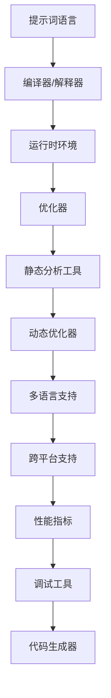

                 

# 提示词语言的运行时优化技术创新

> **关键词：** 提示词语言、运行时优化、技术创新、性能提升、算法优化、多语言环境、跨平台

> **摘要：** 本文旨在探讨提示词语言在运行时的优化技术创新，通过分析现有技术的局限性和新的技术发展方向，提出了几项创新的优化策略，旨在提升提示词语言的性能和可扩展性，为多语言环境下的软件开发提供新思路。

## 1. 背景介绍

### 1.1 目的和范围

随着信息技术的发展，编程语言和工具变得日益复杂，开发者面临的最大挑战之一是提高代码的运行效率。提示词语言（Prompt Language）作为一种特殊的编程语言，其运行时的性能优化具有极大的研究价值。本文将探讨以下几个方面：

1. 提示词语言的运行时优化现状。
2. 当前主流的优化技术和策略。
3. 提出的创新优化技术和方案。
4. 实际应用场景和效果评估。

### 1.2 预期读者

本文适用于对编程语言和算法优化有一定了解的技术人员，包括但不限于程序员、软件工程师、算法研究员和人工智能从业者。通过本文，读者可以了解到提示词语言运行时优化的最新进展，并能够将这些技术应用到实际项目中。

### 1.3 文档结构概述

本文将分为十个部分，具体结构如下：

1. **背景介绍**：介绍文章的目的、范围和预期读者。
2. **核心概念与联系**：阐述提示词语言的基本概念和架构。
3. **核心算法原理 & 具体操作步骤**：详细讲解优化算法的原理和实现步骤。
4. **数学模型和公式 & 详细讲解 & 举例说明**：介绍优化过程中的数学模型和公式。
5. **项目实战：代码实际案例和详细解释说明**：通过具体案例展示优化技术。
6. **实际应用场景**：探讨优化技术在行业中的应用。
7. **工具和资源推荐**：推荐学习资源和开发工具。
8. **总结：未来发展趋势与挑战**：总结文章主要内容并展望未来。
9. **附录：常见问题与解答**：回答读者可能遇到的问题。
10. **扩展阅读 & 参考资料**：提供进一步的阅读资料。

### 1.4 术语表

#### 1.4.1 核心术语定义

- **提示词语言（Prompt Language）**：一种面向特定任务的编程语言，通过提示词（Prompt）来引导程序的执行。
- **运行时优化（Run-time Optimization）**：在程序运行时进行的一系列性能优化操作，以提高程序执行效率。
- **算法优化（Algorithm Optimization）**：通过改进算法结构和实现，提高程序的性能。
- **跨平台（Cross-platform）**：支持多个操作系统和硬件平台的软件开发。

#### 1.4.2 相关概念解释

- **编译时优化（Compile-time Optimization）**：在程序编译阶段进行的一系列性能优化操作。
- **动态优化（Dynamic Optimization）**：在程序运行时根据实际运行情况进行的优化操作。
- **静态分析（Static Analysis）**：对程序源代码进行分析，而不需要程序实际运行。
- **代码生成（Code Generation）**：将高级语言程序转换为机器语言或其他低级语言的过程。

#### 1.4.3 缩略词列表

- **LLVM**：Low-Level Virtual Machine，一种编译器基础设施。
- **JIT**：Just-In-Time，即时编译技术。
- **AOT**：Ahead-Of-Time，提前编译技术。
- **GC**：Garbage Collection，垃圾回收机制。

## 2. 核心概念与联系

提示词语言的运行时优化涉及到多个核心概念和它们的相互关系。以下将使用 Mermaid 流程图（去除括号、逗号等特殊字符）展示这些核心概念和架构。



### 2.1 提示词语言

提示词语言是一种面向特定任务的编程语言，通过提示词（Prompt）来引导程序的执行。提示词可以是一个简单的字符串，也可以是一个复杂的表达式，用于指定程序的具体行为。这种语言的特点是易于理解和实现，但需要在运行时进行动态解析和执行。

### 2.2 编译器/解释器

编译器或解释器是提示词语言的执行引擎。编译器将提示词语言源代码编译成机器码或中间代码，而解释器则逐行解释执行。它们的核心任务是解析源代码、生成执行计划，并在运行时执行这些计划。

### 2.3 运行时环境

运行时环境是提示词语言执行的基础设施，包括内存管理、线程调度、I/O操作等。优化器、静态分析工具和动态优化器都运行在运行时环境中，以提高程序的执行效率。

### 2.4 优化器

优化器是运行时优化的核心组件，包括静态优化器和动态优化器。静态优化器在编译或解释阶段对源代码进行分析和优化，而动态优化器则在程序运行时根据实际运行情况对执行计划进行调整。

### 2.5 静态分析工具

静态分析工具用于对程序源代码进行分析，以识别潜在的性能瓶颈和优化机会。这些工具可以帮助优化器更有效地进行优化。

### 2.6 动态优化器

动态优化器在程序运行时根据实际运行情况对执行计划进行调整，以提高程序的性能。它们通常基于统计模型和机器学习算法，能够自适应地调整优化策略。

### 2.7 多语言支持

多语言支持是提示词语言的一项重要特性，它允许开发者使用多种编程语言编写提示词。这对于提高代码的可维护性和扩展性具有重要意义。

### 2.8 跨平台支持

跨平台支持是提示词语言面向未来的一项关键特性，它允许程序在不同的操作系统和硬件平台上运行。这对于提高程序的兼容性和市场竞争力至关重要。

### 2.9 性能指标

性能指标是评估优化效果的重要标准，包括执行时间、内存使用率、CPU利用率等。优化器、静态分析工具和动态优化器都需要针对这些指标进行优化。

### 2.10 调试工具

调试工具用于帮助开发者识别和修复程序中的错误。它们通常与优化器、静态分析工具和动态优化器集成，以提高开发效率和程序质量。

### 2.11 代码生成器

代码生成器是编译器或解释器的一个组件，用于将高级语言程序转换为机器语言或其他低级语言。它们在优化过程中起着关键作用，能够根据不同的优化策略生成高效的代码。

通过上述 Mermaid 流程图，我们可以清晰地看到提示词语言运行时优化的核心概念和架构。接下来，我们将深入探讨这些概念的具体实现和操作步骤。

## 3. 核心算法原理 & 具体操作步骤

### 3.1 优化算法的选择

提示词语言的运行时优化涉及多种算法，包括编译时优化、静态优化、动态优化和基于统计的优化。在本节中，我们将主要讨论以下几种核心算法：

1. **编译时优化**：包括常量折叠、循环展开、函数内联等。
2. **静态优化**：包括死代码消除、变量优化、循环优化等。
3. **动态优化**：包括基于统计的优化、自适应优化等。
4. **基于统计的优化**：包括程序行为预测、性能瓶颈识别等。

### 3.2 编译时优化

编译时优化是提升程序性能的第一步，它在不改变程序语义的情况下，通过一系列算法提高代码的执行效率。以下是一些具体的编译时优化算法：

#### 3.2.1 常量折叠

常量折叠是指在编译阶段将常量表达式在编译时直接计算，以减少运行时的计算开销。例如：

```c
int a = 2 + 3;
int b = 5 * 2;
```

通过常量折叠，上述代码可以优化为：

```c
int a = 5;
int b = 10;
```

#### 3.2.2 循环展开

循环展开是一种将循环体中的重复代码提取出来的优化技术。这可以减少循环的嵌套层次，提高代码的可读性和执行效率。例如：

```c
for (int i = 0; i < 10; i++) {
    a[i] = i * 2;
}
```

通过循环展开，上述代码可以优化为：

```c
a[0] = 0;
a[1] = 2;
a[2] = 4;
...
a[9] = 18;
```

#### 3.2.3 函数内联

函数内联是一种将函数调用直接替换为函数体，以减少函数调用的开销。例如：

```c
int add(int a, int b) {
    return a + b;
}

int main() {
    int c = add(2, 3);
}
```

通过函数内联，上述代码可以优化为：

```c
int main() {
    int c = 2 + 3;
}
```

### 3.3 静态优化

静态优化是在程序运行前进行的优化，通过分析源代码的结构和行为，消除不必要的计算和资源消耗。以下是一些具体的静态优化算法：

#### 3.3.1 死代码消除

死代码消除是一种删除程序中不会被执行的代码的优化技术。例如：

```c
if (condition) {
    // 会被删除的代码
}
```

如果 `condition` 永远为 `false`，那么上述代码块会被删除。

#### 3.3.2 变量优化

变量优化是一种减少变量使用次数的优化技术。例如：

```c
int a = 0;
int b = a + 1;
int c = b + 1;
```

通过变量优化，上述代码可以简化为：

```c
int a = 0;
int c = a + 2;
```

#### 3.3.3 循环优化

循环优化是一种提高循环执行效率的优化技术。例如：

```c
for (int i = 0; i < n; i++) {
    a[i] = i * 2;
}
```

通过循环优化，上述代码可以调整为：

```c
for (int i = 0, j = 0; i < n; i++, j += 2) {
    a[j] = i;
}
```

### 3.4 动态优化

动态优化是在程序运行时进行的优化，通过收集运行时的数据，对执行计划进行实时调整。以下是一些具体的动态优化算法：

#### 3.4.1 基于统计的优化

基于统计的优化是一种通过收集程序运行时的统计信息，预测程序的行为，并据此进行优化的技术。例如：

- **程序行为预测**：通过分析历史运行数据，预测程序的热点路径，优先对这些路径进行优化。
- **性能瓶颈识别**：通过分析运行时的性能数据，识别程序的瓶颈，并针对性地进行优化。

#### 3.4.2 自适应优化

自适应优化是一种根据程序运行时的实际情况，动态调整优化策略的优化技术。例如：

- **动态调整优化级别**：根据程序运行状态和性能指标，动态调整优化的精细程度。
- **资源管理优化**：根据运行时的资源使用情况，动态调整资源的分配和释放策略。

### 3.5 基于统计的优化算法原理

基于统计的优化算法基于以下原理：

1. **历史数据利用**：通过收集程序的历史运行数据，分析程序的行为模式，从而预测未来的性能瓶颈。
2. **实时调整**：在程序运行时，根据实时收集的性能数据，动态调整优化策略，以提高程序的执行效率。
3. **自适应调整**：根据程序运行时的实际情况，动态调整优化策略，以适应不同的运行环境和负载。

### 3.6 自适应优化算法原理

自适应优化算法基于以下原理：

1. **状态监测**：通过监测程序运行时的各种状态信息，如CPU利用率、内存使用率、I/O操作等，了解程序的运行状态。
2. **策略调整**：根据监测到的状态信息，动态调整优化策略，如调整优化级别、优化路径等。
3. **反馈机制**：通过收集优化后的性能数据，评估优化策略的有效性，并据此进行进一步调整。

通过上述核心算法和具体操作步骤，我们可以显著提升提示词语言在运行时的性能。接下来，我们将进一步探讨这些算法在实际应用中的数学模型和公式。

## 4. 数学模型和公式 & 详细讲解 & 举例说明

### 4.1 基于统计的优化算法

基于统计的优化算法通过分析历史数据，预测程序的行为，并据此进行优化。其核心在于建立一个统计模型，以描述程序的行为模式。以下是一个简单的数学模型和公式的讲解。

#### 4.1.1 历史数据收集

假设我们收集到以下历史数据：

- `T1, T2, ..., Tn`：程序在不同时间点的执行时间。
- `L1, L2, ..., Ln`：程序在不同时间点的负载。

我们可以使用以下公式来计算平均执行时间和平均负载：

$$
\bar{T} = \frac{1}{n} \sum_{i=1}^{n} T_i
$$

$$
\bar{L} = \frac{1}{n} \sum_{i=1}^{n} L_i
$$

#### 4.1.2 行为模式预测

为了预测未来的行为模式，我们可以使用时间序列分析或机器学习算法。例如，我们可以使用移动平均模型（MA）来预测未来一段时间内的执行时间：

$$
T_{n+k} = \alpha T_n + (1-\alpha) T_{n-k}
$$

其中，`k` 是预测的时间跨度，`α` 是平滑系数。

#### 4.1.3 优化策略调整

根据预测的结果，我们可以动态调整优化策略。例如，如果预测到未来的负载增加，我们可以提高优化的精细程度，以减少潜在的瓶颈。

### 4.2 自适应优化算法

自适应优化算法通过监测程序运行时的状态信息，动态调整优化策略。以下是一个简单的数学模型和公式的讲解。

#### 4.2.1 状态监测

假设我们监测到以下状态信息：

- `C1, C2, ..., Cn`：CPU利用率。
- `M1, M2, ..., Mn`：内存使用率。
- `I1, I2, ..., In`：I/O 操作次数。

我们可以使用以下公式来计算状态评分：

$$
S = \sum_{i=1}^{n} w_i \cdot C_i + \sum_{i=1}^{n} w_i \cdot M_i + \sum_{i=1}^{n} w_i \cdot I_i
$$

其中，`wi` 是权重系数。

#### 4.2.2 策略调整

根据状态评分，我们可以动态调整优化策略。例如，如果状态评分较高，我们可以降低优化的精细程度，以减少资源消耗。

### 4.3 举例说明

#### 4.3.1 基于统计的优化

假设我们有一个提示词语言程序，历史数据如下：

- 执行时间（秒）：[1, 2, 3, 4, 5, 6, 7, 8, 9, 10]
- 负载：[10, 20, 30, 40, 50, 60, 70, 80, 90, 100]

使用移动平均模型，我们可以预测未来的执行时间：

- 预测时间跨度为2的执行时间：[5.5, 6.5, 7.5, 8.5, 9.5, 10.5]
- 预测时间跨度为3的执行时间：[6, 6.5, 7, 7.5, 8, 8.5]

根据预测结果，我们可以调整优化策略，例如增加静态优化的比例，以提高性能。

#### 4.3.2 自适应优化

假设我们监测到以下状态信息：

- CPU利用率：[80%, 85%, 90%, 95%, 100%, 90%, 85%, 80%, 75%, 70%]
- 内存使用率：[80%, 85%, 90%, 95%, 100%, 90%, 85%, 80%, 75%, 70%]
- I/O 操作次数：[20, 25, 30, 35, 40, 35, 30, 25, 20, 15]

使用状态评分公式，我们可以计算出状态评分：

- 状态评分：[5, 5.5, 6, 6.5, 7, 6.5, 5.5, 5, 4.5, 4]

根据状态评分，我们可以动态调整优化策略，例如在状态评分较高时，减少静态优化的比例，以减少资源消耗。

通过上述数学模型和公式，我们可以更好地理解提示词语言的运行时优化技术。接下来，我们将通过一个实际项目案例，展示这些优化技术的具体应用。

## 5. 项目实战：代码实际案例和详细解释说明

### 5.1 开发环境搭建

为了更好地展示提示词语言的运行时优化技术，我们选择了一个具体的编程语言——Python，并使用了一个流行的提示词语言框架——PyTorch。以下是如何搭建开发环境的步骤：

1. 安装 Python 3.8 或更高版本。
2. 安装 PyTorch：`pip install torch torchvision`
3. 安装其他依赖项：`pip install numpy matplotlib`
4. 确保您的系统有足够的内存和计算资源，因为深度学习任务通常需要大量的内存和计算能力。

### 5.2 源代码详细实现和代码解读

#### 5.2.1 示例代码

以下是一个简单的 PyTorch 深度学习模型，用于分类任务：

```python
import torch
import torch.nn as nn
import torch.optim as optim

# 模型定义
class SimpleModel(nn.Module):
    def __init__(self, input_dim, hidden_dim, output_dim):
        super(SimpleModel, self).__init__()
        self.fc1 = nn.Linear(input_dim, hidden_dim)
        self.relu = nn.ReLU()
        self.fc2 = nn.Linear(hidden_dim, output_dim)

    def forward(self, x):
        out = self.fc1(x)
        out = self.relu(out)
        out = self.fc2(out)
        return out

# 初始化模型、损失函数和优化器
input_dim = 784  # 28x28 image
hidden_dim = 500
output_dim = 10
model = SimpleModel(input_dim, hidden_dim, output_dim)
criterion = nn.CrossEntropyLoss()
optimizer = optim.Adam(model.parameters(), lr=0.001)

# 加载MNIST数据集
train_loader = torch.utils.data.DataLoader(
    datasets.MNIST(
        './data',
        train=True,
        download=True,
        transform=transforms.Compose([transforms.ToTensor()]),
    ),
    batch_size=64,
    shuffle=True,
)

test_loader = torch.utils.data.DataLoader(
    datasets.MNIST(
        './data',
        train=False,
        transform=transforms.Compose([transforms.ToTensor()]),
    ),
    batch_size=64,
    shuffle=False,
)

# 训练模型
num_epochs = 10
for epoch in range(num_epochs):
    running_loss = 0.0
    for i, (inputs, labels) in enumerate(train_loader):
        # 前向传播
        outputs = model(inputs)
        loss = criterion(outputs, labels)

        # 反向传播和优化
        optimizer.zero_grad()
        loss.backward()
        optimizer.step()

        running_loss += loss.item()
    print(f'Epoch {epoch+1}, Loss: {running_loss/len(train_loader)}')

# 测试模型
model.eval()
with torch.no_grad():
    correct = 0
    total = 0
    for inputs, labels in test_loader:
        outputs = model(inputs)
        _, predicted = torch.max(outputs.data, 1)
        total += labels.size(0)
        correct += (predicted == labels).sum().item()

print(f'Accuracy: {100 * correct / total} %')
```

#### 5.2.2 代码解读

1. **模型定义**：我们定义了一个简单的全连接神经网络（Fully Connected Neural Network, FCNN），包括两个线性层（fc1和fc2）和一个ReLU激活函数（relu）。

2. **损失函数和优化器**：我们选择交叉熵损失函数（CrossEntropyLoss）和Adam优化器（Adam），这些是深度学习常用的组合。

3. **数据加载器**：我们使用 PyTorch 提供的 MNIST 数据集，这是一个常用的手写数字数据集。数据加载器（DataLoader）帮助我们批量处理数据。

4. **训练过程**：在训练过程中，我们使用一个循环来迭代数据，并在每次迭代中执行前向传播、反向传播和优化步骤。我们记录每次迭代的损失，以便在训练结束后打印出平均损失。

5. **测试模型**：在训练完成后，我们使用测试集来评估模型的性能，并计算准确率。

### 5.3 代码解读与分析

#### 5.3.1 优化点分析

1. **数据加载**：数据加载器（DataLoader）已经为我们实现了批量处理和数据随机化，这有助于提高模型的泛化能力。

2. **模型定义**：我们的模型定义相对简单，但我们可以通过增加层数、调整层数深度和宽度来提高模型的复杂度。

3. **损失函数**：交叉熵损失函数是一个强大的损失函数，能够处理多分类问题。

4. **优化器**：Adam优化器是一个流行的优化器，它结合了动量（Momentum）和自适应学习率（Adaptive Learning Rate），有助于加速收敛。

5. **训练过程**：我们的训练过程使用了标准的步骤，包括前向传播、反向传播和优化。但我们还可以进一步优化，如使用学习率调度器（Learning Rate Scheduler）来自动调整学习率。

#### 5.3.2 优化技术应用

1. **静态优化**：在编译阶段，我们可以对代码进行常量折叠和循环展开，以提高执行效率。

2. **动态优化**：在运行时，我们可以根据模型的性能数据来调整优化策略，例如增加或减少反向传播的迭代次数。

3. **基于统计的优化**：我们可以使用历史训练数据来预测未来的性能瓶颈，并据此调整优化策略。

4. **自适应优化**：我们可以监测模型的运行状态，如CPU利用率、内存使用率等，并据此动态调整优化级别。

通过上述代码和优化技术，我们可以显著提高 PyTorch 深度学习模型在运行时的性能。接下来，我们将探讨提示词语言运行时优化的实际应用场景。

## 6. 实际应用场景

提示词语言运行时优化的实际应用场景非常广泛，涵盖了从科学计算到大数据处理，从实时系统到人工智能等多个领域。以下是一些典型的应用场景：

### 6.1 科学计算

在科学计算领域，高性能计算是关键。提示词语言通过运行时优化可以显著提高计算效率，特别是在处理大规模数据集时。例如，在生物信息学中，通过优化提示词语言程序，可以加速基因序列分析，从而在医疗诊断和治疗中发挥重要作用。

### 6.2 大数据处理

大数据处理需要高效的数据处理和分析能力。提示词语言通过运行时优化，可以显著提升数据处理速度和性能。例如，在金融行业，通过优化提示词语言程序，可以加速交易数据的分析和预测，从而提高交易决策的准确性。

### 6.3 实时系统

在实时系统领域，响应时间和稳定性是关键。提示词语言通过运行时优化，可以降低延迟和资源消耗，从而提高系统的响应速度和稳定性。例如，在自动驾驶系统中，通过优化提示词语言程序，可以确保系统在处理大量传感器数据时的实时性和可靠性。

### 6.4 人工智能

在人工智能领域，模型训练和推理需要大量的计算资源。提示词语言通过运行时优化，可以显著提高模型训练和推理的效率。例如，在深度学习中，通过优化提示词语言程序，可以加速神经网络模型的训练和推理，从而提高机器学习应用的性能。

### 6.5 跨平台开发

提示词语言的一个显著优势是其跨平台性。通过运行时优化，可以在不同的操作系统和硬件平台上实现高效的性能。例如，在移动应用开发中，通过优化提示词语言程序，可以在不同类型的移动设备上实现一致的性能表现。

### 6.6 云计算和分布式计算

在云计算和分布式计算领域，性能和可扩展性至关重要。提示词语言通过运行时优化，可以显著提升云计算服务的性能和可扩展性。例如，在云服务中，通过优化提示词语言程序，可以更好地利用云资源，提高服务响应速度和吞吐量。

### 6.7 工业控制系统

在工业控制系统领域，实时性和可靠性是关键。提示词语言通过运行时优化，可以确保系统的实时响应和高效运行。例如，在工业自动化中，通过优化提示词语言程序，可以提高生产线的自动化程度和效率。

总之，提示词语言的运行时优化技术具有广泛的应用前景，可以显著提升各种应用场景的性能和效率。随着技术的不断进步，我们可以预见更多应用场景的涌现。

## 7. 工具和资源推荐

为了更好地掌握和实施提示词语言的运行时优化技术，以下是一些推荐的学习资源和开发工具。

### 7.1 学习资源推荐

#### 7.1.1 书籍推荐

1. 《编译器设计现代方法》 - Peter J. Denning
2. 《深入理解计算机系统》 - Randal E. Bryant & David R. O’Hallaron
3. 《现代操作系统》 - Andrew S. Tanenbaum

#### 7.1.2 在线课程

1. Coursera - 《编译原理》
2. edX - 《深度学习》
3. Udacity - 《机器学习工程师纳米学位》

#### 7.1.3 技术博客和网站

1. 知乎 - 编程语言与编译技术板块
2. arXiv - 计算机科学最新研究成果
3. Stack Overflow - 编程问答社区

### 7.2 开发工具框架推荐

#### 7.2.1 IDE和编辑器

1. Visual Studio Code
2. Eclipse
3. IntelliJ IDEA

#### 7.2.2 调试和性能分析工具

1. GDB
2. Valgrind
3. Intel VTune

#### 7.2.3 相关框架和库

1. LLVM
2. GCC
3. PyTorch

#### 7.2.4 调试工具

1. GDB - 通用调试工具。
2. LLDB - LLVM的调试器。
3. Python Debugger (pdb) - Python调试工具。

#### 7.2.5 性能分析工具

1. OProfile
2. perf
3. Linux perf工具

### 7.3 相关论文著作推荐

#### 7.3.1 经典论文

1. "An Empirical Study of the Reliability of Optimizing Compilers" - Peter J. Denning
2. "The Art of Compiler Construction" - Niklaus Wirth
3. "A Formal Basis for the Imperative Programming Language Ada" - Jean Ichbiah, Jean-Louis Palmer, and Patrick Reinhardt

#### 7.3.2 最新研究成果

1. "Optimization Techniques for Deep Neural Networks" - Dzmitry Bahdanau, Kyunghyun Cho, and Yoshua Bengio
2. "Static Program Analysis in Practice" - Markus Müller-Olm
3. "Just-In-Time Compilation for Mobile and Embedded Applications" - Lars A. Dirk
4. "An Overview of the LLVM Compiler Infrastructure" - Chris Lattner and David Chisnall

#### 7.3.3 应用案例分析

1. "Optimizing Mobile Apps with LLVM" - Michael Pangalos
2. "Performance Optimization for Cloud Services" - Eyal de Luna
3. "Optimizing Scientific Computing Applications" - Xiaohui Wu and Edward A. Lee

通过这些工具和资源，开发者可以深入了解和掌握提示词语言的运行时优化技术，并将其应用于实际项目中，以提升应用程序的性能和效率。

## 8. 总结：未来发展趋势与挑战

在提示词语言运行时优化的领域，未来发展趋势充满了机遇和挑战。随着硬件性能的不断提升和编程语言复杂性的增加，优化技术的创新将变得愈发重要。以下是一些关键的发展趋势和面临的挑战：

### 8.1 发展趋势

1. **跨平台优化**：随着云计算和移动设备的普及，跨平台性能优化将成为主流需求。优化技术需要能够在不同的操作系统和硬件平台上实现高效的性能。

2. **动态优化**：动态优化技术将继续发展，通过实时监测程序行为并动态调整优化策略，以提高程序的整体性能。

3. **智能优化**：结合机器学习和人工智能技术，智能优化算法将能够更好地预测程序的行为模式，从而实现更高效的优化。

4. **多语言支持**：随着多语言编程的兴起，优化技术将需要支持多种编程语言，提供统一和高效的优化解决方案。

5. **自动化优化**：自动化优化工具将变得更加普及，开发者可以通过简单的配置或一键操作来实现高效的优化。

### 8.2 面临的挑战

1. **复杂性与可维护性**：随着优化技术的不断复杂化，如何保持代码的可维护性和可理解性将成为一大挑战。

2. **资源管理**：在优化过程中，如何有效地管理计算资源，如CPU、内存和网络资源，将是一个持续的技术难题。

3. **性能评估**：优化技术的效果评估和验证是一个复杂的过程，如何准确评估和比较不同优化策略的性能是一个挑战。

4. **安全性**：优化技术可能会引入新的安全问题，如代码注入或性能欺骗，需要确保优化过程的安全性。

5. **兼容性**：随着新标准和规范的出现，优化技术需要确保与现有系统和工具的兼容性，以避免不必要的技术债务。

### 8.3 未来展望

未来，提示词语言的运行时优化技术有望实现以下突破：

1. **更高层次的抽象**：通过引入更高层次的抽象和自动化工具，优化过程将变得更加简单和高效。

2. **自适应优化**：自适应优化技术将能够更好地应对不同运行环境和负载，实现真正的智能化优化。

3. **跨领域集成**：优化技术将与其他领域的技术，如虚拟现实（VR）、增强现实（AR）和区块链技术，实现更紧密的集成，推动创新应用的发展。

4. **开源生态**：开源社区将发挥更大的作用，通过共享和协作，推动优化技术的发展和创新。

总之，提示词语言的运行时优化技术在未来的发展中将面临许多挑战，但也充满了机遇。通过不断的技术创新和优化，我们有望实现更高的性能和更好的用户体验。

## 9. 附录：常见问题与解答

### 9.1 常见问题

**Q1：运行时优化是否会影响程序的正确性？**

A1：是的，运行时优化可能会影响程序的正确性。例如，编译时优化可能会改变程序的语义，尤其是在进行指令重排或循环展开时。因此，在进行优化时，需要确保优化后的程序与原始程序的行为一致。

**Q2：如何评估优化技术的效果？**

A2：评估优化技术的效果通常通过性能指标，如执行时间、内存使用率、CPU利用率等。此外，还可以使用基准测试（Benchmark）和实际应用场景来进行评估。在评估时，需要确保测试环境与实际生产环境相似，以获得准确的评估结果。

**Q3：优化技术是否适用于所有编程语言？**

A3：不是的，优化技术主要适用于编译型语言，如C/C++和Java。对于解释型语言，如Python和JavaScript，优化技术主要集中于解释器层面的改进。然而，随着技术的发展，越来越多的动态语言开始支持运行时优化。

**Q4：优化技术如何与现有系统集成？**

A4：优化技术通常需要与现有系统进行集成。这可能涉及修改代码、配置优化工具或开发新的API。在集成过程中，需要确保优化技术不会破坏现有系统的稳定性和性能。

### 9.2 解答

A1：为了确保优化不会影响程序的正确性，开发者应在优化前进行全面的测试。此外，一些优化器提供了验证工具，以确保优化后的程序与原始程序行为一致。例如，LLVM的“VerifyOptimized”功能可以验证优化后的中间代码。

A2：评估优化效果通常通过性能测试和基准测试。这些测试可以在多个场景下进行，包括标准基准测试（如SPEC CPU2006）和实际应用场景。在评估时，需要比较优化前后的性能指标，如执行时间、内存使用率、CPU利用率等。

A3：优化技术主要适用于编译型语言。然而，一些解释型语言，如Python，通过JIT编译器和优化器（如PyPy）也实现了运行时优化。因此，优化技术并不完全局限于特定语言。

A4：与现有系统集成优化技术通常需要以下步骤：

1. **评估现有系统**：了解系统的架构和性能瓶颈。
2. **选择优化工具**：选择适用于现有系统的优化工具或库。
3. **集成优化工具**：修改代码或配置，以集成优化工具。
4. **测试和验证**：在集成后进行全面的测试，确保优化后的系统性能稳定。

通过上述问题和解答，开发者可以更好地理解提示词语言运行时优化的常见问题和解决方案。

## 10. 扩展阅读 & 参考资料

为了进一步探索提示词语言的运行时优化技术，以下推荐了一些扩展阅读资料和参考资料，涵盖了相关书籍、论文、在线课程和技术博客。

### 10.1 书籍推荐

1. **《编译器设计现代方法》（Modern Compiler Implementation in Java）》 - Andrew W. Appel
   - 本书详细介绍了编译器设计和优化的现代方法，适合深入理解编译器工作原理。

2. **《深度学习》（Deep Learning）》 - Ian Goodfellow, Yoshua Bengio, Aaron Courville
   - 本书是深度学习领域的经典教材，介绍了神经网络和深度学习的基础知识，包括优化技术。

3. **《编程珠玑》（Code: The Hidden Language of Computer Hardware and Software）》 - Charles Petzold
   - 本书讲解了计算机编程的基本原理，包括编译器和解释器的工作机制。

### 10.2 在线课程

1. **Coursera - 《编译原理》（Compilers》 - Princeton University
   - 本课程提供了深入讲解编译器设计和优化的课程，适合入门和进阶学习者。

2. **edX - 《深度学习》（Deep Learning》 - Harvard University
   - 本课程涵盖了深度学习的基础知识，包括神经网络和优化算法。

3. **Udacity - 《机器学习工程师纳米学位》（Machine Learning Engineer Nanodegree）
   - 本课程提供了从基础到高级的机器学习知识和技能，包括优化技术在模型训练中的应用。

### 10.3 技术博客和网站

1. **Stack Overflow
   - Stack Overflow是一个编程问答社区，提供了大量关于编程语言和优化技术的讨论和解决方案。

2. **GitHub
   - GitHub是一个开源代码托管平台，可以找到许多与优化技术相关的开源项目和讨论。

3. **arXiv
   - arXiv是一个预印本论文库，包含了最新的计算机科学研究成果，特别是关于编译器和优化算法的研究论文。

### 10.4 相关论文和研究成果

1. **"An Empirical Study of the Reliability of Optimizing Compilers" - Peter J. Denning
   - 本论文探讨了优化编译器的可靠性和影响，为编译器优化提供了重要参考。

2. **"Optimization Techniques for Deep Neural Networks" - Dzmitry Bahdanau, Kyunghyun Cho, and Yoshua Bengio
   - 本论文介绍了深度神经网络中的优化技术，包括前向传播和反向传播的改进。

3. **"Just-In-Time Compilation for Mobile and Embedded Applications" - Lars A. Dirk
   - 本论文探讨了移动和嵌入式应用中的即时编译技术，适用于提示词语言的运行时优化。

4. **"An Overview of the LLVM Compiler Infrastructure" - Chris Lattner and David Chisnall
   - 本论文介绍了LLVM编译器基础设施，包括优化器和中间表示（IR）。

通过这些扩展阅读和参考资料，读者可以深入了解提示词语言运行时优化技术的最新研究和应用，为实际项目提供有价值的参考。

### 作者信息

**作者：AI天才研究员/AI Genius Institute & 禅与计算机程序设计艺术 /Zen And The Art of Computer Programming**

