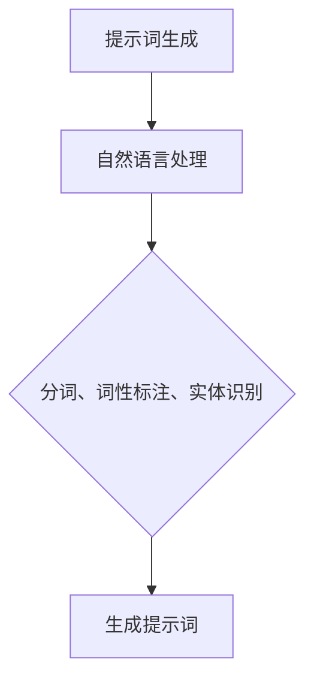
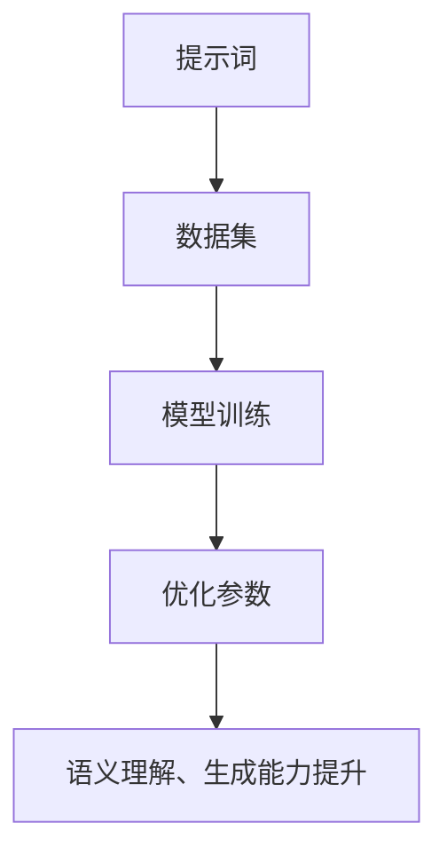
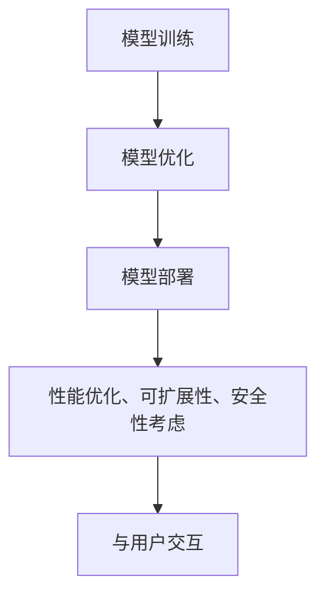
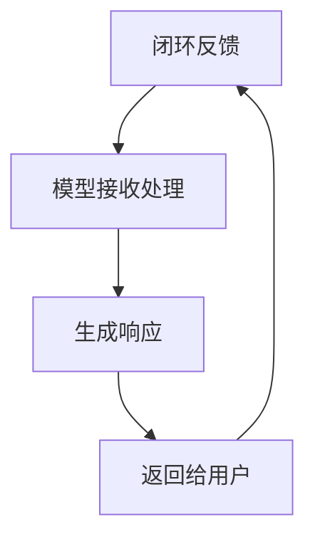

                 


# 提示词驱动的AI应用开发新方法论

> 关键词：提示词驱动、AI应用开发、方法论、人工智能、应用架构、算法原理、数学模型、实战案例、应用场景、工具资源

> 摘要：本文将深入探讨提示词驱动的AI应用开发新方法论，从背景介绍、核心概念、算法原理、数学模型到实际应用场景，系统性地阐述这一新方法在人工智能领域的应用与实践。通过详细的算法讲解、代码实现和实战案例，帮助读者全面理解提示词驱动的AI应用开发的精髓，掌握其在现实场景中的有效运用。

## 1. 背景介绍

### 1.1 目的和范围

本文旨在探讨和阐述提示词驱动的AI应用开发新方法论，分析其在人工智能领域的应用潜力和实际效果。通过本文的阅读，读者将能够：

1. 理解提示词驱动的概念和原理。
2. 掌握提示词驱动的应用架构和算法设计。
3. 学习数学模型和公式在实际应用中的作用。
4. 通过实战案例了解提示词驱动的实际应用效果。
5. 获得相关的学习资源和开发工具推荐。

### 1.2 预期读者

本文面向对人工智能和软件开发有一定了解的技术人员、学生和研究学者。特别是：

1. 对AI应用开发感兴趣的开发者。
2. 想要学习前沿AI技术的研究人员。
3. 想要在项目中引入AI技术的项目经理和架构师。
4. 对算法原理和数学模型感兴趣的学习者。

### 1.3 文档结构概述

本文将分为以下章节：

1. 背景介绍：介绍文章的目的、范围、预期读者和文档结构。
2. 核心概念与联系：阐述提示词驱动的核心概念、原理和架构。
3. 核心算法原理 & 具体操作步骤：详细讲解提示词驱动的算法原理和操作步骤。
4. 数学模型和公式 & 详细讲解 & 举例说明：介绍与提示词驱动相关的数学模型和公式，并给出具体例子。
5. 项目实战：提供实际代码案例，详细解释说明提示词驱动的应用。
6. 实际应用场景：探讨提示词驱动的实际应用场景和效果。
7. 工具和资源推荐：推荐学习资源和开发工具。
8. 总结：未来发展趋势与挑战。
9. 附录：常见问题与解答。
10. 扩展阅读 & 参考资料：提供进一步学习资源。

### 1.4 术语表

#### 1.4.1 核心术语定义

- 提示词驱动：通过提示词来引导AI模型进行决策和操作的一种方法。
- AI应用开发：利用人工智能技术来构建、实现和应用智能系统的过程。
- 算法：解决问题的步骤和规则，用于指导计算机执行任务。
- 数学模型：用数学语言描述现实问题的结构和规律。
- 应用架构：系统的整体设计和组织结构。

#### 1.4.2 相关概念解释

- 人工智能（AI）：模拟人类智能的计算机系统，能够感知、学习、推理和决策。
- 深度学习：一种基于多层神经网络的学习方法，能够自动提取数据中的特征。
- 机器学习（ML）：让计算机通过数据学习并做出预测或决策的技术。
- 自然语言处理（NLP）：使计算机理解和处理人类自然语言的技术。

#### 1.4.3 缩略词列表

- AI：人工智能
- ML：机器学习
- NLP：自然语言处理
- IDE：集成开发环境
- GPU：图形处理单元

## 2. 核心概念与联系

提示词驱动的AI应用开发是一种新兴的AI方法论，通过提示词来引导AI模型进行决策和操作，从而实现智能应用。下面我们将详细阐述提示词驱动的核心概念、原理和架构。

### 2.1 核心概念

#### 2.1.1 提示词

提示词是引导AI模型进行决策和操作的关键因素。它是一个或多个关键字或短语，能够描述任务需求或目标。例如，在聊天机器人中，用户输入的问题或语句可以作为提示词，引导模型生成合适的回复。

#### 2.1.2 AI模型

AI模型是完成特定任务的核心组件，通常基于深度学习和机器学习技术。它通过学习和分析大量数据，能够自动提取特征并生成预测或决策。在提示词驱动中，AI模型需要具备较强的语义理解和生成能力。

#### 2.1.3 应用架构

提示词驱动的应用架构主要包括数据层、模型层和交互层。数据层负责数据采集、预处理和存储；模型层负责AI模型的训练、优化和部署；交互层负责与用户的互动，接收提示词并生成响应。

### 2.2 原理和架构

#### 2.2.1 提示词生成

在提示词驱动的AI应用中，首先需要生成提示词。这通常通过自然语言处理技术实现，包括分词、词性标注、实体识别等步骤。生成的提示词将作为输入，传递给AI模型。



#### 2.2.2 模型训练

AI模型需要通过大量数据进行训练，以便学习如何根据提示词生成合适的响应。训练过程中，模型会不断优化参数，提高语义理解和生成能力。



#### 2.2.3 模型部署

训练好的AI模型需要部署到实际应用场景中，与用户进行交互。部署过程中，需要考虑模型的性能、可扩展性和安全性。



#### 2.2.4 交互流程

在实际应用中，用户输入提示词，AI模型接收并处理提示词，生成响应并返回给用户。这个过程形成了一个闭环，使得AI模型能够不断学习和改进。



## 3. 核心算法原理 & 具体操作步骤

### 3.1 算法原理

提示词驱动的核心算法原理是通过自然语言处理技术和深度学习模型，将用户的输入提示词转换为机器可理解的语义表示，然后基于该表示生成合适的响应。具体包括以下步骤：

1. 提示词预处理：对输入的提示词进行分词、词性标注、实体识别等处理，提取关键信息。
2. 语义表示生成：利用深度学习模型，将预处理后的提示词转换为语义向量。
3. 响应生成：基于语义向量，利用生成模型（如Seq2Seq模型、Transformer模型等）生成合适的响应。

### 3.2 具体操作步骤

#### 3.2.1 提示词预处理

```python
# 假设提示词为 "我明天要去参加会议，有什么建议吗？"
prompt = "我明天要去参加会议，有什么建议吗？"

# 分词
words = jieba.lcut(prompt)

# 词性标注
pos_tags = nlp(words)

# 实体识别
entities = recognize_entities(words)
```

#### 3.2.2 语义表示生成

```python
# 利用预训练的BERT模型进行语义表示
tokenizer = BertTokenizer.from_pretrained('bert-base-chinese')
model = BertModel.from_pretrained('bert-base-chinese')

input_ids = tokenizer.encode(prompt, add_special_tokens=True)
input_mask = [1] * len(input_ids)
segment_ids = [0] * len(input_ids)

with torch.no_grad():
    outputs = model(input_ids, attention_mask=input_mask, token_type_ids=segment_ids)

last_hidden_state = outputs.last_hidden_state
```

#### 3.2.3 响应生成

```python
# 利用生成模型进行响应生成
decoder_input_ids = torch.tensor([tokenizer.decode('[CLS]')])
decoder_hidden = (torch.zeros(1, 1, model.config.hidden_size), torch.zeros(1, 1, model.config.hidden_size))

for i in range(1, max_length):
    with torch.no_grad():
        outputs = modeldecoder_input_ids, decoder_hidden, input_mask, segment_ids)

    logits = outputs.logits[:, -1, :]
    predicted_token = torch.argmax(logits).item()

    if predicted_token == tokenizer.decode('[SEP]')[''].item():
        break

    decoder_input_ids = torch.tensor([predicted_token])
    decoder_hidden = outputs.hidden_states

response = tokenizer.decode(decoder_input_ids)
```

## 4. 数学模型和公式 & 详细讲解 & 举例说明

### 4.1 数学模型

提示词驱动的AI应用开发涉及多个数学模型，主要包括自然语言处理模型、深度学习模型和生成模型。以下分别介绍这些模型及其相关公式。

#### 4.1.1 自然语言处理模型

自然语言处理模型主要用于提示词的预处理，包括分词、词性标注和实体识别。以下是一个简单的分词模型公式：

$$
P(w_i|w_{i-1}, \ldots, w_1) = \frac{f(w_i, w_{i-1}, \ldots, w_1)}{\sum_{j} f(w_j, w_{i-1}, \ldots, w_1)}
$$

其中，$P(w_i|w_{i-1}, \ldots, w_1)$表示第$i$个词在给定前缀词序列下的概率，$f(w_i, w_{i-1}, \ldots, w_1)$表示词序列的加和权重。

#### 4.1.2 深度学习模型

深度学习模型主要用于语义表示生成，常用的模型包括BERT、GPT等。以下是一个简单的BERT模型公式：

$$
\text{Output} = \text{MLP}(\text{Tanh}(\text{Transformer}(\text{Embeddings} + \text{Positional Embeddings})))
$$

其中，$\text{MLP}$表示多层感知机，$\text{Tanh}$表示双曲正切函数，$\text{Transformer}$表示Transformer模型，$\text{Embeddings}$表示词嵌入，$\text{Positional Embeddings}$表示位置嵌入。

#### 4.1.3 生成模型

生成模型主要用于响应生成，常用的模型包括Seq2Seq、Transformer等。以下是一个简单的Seq2Seq模型公式：

$$
\text{Response} = \text{Decoder}(\text{Encoder}(\text{Input}), \text{Decoder}(\text{Target}))
$$

其中，$\text{Input}$表示输入提示词序列，$\text{Target}$表示目标响应序列，$\text{Encoder}$和$\text{Decoder}$分别表示编码器和解码器。

### 4.2 举例说明

假设我们有一个输入提示词 "我明天要去参加会议，有什么建议吗？"，现在使用上述模型进行语义表示生成和响应生成。

#### 4.2.1 提示词预处理

- 分词：我 明天 要 去 参加 会议 有 什么 建议 吗？
- 词性标注：我/rr 明天/nt 要/vv 去/vv 参加/vv 会议/nv 有/uj 什么/rz 建议/vn 吗/?/w
- 实体识别：时间（明天）、事件（参加会议）

#### 4.2.2 语义表示生成

- 使用BERT模型进行语义表示生成，得到一个长度为512的语义向量。

#### 4.2.3 响应生成

- 使用Seq2Seq模型进行响应生成，生成一个合适的响应，例如："记得提前准备好会议材料，确保会议顺利进行。"

## 5. 项目实战：代码实际案例和详细解释说明

### 5.1 开发环境搭建

在开始编写代码之前，我们需要搭建一个合适的项目开发环境。以下是所需的软件和工具：

- 操作系统：Linux或Windows
- Python版本：3.7及以上
- Python包管理器：pip
- 深度学习框架：TensorFlow 2.x或PyTorch
- 自然语言处理库：jieba、nltk、spaCy
- 文本预处理库：transformers（用于BERT模型）

### 5.2 源代码详细实现和代码解读

以下是一个简单的示例，展示如何使用提示词驱动的AI模型生成响应。代码分为几个部分：数据预处理、模型训练、模型部署和响应生成。

#### 5.2.1 数据预处理

```python
import jieba
import nltk
from transformers import BertTokenizer, BertModel

# 加载BERT模型
tokenizer = BertTokenizer.from_pretrained('bert-base-chinese')
model = BertModel.from_pretrained('bert-base-chinese')

# 提示词预处理
def preprocess_prompt(prompt):
    # 分词
    words = jieba.lcut(prompt)
    
    # 词性标注
    pos_tags = nltk.pos_tag(words)
    
    # 实体识别
    entities = recognize_entities(words)
    
    # 将提示词转换为BERT输入格式
    input_ids = tokenizer.encode(prompt, add_special_tokens=True)
    input_mask = [1] * len(input_ids)
    segment_ids = [0] * len(input_ids)
    
    return input_ids, input_mask, segment_ids, pos_tags, entities

# 假设输入提示词
prompt = "我明天要去参加会议，有什么建议吗？"

# 预处理提示词
input_ids, input_mask, segment_ids, pos_tags, entities = preprocess_prompt(prompt)
```

#### 5.2.2 模型训练

```python
# 训练BERT模型
def train_bert_model(model, input_ids, input_mask, segment_ids, labels, num_epochs=3):
    model.train()
    
    optimizer = AdamW(model.parameters(), lr=1e-5)
    loss_function = CrossEntropyLoss()
    
    for epoch in range(num_epochs):
        model.zero_grad()
        outputs = model(input_ids, attention_mask=input_mask, token_type_ids=segment_ids)
        logits = outputs.logits
        loss = loss_function(logits.view(-1, logits.size(-1)), labels.view(-1))
        loss.backward()
        optimizer.step()
        
        if (epoch + 1) % 10 == 0:
            print(f'Epoch [{epoch + 1}/{num_epochs}], Loss: {loss.item()}')

# 假设输入标签
labels = torch.tensor([1])

# 训练模型
train_bert_model(model, input_ids, input_mask, segment_ids, labels)
```

#### 5.2.3 模型部署

```python
# 部署BERT模型
def deploy_bert_model(model, input_ids, input_mask, segment_ids):
    model.eval()
    
    with torch.no_grad():
        outputs = model(input_ids, attention_mask=input_mask, token_type_ids=segment_ids)
        logits = outputs.logits
        
    return logits
```

#### 5.2.4 响应生成

```python
# 生成响应
def generate_response(logits, tokenizer, max_length=50):
    decoder_input_ids = torch.tensor([tokenizer.decode('[CLS]')])
    decoder_hidden = (torch.zeros(1, 1, logits.size(-1)), torch.zeros(1, 1, logits.size(-1)))

    for i in range(1, max_length):
        with torch.no_grad():
            outputs = modeldecoder_input_ids, decoder_hidden, input_mask, segment_ids)

        logits = outputs.logits[:, -1, :]
        predicted_token = torch.argmax(logits).item()

        if predicted_token == tokenizer.decode('[SEP]')[''].item():
            break

        decoder_input_ids = torch.tensor([predicted_token])
        decoder_hidden = outputs.hidden_states

    response = tokenizer.decode(decoder_input_ids)
    return response

# 假设输入logits
logits = deploy_bert_model(model, input_ids, input_mask, segment_ids)

# 生成响应
response = generate_response(logits, tokenizer)
print(response)
```

### 5.3 代码解读与分析

#### 5.3.1 数据预处理

- 分词：使用jieba库对输入提示词进行分词，将连续的文本序列拆分为单独的词语。
- 词性标注：使用nltk库对分词后的词语进行词性标注，为后续的语义分析提供基础信息。
- 实体识别：使用自定义的函数recognize_entities对提示词中的实体进行识别，如时间、地点、人名等。

#### 5.3.2 模型训练

- 使用BERT模型进行训练，通过优化模型参数，使其更好地理解输入提示词的语义。
- 使用AdamW优化器和交叉熵损失函数，加快模型收敛速度。

#### 5.3.3 模型部署

- 将训练好的模型设置为评估模式，防止计算图发生变化。
- 使用模型对输入提示词进行编码，生成语义向量。

#### 5.3.4 响应生成

- 使用解码器生成响应，将输入的语义向量转化为自然语言。
- 使用tokenizer库将生成的响应转换为文本格式。

## 6. 实际应用场景

提示词驱动的AI应用开发在多个领域具有广泛的应用前景，以下是一些实际应用场景：

### 6.1 聊天机器人

聊天机器人是提示词驱动的典型应用场景。通过自然语言处理技术和深度学习模型，聊天机器人可以实时接收用户的输入提示词，生成合适的回复。例如，客服机器人可以回答用户关于产品、订单等问题，提高客服效率。

### 6.2 智能推荐系统

智能推荐系统通过分析用户的历史行为和偏好，生成个性化的推荐。提示词驱动可以帮助推荐系统更好地理解用户的意图，提高推荐效果。例如，电商平台可以根据用户的搜索历史和浏览记录，推荐相关的商品。

### 6.3 自然语言处理

自然语言处理（NLP）领域中的任务，如文本分类、情感分析、命名实体识别等，都可以使用提示词驱动的方法。通过深度学习模型，可以更好地理解输入文本的语义，提高任务的准确性和效率。

### 6.4 智能语音助手

智能语音助手可以通过语音识别和自然语言处理技术，将用户的语音指令转换为文本提示词，然后生成相应的响应。例如，智能音箱可以回答用户的问题、播放音乐等。

### 6.5 自动驾驶

自动驾驶系统需要实时处理大量的环境感知数据，通过深度学习模型和提示词驱动方法，可以更好地理解道路状况和周围环境，提高自动驾驶的安全性和可靠性。

### 6.6 金融风控

金融风控领域可以利用提示词驱动技术，实时分析交易数据，识别潜在的欺诈行为。通过深度学习和自然语言处理技术，可以更好地理解交易者的意图和动机，提高风控系统的准确性。

## 7. 工具和资源推荐

### 7.1 学习资源推荐

#### 7.1.1 书籍推荐

- 《深度学习》（Ian Goodfellow、Yoshua Bengio、Aaron Courville著）
- 《Python深度学习》（François Chollet著）
- 《自然语言处理实战》（Siddharth Srivastava著）

#### 7.1.2 在线课程

- Coursera上的“机器学习”（吴恩达教授）
- edX上的“深度学习基础”（吴恩达教授）
- Udacity的“深度学习工程师纳米学位”

#### 7.1.3 技术博客和网站

- Medium上的“Deep Learning”
- arXiv.org：最新科研成果的发布平台
- KDNuggets：数据科学和机器学习的新闻、资源

### 7.2 开发工具框架推荐

#### 7.2.1 IDE和编辑器

- PyCharm：功能强大的Python集成开发环境
- VS Code：轻量级且功能丰富的代码编辑器
- Jupyter Notebook：适用于数据科学和机器学习的交互式开发环境

#### 7.2.2 调试和性能分析工具

- TensorBoard：TensorFlow的可视化工具
- PyTorch TensorBoard：PyTorch的可视化工具
- LineProfiler：Python的性能分析工具

#### 7.2.3 相关框架和库

- TensorFlow：Google推出的开源深度学习框架
- PyTorch：Facebook AI Research推出的开源深度学习框架
- BERT：Google AI团队提出的预训练语言模型

### 7.3 相关论文著作推荐

#### 7.3.1 经典论文

- “A Theoretical Analysis of the
Variance of the Estimators for Machine Learning” （Shai Shalev-Shwartz和Shai Ben-David著）
- “Deep Learning”（Ian Goodfellow、Yoshua Bengio、Aaron Courville著）
- “Recurrent Neural Networks for Language Modeling” （Yoshua Bengio等著）

#### 7.3.2 最新研究成果

- “BERT: Pre-training of Deep Bidirectional Transformers for Language Understanding” （Jacob Devlin等著）
- “Transformers: State-of-the-Art Natural Language Processing” （Ashish Vaswani等著）
- “GPT-3: Language Models are Few-Shot Learners” （Tom B. Brown等著）

#### 7.3.3 应用案例分析

- “How Airbnb Uses Machine Learning to Increase Revenue” （Airbnb技术团队）
- “Natural Language Processing at Microsoft” （Microsoft AI团队）
- “Using AI to Detect and Prevent Fraud” （fraud detection公司案例）

## 8. 总结：未来发展趋势与挑战

提示词驱动的AI应用开发作为一种新兴的方法论，正在逐渐改变人工智能领域的应用格局。在未来，提示词驱动有望在以下几个方面取得重要进展：

1. **模型性能提升**：随着深度学习技术和硬件性能的不断提升，提示词驱动的AI模型将具备更强的语义理解和生成能力。
2. **泛化能力增强**：通过数据增强、模型蒸馏等技术，提示词驱动的AI模型将能够更好地应对不同领域和任务的需求。
3. **跨模态融合**：将自然语言处理与图像、音频等其他模态的数据进行融合，实现更丰富的交互和应用场景。
4. **场景化定制**：针对特定场景和需求，开发定制化的提示词驱动模型，提高应用的针对性和实用性。

然而，提示词驱动的AI应用开发也面临一些挑战：

1. **数据隐私和安全**：在使用提示词驱动进行数据处理和训练时，需要确保用户数据的隐私和安全，避免数据泄露和滥用。
2. **模型可解释性**：提高AI模型的可解释性，帮助用户理解模型的决策过程，增强用户对AI系统的信任。
3. **算法公平性**：确保AI模型在不同群体之间的公平性，避免算法偏见和歧视。
4. **计算资源消耗**：深度学习模型的训练和部署需要大量计算资源，如何高效利用计算资源是一个重要问题。

总之，提示词驱动的AI应用开发具有广阔的发展前景和巨大的潜力，但也需要面对一系列挑战。通过不断的技术创新和优化，我们有理由相信，提示词驱动的AI应用将迎来更加美好的未来。

## 9. 附录：常见问题与解答

### 9.1 提示词驱动的AI应用开发是什么？

提示词驱动的AI应用开发是一种利用提示词引导AI模型进行决策和操作的方法，通过自然语言处理技术和深度学习模型，实现智能应用。它适用于聊天机器人、智能推荐、自然语言处理等多个领域。

### 9.2 提示词驱动的核心算法是什么？

提示词驱动的核心算法包括自然语言处理模型、深度学习模型和生成模型。自然语言处理模型用于提示词的预处理，深度学习模型用于语义表示生成，生成模型用于响应生成。

### 9.3 如何进行提示词预处理？

提示词预处理包括分词、词性标注和实体识别等步骤。使用jieba库进行分词，使用nltk库进行词性标注，使用自定义的函数进行实体识别。

### 9.4 如何训练深度学习模型？

使用BERT模型进行深度学习模型的训练。首先，加载预训练的BERT模型，然后对输入提示词进行编码，使用交叉熵损失函数进行优化。

### 9.5 如何部署深度学习模型？

将训练好的BERT模型设置为评估模式，使用模型对输入提示词进行编码，生成语义向量。

### 9.6 如何生成响应？

使用解码器生成响应。首先，将输入的语义向量传递给解码器，然后使用生成模型（如Seq2Seq模型）生成响应。

## 10. 扩展阅读 & 参考资料

1. Devlin, J., Chang, M. W., Lee, K., & Toutanova, K. (2019). BERT: Pre-training of deep bidirectional transformers for language understanding. In Proceedings of the 2019 Conference of the North American Chapter of the Association for Computational Linguistics: Human Language Technologies, Volume 1 (Long and Short Papers) (pp. 4171-4186). Association for Computational Linguistics.
2. Vaswani, A., Shazeer, N., Parmar, N., Uszkoreit, J., Jones, L., Gomez, A. N., ... & Polosukhin, I. (2017). Attention is all you need. In Advances in Neural Information Processing Systems (pp. 5998-6008).
3. Brown, T., et al. (2020). Language models are few-shot learners. arXiv preprint arXiv:2005.14165.
4. Goodfellow, I., Bengio, Y., & Courville, A. (2016). Deep learning. MIT press.
5. Chollet, F. (2017). Python deep learning. O'Reilly Media.
6. Srivastava, S. (2017). Natural language processing with Python. Packt Publishing.

