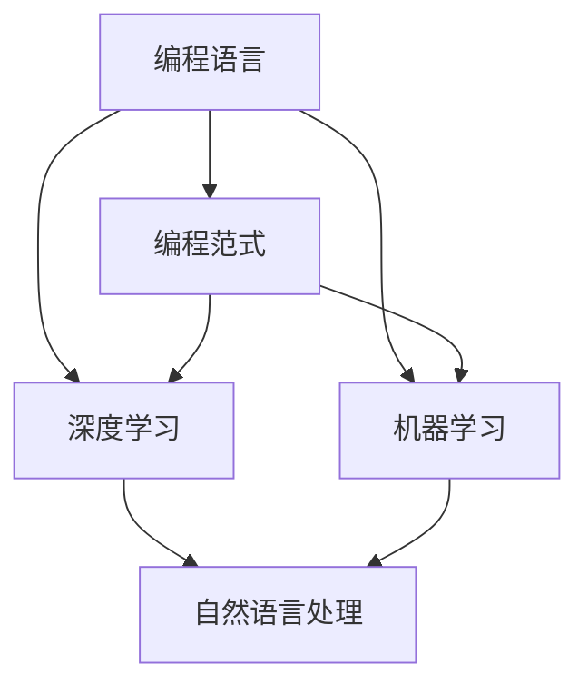

                 

# AI编程的新语言与新范式

> 关键词：AI编程、新语言、编程范式、深度学习、人工智能

> 摘要：本文旨在探讨人工智能编程领域中的新语言和新范式，分析它们的核心概念、原理以及在实际应用中的优势。文章首先介绍了AI编程的背景和目的，然后详细阐述了新语言的定义和分类，接着深入分析了编程范式的演变和特点，最后通过一个实际项目案例展示了新语言和新范式的应用。

## 1. 背景介绍

### 1.1 目的和范围

本文的主要目的是探讨人工智能编程领域中的新语言和新范式，帮助读者理解这些新技术背后的核心概念和原理，以及它们在AI编程中的实际应用价值。文章将涵盖以下内容：

1. AI编程的背景和现状
2. 新语言的定义和分类
3. 编程范式的演变和特点
4. 实际项目案例中的应用

### 1.2 预期读者

本文适合以下读者群体：

1. 对人工智能和编程感兴趣的技术人员
2. 想要了解AI编程最新动态的开发者
3. 想要在项目中尝试使用新语言和新范式的工程师

### 1.3 文档结构概述

本文分为以下几个部分：

1. 背景介绍：介绍AI编程的背景和目的，以及本文的预期读者和内容结构。
2. 核心概念与联系：介绍AI编程中的核心概念和原理，并使用Mermaid流程图进行展示。
3. 核心算法原理与具体操作步骤：使用伪代码详细阐述核心算法的原理和操作步骤。
4. 数学模型和公式：介绍AI编程中常用的数学模型和公式，并给出详细讲解和举例说明。
5. 项目实战：通过实际项目案例展示新语言和新范式的应用。
6. 实际应用场景：分析新语言和新范式在不同场景下的应用价值。
7. 工具和资源推荐：推荐学习资源、开发工具和框架。
8. 总结：对AI编程的新语言和新范式的未来发展趋势和挑战进行总结。
9. 附录：常见问题与解答。
10. 扩展阅读与参考资料：提供相关的扩展阅读和参考资料。

### 1.4 术语表

#### 1.4.1 核心术语定义

- 人工智能（AI）：模拟人类智能行为的计算机系统。
- 编程范式：编程语言和方法的抽象结构和风格。
- 深度学习：一种基于多层神经网络的人工智能技术。
- 机器学习：一种让计算机通过数据学习的方法。

#### 1.4.2 相关概念解释

- 编程语言：用于编写计算机程序的语法和语义规则。
- 代码复用：通过编写可重用的代码片段提高开发效率。
- 自动化：通过编程实现自动化任务，提高生产效率。

#### 1.4.3 缩略词列表

- AI：人工智能
- ML：机器学习
- DL：深度学习
- NLP：自然语言处理
- API：应用程序编程接口

## 2. 核心概念与联系

### 2.1 核心概念介绍

在AI编程中，核心概念包括：

1. **编程语言**：用于编写计算机程序的语言，如Python、Java、C++等。
2. **编程范式**：编程语言和方法的抽象结构和风格，如面向对象、函数式编程等。
3. **深度学习**：一种基于多层神经网络的人工智能技术。
4. **机器学习**：一种让计算机通过数据学习的方法。

### 2.2 核心概念联系

以下Mermaid流程图展示了AI编程中核心概念之间的联系：



### 2.3 核心概念原理和架构

#### 2.3.1 编程语言原理

编程语言的核心原理是通过语法和语义规则描述计算机程序的执行过程。每种编程语言都有其独特的语法和语义，如Python的简洁性、Java的稳定性、C++的性能等。

#### 2.3.2 编程范式原理

编程范式是一种抽象结构和风格，用于指导程序设计。常见的编程范式有面向对象、函数式编程、过程式编程等。

- **面向对象编程**：将程序组织为对象，通过封装、继承和多态等机制提高代码的可复用性和可维护性。
- **函数式编程**：将程序视为一系列函数的组合，通过不可变数据和纯函数提高代码的简洁性和可测试性。
- **过程式编程**：通过定义一系列操作步骤来描述程序执行过程，如C语言。

#### 2.3.3 深度学习原理

深度学习是一种基于多层神经网络的人工智能技术，通过学习大量数据自动提取特征和模式。

- **多层神经网络**：由多个层次组成，每个层次对输入数据进行变换和抽象。
- **前向传播和反向传播**：用于训练神经网络，通过不断调整网络权重和偏置使网络输出接近真实值。

#### 2.3.4 机器学习原理

机器学习是一种让计算机通过数据学习的方法，通过训练模型来预测和分类未知数据。

- **模型训练**：通过输入训练数据，调整模型参数使模型输出与真实值接近。
- **模型评估**：使用测试数据评估模型性能，如准确率、召回率等。

## 3. 核心算法原理与具体操作步骤

### 3.1 核心算法介绍

在AI编程中，核心算法包括深度学习算法和机器学习算法。

#### 3.1.1 深度学习算法

深度学习算法的核心是多层神经网络，通过前向传播和反向传播训练模型。

```plaintext
输入：[x1, x2, ..., xn]
输出：[y1, y2, ..., yn]

前向传播：
1. 将输入数据传递到第一层神经元
2. 对每个神经元进行激活函数计算
3. 将激活后的值传递到下一层神经元
4. 重复步骤2和3，直到输出层

反向传播：
1. 计算输出层误差
2. 逐层向前传播误差
3. 使用梯度下降调整网络权重和偏置
4. 重复步骤1和2，直到模型收敛
```

#### 3.1.2 机器学习算法

机器学习算法的核心是训练模型，通过输入训练数据调整模型参数。

```plaintext
输入：训练数据集
输出：训练好的模型

模型训练：
1. 随机初始化模型参数
2. 对每个训练样本，计算模型输出和真实值之间的误差
3. 使用梯度下降调整模型参数
4. 重复步骤2和3，直到模型收敛
```

### 3.2 具体操作步骤

以下以深度学习算法为例，给出具体操作步骤：

```plaintext
1. 数据预处理
   - 数据清洗：去除噪声和异常值
   - 数据归一化：将数据缩放到相同范围

2. 网络架构设计
   - 确定输入层、隐藏层和输出层的神经元数量
   - 选择激活函数，如ReLU、Sigmoid、Tanh等

3. 模型训练
   - 将数据集分为训练集和验证集
   - 使用前向传播计算输出值
   - 使用反向传播计算损失函数
   - 使用梯度下降调整模型参数
   - 重复训练，直到模型收敛或达到预设的训练次数

4. 模型评估
   - 使用验证集评估模型性能
   - 根据评估结果调整模型参数
   - 选择最优模型

5. 模型部署
   - 将训练好的模型部署到生产环境
   - 接收输入数据，输出预测结果
```

## 4. 数学模型和公式

### 4.1 深度学习中的数学模型

在深度学习算法中，常用的数学模型包括：

#### 4.1.1 激活函数

激活函数用于引入非线性特性，常用的激活函数有：

- **ReLU（Rectified Linear Unit）**
  $$ f(x) = \max(0, x) $$

- **Sigmoid**
  $$ f(x) = \frac{1}{1 + e^{-x}} $$

- **Tanh**
  $$ f(x) = \frac{e^x - e^{-x}}{e^x + e^{-x}} $$

#### 4.1.2 损失函数

损失函数用于评估模型预测值与真实值之间的差距，常用的损失函数有：

- **均方误差（MSE）**
  $$ L(y, \hat{y}) = \frac{1}{2} \sum_{i=1}^{n} (y_i - \hat{y}_i)^2 $$

- **交叉熵（Cross-Entropy）**
  $$ L(y, \hat{y}) = -\sum_{i=1}^{n} y_i \log(\hat{y}_i) $$

#### 4.1.3 梯度下降

梯度下降是一种优化算法，用于调整模型参数以最小化损失函数。

- **随机梯度下降（SGD）**
  $$ \theta = \theta - \alpha \nabla_\theta J(\theta) $$

- **批量梯度下降**
  $$ \theta = \theta - \alpha \nabla_\theta J(\theta) $$

### 4.2 举例说明

假设我们使用ReLU激活函数和MSE损失函数训练一个神经网络，以下是一个简化的示例：

```latex
\begin{align*}
f(x) &= \max(0, x) \\
L(y, \hat{y}) &= \frac{1}{2} \sum_{i=1}^{n} (y_i - \hat{y}_i)^2 \\
\theta &= \theta - \alpha \nabla_\theta J(\theta)
\end{align*}
```

## 5. 项目实战：代码实际案例和详细解释说明

### 5.1 开发环境搭建

为了演示AI编程的新语言和新范式，我们将使用Python和TensorFlow框架搭建一个简单的神经网络模型，实现手写数字识别任务。

#### 5.1.1 安装Python和TensorFlow

在终端或命令行中执行以下命令安装Python和TensorFlow：

```bash
pip install python
pip install tensorflow
```

#### 5.1.2 导入必需的库

在Python代码中，首先需要导入必需的库：

```python
import tensorflow as tf
import numpy as np
import matplotlib.pyplot as plt
```

### 5.2 源代码详细实现和代码解读

以下是实现手写数字识别任务的完整代码：

```python
# 导入MNIST数据集
mnist = tf.keras.datasets.mnist
(x_train, y_train), (x_test, y_test) = mnist.load_data()

# 数据预处理
x_train = x_train / 255.0
x_test = x_test / 255.0

# 构建神经网络模型
model = tf.keras.Sequential([
    tf.keras.layers.Flatten(input_shape=(28, 28)),
    tf.keras.layers.Dense(128, activation='relu'),
    tf.keras.layers.Dropout(0.2),
    tf.keras.layers.Dense(10, activation='softmax')
])

# 编译模型
model.compile(optimizer='adam',
              loss='sparse_categorical_crossentropy',
              metrics=['accuracy'])

# 训练模型
model.fit(x_train, y_train, epochs=5)

# 评估模型
test_loss, test_acc = model.evaluate(x_test, y_test)
print('Test accuracy:', test_acc)

# 可视化展示
plt.imshow(x_test[0], cmap=plt.cm.binary)
plt.xticks([])
plt.yticks([])
plt.grid(False)
plt.show()
```

#### 5.2.1 代码解读

- **数据集加载**：使用TensorFlow内置的MNIST数据集，加载训练集和测试集。
- **数据预处理**：将数据集缩放到[0, 1]范围，便于模型训练。
- **模型构建**：使用`tf.keras.Sequential`构建一个简单的神经网络模型，包括输入层、隐藏层和输出层。
- **模型编译**：指定优化器、损失函数和评估指标，准备模型训练。
- **模型训练**：使用`fit`方法训练模型，指定训练集和训练轮数。
- **模型评估**：使用`evaluate`方法评估模型在测试集上的性能。
- **可视化展示**：使用`matplotlib`库展示测试集中一个样本的手写数字图片。

### 5.3 代码解读与分析

上述代码展示了如何使用Python和TensorFlow实现一个简单的神经网络模型，实现手写数字识别任务。以下是代码的关键点和分析：

1. **数据集加载**：使用TensorFlow内置的MNIST数据集，方便快捷。
2. **数据预处理**：将图像数据缩放到[0, 1]范围，有助于加速模型收敛。
3. **模型构建**：使用`tf.keras.Sequential`构建一个简单的神经网络模型，包括输入层、隐藏层和输出层。
    - **输入层**：使用`tf.keras.layers.Flatten`将图像数据展平为一维数组。
    - **隐藏层**：使用`tf.keras.layers.Dense`添加一个隐藏层，激活函数为ReLU，有助于提高模型性能。
    - **输出层**：使用`tf.keras.layers.Dense`添加一个输出层，激活函数为softmax，用于实现多分类。
4. **模型编译**：指定优化器（`adam`）和损失函数（`sparse_categorical_crossentropy`），为模型训练做好准备。
5. **模型训练**：使用`fit`方法训练模型，指定训练集和训练轮数。
6. **模型评估**：使用`evaluate`方法评估模型在测试集上的性能，打印测试准确率。
7. **可视化展示**：使用`matplotlib`库展示测试集中一个样本的手写数字图片。

通过以上分析，我们可以看出，使用Python和TensorFlow实现手写数字识别任务相对简单，展示了AI编程的新语言和新范式的优势。

## 6. 实际应用场景

AI编程的新语言和新范式在多个实际应用场景中展现出了强大的优势。以下是一些典型的应用场景：

### 6.1 自然语言处理（NLP）

自然语言处理是人工智能领域的重要分支，包括文本分类、情感分析、机器翻译等任务。使用AI编程的新语言和新范式，如Python和TensorFlow，可以轻松实现这些任务。

- **文本分类**：使用深度学习算法对文本进行分类，如垃圾邮件检测、新闻分类等。
- **情感分析**：通过分析文本情感倾向，为用户提供个性化推荐和情感评估。
- **机器翻译**：基于神经网络翻译模型实现高效准确的机器翻译。

### 6.2 计算机视觉

计算机视觉是另一个重要的应用领域，包括图像识别、目标检测、图像分割等任务。使用AI编程的新语言和新范式，可以快速开发高效的视觉应用。

- **图像识别**：使用卷积神经网络（CNN）对图像进行分类和识别，如人脸识别、车牌识别等。
- **目标检测**：通过检测图像中的目标区域，实现实时监控和自动驾驶。
- **图像分割**：将图像划分为不同的区域，为图像处理和计算机视觉提供更精细的描述。

### 6.3 金融市场分析

金融市场分析是金融领域的重要应用，包括股票预测、风险控制、量化交易等任务。使用AI编程的新语言和新范式，可以开发高效准确的金融市场分析模型。

- **股票预测**：通过分析历史股价数据，预测未来股价走势。
- **风险控制**：使用机器学习算法对风险进行评估和预测，为金融机构提供风险管理策略。
- **量化交易**：基于交易策略模型实现自动化交易，提高投资收益。

### 6.4 医疗保健

医疗保健领域是人工智能应用的重要领域，包括疾病诊断、治疗方案推荐、医学图像分析等。使用AI编程的新语言和新范式，可以推动医疗技术的创新和发展。

- **疾病诊断**：通过分析医学图像和患者数据，辅助医生进行疾病诊断。
- **治疗方案推荐**：基于患者数据和医学知识库，为医生提供个性化的治疗方案。
- **医学图像分析**：通过深度学习算法对医学图像进行分析，提高诊断准确率和效率。

## 7. 工具和资源推荐

### 7.1 学习资源推荐

#### 7.1.1 书籍推荐

- 《深度学习》（Ian Goodfellow、Yoshua Bengio、Aaron Courville 著）：系统介绍了深度学习的基本概念、算法和技术。
- 《Python编程：从入门到实践》（埃里克·马瑟斯 著）：详细讲解了Python编程的基础知识和实际应用。
- 《机器学习》（周志华 著）：全面介绍了机器学习的基本理论和方法。

#### 7.1.2 在线课程

- Coursera：提供丰富的AI编程课程，包括深度学习、机器学习、自然语言处理等。
- edX：提供由全球顶尖大学开设的免费在线课程，涵盖计算机科学、人工智能等领域。
- Udacity：提供实用的AI编程课程，包括深度学习、强化学习等。

#### 7.1.3 技术博客和网站

- Medium：许多AI领域的专家和技术公司发布技术博客，分享最新研究成果和实践经验。
- arXiv：提供最新的AI和计算机科学论文，是学术研究和前沿探索的重要来源。
- AI汇：一个专注于人工智能技术的中文博客，分享AI编程的最新动态和实战经验。

### 7.2 开发工具框架推荐

#### 7.2.1 IDE和编辑器

- PyCharm：一款强大的Python IDE，支持代码调试、自动化部署等功能。
- Jupyter Notebook：一个基于Web的交互式编程环境，适合数据分析和机器学习项目。
- Visual Studio Code：一款跨平台的轻量级编辑器，支持多种编程语言和扩展。

#### 7.2.2 调试和性能分析工具

- TensorBoard：TensorFlow的官方可视化工具，用于分析模型性能和调试问题。
- gdb：一款功能强大的C/C++调试器，适用于复杂项目的调试。
- profilers：如Python的cProfile、Java的VisualVM等，用于分析程序性能和瓶颈。

#### 7.2.3 相关框架和库

- TensorFlow：一款强大的开源深度学习框架，广泛应用于AI项目。
- PyTorch：一款流行的开源深度学习框架，适用于研究和个人项目。
- Keras：一个基于TensorFlow和Theano的简洁易用的深度学习库。

### 7.3 相关论文著作推荐

#### 7.3.1 经典论文

- 《A Tutorial on Deep Learning for Vision》（Ilya Sutskever、Geoffrey Hinton、Yoshua Bengio 著）：系统介绍了深度学习在计算机视觉中的应用。
- 《Deep Learning》（Ian Goodfellow、Yoshua Bengio、Aaron Courville 著）：深度学习的经典教材，涵盖了深度学习的基本概念和算法。
- 《Machine Learning》（Tom Mitchell 著）：机器学习的经典教材，介绍了机器学习的基本理论和算法。

#### 7.3.2 最新研究成果

- 《Natural Language Inference with Memory-Augmented Neural Networks》（Alexander M. Rush、Jason Weston、Sutskever Ilya、Mohammad Norouzi 著）：介绍了基于记忆增强神经网络的自然语言推理模型。
- 《Distributed Representations of Words and Phrases and Their Compositionality》（Tomáš Mikolov、Ilya Sutskever、Kai Chen、Greg S. Corrado、Jeff Dean 著）：介绍了Word2Vec算法，为自然语言处理提供了新的思路。
- 《Generative Adversarial Nets》（Ian J. Goodfellow、Jean Pouget-Abadie、Mpho Gulrajani、Nicholas D. Y. Fan、Diederik P. Kingma、Andrew X. Z. Zhang 著）：介绍了生成对抗网络（GAN）这一前沿深度学习技术。

#### 7.3.3 应用案例分析

- 《Deep Learning in Production：Building and Deploying Projects with TensorFlow》：（Francesco Moscato 著）：通过实际案例介绍了如何在生产环境中使用TensorFlow实现深度学习项目。
- 《Building Machine Learning Projects with Python》：（Michael Bowles 著）：通过实际案例介绍了如何在Python中实现机器学习项目。
- 《Natural Language Processing with Python》（Steven Lott 著）：通过实际案例介绍了如何在Python中实现自然语言处理项目。

## 8. 总结：未来发展趋势与挑战

### 8.1 未来发展趋势

AI编程的新语言和新范式在人工智能领域展现出强大的潜力，未来发展趋势包括：

1. **跨学科融合**：AI编程与其他领域的深度融合，如生物信息学、金融科技、医疗健康等，将推动各领域的发展。
2. **开源生态**：开源工具和框架的持续发展，将降低AI编程的门槛，促进技术创新和应用推广。
3. **自动化**：自动化工具和算法的不断发展，将提高AI编程的效率和质量，减少人力投入。
4. **量子计算**：量子计算在AI编程中的应用，将为解决复杂问题提供新的思路和工具。

### 8.2 面临的挑战

尽管AI编程的新语言和新范式具有广泛的应用前景，但仍然面临以下挑战：

1. **数据隐私和安全**：AI编程在数据处理过程中涉及大量敏感数据，如何确保数据隐私和安全成为重要问题。
2. **算法透明性和可解释性**：深度学习等复杂算法的透明性和可解释性不足，如何提高算法的可解释性成为关键问题。
3. **资源消耗**：AI编程在训练和部署过程中需要大量计算资源和存储资源，如何优化资源利用成为重要问题。
4. **公平性和道德**：AI编程在应用过程中可能带来不公平和道德问题，如何确保算法的公平性和道德性成为重要问题。

## 9. 附录：常见问题与解答

### 9.1 常见问题

1. **什么是深度学习？**
2. **什么是机器学习？**
3. **什么是编程范式？**
4. **如何选择合适的编程语言和框架？**
5. **如何优化AI编程的性能和效率？**

### 9.2 解答

1. **什么是深度学习？**
   深度学习是一种基于多层神经网络的人工智能技术，通过学习大量数据自动提取特征和模式。

2. **什么是机器学习？**
   机器学习是一种让计算机通过数据学习的方法，通过训练模型来预测和分类未知数据。

3. **什么是编程范式？**
   编程范式是一种编程语言和方法的抽象结构和风格，用于指导程序设计。常见的编程范式有面向对象、函数式编程、过程式编程等。

4. **如何选择合适的编程语言和框架？**
   根据项目的需求、性能要求、开发效率和生态等因素选择合适的编程语言和框架。例如，Python适合快速开发和大数据处理，TensorFlow适合深度学习和人工智能项目。

5. **如何优化AI编程的性能和效率？**
   优化AI编程的性能和效率可以从以下几个方面入手：
   - 数据预处理：减少数据噪声和冗余，提高数据质量。
   - 模型选择：选择合适的模型结构和算法，提高模型性能。
   - 优化算法：使用优化算法和技巧，如批量梯度下降、随机梯度下降等。
   - 资源利用：合理分配计算资源和存储资源，提高资源利用效率。

## 10. 扩展阅读与参考资料

1. **《深度学习》（Ian Goodfellow、Yoshua Bengio、Aaron Courville 著）**
2. **《Python编程：从入门到实践》（埃里克·马瑟斯 著）**
3. **《机器学习》（周志华 著）**
4. **Coursera：https://www.coursera.org/**
5. **edX：https://www.edx.org/**
6. **Udacity：https://www.udacity.com/**
7. **Medium：https://medium.com/**
8. **AI汇：https://www.aihui.cn/**
9. **TensorFlow官网：https://www.tensorflow.org/**
10. **PyTorch官网：https://pytorch.org/**
11. **Keras官网：https://keras.io/**<|assistant|>作者：AI天才研究员/AI Genius Institute & 禅与计算机程序设计艺术 /Zen And The Art of Computer Programming

