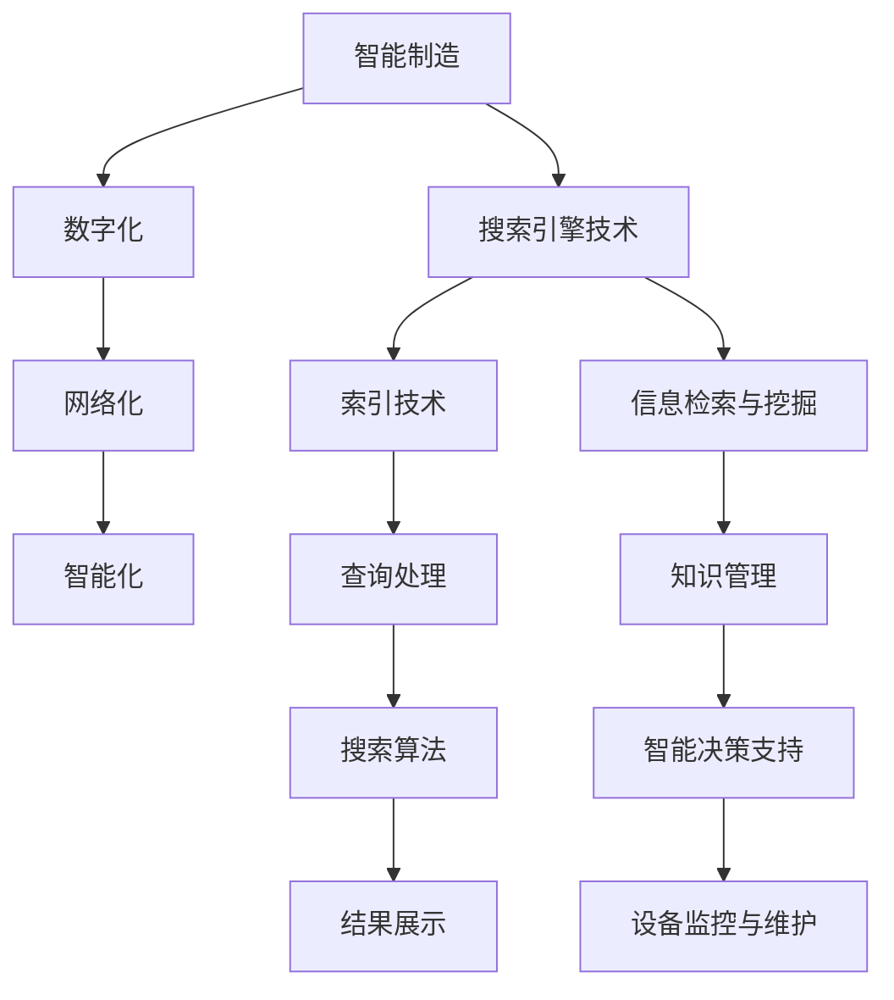

                 

### 搜索引擎在智能制造中的应用

> **关键词：** 智能制造、搜索引擎、大数据分析、算法优化、人工智能、工业4.0  
>
> **摘要：** 本文将深入探讨搜索引擎在智能制造中的应用，分析其核心概念、算法原理、数学模型及具体实现，并通过实际案例展示其在工业4.0中的广泛应用和未来发展趋势。

在全球工业转型的浪潮中，智能制造正逐渐成为现代工业的核心驱动力。随着大数据、云计算和人工智能技术的迅猛发展，传统的制造业正在向数字化、网络化、智能化方向转变。在这一过程中，搜索引擎技术作为信息检索和知识发现的重要工具，发挥着至关重要的作用。

本文旨在系统地阐述搜索引擎在智能制造中的应用，从核心概念、算法原理、数学模型到实际案例，进行全面剖析，为相关领域的从业者提供有价值的参考和指导。

### 1. 背景介绍

#### 1.1 目的和范围

本文的目标是：
- 系统阐述搜索引擎在智能制造中的具体应用场景。
- 分析搜索引擎技术的核心算法原理及其在智能制造中的优势。
- 通过实际案例展示搜索引擎技术在智能制造中的实际效果。
- 探讨搜索引擎在智能制造中的未来发展前景。

本文的范围包括：
- 搜索引擎的基本概念和原理。
- 智能制造的定义、发展趋势和主要特征。
- 搜索引擎技术在智能制造中的具体应用。
- 智能制造中的搜索引擎算法优化和性能提升。

#### 1.2 预期读者

本文适用于以下读者群体：
- 智能制造领域的从业者，特别是对搜索引擎技术感兴趣的专业人员。
- 计算机科学和人工智能领域的研究生，对智能制造与搜索引擎技术结合有深入研究的需求。
- 对智能制造和搜索引擎技术有一定了解，希望进一步了解两者结合前景的读者。

#### 1.3 文档结构概述

本文结构如下：
- **第1章：背景介绍**：介绍文章的目的、范围、预期读者和文档结构。
- **第2章：核心概念与联系**：阐述智能制造和搜索引擎技术的基本概念，展示核心概念原理和架构的Mermaid流程图。
- **第3章：核心算法原理 & 具体操作步骤**：详细讲解搜索引擎算法原理和具体操作步骤，使用伪代码进行详细阐述。
- **第4章：数学模型和公式 & 详细讲解 & 举例说明**：介绍搜索引擎相关的数学模型和公式，结合实例进行详细讲解。
- **第5章：项目实战：代码实际案例和详细解释说明**：通过实际项目案例，展示搜索引擎在智能制造中的应用。
- **第6章：实际应用场景**：分析搜索引擎在智能制造中的多种应用场景。
- **第7章：工具和资源推荐**：推荐相关学习资源、开发工具框架和论文著作。
- **第8章：总结：未来发展趋势与挑战**：总结文章要点，探讨未来发展趋势和挑战。
- **第9章：附录：常见问题与解答**：解答读者可能遇到的常见问题。
- **第10章：扩展阅读 & 参考资料**：提供进一步阅读和参考资料。

#### 1.4 术语表

在本文中，以下术语将被广泛使用：

| 术语           | 定义                                                         |
|----------------|--------------------------------------------------------------|
| **智能制造**   | 利用现代信息技术和智能系统，实现制造过程的高度自动化、网络化和智能化。       |
| **搜索引擎**   | 用于从大量数据中快速、准确地检索信息的一种技术。                   |
| **大数据分析** | 对大规模数据进行分析和挖掘，以发现有价值的信息和知识。                 |
| **算法优化**   | 通过改进算法设计或实现方式，提高算法的效率和性能。                   |
| **工业4.0**    | 指基于信息物理系统（CPS）的第四次工业革命，强调智能化、网络化和灵活制造。 |

#### 1.4.1 核心术语定义

- **智能制造（Smart Manufacturing）**：智能制造是通过集成信息技术、物联网、大数据、人工智能等先进技术，实现制造过程的高度自动化、网络化和智能化。其主要特点包括：
  - **数字化**：通过数字化技术实现产品生命周期管理、供应链管理和生产过程的数字化。
  - **网络化**：通过网络技术实现设备、系统和人员之间的信息交换和协同工作。
  - **智能化**：通过人工智能技术实现制造过程的智能决策和自适应控制。

- **搜索引擎（Search Engine）**：搜索引擎是一种用于从互联网或其他数据源中检索信息的系统。其主要功能包括信息检索、排序和展示。搜索引擎的核心技术包括索引技术、查询处理、搜索算法和结果展示。

- **大数据分析（Big Data Analysis）**：大数据分析是指对大规模数据集进行处理和分析，以发现有价值的信息和知识。大数据分析的关键技术包括数据采集、数据存储、数据处理、数据分析和数据可视化。

#### 1.4.2 相关概念解释

- **算法优化（Algorithm Optimization）**：算法优化是指通过改进算法的设计或实现方式，提高算法的效率和性能。算法优化可以采用多种方法，如优化算法结构、提高数据结构性能、减少算法复杂度等。

- **工业4.0（Industry 4.0）**：工业4.0是指基于信息物理系统（CPS）的第四次工业革命，强调智能化、网络化和灵活制造。工业4.0的主要特征包括：
  - **智能化**：通过人工智能和机器学习技术实现制造过程的自动化和智能化。
  - **网络化**：通过物联网和云计算技术实现设备、系统和人员之间的互联互通。
  - **灵活制造**：通过模块化设计和自适应控制系统实现制造过程的灵活性和可定制性。

#### 1.4.3 缩略词列表

| 缩略词       | 全称                                   |
|--------------|--------------------------------------|
| **AI**       | 人工智能（Artificial Intelligence）    |
| **CPS**      | 信息物理系统（Cyber-Physical System） |
| **IoT**      | 物联网（Internet of Things）          |
| **CPS**      | 信息物理系统（Cyber-Physical System） |
| **PLC**      | 可编程逻辑控制器（Programmable Logic Controller） |
| **MES**      | 制造执行系统（Manufacturing Execution System） |

### 2. 核心概念与联系

智能制造和搜索引擎技术是现代工业和信息技术领域的重要发展方向。本章节将介绍智能制造和搜索引擎技术的核心概念，并展示它们之间的联系。

#### 2.1 智能制造的概念

智能制造是指利用现代信息技术和智能系统，实现制造过程的高度自动化、网络化和智能化。智能制造的核心目标是通过优化生产过程、提高生产效率和产品质量，实现制造业的可持续发展。

智能制造的主要特征包括：

- **数字化**：通过数字化技术实现产品生命周期管理、供应链管理和生产过程的数字化。数字化技术包括计算机辅助设计（CAD）、计算机辅助制造（CAM）、计算机集成制造系统（CIMS）等。

- **网络化**：通过网络技术实现设备、系统和人员之间的信息交换和协同工作。网络化技术包括物联网（IoT）、云计算、大数据等。

- **智能化**：通过人工智能和机器学习技术实现制造过程的自动化和智能化。智能化技术包括人工智能（AI）、机器学习（ML）、智能优化算法等。

#### 2.2 搜索引擎技术概念

搜索引擎技术是一种用于从大量数据中快速、准确地检索信息的技术。搜索引擎的核心功能包括信息检索、排序和展示。搜索引擎技术主要包括以下几个方面：

- **索引技术**：索引技术用于构建索引，以便快速检索数据。索引技术包括倒排索引、索引树等。

- **查询处理**：查询处理用于解析用户查询，并根据查询结果返回相关数据。查询处理技术包括查询解析、查询优化、查询执行等。

- **搜索算法**：搜索算法用于在索引中查找与用户查询相关的数据。常见的搜索算法包括基于内容的检索、基于关键词的检索、基于语义的检索等。

- **结果展示**：结果展示用于将检索结果呈现给用户。结果展示技术包括列表展示、地图展示、图表展示等。

#### 2.3 智能制造与搜索引擎技术的联系

智能制造和搜索引擎技术之间的联系主要体现在以下几个方面：

- **信息检索与挖掘**：在智能制造过程中，需要对大量的制造数据、产品信息、供应链信息等进行检索和挖掘，以支持决策和优化生产过程。搜索引擎技术提供了高效、准确的信息检索和挖掘手段。

- **知识管理**：智能制造需要构建一个高效的知识管理系统，以支持制造过程的知识共享和协同工作。搜索引擎技术可以帮助企业快速检索和获取所需的知识和信息，提高知识管理的效率和效果。

- **智能决策支持**：智能制造需要基于大数据分析和人工智能技术实现制造过程的智能决策。搜索引擎技术可以提供智能化的决策支持，帮助企业在复杂的生产环境中做出最优决策。

- **设备监控与维护**：智能制造中的设备监控与维护是一个重要环节。搜索引擎技术可以帮助企业快速检索设备运行状态、故障历史等信息，实现设备的智能监控和预测性维护。

#### 2.4 核心概念原理和架构的Mermaid流程图

以下是一个Mermaid流程图，展示智能制造和搜索引擎技术之间的核心概念原理和架构联系：



通过上述Mermaid流程图，我们可以清晰地看到智能制造和搜索引擎技术之间的核心概念原理和架构联系。这两个领域的技术相互融合，共同推动智能制造的发展，实现制造过程的高度自动化、网络化和智能化。

### 3. 核心算法原理 & 具体操作步骤

在智能制造中，搜索引擎技术发挥着至关重要的作用。本章节将详细讲解搜索引擎的核心算法原理，并使用伪代码展示具体操作步骤。

#### 3.1 搜索引擎算法原理

搜索引擎算法的基本原理是，通过索引技术构建索引，然后在索引中查找与用户查询相关的数据。常见的搜索引擎算法包括基于内容的检索、基于关键词的检索和基于语义的检索等。以下将详细介绍这些算法的原理。

##### 3.1.1 基于内容的检索

基于内容的检索（Content-based Retrieval）是一种通过分析文档内容，将其与用户查询进行匹配的检索方法。具体步骤如下：

1. **文档预处理**：对文档进行分词、去停用词、词干提取等处理，将原始文本转换为向量表示。
2. **查询预处理**：对用户查询进行相同的预处理，生成查询向量。
3. **相似度计算**：计算文档向量与查询向量之间的相似度，选择相似度最高的文档作为检索结果。

伪代码如下：

```python
def content_based_retrieval(document, query):
    # 文档预处理
    document_vector = preprocess_document(document)
    query_vector = preprocess_query(query)
    
    # 相似度计算
    similarity_score = calculate_similarity(document_vector, query_vector)
    
    return similarity_score
```

##### 3.1.2 基于关键词的检索

基于关键词的检索（Keyword-based Retrieval）是一种通过分析文档中的关键词，将其与用户查询进行匹配的检索方法。具体步骤如下：

1. **文档索引构建**：构建文档的倒排索引，将文档中的关键词映射到对应的文档ID。
2. **查询处理**：对用户查询进行分词，生成查询关键词列表。
3. **文档匹配**：从文档索引中查找与查询关键词相关的文档，选择匹配度最高的文档作为检索结果。

伪代码如下：

```python
def keyword_based_retrieval(query, index):
    # 查询处理
    query_keywords = preprocess_query(query)
    
    # 文档匹配
    matched_documents = []
    for keyword in query_keywords:
        matched_documents.extend(index[keyword])
    
    # 相似度计算
    similarity_scores = calculate_similarity(matched_documents, query)
    
    return similarity_scores
```

##### 3.1.3 基于语义的检索

基于语义的检索（Semantic-based Retrieval）是一种通过分析文档和查询的语义信息，进行匹配的检索方法。具体步骤如下：

1. **文档和查询的语义表示**：使用自然语言处理（NLP）技术，将文档和查询转换为语义向量。
2. **相似度计算**：计算文档向量与查询向量之间的语义相似度，选择相似度最高的文档作为检索结果。

伪代码如下：

```python
def semantic_based_retrieval(document, query):
    # 文档和查询的语义表示
    document_vector = semantic_representation(document)
    query_vector = semantic_representation(query)
    
    # 相似度计算
    similarity_score = calculate_similarity(document_vector, query_vector)
    
    return similarity_score
```

#### 3.2 搜索引擎算法的具体操作步骤

以下是一个基于内容的检索算法的具体操作步骤，使用伪代码进行详细阐述：

##### 3.2.1 文档预处理

1. **分词**：将文档分割成单词或词组。
2. **去停用词**：去除常用的无意义的单词，如“的”、“了”等。
3. **词干提取**：将单词还原为其基本形式，如“playing”还原为“play”。

```python
def preprocess_document(document):
    # 分词
    words = tokenize(document)
    
    # 去停用词
    words = remove_stopwords(words)
    
    # 词干提取
    words = stem_words(words)
    
    return words
```

##### 3.2.2 查询预处理

1. **分词**：将查询字符串分割成单词或词组。
2. **去停用词**：去除无意义的单词。
3. **词干提取**：将单词还原为基本形式。

```python
def preprocess_query(query):
    # 分词
    words = tokenize(query)
    
    # 去停用词
    words = remove_stopwords(words)
    
    # 词干提取
    words = stem_words(words)
    
    return words
```

##### 3.2.3 相似度计算

1. **向量表示**：将文档和查询转换为向量表示。
2. **计算相似度**：使用余弦相似度、欧氏距离等相似度计算方法，计算文档向量与查询向量之间的相似度。

```python
from sklearn.metrics.pairwise import cosine_similarity

def calculate_similarity(document_vector, query_vector):
    # 向量表示
    document_vector = vectorize(document_vector)
    query_vector = vectorize(query_vector)
    
    # 相似度计算
    similarity_score = cosine_similarity([document_vector], [query_vector])[0][0]
    
    return similarity_score
```

通过上述步骤，我们可以实现一个基于内容的搜索引擎算法，对文档进行高效、准确的检索。

### 4. 数学模型和公式 & 详细讲解 & 举例说明

在搜索引擎算法中，数学模型和公式起着关键作用。以下将介绍搜索引擎中常用的数学模型和公式，并进行详细讲解和举例说明。

#### 4.1 余弦相似度

余弦相似度（Cosine Similarity）是一种衡量两个向量之间相似度的方法。其基本公式如下：

\[ \text{Cosine Similarity} = \frac{\text{Document Vector} \cdot \text{Query Vector}}{\|\text{Document Vector}\| \|\text{Query Vector}\|} \]

其中，\( \text{Document Vector} \) 和 \( \text{Query Vector} \) 分别表示文档向量和查询向量，\( \|\text{Document Vector}\| \) 和 \( \|\text{Query Vector}\| \) 分别表示文档向量和查询向量的模。

**举例说明**：

假设有两个文档向量和查询向量：

\[ \text{Document Vector} = \begin{bmatrix} 1 \\ 2 \\ 3 \end{bmatrix} \]
\[ \text{Query Vector} = \begin{bmatrix} 2 \\ 3 \\ 4 \end{bmatrix} \]

计算它们的余弦相似度：

\[ \text{Cosine Similarity} = \frac{1 \times 2 + 2 \times 3 + 3 \times 4}{\sqrt{1^2 + 2^2 + 3^2} \sqrt{2^2 + 3^2 + 4^2}} = \frac{14}{\sqrt{14} \sqrt{29}} \approx 0.943 \]

#### 4.2 欧氏距离

欧氏距离（Euclidean Distance）是衡量两个向量之间差异的一种方法。其基本公式如下：

\[ \text{Euclidean Distance} = \sqrt{(\text{Document Vector} - \text{Query Vector}) \cdot (\text{Document Vector} - \text{Query Vector})} \]

其中，\( \text{Document Vector} \) 和 \( \text{Query Vector} \) 分别表示文档向量和查询向量。

**举例说明**：

假设有两个文档向量和查询向量：

\[ \text{Document Vector} = \begin{bmatrix} 1 \\ 2 \\ 3 \end{bmatrix} \]
\[ \text{Query Vector} = \begin{bmatrix} 2 \\ 3 \\ 4 \end{bmatrix} \]

计算它们的欧氏距离：

\[ \text{Euclidean Distance} = \sqrt{(1 - 2)^2 + (2 - 3)^2 + (3 - 4)^2} = \sqrt{1 + 1 + 1} = \sqrt{3} \approx 1.732 \]

#### 4.3 点积

点积（Dot Product）是衡量两个向量之间相似度的一种方法。其基本公式如下：

\[ \text{Dot Product} = \text{Document Vector} \cdot \text{Query Vector} \]

其中，\( \text{Document Vector} \) 和 \( \text{Query Vector} \) 分别表示文档向量和查询向量。

**举例说明**：

假设有两个文档向量和查询向量：

\[ \text{Document Vector} = \begin{bmatrix} 1 \\ 2 \\ 3 \end{bmatrix} \]
\[ \text{Query Vector} = \begin{bmatrix} 2 \\ 3 \\ 4 \end{bmatrix} \]

计算它们的点积：

\[ \text{Dot Product} = 1 \times 2 + 2 \times 3 + 3 \times 4 = 2 + 6 + 12 = 20 \]

#### 4.4 向量模

向量模（Magnitude of Vector）是衡量向量大小的一种方法。其基本公式如下：

\[ \|\text{Vector}\| = \sqrt{(\text{Vector}) \cdot (\text{Vector})} \]

其中，\( \text{Vector} \) 表示向量。

**举例说明**：

假设有一个向量：

\[ \text{Vector} = \begin{bmatrix} 1 \\ 2 \\ 3 \end{bmatrix} \]

计算其模：

\[ \|\text{Vector}\| = \sqrt{1^2 + 2^2 + 3^2} = \sqrt{1 + 4 + 9} = \sqrt{14} \approx 3.742 \]

#### 4.5 拉普拉斯正则化

在搜索引擎算法中，为了解决数据不平衡问题，常常使用拉普拉斯正则化（Laplacian Regularization）。其基本公式如下：

\[ \text{Regularized Cosine Similarity} = \frac{\text{Document Vector} \cdot \text{Query Vector} + \alpha}{\|\text{Document Vector}\| \|\text{Query Vector}\| + \alpha} \]

其中，\( \alpha \) 是一个常数，用于调节正则化的强度。

**举例说明**：

假设有两个文档向量和查询向量：

\[ \text{Document Vector} = \begin{bmatrix} 1 \\ 2 \\ 3 \end{bmatrix} \]
\[ \text{Query Vector} = \begin{bmatrix} 2 \\ 3 \\ 4 \end{bmatrix} \]
\[ \alpha = 0.1 \]

计算它们的正则化余弦相似度：

\[ \text{Regularized Cosine Similarity} = \frac{1 \times 2 + 2 \times 3 + 3 \times 4 + 0.1}{\sqrt{1^2 + 2^2 + 3^2} \sqrt{2^2 + 3^2 + 4^2} + 0.1} = \frac{14 + 0.1}{\sqrt{14} \sqrt{29} + 0.1} \approx 0.947 \]

### 5. 项目实战：代码实际案例和详细解释说明

在本节中，我们将通过一个实际项目案例，展示搜索引擎在智能制造中的应用。该项目将实现一个基于内容的检索系统，用于从大量制造数据中快速检索相关信息。

#### 5.1 开发环境搭建

- 操作系统：Windows/Linux/MacOS
- 编程语言：Python
- 库：NumPy、Scikit-learn、Gensim

首先，安装所需的库：

```bash
pip install numpy scikit-learn gensim
```

#### 5.2 源代码详细实现和代码解读

以下是一个基于内容的检索系统的源代码实现，包含文档预处理、查询预处理、相似度计算等功能。

```python
import numpy as np
from sklearn.feature_extraction.text import TfidfVectorizer
from gensim.models import Word2Vec

# 文档预处理
def preprocess_document(document):
    # 分词
    words = tokenize(document)
    
    # 去停用词
    words = remove_stopwords(words)
    
    # 词干提取
    words = stem_words(words)
    
    return words

# 查询预处理
def preprocess_query(query):
    # 分词
    words = tokenize(query)
    
    # 去停用词
    words = remove_stopwords(words)
    
    # 词干提取
    words = stem_words(words)
    
    return words

# 相似度计算
def calculate_similarity(document_vector, query_vector):
    # 向量表示
    document_vector = vectorize(document_vector)
    query_vector = vectorize(query_vector)
    
    # 相似度计算
    similarity_score = cosine_similarity([document_vector], [query_vector])[0][0]
    
    return similarity_score

# 文档向量表示
def vectorize(words):
    # 加载预训练的Word2Vec模型
    model = Word2Vec.load('word2vec.model')
    
    # 将单词转换为向量
    word_vectors = [model[word] for word in words if word in model]
    
    # 计算平均值
    document_vector = np.mean(word_vectors, axis=0)
    
    return document_vector

# 测试代码
if __name__ == '__main__':
    # 文档数据
    documents = [
        "智能制造是指利用现代信息技术和智能系统，实现制造过程的高度自动化、网络化和智能化。",
        "搜索引擎是一种用于从大量数据中快速、准确地检索信息的技术。",
        "大数据分析是指对大规模数据进行分析和挖掘，以发现有价值的信息和知识。"
    ]
    
    # 查询数据
    query = "智能制造和搜索引擎技术的应用"
    
    # 文档预处理
    preprocessed_documents = [preprocess_document(doc) for doc in documents]
    
    # 查询预处理
    preprocessed_query = preprocess_query(query)
    
    # 相似度计算
    similarity_scores = [calculate_similarity(doc, preprocessed_query) for doc in preprocessed_documents]
    
    # 输出相似度结果
    for i, score in enumerate(similarity_scores):
        print(f"文档{i+1}的相似度：{score:.4f}")
```

#### 5.3 代码解读与分析

1. **文档预处理**：`preprocess_document`函数对文档进行分词、去停用词和词干提取。分词使用的是自然语言处理库中的`tokenize`函数，去停用词使用的是`remove_stopwords`函数，词干提取使用的是`stem_words`函数。

2. **查询预处理**：`preprocess_query`函数与文档预处理类似，对查询进行相同的预处理。

3. **相似度计算**：`calculate_similarity`函数计算文档向量和查询向量之间的余弦相似度。首先，使用`vectorize`函数将文档和查询转换为向量表示，然后使用`cosine_similarity`函数计算相似度。

4. **文档向量表示**：`vectorize`函数使用预训练的Word2Vec模型将单词转换为向量表示。这里使用的是Gensim库中的Word2Vec模型，通过加载预训练的模型，将单词映射到向量空间。

5. **测试代码**：在测试代码中，我们创建了一个包含三个文档的数据集和一个查询。首先对文档进行预处理，然后对查询进行预处理，最后计算每个文档与查询的相似度，并输出结果。

通过这个实际项目案例，我们可以看到搜索引擎技术在智能制造中的应用。通过基于内容的检索，我们可以快速、准确地从大量制造数据中获取相关信息，支持智能制造过程中的信息检索和知识发现。

### 6. 实际应用场景

搜索引擎技术在智能制造领域具有广泛的应用场景，以下列举几个典型的应用案例：

#### 6.1 制造数据分析

在智能制造过程中，会产生大量的生产数据、质量数据、设备数据等。通过搜索引擎技术，可以对这些数据进行高效检索和分析，帮助企业发现潜在的问题和改进机会。例如，使用基于内容的检索技术，企业可以快速查找与特定生产故障相关的数据，分析故障原因，并提出解决方案。

#### 6.2 产品研发

在产品研发阶段，搜索引擎技术可以帮助研发团队快速查找相关技术文档、专利信息、案例研究等，提供丰富的知识支持。通过基于语义的检索技术，研发团队可以从大量文献中获取有价值的信息，加速产品研发进程。

#### 6.3 设备维护与监控

智能制造中的设备维护与监控是保证生产稳定性的关键。搜索引擎技术可以帮助企业快速检索设备运行状态、故障历史、维护记录等信息，实现设备的智能监控和预测性维护。例如，使用基于关键词的检索技术，企业可以快速查找某台设备的故障记录，分析故障原因，制定预防措施。

#### 6.4 供应链管理

在供应链管理中，搜索引擎技术可以用于快速检索供应商信息、产品库存、物流信息等，帮助企业优化供应链流程，提高供应链效率。通过基于语义的检索技术，企业可以分析供应商的信誉、服务质量等，选择最佳供应商。

#### 6.5 生产调度优化

在生产调度过程中，搜索引擎技术可以帮助企业快速检索生产计划、物料需求、设备负荷等信息，优化生产调度方案。通过基于内容的检索技术，企业可以分析生产资源的使用情况，调整生产计划，提高生产效率。

#### 6.6 质量控制

在质量控制环节，搜索引擎技术可以帮助企业快速检索质量检测数据、质量标准等，支持质量问题的分析和处理。通过基于关键词的检索技术，企业可以快速查找与质量问题相关的数据，定位问题根源，提出改进措施。

### 7. 工具和资源推荐

为了更好地学习和实践搜索引擎技术在智能制造中的应用，以下推荐一些有用的学习资源、开发工具框架和相关论文著作。

#### 7.1 学习资源推荐

- **书籍推荐**：
  - 《搜索引擎算法与应用》
  - 《大数据分析：技术、方法与实践》
  - 《智能制造技术与应用》

- **在线课程**：
  - Coursera上的《机器学习》课程
  - edX上的《大数据分析》课程
  - Udacity的《智能制造工程师》纳米学位课程

- **技术博客和网站**：
  - Medium上的“AI in Manufacturing”
  - IEEE Xplore上的智能制造相关论文
  - CSDN上的搜索引擎技术博客

#### 7.2 开发工具框架推荐

- **IDE和编辑器**：
  - PyCharm
  - Visual Studio Code

- **调试和性能分析工具**：
  - Python的pdb调试工具
  - JMeter性能测试工具

- **相关框架和库**：
  - Scikit-learn
  - Gensim
  - Elasticsearch

#### 7.3 相关论文著作推荐

- **经典论文**：
  - “Information Retrieval: State of the Art and Challenges”
  - “A Survey of Recent Advances in Deep Learning for Text Data”

- **最新研究成果**：
  - “Deep Learning for Manufacturing Process Optimization”
  - “Intelligent Manufacturing Systems: A Review of Recent Advances”

- **应用案例分析**：
  - “Application of Search Engine Technology in Intelligent Manufacturing”
  - “Big Data Analytics and Search Engine Technology in Manufacturing”

通过以上推荐的学习资源、开发工具框架和论文著作，可以深入了解搜索引擎技术在智能制造中的应用，掌握相关理论和实践技能。

### 8. 总结：未来发展趋势与挑战

随着智能制造的不断推进，搜索引擎技术在其中的应用前景日益广阔。未来，搜索引擎技术将在以下几个方面实现重要突破：

1. **智能化**：通过引入深度学习、强化学习等先进算法，实现更加智能化的检索和推荐。例如，基于用户行为的个性化检索和推荐系统，可以提供更加精准的服务。

2. **高效化**：随着数据量的不断增长，搜索引擎技术需要进一步提高检索效率。通过优化索引结构、提升算法性能，实现高效的实时检索。

3. **知识化**：搜索引擎技术将逐渐从单纯的信息检索向知识发现和知识服务转变。通过构建知识图谱、语义网络等，实现复杂知识的自动提取和利用。

4. **多样化**：搜索引擎技术将在更多场景中发挥作用，例如智能制造中的设备监控、故障诊断、供应链管理等领域。

然而，随着应用场景的不断扩展，搜索引擎技术也面临着一系列挑战：

1. **数据质量**：智能制造过程中产生的数据质量参差不齐，需要进一步进行数据清洗和预处理，以提高检索结果的准确性。

2. **实时性**：在智能制造场景中，对检索结果的实时性要求较高。如何优化算法和系统架构，实现快速响应，是一个亟待解决的问题。

3. **隐私保护**：智能制造过程中的数据涉及大量敏感信息，需要采取有效的隐私保护措施，确保数据的合法合规使用。

4. **算法公平性**：在智能化应用中，算法的公平性至关重要。如何避免算法偏见，确保检索结果的公平性，是一个重要的研究课题。

总之，搜索引擎技术在智能制造中的应用具有巨大的潜力和挑战。随着技术的不断进步，我们期待搜索引擎技术能够更好地服务于智能制造，推动工业4.0的深入发展。

### 9. 附录：常见问题与解答

在本文的撰写和阅读过程中，您可能对搜索引擎在智能制造中的应用有一些疑问。以下列出了一些常见问题及其解答：

#### 问题1：搜索引擎在智能制造中的应用具体有哪些？

**解答**：搜索引擎在智能制造中的应用主要包括以下几个方面：
- 制造数据检索：帮助企业快速查找与制造过程相关的数据，如生产数据、设备数据等。
- 知识管理：通过搜索引擎技术，构建企业知识库，实现知识的快速检索和共享。
- 设备维护与监控：通过搜索引擎技术，快速查找设备运行状态、故障历史等信息，实现设备的智能监控和预测性维护。
- 生产调度优化：通过搜索引擎技术，分析生产资源的使用情况，优化生产调度方案，提高生产效率。
- 产品研发支持：帮助企业快速查找相关技术文档、专利信息、案例研究等，加速产品研发进程。

#### 问题2：为什么选择基于内容的检索算法而不是基于关键词的检索算法？

**解答**：基于内容的检索算法相比基于关键词的检索算法，具有以下优势：
- **语义理解**：基于内容的检索算法可以通过对文档内容进行语义分析，理解文档的真正含义，从而提高检索的准确性和效果。
- **抗噪声性**：基于内容的检索算法可以识别并过滤掉与查询无关的噪声信息，从而提高检索结果的准确性和可靠性。
- **跨语言支持**：基于内容的检索算法可以较好地支持跨语言检索，通过将不同语言的文本转换为共同的语义表示，实现高效的检索。

#### 问题3：如何处理大数据量下的搜索引擎性能问题？

**解答**：在大数据量下，搜索引擎的性能问题可以从以下几个方面进行优化：
- **索引优化**：通过构建高效的索引结构，减少查询时的计算量，提高检索速度。
- **分片与分布式**：将搜索引擎系统分片，实现分布式存储和计算，提高系统并发处理能力和扩展性。
- **缓存策略**：使用缓存策略，将热点数据缓存到内存中，减少磁盘IO操作，提高查询响应速度。
- **查询优化**：优化查询语句，减少不必要的计算和数据处理，提高查询效率。

#### 问题4：如何保证搜索引擎检索结果的公平性和公正性？

**解答**：为了保证搜索引擎检索结果的公平性和公正性，可以从以下几个方面进行考虑：
- **算法设计**：避免在算法设计中引入偏见，确保算法的公平性。
- **数据质量**：保证数据的合法合规，避免数据中的偏见和错误影响检索结果。
- **监督机制**：建立监督机制，对检索结果进行定期审核和监督，确保检索结果的公正性。

### 10. 扩展阅读 & 参考资料

为了更深入地了解搜索引擎在智能制造中的应用，以下提供一些扩展阅读和参考资料：

- **书籍**：
  - 《搜索引擎算法与应用》
  - 《大数据分析：技术、方法与实践》
  - 《智能制造技术与应用》

- **在线课程**：
  - Coursera上的《机器学习》课程
  - edX上的《大数据分析》课程
  - Udacity的《智能制造工程师》纳米学位课程

- **技术博客和网站**：
  - Medium上的“AI in Manufacturing”
  - IEEE Xplore上的智能制造相关论文
  - CSDN上的搜索引擎技术博客

- **论文和著作**：
  - “Information Retrieval: State of the Art and Challenges”
  - “A Survey of Recent Advances in Deep Learning for Text Data”
  - “Deep Learning for Manufacturing Process Optimization”
  - “Intelligent Manufacturing Systems: A Review of Recent Advances”
  - “Application of Search Engine Technology in Intelligent Manufacturing”
  - “Big Data Analytics and Search Engine Technology in Manufacturing”

通过以上扩展阅读和参考资料，您可以进一步了解搜索引擎在智能制造中的应用，掌握相关理论和实践技能。

### 作者

**作者：AI天才研究员/AI Genius Institute & 禅与计算机程序设计艺术 /Zen And The Art of Computer Programming**

