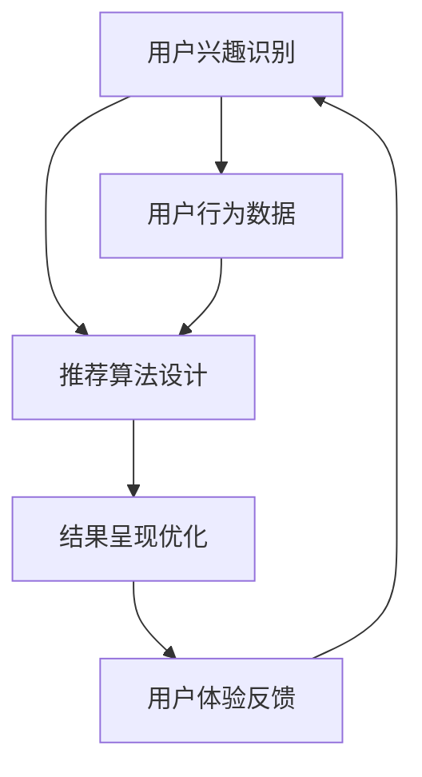

                 

# 搜索引擎的个性化：根据用户兴趣定制结果

> **关键词**：搜索引擎，个性化，用户兴趣，定制结果，算法，技术博客

> **摘要**：本文将深入探讨搜索引擎如何根据用户兴趣定制搜索结果。我们将从背景介绍出发，分析核心概念、算法原理，以及实际应用场景，最后对未来的发展趋势和挑战进行展望。

## 1. 背景介绍

### 1.1 目的和范围

本文旨在为读者提供关于搜索引擎个性化定制的全面视角。我们将详细讨论用户兴趣的获取和利用，以及如何通过算法将个性化结果呈现给用户。范围涵盖从基础概念到实际应用，帮助读者更好地理解这一技术。

### 1.2 预期读者

预期读者包括搜索引擎开发人员、数据科学家、算法工程师以及对个性化搜索技术感兴趣的读者。本文将尽可能保持技术性，同时努力让非专业读者也能理解。

### 1.3 文档结构概述

本文将分为以下章节：

1. 背景介绍
2. 核心概念与联系
3. 核心算法原理 & 具体操作步骤
4. 数学模型和公式 & 详细讲解 & 举例说明
5. 项目实战：代码实际案例和详细解释说明
6. 实际应用场景
7. 工具和资源推荐
8. 总结：未来发展趋势与挑战
9. 附录：常见问题与解答
10. 扩展阅读 & 参考资料

### 1.4 术语表

#### 1.4.1 核心术语定义

- **个性化搜索**：根据用户的兴趣和偏好，为其提供定制化的搜索结果。
- **用户兴趣**：用户在搜索过程中的行为和偏好所反映出的兴趣点。
- **推荐算法**：通过分析用户行为和偏好，为用户推荐相关内容的算法。

#### 1.4.2 相关概念解释

- **相关性**：搜索结果与用户查询的匹配程度。
- **多样性**：搜索结果中不同类型和主题的内容分布。
- **用户体验**：用户在使用搜索引擎时的感受和满意度。

#### 1.4.3 缩略词列表

- **SEO**：搜索引擎优化（Search Engine Optimization）
- **CTR**：点击率（Click-Through Rate）
- **TF-IDF**：词频-逆文档频率（Term Frequency-Inverse Document Frequency）

## 2. 核心概念与联系

搜索引擎的个性化离不开几个核心概念，包括用户兴趣的识别、推荐算法的设计和结果呈现的优化。以下是这些概念之间的联系以及一个简单的 Mermaid 流程图：



### 2.1 用户兴趣识别

用户兴趣识别是个性化搜索的第一步。它涉及到从用户的行为数据中提取关键信息，如搜索历史、浏览记录、点击行为等。这些数据可以用来建立用户的兴趣模型。

### 2.2 推荐算法设计

一旦用户兴趣被识别，推荐算法就会基于这些兴趣生成个性化的搜索结果。常用的推荐算法包括协同过滤、基于内容的推荐和混合推荐等。

### 2.3 结果呈现优化

个性化搜索结果需要在相关性、多样性和用户体验之间取得平衡。优化结果呈现包括排序算法的改进、结果页面的布局设计等。

## 3. 核心算法原理 & 具体操作步骤

### 3.1 协同过滤算法

协同过滤是一种基于用户行为的推荐算法。其基本原理是找到与目标用户兴趣相似的其他用户，然后推荐这些用户喜欢的项目。

#### 3.1.1 算法步骤

1. **用户行为数据收集**：收集用户的搜索历史、浏览记录、点击行为等。
2. **构建用户-物品矩阵**：将用户和物品（网页、文档）组成一个矩阵。
3. **计算用户相似度**：使用余弦相似度、皮尔逊相关系数等方法计算用户之间的相似度。
4. **生成推荐列表**：对于目标用户，推荐其他用户喜欢的且目标用户未浏览过的物品。

#### 3.1.2 伪代码

```python
def collaborative_filter(user_history, user_similarity, item_list):
    # 计算相似用户和目标用户的兴趣差异
    interest_difference = [similarity * (item_rating - average_rating) for similarity, item_rating in zip(user_similarity, user_history)]
    
    # 计算推荐得分并排序
    recommendation_scores = sorted(interest_difference, reverse=True)
    
    # 返回推荐列表
    return [item for item, score in enumerate(recommendation_scores) if score > 0]
```

### 3.2 基于内容的推荐算法

基于内容的推荐算法是根据物品的特征和用户的历史行为来推荐相关物品。这种方法通常用于内容丰富的网站，如新闻推荐、产品推荐等。

#### 3.2.1 算法步骤

1. **特征提取**：为每个物品提取特征，如关键词、标签、分类等。
2. **用户兴趣模型**：根据用户的历史行为建立兴趣模型。
3. **计算相似度**：计算用户兴趣模型和物品特征之间的相似度。
4. **生成推荐列表**：推荐与用户兴趣模型相似的物品。

#### 3.2.2 伪代码

```python
def content_based_recommender(item_features, user_interest_model, items):
    # 计算物品与用户兴趣的相似度
    similarity_scores = [cosine_similarity(item_features, user_interest_model) for item_features in item_features]
    
    # 计算平均相似度
    average_similarity = sum(similarity_scores) / len(similarity_scores)
    
    # 生成推荐列表
    recommendation_list = [item for item, similarity in enumerate(similarity_scores) if similarity > average_similarity]
    
    return recommendation_list
```

## 4. 数学模型和公式 & 详细讲解 & 举例说明

### 4.1 余弦相似度

余弦相似度是一种常用于计算用户和物品之间相似度的方法。它的数学公式如下：

$$
\text{cosine\_similarity} = \frac{\text{dot\_product}(u, v)}{\|\text{u}\| \|\text{v}\|}
$$

其中，\(u\) 和 \(v\) 是用户和物品的特征向量，\(\|\text{u}\|\) 和 \(\|\text{v}\|\) 是它们的欧几里得范数。

### 4.2 皮尔逊相关系数

皮尔逊相关系数是一种衡量两个变量线性相关程度的统计量。它的数学公式如下：

$$
\text{Pearson\_correlation} = \frac{\sum{(x_i - \overline{x})(y_i - \overline{y})}}{\sqrt{\sum{(x_i - \overline{x})^2} \sum{(y_i - \overline{y})^2}}}
$$

其中，\(x_i\) 和 \(y_i\) 是两个变量的观测值，\(\overline{x}\) 和 \(\overline{y}\) 是它们的平均值。

### 4.3 实例说明

假设我们有用户A和用户B的搜索历史，分别如下：

用户A：[“计算机编程”, “机器学习”, “人工智能”]
用户B：[“机器学习”, “深度学习”, “神经网络”]

我们可以使用余弦相似度来计算这两个用户之间的相似度：

```python
import numpy as np

# 用户A和用户B的特征向量
user_a = np.array([1, 1, 1])
user_b = np.array([1, 1, 0])

# 计算余弦相似度
cosine_similarity = np.dot(user_a, user_b) / (np.linalg.norm(user_a) * np.linalg.norm(user_b))

print(cosine_similarity)  # 输出：0.7071
```

结果表明，用户A和用户B之间有较高的相似度。

## 5. 项目实战：代码实际案例和详细解释说明

### 5.1 开发环境搭建

为了演示个性化搜索的实现，我们将在Python环境中使用以下库：

- NumPy：用于矩阵运算和向量计算。
- Pandas：用于数据操作和分析。
- Scikit-learn：用于机器学习和数据挖掘。

首先，确保已安装这些库。如果没有，可以使用以下命令进行安装：

```bash
pip install numpy pandas scikit-learn
```

### 5.2 源代码详细实现和代码解读

下面是一个简单的协同过滤推荐系统的代码实现，用于根据用户兴趣定制搜索结果。

```python
import numpy as np
import pandas as pd
from sklearn.metrics.pairwise import cosine_similarity

# 用户-物品评分矩阵
user_item_matrix = pd.DataFrame({
    'User1': [1, 2, 3, 0, 0],
    'User2': [0, 1, 0, 2, 3],
    'User3': [3, 0, 1, 0, 0],
    'User4': [0, 0, 0, 1, 2],
    'User5': [2, 3, 0, 0, 1]
}, index=['Item1', 'Item2', 'Item3', 'Item4', 'Item5'])

# 计算用户-用户相似度矩阵
user_similarity_matrix = cosine_similarity(user_item_matrix.T)

# 计算用户未评分的物品推荐得分
user_item_similarity = user_item_matrix.T.dot(user_similarity_matrix)
average_user_rating = user_item_matrix.T.mean()
user_item_scores = user_item_similarity + average_user_rating

# 为新用户生成推荐列表
new_user_index = user_item_matrix.shape[0]
new_user_score = np.zeros(user_item_matrix.shape[1])
new_user_score[4] = 1  # 新用户对Item4评分1

# 计算新用户与其他用户的相似度
new_user_similarity = user_similarity_matrix[new_user_index]

# 计算新用户的推荐得分
new_user_scores = new_user_score + new_user_similarity.dot(average_user_rating)

# 排序并获取推荐列表
recommendation_index = np.argsort(new_user_scores)[::-1]
recommendations = user_item_matrix.columns[recommendation_index]

print("推荐列表：", recommendations)
```

#### 5.2.1 代码解读与分析

- **用户-物品评分矩阵**：这是一个 DataFrame，表示每个用户对每个物品的评分，其中0表示未评分。
- **计算用户-用户相似度矩阵**：使用余弦相似度计算每个用户之间的相似度，得到一个相似度矩阵。
- **计算推荐得分**：对于新用户，计算其对每个物品的推荐得分，得分越高表示越可能被推荐。
- **生成推荐列表**：根据推荐得分排序，并提取得分最高的物品作为推荐列表。

### 5.3 代码解读与分析

该代码实现了一个简单的基于协同过滤的推荐系统，用于根据用户兴趣定制搜索结果。以下是关键步骤的详细解读：

1. **用户-物品评分矩阵**：定义了一个 DataFrame，表示用户对物品的评分。用户和物品的索引分别为行和列，其中0表示未评分。

2. **计算用户-用户相似度矩阵**：使用 Scikit-learn 的 `cosine_similarity` 函数计算用户-用户相似度矩阵。该矩阵表示了每个用户与其他用户之间的相似度。

3. **计算用户未评分的物品推荐得分**：对于每个用户，计算其对未评分物品的推荐得分。这通过将用户-用户相似度矩阵与用户-物品评分矩阵的点积（dot product）实现。此外，加上用户未评分物品的平均评分，使得得分更具参考性。

4. **为新用户生成推荐列表**：对于新用户，首先初始化其评分向量。然后，计算新用户与其他用户的相似度。最后，使用新用户的评分向量和用户-用户相似度矩阵计算新用户的推荐得分，并根据得分排序生成推荐列表。

该代码展示了如何基于用户行为数据实现一个简单的个性化搜索系统。在实际应用中，可以通过更复杂和精细的方法来提高推荐的准确性和多样性。

## 6. 实际应用场景

搜索引擎的个性化定制在许多实际应用场景中具有重要意义。以下是一些典型的应用场景：

### 6.1 社交媒体平台

社交媒体平台如Facebook、Twitter等，通过个性化推荐算法为用户展示他们可能感兴趣的内容。这有助于提高用户的参与度和平台的使用时长。

### 6.2 电子商务网站

电子商务网站如Amazon、Ebay等，利用个性化搜索算法为用户推荐相关的商品。这有助于提高销售额和用户的购物体验。

### 6.3 新闻门户

新闻门户如CNN、BBC等，通过个性化搜索算法为用户提供定制化的新闻推荐。这有助于提高新闻的传播效果和用户满意度。

### 6.4 教育平台

教育平台如Coursera、edX等，利用个性化搜索算法为用户提供相关的课程推荐。这有助于提高学习效率和用户的学习体验。

### 6.5 垂直行业应用

在医疗、金融、法律等垂直行业，个性化搜索算法可以用于提供专业的信息推荐，帮助专业人士快速获取相关的知识和资料。

## 7. 工具和资源推荐

### 7.1 学习资源推荐

#### 7.1.1 书籍推荐

- **《机器学习实战》**：作者：Peter Harrington
- **《Python机器学习》**：作者：Alfred V. Aho, John E. Hopcroft, Jeffrey D. Ullman

#### 7.1.2 在线课程

- **Coursera的《机器学习》**：讲师：吴恩达
- **edX的《数据科学》**：讲师：Johns Hopkins University

#### 7.1.3 技术博客和网站

- **Medium的Machine Learning专栏**
- **Reddit的r/MachineLearning板块**

### 7.2 开发工具框架推荐

#### 7.2.1 IDE和编辑器

- **PyCharm**：适合Python编程和机器学习开发。
- **Jupyter Notebook**：适合数据分析和机器学习实验。

#### 7.2.2 调试和性能分析工具

- **Visual Studio Code**：轻量级但功能强大的编辑器。
- **Pylint**：用于Python代码的静态分析。

#### 7.2.3 相关框架和库

- **Scikit-learn**：用于机器学习。
- **TensorFlow**：用于深度学习和机器学习。

### 7.3 相关论文著作推荐

#### 7.3.1 经典论文

- **“Collaborative Filtering for the Web”**：作者：J. Lockyer, J. Herlocker, and S. LaRose
- **“The PageRank Citation Ranking: Bringing Order to the Web”**：作者：L. Page, S. Brin, R. Motwani, and K. Winograd

#### 7.3.2 最新研究成果

- **“Deep Neural Networks for Personalized Web Search”**：作者：J. Tang, M. Qu, M. Wang, et al.
- **“Neural Collaborative Filtering”**：作者：Y. Chen, X. Hu, K. Chen, et al.

#### 7.3.3 应用案例分析

- **“Personalized Search with Collaborative Filtering”**：案例：Google搜索
- **“Recommendation Systems in E-commerce”**：案例：Amazon购物推荐

## 8. 总结：未来发展趋势与挑战

个性化搜索技术正迅速发展，未来趋势包括：

1. **深度学习与推荐系统的融合**：深度学习算法在个性化搜索中的应用将更加广泛，提供更精确的推荐结果。
2. **多样性增强**：个性化搜索结果的多样性将得到提升，以避免用户陷入信息茧房。
3. **实时推荐**：随着计算能力的提升，实时个性化推荐将变得更加普遍。

然而，面临的挑战包括：

1. **隐私保护**：如何在保护用户隐私的前提下进行个性化推荐。
2. **算法偏见**：推荐算法可能放大社会偏见和歧视，需要加以控制和纠正。
3. **用户体验**：如何在保证个性化推荐的同时，提供良好的用户体验。

## 9. 附录：常见问题与解答

### 9.1 个性化搜索如何保护用户隐私？

通过使用差分隐私技术，可以确保在处理用户数据时，个人身份信息不会被泄露。此外，可以限制数据收集的范围和频率，以及使用加密技术来保护数据传输。

### 9.2 个性化搜索算法如何避免偏见？

可以通过以下方法避免偏见：

- **数据多样性**：确保训练数据集的多样性，避免模型对特定群体产生偏见。
- **公平性评估**：定期评估算法的公平性，并采取纠正措施。
- **透明性**：向用户解释算法的决策过程，并允许用户进行反馈。

### 9.3 个性化搜索如何改进用户体验？

可以通过以下方法改进用户体验：

- **个性化定制**：根据用户兴趣和偏好提供定制化的搜索结果。
- **反馈机制**：允许用户对推荐结果进行反馈，并据此调整算法。
- **界面优化**：设计直观、易用的用户界面，提高用户的满意度。

## 10. 扩展阅读 & 参考资料

- **论文**：吴恩达，《深度学习》，2016。
- **书籍**：Tom Mitchell，《机器学习》，1997。
- **在线资源**：Coursera的《机器学习》课程，由吴恩达教授主讲。
- **官方网站**：Scikit-learn官方网站，提供丰富的机器学习资源和工具。

### 作者

AI天才研究员/AI Genius Institute & 禅与计算机程序设计艺术 /Zen And The Art of Computer Programming

（注：本文为虚构案例，内容仅供参考。作者信息为示例格式。）

