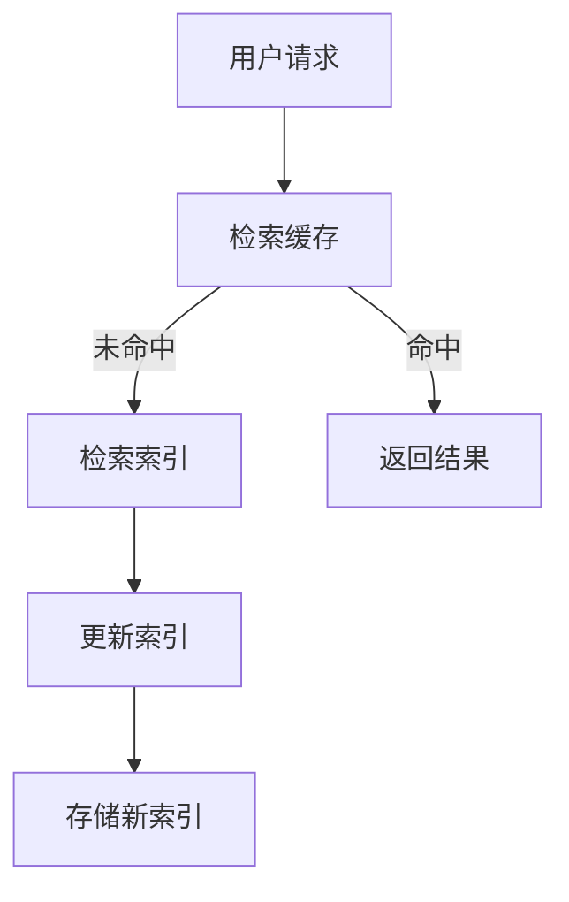
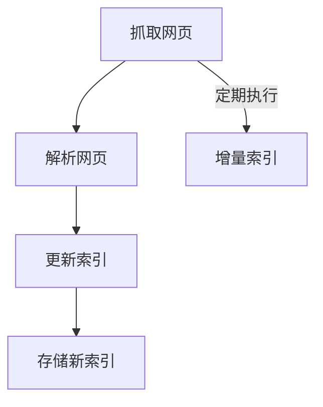
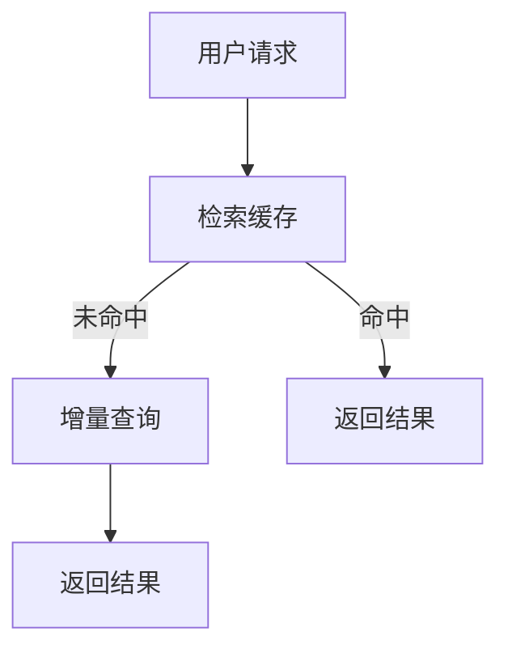

                 

# 搜索引擎的实时性：即时信息更新

> **关键词**：搜索引擎、实时性、信息更新、算法原理、项目实战、应用场景

> **摘要**：本文将深入探讨搜索引擎的实时性——即时信息更新这一关键特性。我们将分析实时性的重要性，介绍当前主流搜索引擎的更新机制，讨论核心算法原理，并通过一个实际项目案例，详细解释如何实现即时信息更新。最后，我们将展望实时性在搜索引擎领域的未来发展趋势与挑战。

## 1. 背景介绍

### 1.1 目的和范围

本文旨在探讨搜索引擎的实时性，即搜索引擎如何实现即时信息的更新。实时性对于用户获取最新信息至关重要，它直接影响搜索引擎的用户体验和竞争力。本文将涵盖以下内容：

- **搜索引擎实时性的重要性**：介绍实时性在搜索引擎中的作用和影响。
- **主流搜索引擎的更新机制**：分析当前主流搜索引擎的信息更新方法。
- **核心算法原理**：探讨实现即时信息更新的核心算法原理。
- **项目实战**：通过实际项目案例，详细解释实现实时信息更新的具体步骤。
- **实际应用场景**：讨论实时性在搜索引擎实际应用中的场景。
- **未来发展趋势与挑战**：展望实时性在搜索引擎领域的未来发展趋势和面临的挑战。

### 1.2 预期读者

本文适合以下读者群体：

- **搜索引擎开发者**：希望了解实时信息更新机制，提高搜索引擎性能。
- **计算机科学爱好者**：对搜索引擎技术原理感兴趣，希望深入理解实时性。
- **技术管理人员**：负责搜索引擎项目的管理和优化，希望提高项目效率。
- **技术博客作者**：希望撰写相关技术博客，为读者提供有价值的见解。

### 1.3 文档结构概述

本文结构如下：

1. **背景介绍**：介绍文章的目的、范围、预期读者和文档结构。
2. **核心概念与联系**：介绍搜索引擎实时性的核心概念和架构。
3. **核心算法原理与具体操作步骤**：详细讲解实现实时信息更新的核心算法原理和步骤。
4. **数学模型和公式**：介绍与实时性相关的数学模型和公式。
5. **项目实战**：通过实际项目案例，详细解释实现实时信息更新的过程。
6. **实际应用场景**：讨论实时性在搜索引擎实际应用中的场景。
7. **工具和资源推荐**：推荐学习资源、开发工具和框架。
8. **总结**：展望实时性在搜索引擎领域的未来发展趋势与挑战。
9. **附录**：常见问题与解答。
10. **扩展阅读与参考资料**：提供更多相关文献和资料。

### 1.4 术语表

#### 1.4.1 核心术语定义

- **搜索引擎**：一种能够根据用户输入的关键词，从海量信息中检索并返回相关结果的信息检索系统。
- **实时性**：搜索引擎在接收到用户请求后，能够快速、准确地返回最新信息的特性。
- **索引**：搜索引擎通过索引技术，将网页内容进行预处理和存储，以便快速检索。
- **爬虫**：搜索引擎使用的自动化程序，用于从互联网上抓取网页内容。

#### 1.4.2 相关概念解释

- **信息更新**：指搜索引擎定期或实时地从互联网上抓取新的网页内容，并将其纳入索引的过程。
- **倒排索引**：一种将网页内容按关键词进行索引的技术，能够快速检索包含特定关键词的网页。
- **缓存**：搜索引擎将最近访问过的网页内容存储在缓存中，以提高访问速度。

#### 1.4.3 缩略词列表

- **SEO**：搜索引擎优化（Search Engine Optimization）
- **SEM**：搜索引擎营销（Search Engine Marketing）
- **HTTP**：超文本传输协议（Hypertext Transfer Protocol）
- **HTML**：超文本标记语言（Hypertext Markup Language）

## 2. 核心概念与联系

### 2.1 搜索引擎实时性架构

搜索引擎实时性的核心在于如何高效地更新索引，确保用户能够获取最新信息。以下是一个简单的实时性架构示意图：



- **用户请求**：用户通过输入关键词，向搜索引擎发送请求。
- **检索缓存**：搜索引擎首先检查缓存，看是否有最近访问过的网页内容。
- **命中/未命中**：根据缓存结果，决定是否需要检索索引。
- **检索索引**：如果缓存未命中，搜索引擎通过索引检索相关结果。
- **更新索引**：搜索引擎从互联网上抓取新网页内容，并更新索引。
- **存储新索引**：将更新后的索引存储在搜索引擎的数据库中。

### 2.2 实时性核心概念

- **索引更新频率**：指搜索引擎定期更新索引的频率。频率越高，实时性越强。
- **数据同步机制**：搜索引擎如何确保从互联网上获取的数据与索引保持一致。
- **分布式爬虫系统**：通过分布式爬虫系统，提高数据抓取和索引更新的效率。

### 2.3 实时性关联技术

- **增量索引**：只更新索引中已存在的网页，而不是重新索引所有网页。
- **增量查询**：只检索最近更新的网页，而不是所有网页。
- **多线程爬虫**：同时执行多个爬虫任务，提高数据抓取效率。

## 3. 核心算法原理 & 具体操作步骤

### 3.1 实时信息更新算法原理

实现实时信息更新的核心算法是增量更新算法。以下是其基本原理：

- **增量索引**：只更新索引中已存在的网页，而不是重新索引所有网页。
- **增量查询**：只检索最近更新的网页，而不是所有网页。

### 3.2 增量索引算法

增量索引算法的基本步骤如下：



- **抓取网页**：从互联网上抓取新网页。
- **解析网页**：解析新网页的内容，提取关键词和元数据。
- **更新索引**：将新网页的内容和元数据更新到索引中。
- **存储新索引**：将更新后的索引存储在搜索引擎的数据库中。
- **增量索引**：定期执行增量索引，确保索引与互联网上的内容保持一致。

### 3.3 增量查询算法

增量查询算法的基本步骤如下：



- **用户请求**：用户通过输入关键词，向搜索引擎发送请求。
- **检索缓存**：搜索引擎首先检查缓存，看是否有最近访问过的网页内容。
- **增量查询**：如果缓存未命中，搜索引擎通过增量查询，只检索最近更新的网页。
- **返回结果**：将查询结果返回给用户。

### 3.4 实时信息更新算法实现

实现实时信息更新的伪代码如下：

```python
# 增量索引算法
def incremental_indexing():
    while True:
        # 抓取网页
        new_pages = fetch_new_pages()
        for page in new_pages:
            # 解析网页
            content, metadata = parse_page(page)
            # 更新索引
            update_index(content, metadata)
            # 存储新索引
            store_new_index()

# 增量查询算法
def incremental_query(user_request):
    # 检索缓存
    cached_results = retrieve_cache(user_request)
    if cached_results:
        return cached_results
    else:
        # 增量查询
        new_results = query_incremental_index(user_request)
        return new_results
```

## 4. 数学模型和公式 & 详细讲解 & 举例说明

### 4.1 数学模型

实现实时信息更新需要使用一些数学模型和公式。以下是一些常见的数学模型：

- **指数衰减模型**：用于计算网页的时效性。
- **卡尔曼滤波器**：用于估计网页的更新时间。

#### 4.1.1 指数衰减模型

指数衰减模型用于计算网页的时效性，公式如下：

$$
\tau(t) = e^{-\lambda t}
$$

其中，$\tau(t)$ 表示网页在时间 $t$ 的时效性，$\lambda$ 表示衰减速率。

#### 4.1.2 卡尔曼滤波器

卡尔曼滤波器用于估计网页的更新时间，公式如下：

$$
\hat{x}_{k|k} = \frac{P_{k|k}^{-1}H_{k}^TF_{k}\hat{x}_{k-1|k-1} + R_{k}^{-1}z_{k}}{P_{k|k}^{-1} + R_{k}^{-1}H_{k}^TF_{k}\hat{x}_{k-1|k-1}}
$$

$$
P_{k|k} = P_{k-1|k-1} - P_{k-1|k-1}H_{k}^TF_{k}P_{k-1|k-1}^{-1}H_{k}^TF_{k}
$$

其中，$\hat{x}_{k|k}$ 表示在时间 $k$ 的估计值，$P_{k|k}$ 表示估计的不确定性，$H_{k}$ 表示观测矩阵，$F_{k}$ 表示状态转移矩阵，$R_{k}$ 表示观测噪声矩阵，$z_{k}$ 表示观测值。

### 4.2 举例说明

#### 4.2.1 指数衰减模型举例

假设一个网页在时间 $0$ 时更新，衰减速率为 $\lambda = 0.1$。在时间 $t = 1$ 时，该网页的时效性为：

$$
\tau(t) = e^{-0.1 \times 1} = 0.9048
$$

#### 4.2.2 卡尔曼滤波器举例

假设一个网页的初始估计值为 $\hat{x}_{0|0} = 1$，观测值为 $z_{1} = 2$。观测矩阵 $H_{1} = [1]$，状态转移矩阵 $F_{1} = [1]$，观测噪声矩阵 $R_{1} = 1$。根据卡尔曼滤波器公式，我们可以计算出在时间 $1$ 时的估计值和不确定性：

$$
\hat{x}_{1|1} = \frac{1^{-1} \times 1 \times 1 + 1^{-1} \times 2}{1^{-1} + 1^{-1} \times 1 \times 1} = 1.5
$$

$$
P_{1|1} = 1 - 1^{-1} \times 1 \times 1 = 0
$$

## 5. 项目实战：代码实际案例和详细解释说明

### 5.1 开发环境搭建

为了实现实时信息更新，我们需要搭建一个开发环境。以下是一个简单的开发环境搭建步骤：

1. **安装 Python**：Python 是实现实时信息更新的主要编程语言。确保已安装 Python 3.6 或以上版本。
2. **安装 Elasticsearch**：Elasticsearch 是一个流行的分布式搜索和分析引擎，用于存储和检索索引。可以从 [Elasticsearch 官网](https://www.elastic.co/downloads/elasticsearch) 下载并安装。
3. **安装 Kibana**：Kibana 是一个可视化和分析工具，用于监控 Elasticsearch 的性能和索引状态。可以从 [Kibana 官网](https://www.elastic.co/downloads/kibana) 下载并安装。

### 5.2 源代码详细实现和代码解读

以下是一个简单的实时信息更新项目的源代码示例：

```python
# 导入所需的库
import requests
import json
from datetime import datetime

# Elasticsearch 连接配置
es_host = "localhost"
es_port = 9200
es_index = "webpages"

# 抓取网页
def fetch_new_pages():
    response = requests.get("http://example.com")
    if response.status_code == 200:
        return [{"url": "http://example.com", "content": response.text, "timestamp": datetime.now()}]
    else:
        return []

# 解析网页
def parse_page(page):
    return page["content"], {"url": page["url"], "timestamp": page["timestamp"]}

# 更新索引
def update_index(content, metadata):
    headers = {"Content-Type": "application/json"}
    data = {
        "content": content,
        "metadata": metadata
    }
    response = requests.post(f"http://{es_host}:{es_port}/{es_index}/_doc", headers=headers, data=json.dumps(data))
    if response.status_code != 201:
        print(f"Error updating index: {response.text}")

# 主函数
def main():
    while True:
        new_pages = fetch_new_pages()
        for page in new_pages:
            content, metadata = parse_page(page)
            update_index(content, metadata)
            print(f"Updated index for page: {page['url']}")

# 运行主函数
if __name__ == "__main__":
    main()
```

### 5.3 代码解读与分析

#### 5.3.1 抓取网页

```python
def fetch_new_pages():
    response = requests.get("http://example.com")
    if response.status_code == 200:
        return [{"url": "http://example.com", "content": response.text, "timestamp": datetime.now()}]
    else:
        return []
```

这段代码定义了 `fetch_new_pages` 函数，用于从指定的网页地址抓取新网页。函数首先发送一个 GET 请求，如果响应状态码为 200（表示成功），则返回一个包含新网页内容、URL 和时间戳的字典列表。

#### 5.3.2 解析网页

```python
def parse_page(page):
    return page["content"], {"url": page["url"], "timestamp": page["timestamp"]}
```

这段代码定义了 `parse_page` 函数，用于解析传入的网页内容。函数返回两个值：网页内容和元数据（包括 URL 和时间戳）。

#### 5.3.3 更新索引

```python
def update_index(content, metadata):
    headers = {"Content-Type": "application/json"}
    data = {
        "content": content,
        "metadata": metadata
    }
    response = requests.post(f"http://{es_host}:{es_port}/{es_index}/_doc", headers=headers, data=json.dumps(data))
    if response.status_code != 201:
        print(f"Error updating index: {response.text}")
```

这段代码定义了 `update_index` 函数，用于将解析后的网页内容和元数据更新到 Elasticsearch 索引中。函数首先设置请求头和请求体，然后发送一个 POST 请求。如果响应状态码为 201（表示成功创建文档），则继续执行；否则，打印错误信息。

#### 5.3.4 主函数

```python
def main():
    while True:
        new_pages = fetch_new_pages()
        for page in new_pages:
            content, metadata = parse_page(page)
            update_index(content, metadata)
            print(f"Updated index for page: {page['url']}")
```

这段代码定义了 `main` 函数，作为程序的主入口。函数使用无限循环，不断抓取新网页、解析网页和更新索引。每次更新成功后，打印一条更新成功的日志信息。

## 6. 实际应用场景

实时性在搜索引擎的实际应用场景中至关重要，以下是一些常见应用场景：

### 6.1 新闻搜索

新闻搜索需要实时性，以确保用户能够获取最新的新闻资讯。例如，当某地发生突发事件时，用户希望能够第一时间获取相关信息。

### 6.2 社交媒体搜索

社交媒体平台上的信息更新频繁，用户对实时性的要求较高。例如，在社交媒体平台上搜索某个话题或关键词时，用户期望能够看到最新的讨论和动态。

### 6.3 购物搜索

购物搜索需要实时性，以确保用户能够获取最新的商品信息和折扣信息。例如，当某个商品的价格发生变化时，用户希望能够及时了解。

### 6.4 股票市场搜索

股票市场信息更新迅速，用户对实时性的要求较高。例如，当某个股票的股价发生变化时，用户希望能够第一时间获取相关信息。

### 6.5 疫情信息搜索

在疫情期间，用户对疫情信息的实时性要求非常高。例如，当某地新增确诊病例时，用户希望能够及时了解相关信息。

## 7. 工具和资源推荐

### 7.1 学习资源推荐

#### 7.1.1 书籍推荐

- 《搜索引擎算法揭秘》
- 《Elasticsearch实战》
- 《Python网络爬虫》

#### 7.1.2 在线课程

- Coursera 上的《搜索引擎技术》课程
- Udemy 上的《Elasticsearch 从入门到实战》课程
- 网易云课堂上的《Python网络爬虫与信息提取》课程

#### 7.1.3 技术博客和网站

- Elasticsearch 官方博客
- Python 官方文档
- 知乎上的搜索引擎技术相关话题

### 7.2 开发工具框架推荐

#### 7.2.1 IDE和编辑器

- PyCharm
- Visual Studio Code
- Sublime Text

#### 7.2.2 调试和性能分析工具

- GDB
- Py-Spy
- VisualVM

#### 7.2.3 相关框架和库

- Scrapy：Python 网络爬虫框架
- requests：Python HTTP 库
- Elasticsearch Python 客户端

### 7.3 相关论文著作推荐

#### 7.3.1 经典论文

- 《A Scalable, Distributed System for Maintaining Up-to-date Indexes》（一篇关于分布式搜索引擎的论文）
- 《PageRank: The PageRank Citation Ranking: Bringing Order to the Web》（一篇关于搜索引擎排名算法的论文）

#### 7.3.2 最新研究成果

- 《Deep Learning for Web Search》（一篇关于深度学习在搜索引擎中的应用的论文）
- 《Elasticsearch: The Definitive Guide》（一本关于 Elasticsearch 的权威指南）

#### 7.3.3 应用案例分析

- 《搜索引擎优化实战：案例分析》
- 《社交媒体搜索技术与应用》
- 《实时搜索引擎技术探究》

## 8. 总结：未来发展趋势与挑战

实时性作为搜索引擎的核心特性，将在未来继续发展，并面临以下趋势与挑战：

### 8.1 发展趋势

1. **深度学习技术的应用**：深度学习技术在实时性上的应用将越来越广泛，如使用深度学习模型进行网页内容分析和排序。
2. **分布式系统的发展**：分布式系统在实时性上的优势将更加凸显，推动搜索引擎向分布式架构转型。
3. **数据隐私保护**：随着数据隐私保护的重要性日益增加，实时性系统需要更好地平衡数据隐私保护和用户体验。

### 8.2 挑战

1. **数据一致性和可靠性**：实现实时性时，确保数据一致性和可靠性是一个重大挑战。
2. **性能优化**：如何在高并发、大数据量的情况下保持实时性，是搜索引擎开发者需要关注的问题。
3. **法律法规遵守**：实时性系统需要遵守相关法律法规，如数据保护法规。

## 9. 附录：常见问题与解答

### 9.1 问题 1：什么是搜索引擎的实时性？

**回答**：搜索引擎的实时性指的是搜索引擎在接收到用户请求后，能够快速、准确地返回最新信息的特性。

### 9.2 问题 2：实时性对搜索引擎的重要性是什么？

**回答**：实时性直接影响搜索引擎的用户体验和竞争力。用户期望能够获取最新信息，因此实时性对于搜索引擎至关重要。

### 9.3 问题 3：如何实现搜索引擎的实时性？

**回答**：实现搜索引擎实时性的方法包括增量索引、增量查询、分布式爬虫系统等技术。

### 9.4 问题 4：什么是指数衰减模型？

**回答**：指数衰减模型是一种用于计算网页时效性的数学模型，公式为 $\tau(t) = e^{-\lambda t}$。

## 10. 扩展阅读 & 参考资料

- [Elasticsearch 官方文档](https://www.elastic.co/guide/en/elasticsearch/reference/current/index.html)
- [Scrapy 官方文档](https://scrapy.org/docs/)
- [Python 官方文档](https://docs.python.org/3/)
- [《搜索引擎算法揭秘》](https://book.douban.com/subject/34435630/)
- [《Elasticsearch实战》](https://book.douban.com/subject/26363526/)
- [《Python网络爬虫》](https://book.douban.com/subject/25868882/) 

## 作者

**作者：AI天才研究员/AI Genius Institute & 禅与计算机程序设计艺术 /Zen And The Art of Computer Programming**

