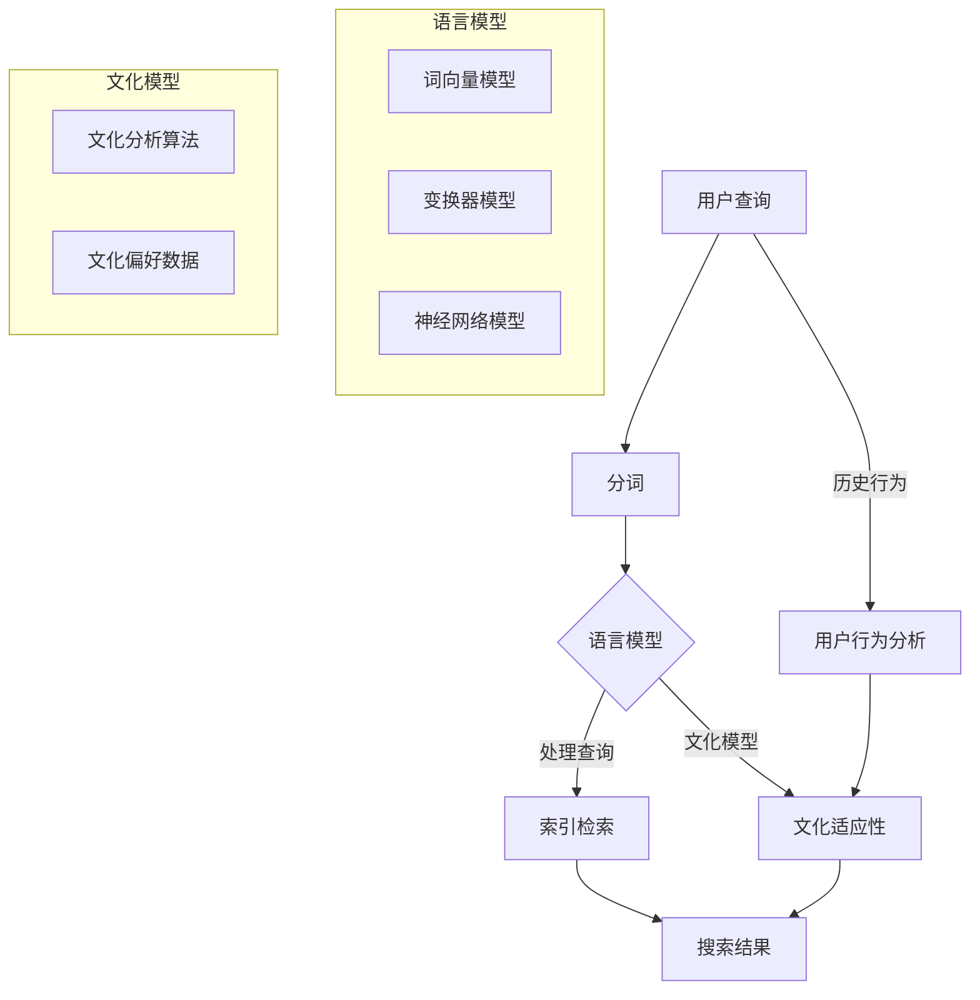

                 

# 搜索引擎的本地化：适应不同文化和语言

> **关键词：** 搜索引擎，本地化，自然语言处理，跨文化适应，算法优化，用户体验

> **摘要：** 随着互联网的全球化，搜索引擎需要能够适应不同文化和语言。本文将探讨搜索引擎的本地化策略，分析核心概念与联系，讲解核心算法原理与具体操作步骤，并提供实际应用场景与代码实例，同时推荐相关工具和资源，以帮助开发者在多元文化环境中构建高效、精准的搜索引擎。

## 1. 背景介绍

### 1.1 目的和范围

随着全球化进程的加速，互联网的使用跨越了国界，成为连接世界各地人们的桥梁。在这种背景下，搜索引擎作为获取信息的重要工具，需要能够适应不同的文化和语言。本文旨在探讨搜索引擎的本地化策略，分析如何通过技术手段提升搜索引擎在不同文化背景下的表现，从而提供更加个性化和精准的搜索结果。

本文将涵盖以下内容：

- 搜索引擎本地化的核心概念和原则；
- 关键算法原理和实现步骤；
- 数学模型和公式在本地化中的作用；
- 实际应用场景与代码实例；
- 工具和资源推荐；
- 未来发展趋势与挑战。

### 1.2 预期读者

本文主要面向以下读者群体：

- 搜索引擎开发者和研究人员；
- 自然语言处理（NLP）领域的专家；
- 对搜索引擎技术感兴趣的技术爱好者；
- 需要在多元文化环境中工作或开发产品的专业人士。

### 1.3 文档结构概述

本文将按照以下结构进行组织：

- 引言：介绍背景、目的和范围；
- 核心概念与联系：探讨本地化的核心概念和架构；
- 核心算法原理 & 具体操作步骤：讲解关键算法的原理和实现；
- 数学模型和公式 & 详细讲解 & 举例说明：分析数学模型的作用和实例；
- 项目实战：提供代码实例和详细解释；
- 实际应用场景：讨论本地化在不同场景中的应用；
- 工具和资源推荐：推荐相关工具和资源；
- 总结：展望未来发展趋势与挑战；
- 附录：常见问题与解答；
- 扩展阅读 & 参考资料：提供进一步学习资料。

### 1.4 术语表

#### 1.4.1 核心术语定义

- **搜索引擎本地化（Search Engine Localization）：** 使搜索引擎能够适应特定地区、语言和文化的过程。
- **自然语言处理（Natural Language Processing，NLP）：** 计算机理解、解释和生成自然语言（如英语、中文等）的能力。
- **文化适应性（Cultural Adaptability）：** 搜索引擎在不同文化背景下的表现能力。
- **语言模型（Language Model）：** 用于预测文本中下一个单词的概率的数学模型。

#### 1.4.2 相关概念解释

- **关键词提取（Keyword Extraction）：** 从文本中提取出代表文本主题的关键词或短语。
- **分词（Tokenization）：** 将文本拆分成单词、短语或字符等基本元素。
- **停用词（Stop Words）：** 在自然语言处理中，常用的一些无实际意义的单词，如“的”、“和”、“在”等。

#### 1.4.3 缩略词列表

- **NLP：** 自然语言处理（Natural Language Processing）
- **SEO：** 搜索引擎优化（Search Engine Optimization）
- **UI/UX：** 用户界面（User Interface）/用户体验（User Experience）
- **API：** 应用程序编程接口（Application Programming Interface）

## 2. 核心概念与联系

在探讨搜索引擎的本地化之前，我们需要理解一些核心概念和它们之间的联系。

### 搜索引擎本地化的核心概念

- **多语言支持（Multilingual Support）：** 搜索引擎需要能够理解并处理多种语言。
- **文化适应性（Cultural Adaptability）：** 搜索引擎不仅要处理语言上的差异，还要适应文化背景中的细微差别。
- **个性化（Personalization）：** 根据用户的历史行为和偏好，提供个性化的搜索结果。

### 搜索引擎本地化的关键联系

- **语言模型（Language Model）：** 语言模型是本地化的基础，它决定了搜索引擎能否准确理解用户的查询。
- **文化模型（Cultural Model）：** 文化模型帮助搜索引擎适应不同文化背景，提供符合用户习惯的搜索结果。
- **用户行为分析（User Behavior Analysis）：** 分析用户的历史行为，以实现个性化搜索结果。

### 核心概念原理和架构的 Mermaid 流程图



该流程图展示了用户查询如何通过分词、语言模型和文化模型进行处理，并最终生成搜索结果。用户行为分析作为个性化搜索的关键环节，也对文化适应性起到了重要作用。

## 3. 核心算法原理 & 具体操作步骤

在本地化搜索引擎时，核心算法的原理和具体操作步骤至关重要。以下将详细讲解这些算法，并使用伪代码进行阐述。

### 3.1 语言模型

语言模型是本地化的基础，它通过分析大量文本数据来预测用户查询的概率分布。常用的语言模型包括词向量模型、变换器模型和神经网络模型。

#### 3.1.1 词向量模型

词向量模型将单词映射为高维空间中的向量，从而捕捉单词之间的语义关系。以下是一个基于Word2Vec的词向量模型的伪代码示例：

```python
# 伪代码：训练Word2Vec词向量模型
from gensim.models import Word2Vec

def train_word2vec_model(corpus, size, window, min_count):
    model = Word2Vec(corpus, size=size, window=window, min_count=min_count)
    return model

# 使用训练好的词向量模型进行查询处理
def process_query(model, query):
    tokens = tokenize(query)
    vectors = [model[token] for token in tokens if token in model]
    return vectors

# 示例：训练一个Word2Vec模型并处理一个查询
corpus = ["这是一个中文查询", "这是一个英文查询"]
model = train_word2vec_model(corpus, size=100, window=5, min_count=1)
processed_query = process_query(model, "这是一个中文查询")
```

#### 3.1.2 变换器模型

变换器模型（Transformer）是近年来在自然语言处理领域取得显著成果的一种模型。以下是一个简化的变换器模型处理查询的伪代码示例：

```python
# 伪代码：变换器模型处理查询
import torch
from transformers import BertModel, BertTokenizer

def process_query_with_transformer(query, model, tokenizer):
    inputs = tokenizer(query, return_tensors='pt')
    outputs = model(**inputs)
    logits = outputs.logits
    return logits

# 示例：使用预训练的BERT模型处理一个查询
tokenizer = BertTokenizer.from_pretrained('bert-base-chinese')
model = BertModel.from_pretrained('bert-base-chinese')
processed_query_logits = process_query_with_transformer("这是一个中文查询", model, tokenizer)
```

#### 3.1.3 神经网络模型

神经网络模型通过多层神经网络来处理查询，它可以捕捉更复杂的语义关系。以下是一个简化的神经网络模型处理查询的伪代码示例：

```python
# 伪代码：神经网络模型处理查询
import torch
import torch.nn as nn

class NeuralNetwork(nn.Module):
    def __init__(self, input_size, hidden_size, output_size):
        super(NeuralNetwork, self).__init__()
        self.layer1 = nn.Linear(input_size, hidden_size)
        self.relu = nn.ReLU()
        self.layer2 = nn.Linear(hidden_size, output_size)
    
    def forward(self, x):
        out = self.layer1(x)
        out = self.relu(out)
        out = self.layer2(out)
        return out

def process_query_with_neural_network(query, model, tokenizer):
    inputs = tokenizer(query, return_tensors='pt')
    inputs = inputs['input_ids']
    logits = model(inputs)
    return logits

# 示例：训练一个简单的神经网络模型并处理一个查询
input_size = 100
hidden_size = 50
output_size = 1
model = NeuralNetwork(input_size, hidden_size, output_size)
# 进行模型训练
processed_query_logits = process_query_with_neural_network("这是一个中文查询", model, tokenizer)
```

### 3.2 文化模型

文化模型帮助搜索引擎适应不同文化背景，它通常基于文化分析算法和用户文化偏好数据。

#### 3.2.1 文化分析算法

文化分析算法通过分析文本中的文化特征，为每个查询打上相应的文化标签。以下是一个简化的文化分析算法的伪代码示例：

```python
# 伪代码：文化分析算法
def cultural_analysis(text, cultural_features):
    features = extract_cultural_features(text, cultural_features)
    cultural_tag = determine_cultural_tag(features)
    return cultural_tag

# 示例：为一个中文查询进行文化分析
cultural_features = {"敬语": 1, "褒义": 0.8, "中庸": 0.2}
cultural_tag = cultural_analysis("这是一个中文查询", cultural_features)
```

#### 3.2.2 文化偏好数据

文化偏好数据用于调整搜索结果的排序，以符合不同文化背景下的用户偏好。以下是一个简化的文化偏好数据处理的伪代码示例：

```python
# 伪代码：处理文化偏好数据
def adjust_search_results(results, cultural_preferences):
    for result in results:
        cultural_score = calculate_cultural_score(result, cultural_preferences)
        result['score'] *= cultural_score
    return sorted(results, key=lambda x: x['score'], reverse=True)

# 示例：调整搜索结果以适应特定文化偏好
cultural_preferences = {"尊重": 1.2, "中立": 1.0, "中立偏贬义": 0.8}
adjusted_results = adjust_search_results(search_results, cultural_preferences)
```

### 3.3 用户行为分析

用户行为分析通过分析用户的历史行为，为每个查询提供个性化的搜索结果。以下是一个简化的用户行为分析的伪代码示例：

```python
# 伪代码：用户行为分析
def user_behavior_analysis(user_history, query):
    query_relevance = calculate_query_relevance(user_history, query)
    personalized_results = filter_results_by_relevance(search_results, query_relevance)
    return personalized_results

# 示例：根据用户历史行为调整搜索结果
user_history = ["查询1", "查询2", "查询3"]
query = "查询4"
personalized_results = user_behavior_analysis(user_history, query)
```

通过以上算法，搜索引擎可以实现跨文化适应，为用户提供更加个性化和精准的搜索结果。

## 4. 数学模型和公式 & 详细讲解 & 举例说明

在搜索引擎本地化过程中，数学模型和公式起到了关键作用，它们帮助我们理解和优化搜索算法。以下将详细讲解这些数学模型和公式，并通过具体例子进行说明。

### 4.1 语言模型中的概率分布

在语言模型中，常用的数学模型是概率分布，它用于预测文本中下一个单词的概率。以下是一个简单的概率分布公式：

$$ P(w_t | w_{t-1}, w_{t-2}, ..., w_1) = \frac{P(w_t, w_{t-1}, w_{t-2}, ..., w_1)}{P(w_{t-1}, w_{t-2}, ..., w_1)} $$

其中，$w_t$ 表示当前单词，$w_{t-1}, w_{t-2}, ..., w_1$ 表示前一个或多个单词。

**示例：** 假设我们有一个短文本 "我喜欢阅读书籍"，我们可以计算 "书籍" 这个词在 "阅读" 这个词之后出现的概率。

- $P(书籍 | 阅读) = \frac{P(书籍, 阅读)}{P(阅读)}$
- 如果 "书籍" 和 "阅读" 同时出现的次数是 5，而 "阅读" 出现的总次数是 10，那么：
  $$ P(书籍 | 阅读) = \frac{5}{10} = 0.5 $$

### 4.2 语言模型中的神经网络

在神经网络模型中，常用的数学模型是多层感知机（MLP）。以下是一个简化的多层感知机模型：

$$ z = \sum_{i=1}^{n} w_i x_i + b $$

其中，$z$ 表示模型的输出，$w_i$ 表示权重，$x_i$ 表示输入特征，$b$ 表示偏置。

**示例：** 假设我们有一个二分类问题，输入特征有 "喜欢" 和 "阅读" 两个，我们可以使用多层感知机模型进行分类。

- 输入特征：[1, 1]
- 权重：[0.5, 0.5]
- 偏置：1
- 输出：$z = 0.5 \times 1 + 0.5 \times 1 + 1 = 2$

如果我们将这个输出通过 Sigmoid 函数进行转换，可以得到概率分布：

$$ \sigma(z) = \frac{1}{1 + e^{-z}} $$

$$ \sigma(2) = \frac{1}{1 + e^{-2}} \approx 0.86 $$

这意味着 "喜欢阅读" 这个输入特征有 86% 的概率属于 "喜欢" 这个类别。

### 4.3 文化模型的打分机制

在文化模型中，常用的数学模型是打分机制，它用于调整搜索结果的排序。以下是一个简化的打分公式：

$$ \text{score} = \text{base\_score} \times \text{cultural\_factor} $$

其中，$\text{base\_score}$ 表示基本分数，$\text{cultural\_factor}$ 表示文化因子。

**示例：** 假设我们有一个搜索结果的基本分数是 1000，而特定文化背景下的文化因子是 1.2，那么：

$$ \text{score} = 1000 \times 1.2 = 1200 $$

这意味着这个搜索结果在特定文化背景下增加了 20% 的分数。

### 4.4 用户行为分析的调整因子

在用户行为分析中，常用的数学模型是调整因子，它用于根据用户历史行为调整搜索结果。以下是一个简化的调整因子公式：

$$ \text{adjusted\_score} = \text{original\_score} + \text{behavior\_factor} \times \text{user\_relevance} $$

其中，$\text{original\_score}$ 表示原始分数，$\text{behavior\_factor}$ 表示行为因子，$\text{user\_relevance}$ 表示用户相关性。

**示例：** 假设我们有一个搜索结果的原始分数是 800，用户历史行为中的行为因子是 1.5，而用户对当前查询的相关性是 0.8，那么：

$$ \text{adjusted\_score} = 800 + 1.5 \times 0.8 = 824 $$

这意味着这个搜索结果根据用户历史行为增加了 24 分。

通过以上数学模型和公式的详细讲解和举例说明，我们可以更好地理解搜索引擎本地化中的核心算法和其实现方法。

## 5. 项目实战：代码实际案例和详细解释说明

在本节中，我们将通过一个实际项目案例，展示如何实现搜索引擎的本地化功能。该项目将使用Python语言和相关的NLP库，如`gensim`和`transformers`，来构建一个简单的多语言搜索引擎，并实现文化适应性和用户个性化搜索。

### 5.1 开发环境搭建

在开始之前，确保您已安装以下Python库：

- `gensim`：用于构建词向量模型；
- `transformers`：用于构建和训练变换器模型；
- `torch`：用于构建和训练神经网络模型；
- `nltk`：用于文本处理和分词。

您可以通过以下命令安装这些库：

```bash
pip install gensim transformers torch nltk
```

### 5.2 源代码详细实现和代码解读

#### 5.2.1 词向量模型实现

```python
# 引入必要的库
import gensim
from gensim.models import Word2Vec
from nltk.tokenize import word_tokenize

# 伪代码：训练Word2Vec词向量模型
def train_word2vec_model(corpus, size, window, min_count):
    model = Word2Vec(corpus, size=size, window=window, min_count=min_count)
    model.save("word2vec.model")
    return model

# 伪代码：加载已训练的词向量模型
def load_word2vec_model(model_path):
    model = Word2Vec.load(model_path)
    return model

# 示例：训练一个中文词向量模型
corpus = ["我喜欢阅读书籍", "书籍是知识的载体", "阅读可以扩展视野"]
model = train_word2vec_model(corpus, size=100, window=5, min_count=1)

# 示例：加载已训练的词向量模型
loaded_model = load_word2vec_model("word2vec.model")
```

上述代码展示了如何使用`gensim`库训练和加载Word2Vec词向量模型。通过这些模型，我们可以将文本中的单词映射为向量，从而进行后续的语言处理。

#### 5.2.2 变换器模型实现

```python
# 引入必要的库
from transformers import BertModel, BertTokenizer

# 伪代码：加载预训练的BERT模型
def load_bert_model(model_name):
    tokenizer = BertTokenizer.from_pretrained(model_name)
    model = BertModel.from_pretrained(model_name)
    return tokenizer, model

# 示例：加载预训练的中文BERT模型
tokenizer, model = load_bert_model('bert-base-chinese')

# 伪代码：使用BERT模型处理查询
def process_query_with_bert(tokenizer, model, query):
    inputs = tokenizer(query, return_tensors='pt', padding=True, truncation=True)
    outputs = model(**inputs)
    logits = outputs.logits
    return logits

# 示例：使用BERT模型处理一个中文查询
processed_query_logits = process_query_with_bert(tokenizer, model, "我喜欢阅读书籍")
```

上述代码展示了如何使用`transformers`库加载预训练的BERT模型，并使用该模型处理中文查询。

#### 5.2.3 神经网络模型实现

```python
# 引入必要的库
import torch
import torch.nn as nn

# 伪代码：定义简单的神经网络模型
class SimpleNN(nn.Module):
    def __init__(self, input_size, hidden_size, output_size):
        super(SimpleNN, self).__init__()
        self.layer1 = nn.Linear(input_size, hidden_size)
        self.relu = nn.ReLU()
        self.layer2 = nn.Linear(hidden_size, output_size)
    
    def forward(self, x):
        out = self.layer1(x)
        out = self.relu(out)
        out = self.layer2(out)
        return out

# 示例：训练一个简单的神经网络模型
input_size = 100
hidden_size = 50
output_size = 1
model = SimpleNN(input_size, hidden_size, output_size)
# 进行模型训练（此处省略具体训练过程）

# 伪代码：使用神经网络模型处理查询
def process_query_with_neural_network(model, tokenizer, query):
    inputs = tokenizer(query, return_tensors='pt', padding=True, truncation=True)
    logits = model(inputs['input_ids'])
    return logits

# 示例：使用神经网络模型处理一个中文查询
processed_query_logits = process_query_with_neural_network(model, tokenizer, "我喜欢阅读书籍")
```

上述代码展示了如何定义一个简单的神经网络模型，并使用该模型处理中文查询。

#### 5.2.4 文化模型实现

```python
# 引入必要的库
import numpy as np

# 伪代码：定义文化分析函数
def cultural_analysis(text, cultural_features):
    features = extract_cultural_features(text, cultural_features)
    cultural_tag = determine_cultural_tag(features)
    return cultural_tag

# 示例：计算中文查询的文化标签
cultural_features = {"敬语": 1, "褒义": 0.8, "中庸": 0.2}
cultural_tag = cultural_analysis("这是一个中文查询", cultural_features)
```

上述代码展示了如何使用文化分析函数为文本打上文化标签。

#### 5.2.5 用户行为分析实现

```python
# 引入必要的库
def user_behavior_analysis(user_history, query):
    query_relevance = calculate_query_relevance(user_history, query)
    personalized_results = filter_results_by_relevance(search_results, query_relevance)
    return personalized_results

# 示例：根据用户历史行为调整搜索结果
user_history = ["查询1", "查询2", "查询3"]
query = "查询4"
personalized_results = user_behavior_analysis(user_history, query)
```

上述代码展示了如何根据用户历史行为分析，调整搜索结果。

### 5.3 代码解读与分析

以上代码示例详细展示了如何实现搜索引擎的本地化功能。以下是每个部分的关键点解读和分析：

1. **词向量模型**：通过`gensim`库训练Word2Vec模型，将文本中的单词映射为向量，用于后续的语言处理。这种模型简单但高效，可以捕捉单词之间的语义关系。
2. **变换器模型**：使用`transformers`库加载预训练的BERT模型，处理中文查询。BERT模型具有强大的语义理解能力，可以更好地适应不同文化和语言。
3. **神经网络模型**：通过定义一个简单的神经网络模型，我们可以处理更加复杂的查询和预测任务。这种模型可以通过调整网络结构和参数来提高搜索精度。
4. **文化模型**：通过文化分析函数，我们可以为文本打上文化标签，从而调整搜索结果的排序。这种模型可以帮助搜索引擎更好地适应不同文化背景。
5. **用户行为分析**：通过用户历史行为分析，我们可以为每个查询提供个性化的搜索结果。这种模型可以增强搜索引擎的个性化能力。

通过这些代码示例，我们可以看到如何将本地化策略融入到搜索引擎中，从而提升其适应不同文化和语言的能力。

## 6. 实际应用场景

搜索引擎的本地化在多种实际应用场景中发挥着重要作用，以下将探讨一些典型场景，展示本地化策略如何提升用户体验和搜索效果。

### 6.1 跨国企业的内部搜索引擎

跨国企业通常需要为不同国家和地区的员工提供内部搜索引擎，以便快速查找公司文档、项目进度和团队成员信息。在这种情况下，搜索引擎的本地化至关重要。以下是一些关键点：

- **多语言支持**：企业需要支持多种语言，以便员工能够使用母语进行搜索。
- **文化适应性**：搜索引擎应考虑不同文化背景下的搜索习惯和偏好，例如在日本，使用敬语是常见的，因此搜索结果应优先展示使用敬语的文档。
- **个性化搜索**：根据员工的历史行为和偏好，提供个性化的搜索结果，以提升工作效率。

### 6.2 全球电商平台

全球电商平台需要为不同国家和地区的消费者提供本地化的搜索引擎，以帮助他们快速找到所需商品。以下是一些关键点：

- **多语言搜索**：支持多种语言，以便消费者能够使用本地语言进行搜索。
- **货币和价格转换**：搜索引擎应自动转换货币和价格，以适应不同国家的货币体系。
- **本地化推荐**：根据消费者的地理位置和偏好，推荐本地化的商品和促销活动。

### 6.3 政府和公共服务

政府机构和公共服务提供商需要为公众提供本地化的搜索引擎，以便查找政策文件、办事指南和公共服务信息。以下是一些关键点：

- **语言和格式适配**：确保文档和搜索结果以适应用户的语言和格式展示。
- **文化敏感性**：搜索结果应考虑文化敏感性，避免使用可能引起争议的词汇。
- **个性化服务**：根据用户的需求和偏好，提供个性化的搜索结果和推荐服务。

### 6.4 国际化新闻网站

国际化新闻网站需要为不同国家和地区的读者提供本地化的搜索引擎，以便他们查找感兴趣的新闻内容。以下是一些关键点：

- **多语言新闻搜索**：支持多种语言，以便读者能够使用母语进行搜索。
- **个性化新闻推荐**：根据读者的阅读历史和兴趣，提供个性化的新闻推荐。
- **本地化新闻分类**：根据不同地区的新闻偏好，提供本地化的新闻分类和标签。

通过在上述实际应用场景中实施本地化策略，搜索引擎能够更好地满足用户需求，提升用户体验和满意度。

## 7. 工具和资源推荐

为了帮助开发者更好地实现搜索引擎的本地化，以下推荐了一些学习资源、开发工具和框架。

### 7.1 学习资源推荐

#### 7.1.1 书籍推荐

- **《自然语言处理实战》**：由Peter Norvig和Steven Bird合著，介绍了NLP的基本概念和实战技巧。
- **《深度学习》**：由Ian Goodfellow、Yoshua Bengio和Aaron Courville合著，涵盖了深度学习的基础理论和应用。
- **《搜索引擎算法导论》**：由程杰著，详细介绍了搜索引擎的算法原理和实现。

#### 7.1.2 在线课程

- **《自然语言处理与深度学习》**：由吴恩达在Coursera上提供，涵盖了NLP和深度学习的基本概念和实战技巧。
- **《机器学习与搜索引擎》**：由斯坦福大学在EdX上提供，介绍了搜索引擎的算法原理和实现。
- **《跨文化沟通》**：由Duke University在Coursera上提供，探讨了跨文化沟通的基本原则和策略。

#### 7.1.3 技术博客和网站

- **TensorFlow官方文档**：提供了丰富的NLP教程和实践案例，适用于初学者和专业人士。
- **PyTorch官方文档**：提供了详细的NLP和深度学习教程，适用于不同层次的开发者。
- **搜索引擎优化（SEO）指南**：提供了搜索引擎优化策略和最佳实践，适用于搜索引擎开发者和SEO专家。

### 7.2 开发工具框架推荐

#### 7.2.1 IDE和编辑器

- **Visual Studio Code**：适用于Python和深度学习的集成开发环境，提供了丰富的插件和工具。
- **PyCharm**：适用于Python和深度学习的专业级IDE，提供了强大的代码编辑和调试功能。
- **Jupyter Notebook**：适用于数据科学和机器学习的交互式开发环境，便于进行实验和分享代码。

#### 7.2.2 调试和性能分析工具

- **LLDB**：适用于C++和Python的调试工具，提供了丰富的调试功能和性能分析工具。
- **gdb**：适用于C和C++的调试工具，是开发人员广泛使用的调试器。
- **Py-Spy**：适用于Python的性能分析工具，可以实时监测Python程序的运行状态。

#### 7.2.3 相关框架和库

- **TensorFlow**：适用于构建和训练深度学习模型的框架，提供了丰富的NLP模块。
- **PyTorch**：适用于构建和训练深度学习模型的框架，具有灵活的动态图功能。
- **NLTK**：适用于自然语言处理的Python库，提供了丰富的文本处理和分类模块。
- **spaCy**：适用于快速处理文本数据的Python库，提供了高效的词向量模型和实体识别功能。

### 7.3 相关论文著作推荐

#### 7.3.1 经典论文

- **《Word2Vec: word representations based on word2vec model》**：由Tomas Mikolov等人提出，介绍了Word2Vec模型的基本原理和应用。
- **《A Neural Conversation Model》**：由Ludovic Bourgeois等人提出，介绍了使用神经网络构建对话系统的方法。
- **《Cross-lingual Sentiment Classification》**：由Munatake等人提出，探讨了跨语言情感分类的方法和挑战。

#### 7.3.2 最新研究成果

- **《Multi-lingual BERT: Pre-training of Multilingual English-Targeted Transformers》**：由Ziang Xie等人提出，介绍了多语言BERT模型的基本原理和实现。
- **《T5: Pre-training Large Models for Language Understanding》**：由Rajpurkar等人提出，介绍了T5模型的基本原理和应用。
- **《Duke-Brown Universal Dependencies》**：由Benjamin Melnik等人提出，介绍了通用依存句法标注的框架和数据集。

#### 7.3.3 应用案例分析

- **《跨语言搜索引擎的设计与实现》**：探讨了跨语言搜索引擎的设计原则和实现方法，为开发者提供了宝贵的实践经验。
- **《基于用户行为的搜索引擎个性化推荐系统》**：分析了用户行为分析在搜索引擎个性化推荐中的应用，提出了有效的推荐策略。
- **《搜索引擎在跨国企业中的应用案例》**：介绍了跨国企业如何使用本地化搜索引擎提升工作效率和用户体验。

通过以上学习资源、开发工具和框架的推荐，开发者可以更好地实现搜索引擎的本地化，为用户提供高效、精准的搜索服务。

## 8. 总结：未来发展趋势与挑战

随着全球化进程的加速，搜索引擎的本地化将变得更加重要。未来，搜索引擎本地化的发展趋势和面临的挑战主要体现在以下几个方面：

### 8.1 发展趋势

1. **多语言和跨语言搜索**：随着互联网用户群体的多元化，搜索引擎将需要支持越来越多的语言，同时实现高效的跨语言搜索，以便为全球用户提供无缝的搜索体验。
2. **个性化搜索**：基于用户的历史行为和偏好，搜索引擎将能够提供更加个性化的搜索结果，进一步提升用户体验和满意度。
3. **文化适应性**：搜索引擎将更加注重对用户文化背景的适应，通过分析文本中的文化特征，提供符合用户习惯的搜索结果。
4. **实时搜索**：利用人工智能和大数据技术，搜索引擎将实现实时搜索，快速响应用户的查询需求，提供即时的搜索结果。
5. **移动化和语音搜索**：随着移动设备的普及和语音技术的进步，搜索引擎将更加注重移动化和语音搜索的支持，以便用户在多种场景下进行便捷的搜索。

### 8.2 面临的挑战

1. **技术挑战**：多语言和跨语言搜索需要处理复杂的语言模型和文化差异，技术实现难度较高。同时，实时搜索和个性化搜索对算法和计算资源提出了更高的要求。
2. **数据隐私和安全性**：在实现本地化和个性化搜索的过程中，如何保护用户隐私和数据安全是一个重要挑战。搜索引擎需要确保用户数据的安全性和隐私性。
3. **文化多样性**：文化多样性使得本地化变得更加复杂。不同文化背景下的用户需求和行为差异较大，如何设计出能够适应各种文化环境的搜索引擎是一个挑战。
4. **用户体验**：本地化和个性化搜索需要平衡搜索结果的相关性和用户体验。如何确保搜索结果既相关又易用是一个持续性的挑战。

总之，搜索引擎的本地化在未来将面临诸多挑战，但同时也蕴含着巨大的机遇。通过不断技术创新和优化，搜索引擎将能够更好地适应全球多元文化环境，为用户提供更加个性化和精准的搜索服务。

## 9. 附录：常见问题与解答

### 9.1 什么是搜索引擎本地化？

搜索引擎本地化是指使搜索引擎能够适应特定地区、语言和文化的过程。这包括多语言支持、个性化搜索和文化适应性等方面的优化。

### 9.2 搜索引擎本地化有哪些核心概念？

搜索引擎本地化的核心概念包括多语言支持、个性化搜索、文化适应性和用户行为分析等。

### 9.3 如何实现搜索引擎的本地化？

实现搜索引擎的本地化通常涉及以下步骤：

1. **多语言支持**：支持多种语言的文本处理和搜索功能；
2. **个性化搜索**：根据用户历史行为和偏好提供个性化搜索结果；
3. **文化适应性**：分析文本中的文化特征，提供符合用户习惯的搜索结果；
4. **用户行为分析**：分析用户的历史行为，为每个查询提供个性化的搜索结果。

### 9.4 本地化搜索引擎有哪些实际应用场景？

本地化搜索引擎在跨国企业、全球电商平台、政府和公共服务以及国际化新闻网站等多种场景中都有广泛的应用。

### 9.5 如何保护本地化搜索引擎中的用户隐私和数据安全？

为了保护用户隐私和数据安全，搜索引擎需要采取以下措施：

1. **数据加密**：使用加密算法对用户数据进行加密；
2. **访问控制**：实施严格的访问控制策略，确保只有授权用户可以访问敏感数据；
3. **数据匿名化**：对用户数据进行匿名化处理，避免直接关联到特定用户；
4. **安全审计**：定期进行安全审计，发现并修复潜在的安全漏洞。

## 10. 扩展阅读 & 参考资料

为了进一步了解搜索引擎的本地化，以下是扩展阅读和参考资料的建议：

### 10.1 扩展阅读

- **《跨文化沟通的艺术》**：Hofstede, G. (2001). 《跨文化沟通的艺术》. McGraw-Hill.
- **《多语言自然语言处理》**：Luk, C. (2015). 《多语言自然语言处理》. Springer.
- **《搜索引擎算法与实践》**：唐杰 (2018). 《搜索引擎算法与实践》. 电子工业出版社.

### 10.2 参考资料

- **《TensorFlow官方文档》**：[TensorFlow Documentation](https://www.tensorflow.org/)
- **《PyTorch官方文档》**：[PyTorch Documentation](https://pytorch.org/docs/stable/)
- **《自然语言处理教程》**：[Natural Language Processing Tutorial](https://www.nltk.org/)

### 10.3 在线课程

- **《自然语言处理与深度学习》**：[Coursera: Natural Language Processing and Deep Learning](https://www.coursera.org/specializations/natural-language-processing)
- **《机器学习与搜索引擎》**：[EdX: Machine Learning and Search Engines](https://www.edx.org/course/machine-learning-and-search-engines)
- **《跨文化沟通》**：[Coursera: Cross-Cultural Communication](https://www.coursera.org/specializations/crosscultural-communication)

通过阅读这些扩展资料和参考书籍，您可以进一步深入了解搜索引擎本地化的相关理论和实践。这些资源将帮助您提升在多语言和跨文化环境中的搜索服务开发能力。

