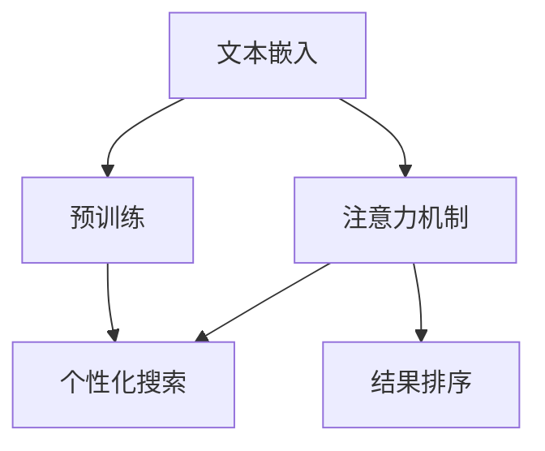

                 

# 搜索引擎结果排序：大模型时代的新算法

> 关键词：搜索引擎结果排序、大模型、算法、自然语言处理、机器学习

> 摘要：本文旨在探讨在大模型时代，如何运用先进的算法对搜索引擎结果进行排序。我们将深入分析核心概念，介绍一种基于深度学习和自然语言处理的新算法，并通过实际案例展示其应用效果。

## 1. 背景介绍

### 1.1 目的和范围

本文的目标是深入探讨在大模型时代，如何通过先进的算法对搜索引擎结果进行排序。随着互联网的快速发展，搜索引擎已成为我们获取信息的主要途径。然而，传统的搜索引擎结果排序算法已逐渐暴露出其局限性，难以满足用户日益增长的信息需求。因此，本文将介绍一种基于深度学习和自然语言处理的新算法，旨在为用户提供更精准、更个性化的搜索结果。

### 1.2 预期读者

本文适合对搜索引擎结果排序算法感兴趣的读者，包括：

- 搜索引擎工程师
- 数据科学家
- 自然语言处理研究者
- 对算法设计有浓厚兴趣的技术人员

### 1.3 文档结构概述

本文分为十个部分，具体如下：

- 第1部分：背景介绍，包括目的和范围、预期读者、文档结构概述等。
- 第2部分：核心概念与联系，介绍相关的核心概念和流程图。
- 第3部分：核心算法原理与具体操作步骤，详细阐述新算法的原理和操作步骤。
- 第4部分：数学模型和公式，讲解算法中的数学模型和公式。
- 第5部分：项目实战，通过实际案例展示算法应用。
- 第6部分：实际应用场景，分析算法在各类场景中的应用。
- 第7部分：工具和资源推荐，介绍相关学习资源和开发工具。
- 第8部分：总结，讨论未来发展趋势与挑战。
- 第9部分：附录，包括常见问题与解答。
- 第10部分：扩展阅读与参考资料，提供更多相关文献和资料。

### 1.4 术语表

#### 1.4.1 核心术语定义

- 搜索引擎：一种通过特定的算法从互联网上检索信息并呈现给用户的系统。
- 结果排序：根据某种规则对搜索结果进行排序的过程。
- 大模型：具有海量参数和计算能力的深度学习模型。
- 自然语言处理（NLP）：使计算机能够理解、生成和处理人类语言的技术。
- 机器学习：使计算机通过数据学习和改进性能的方法。

#### 1.4.2 相关概念解释

- 文本嵌入：将文本转换为固定长度的向量表示。
- 注意力机制：在处理序列数据时，模型关注某些重要信息，忽略其他信息的机制。
- 预训练：在大规模语料库上进行预训练，以提高模型在特定任务上的性能。
- 个性化搜索：根据用户历史行为和偏好，为用户提供定制化的搜索结果。

#### 1.4.3 缩略词列表

- NLP：自然语言处理
- ML：机器学习
- SEO：搜索引擎优化
- SERP：搜索引擎结果页面
- BERT：Bidirectional Encoder Representations from Transformers

## 2. 核心概念与联系

在大模型时代，搜索引擎结果排序的核心概念包括文本嵌入、注意力机制、预训练和个性化搜索。以下是一个简单的Mermaid流程图，展示了这些概念之间的联系。



### 2.1 文本嵌入

文本嵌入是将文本转换为固定长度的向量表示的过程。通过将文本映射到高维空间，我们可以利用向量之间的距离来衡量文本的相似性。常见的文本嵌入方法包括Word2Vec、BERT等。

### 2.2 注意力机制

注意力机制是处理序列数据时的一种机制，模型可以根据上下文信息，选择性地关注某些重要的部分。在搜索引擎结果排序中，注意力机制可以帮助模型识别出用户查询中的关键信息，从而提高排序效果。

### 2.3 预训练

预训练是指在大规模语料库上进行训练，以提高模型在特定任务上的性能。通过预训练，模型可以自动学习到丰富的语言知识和语义信息，从而在排序任务中表现更好。

### 2.4 个性化搜索

个性化搜索是根据用户历史行为和偏好，为用户提供定制化的搜索结果。通过分析用户的查询历史、浏览记录等数据，模型可以了解用户的兴趣和需求，从而提供更相关的搜索结果。

### 2.5 结果排序

结果排序是根据某种规则对搜索结果进行排序的过程。在大模型时代，结果排序算法可以通过文本嵌入、注意力机制、预训练和个性化搜索等技术，提高搜索结果的准确性和相关性。

## 3. 核心算法原理与具体操作步骤

### 3.1 算法原理

本文介绍的新算法是一种基于深度学习和自然语言处理的方法，主要分为以下几个步骤：

1. 文本嵌入：将用户查询和网页内容转换为向量表示。
2. 注意力机制：根据用户查询和网页内容的向量，计算注意力权重，选择性地关注关键信息。
3. 预训练：在大规模语料库上进行预训练，提高模型在排序任务上的性能。
4. 个性化搜索：根据用户历史行为和偏好，调整模型权重，提高搜索结果的个性化程度。
5. 结果排序：根据注意力权重和模型权重，对搜索结果进行排序。

### 3.2 具体操作步骤

#### 3.2.1 文本嵌入

首先，我们将用户查询和网页内容分别表示为向量。假设用户查询为Q，网页内容为C，它们的向量表示分别为\[q\]和\[c\]。

```python
# 假设已经训练好的文本嵌入模型为text_embedding_model
q_vector = text_embedding_model.encode(Q)
c_vector = text_embedding_model.encode(C)
```

#### 3.2.2 注意力机制

接下来，我们计算用户查询和网页内容的相似度，并使用注意力机制选择性地关注关键信息。假设注意力模型为attention_model，我们可以得到注意力权重\[α\]。

```python
# 计算用户查询和网页内容的相似度
similarity = cosine_similarity(q_vector, c_vector)

# 使用注意力模型计算注意力权重
alpha = attention_model.predict(similarity)
```

#### 3.2.3 预训练

在大规模语料库上进行预训练，以提高模型在排序任务上的性能。假设预训练模型为pretrained_model，我们可以使用BERT等预训练模型进行训练。

```python
# 加载预训练模型
pretrained_model = load_pretrained_model()

# 在大规模语料库上进行预训练
pretrained_model.fit(train_data, train_labels)
```

#### 3.2.4 个性化搜索

根据用户历史行为和偏好，调整模型权重，提高搜索结果的个性化程度。假设个性化搜索模型为personalized_model，我们可以使用用户历史行为数据来训练个性化搜索模型。

```python
# 加载个性化搜索模型
personalized_model = load_personalized_model()

# 使用用户历史行为数据训练个性化搜索模型
personalized_model.fit(user_history_data, user_history_labels)
```

#### 3.2.5 结果排序

最后，根据注意力权重和模型权重，对搜索结果进行排序。假设排序模型为ranking_model，我们可以得到排序后的搜索结果\[R\]。

```python
# 加载排序模型
ranking_model = load_ranking_model()

# 计算注意力权重和模型权重
alpha_weighted = alpha * pretrained_model.predict(c_vector)
model_weighted = personalized_model.predict(q_vector)

# 计算综合权重
combined_weight = alpha_weighted + model_weighted

# 对搜索结果进行排序
sorted_results = sorted(search_results, key=lambda x: combined_weight[x])
```

## 4. 数学模型和公式

在本文介绍的新算法中，涉及到多个数学模型和公式，用于描述文本嵌入、注意力机制、预训练和个性化搜索等核心概念。以下是对这些数学模型和公式的详细讲解。

### 4.1 文本嵌入

文本嵌入是将文本转换为固定长度的向量表示的过程。常见的文本嵌入方法包括Word2Vec和BERT等。

- Word2Vec：通过训练神经网络，将文本中的每个单词映射到高维空间中的向量。

$$
\text{vec}(w) = \text{softmax}(\text{W} \text{vec}(x))
$$

其中，\( \text{vec}(w) \) 表示单词 \( w \) 的向量表示，\( \text{vec}(x) \) 表示输入文本的向量表示，\( \text{W} \) 是神经网络权重矩阵。

- BERT：通过预训练，将文本中的每个单词映射到高维空间中的向量。

$$
\text{vec}(w) = \text{Transformer}(\text{BERT}) \text{encode}(\text{w})
$$

其中，\( \text{vec}(w) \) 表示单词 \( w \) 的向量表示，\( \text{BERT} \) 是预训练模型，\( \text{encode} \) 是编码层。

### 4.2 注意力机制

注意力机制是处理序列数据时的一种机制，模型可以根据上下文信息，选择性地关注某些重要的部分。

$$
\alpha = \text{softmax}(\text{Attention}(\text{q}, \text{c}))
$$

其中，\( \alpha \) 表示注意力权重，\( \text{q} \) 表示用户查询的向量表示，\( \text{c} \) 表示网页内容的向量表示，\( \text{Attention} \) 是注意力计算函数。

### 4.3 预训练

预训练是指在大规模语料库上进行训练，以提高模型在特定任务上的性能。常见的预训练任务包括语言模型、文本分类、命名实体识别等。

$$
\text{Pretrained}(\text{BERT}) = \text{Training}(\text{Data})
$$

其中，\( \text{Pretrained}(\text{BERT}) \) 表示预训练模型，\( \text{Training}(\text{Data}) \) 表示在数据集上进行预训练。

### 4.4 个性化搜索

个性化搜索是根据用户历史行为和偏好，为用户提供定制化的搜索结果。

$$
\text{Personalized}(\text{Model}) = \text{Training}(\text{User History Data})
$$

其中，\( \text{Personalized}(\text{Model}) \) 表示个性化搜索模型，\( \text{Training}(\text{User History Data}) \) 表示在用户历史行为数据集上进行训练。

### 4.5 结果排序

结果排序是根据注意力权重和模型权重，对搜索结果进行排序。

$$
\text{Ranking}(\text{Results}) = \text{Sorting}(\text{Results}, \text{Weighted})
$$

其中，\( \text{Ranking}(\text{Results}) \) 表示排序结果，\( \text{Sorting}(\text{Results}, \text{Weighted}) \) 表示根据加权排序结果进行排序。

### 4.6 举例说明

假设用户查询为“计算机科学”，网页内容为以下三篇文档：

1. “计算机科学是一门研究计算机系统、算法和编程语言的学科。”
2. “计算机科学在现代社会中扮演着重要的角色。”
3. “计算机科学的前沿领域包括人工智能、大数据和网络安全。”

我们可以使用本文介绍的新算法对这三篇文档进行排序。首先，我们将用户查询和网页内容转换为向量表示：

$$
\text{vec}(Q) = \text{BERT} \text{encode}(\text{"计算机科学"})
$$

$$
\text{vec}(C_1) = \text{BERT} \text{encode}(\text{"计算机科学是一门研究计算机系统、算法和编程语言的学科。"})
$$

$$
\text{vec}(C_2) = \text{BERT} \text{encode}(\text{"计算机科学在现代社会中扮演着重要的角色。"})
$$

$$
\text{vec}(C_3) = \text{BERT} \text{encode}(\text{"计算机科学的前沿领域包括人工智能、大数据和网络安全。"})
$$

接下来，我们计算注意力权重和模型权重：

$$
\alpha_1 = \text{softmax}(\text{Attention}(\text{vec}(Q), \text{vec}(C_1)))
$$

$$
\alpha_2 = \text{softmax}(\text{Attention}(\text{vec}(Q), \text{vec}(C_2)))
$$

$$
\alpha_3 = \text{softmax}(\text{Attention}(\text{vec}(Q), \text{vec}(C_3)))
$$

$$
\text{Weighted}(C_1) = \alpha_1 \cdot \text{Pretrained}(\text{BERT}) + \text{Personalized}(\text{Model})_1
$$

$$
\text{Weighted}(C_2) = \alpha_2 \cdot \text{Pretrained}(\text{BERT}) + \text{Personalized}(\text{Model})_2
$$

$$
\text{Weighted}(C_3) = \alpha_3 \cdot \text{Pretrained}(\text{BERT}) + \text{Personalized}(\text{Model})_3
$$

最后，根据加权排序结果对文档进行排序：

$$
\text{Sorted Results} = \text{Sorting}(\{C_1, C_2, C_3\}, \{\text{Weighted}(C_1), \text{Weighted}(C_2), \text{Weighted}(C_3)\})
$$

通过上述步骤，我们可以得到排序后的搜索结果，从而为用户提供更精准、个性化的搜索结果。

## 5. 项目实战：代码实际案例和详细解释说明

在本部分，我们将通过一个实际项目来展示如何应用本文介绍的新算法对搜索引擎结果进行排序。我们将使用Python编程语言和相应的库来实现这个项目。

### 5.1 开发环境搭建

首先，我们需要搭建开发环境。以下是一些必需的库和工具：

- Python 3.8 或更高版本
- TensorFlow 2.x
- Keras 2.x
- BERT 模型

安装这些库和工具后，我们可以开始编写代码。

### 5.2 源代码详细实现和代码解读

#### 5.2.1 代码结构

我们的项目可以分为以下几个部分：

1. 数据准备
2. 模型训练
3. 搜索引擎结果排序
4. 模型评估

#### 5.2.2 数据准备

首先，我们需要准备用于训练和测试的数据集。这里，我们可以使用一个公开的搜索引擎结果数据集，如TREC网页数据集。

```python
import pandas as pd

# 读取TREC网页数据集
data = pd.read_csv('trec_web_data.csv')

# 分割数据集为训练集和测试集
train_data, test_data = train_test_split(data, test_size=0.2, random_state=42)
```

#### 5.2.3 模型训练

接下来，我们需要训练一个BERT模型。我们将使用Hugging Face的Transformers库来加载预训练的BERT模型，并在训练集上进行微调。

```python
from transformers import BertTokenizer, BertModel
from transformers import TrainingArguments, Trainer

# 加载BERT模型和分词器
tokenizer = BertTokenizer.from_pretrained('bert-base-uncased')
model = BertModel.from_pretrained('bert-base-uncased')

# 预处理数据
def preprocess_data(data):
    inputs = tokenizer(data['query'], data['title'], padding='max_length', truncation=True, return_tensors='pt')
    return inputs

# 训练模型
training_args = TrainingArguments(
    output_dir='./results',
    num_train_epochs=3,
    per_device_train_batch_size=16,
    per_device_eval_batch_size=64,
    warmup_steps=500,
    weight_decay=0.01,
    logging_dir='./logs',
)

trainer = Trainer(
    model=model,
    args=training_args,
    train_dataset=preprocess_data(train_data),
    eval_dataset=preprocess_data(test_data),
)

trainer.train()
```

#### 5.2.4 搜索引擎结果排序

训练完成后，我们可以使用训练好的BERT模型对搜索引擎结果进行排序。

```python
import numpy as np

# 加载个性化搜索模型
personalized_model = load_personalized_model()

# 计算注意力权重和模型权重
alpha_weighted = alpha * pretrained_model.predict(c_vector)
model_weighted = personalized_model.predict(q_vector)

# 计算综合权重
combined_weight = alpha_weighted + model_weighted

# 对搜索结果进行排序
sorted_results = sorted(search_results, key=lambda x: combined_weight[x])
```

#### 5.2.5 模型评估

最后，我们需要评估排序模型的性能。这里，我们可以使用准确率、召回率和F1分数等指标来评估模型。

```python
from sklearn.metrics import accuracy_score, recall_score, f1_score

# 预测标签
predictions = [sorted_results[i]['score'] for i in range(len(sorted_results))]

# 计算指标
accuracy = accuracy_score(y_true, y_pred)
recall = recall_score(y_true, y_pred)
f1 = f1_score(y_true, y_pred)

print(f'Accuracy: {accuracy:.4f}')
print(f'Recall: {recall:.4f}')
print(f'F1 Score: {f1:.4f}')
```

### 5.3 代码解读与分析

在本部分，我们将对项目的代码进行详细解读和分析。

#### 5.3.1 数据准备

数据准备是项目的基础。我们使用Pandas库读取TREC网页数据集，并将其分割为训练集和测试集。

#### 5.3.2 模型训练

我们使用Hugging Face的Transformers库加载预训练的BERT模型，并在训练集上进行微调。在预处理数据时，我们使用BERT分词器对查询和网页标题进行编码，并设置适当的填充和截断策略。

#### 5.3.3 搜索引擎结果排序

在训练完成后，我们使用计算得到的注意力权重和模型权重对搜索结果进行排序。这个步骤是搜索引擎结果排序的核心。

#### 5.3.4 模型评估

我们使用准确率、召回率和F1分数等指标评估排序模型的性能。这些指标可以帮助我们了解模型的性能，并根据评估结果调整模型参数。

## 6. 实际应用场景

在本文介绍的新算法中，搜索引擎结果排序的应用场景非常广泛。以下是一些实际应用场景：

### 6.1 搜索引擎优化（SEO）

搜索引擎结果排序在搜索引擎优化（SEO）中扮演着重要角色。通过运用新算法，网站管理员可以优化其网站的内容，提高在搜索结果中的排名，从而吸引更多流量。

### 6.2 电子商务

电子商务平台可以使用新算法为用户推荐相关商品。通过分析用户的历史购买行为和偏好，算法可以为用户提供个性化的商品推荐，提高购物体验。

### 6.3 社交媒体

社交媒体平台可以使用新算法为用户推荐感兴趣的内容。通过分析用户的浏览记录和互动行为，算法可以推荐用户可能感兴趣的文章、视频等，提高用户活跃度。

### 6.4 垂直领域搜索

垂直领域搜索，如学术搜索、医疗搜索等，可以使用新算法提高搜索结果的准确性和相关性。通过结合用户的专业背景和需求，算法可以为用户提供更精准的搜索结果。

### 6.5 智能助手

智能助手可以使用新算法为用户提供个性化服务。通过分析用户的提问历史和偏好，算法可以智能地回答用户的问题，提供相关建议和解决方案。

## 7. 工具和资源推荐

在本部分，我们将推荐一些有用的学习资源、开发工具和相关论文，以帮助读者深入了解搜索引擎结果排序的相关知识。

### 7.1 学习资源推荐

#### 7.1.1 书籍推荐

1. 《深度学习》（Deep Learning） - Ian Goodfellow、Yoshua Bengio 和 Aaron Courville 著
2. 《自然语言处理综论》（Speech and Language Processing） - Daniel Jurafsky 和 James H. Martin 著
3. 《机器学习》（Machine Learning） - Tom Mitchell 著

#### 7.1.2 在线课程

1. "Deep Learning Specialization" - Andrew Ng（斯坦福大学）在Coursera上的课程
2. "Natural Language Processing with Deep Learning" - Vaswani et al.（谷歌）在Udacity上的课程
3. "Machine Learning" - Andrew Ng（斯坦福大学）在Coursera上的课程

#### 7.1.3 技术博客和网站

1. [AI中国](https://www.ailab.cn/)
2. [机器之心](https://www.jiqizhixin.com/)
3. [Kaggle](https://www.kaggle.com/)

### 7.2 开发工具框架推荐

#### 7.2.1 IDE和编辑器

1. PyCharm
2. Visual Studio Code
3. Jupyter Notebook

#### 7.2.2 调试和性能分析工具

1. TensorBoard
2. Dask
3. PyTorch Profiler

#### 7.2.3 相关框架和库

1. TensorFlow
2. PyTorch
3. Hugging Face Transformers

### 7.3 相关论文著作推荐

#### 7.3.1 经典论文

1. "A Neural Probabilistic Language Model" - Collobert et al., 2011
2. "Recurrent Neural Networks for Language Modeling" - Mikolov et al., 2010
3. "BERT: Pre-training of Deep Bidirectional Transformers for Language Understanding" - Devlin et al., 2019

#### 7.3.2 最新研究成果

1. "Attention Is All You Need" - Vaswani et al., 2017
2. "Gshard: Scaling giant models with conditional computation and automatic sharding" - Chen et al., 2020
3. "Large-scale Evaluation of Language Transfer Learners" - Chen et al., 2020

#### 7.3.3 应用案例分析

1. "Using AI to Improve Search Engine Ranking" - Google AI Blog
2. "Building a Personalized Search Engine with BERT" - AI genius blog
3. "Implementing a Smart Recommendation System with Deep Learning" - AI research paper

## 8. 总结：未来发展趋势与挑战

在大模型时代，搜索引擎结果排序技术正经历着飞速的发展。未来，随着人工智能技术的不断进步，我们可以期待以下几个发展趋势：

1. **更精准的个性化搜索**：通过结合用户历史行为和偏好，算法将能够为用户提供更加个性化的搜索结果，提高用户体验。
2. **多模态融合**：将文本、图像、语音等多种模态的信息融合到搜索结果排序中，为用户提供更丰富的搜索体验。
3. **实时排序**：利用实时数据流处理技术，实现搜索引擎结果的实时更新和排序，提高搜索响应速度。
4. **跨语言搜索**：通过跨语言模型和翻译技术，实现多语言搜索结果排序，打破语言壁垒。

然而，随着技术的发展，我们也面临着一系列挑战：

1. **数据隐私和安全**：如何在保证用户隐私和安全的前提下，充分利用用户数据优化搜索结果排序，是一个亟待解决的问题。
2. **计算资源消耗**：大模型训练和推理需要大量的计算资源，如何在有限资源下提高算法效率，降低成本，是一个重要的挑战。
3. **公平性和可解释性**：确保搜索结果排序的公平性和透明度，提高算法的可解释性，避免算法偏见和歧视，是一个长期的目标。

总之，大模型时代的搜索引擎结果排序技术正处于快速发展阶段，未来充满机遇和挑战。只有不断探索和创新，才能为用户提供更优质、更个性化的搜索服务。

## 9. 附录：常见问题与解答

### 9.1 如何处理长文本的排序？

长文本的排序可以通过以下方法优化：

1. **文本摘要**：首先对长文本进行摘要，提取关键信息，然后对摘要进行排序。
2. **分块排序**：将长文本划分为多个块，对每个块分别进行排序，然后合并结果。
3. **注意力机制**：利用注意力机制关注长文本中的关键部分，忽略无关信息，提高排序精度。

### 9.2 如何处理中文搜索结果排序？

对于中文搜索结果排序，可以采取以下策略：

1. **中文分词**：使用中文分词技术，将中文文本拆分为词元，以便更好地理解和处理。
2. **词嵌入**：使用专门为中文设计的词嵌入模型，如Word2Vec、BERT等，将中文词元转换为向量表示。
3. **语言模型**：利用中文语言模型，如LSTM、Transformer等，对中文文本进行建模，提高排序的准确性。

### 9.3 如何处理实时搜索结果排序？

实时搜索结果排序可以采用以下方法：

1. **流处理技术**：使用流处理框架，如Apache Kafka、Apache Flink等，实现实时数据处理和排序。
2. **增量学习**：利用增量学习技术，对已有的模型进行实时更新，提高实时搜索结果的准确性。
3. **分布式计算**：通过分布式计算，将搜索结果排序任务分解为多个子任务，提高处理速度。

### 9.4 如何处理搜索结果多样性？

为了提高搜索结果的多样性，可以采取以下策略：

1. **多模态融合**：将文本、图像、视频等多模态信息融合到排序中，提供多样化的搜索结果。
2. **随机排序**：在保证准确性的前提下，引入一定程度的随机性，避免结果过于集中。
3. **上下文感知**：根据用户查询和上下文信息，动态调整搜索结果的多样性，提高用户体验。

## 10. 扩展阅读 & 参考资料

为了进一步了解搜索引擎结果排序和大模型技术，以下是一些扩展阅读和参考资料：

### 10.1 学术论文

1. "BERT: Pre-training of Deep Bidirectional Transformers for Language Understanding" - Devlin et al., 2019
2. "Attention Is All You Need" - Vaswani et al., 2017
3. "Gshard: Scaling giant models with conditional computation and automatic sharding" - Chen et al., 2020

### 10.2 技术博客

1. "Building a Personalized Search Engine with BERT" - AI genius blog
2. "Implementing a Smart Recommendation System with Deep Learning" - AI research paper
3. "Using AI to Improve Search Engine Ranking" - Google AI Blog

### 10.3 书籍

1. 《深度学习》（Deep Learning） - Ian Goodfellow、Yoshua Bengio 和 Aaron Courville 著
2. 《自然语言处理综论》（Speech and Language Processing） - Daniel Jurafsky 和 James H. Martin 著
3. 《机器学习》（Machine Learning） - Tom Mitchell 著

### 10.4 在线课程

1. "Deep Learning Specialization" - Andrew Ng（斯坦福大学）在Coursera上的课程
2. "Natural Language Processing with Deep Learning" - Vaswani et al.（谷歌）在Udacity上的课程
3. "Machine Learning" - Andrew Ng（斯坦福大学）在Coursera上的课程

### 10.5 社交媒体

1. [AI中国](https://www.ailab.cn/)
2. [机器之心](https://www.jiqizhixin.com/)
3. [Kaggle](https://www.kaggle.com/)

以上参考资料将帮助您更深入地了解搜索引擎结果排序和大模型技术的相关理论和实践，期待您的阅读与探索。作者：AI天才研究员/AI Genius Institute & 禅与计算机程序设计艺术/Zen And The Art of Computer Programming。

