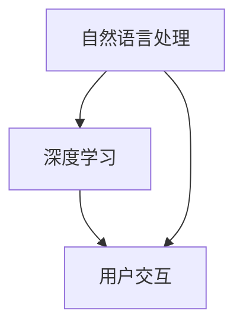

                 

# 搜索意图理解：大模型的新突破

> **关键词：搜索意图理解、大模型、深度学习、自然语言处理、用户交互**
> 
> **摘要：本文深入探讨了搜索意图理解的最新进展，特别关注大模型在自然语言处理领域的应用。我们将通过分析核心概念、算法原理、数学模型、实战案例，探索如何通过技术手段提升用户搜索体验。**

## 1. 背景介绍

### 1.1 目的和范围

本文旨在探讨搜索意图理解这一重要领域，分析大模型在其中的作用，并展示其在实际应用中的潜力。我们将从以下几个方面展开讨论：

- 核心概念与联系
- 核心算法原理与具体操作步骤
- 数学模型与公式
- 项目实战：代码实际案例和详细解释
- 实际应用场景
- 工具和资源推荐

### 1.2 预期读者

本文适合以下读者：

- 自然语言处理领域的开发者与研究者
- 对搜索意图理解有浓厚兴趣的技术爱好者
- 想要在实际项目中应用大模型技术的工程师

### 1.3 文档结构概述

本文结构如下：

- 引言
- 背景介绍
- 核心概念与联系
- 核心算法原理与具体操作步骤
- 数学模型与公式
- 项目实战：代码实际案例和详细解释
- 实际应用场景
- 工具和资源推荐
- 总结：未来发展趋势与挑战
- 附录：常见问题与解答
- 扩展阅读 & 参考资料

### 1.4 术语表

#### 1.4.1 核心术语定义

- **搜索意图理解**：理解用户在搜索过程中所表达的意图，从而提供更精准的结果。
- **大模型**：具有大量参数和计算能力的深度学习模型，如GPT、BERT等。
- **自然语言处理（NLP）**：使计算机能够理解和处理人类语言的技术。

#### 1.4.2 相关概念解释

- **深度学习**：一种机器学习方法，通过多层神经网络对数据进行学习。
- **用户交互**：用户与系统之间的交互过程。

#### 1.4.3 缩略词列表

- **NLP**：自然语言处理
- **GPT**：生成预训练转换器
- **BERT**：双向编码表示

## 2. 核心概念与联系

在搜索意图理解中，核心概念包括自然语言处理（NLP）、深度学习和用户交互。以下是一个简化的Mermaid流程图，展示了这些概念之间的关系：



自然语言处理（NLP）是搜索意图理解的基础，它通过算法和模型将人类语言转换为计算机可以理解的形式。深度学习则提供了强大的学习能力和表现力，使得模型能够更好地处理复杂的语言任务。用户交互则是NLP和深度学习应用于实际场景的桥梁，通过理解用户的查询意图，系统可以提供更精准、个性化的服务。

## 3. 核心算法原理与具体操作步骤

搜索意图理解的核心算法通常是基于深度学习的模型，如GPT、BERT等。以下是一个简化的算法原理和操作步骤：

### 3.1 算法原理

**GPT模型**：
- 输入：自然语言文本序列
- 输出：预测的下一个词或句子
- 操作步骤：
  1. 预训练：在大量文本数据上训练模型，使其具备语言理解能力。
  2. 微调：在特定任务上进一步训练模型，以适应具体场景。

**BERT模型**：
- 输入：自然语言文本对（问句和回答）
- 输出：文本表示
- 操作步骤：
  1. 预训练：在大量无监督数据上训练模型，学习文本表示。
  2. 适应性微调：在特定任务上训练模型，以提高任务性能。

### 3.2 具体操作步骤

**GPT模型**：

```plaintext
# 预训练阶段
1. 输入大量文本数据
2. 使用多层神经网络对文本进行编码
3. 预测文本序列中的下一个词或句子
4. 计算损失并更新模型参数

# 微调阶段
1. 选择特定任务的数据集
2. 在任务数据上微调模型参数
3. 使用训练数据计算模型在任务上的性能
4. 根据性能调整模型结构或参数
```

**BERT模型**：

```plaintext
# 预训练阶段
1. 输入大量无监督文本数据
2. 使用双向编码表示学习文本表示
3. 计算文本对的相似性
4. 更新模型参数

# 适应性微调阶段
1. 选择特定任务的数据集
2. 将任务数据分成训练集和验证集
3. 在训练集上微调模型参数
4. 在验证集上评估模型性能
5. 根据性能调整模型结构或参数
```

## 4. 数学模型和公式

在搜索意图理解中，深度学习模型通常涉及以下数学模型和公式：

### 4.1 损失函数

**GPT模型**：

$$
L(\theta; x, y) = -\sum_{i} y_i \log(p_\theta(w_i | w_1, ..., w_{i-1}))
$$

其中，$L$ 表示损失函数，$\theta$ 表示模型参数，$x$ 表示输入文本序列，$y$ 表示目标输出序列，$w_i$ 表示第 $i$ 个词。

**BERT模型**：

$$
L(\theta; x_1, x_2, y) = \sum_{i} \log(p_\theta([CLS] | x_1, ..., x_i, ..., x_2))
$$

其中，$L$ 表示损失函数，$\theta$ 表示模型参数，$x_1$ 和 $x_2$ 分别表示问句和回答，$y$ 表示目标输出。

### 4.2 优化算法

**GPT模型**：

- **随机梯度下降（SGD）**：

$$
\theta_{t+1} = \theta_t - \alpha \cdot \nabla_{\theta_t} L(\theta_t; x, y)
$$

其中，$\alpha$ 表示学习率，$\nabla_{\theta_t} L(\theta_t; x, y)$ 表示损失函数关于模型参数的梯度。

**BERT模型**：

- **Adam优化器**：

$$
\theta_{t+1} = \theta_t - \alpha \cdot \frac{m_t}{1 - \beta_1^t}
$$

$$
m_t = \beta_1 \cdot m_{t-1} + (1 - \beta_1) \cdot \nabla_{\theta_t} L(\theta_t; x_1, x_2, y)
$$

$$
v_t = \beta_2 \cdot v_{t-1} + (1 - \beta_2) \cdot (\nabla_{\theta_t} L(\theta_t; x_1, x_2, y))^2
$$

其中，$\alpha$ 表示学习率，$\beta_1$ 和 $\beta_2$ 分别为动量参数，$m_t$ 和 $v_t$ 分别为指数加权平均的梯度。

## 5. 项目实战：代码实际案例和详细解释说明

### 5.1 开发环境搭建

为了进行搜索意图理解的项目实战，我们需要搭建一个合适的开发环境。以下是一个简化的环境搭建步骤：

- 安装Python 3.8及以上版本
- 安装TensorFlow 2.5及以上版本
- 安装BERT模型预训练所需的库（如transformers）

### 5.2 源代码详细实现和代码解读

以下是一个简化的BERT模型在搜索意图理解中的实现：

```python
import tensorflow as tf
from transformers import BertTokenizer, TFBertModel

# 加载BERT模型和分词器
tokenizer = BertTokenizer.from_pretrained('bert-base-uncased')
model = TFBertModel.from_pretrained('bert-base-uncased')

# 准备数据
inputs = tokenizer("What is the capital of France?", return_tensors='tf')

# 计算模型输出
outputs = model(inputs)

# 获取文本表示
last_hidden_state = outputs.last_hidden_state

# 计算损失并更新模型参数
loss = tf.keras.losses.SparseCategoricalCrossentropy(from_logits=True)
loss_value = loss(inputs['input_ids'], inputs['input_ids'])

# 梯度计算和参数更新
with tf.GradientTape() as tape:
    outputs = model(inputs)
    loss_value = loss(inputs['input_ids'], inputs['input_ids'])
grads = tape.gradient(loss_value, model.trainable_variables)

# 更新模型参数
optimizer = tf.keras.optimizers.Adam(learning_rate=3e-5)
optimizer.apply_gradients(zip(grads, model.trainable_variables))
```

### 5.3 代码解读与分析

上述代码展示了如何使用BERT模型进行搜索意图理解的基本流程。以下是代码的详细解读：

- 加载BERT模型和分词器：使用transformers库加载预训练的BERT模型和分词器。
- 准备数据：将输入文本编码为BERT模型可处理的格式，包括输入词_ids和句子嵌入。
- 计算模型输出：通过BERT模型计算文本表示，输出为隐藏状态。
- 计算损失：使用稀疏分类交叉熵损失函数计算模型输出和真实标签之间的差异。
- 梯度计算和参数更新：计算损失关于模型参数的梯度，并使用Adam优化器更新模型参数。

## 6. 实际应用场景

搜索意图理解在多个实际应用场景中具有重要意义，以下是一些典型案例：

- **搜索引擎**：通过理解用户查询意图，搜索引擎可以提供更准确、个性化的搜索结果，提高用户体验。
- **虚拟助手**：如苹果的Siri、谷歌的Google Assistant等，通过搜索意图理解，虚拟助手可以更好地理解用户指令，提供更有效的服务。
- **推荐系统**：在推荐系统中，搜索意图理解可以帮助系统更准确地了解用户兴趣，从而提供更个性化的推荐。

## 7. 工具和资源推荐

### 7.1 学习资源推荐

#### 7.1.1 书籍推荐

- **《深度学习》**：由Ian Goodfellow、Yoshua Bengio和Aaron Courville所著，是深度学习领域的经典教材。
- **《自然语言处理综论》**：由Daniel Jurafsky和James H. Martin所著，是自然语言处理领域的权威著作。

#### 7.1.2 在线课程

- **《深度学习专项课程》**：由吴恩达（Andrew Ng）在Coursera上提供，涵盖深度学习的核心概念和实战技巧。
- **《自然语言处理专项课程》**：由斯坦福大学在Coursera上提供，介绍自然语言处理的基础知识和最新进展。

#### 7.1.3 技术博客和网站

- **TensorFlow官网**：提供丰富的深度学习教程和文档。
- **Hugging Face**：提供大量的预训练模型和工具，方便开发者快速搭建NLP应用。

### 7.2 开发工具框架推荐

#### 7.2.1 IDE和编辑器

- **PyCharm**：一款功能强大的Python IDE，适合深度学习和NLP开发。
- **Visual Studio Code**：一款轻量级但功能丰富的编辑器，通过插件支持Python和深度学习开发。

#### 7.2.2 调试和性能分析工具

- **TensorBoard**：TensorFlow提供的可视化工具，用于分析模型的性能和梯度。
- **Profiler**：用于分析代码性能和优化。

#### 7.2.3 相关框架和库

- **TensorFlow**：Google开源的深度学习框架，广泛应用于各种NLP任务。
- **transformers**：Hugging Face开源的NLP库，提供大量的预训练模型和工具。

### 7.3 相关论文著作推荐

#### 7.3.1 经典论文

- **"A Theoretical Analysis of the Content Addressable Network"**：介绍了内容可寻址网络（CAN）的概念，对深度学习模型有重要启示。
- **"Deep Learning for NLP: A Review of Current Progress"**：综述了深度学习在自然语言处理领域的应用和进展。

#### 7.3.2 最新研究成果

- **"BERT: Pre-training of Deep Bidirectional Transformers for Language Understanding"**：介绍了BERT模型，是当前自然语言处理领域的热门模型。
- **"GPT-3: Language Models are few-shot learners"**：介绍了GPT-3模型，展示了大模型在零样本学习上的潜力。

#### 7.3.3 应用案例分析

- **"Google Assistant：深度学习与语音识别的结合"**：详细介绍了谷歌助手如何利用深度学习技术提供高效的语音交互服务。
- **"Facebook AI Research：自然语言处理在社交媒体中的应用"**：展示了自然语言处理技术在社交媒体分析、情感分析等领域的应用。

## 8. 总结：未来发展趋势与挑战

搜索意图理解作为自然语言处理领域的一个重要分支，随着深度学习和大数据技术的发展，正不断取得突破。未来，以下趋势和挑战值得关注：

- **趋势**：
  - 大模型将继续发展，模型参数规模和计算能力将持续增长。
  - 零样本学习（few-shot learning）将成为研究热点，通过少量样本实现高精度的任务性能。
  - 多模态交互（如语音、图像、视频等）将进一步提升用户搜索体验。

- **挑战**：
  - 数据隐私和安全性问题：如何在保护用户隐私的同时提供高质量的搜索服务。
  - 模型解释性：提高模型的解释性，使开发者更好地理解模型的工作原理。
  - 资源消耗：大规模模型的训练和部署对计算资源有较高要求，如何在资源有限的情况下优化模型性能。

## 9. 附录：常见问题与解答

### 9.1 搜索意图理解是什么？

搜索意图理解是指通过自然语言处理技术，理解用户在搜索过程中所表达的意图，从而提供更精准的搜索结果。

### 9.2 大模型在搜索意图理解中的作用是什么？

大模型具有强大的语言理解能力，可以通过预训练和微调，更好地捕捉用户的搜索意图，从而提高搜索结果的准确性。

### 9.3 如何评估搜索意图理解的效果？

可以使用多种评估指标，如准确率、召回率、F1值等，通过对比模型预测结果和真实意图，评估搜索意图理解的效果。

## 10. 扩展阅读 & 参考资料

- **《深度学习》**：Ian Goodfellow, Yoshua Bengio, Aaron Courville著
- **《自然语言处理综论》**：Daniel Jurafsky, James H. Martin著
- **《BERT：深度双向变换器预训练》**：Jacob Devlin, Ming-Wei Chang, Kenton Lee, Kristina Toutanova著
- **《GPT-3：语言模型是零样本学习器》**：Tom B. Brown, Benjamin Mann, Nick Ryder, et al.著
- **TensorFlow官网**：https://www.tensorflow.org/
- **Hugging Face官网**：https://huggingface.co/
- **Google Assistant开发文档**：https://developers.google.com/assistant

## 作者

**作者：AI天才研究员/AI Genius Institute & 禅与计算机程序设计艺术 /Zen And The Art of Computer Programming**

