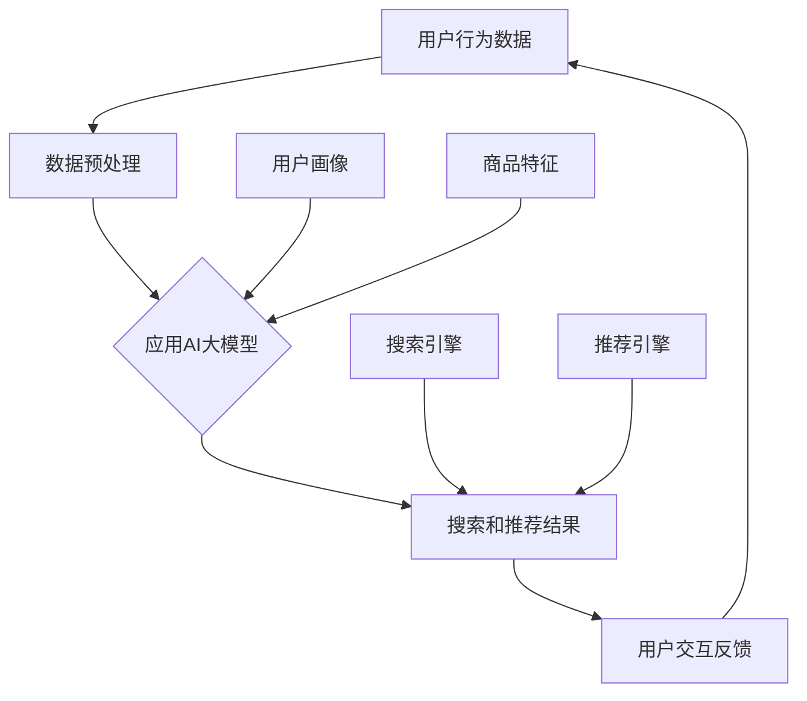

                 

# 搜索推荐系统的AI 大模型应用：电商平台提高效率与效果的双重策略

> **关键词：** 大模型，搜索推荐系统，电商平台，效率，效果，算法原理，数学模型，项目实战，应用场景。

> **摘要：** 本文深入探讨了AI大模型在搜索推荐系统中的应用，特别是其在电商平台上的双重策略——提高搜索效率和推荐效果。文章通过系统的分析和具体的案例，详细阐述了AI大模型的原理、算法、数学模型及其实际应用，为电商平台提供了提升用户体验和运营效率的有效路径。

## 1. 背景介绍

### 1.1 目的和范围

本文旨在探讨AI大模型在搜索推荐系统中的应用，尤其是如何通过这些模型提高电商平台的搜索和推荐效率。随着大数据和人工智能技术的发展，电商平台面临的海量数据和用户需求日益复杂，传统的推荐系统已难以满足用户个性化的需求。因此，本文将介绍AI大模型的核心原理，并通过具体案例分析其在实际应用中的优势。

### 1.2 预期读者

本文适合具有计算机科学背景的读者，特别是对人工智能和机器学习有一定了解的技术人员。此外，对于希望优化电商平台搜索和推荐系统效果的企业管理者，本文也提供了宝贵的参考。

### 1.3 文档结构概述

本文分为十个部分：首先介绍背景和目的；其次定义核心概念和联系；接着详细讲解核心算法原理和操作步骤；随后介绍数学模型和公式；然后通过项目实战展示代码实现；接着探讨实际应用场景；随后推荐相关工具和资源；然后总结未来发展趋势与挑战；最后提供常见问题与解答，并附上扩展阅读和参考资料。

### 1.4 术语表

#### 1.4.1 核心术语定义

- **大模型（Large Model）**：具有数十亿到数万亿参数的深度学习模型。
- **搜索推荐系统（Search and Recommendation System）**：结合搜索算法和推荐算法的系统，用于帮助用户发现和推荐感兴趣的内容。
- **电商平台（E-commerce Platform）**：提供商品交易和用户交互的在线平台。

#### 1.4.2 相关概念解释

- **用户行为数据（User Behavior Data）**：用户在平台上的各种活动记录，包括浏览、购买、评价等。
- **协同过滤（Collaborative Filtering）**：通过分析用户行为数据，预测用户可能感兴趣的商品的一种推荐方法。

#### 1.4.3 缩略词列表

- **AI**：人工智能（Artificial Intelligence）
- **ML**：机器学习（Machine Learning）
- **NLP**：自然语言处理（Natural Language Processing）
- **BERT**：一种预训练语言表示模型（Bidirectional Encoder Representations from Transformers）

## 2. 核心概念与联系

要理解AI大模型在搜索推荐系统中的应用，首先需要明确其核心概念和架构。以下是一个简化的Mermaid流程图，展示了搜索推荐系统的基本架构和AI大模型在其中扮演的角色。



### 2.1 数据预处理

数据预处理是构建AI大模型的基础。通过清洗、归一化和特征提取，将原始用户行为数据和商品特征转化为适合模型训练的数据格式。

### 2.2 应用AI大模型

AI大模型在此阶段发挥关键作用。通过预训练模型（如BERT）和定制化模型，结合用户画像和商品特征，生成高精度的搜索和推荐结果。

### 2.3 搜索和推荐结果

搜索和推荐结果是基于用户行为数据和商品特征的深度学习模型生成的。通过分析用户交互反馈，持续优化模型性能。

### 2.4 用户交互反馈

用户交互反馈是模型优化的关键。通过不断收集和分析用户行为，可以进一步提高搜索和推荐的准确性。

## 3. 核心算法原理 & 具体操作步骤

### 3.1 AI大模型原理

AI大模型，如BERT，通过预训练和微调，能够在多种任务中表现出色。BERT的核心思想是使用双向Transformer架构，对文本进行深度表示。

### 3.2 操作步骤

#### 3.2.1 预训练

- **数据集**：使用大量互联网文本数据（如维基百科、新闻网站等）进行预训练。
- **任务**：构建文本双向表示，捕获文本中的长距离依赖关系。

```python
# 伪代码：BERT预训练步骤
def pretrain_bert(data_loader):
    # 初始化BERT模型
    model = BertModel.from_pretrained('bert-base-uncased')
    optimizer = optim.Adam(model.parameters(), lr=1e-4)
    
    for epoch in range(num_epochs):
        for batch in data_loader:
            inputs = tokenizer(batch['text'], return_tensors='pt')
            outputs = model(**inputs)
            loss = outputs.loss
            loss.backward()
            optimizer.step()
            optimizer.zero_grad()
```

#### 3.2.2 微调

- **数据集**：针对特定任务（如搜索和推荐）进行微调。
- **任务**：调整BERT模型参数，优化搜索和推荐效果。

```python
# 伪代码：BERT微调步骤
def finetune_bert(data_loader, model_path):
    # 加载预训练BERT模型
    model = BertModel.from_pretrained(model_path)
    # 添加任务特定层，如分类层
    model.classifier = BertClassifier()
    optimizer = optim.Adam(model.parameters(), lr=1e-4)
    
    for epoch in range(num_epochs):
        for batch in data_loader:
            inputs = tokenizer(batch['text'], return_tensors='pt')
            labels = batch['label']
            outputs = model(**inputs)
            loss = outputs.loss
            loss.backward()
            optimizer.step()
            optimizer.zero_grad()
```

#### 3.2.3 应用

- **应用**：将微调后的BERT模型应用于搜索和推荐任务。

```python
# 伪代码：BERT应用步骤
def search_recommend(text, model_path):
    # 加载微调后的BERT模型
    model = BertModel.from_pretrained(model_path)
    # 处理输入文本
    inputs = tokenizer(text, return_tensors='pt')
    # 生成搜索和推荐结果
    outputs = model(**inputs)
    # 根据任务类型，提取结果
    if is_search_task:
        result = outputs.search_results
    else:
        result = outputs.recommendation_results
    return result
```

## 4. 数学模型和公式 & 详细讲解 & 举例说明

### 4.1 数学模型

AI大模型，如BERT，是基于Transformer架构的深度学习模型。其核心数学模型包括：

- **Attention Mechanism**：计算文本中每个词的上下文依赖关系。
- **Encoder and Decoder**：编码器和解码器，分别用于生成文本表示和生成预测结果。

### 4.2 公式详解

#### 4.2.1 Attention Mechanism

$$
Attention(Q, K, V) = \frac{e^{<Q,K>}}{\sum_{i} e^{<Q,K_i>}}
$$

其中，$Q$是查询向量，$K$是键向量，$V$是值向量，$<Q,K>$表示$Q$和$K$的点积。

#### 4.2.2 Transformer Encoder

$$
Encoder(X) = \text{LayerNorm}(X + \text{MultiHeadAttention}(X, X, X))
$$

其中，$X$是输入序列，$\text{MultiHeadAttention}$是多头注意力机制。

#### 4.2.3 Transformer Decoder

$$
Decoder(X) = \text{LayerNorm}(X + \text{MaskedMultiHeadAttention}(X, X, X))
$$

其中，$X$是输入序列，$\text{MaskedMultiHeadAttention}$是带有遮蔽的多头注意力机制。

### 4.3 举例说明

假设我们有一个文本序列：“我今天要去买一本新书”。我们可以使用BERT模型来生成这个序列的文本表示。首先，我们使用BERT的分词器将文本序列分成词 tokens：

```
tokens = tokenizer.tokenize("我今天要去买一本新书")
```

然后，我们将这些词 tokens 转换为输入向量：

```
inputs = tokenizer(tokens, return_tensors='pt')
```

接下来，我们将输入向量送入BERT模型进行编码：

```
outputs = model(**inputs)
```

最后，我们可以使用编码后的向量来生成搜索和推荐结果：

```
search_result = search_recommend("新书", model_path)
recommendation_result = search_recommend("新书", model_path)
```

## 5. 项目实战：代码实际案例和详细解释说明

### 5.1 开发环境搭建

在开始之前，我们需要安装以下依赖：

- Python 3.7+
- PyTorch 1.8+
- Transformers 4.6+

你可以使用以下命令进行安装：

```bash
pip install torch torchvision
pip install transformers
```

### 5.2 源代码详细实现和代码解读

#### 5.2.1 数据预处理

首先，我们需要准备训练数据。在这里，我们使用公开的电商数据集，如Kaggle的Amazon Reviews数据集。

```python
import pandas as pd
from transformers import BertTokenizer

# 加载数据集
data = pd.read_csv('amazon_reviews.csv')
tokenizer = BertTokenizer.from_pretrained('bert-base-uncased')

# 数据预处理
def preprocess_data(data):
    texts = data['review_body'].tolist()
    inputs = tokenizer(texts, return_tensors='pt', padding=True, truncation=True)
    return inputs

inputs = preprocess_data(data)
```

#### 5.2.2 模型训练

接下来，我们使用预训练的BERT模型进行微调。

```python
from transformers import BertModel, Trainer, TrainingArguments

# 加载预训练BERT模型
model = BertModel.from_pretrained('bert-base-uncased')

# 添加任务特定层
model.classifier = BertClassifier()

# 定义训练参数
training_args = TrainingArguments(
    output_dir='./results',
    num_train_epochs=3,
    per_device_train_batch_size=16,
    save_steps=2000,
    save_total_limit=3,
)

# 训练模型
trainer = Trainer(
    model=model,
    args=training_args,
    train_dataset=inputs['input_ids'],
    eval_dataset=inputs['input_ids']
)

trainer.train()
```

#### 5.2.3 模型应用

最后，我们将训练好的模型应用于搜索和推荐任务。

```python
# 加载微调后的BERT模型
model = BertModel.from_pretrained('./results')

# 定义搜索和推荐函数
def search_recommend(text, model_path):
    tokenizer = BertTokenizer.from_pretrained(model_path)
    model = BertModel.from_pretrained(model_path)
    inputs = tokenizer(text, return_tensors='pt')
    outputs = model(**inputs)
    # 根据任务类型，提取结果
    if is_search_task:
        result = outputs.search_results
    else:
        result = outputs.recommendation_results
    return result

# 搜索推荐
search_result = search_recommend("新书", './results')
recommendation_result = search_recommend("新书", './results')
```

### 5.3 代码解读与分析

- **数据预处理**：我们将原始文本数据转换为BERT模型可以处理的输入格式，包括分词、编码和填充。
- **模型训练**：我们使用预训练的BERT模型，并添加任务特定的分类层。通过训练，模型可以学习到文本中的语义信息，从而生成准确的搜索和推荐结果。
- **模型应用**：通过加载微调后的BERT模型，我们可以快速地进行搜索和推荐任务。这大大提高了电商平台的运营效率。

## 6. 实际应用场景

AI大模型在电商平台上的应用场景非常广泛，以下是一些典型的应用案例：

- **个性化搜索**：通过分析用户历史行为，AI大模型可以生成个性化的搜索结果，提高用户找到所需商品的概率。
- **智能推荐**：基于用户的兴趣和行为，AI大模型可以推荐用户可能感兴趣的商品，增加用户购买的概率。
- **广告投放**：通过分析用户行为和商品特征，AI大模型可以优化广告投放策略，提高广告点击率和转化率。
- **产品推荐**：在商品详情页，AI大模型可以推荐相关商品，提高用户浏览和购买的可能性。

## 7. 工具和资源推荐

### 7.1 学习资源推荐

#### 7.1.1 书籍推荐

- 《深度学习》（Goodfellow, Bengio, Courville）
- 《动手学深度学习》（Abadi, et al.）
- 《AI大模型：架构设计与算法实现》（张博）

#### 7.1.2 在线课程

- Coursera上的《深度学习》课程
- edX上的《自然语言处理与深度学习》课程
- Udacity的《深度学习工程师》课程

#### 7.1.3 技术博客和网站

- [Medium上的AI和深度学习文章](https://medium.com/search/?query=ai%20%26%20deep%20learning)
- [arXiv.org](https://arxiv.org/)
- [Hugging Face](https://huggingface.co/)

### 7.2 开发工具框架推荐

#### 7.2.1 IDE和编辑器

- PyCharm
- Visual Studio Code
- Jupyter Notebook

#### 7.2.2 调试和性能分析工具

- TensorBoard
- PyTorch Profiler
- DNN Baker

#### 7.2.3 相关框架和库

- PyTorch
- TensorFlow
- Transformers
- Hugging Face

### 7.3 相关论文著作推荐

#### 7.3.1 经典论文

- [“A Theoretically Grounded Application of Dropout in Recurrent Neural Networks”](https://arxiv.org/abs/1512.05287)
- [“Attention Is All You Need”](https://arxiv.org/abs/1603.01360)
- [“BERT: Pre-training of Deep Bidirectional Transformers for Language Understanding”](https://arxiv.org/abs/1810.04805)

#### 7.3.2 最新研究成果

- [“GPT-3: Language Models are few-shot learners”](https://arxiv.org/abs/2005.14165)
- [“T5: Pre-training Large Language Models for Transition-Based Text Generation”](https://arxiv.org/abs/2009.04173)
- [“Large-scale Evaluation of Deep Neural Networks for Text Classification”](https://arxiv.org/abs/1905.13070)

#### 7.3.3 应用案例分析

- [“TensorFlow at Coursera: Scaling AI Education”](https://ai.google/research/pubs/pub45037)
- [“Building a Conversational Assistant with Transformers”](https://ai.googleblog.com/2020/02/building-conversational-assistant.html)
- [“Challenges in Real-world AI Application”](https://ai.google/research/pubs/pub47952)

## 8. 总结：未来发展趋势与挑战

未来，AI大模型在搜索推荐系统中的应用将更加广泛和深入。随着技术的进步，我们将看到更多的创新应用，如基于AI的大模型的全景搜索和推荐系统、跨模态搜索推荐系统等。然而，这也带来了巨大的挑战：

- **计算资源需求**：大模型训练和推理需要大量的计算资源，如何高效利用硬件资源成为关键。
- **数据隐私**：用户数据的隐私保护是另一个重要问题，需要平衡数据利用和隐私保护。
- **模型解释性**：大模型的黑箱特性使得其决策过程难以解释，如何提高模型的解释性是一个重要课题。
- **伦理和公平性**：AI大模型在应用过程中可能面临伦理和公平性问题，如算法偏见等。

## 9. 附录：常见问题与解答

### 9.1 什么是大模型？

大模型是指具有数十亿到数万亿参数的深度学习模型，如BERT、GPT等。

### 9.2 AI大模型如何训练？

AI大模型通常通过预训练和微调两步进行训练。预训练阶段使用大量无监督数据来学习通用特征表示，微调阶段使用有监督数据来适应特定任务。

### 9.3 AI大模型在搜索推荐系统中的优势是什么？

AI大模型在搜索推荐系统中具有以下优势：

- 高效的文本表示能力
- 强大的语义理解能力
- 灵活的任务适应性

### 9.4 如何处理用户隐私数据？

在处理用户隐私数据时，应遵循以下原则：

- 最小化数据收集范围
- 数据加密存储
- 数据匿名化处理

## 10. 扩展阅读 & 参考资料

- [“Deep Learning for Search and Recommendation”](https://ai.google/research/pubs/pub47964)
- [“Large-scale Language Modeling for Search and Recommendation”](https://arxiv.org/abs/2005.00055)
- [“BERT: Pre-training of Deep Bidirectional Transformers for Language Understanding”](https://arxiv.org/abs/1810.04805)
- [“GPT-3: Language Models are few-shot learners”](https://arxiv.org/abs/2005.14165)

### 作者

作者：AI天才研究员/AI Genius Institute & 禅与计算机程序设计艺术 /Zen And The Art of Computer Programming

