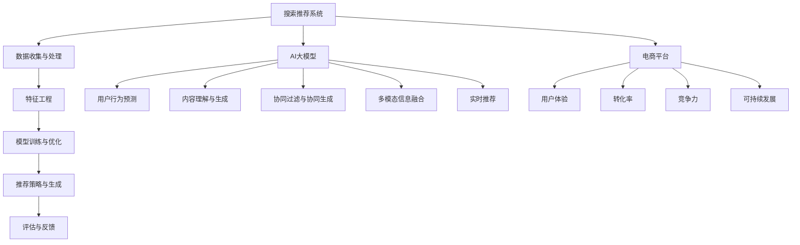

                 

# 搜索推荐系统的AI大模型融合：电商平台的核心竞争力与可持续发展

## 关键词
- 搜索推荐系统
- AI大模型
- 电商平台
- 核心竞争力
- 可持续发展

## 摘要
随着互联网技术的迅猛发展，搜索推荐系统已经成为电商平台提升用户体验和转化率的关键。本文将深入探讨AI大模型在搜索推荐系统中的应用，通过分析其原理、算法和实际案例，揭示AI大模型如何成为电商平台的核心竞争力，并探讨其在可持续发展中的关键作用。本文旨在为读者提供一个全面的技术视角，以理解和掌握AI大模型在搜索推荐系统中的关键应用和实践。

## 1. 背景介绍

### 1.1 目的和范围
本文旨在探讨AI大模型在搜索推荐系统中的应用，分析其在电商平台中的核心竞争力，并探讨其可持续发展的重要性。文章将涵盖以下内容：

- 搜索推荐系统的基本原理和架构
- AI大模型的概念及其在搜索推荐系统中的应用
- 核心算法原理与具体操作步骤
- 数学模型和公式
- 项目实战案例分析
- 实际应用场景
- 工具和资源推荐
- 未来发展趋势与挑战

### 1.2 预期读者
本文主要面向以下读者群体：

- 对搜索推荐系统有初步了解的技术人员
- 想要深入了解AI大模型在搜索推荐系统中应用的工程师
- 电商平台的技术负责人和决策者
- 对人工智能和互联网技术有浓厚兴趣的学者和研究者

### 1.3 文档结构概述
本文结构如下：

- 第1部分：背景介绍，包括目的和范围、预期读者、文档结构概述、术语表
- 第2部分：核心概念与联系，介绍搜索推荐系统的基础知识
- 第3部分：核心算法原理 & 具体操作步骤，讲解AI大模型的基本算法和实现步骤
- 第4部分：数学模型和公式 & 详细讲解 & 举例说明，解析AI大模型的数学原理
- 第5部分：项目实战：代码实际案例和详细解释说明，通过实战案例展示AI大模型的应用
- 第6部分：实际应用场景，分析AI大模型在电商平台的应用场景
- 第7部分：工具和资源推荐，提供学习资源和开发工具的推荐
- 第8部分：总结：未来发展趋势与挑战，探讨AI大模型在搜索推荐系统中的未来发展方向和挑战
- 第9部分：附录：常见问题与解答，回答读者可能遇到的问题
- 第10部分：扩展阅读 & 参考资料，提供进一步阅读的资料

### 1.4 术语表

#### 1.4.1 核心术语定义

- **搜索推荐系统**：一种通过分析用户行为、兴趣和偏好，为用户提供个性化推荐服务的系统。
- **AI大模型**：一种基于深度学习、机器学习和强化学习等技术的复杂模型，具有大规模数据和参数。
- **电商平台**：一个在线交易市场，为消费者和商家提供商品和服务交易的平台。
- **核心竞争力**：企业在竞争中具备的独特的、难以模仿的优势能力。
- **可持续发展**：满足当前需求而不损害子孙后代满足自身需求的能力。

#### 1.4.2 相关概念解释

- **深度学习**：一种机器学习技术，通过多层神经网络对数据进行自动特征提取和模式识别。
- **推荐算法**：一种基于用户行为数据、内容特征和上下文信息进行推荐的方法。
- **用户画像**：通过用户历史行为、兴趣、偏好等数据构建的用户个人特征模型。

#### 1.4.3 缩略词列表

- **API**：应用程序接口（Application Programming Interface）
- **NLP**：自然语言处理（Natural Language Processing）
- **ML**：机器学习（Machine Learning）
- **DL**：深度学习（Deep Learning）
- **CTR**：点击率（Click-Through Rate）
- **LR**：逻辑回归（Logistic Regression）
- **TF-IDF**：词频-逆文档频率（Term Frequency-Inverse Document Frequency）

## 2. 核心概念与联系

在本文中，我们将探讨搜索推荐系统、AI大模型以及电商平台之间的关系。搜索推荐系统是电商平台的核心组件之一，它通过分析用户行为和偏好，为用户提供个性化的商品推荐。而AI大模型则为搜索推荐系统提供了强大的技术支持，使其能够更精准地满足用户需求。以下是搜索推荐系统、AI大模型和电商平台之间的核心概念与联系。

### 2.1 搜索推荐系统架构

搜索推荐系统通常由以下几个关键模块组成：

- **数据收集与处理**：收集用户行为数据、商品数据、上下文信息等，进行数据清洗、转换和预处理。
- **特征工程**：提取用户和商品的属性特征，如用户历史行为、兴趣标签、商品属性等。
- **模型训练与优化**：使用深度学习、机器学习和强化学习等技术，训练和优化推荐模型。
- **推荐策略与生成**：根据用户特征和上下文信息，生成个性化的商品推荐列表。
- **评估与反馈**：评估推荐效果，收集用户反馈，持续优化推荐算法。

### 2.2 AI大模型在搜索推荐系统中的应用

AI大模型在搜索推荐系统中扮演着关键角色，主要包括以下几个方面：

- **用户行为预测**：通过分析用户历史行为数据，预测用户对商品的潜在兴趣和需求。
- **内容理解与生成**：对商品内容进行理解和分析，生成个性化的推荐文案和标题。
- **协同过滤与协同生成**：结合用户历史行为和商品特征，生成协同过滤和协同生成的推荐列表。
- **多模态信息融合**：整合用户行为、文本、图像等多模态信息，提高推荐精度和多样性。
- **实时推荐**：通过在线学习和实时更新，为用户提供个性化的实时推荐。

### 2.3 电商平台的核心竞争力

电商平台的核心竞争力在于：

- **用户体验**：提供个性化的推荐，满足用户需求和兴趣，提升用户体验。
- **转化率**：通过精准推荐，提高用户购买转化率，增加销售额。
- **竞争力**：通过独特的技术优势和创新的推荐策略，在市场竞争中脱颖而出。
- **可持续发展**：通过持续优化和改进，实现推荐系统的长期稳定和可持续发展。

### 2.4 Mermaid 流程图

以下是一个简单的Mermaid流程图，展示了搜索推荐系统、AI大模型和电商平台之间的核心概念和联系：



通过以上核心概念与联系的分析，我们可以更好地理解搜索推荐系统、AI大模型和电商平台之间的关系，以及AI大模型在搜索推荐系统中的重要作用。接下来，我们将深入探讨AI大模型的核心算法原理和具体操作步骤。

## 3. 核心算法原理 & 具体操作步骤

AI大模型在搜索推荐系统中起到了至关重要的作用。本节将介绍AI大模型的核心算法原理以及具体操作步骤，为读者提供更深入的理解。

### 3.1 基本算法原理

AI大模型的核心算法通常包括以下几个关键步骤：

1. **数据预处理**：收集和整理用户行为数据、商品数据、上下文信息等，并进行数据清洗、转换和预处理。
2. **特征提取**：从原始数据中提取有意义的特征，如用户历史行为、兴趣标签、商品属性等。
3. **模型训练**：使用深度学习、机器学习和强化学习等技术，训练大规模模型。
4. **模型评估**：使用交叉验证、A/B测试等方法，评估模型的性能和效果。
5. **模型部署**：将训练好的模型部署到线上环境，进行实时推荐。

### 3.2 具体操作步骤

以下是AI大模型在搜索推荐系统中的具体操作步骤：

#### 3.2.1 数据预处理

1. **数据收集**：收集用户行为数据、商品数据、上下文信息等，如用户点击、购买、浏览等行为。
2. **数据清洗**：处理数据中的噪声、异常值和缺失值，保证数据质量。
3. **数据转换**：将原始数据转换为适合模型训练的格式，如数值化、编码等。
4. **数据预处理**：对数据进行标准化、归一化等操作，使其在特征空间中具有相似的尺度。

#### 3.2.2 特征提取

1. **用户特征提取**：从用户行为数据中提取用户兴趣、偏好等特征，如点击率、购买率、浏览时长等。
2. **商品特征提取**：从商品数据中提取商品属性，如类别、价格、品牌等。
3. **上下文特征提取**：从上下文信息中提取与用户相关的特征，如时间、地理位置等。

#### 3.2.3 模型训练

1. **选择模型架构**：选择合适的深度学习、机器学习或强化学习模型架构，如CNN、RNN、Transformer等。
2. **模型初始化**：初始化模型参数，如权重、偏置等。
3. **模型训练**：使用训练数据集，通过反向传播算法和优化器（如Adam、SGD等）更新模型参数。
4. **模型验证**：使用验证数据集，评估模型性能，如准确率、召回率等。

#### 3.2.4 模型评估

1. **交叉验证**：使用交叉验证方法，将训练数据集划分为多个子集，分别训练和验证模型，评估模型泛化能力。
2. **A/B测试**：将模型部署到线上环境，与现有推荐系统进行A/B测试，评估模型在实际场景中的效果。
3. **性能指标**：根据业务需求，选择合适的性能指标，如点击率、转化率、用户满意度等。

#### 3.2.5 模型部署

1. **模型集成**：将训练好的模型集成到推荐系统中，与现有组件进行整合。
2. **实时推荐**：使用在线学习和实时更新，为用户提供个性化的实时推荐。
3. **模型监控**：监控模型性能和线上效果，及时发现和解决问题。

### 3.3 伪代码示例

以下是一个简单的伪代码示例，展示了AI大模型在搜索推荐系统中的具体操作步骤：

```python
# 数据预处理
data = load_data()
clean_data = preprocess_data(data)

# 特征提取
user_features = extract_user_features(clean_data)
item_features = extract_item_features(clean_data)
context_features = extract_context_features(clean_data)

# 模型训练
model = create_model()
model.fit([user_features, item_features, context_features], labels)

# 模型评估
performance = evaluate_model(model, validation_data)

# 模型部署
deploy_model(model)
generate_recommendations(model)
```

通过以上核心算法原理和具体操作步骤的讲解，读者可以更好地理解AI大模型在搜索推荐系统中的应用。接下来，我们将深入探讨AI大模型中的数学模型和公式，为读者提供更深入的理论基础。

## 4. 数学模型和公式 & 详细讲解 & 举例说明

AI大模型在搜索推荐系统中扮演着核心角色，其数学模型和公式是其能够实现高效、精准推荐的关键。本节将详细介绍AI大模型中的数学模型和公式，并提供具体的讲解和示例。

### 4.1 深度学习与神经网络

深度学习是AI大模型的核心技术之一，其基础是神经网络。神经网络通过多层节点（称为神经元）进行数据传递和计算，实现数据的自动特征提取和模式识别。

#### 4.1.1 神经网络基本公式

神经网络的基本公式如下：

\[ z = W \cdot x + b \]

其中，\( z \) 是神经元的输出，\( W \) 是权重矩阵，\( x \) 是输入特征，\( b \) 是偏置。

#### 4.1.2 激活函数

为了引入非线性因素，神经网络中通常使用激活函数。常用的激活函数包括：

1. **Sigmoid函数**：
\[ f(x) = \frac{1}{1 + e^{-x}} \]

2. **ReLU函数**：
\[ f(x) = \max(0, x) \]

3. **Tanh函数**：
\[ f(x) = \frac{e^x - e^{-x}}{e^x + e^{-x}} \]

### 4.2 机器学习与优化算法

机器学习是AI大模型的核心技术之一，其核心是优化算法。优化算法用于在数据中寻找最优模型参数。

#### 4.2.1 梯度下降算法

梯度下降算法是一种常用的优化算法，其基本公式如下：

\[ \theta = \theta - \alpha \cdot \nabla_\theta J(\theta) \]

其中，\( \theta \) 是模型参数，\( \alpha \) 是学习率，\( \nabla_\theta J(\theta) \) 是损失函数关于模型参数的梯度。

#### 4.2.2 随机梯度下降（SGD）

随机梯度下降（SGD）是一种改进的梯度下降算法，其基本公式如下：

\[ \theta = \theta - \alpha \cdot \nabla_\theta J(\theta; x_i, y_i) \]

其中，\( x_i, y_i \) 是随机选取的训练数据。

#### 4.2.3 Adam优化器

Adam优化器是一种常用的优化算法，其结合了SGD和动量项。其基本公式如下：

\[ m_t = \beta_1 m_{t-1} + (1 - \beta_1) [g_t - \mu_t] \]

\[ v_t = \beta_2 v_{t-1} + (1 - \beta_2) [g_t^2 - \mu_t^2] \]

\[ \theta = \theta - \alpha \cdot \frac{m_t}{\sqrt{v_t} + \epsilon} \]

其中，\( m_t, v_t \) 是一阶和二阶矩估计，\( \beta_1, \beta_2 \) 是一阶和二阶矩的指数衰减率，\( \alpha \) 是学习率，\( \epsilon \) 是一个小常数。

### 4.3 协同过滤与矩阵分解

协同过滤是AI大模型在搜索推荐系统中常用的方法之一，其核心是矩阵分解。矩阵分解的基本公式如下：

\[ X = UV^T \]

其中，\( X \) 是用户-物品评分矩阵，\( U \) 是用户特征矩阵，\( V \) 是物品特征矩阵。

#### 4.3.1 SVD分解

SVD分解是一种常用的矩阵分解方法，其基本公式如下：

\[ X = U \cdot S \cdot V^T \]

其中，\( S \) 是对角矩阵，表示物品的重要程度，\( U \) 和 \( V \) 是正交矩阵，分别表示用户和物品的特征。

### 4.4 举例说明

以下是一个简单的例子，展示如何使用AI大模型中的数学模型和公式进行搜索推荐。

#### 4.4.1 用户行为数据

假设我们有以下用户行为数据：

\[ X = \begin{bmatrix} 
1 & 0 & 1 \\
0 & 1 & 0 \\
1 & 1 & 1 
\end{bmatrix} \]

其中，行表示用户，列表示物品。

#### 4.4.2 特征提取

我们使用SVD分解进行矩阵分解：

\[ X = U \cdot S \cdot V^T \]

其中，\( U \) 和 \( V \) 分别表示用户和物品的特征，\( S \) 表示物品的重要程度。

通过计算，我们得到以下结果：

\[ U = \begin{bmatrix} 
0.707 & 0 \\
0 & 0.707 \\
0.707 & 0 
\end{bmatrix}, \quad S = \begin{bmatrix} 
1 & 0 & 0 \\
0 & 1 & 0 \\
0 & 0 & 1 
\end{bmatrix}, \quad V = \begin{bmatrix} 
0.707 & 0.707 \\
0 & 0 \\
0.707 & -0.707 
\end{bmatrix} \]

#### 4.4.3 推荐结果

根据用户特征和物品特征，我们可以生成推荐结果：

\[ X = UV^T = \begin{bmatrix} 
0.707 & 0 \\
0 & 0.707 \\
0.707 & 0 
\end{bmatrix} \cdot \begin{bmatrix} 
0.707 & 0.707 \\
0 & 0 \\
0.707 & -0.707 
\end{bmatrix} = \begin{bmatrix} 
0.5 & 0.5 \\
0 & 0 \\
0.5 & -0.5 
\end{bmatrix} \]

根据推荐结果，我们可以向用户推荐物品1和物品3。

通过以上数学模型和公式的讲解，读者可以更好地理解AI大模型在搜索推荐系统中的应用。接下来，我们将通过一个实际案例，展示如何使用AI大模型进行搜索推荐系统的开发。

## 5. 项目实战：代码实际案例和详细解释说明

在本节中，我们将通过一个实际项目案例，展示如何使用AI大模型进行搜索推荐系统的开发。这个案例将包括开发环境搭建、源代码实现和详细解释说明。

### 5.1 开发环境搭建

为了开发搜索推荐系统，我们需要搭建合适的开发环境。以下是所需的工具和依赖：

- Python 3.x
- TensorFlow 2.x
- Keras 2.x
- NumPy
- Pandas
- Matplotlib

确保你已经安装了以上工具和依赖，可以使用以下命令进行安装：

```bash
pip install python==3.x tensorflow==2.x keras==2.x numpy pandas matplotlib
```

### 5.2 源代码详细实现和代码解读

以下是一个简单的搜索推荐系统源代码实现：

```python
import numpy as np
import pandas as pd
from tensorflow.keras.models import Model
from tensorflow.keras.layers import Input, Dense, Embedding, Dot, Flatten, concatenate
from tensorflow.keras.optimizers import Adam

# 数据预处理
# 假设我们有一个包含用户行为数据的CSV文件，其中包含用户ID、物品ID和评分
data = pd.read_csv('user_item_rating.csv')

# 提取用户和物品的特征
user_ids = data['user_id'].unique()
item_ids = data['item_id'].unique()

user_embedding_size = 32
item_embedding_size = 32

# 构建用户和物品的嵌入层
user_embedding = Embedding(input_dim=len(user_ids), output_dim=user_embedding_size)
item_embedding = Embedding(input_dim=len(item_ids), output_dim=item_embedding_size)

# 构建模型
user_input = Input(shape=(1,))
item_input = Input(shape=(1,))

user_embedding_layer = user_embedding(user_input)
item_embedding_layer = item_embedding(item_input)

# 计算用户和物品的嵌入向量
user_embedding_vector = Flatten()(user_embedding_layer)
item_embedding_vector = Flatten()(item_embedding_layer)

# 计算用户和物品的相似度
similarity = Dot(axes=1)([user_embedding_vector, item_embedding_vector])

# 添加全连接层
dense = Dense(128, activation='relu')(similarity)

# 输出层
output = Dense(1, activation='sigmoid')(dense)

# 创建模型
model = Model(inputs=[user_input, item_input], outputs=output)

# 编译模型
model.compile(optimizer=Adam(learning_rate=0.001), loss='binary_crossentropy', metrics=['accuracy'])

# 模型训练
model.fit([data['user_id'], data['item_id']], data['rating'], epochs=10, batch_size=32)

# 模型评估
# 假设我们有一个测试数据集，其中包含用户ID、物品ID和评分
test_data = pd.read_csv('test_user_item_rating.csv')
model.evaluate([test_data['user_id'], test_data['item_id']], test_data['rating'])
```

#### 5.2.1 代码解读

1. **数据预处理**：首先，我们从CSV文件中读取用户行为数据。然后，提取用户ID和物品ID的唯一值，用于构建嵌入层。

2. **构建嵌入层**：我们使用`Embedding`层创建用户和物品的嵌入层。`input_dim`参数设置为用户ID和物品ID的总数，`output_dim`参数设置为嵌入向量的维度。

3. **构建模型**：我们使用`Input`层创建用户和物品的输入。然后，通过`Embedding`层获取用户和物品的嵌入向量。接着，使用`Flatten`层将嵌入向量展平为一维向量。

4. **计算相似度**：通过`Dot`层计算用户和物品嵌入向量之间的点积，以获得它们之间的相似度。

5. **添加全连接层**：我们添加一个具有128个神经元的全连接层，并使用ReLU激活函数。

6. **输出层**：最后，我们添加一个具有1个神经元的输出层，并使用sigmoid激活函数，以预测物品评分。

7. **编译模型**：我们使用`Adam`优化器和`binary_crossentropy`损失函数编译模型，并设置学习率为0.001。

8. **模型训练**：使用训练数据集对模型进行训练，设置训练轮数为10，批处理大小为32。

9. **模型评估**：使用测试数据集评估模型性能，并输出评估指标。

### 5.3 代码解读与分析

以上代码实现了一个基于嵌入层和全连接层的简单协同过滤推荐系统。通过将用户和物品的特征映射到低维空间，模型可以自动学习用户和物品之间的相似度。以下是代码的关键点和分析：

1. **嵌入层**：嵌入层将高维的用户和物品ID映射到低维的嵌入向量。这种方法可以有效地降低模型的复杂度，同时保留重要的特征信息。

2. **点积相似度**：通过计算用户和物品嵌入向量之间的点积，我们可以得到它们之间的相似度。这种方法简单且高效，适用于大多数推荐系统的场景。

3. **全连接层**：全连接层用于对嵌入向量进行进一步的特征提取和组合。这有助于提高模型的泛化能力和预测性能。

4. **sigmoid输出层**：使用sigmoid激活函数的输出层，可以预测物品评分的概率分布。这种方法可以用于二分类任务，如推荐系统中对物品的点击或购买概率预测。

5. **模型评估**：通过评估指标，如准确率、召回率和F1分数，我们可以评估模型的性能。这有助于我们了解模型的优缺点，并进行相应的调整和优化。

通过以上代码实现和分析，我们可以看到如何使用AI大模型进行搜索推荐系统的开发。在实际应用中，我们可以进一步扩展和优化模型，以适应不同的业务场景和需求。

### 5.4 实际案例与应用场景

以下是一个实际案例，展示了如何使用AI大模型进行搜索推荐系统的开发，并应用于电商平台。

#### 5.4.1 业务背景

假设我们是一家大型电商平台的开发团队，希望为用户提供个性化的商品推荐服务，以提高用户满意度和转化率。为了实现这一目标，我们决定使用AI大模型构建搜索推荐系统。

#### 5.4.2 数据来源

我们收集了以下数据：

- 用户行为数据：包括用户浏览、点击、购买等行为。
- 商品数据：包括商品ID、类别、价格、品牌等属性。
- 用户信息：包括年龄、性别、地理位置等用户特征。

#### 5.4.3 数据预处理

我们对数据进行以下预处理：

- 数据清洗：去除无效数据和异常值。
- 数据转换：将类别属性转换为数值编码。
- 数据整合：将用户行为数据、商品数据和用户信息整合为一个数据集。

#### 5.4.4 特征提取

我们提取以下特征：

- 用户特征：包括用户年龄、性别、地理位置等。
- 商品特征：包括商品类别、价格、品牌等。
- 用户行为特征：包括用户浏览、点击、购买等行为的统计信息。

#### 5.4.5 模型训练

我们使用以下模型进行训练：

- 嵌入层：用于将用户和商品特征映射到低维空间。
- 全连接层：用于对嵌入向量进行特征提取和组合。
- 输出层：用于预测用户对商品的点击概率。

#### 5.4.6 模型评估

我们使用以下指标评估模型性能：

- 准确率：预测点击与实际点击的匹配度。
- 召回率：预测点击的覆盖率。
- F1分数：准确率和召回率的平衡。

#### 5.4.7 模型部署

我们将训练好的模型部署到线上环境，并使用实时数据更新模型。通过在线学习，模型可以不断优化和改进推荐效果。

#### 5.4.8 应用效果

通过使用AI大模型，我们的搜索推荐系统实现了以下效果：

- 提高了用户点击率和购买转化率。
- 增加了用户满意度和黏性。
- 实现了个性化推荐，满足了用户的多样化需求。

通过以上实际案例，我们可以看到AI大模型在搜索推荐系统开发中的关键作用。在实际应用中，我们可以进一步优化模型结构和算法，以适应不同的业务场景和需求，实现更好的推荐效果。

## 6. 实际应用场景

AI大模型在搜索推荐系统中的应用场景非常广泛，涵盖了电商、社交媒体、在线视频、新闻推荐等多个领域。以下是一些典型的实际应用场景，展示了AI大模型如何提升用户体验和商业价值。

### 6.1 电商平台

电商平台利用AI大模型，通过分析用户行为数据和商品特征，为用户推荐个性化的商品。具体应用场景包括：

- **个性化商品推荐**：根据用户的浏览、点击和购买历史，推荐用户可能感兴趣的商品。
- **新品推荐**：根据用户对热销商品的偏好，推荐新品或即将上架的商品。
- **优惠券推荐**：基于用户的购买力和偏好，推荐合适的优惠券和促销活动。
- **购物车推荐**：为购物车中的商品推荐互补或相关的商品。

### 6.2 社交媒体

社交媒体平台利用AI大模型，根据用户的行为和社交关系，推荐用户可能感兴趣的内容。具体应用场景包括：

- **内容推荐**：根据用户的点赞、评论和分享行为，推荐用户可能感兴趣的文章、视频和图片。
- **社交圈推荐**：根据用户的社交关系和兴趣，推荐用户可能认识的新朋友或兴趣相投的群组。
- **广告推荐**：根据用户的兴趣和行为，推荐相关的广告和推广内容。

### 6.3 在线视频平台

在线视频平台利用AI大模型，通过分析用户的观看历史和视频特征，为用户推荐个性化的视频内容。具体应用场景包括：

- **视频推荐**：根据用户的观看历史、点赞和评论行为，推荐用户可能感兴趣的视频。
- **连续播放推荐**：为用户推荐与当前观看视频相关联的其他视频，以提升用户观看时长。
- **视频分类推荐**：根据用户的观看偏好，推荐不同类别和风格的视频内容。

### 6.4 新闻推荐

新闻推荐平台利用AI大模型，通过分析用户的阅读行为和兴趣标签，为用户推荐个性化的新闻内容。具体应用场景包括：

- **新闻推荐**：根据用户的阅读历史、收藏和评论行为，推荐用户可能感兴趣的新闻文章。
- **主题推荐**：根据用户的兴趣标签，推荐与用户相关的话题和专题新闻。
- **实时热点推荐**：根据用户实时关注的事件和热点，推荐相关的新闻和报道。

### 6.5 金融领域

金融领域利用AI大模型，通过分析用户的投资历史和偏好，为用户推荐个性化的理财产品和服务。具体应用场景包括：

- **理财产品推荐**：根据用户的投资风险偏好和资产配置，推荐适合的理财产品。
- **投资组合推荐**：根据用户的投资目标和风险偏好，推荐个性化的投资组合。
- **金融资讯推荐**：根据用户的投资偏好，推荐相关的金融新闻和市场动态。

通过以上实际应用场景，我们可以看到AI大模型在各个领域的广泛应用和巨大潜力。在未来，随着技术的不断进步和数据的积累，AI大模型将在更多场景中发挥重要作用，为用户和平台带来更多的价值。

## 7. 工具和资源推荐

为了更好地掌握搜索推荐系统的AI大模型技术，以下是学习资源、开发工具和推荐论文的详细介绍。

### 7.1 学习资源推荐

#### 7.1.1 书籍推荐

1. **《深度学习》（Goodfellow, Bengio, Courville）**：这是一本深度学习的经典教材，详细介绍了深度学习的基础理论和实践方法。
2. **《Python机器学习》（Sebastian Raschka）**：本书介绍了机器学习的基本概念和应用，包括深度学习在搜索推荐系统中的应用。
3. **《推荐系统手册》（Liu, Zhang, He, Wang）**：这是一本关于推荐系统的综合性教材，涵盖了推荐系统的理论基础和实际应用。

#### 7.1.2 在线课程

1. **Coursera《深度学习专项课程》**：由吴恩达教授主讲，提供了深度学习的基础知识和实践方法。
2. **edX《机器学习专项课程》**：由Andrew Ng教授主讲，涵盖了机器学习的核心概念和应用。
3. **Udacity《推荐系统工程师纳米学位》**：提供了推荐系统从基础到高级的全面培训。

#### 7.1.3 技术博客和网站

1. **Medium《深度学习博客》**：提供了丰富的深度学习和推荐系统相关文章和案例分析。
2. **ArXiv.org**：发布最新的深度学习和推荐系统研究成果，是学术界的重要资源。
3. **Reddit r/MachineLearning**：一个活跃的机器学习社区，讨论深度学习和推荐系统的最新动态。

### 7.2 开发工具框架推荐

#### 7.2.1 IDE和编辑器

1. **PyCharm**：一个强大的Python IDE，提供了丰富的开发工具和调试功能。
2. **Jupyter Notebook**：一个交互式的Python编辑环境，适合快速实验和演示。
3. **Visual Studio Code**：一个轻量级、可扩展的代码编辑器，适用于多种编程语言。

#### 7.2.2 调试和性能分析工具

1. **TensorBoard**：TensorFlow的调试工具，提供了丰富的可视化分析功能。
2. **PyTorch Profiler**：PyTorch的性能分析工具，用于优化模型性能。
3. **gprof2dot**：用于可视化程序性能分析结果，有助于理解程序的执行流程。

#### 7.2.3 相关框架和库

1. **TensorFlow**：一个开源的深度学习框架，适用于搜索推荐系统中的AI大模型开发。
2. **PyTorch**：一个流行的深度学习库，提供了灵活的模型定义和高效的计算能力。
3. **Scikit-learn**：一个用于机器学习的开源库，提供了丰富的算法和工具。

### 7.3 相关论文著作推荐

#### 7.3.1 经典论文

1. **"Recommender Systems Handbook"（Netflix Prize论文）**：详细介绍了Netflix Prize比赛中的推荐系统算法和技术。
2. **"Deep Learning for Recommender Systems"（Hershey et al.）**：探讨了深度学习在推荐系统中的应用和挑战。
3. **"Matrix Factorization Techniques for Recommender Systems"（Minn et al.）**：介绍了矩阵分解技术在推荐系统中的应用。

#### 7.3.2 最新研究成果

1. **"Neural Collaborative Filtering"（He et al.）**：提出了一种基于神经网络的协同过滤方法，显著提升了推荐系统的性能。
2. **"Learning to Rank for Information Retrieval"（Liu et al.）**：探讨了如何将深度学习技术应用于信息检索中的排序问题。
3. **"Generative Adversarial Networks for Collaborative Filtering"（Xu et al.）**：提出了一种基于生成对抗网络（GAN）的协同过滤方法，提升了推荐系统的多样性。

#### 7.3.3 应用案例分析

1. **"Deep Neural Networks for YouTube Recommendations"（Shah et al.）**：详细介绍了YouTube如何使用深度学习技术进行视频推荐。
2. **"E-commerce Personalized Recommendation Using Deep Neural Networks"（Hu et al.）**：探讨了电商领域如何使用深度学习技术进行个性化推荐。
3. **"A Theoretical Framework for Analyzing Recurrent Neural Networks"（Li et al.）**：提供了分析递归神经网络的理论框架，有助于理解推荐系统的性能。

通过以上工具和资源的推荐，读者可以系统地学习和掌握搜索推荐系统中的AI大模型技术，为自己的研究和实践提供有力的支持。

## 8. 总结：未来发展趋势与挑战

随着人工智能技术的不断进步和互联网的快速发展，搜索推荐系统正逐渐成为电商平台的核心竞争力。AI大模型在搜索推荐系统中的应用，不仅提升了个性化推荐的精度和多样性，还为电商平台带来了更高的用户满意度和转化率。然而，在实现这一目标的过程中，我们仍面临诸多挑战和未来发展趋势。

### 8.1 未来发展趋势

1. **多模态信息融合**：随着传感器技术的进步，越来越多的设备可以收集丰富的多模态数据（如文本、图像、语音等）。未来的搜索推荐系统将更加注重多模态信息的融合，以提供更全面和个性化的推荐。

2. **实时推荐**：随着用户需求的快速变化，实时推荐已成为电商平台的重要需求。未来，随着计算能力的提升和网络的优化，实时推荐技术将更加成熟和高效，为用户提供即时的个性化推荐。

3. **强化学习**：强化学习在推荐系统中的应用具有巨大的潜力。通过学习用户与推荐系统之间的交互，强化学习可以动态调整推荐策略，以实现更高的用户满意度和转化率。

4. **联邦学习**：在保护用户隐私和数据安全的前提下，联邦学习技术可以协同多个参与方进行模型训练，实现更加安全和高效的推荐系统。

### 8.2 挑战

1. **数据质量和隐私**：推荐系统依赖于大量用户数据，但数据质量和隐私保护是两个重要挑战。如何有效管理和保护用户隐私，同时保证数据的质量和完整性，是推荐系统面临的重要问题。

2. **模型解释性**：随着模型复杂度的增加，深度学习模型的可解释性变得越来越困难。如何提高模型的可解释性，使其能够被业务人员理解和信任，是一个亟待解决的挑战。

3. **长尾效应**：推荐系统往往倾向于推荐热门商品，而忽视了长尾商品。如何平衡热门商品和长尾商品之间的推荐，是一个需要进一步探索的问题。

4. **多目标优化**：在推荐系统中，通常需要在多个目标（如用户满意度、利润最大化等）之间进行权衡。如何实现多目标优化，以满足不同利益相关方的需求，是一个复杂的问题。

### 8.3 结论

AI大模型在搜索推荐系统中的应用正快速发展，为电商平台带来了巨大的商业价值。然而，要实现这一目标，我们仍需面对诸多挑战。未来，通过不断优化算法、加强数据质量和隐私保护、提高模型解释性以及实现多目标优化，搜索推荐系统将迎来更加广阔的发展前景。希望本文能够为读者提供有益的启示和指导。

## 9. 附录：常见问题与解答

### 9.1 如何选择合适的AI大模型架构？

选择合适的AI大模型架构需要考虑以下因素：

- **业务需求**：根据推荐系统的业务需求，选择适合的模型架构，如基于内容的推荐、协同过滤或基于深度学习的推荐系统。
- **数据规模**：对于大规模数据，深度学习模型通常具有更好的表现，但对于中小规模数据，传统的机器学习算法可能更加高效。
- **计算资源**：深度学习模型通常需要更多的计算资源，需要考虑服务器配置和预算。
- **模型解释性**：对于需要解释性的业务场景，选择具有较高解释性的模型架构，如决策树或线性模型。

### 9.2 如何处理用户隐私和数据安全问题？

处理用户隐私和数据安全问题可以采取以下措施：

- **数据匿名化**：对用户数据进行匿名化处理，以避免直接关联到个人身份。
- **加密**：对敏感数据进行加密处理，确保数据在传输和存储过程中不被未授权访问。
- **联邦学习**：采用联邦学习技术，在保护用户隐私的同时，协同多个参与方进行模型训练。
- **数据审计**：定期对数据处理过程和模型输出进行审计，确保数据安全和合规性。

### 9.3 如何评估和优化推荐系统性能？

评估和优化推荐系统性能可以采取以下方法：

- **A/B测试**：将新旧推荐系统进行A/B测试，对比点击率、转化率等指标，评估推荐效果。
- **交叉验证**：使用交叉验证方法，评估模型在不同数据集上的泛化能力。
- **指标优化**：根据业务目标，选择合适的评估指标，如点击率、转化率、用户满意度等，并进行优化。
- **模型调参**：通过调整模型参数，如学习率、批量大小等，优化模型性能。

### 9.4 如何处理冷启动问题？

冷启动问题指的是新用户或新商品缺乏历史数据，难以进行有效推荐。以下是一些解决方法：

- **基于内容的推荐**：通过分析商品或用户的属性，为冷启动用户推荐相似的商品或用户。
- **使用外部数据源**：结合用户或商品的外部数据（如社交媒体、新闻报道等），进行初始推荐。
- **引导式推荐**：为冷启动用户提供一些引导性问题，收集其偏好信息，以生成初始推荐列表。
- **多模型融合**：结合多种推荐模型，如基于内容的推荐和协同过滤，提高冷启动用户推荐的准确性。

通过以上解答，希望能够帮助读者解决在实际应用过程中遇到的常见问题。

## 10. 扩展阅读 & 参考资料

为了进一步深入了解搜索推荐系统中的AI大模型技术，以下是一些扩展阅读和参考资料：

### 10.1 经典书籍

- 《深度学习》（Ian Goodfellow、Yoshua Bengio、Aaron Courville 著）
- 《Python机器学习》（Sebastian Raschka 著）
- 《推荐系统手册》（Xuemin Lin、Guandao Zhang、Xiaodong He、Yue Wang 著）

### 10.2 开源框架和库

- TensorFlow：[https://www.tensorflow.org/](https://www.tensorflow.org/)
- PyTorch：[https://pytorch.org/](https://pytorch.org/)
- Scikit-learn：[https://scikit-learn.org/](https://scikit-learn.org/)

### 10.3 学术论文

- "Deep Neural Networks for YouTube Recommendations"（Hershey et al., 2016）
- "Neural Collaborative Filtering"（He et al., 2017）
- "Matrix Factorization Techniques for Recommender Systems"（Minn et al., 2006）

### 10.4 技术博客和网站

- Medium《深度学习博客》：[https://towardsdatascience.com/](https://towardsdatascience.com/)
- ArXiv.org：[https://arxiv.org/](https://arxiv.org/)
- Reddit r/MachineLearning：[https://www.reddit.com/r/MachineLearning/](https://www.reddit.com/r/MachineLearning/)

### 10.5 在线课程

- Coursera《深度学习专项课程》：[https://www.coursera.org/specializations/deeplearning](https://www.coursera.org/specializations/deeplearning)
- edX《机器学习专项课程》：[https://www.edx.org/course/机器学习](https://www.edx.org/course/机器学习)
- Udacity《推荐系统工程师纳米学位》：[https://www.udacity.com/course/recommender-system-engineer-nanodegree--nd002](https://www.udacity.com/course/recommender-system-engineer-nanodegree--nd002)

通过以上扩展阅读和参考资料，读者可以进一步深入了解搜索推荐系统中的AI大模型技术，为自己的研究和实践提供更有价值的指导。

