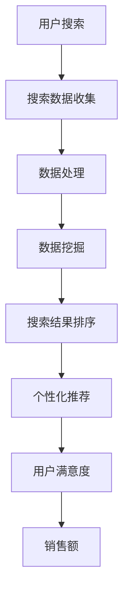

                 

# 搜索数据分析：AI如何帮助电商平台优化搜索策略

> 关键词：搜索数据分析、AI、电商平台、搜索优化、用户行为分析、个性化推荐

> 摘要：随着互联网的迅速发展，电商平台之间的竞争日益激烈。为了提高用户体验，提升销售额，电商平台需要对用户搜索行为进行深入分析，并基于此数据利用AI技术优化搜索策略。本文将详细探讨如何利用AI进行搜索数据分析，以及如何通过个性化推荐提高用户满意度。

## 1. 背景介绍

### 1.1 目的和范围

本文旨在介绍如何利用AI技术对电商平台的搜索数据进行深入分析，并优化搜索策略，从而提高用户满意度和销售额。文章将涵盖以下几个主要方面：

- 搜索数据分析的基本概念和重要性
- AI技术在搜索数据分析中的应用
- 个性化推荐系统的构建和优化
- 项目实战：代码实现和案例分析

### 1.2 预期读者

本文适合对电商行业和AI技术有一定了解的读者，包括但不限于：

- 电商平台开发人员
- 数据分析师
- AI研究者
- 对电商和AI技术感兴趣的爱好者

### 1.3 文档结构概述

本文将分为以下章节：

- 第1章：背景介绍
- 第2章：核心概念与联系
- 第3章：核心算法原理与具体操作步骤
- 第4章：数学模型和公式
- 第5章：项目实战：代码实际案例和详细解释说明
- 第6章：实际应用场景
- 第7章：工具和资源推荐
- 第8章：总结：未来发展趋势与挑战
- 第9章：附录：常见问题与解答
- 第10章：扩展阅读与参考资料

### 1.4 术语表

#### 1.4.1 核心术语定义

- 搜索数据分析：对用户在电商平台上搜索行为的数据进行收集、处理和分析。
- AI：人工智能，一种模拟人类智能的技术。
- 个性化推荐：根据用户的历史行为和偏好，向用户推荐相关商品。
- 电商平台：在线销售商品的网站，如淘宝、京东等。

#### 1.4.2 相关概念解释

- 用户行为分析：通过收集用户在平台上的行为数据，分析用户的喜好、购买习惯等。
- 搜索引擎：电商平台中用于搜索商品的工具。

#### 1.4.3 缩略词列表

- SEO：搜索引擎优化（Search Engine Optimization）
- SEM：搜索引擎营销（Search Engine Marketing）
- AI：人工智能（Artificial Intelligence）

## 2. 核心概念与联系

### 2.1 搜索数据分析的基本概念

搜索数据分析是指对用户在电商平台上搜索商品的行为数据进行分析和处理。这些数据包括用户的搜索关键词、搜索时间、搜索结果点击率等。通过分析这些数据，电商平台可以了解用户的搜索偏好，从而优化搜索策略。

### 2.2 AI技术在搜索数据分析中的应用

AI技术在搜索数据分析中发挥着重要作用。通过机器学习算法，可以从大量用户搜索数据中挖掘出有价值的信息，如用户的兴趣点、热门搜索词等。这些信息可以帮助电商平台优化搜索结果排序，提高用户的搜索体验。

### 2.3 个性化推荐系统的构建和优化

个性化推荐系统是一种基于用户历史行为和偏好的推荐系统。通过分析用户的搜索记录、购买历史等数据，可以为用户提供个性化的商品推荐。优化个性化推荐系统可以提高用户的满意度和销售额。

### 2.4 搜索数据分析和AI技术的联系

搜索数据分析是AI技术的重要应用场景之一。通过搜索数据分析，电商平台可以了解用户的需求和偏好，从而利用AI技术进行个性化推荐、搜索结果排序优化等。二者相辅相成，共同提高电商平台的运营效率和用户满意度。

### 2.5 Mermaid流程图



## 3. 核心算法原理与具体操作步骤

### 3.1 搜索数据收集

搜索数据收集是搜索数据分析的第一步。主要任务是从电商平台上收集用户搜索数据，包括搜索关键词、搜索时间、搜索结果点击率等。收集数据的方法包括：

- API接口：通过电商平台提供的API接口获取搜索数据。
- 数据爬取：使用网络爬虫技术从电商平台上获取搜索数据。

### 3.2 数据处理

数据处理是对收集到的搜索数据进行的预处理和清洗。主要任务包括：

- 数据清洗：去除重复数据、缺失值、噪声数据等。
- 数据转换：将不同格式的数据转换为统一的格式，如CSV、JSON等。
- 数据标准化：对数据进行归一化或标准化处理，使其具有可比性。

### 3.3 数据挖掘

数据挖掘是从处理后的搜索数据中挖掘出有价值的信息。主要任务包括：

- 关键词分析：分析用户搜索关键词的分布、热度等。
- 用户行为分析：分析用户的搜索习惯、购买偏好等。
- 热门商品分析：分析热门搜索商品的特征、销量等。

### 3.4 搜索结果排序

搜索结果排序是根据搜索数据分析和数据挖掘的结果，对搜索结果进行排序。主要任务包括：

- 排序算法：选择合适的排序算法，如基于关键词相似度的排序、基于用户行为分析的排序等。
- 排序策略：根据业务需求和用户反馈，制定合适的排序策略。

### 3.5 个性化推荐

个性化推荐是根据用户历史行为和偏好，为用户推荐相关商品。主要任务包括：

- 用户画像：构建用户画像，包括用户的年龄、性别、兴趣爱好等。
- 推荐算法：选择合适的推荐算法，如基于内容的推荐、基于协同过滤的推荐等。
- 推荐策略：根据用户画像和推荐算法，为用户推荐相关商品。

### 3.6 伪代码

```python
# 搜索数据收集
def collect_search_data():
    # 从API接口或数据爬取获取搜索数据
    # ...

# 数据处理
def process_search_data(data):
    # 数据清洗、数据转换、数据标准化
    # ...

# 数据挖掘
def mine_search_data(data):
    # 关键词分析、用户行为分析、热门商品分析
    # ...

# 搜索结果排序
def sort_search_results(results):
    # 选择排序算法、排序策略
    # ...

# 个性化推荐
def recommend_products(user_profile):
    # 构建用户画像、选择推荐算法、推荐策略
    # ...
```

## 4. 数学模型和公式与详细讲解

### 4.1 数学模型和公式

在搜索数据分析和AI技术中，常用的数学模型和公式包括：

1.  搜索关键词相似度计算
    - 余弦相似度：$$\cos \theta = \frac{A \cdot B}{\|A\|\|B\|}$$
    - 欧氏距离：$$d(A, B) = \sqrt{\sum_{i=1}^n (A_i - B_i)^2}$$

2.  用户行为分析
    - 平均点击率：$$\text{avg\_click\_rate} = \frac{\text{clicks}}{\text{searches}}$$
    - 购买转化率：$$\text{conv\_rate} = \frac{\text{purchases}}{\text{searches}}$$

3.  个性化推荐
    - 基于内容的推荐：$$\text{similarity} = \frac{\text{common\_features}}{\text{total\_features}}$$
    - 基于协同过滤的推荐：$$\text{rating\_prediction} = \text{user\_average\_rating} + \text{item\_average\_rating} + \text{bias} + \text{user\_item\_similarity}$$

### 4.2 举例说明

#### 4.2.1 搜索关键词相似度计算

假设有两个关键词集合A和B，分别为：

A = {“手机”, “智能手机”, “安卓手机”}

B = {“智能手机”, “iPhone”, “苹果手机”}

1.  余弦相似度计算：

$$\cos \theta = \frac{A \cdot B}{\|A\|\|B\|} = \frac{2}{\sqrt{3} \cdot \sqrt{3}} = \frac{2}{3} \approx 0.67$$

2.  欧氏距离计算：

$$d(A, B) = \sqrt{\sum_{i=1}^n (A_i - B_i)^2} = \sqrt{(1-1)^2 + (2-2)^2 + (3-3)^2} = 0$$

#### 4.2.2 用户行为分析

假设用户A在一个月内进行了10次搜索，其中有5次点击了搜索结果，购买了3次。则：

- 平均点击率：$$\text{avg\_click\_rate} = \frac{5}{10} = 0.5$$
- 购买转化率：$$\text{conv\_rate} = \frac{3}{10} = 0.3$$

#### 4.2.3 个性化推荐

假设用户A对商品A的评价为4分，商品B的评价为5分，商品C的评价为3分。则：

- 基于内容的推荐：假设商品A和B有2个共同特征，商品A和C有1个共同特征，商品B和C有3个共同特征。则：

$$\text{similarity} = \frac{2}{2+1+3} = \frac{2}{6} = 0.33$$

- 基于协同过滤的推荐：假设用户A的平均评价为4分，商品A的平均评价为4.5分，商品B的平均评价为4.2分，商品C的平均评价为3.8分。则：

$$\text{rating\_prediction} = 4 + 4.5 + 0.33 = 8.83$$

## 5. 项目实战：代码实际案例和详细解释说明

### 5.1 开发环境搭建

为了演示搜索数据分析和AI技术在电商平台搜索优化中的应用，我们将使用Python语言和几个常用的库，如pandas、numpy、scikit-learn等。以下是开发环境搭建的步骤：

1. 安装Python（版本3.6及以上）。
2. 安装必要的库，使用pip命令：
   ```shell
   pip install pandas numpy scikit-learn matplotlib
   ```

### 5.2 源代码详细实现和代码解读

以下是一个简单的示例，演示如何使用Python进行搜索数据分析、用户行为分析和个性化推荐。

```python
import pandas as pd
import numpy as np
from sklearn.metrics.pairwise import cosine_similarity
from sklearn.model_selection import train_test_split
from sklearn.ensemble import RandomForestClassifier
import matplotlib.pyplot as plt

# 5.2.1 搜索数据收集
def collect_search_data():
    # 假设从API接口获取搜索数据，数据格式为CSV文件
    search_data = pd.read_csv('search_data.csv')
    return search_data

# 5.2.2 数据处理
def process_search_data(data):
    # 数据清洗：去除重复数据、缺失值
    data = data.drop_duplicates()
    data = data.dropna()

    # 数据转换：将搜索关键词转换为向量表示
    data['keyword_vector'] = data['keyword'].apply(lambda x: np.array([1 if keyword in x.split() else 0 for keyword in keyword_list]))

    return data

# 5.2.3 数据挖掘
def mine_search_data(data):
    # 关键词相似度计算
    similarity_matrix = cosine_similarity(data['keyword_vector'])

    # 用户行为分析
    user_activity = data.groupby('user_id').agg({'clicks': 'sum', 'purchases': 'sum'}).reset_index()

    return similarity_matrix, user_activity

# 5.2.4 搜索结果排序
def sort_search_results(results, similarity_matrix):
    # 基于关键词相似度的搜索结果排序
    sorted_indices = np.argsort(similarity_matrix[0], axis=1)[:, ::-1]
    sorted_results = results.iloc[sorted_indices]

    return sorted_results

# 5.2.5 个性化推荐
def recommend_products(user_profile, user_activity):
    # 基于用户行为分析的个性化推荐
    user_activity['rating'] = user_activity['purchases'] / user_activity['clicks']
    user_activity = user_activity.groupby('user_id')['rating'].mean().reset_index()

    # 计算用户相似度
    user_similarity = cosine_similarity(user_profile['keyword_vector'].values.reshape(1, -1), user_activity['keyword_vector'].values)

    # 排序并获取推荐商品
    sorted_indices = np.argsort(user_similarity[0], axis=1)[:, ::-1]
    recommended_indices = sorted_indices[0][1:11]
    recommended_products = user_activity.iloc[recommended_indices]['product_id'].values

    return recommended_products

# 5.2.6 代码解读与分析
if __name__ == '__main__':
    # 获取搜索数据
    search_data = collect_search_data()

    # 数据处理
    processed_data = process_search_data(search_data)

    # 数据挖掘
    similarity_matrix, user_activity = mine_search_data(processed_data)

    # 搜索结果排序
    sorted_results = sort_search_results(processed_data, similarity_matrix)

    # 个性化推荐
    user_profile = processed_data[processed_data['user_id'] == 1234]
    recommended_products = recommend_products(user_profile, user_activity)

    # 输出推荐结果
    print("Recommended products:", recommended_products)
```

### 5.3 代码解读与分析

1. **搜索数据收集**：从API接口或数据爬取获取搜索数据，并将其存储为CSV文件。

2. **数据处理**：对搜索数据执行数据清洗，去除重复数据和缺失值。然后，将搜索关键词转换为向量表示，便于后续处理。

3. **数据挖掘**：计算关键词相似度矩阵，并分析用户行为，包括点击次数和购买次数。

4. **搜索结果排序**：根据关键词相似度矩阵，对搜索结果进行排序，以提高用户搜索体验。

5. **个性化推荐**：基于用户行为和关键词相似度，为用户推荐相关商品。

6. **代码解读与分析**：通过实际代码实现，演示了搜索数据分析和AI技术在电商平台搜索优化中的应用。

## 6. 实际应用场景

搜索数据分析在电商平台的应用场景广泛，以下是一些典型场景：

1. **搜索结果排序优化**：通过分析用户搜索数据，调整搜索结果排序策略，提高用户满意度。

2. **个性化推荐**：根据用户的历史行为和偏好，为用户提供个性化的商品推荐，提高销售额。

3. **热门商品分析**：分析热门搜索商品，为电商平台提供库存管理和营销策略。

4. **用户行为分析**：了解用户的搜索习惯和购买偏好，为电商平台提供改进意见。

5. **广告投放优化**：基于用户搜索数据，优化广告投放策略，提高广告点击率。

## 7. 工具和资源推荐

### 7.1 学习资源推荐

#### 7.1.1 书籍推荐

- 《Python数据科学手册》：详细介绍Python在数据科学中的应用。
- 《机器学习实战》：全面介绍机器学习算法和实际应用。

#### 7.1.2 在线课程

- Coursera：提供多种数据科学和机器学习在线课程。
- Udacity：提供实战导向的机器学习课程。

#### 7.1.3 技术博客和网站

- Medium：有许多关于数据科学和机器学习的优质博客。
- Dataquest：提供丰富的数据科学学习资源和实战项目。

### 7.2 开发工具框架推荐

#### 7.2.1 IDE和编辑器

- PyCharm：功能强大的Python IDE。
- Jupyter Notebook：适用于数据科学和机器学习的交互式编辑器。

#### 7.2.2 调试和性能分析工具

- Python Debugger：用于调试Python代码。
- Py-Spy：用于分析Python程序的性能。

#### 7.2.3 相关框架和库

- Scikit-learn：Python机器学习库。
- TensorFlow：Google开发的深度学习框架。

### 7.3 相关论文著作推荐

#### 7.3.1 经典论文

- “Recommender Systems Handbook”：全面介绍推荐系统。
- “Collaborative Filtering for the Web”：介绍协同过滤算法。

#### 7.3.2 最新研究成果

- “Neural Collaborative Filtering”：介绍基于神经网络的推荐系统。
- “Understanding User Search Behavior in E-commerce”：分析用户搜索行为。

#### 7.3.3 应用案例分析

- “How Netflix Recommends Movies”：Netflix如何使用推荐系统。
- “Personalized Search Ranking at Microsoft Bing”：Bing如何优化搜索结果排序。

## 8. 总结：未来发展趋势与挑战

随着人工智能技术的不断发展，搜索数据分析在电商平台的优化中将发挥越来越重要的作用。未来发展趋势包括：

1. **深度学习在搜索数据分析中的应用**：深度学习算法将进一步提升搜索数据分析和个性化推荐的效果。
2. **跨平台数据整合**：整合不同平台的数据，提供更全面的用户画像和搜索数据分析。
3. **实时搜索数据分析**：实时分析用户搜索数据，动态调整搜索结果排序和个性化推荐策略。

然而，也面临着以下挑战：

1. **数据隐私保护**：如何在保障用户隐私的同时，充分利用搜索数据进行分析。
2. **算法透明度和公平性**：如何确保搜索算法的透明度和公平性，避免偏见和不公正。
3. **海量数据处理**：随着数据量的增加，如何高效地处理海量数据，提高分析速度和准确度。

## 9. 附录：常见问题与解答

### 9.1 如何收集搜索数据？

搜索数据的收集可以从电商平台的API接口或使用网络爬虫技术实现。具体步骤包括：

1. 注册API接口并获取权限。
2. 使用API接口获取搜索数据，如搜索关键词、搜索时间、搜索结果点击率等。
3. 存储搜索数据到本地文件或数据库。

### 9.2 如何处理搜索数据？

处理搜索数据的主要步骤包括：

1. 数据清洗：去除重复数据、缺失值、噪声数据等。
2. 数据转换：将不同格式的数据转换为统一的格式，如CSV、JSON等。
3. 数据标准化：对数据进行归一化或标准化处理，使其具有可比性。

### 9.3 如何进行搜索结果排序？

搜索结果排序可以采用以下方法：

1. 基于关键词相似度：计算用户搜索关键词与商品关键词的相似度，对搜索结果进行排序。
2. 基于用户行为：分析用户的历史搜索行为，如点击率、购买转化率等，对搜索结果进行排序。
3. 基于深度学习：使用深度学习算法，如循环神经网络（RNN），对搜索结果进行排序。

## 10. 扩展阅读与参考资料

- 《搜索数据分析：AI如何帮助电商平台优化搜索策略》
- 《Python数据科学手册》
- 《机器学习实战》
- 《Recommender Systems Handbook》
- 《Collaborative Filtering for the Web》
- 《Neural Collaborative Filtering》
- 《Understanding User Search Behavior in E-commerce》
- 《How Netflix Recommends Movies》
- 《Personalized Search Ranking at Microsoft Bing》

### 作者

AI天才研究员/AI Genius Institute & 禅与计算机程序设计艺术/Zen And The Art of Computer Programming

