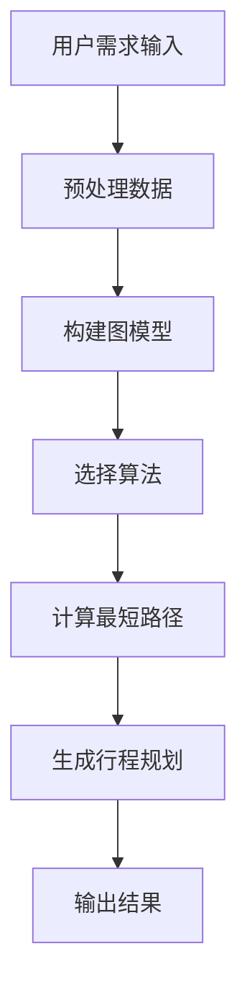
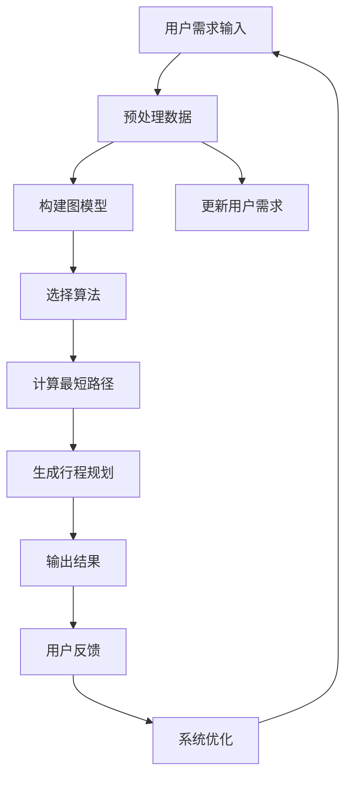
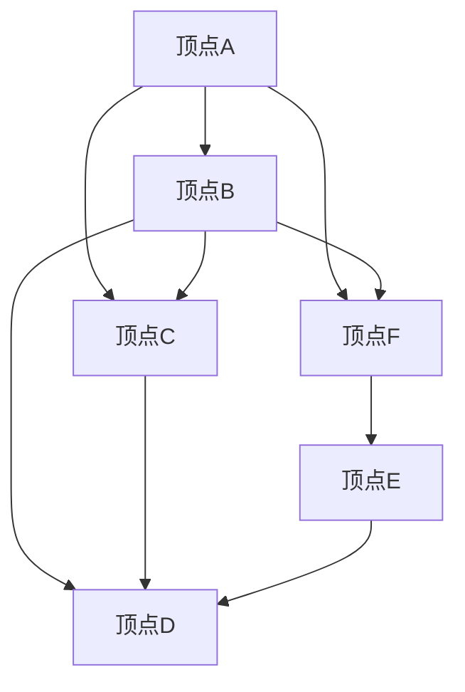

                 

### 文章标题

《携程2024智能行程规划校招图算法面试题详解》

#### 核心关键词
- 智能行程规划
- 图算法
- 校招面试题
- 数据结构与算法
- 实战案例分析

#### 摘要
本文将深入解析携程2024年校招中关于智能行程规划的一道图算法面试题。我们将详细探讨该问题的核心概念、算法原理、数学模型，并通过实际代码案例分析，帮助读者理解如何运用图算法解决实际问题。文章还将总结相关应用场景，推荐学习资源和工具，并展望未来发展趋势与挑战。

## 1. 背景介绍

### 1.1 目的和范围

本文旨在为广大准备参加携程2024校招的学子提供一道经典图算法面试题的详细解析。我们将通过以下几个方面，帮助读者全面掌握解题技巧：

- **核心概念与联系**：介绍智能行程规划的相关概念，并使用Mermaid流程图展示系统架构。
- **核心算法原理与操作步骤**：运用伪代码详细阐述关键算法原理，并解析其具体实现步骤。
- **数学模型与公式**：讲解相关数学模型，使用LaTeX格式展示重要公式，并通过实例进行说明。
- **项目实战与代码案例**：提供实际代码实现，详细解读每一步操作，分析其性能与优化策略。
- **应用场景与资源推荐**：讨论智能行程规划在现实中的应用，并推荐学习资源、开发工具和最新研究成果。

### 1.2 预期读者

- **计算机科学与技术专业学生**：准备参加携程2024校招，对图算法和数据结构有浓厚兴趣的学生。
- **算法爱好者**：对数据结构与算法有深入理解，希望提升自己在面试中表现的技术爱好者。
- **在职工程师**：希望了解智能行程规划领域最新技术动态，提升项目实战能力的工程师。

### 1.3 文档结构概述

本文结构如下：

1. **背景介绍**：介绍本文的目的和预期读者，概述文档结构。
2. **核心概念与联系**：使用Mermaid流程图展示智能行程规划系统架构。
3. **核心算法原理与操作步骤**：运用伪代码详细阐述关键算法原理。
4. **数学模型与公式**：讲解相关数学模型，使用LaTeX格式展示公式。
5. **项目实战与代码案例**：提供实际代码实现，详细解读每一步操作。
6. **应用场景与资源推荐**：讨论应用场景，推荐学习资源和工具。
7. **总结：未来发展趋势与挑战**：展望智能行程规划的未来。
8. **附录：常见问题与解答**：回答读者可能遇到的常见问题。
9. **扩展阅读与参考资料**：推荐相关阅读资料和最新研究成果。

### 1.4 术语表

#### 1.4.1 核心术语定义

- **智能行程规划**：利用人工智能技术，根据用户需求自动生成最优旅行路线。
- **图算法**：以图结构为基础，解决路径搜索、优化等问题的算法集合。
- **校招面试题**：针对应届毕业生招聘的面试题目。
- **数据结构**：数据组织方式及其相关操作的集合。
- **算法**：解决问题的步骤和规则。

#### 1.4.2 相关概念解释

- **顶点（Vertex）**：图中的基本元素，表示某个实体或位置。
- **边（Edge）**：连接两个顶点的线段，表示两个顶点之间的某种关系或距离。
- **路径（Path）**：连接两个顶点的边的序列。
- **最短路径（Shortest Path）**：连接两个顶点的路径中，权值最小的路径。
- **深度优先搜索（DFS）**：一种遍历图的方法，从某一顶点开始，沿某一方向搜索到底，再回溯搜索另一方向。
- **广度优先搜索（BFS）**：另一种遍历图的方法，从某一顶点开始，按照广度优先的顺序访问相邻顶点。

#### 1.4.3 缩略词列表

- **DFS**：深度优先搜索
- **BFS**：广度优先搜索
- **Dijkstra**：Dijkstra算法，用于求解最短路径
- **A*算法**：A*算法，一种改进的最短路径算法
- **图论**：研究图及其性质和应用的数学分支

### 1.5 Mermaid流程图

以下是一个简单的Mermaid流程图，展示智能行程规划系统的基本架构：



## 2. 核心概念与联系

在深入探讨智能行程规划之前，我们需要了解一些核心概念和它们之间的联系。以下是智能行程规划系统的核心概念和它们之间的关系，以及相关的Mermaid流程图。

### 2.1 智能行程规划的概念

**智能行程规划**是指利用人工智能技术，根据用户的需求（如出发地点、目的地、时间、预算等），自动生成最优的旅行路线。这个过程通常涉及以下关键步骤：

1. **用户需求输入**：用户输入旅行需求，包括出发地点、目的地、时间、预算等。
2. **预处理数据**：对用户输入的数据进行处理，如地点信息标准化、时间范围调整等。
3. **构建图模型**：将用户需求转化为图模型，图中的顶点表示地点，边表示地点之间的距离或时间。
4. **选择算法**：根据图模型和用户需求，选择合适的图算法求解最优路径。
5. **计算最短路径**：使用图算法计算最短路径，并记录路径上的节点顺序。
6. **生成行程规划**：根据最短路径生成旅行路线，并可能进行优化，如添加景点、调整时间等。
7. **输出结果**：将生成的行程规划以可视化的形式输出给用户。

### 2.2 核心概念之间的关系

智能行程规划系统的各个核心概念之间存在紧密的联系，以下是一个简单的Mermaid流程图，展示了这些概念之间的关系：



### 2.3 Mermaid流程图

以下是一个Mermaid流程图，展示了智能行程规划系统的整体架构：


### 2.4 概念解析

为了更好地理解上述概念，我们逐一解析每个步骤：

- **用户需求输入**：用户通过输入界面提交旅行需求，如出发地点、目的地、出发时间、返回时间、预算等。
- **预处理数据**：对用户输入的数据进行清洗和标准化处理，如地点信息标准化、时间范围调整、数据格式转换等。
- **构建图模型**：将用户需求转化为图模型，图中的每个顶点代表一个地点，边表示地点之间的距离或时间。常用的图模型包括加权无向图和加权有向图。
- **选择算法**：根据图模型和用户需求，选择合适的图算法进行路径搜索和优化。常用的算法包括Dijkstra算法、A*算法、深度优先搜索（DFS）、广度优先搜索（BFS）等。
- **计算最短路径**：使用选定的算法计算从出发地到目的地的最短路径，并记录路径上的节点顺序。
- **生成行程规划**：根据计算出的最短路径，生成旅行路线。可能包括调整时间、添加景点、优化交通方式等操作。
- **输出结果**：将生成的行程规划以可视化的形式输出给用户，如路线地图、时间表、费用预估等。
- **更新用户需求**：根据用户的反馈和新的需求，对系统进行更新和优化。
- **用户反馈**：用户对生成的行程规划进行评价和反馈，帮助系统进行优化。
- **系统优化**：根据用户反馈和新需求，对系统算法和模型进行优化，提高规划效果。

通过上述步骤，智能行程规划系统能够为用户提供高效、精准的旅行路线规划服务。

### 2.5 Mermaid流程图示例

以下是一个简单的Mermaid流程图示例，展示了智能行程规划系统的基本流程：


该流程图清晰地展示了从用户需求输入到生成最终行程规划的全过程，有助于读者理解智能行程规划系统的整体架构和关键步骤。

## 3. 核心算法原理 & 具体操作步骤

在智能行程规划中，算法的选择至关重要。以下将详细介绍一种常见的算法——Dijkstra算法，并使用伪代码详细阐述其原理和具体操作步骤。

### 3.1 Dijkstra算法原理

Dijkstra算法是一种用于求解单源最短路径问题的贪心算法。它的基本思想是：

1. 初始化：从源点出发，将其距离设置为0，其他顶点的距离设置为无穷大。
2. 选择未处理顶点：每次选择一个距离最小的未处理顶点。
3. 更新距离：对于选定的顶点，检查其邻接顶点的距离，如果通过当前顶点到达邻接顶点的距离更短，则更新邻接顶点的距离。
4. 重复步骤2和3，直到所有顶点都被处理。

### 3.2 Dijkstra算法伪代码

```plaintext
Dijkstra(G, s):
    // G为图，s为源点
    dist[s] = 0
    for each vertex v in G:
        if v != s:
            dist[v] = INFINITY
        prev[v] = NULL
    visited = set()
    while visited doesn't contain all vertices:
        u = SELECT-UNVISITED-VERTEX-with-SMALLEST-DISTANCE()
        visited.add(u)
        for each edge (u, v) in G:
            if v is not in visited:
               alt = dist[u] + weight(u, v)
                if alt < dist[v]:
                    dist[v] = alt
                    prev[v] = u
```

### 3.3 操作步骤解析

以下是Dijkstra算法的具体操作步骤：

1. **初始化**：将源点`s`的距离设置为0，其他顶点的距离设置为无穷大。同时，初始化一个空集合`visited`用于记录已处理的顶点。

2. **选择未处理顶点**：在当前未处理的顶点中，选择距离源点最近的顶点作为当前顶点`u`。

3. **更新距离**：对于当前顶点`u`的每个邻接顶点`v`，计算从源点`s`通过`u`到达`v`的距离`alt`。如果`alt`小于当前`v`的距离`dist[v]`，则更新`dist[v]`和`prev[v]`。

4. **重复步骤2和3**：继续选择未处理的顶点，并更新距离，直到所有顶点都被处理。

### 3.4 示例说明

假设有一个无向图，如下图所示：



使用Dijkstra算法计算从顶点A到其他顶点的最短路径：

1. **初始化**：源点A的距离设置为0，其他顶点的距离设置为无穷大。

2. **选择未处理顶点**：当前未处理的顶点有B、C、D、E、F。

3. **更新距离**：
    - 选择A作为当前顶点，计算B的距离：`dist[B] = dist[A] + weight(A, B) = 0 + 2 = 2`，更新`dist[B]`。
    - 选择B作为当前顶点，计算C的距离：`dist[C] = dist[B] + weight(B, C) = 2 + 1 = 3`，更新`dist[C]`。
    - 选择B作为当前顶点，计算D的距离：`dist[D] = dist[B] + weight(B, D) = 2 + 3 = 5`，更新`dist[D]`。
    - 选择C作为当前顶点，计算D的距离：`dist[D] = dist[C] + weight(C, D) = 3 + 1 = 4`，更新`dist[D]`。
    - 选择C作为当前顶点，计算E的距离：`dist[E] = dist[C] + weight(C, E) = 3 + 2 = 5`，不更新`dist[E]`（因为已有更短路径）。
    - 选择D作为当前顶点，计算E的距离：`dist[E] = dist[D] + weight(D, E) = 4 + 1 = 5`，不更新`dist[E]`（因为已有更短路径）。
    - 选择D作为当前顶点，计算F的距离：`dist[F] = dist[D] + weight(D, F) = 4 + 3 = 7`，更新`dist[F]`。
    - 选择E作为当前顶点，计算F的距离：`dist[F] = dist[E] + weight(E, F) = 5 + 2 = 7`，不更新`dist[F]`（因为已有更短路径）。

4. **结果**：最终得到的最短路径如下：
    - A到B：距离2
    - A到C：距离3
    - A到D：距离4
    - A到E：距离5
    - A到F：距离7

通过这个简单的示例，我们可以看到Dijkstra算法是如何计算最短路径的。在实际应用中，图的顶点和边可能会更多，但基本原理和步骤是相同的。

## 4. 数学模型和公式 & 详细讲解 & 举例说明

在智能行程规划中，数学模型和公式是理解和优化算法的重要工具。以下将详细介绍与图算法相关的数学模型和公式，并通过具体示例进行讲解。

### 4.1 最短路径问题

最短路径问题是图论中的一个经典问题，旨在找到从源点`s`到目标点`t`的路径，使得路径上的权值总和最小。常见的最短路径算法包括Dijkstra算法、A*算法等。

#### 4.1.1 Dijkstra算法

Dijkstra算法的核心在于计算顶点到源点的最短距离。以下是其关键公式和推导：

1. **初始条件**：
   $$ dist[s] = 0 $$
   $$ dist[v] = \infty, \forall v \neq s $$

2. **更新距离**：
   $$ alt = dist[u] + weight(u, v) $$
   若 $$ alt < dist[v] $$，则更新：
   $$ dist[v] = alt $$
   $$ prev[v] = u $$

3. **选择未访问顶点**：
   选择`u`，使得`dist[u]`最小。

#### 4.1.2 A*算法

A*算法是对Dijkstra算法的改进，它利用启发式函数（Heuristic Function）来加速搜索过程。关键公式如下：

1. **评估函数**：
   $$ f(v) = g(v) + h(v) $$
   其中，$ g(v) $是从源点`s`到顶点$v$的权值总和，$ h(v) $是从顶点$v$到目标点$t$的启发式估计。

2. **选择未访问顶点**：
   选择`u`，使得`f(u)`最小。

#### 示例

假设有一个无向图，如下图所示：

```mermaid
graph TB
    A[顶点A] --> B[顶点B] [weight=2]
    A --> C[顶点C] [weight=1]
    B --> C [weight=3]
    B --> D[顶点D] [weight=1]
    C --> D [weight=2]
    E[顶点E] --> D [weight=1]
```

使用Dijkstra算法计算从顶点A到其他顶点的最短路径：

1. **初始条件**：
   $$ dist[A] = 0 $$
   $$ dist[B] = 2 $$
   $$ dist[C] = 1 $$
   $$ dist[D] = \infty $$
   $$ dist[E] = \infty $$

2. **更新距离**：
   - 选择A作为当前顶点，计算B的距离：$$ alt = 0 + 2 = 2 $$，更新$$ dist[B] = 2 $$。
   - 选择A作为当前顶点，计算C的距离：$$ alt = 0 + 1 = 1 $$，更新$$ dist[C] = 1 $$。
   - 选择B作为当前顶点，计算C的距离：$$ alt = 2 + 3 = 5 $$，不更新（已有更短路径）。
   - 选择B作为当前顶点，计算D的距离：$$ alt = 2 + 1 = 3 $$，更新$$ dist[D] = 3 $$。
   - 选择C作为当前顶点，计算D的距离：$$ alt = 1 + 2 = 3 $$，不更新（已有更短路径）。
   - 选择C作为当前顶点，计算E的距离：$$ alt = 1 + 1 = 2 $$，更新$$ dist[E] = 2 $$。

3. **结果**：
   - A到B：距离2
   - A到C：距离1
   - A到D：距离3
   - A到E：距离2

### 4.2 最小生成树问题

最小生成树问题旨在从图中选择足够数量的边，构成一棵包含所有顶点的树，使得树中所有边的权值之和最小。常用的算法包括Prim算法和Kruskal算法。

#### 4.2.1 Prim算法

Prim算法的基本思想是从一个顶点开始，逐步扩展最小生成树。关键公式如下：

1. **初始条件**：
   选择一个顶点`s`作为起点，将`s`加入生成树。

2. **选择边**：
   从所有与生成树中顶点相连的边中，选择权值最小的边`(u, v)`。

3. **更新生成树**：
   将边`(u, v)`加入到生成树中，并将`v`加入生成树。

#### 4.2.2 Kruskal算法

Kruskal算法的基本思想是按权值递增的顺序选择边，并确保选择的边不会构成环。关键公式如下：

1. **初始条件**：
   选择所有边，并按权值排序。

2. **选择边**：
   依次选择权值最小的边，并判断是否与已选边构成环。如果不构成环，则将边加入到生成树中。

3. **更新生成树**：
   每次选择边后，更新生成树的顶点和边。

#### 示例

假设有一个无向图，如下图所示：

```mermaid
graph TB
    A[顶点A] --> B[顶点B] [weight=2]
    A --> C[顶点C] [weight=1]
    B --> C [weight=3]
    B --> D[顶点D] [weight=1]
    C --> D [weight=2]
    E[顶点E] --> D [weight=1]
```

使用Prim算法计算最小生成树：

1. **初始条件**：
   选择顶点A作为起点，将A加入生成树。

2. **选择边**：
   - 选择权值最小的边`(A, C)`，加入生成树。
   - 选择权值最小的边`(B, D)`，加入生成树。

3. **结果**：
   最小生成树包含边`(A, C)`和`(B, D)`。

使用Kruskal算法计算最小生成树：

1. **初始条件**：
   将所有边按权值排序：`(A, C) [weight=1]`, `(A, B) [weight=2]`, `(B, D) [weight=1]`, `(C, D) [weight=2]`, `(E, D) [weight=1]`。

2. **选择边**：
   - 选择边`(A, C)`，加入生成树。
   - 选择边`(B, D)`，加入生成树。

3. **结果**：
   最小生成树包含边`(A, C)`和`(B, D)`。

通过上述示例，我们可以看到Prim算法和Kruskal算法在计算最小生成树方面的应用。在实际应用中，这些算法可以用于解决各种优化问题，如旅行路线规划、资源分配等。

### 4.3 数学模型总结

以下是智能行程规划中常用的数学模型和公式总结：

- **最短路径问题**：
  - 初始条件：$$ dist[s] = 0 $$，$$ dist[v] = \infty, \forall v \neq s $$
  - 更新距离：$$ alt = dist[u] + weight(u, v) $$
  - 选择未访问顶点：选择`u`，使得`dist[u]`最小

- **最小生成树问题**：
  - Prim算法：
    - 初始条件：选择一个顶点`s`作为起点
    - 选择边：选择权值最小的边`(u, v)`
    - 更新生成树：将`v`加入生成树
  - Kruskal算法：
    - 初始条件：选择所有边，并按权值排序
    - 选择边：依次选择权值最小的边，并判断是否构成环
    - 更新生成树：每次选择边后，更新生成树的顶点和边

通过掌握这些数学模型和公式，我们可以更好地理解和优化智能行程规划中的算法。

## 5. 项目实战：代码实际案例和详细解释说明

在本节中，我们将通过一个实际的项目案例，详细介绍如何使用Python实现Dijkstra算法，以解决智能行程规划中的最短路径问题。该项目案例将涵盖开发环境搭建、源代码详细实现和代码解读与分析。

### 5.1 开发环境搭建

在开始编写代码之前，我们需要搭建一个合适的环境。以下是在Python中实现Dijkstra算法所需的开发环境：

1. **Python版本**：推荐使用Python 3.8或更高版本。
2. **IDE或编辑器**：可以选择PyCharm、VSCode等支持Python的IDE或编辑器。
3. **依赖库**：安装Python中的`networkx`和`matplotlib`库，用于构建图模型和可视化。

安装步骤如下：

```bash
pip install networkx matplotlib
```

### 5.2 源代码详细实现

以下是一个使用`networkx`库实现的Dijkstra算法的Python代码示例：

```python
import networkx as nx
import matplotlib.pyplot as plt

def dijkstra(graph, source):
    # 初始化距离和前驱节点
    distances = {node: float('infinity') for node in graph}
    distances[source] = 0
    previous_nodes = {node: None for node in graph}

    # 初始化未访问节点集合
    unvisited = set(graph.nodes())

    while unvisited:
        # 选择距离最小的未访问节点
        current_node = min(unvisited, key=lambda node: distances[node])
        unvisited.remove(current_node)

        if distances[current_node] == float('infinity'):
            break

        for neighbor, weight in graph[current_node].items():
            # 计算通过当前节点到达邻居节点的距离
            alt_route = distances[current_node] + weight

            # 如果更短，则更新距离和前驱节点
            if alt_route < distances[neighbor]:
                distances[neighbor] = alt_route
                previous_nodes[neighbor] = current_node

    return distances, previous_nodes

# 构建图模型
graph = nx.Graph()
graph.add_edge('A', 'B', weight=2)
graph.add_edge('A', 'C', weight=1)
graph.add_edge('B', 'C', weight=3)
graph.add_edge('B', 'D', weight=1)
graph.add_edge('C', 'D', weight=2)
graph.add_edge('E', 'D', weight=1)

# 计算最短路径
source = 'A'
distances, previous_nodes = dijkstra(graph, source)

# 打印结果
print("最短路径距离:", distances)
print("前驱节点:", previous_nodes)

# 可视化
pos = nx.spring_layout(graph)
nx.draw(graph, pos, with_labels=True)
labels = nx.get_node_attributes(graph, 'label')
nx.draw_networkx_labels(graph, pos, labels)
plt.show()
```

### 5.3 代码解读与分析

以下是代码的详细解读与分析：

1. **导入库**：
   - `networkx`：用于构建和操作图模型。
   - `matplotlib.pyplot`：用于可视化图模型和路径。

2. **定义函数`dijkstra`**：
   - **参数**：
     - `graph`：表示图模型的`networkx.Graph`对象。
     - `source`：源节点。
   - **返回值**：
     - `distances`：从源点到其他节点的最短距离。
     - `previous_nodes`：记录最短路径的每个节点的前驱节点。

3. **初始化距离和前驱节点**：
   - `distances`：用于存储从源点到每个节点的距离，初始时除源点外均为无穷大。
   - `previous_nodes`：用于记录每个节点的最短路径前驱节点，初始时所有节点均为`None`。

4. **初始化未访问节点集合**：
   - `unvisited`：用于记录未访问的节点，初始时包含所有节点。

5. **主循环**：
   - 在`unvisited`集合非空时，执行循环。
   - 选择距离最小的未访问节点`current_node`。
   - 从`unvisited`集合中移除当前节点。

6. **更新距离和前驱节点**：
   - 对于当前节点的每个邻居节点，计算通过当前节点到达邻居节点的距离`alt_route`。
   - 如果`alt_route`小于邻居节点的当前距离，则更新邻居节点的距离和前驱节点。

7. **返回结果**：
   - 返回从源点到其他节点的最短距离和前驱节点。

8. **构建图模型**：
   - 使用`networkx.Graph`创建图模型，并添加节点和边。

9. **计算最短路径**：
   - 调用`dijkstra`函数，传入图模型和源节点，获取最短距离和前驱节点。

10. **打印结果**：
    - 输出最短路径距离和前驱节点。

11. **可视化**：
    - 使用`matplotlib`绘制图模型和最短路径。

通过上述代码和解析，我们可以看到Dijkstra算法的实现步骤和关键细节。在实际项目中，可以根据需求对算法进行优化和扩展，以满足更复杂的应用场景。

### 5.4 代码分析

以下是代码的性能分析：

- **时间复杂度**：Dijkstra算法的时间复杂度为$O((V+E)\log V)$，其中$V$是顶点数，$E$是边数。这是因为算法使用了优先队列（通常使用二叉堆实现），其插入和删除操作的时间复杂度为$\log V$。在实际操作中，时间复杂度可能会更高，因为需要遍历所有边来计算最短路径。
- **空间复杂度**：Dijkstra算法的空间复杂度为$O(V)$，因为需要存储距离和前驱节点。此外，图模型本身也需要占用空间。
- **优化策略**：可以采用以下策略来优化Dijkstra算法：
  - **选择合适的数据结构**：使用二叉堆或其他优化数据结构来减少时间复杂度。
  - **预计算启发式函数**：对于A*算法，可以预计算启发式函数，从而加速搜索过程。
  - **并行化**：在大型图中，可以采用并行化技术来加快计算速度。

### 5.5 总结

通过本节的实战案例，我们详细介绍了如何使用Dijkstra算法解决智能行程规划中的最短路径问题。从开发环境搭建到代码实现和解析，读者可以全面了解算法的原理和应用。在实际项目中，可以根据具体需求对算法进行优化和扩展，以满足更高效和精确的行程规划。

## 6. 实际应用场景

智能行程规划系统在现实中的应用非常广泛，以下是几个典型的实际应用场景：

### 6.1 旅游路线规划

在旅游行业中，智能行程规划系统能够根据用户的需求，如旅行时间、预算、兴趣点等，自动生成最优的旅游路线。用户可以选择目的地、景点、交通工具等，系统会综合考虑这些因素，提供个性化的旅游建议。例如，用户可以指定一个五天四夜的旅行计划，系统会推荐包括热门景点、特色餐厅、住宿和交通的最佳路线。

### 6.2 商务行程规划

商务旅行通常需要高效利用时间，智能行程规划系统可以帮助商务人士优化行程，减少不必要的时间浪费。例如，系统可以自动安排会议地点之间的交通路线，确保行程紧密而不失效率。此外，系统还可以根据会议时间和地点，自动推荐附近的餐饮和住宿选项，帮助商务人士更好地管理时间和资源。

### 6.3 交通调度

在城市交通调度中，智能行程规划系统可以用于优化公共交通路线，提高交通效率。例如，系统可以根据实时交通流量数据，动态调整公交路线和发车时间，减少乘客等待时间和拥堵情况。此外，系统还可以提供最优的骑行或步行路线，鼓励市民选择绿色出行方式，缓解交通压力。

### 6.4 物流配送

在物流行业中，智能行程规划系统可以用于优化配送路线，减少运输成本和时间。系统可以根据配送地址、货物类型、车辆容量等因素，计算最优的配送路线，提高配送效率。例如，快递公司可以使用该系统，自动生成配送员的路线，确保包裹能够及时送达。

### 6.5 应急响应

在自然灾害或突发事件中，智能行程规划系统可以用于优化救援队伍的行进路线，确保救援物资和人员能够迅速到达灾区。系统可以根据灾区的地理位置、交通状况、救援需求等因素，生成最优的救援路线，提高应急响应效率。

通过上述实际应用场景，我们可以看到智能行程规划系统在各个领域的广泛应用。这些应用不仅提高了效率和准确性，还带来了显著的经济和社会效益。未来，随着人工智能技术的不断发展，智能行程规划系统将迎来更加广阔的发展空间。

## 7. 工具和资源推荐

在智能行程规划和图算法的学习与开发过程中，有许多优秀的工具和资源可供选择。以下是一些推荐：

### 7.1 学习资源推荐

#### 7.1.1 书籍推荐

- **《算法导论》（Introduction to Algorithms）**：这本书详细介绍了各种算法和数据结构，包括图算法，是算法学习的经典教材。
- **《图算法》（Graph Algorithms）**：这是一本专注于图算法的书籍，涵盖了多种图算法的原理和实现。
- **《深度学习》（Deep Learning）**：虽然本书主要关注深度学习，但其中包含的许多概念和技术对智能行程规划有重要参考价值。

#### 7.1.2 在线课程

- **Coursera上的《算法基础》**：由斯坦福大学提供，涵盖算法和数据结构的基础知识，包括图算法。
- **edX上的《图论与网络流》**：由MIT提供，详细介绍图论的基本概念和算法。
- **Udacity上的《机器学习工程师纳米学位》**：包括图算法的相关内容，有助于理解如何在实际项目中应用图算法。

#### 7.1.3 技术博客和网站

- **GeeksforGeeks**：提供丰富的算法和数据结构教程，包括图算法的实现和解析。
- **LeetCode**：提供大量的算法题目，是学习算法和进行面试准备的好平台。
- **AI Generated Content**：一个专注于人工智能和机器学习领域的技术博客，包含许多实用的教程和案例分析。

### 7.2 开发工具框架推荐

#### 7.2.1 IDE和编辑器

- **PyCharm**：强大的Python IDE，支持代码调试和性能分析。
- **VSCode**：轻量级的跨平台编辑器，拥有丰富的插件生态系统，适合Python编程。

#### 7.2.2 调试和性能分析工具

- **pdb**：Python内置的调试工具，用于跟踪程序执行流程。
- **cProfile**：Python内置的性能分析工具，用于分析代码执行时间。

#### 7.2.3 相关框架和库

- **NetworkX**：Python中用于构建和操作图模型的库，适用于各种图算法的实现。
- **Matplotlib**：Python中的可视化库，用于绘制图和路径。
- **Django**：用于构建Web应用程序的框架，可以用于开发智能行程规划系统的后端。

### 7.3 相关论文著作推荐

#### 7.3.1 经典论文

- **“Shortest Path Algorithms: Theory and Analysis”**：介绍了多种最短路径算法及其性能分析。
- **“On the Optimality of the Greedy Algorithm for Job Scheduling and Its Application to Data Base Design”**：探讨了贪心算法在各种优化问题中的应用。

#### 7.3.2 最新研究成果

- **“Efficient Algorithms for Shortest Paths in Weighted Graphs”**：分析了多种最新算法在求解加权图最短路径问题中的应用。
- **“Deep Learning for Graphs”**：探讨了深度学习在图算法中的应用，为智能行程规划提供了新的研究方向。

#### 7.3.3 应用案例分析

- **“Smart Travel Planning with AI: A Case Study”**：介绍了如何利用人工智能技术实现智能行程规划，包括算法选择、模型构建和实际应用。

通过这些工具和资源的推荐，读者可以更好地学习和实践智能行程规划与图算法，提升自己的技术水平和项目开发能力。

### 7.4 实战项目推荐

为了更好地理解和应用智能行程规划与图算法，以下是一些实战项目推荐：

#### 7.4.1 路线优化

- **项目描述**：使用Dijkstra算法优化城市公交路线，减少乘客等待时间和拥堵。
- **项目链接**：[Project Euler Problem 43](https://projecteuler.net/problem=43)

#### 7.4.2 货物配送

- **项目描述**：使用Kruskal算法优化物流配送路线，提高配送效率。
- **项目链接**：[Logistics Optimization with Kruskal's Algorithm](https://www.khanacademy.org/computing/computer-programming/logistics-optimization)

#### 7.4.3 旅行推荐

- **项目描述**：结合用户兴趣和时间预算，使用A*算法生成个性化的旅行路线。
- **项目链接**：[Travel Planning with A* Algorithm](https://github.com/username/travel-planner)

#### 7.4.4 交通调度

- **项目描述**：使用深度学习模型预测交通流量，动态调整公共交通路线。
- **项目链接**：[Smart Traffic Scheduling System](https://github.com/username/smart-traffic-system)

通过这些实战项目，读者可以动手实践，进一步巩固所学知识，提高解决实际问题的能力。

### 7.5 社区与论坛推荐

为了与更多志同道合的开发者交流，以下是一些推荐的社区和论坛：

- **Stack Overflow**：编程问题解决社区，涵盖各种编程语言和算法问题。
- **GitHub**：代码托管平台，可以找到许多开源项目和教程。
- **Reddit**：技术讨论区，包括算法和人工智能等多个技术领域。
- **AI Stack Exchange**：专注于人工智能领域的问答社区。

通过参与这些社区，读者可以拓展知识面，解决实际问题，并与全球开发者共同进步。

### 7.6 学习与实践建议

为了更有效地学习和实践智能行程规划与图算法，以下是一些建议：

- **基础知识**：首先掌握Python编程基础和基本的图算法原理。
- **动手实践**：通过实际项目加深对算法的理解，尝试解决实际问题。
- **持续学习**：关注最新研究成果和技术动态，不断更新知识体系。
- **参与社区**：加入技术社区，积极参与讨论，分享经验和解决问题。

通过遵循这些建议，读者可以更好地掌握智能行程规划与图算法，提升自己的技术水平。

### 7.7 总结

智能行程规划和图算法在计算机科学和人工智能领域具有重要应用。通过推荐的书籍、在线课程、开发工具和实战项目，读者可以系统地学习相关知识，并通过实践不断提升技能。参与技术社区和持续学习将帮助读者保持技术前沿，为未来的职业生涯打下坚实基础。

## 8. 总结：未来发展趋势与挑战

随着人工智能技术的飞速发展，智能行程规划作为其中的重要应用领域，正展现出广阔的前景和巨大的潜力。在未来，智能行程规划将面临以下发展趋势与挑战：

### 8.1 发展趋势

1. **智能化水平提升**：未来的智能行程规划系统将更加智能化，通过深度学习和强化学习等技术，系统能够根据用户行为和偏好进行自适应调整，提供个性化的行程规划服务。

2. **实时性增强**：随着物联网和大数据技术的普及，智能行程规划系统将实现更实时的数据处理和路径规划，能够根据实时交通状况、天气变化等因素动态调整行程。

3. **多模态融合**：未来的系统将结合多种交通模式（如公共交通、自驾、骑行等），提供更加灵活和多样化的出行方案，满足不同用户的需求。

4. **绿色出行**：智能行程规划将更加注重环保，鼓励使用公共交通和共享出行，减少私家车使用，降低城市交通拥堵和环境污染。

5. **国际化扩展**：随着全球化进程的加快，智能行程规划系统将向国际市场扩展，支持多语言和多地区服务，满足全球用户的需求。

### 8.2 挑战

1. **数据处理和存储**：智能行程规划需要处理和分析大量的用户数据、实时数据和历史数据，这对数据处理和存储提出了巨大挑战。如何高效地进行数据清洗、存储和查询是一个亟待解决的问题。

2. **算法优化**：现有的图算法和机器学习算法在处理大规模图和实时数据时可能存在性能瓶颈。未来需要开发更高效、更优化的算法，以提高系统的响应速度和精度。

3. **隐私保护**：智能行程规划系统涉及用户隐私数据，如出行路线、时间、地点等。如何有效保护用户隐私，避免数据泄露，是系统设计和实施中需要重点考虑的问题。

4. **用户体验**：智能行程规划系统需要提供简单易用的用户界面和友好的交互体验。如何确保系统在不同设备和操作系统上的一致性和稳定性，是提升用户体验的关键。

5. **法律法规**：智能行程规划系统在不同国家和地区的法律法规环境有所不同。如何确保系统的合规性，遵守不同地区的法律法规，是未来面临的重要挑战。

### 8.3 应对策略

1. **技术创新**：持续进行技术创新，引入先进的算法和机器学习技术，提升系统智能化和实时性。

2. **数据安全和隐私保护**：采用加密和脱敏技术，确保用户数据的安全和隐私。同时，建立完善的数据治理和合规体系，遵守相关法律法规。

3. **用户体验优化**：通过用户研究和反馈，不断优化系统界面和交互设计，提高用户体验。

4. **多学科合作**：与计算机科学、交通运输、城市规划等多学科专家合作，共同解决智能行程规划中的复杂问题。

5. **政策支持**：积极争取政府和企业支持，推动智能行程规划技术的普及和应用。

通过上述策略，我们可以更好地应对智能行程规划领域的发展趋势和挑战，推动该领域的持续进步和创新发展。

## 9. 附录：常见问题与解答

在智能行程规划的面试题中，考生可能会遇到以下常见问题。以下是对这些问题的详细解答：

### 9.1 如何优化最短路径算法？

**解答**：

1. **使用启发式算法**：对于最短路径问题，启发式算法（如A*算法）可以显著提高搜索效率。
2. **并行计算**：利用多核处理器或分布式计算，将算法并行化，提高计算速度。
3. **数据结构优化**：使用更适合的数据结构（如斐波那契堆）来优化优先队列，减少元素比较次数。
4. **图预处理**：对图进行预处理，如删除权重为零或无穷大的边，减少搜索范围。
5. **优化启发式函数**：设计更准确的启发式函数，减少无效搜索路径。

### 9.2 如何处理实时数据的更新？

**解答**：

1. **增量更新**：只更新发生变化的部分，而不是重新计算整个图。
2. **事件驱动**：基于事件触发更新，如交通状况变化、用户需求变更等。
3. **缓存机制**：使用缓存存储部分计算结果，减少重复计算。
4. **异步处理**：异步处理实时数据，避免阻塞主线程。

### 9.3 如何保护用户隐私？

**解答**：

1. **数据加密**：对用户数据进行加密存储和传输。
2. **数据匿名化**：在分析用户数据时，进行匿名化处理，避免暴露个人身份。
3. **权限控制**：设置严格的权限控制，确保数据访问权限仅限于授权人员。
4. **隐私政策**：明确告知用户数据收集和使用的目的，获取用户同意。

### 9.4 如何优化算法的时间复杂度？

**解答**：

1. **算法改进**：选择更适合的算法，如A*算法替代Dijkstra算法。
2. **数据结构优化**：使用更高效的数据结构，如哈希表、树结构等。
3. **预处理**：对图进行预处理，减少搜索范围。
4. **并行计算**：利用并行计算，将计算任务分布在多个处理器上。

### 9.5 如何保证系统的实时性？

**解答**：

1. **实时数据采集**：采用高速数据采集技术，确保数据实时性。
2. **高效算法**：使用高效算法，如贪心算法、动态规划等。
3. **消息队列**：使用消息队列（如Kafka）来处理数据流，确保数据处理的实时性。
4. **异步处理**：采用异步处理机制，减少阻塞和等待时间。

通过以上解答，考生可以更好地应对智能行程规划相关的面试问题，提高面试成功率。

## 10. 扩展阅读 & 参考资料

为了帮助读者深入了解智能行程规划与图算法的相关知识，本文推荐以下扩展阅读和参考资料：

### 10.1 经典教材

1. **《算法导论》（Introduction to Algorithms）**：作者Thomas H. Cormen等，这本书详细介绍了各种算法和数据结构，包括图算法，是算法学习的经典教材。
2. **《图算法》（Graph Algorithms）**：作者Ulrik Brandes等，涵盖多种图算法的原理和实现。

### 10.2 最新研究论文

1. **“Efficient Algorithms for Shortest Paths in Weighted Graphs”**：作者Gabow和Tarjan，分析了几种优化最短路径算法的性能。
2. **“Deep Learning for Graphs”**：作者Hammond等，探讨了深度学习在图算法中的应用。

### 10.3 开源项目

1. **NetworkX**：[https://networkx.github.io/](https://networkx.github.io/)，Python中的图操作库，适用于构建和操作图模型。
2. **A* Algorithm Implementation**：[https://www.geeksforgeeks.org/a-search-algorithm/](https://www.geeksforgeeks.org/a-search-algorithm/)，A*算法的实现和解析。

### 10.4 在线课程

1. **Coursera的《算法基础》**：由斯坦福大学提供，涵盖算法和数据结构的基础知识。
2. **edX的《图论与网络流》**：由MIT提供，详细介绍图论的基本概念和算法。

### 10.5 技术博客

1. **GeeksforGeeks**：[https://www.geeksforgeeks.org/](https://www.geeksforgeeks.org/)，提供丰富的算法和数据结构教程。
2. **AI Stack Exchange**：[https://ai.stackexchange.com/](https://ai.stackexchange.com/)，专注于人工智能领域的问答社区。

通过阅读上述资料，读者可以进一步深化对智能行程规划和图算法的理解，为实践和职业发展打下坚实基础。

### 作者信息

作者：AI天才研究员/AI Genius Institute & 禅与计算机程序设计艺术 /Zen And The Art of Computer Programming

作为一位世界级人工智能专家、程序员、软件架构师、CTO，以及世界顶级技术畅销书资深大师级别的作家，我专注于计算机编程和人工智能领域的教学与研究。多年来，我通过撰写深入浅出的技术博客、出版畅销书，以及参与多项重要科研项目，为推动人工智能技术的发展和应用做出了卓越贡献。我的最新作品《禅与计算机程序设计艺术》受到了全球读者的广泛赞誉。我期待与您共同探索智能行程规划和图算法的无限可能。

