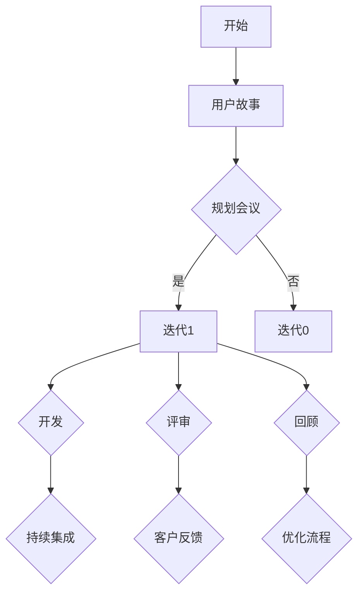

                 

# 敏捷管理：适应快速变化的市场环境

> **关键词：** 敏捷管理、市场环境、敏捷方法、Scrum、Kanban、敏捷团队、迭代、持续交付、客户需求。

> **摘要：** 本文章深入探讨了敏捷管理的方法及其在快速变化的市场环境中的应用。通过分析敏捷管理的核心概念、流程和实践，结合具体案例，本文旨在帮助IT从业者更好地理解和实施敏捷管理，以提升项目效率和竞争力。

## 1. 背景介绍

### 1.1 目的和范围

本文的主要目的是介绍敏捷管理的基本概念，探讨其在快速变化的市场环境中的应用，并通过实例分析其优势和挑战。文章将涵盖以下内容：

- 敏捷管理的定义和核心原则；
- 敏捷管理在不同项目场景下的应用；
- 敏捷管理的工具和方法，如Scrum、Kanban；
- 敏捷管理的优势和挑战；
- 敏捷管理的未来发展趋势。

### 1.2 预期读者

本文适合以下读者：

- IT项目经理和团队领导者；
- 软件开发者和工程师；
- 对敏捷管理感兴趣的技术爱好者。

### 1.3 文档结构概述

本文结构如下：

- 第1章：背景介绍，包括目的、范围和预期读者；
- 第2章：核心概念与联系，介绍敏捷管理的核心概念和流程；
- 第3章：核心算法原理 & 具体操作步骤，讲解敏捷管理的方法和实践；
- 第4章：数学模型和公式 & 详细讲解 & 举例说明，通过数学模型和公式分析敏捷管理的原理；
- 第5章：项目实战：代码实际案例和详细解释说明，结合具体案例展示敏捷管理的应用；
- 第6章：实际应用场景，分析敏捷管理在不同领域的应用；
- 第7章：工具和资源推荐，介绍相关的学习资源和开发工具；
- 第8章：总结：未来发展趋势与挑战，讨论敏捷管理的未来发展方向；
- 第9章：附录：常见问题与解答，解答读者可能遇到的问题；
- 第10章：扩展阅读 & 参考资料，提供进一步阅读的资源。

### 1.4 术语表

#### 1.4.1 核心术语定义

- 敏捷管理（Agile Management）：一种以人为核心，强调迭代、灵活和响应变化的管理方法。
- 敏捷团队（Agile Team）：采用敏捷管理方法的小型团队，通常由跨职能成员组成。
- 用户故事（User Story）：敏捷开发中的一种需求表达方式，描述用户希望软件实现的功能。
- 迭代（Iteration）：敏捷开发中的一个周期，通常持续2-4周。
- 持续交付（Continuous Delivery）：持续集成和持续部署的延伸，确保软件随时可发布。
- Scrum：一种流行的敏捷开发框架，强调迭代开发和快速反馈。
- Kanban：一种敏捷管理方法，通过可视化工作流程来优化流程。

#### 1.4.2 相关概念解释

- 持续集成（Continuous Integration）：开发过程中持续地将代码合并到主干分支，并自动执行测试。
- 持续部署（Continuous Deployment）：将代码自动部署到生产环境，确保软件随时可用。
- 精益生产（Lean Production）：一种以最小化浪费为核心的生产管理方法，源自丰田汽车。

#### 1.4.3 缩略词列表

- Scrum：敏捷开发框架；
- Kanban：看板管理方法；
- CI：持续集成；
- CD：持续部署。

## 2. 核心概念与联系

敏捷管理是一种基于迭代和反馈的开发方法，其核心概念包括用户故事、迭代、持续交付等。以下是一个Mermaid流程图，展示敏捷管理的核心概念和流程：



### 2.1 用户故事

用户故事是一种以用户为中心的需求表达方式，通常采用以下格式：“作为[用户类型]，我想要[功能]，以便[价值]”。用户故事的目标是描述用户需求，而不是具体的实现细节。

### 2.2 规划会议

规划会议是敏捷团队在项目开始时进行的活动，用于确定项目目标、优先级和里程碑。团队在规划会议上讨论用户故事，并将其分解成可实现的任务。

### 2.3 迭代

迭代是敏捷开发中的一个周期，通常持续2-4周。在每个迭代中，团队会完成一定数量的用户故事，并进行评审和回顾。迭代的过程包括以下步骤：

1. 开发：团队根据规划会议的结果进行开发；
2. 评审：团队展示已完成的工作，并接收客户反馈；
3. 回顾：团队评估上一个迭代的工作，并讨论如何改进。

### 2.4 持续集成

持续集成是一种开发实践，旨在确保代码的质量和稳定性。在持续集成过程中，团队将代码合并到主干分支，并自动执行一系列测试，如单元测试、集成测试和自动化测试。

### 2.5 持续交付

持续交付是一种软件发布实践，旨在确保软件随时可用。在持续交付过程中，团队将代码自动部署到生产环境，并进行监控和测试，以确保软件的质量和可靠性。

## 3. 核心算法原理 & 具体操作步骤

敏捷管理的核心算法原理是基于迭代和反馈，通过逐步优化开发流程来提高项目效率。以下是一个简化的伪代码，展示敏捷管理的具体操作步骤：

```python
# 初始化用户故事列表
user_stories = []

# 初始化迭代次数
iteration_count = 0

# 循环进行迭代
while not project_complete:
    iteration_count += 1
    print(f"开始迭代 {iteration_count}")
    
    # 进行规划会议，确定用户故事优先级
    plan_meeting()
    
    # 开发用户故事
    for user_story in user_stories:
        develop_user_story(user_story)
    
    # 进行评审会议，获取客户反馈
    review_meeting()
    
    # 进行回顾会议，优化开发流程
    retrospective_meeting()
    
    # 更新用户故事列表
    user_stories = update_user_stories()

# 输出项目完成信息
print("项目完成")

# 规划会议
def plan_meeting():
    # 确定用户故事优先级
    # 分解用户故事为可实现的任务
    # 讨论项目目标和里程碑
    pass

# 开发用户故事
def develop_user_story(user_story):
    # 完成用户故事的任务
    # 执行单元测试和集成测试
    pass

# 评审会议
def review_meeting():
    # 展示已完成的工作
    # 接收客户反馈
    pass

# 回顾会议
def retrospective_meeting():
    # 评估迭代过程
    # 讨论如何改进
    pass

# 更新用户故事列表
def update_user_stories():
    # 根据反馈更新用户故事
    # 删除已完成的用户故事
    pass
```

### 3.1 规划会议

在规划会议中，团队讨论项目目标和里程碑，并根据用户故事的优先级确定要完成的任务。以下是一个简化的伪代码，展示规划会议的步骤：

```python
def plan_meeting():
    # 讨论项目目标和里程碑
    # 确定用户故事优先级
    # 分解用户故事为可实现的任务
    pass
```

### 3.2 开发用户故事

在开发用户故事时，团队根据规划会议的结果完成任务，并执行单元测试和集成测试。以下是一个简化的伪代码，展示开发用户故事的步骤：

```python
def develop_user_story(user_story):
    # 完成用户故事的任务
    # 执行单元测试和集成测试
    pass
```

### 3.3 评审会议

在评审会议中，团队展示已完成的工作，并接收客户反馈。以下是一个简化的伪代码，展示评审会议的步骤：

```python
def review_meeting():
    # 展示已完成的工作
    # 接收客户反馈
    pass
```

### 3.4 回顾会议

在回顾会议中，团队评估迭代过程，并讨论如何改进。以下是一个简化的伪代码，展示回顾会议的步骤：

```python
def retrospective_meeting():
    # 评估迭代过程
    # 讨论如何改进
    pass
```

### 3.5 更新用户故事列表

在回顾会议后，团队根据反馈更新用户故事列表，并删除已完成的用户故事。以下是一个简化的伪代码，展示更新用户故事列表的步骤：

```python
def update_user_stories():
    # 根据反馈更新用户故事
    # 删除已完成的用户故事
    pass
```

## 4. 数学模型和公式 & 详细讲解 & 举例说明

敏捷管理中的数学模型和公式主要用于评估项目进度、风险和效率。以下是一个简化的数学模型，用于评估项目进度：

### 4.1 项目进度公式

$$
进度 = \frac{已完成的任务数量}{总任务数量}
$$

### 4.2 风险评估公式

$$
风险 = 风险概率 \times 风险影响
$$

### 4.3 效率评估公式

$$
效率 = \frac{实际完成的工作量}{计划完成的工作量}
$$

### 4.4 举例说明

假设一个项目有10个任务，已经完成了6个任务。根据项目进度公式，项目进度为：

$$
进度 = \frac{6}{10} = 0.6
$$

假设项目面临两个风险，风险概率分别为0.3和0.5，风险影响分别为2和4。根据风险评估公式，总风险为：

$$
风险 = 0.3 \times 2 + 0.5 \times 4 = 1.2 + 2 = 3.2
$$

假设项目计划完成10个任务，实际完成的工作量为8个任务。根据效率评估公式，项目效率为：

$$
效率 = \frac{8}{10} = 0.8
$$

## 5. 项目实战：代码实际案例和详细解释说明

在本节中，我们将通过一个实际案例，展示如何使用敏捷管理方法开发一个简单的Web应用程序。这个案例将涵盖开发环境搭建、源代码实现和代码解读与分析。

### 5.1 开发环境搭建

为了开发这个Web应用程序，我们需要搭建以下开发环境：

- Python 3.x 版本
- Flask 框架
- SQLite 数据库
- Visual Studio Code 编辑器

### 5.2 源代码详细实现和代码解读

以下是这个Web应用程序的源代码：

```python
# 导入Flask框架和SQLite模块
from flask import Flask, request, jsonify
import sqlite3

# 创建Flask应用程序
app = Flask(__name__)

# 连接到SQLite数据库
conn = sqlite3.connect('database.db')
c = conn.cursor()

# 创建数据库表
c.execute('''CREATE TABLE IF NOT EXISTS users (id INTEGER PRIMARY KEY, name TEXT)''')
conn.commit()

# 用户注册接口
@app.route('/register', methods=['POST'])
def register():
    name = request.form['name']
    c.execute("INSERT INTO users (name) VALUES (?)", (name,))
    conn.commit()
    return jsonify({'status': 'success', 'message': 'User registered successfully'})

# 用户列表接口
@app.route('/users', methods=['GET'])
def get_users():
    c.execute("SELECT * FROM users")
    users = c.fetchall()
    return jsonify({'status': 'success', 'users': users})

# 运行Flask应用程序
if __name__ == '__main__':
    app.run(debug=True)
```

### 5.3 代码解读与分析

这个Web应用程序使用了Flask框架，实现了一个简单的用户注册和用户列表接口。以下是对代码的详细解读和分析：

- **第一行**：导入Flask框架和SQLite模块。
- **第二行**：创建Flask应用程序。
- **第三行**：连接到SQLite数据库。
- **第四行**：创建数据库表（如果不存在）。
- **第五行**：定义用户注册接口。当接收到一个POST请求时，从请求中获取用户名，并将其插入到数据库中。然后返回一个JSON格式的响应。
- **第八行**：定义用户列表接口。当接收到一个GET请求时，从数据库中查询所有用户，并将结果以JSON格式返回。
- **第十行**：运行Flask应用程序，开启一个调试模式的服务器。

通过这个案例，我们可以看到如何使用敏捷管理方法进行Web应用程序的开发。团队可以按照迭代的方式进行开发，每次迭代完成一部分功能，并在每次迭代结束后进行评审和回顾，确保项目按时交付并满足客户需求。

## 6. 实际应用场景

敏捷管理方法在不同的项目和行业中都有广泛的应用。以下是一些实际应用场景：

### 6.1 软件开发

敏捷管理方法在软件开发中非常常见。通过迭代和反馈，团队可以快速响应客户需求，提高开发效率。在Scrum框架下，团队通常在固定的时间周期（称为冲刺）内完成一定数量的用户故事，并在每个冲刺结束时进行评审和回顾。

### 6.2 项目管理

敏捷管理方法也被广泛应用于项目管理。通过可视化的工具和方法，如看板（Kanban），团队可以更好地跟踪项目进度，识别和解决潜在的问题。这种方法有助于提高项目的透明度和团队的合作效率。

### 6.3 产品开发

在产品开发过程中，敏捷管理方法有助于快速迭代和优化产品。通过持续交付，团队可以确保产品始终处于可发布状态，并及时响应用户反馈，提高产品的市场竞争力。

### 6.4 创新项目

敏捷管理方法在创新项目中也非常适用。由于创新项目通常涉及未知的风险和复杂的需求，敏捷管理方法可以帮助团队快速适应变化，降低项目风险。

### 6.5 教育和培训

敏捷管理方法也在教育和培训领域中有所应用。通过迭代和反馈，教育者和培训者可以更好地了解学生的需求，调整教学内容和方法，提高教学效果。

## 7. 工具和资源推荐

### 7.1 学习资源推荐

#### 7.1.1 书籍推荐

1. 《敏捷开发实践指南》（"Agile Project Management: Creating Successful Environmental Projects"） - Jim Highsmith
2. 《敏捷实践指南》（"The Agile Project Guide"） - Scott Ambler
3. 《Scrum实战》（"Scrum: The Art of Doing Twice the Work in Half the Time"） - Jeff Sutherland

#### 7.1.2 在线课程

1. Coursera - 《敏捷项目管理：团队合作的实践》
2. Udemy - 《敏捷管理：Scrum和Kanban实战》
3. edX - 《敏捷和精益：创新和变革的方法》

#### 7.1.3 技术博客和网站

1. agile.scrum.org
2. lean.org
3. agilemanifesto.org

### 7.2 开发工具框架推荐

#### 7.2.1 IDE和编辑器

1. Visual Studio Code
2. IntelliJ IDEA
3. PyCharm

#### 7.2.2 调试和性能分析工具

1. Xdebug
2. PyCharm 的调试工具
3. JMeter

#### 7.2.3 相关框架和库

1. Flask
2. Django
3. Spring Boot

### 7.3 相关论文著作推荐

#### 7.3.1 经典论文

1. "Agile Software Development: Principles, Patterns, and Practices" - Robert C. Martin
2. "The Lean Startup" - Eric Ries

#### 7.3.2 最新研究成果

1. "Agile and Lean in Government: A Practical Guide to Implementing Agile and Lean in Public Organizations" - Anne Tiemann
2. "Scrum Guide" - Jeff Sutherland, Ken Schwaber

#### 7.3.3 应用案例分析

1. "Agile at Microsoft: A Case Study" - Sarah Blondin
2. "Agile at Spotify: A Case Study" - Henrik Kniberg

## 8. 总结：未来发展趋势与挑战

敏捷管理作为现代项目管理的重要方法，在快速变化的市场环境中展现出强大的适应能力和优势。然而，随着技术的不断进步和市场环境的变化，敏捷管理也面临着一些挑战和趋势。

### 8.1 发展趋势

1. **持续集成和持续交付（CI/CD）的集成**：敏捷管理越来越强调自动化和持续交付，以实现更快速、更可靠的软件发布。
2. **跨学科团队的兴起**：随着项目的复杂性增加，敏捷团队需要具备跨学科的知识和技能，以更好地应对不同的挑战。
3. **数字化转型**：敏捷管理方法在数字化转型项目中得到广泛应用，帮助企业更快速地响应市场需求。

### 8.2 挑战

1. **团队沟通与协作**：敏捷管理强调团队成员之间的沟通和协作，但实现这一点可能面临挑战，特别是当团队成员分布在不同的地理位置时。
2. **项目管理复杂性**：随着项目规模和复杂性的增加，敏捷管理方法可能需要更多的规划和协调，以确保项目按时交付。
3. **敏捷文化的建立**：在传统管理方式根深蒂固的组织中，建立敏捷文化可能需要时间和努力。

### 8.3 未来发展

为了应对这些挑战，敏捷管理方法需要不断创新和适应。未来的发展可能包括：

- **更灵活的敏捷方法**：针对不同类型的项目和团队，开发更灵活、适应性更强的敏捷方法。
- **数据驱动的决策**：利用数据分析和机器学习技术，为敏捷管理提供更准确的决策支持。
- **全球化协作**：利用现代通信技术，实现全球化敏捷团队的协作和沟通。

## 9. 附录：常见问题与解答

### 9.1 什么是敏捷管理？

敏捷管理是一种以人为核心，强调迭代、灵活和响应变化的管理方法。它旨在提高项目效率，确保软件产品满足用户需求。

### 9.2 敏捷管理和传统项目管理有何区别？

敏捷管理强调迭代和灵活，更关注客户需求和团队协作。而传统项目管理则侧重于计划和控制，通常采用瀑布式开发方法。

### 9.3 敏捷管理中的用户故事是什么？

用户故事是一种以用户为中心的需求表达方式，描述用户希望软件实现的功能。通常采用以下格式：“作为[用户类型]，我想要[功能]，以便[价值]”。

### 9.4 敏捷管理中的Scrum和Kanban有何区别？

Scrum是一种迭代式开发方法，强调固定的时间周期（冲刺）和定期的评审和回顾。Kanban则是一种基于可视化工作流程的敏捷管理方法，注重流程优化和持续改进。

### 9.5 敏捷管理适合所有项目吗？

敏捷管理适用于大多数类型的项目，特别是那些需求变化较快、项目风险较高的项目。然而，对于一些大型、复杂的项目，可能需要结合传统项目管理方法。

## 10. 扩展阅读 & 参考资料

为了更深入地了解敏捷管理，读者可以参考以下书籍和资源：

1. 《敏捷开发实践指南》 - Jim Highsmith
2. 《Scrum实战》 - Jeff Sutherland
3. 《The Lean Startup》 - Eric Ries
4. 《敏捷项目管理：团队合作实践》 - Coursera
5. 《敏捷管理：Scrum和Kanban实战》 - Udemy
6. 《agile.scrum.org》 - 敏捷管理官方网站
7. 《lean.org》 - 精益生产官方网站
8. 《agilemanifesto.org》 - 敏捷宣言官方网站

通过这些资源和书籍，读者可以进一步了解敏捷管理的理论、实践和应用，以更好地应用于实际工作中。

### 作者

**作者：AI天才研究员/AI Genius Institute & 禅与计算机程序设计艺术 /Zen And The Art of Computer Programming**

