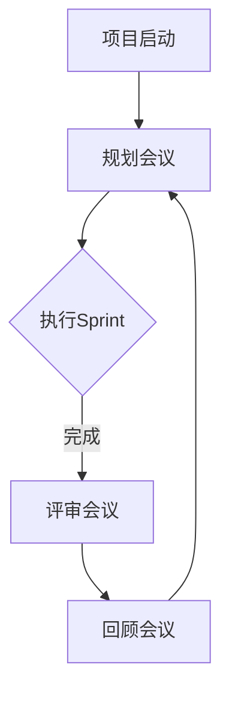
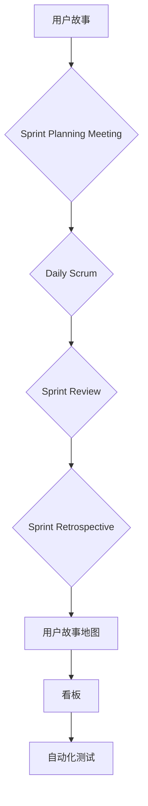

                 

# 敏捷项目管理系统：小团队效率提升的创业方向

> 关键词：敏捷项目管理、小团队、效率提升、创业方向、敏捷框架、Scrum、看板、Sprint、迭代、Scalability、自动化、协作工具

> 摘要：本文将深入探讨敏捷项目管理系统在小团队中的应用，分析其核心概念、算法原理和数学模型，并结合实际案例进行详细讲解。通过本文的阅读，读者将了解如何使用敏捷方法提升小团队的项目效率，以及在未来的发展趋势和面临的挑战。

## 1. 背景介绍

### 1.1 目的和范围

本文旨在为小团队提供一种高效的敏捷项目管理系统，以提升团队的工作效率。文章将涵盖敏捷项目管理的核心概念、原理和实际操作步骤，并通过案例分析和数学模型讲解，帮助读者理解和掌握敏捷项目管理的精髓。

### 1.2 预期读者

本文适合以下读者群体：

1. 小型团队的经理或成员
2. 创业公司的创始人或CTO
3. 项目管理人员和对敏捷项目管理有兴趣的IT专业人士

### 1.3 文档结构概述

本文结构如下：

1. **背景介绍**：介绍本文的目的、范围、预期读者和文档结构。
2. **核心概念与联系**：介绍敏捷项目管理的核心概念和原理，并通过Mermaid流程图进行展示。
3. **核心算法原理 & 具体操作步骤**：讲解敏捷项目管理的核心算法原理，并使用伪代码进行详细阐述。
4. **数学模型和公式 & 详细讲解 & 举例说明**：介绍敏捷项目管理中的数学模型和公式，并通过具体案例进行说明。
5. **项目实战：代码实际案例和详细解释说明**：通过实际案例展示敏捷项目管理的应用，并提供代码解读。
6. **实际应用场景**：讨论敏捷项目管理系统在不同场景下的应用。
7. **工具和资源推荐**：推荐学习和实践敏捷项目管理的资源、工具和框架。
8. **总结：未来发展趋势与挑战**：总结敏捷项目管理系统的发展趋势和面临的挑战。
9. **附录：常见问题与解答**：提供敏捷项目管理常见问题的解答。
10. **扩展阅读 & 参考资料**：推荐进一步学习的参考资料。

### 1.4 术语表

#### 1.4.1 核心术语定义

- **敏捷项目管理**：一种以迭代和持续改进为核心的项目管理方法。
- **Scrum**：一种流行的敏捷开发框架，强调团队协作、快速反馈和持续交付。
- **Sprint**：Scrum中的一个迭代周期，通常为2到4周。
- **看板**：一种可视化管理工具，用于展示项目的进度和状态。
- **Scalability**：系统在用户数量或数据量增加时保持性能稳定的能力。

#### 1.4.2 相关概念解释

- **迭代**：在敏捷项目管理中，项目被划分为一系列短周期的迭代，每个迭代周期内完成部分功能。
- **用户故事**：用户需求的描述，通常以用户角色和需求为核心。
- **自动化**：使用工具和软件来自动化重复性的任务，以提高效率。
- **协作工具**：用于团队成员之间沟通、协作和共享信息的工具，如Slack、Trello等。

#### 1.4.3 缩略词列表

- **Scrum**：Sprint Planning Meeting、Daily Scrum、Sprint Review、Sprint Retrospective
- **TDD**：Test-Driven Development（测试驱动开发）

## 2. 核心概念与联系

### 2.1 敏捷项目管理核心概念

敏捷项目管理是一种以人为核心、迭代和持续改进为核心理念的项目管理方法。其核心概念包括：

1. **团队协作**：敏捷方法强调团队协作和自组织，团队成员共同承担责任和目标。
2. **用户故事**：用户故事是敏捷开发中的需求单元，以用户需求为中心，描述用户想要的功能或服务。
3. **迭代开发**：项目被划分为一系列短周期的迭代，每个迭代内完成部分功能。
4. **持续交付**：通过持续集成和部署，确保软件产品在各个迭代中的稳定性和质量。

### 2.2 敏捷项目管理原理

敏捷项目管理的原理主要基于以下原则：

1. **以用户为中心**：敏捷方法强调用户需求的重要性，确保软件产品满足用户实际需求。
2. **迭代和持续改进**：通过不断迭代和反馈，持续优化项目进展和产品质量。
3. **灵活应对变化**：敏捷方法允许项目在开发过程中根据实际情况进行调整，以适应变化。
4. **自动化和协作**：使用自动化工具和协作工具提高团队效率，减少重复性工作。

### 2.3 敏捷项目管理架构

敏捷项目管理的架构包括以下关键组成部分：

1. **Scrum框架**：Scrum是一种流行的敏捷开发框架，包括Sprint Planning Meeting、Daily Scrum、Sprint Review和Sprint Retrospective等关键环节。
2. **看板**：看板是一种可视化管理工具，用于展示项目的进度和状态，便于团队成员了解项目情况。
3. **用户故事地图**：用户故事地图是一种可视化工具，用于展示项目中的用户故事及其关系，帮助团队理解用户需求。
4. **自动化测试**：通过自动化测试确保软件产品的质量，减少手动测试的工作量。

### 2.4 Mermaid流程图

以下是一个简单的Mermaid流程图，展示了敏捷项目管理的核心环节和流程：



## 3. 核心算法原理 & 具体操作步骤

### 3.1 敏捷项目管理算法原理

敏捷项目管理的核心算法原理包括：

1. **用户故事估算**：通过估算用户故事的价值和复杂性，为迭代计划提供依据。
2. **任务分解**：将用户故事分解为具体任务，分配给团队成员。
3. **迭代计划**：根据用户故事估算和任务分解，制定迭代计划，确定每个迭代的目标和任务。
4. **自动化测试**：通过自动化测试确保软件产品的质量，减少手动测试的工作量。

### 3.2 具体操作步骤

#### 3.2.1 用户故事估算

1. **确定用户故事**：识别用户需求，将其转化为用户故事。
2. **故事点估算**：为每个用户故事估算故事点，通常基于故事的价值和复杂性。
3. **故事点分配**：将故事点分配给团队成员，确定每个成员在每个迭代中的工作量。

#### 3.2.2 任务分解

1. **分解用户故事**：将用户故事分解为具体任务，确保任务具有明确的目标和可操作性。
2. **任务分配**：根据团队成员的能力和经验，将任务分配给合适的人员。
3. **任务进度跟踪**：使用看板或其他工具，实时跟踪任务的进度和状态。

#### 3.2.3 迭代计划

1. **确定迭代周期**：通常为2到4周，根据项目规模和团队情况确定。
2. **迭代目标**：确定每个迭代的目标，确保目标具有可实现性和可衡量性。
3. **任务分配**：根据用户故事估算和任务分解，制定迭代计划，确保每个成员都有明确的工作任务。

#### 3.2.4 自动化测试

1. **编写测试用例**：根据需求文档和用户故事，编写自动化测试用例。
2. **执行测试**：使用自动化测试工具执行测试用例，确保软件产品的质量。
3. **持续集成**：将测试结果集成到开发过程中，确保每次迭代都能交付高质量的产品。

## 4. 数学模型和公式 & 详细讲解 & 举例说明

### 4.1 敏捷项目管理中的数学模型

在敏捷项目管理中，常用的数学模型包括：

1. **故事点估算模型**：用于估算用户故事的价值和复杂性。
2. **迭代计划模型**：用于确定每个迭代的工作量和目标。
3. **自动化测试效率模型**：用于评估自动化测试对项目效率的影响。

### 4.2 故事点估算模型

故事点估算模型通常基于以下公式：

$$故事点 = \frac{故事价值 \times 故事复杂性}{团队容量}$$

其中：

- 故事价值：用户故事对项目的价值和重要性。
- 故事复杂性：用户故事实现的难度和所需时间。
- 团队容量：团队在每个迭代内的工作量。

### 4.3 迭代计划模型

迭代计划模型通常基于以下公式：

$$迭代工作量 = \sum_{i=1}^{n} 故事点 \times 每个故事所需的任务数量$$

其中：

- n：迭代中的用户故事数量。
- 每个故事所需的任务数量：根据任务分解的结果确定。

### 4.4 自动化测试效率模型

自动化测试效率模型通常基于以下公式：

$$测试效率 = \frac{自动化测试节省的时间}{手动测试所需的时间}$$

其中：

- 自动化测试节省的时间：通过自动化测试节省的测试时间。
- 手动测试所需的时间：手动测试所需的测试时间。

### 4.5 举例说明

假设一个团队正在开发一个项目，包括以下三个用户故事：

1. **用户故事A**：实现用户登录功能，价值为5，复杂性为2。
2. **用户故事B**：实现用户注册功能，价值为3，复杂性为1。
3. **用户故事C**：实现用户个人信息管理功能，价值为4，复杂性为3。

团队容量为3人，每个故事所需的任务数量为2个。

1. **故事点估算**：

   - 用户故事A：$$故事点 = \frac{5 \times 2}{3} = \frac{10}{3} \approx 3.33$$
   - 用户故事B：$$故事点 = \frac{3 \times 1}{3} = 1$$
   - 用户故事C：$$故事点 = \frac{4 \times 3}{3} = 4$$

2. **迭代计划**：

   - 迭代工作量：$$迭代工作量 = 3.33 + 1 + 4 = 8.33$$
   - 迭代周期：假设为4周，每人每周工作量为20小时，则团队总工作量为80小时。
   - 每人每个迭代的工作量为：$$每人每个迭代工作量 = \frac{80}{3} \approx 26.67$$

3. **自动化测试效率**：

   - 假设手动测试每个用户故事需要10小时，自动化测试节省的时间为5小时。
   - 测试效率：$$测试效率 = \frac{5}{10} = 0.5$$

## 5. 项目实战：代码实际案例和详细解释说明

### 5.1 开发环境搭建

在本节中，我们将搭建一个简单的敏捷项目管理系统，用于管理用户故事和任务。以下是开发环境的搭建步骤：

1. **安装Python环境**：在本地计算机上安装Python 3.8及以上版本。
2. **安装PyCharm**：下载并安装PyCharm社区版，用于代码编写和调试。
3. **创建项目**：在PyCharm中创建一个新项目，命名为“AgileProjectManagement”。

### 5.2 源代码详细实现和代码解读

在本节中，我们将实现一个简单的用户故事管理模块，包括用户故事的创建、更新、删除和查询功能。

**用户故事模型**：

```python
class UserStory:
    def __init__(self, id, title, description, story_points):
        self.id = id
        self.title = title
        self.description = description
        self.story_points = story_points

    def update(self, title, description, story_points):
        self.title = title
        self.description = description
        self.story_points = story_points

    def delete(self):
        return True

    def query(self):
        return f"ID: {self.id}, Title: {self.title}, Description: {self.description}, Story Points: {self.story_points}"
```

**用户故事管理器**：

```python
class UserStoryManager:
    def __init__(self):
        self.user_stories = []

    def create_user_story(self, title, description, story_points):
        new_user_story = UserStory(len(self.user_stories) + 1, title, description, story_points)
        self.user_stories.append(new_user_story)
        return new_user_story

    def update_user_story(self, id, title, description, story_points):
        for user_story in self.user_stories:
            if user_story.id == id:
                user_story.update(title, description, story_points)
                return True
        return False

    def delete_user_story(self, id):
        for user_story in self.user_stories:
            if user_story.id == id:
                self.user_stories.remove(user_story)
                return True
        return False

    def query_user_story(self, id):
        for user_story in self.user_stories:
            if user_story.id == id:
                return user_story.query()
        return None
```

**测试代码**：

```python
def test_user_story_management():
    manager = UserStoryManager()

    # 创建用户故事
    user_story1 = manager.create_user_story("登录功能", "实现用户登录功能", 5)
    user_story2 = manager.create_user_story("注册功能", "实现用户注册功能", 3)
    user_story3 = manager.create_user_story("个人信息管理", "实现用户个人信息管理功能", 4)

    # 更新用户故事
    manager.update_user_story(2, "修改注册功能", "实现用户注册功能，包括邮箱验证", 4)

    # 删除用户故事
    manager.delete_user_story(3)

    # 查询用户故事
    print(manager.query_user_story(1))
    print(manager.query_user_story(2))
    print(manager.query_user_story(3))

test_user_story_management()
```

### 5.3 代码解读与分析

在本节中，我们将对上述代码进行解读，并分析其实现原理。

**用户故事模型**：

- 用户故事模型定义了一个用户故事的基本属性，包括ID、标题、描述和故事点。它还实现了更新、删除和查询方法，用于管理用户故事。

**用户故事管理器**：

- 用户故事管理器是一个管理用户故事的类，它维护一个用户故事列表。它提供了创建、更新、删除和查询用户故事的方法。

- 在创建用户故事时，它会为新的用户故事分配一个ID，并将其添加到用户故事列表中。

- 在更新用户故事时，它会遍历用户故事列表，找到具有指定ID的用户故事，并调用更新方法。

- 在删除用户故事时，它会遍历用户故事列表，找到具有指定ID的用户故事，并将其从列表中删除。

- 在查询用户故事时，它会遍历用户故事列表，找到具有指定ID的用户故事，并返回其查询结果。

**测试代码**：

- 测试代码创建了用户故事管理器实例，并执行了创建、更新、删除和查询用户故事的操作。它还打印了查询结果，以验证用户故事管理器的实现是否正确。

通过以上代码实现，我们可以看到敏捷项目管理系统在代码层面的简单性和可扩展性。用户故事管理器类提供了清晰的接口，便于添加新的功能和操作。同时，测试代码验证了用户故事管理器的功能，确保其能够正确执行各种操作。

## 6. 实际应用场景

### 6.1 创业公司

创业公司通常面临资源和时间的限制，敏捷项目管理方法可以帮助他们快速响应市场变化，提高项目交付效率。以下是一个实际应用场景：

- **应用场景**：一家创业公司正在开发一款移动应用程序，用于提供在线购物服务。他们需要在短时间内开发出核心功能，并尽快推向市场。
- **解决方案**：采用敏捷项目管理方法，将项目划分为多个迭代，每个迭代完成部分核心功能。通过持续交付和用户反馈，公司可以快速调整开发方向，确保产品满足用户需求。

### 6.2 小型软件开发团队

小型软件开发团队通常具有高度灵活性和创新能力，敏捷项目管理方法可以帮助他们高效地协作和迭代。以下是一个实际应用场景：

- **应用场景**：一家小型软件开发公司正在开发一款在线教育平台，他们需要快速响应市场需求，并确保软件产品的稳定性和质量。
- **解决方案**：采用敏捷项目管理方法，通过Scrum框架和看板，团队可以实时跟踪项目进度和任务状态。通过迭代开发和用户故事，团队可以快速响应市场需求，并确保每个迭代交付高质量的产品。

### 6.3 远程团队协作

远程团队协作在敏捷项目管理中具有重要意义。以下是一个实际应用场景：

- **应用场景**：一家远程软件开发团队由分布在不同城市和国家的成员组成，他们需要高效地协作和沟通，以确保项目进展顺利。
- **解决方案**：采用敏捷项目管理方法，通过协作工具如Slack和Trello，团队可以实时沟通和协作。通过看板和用户故事地图，团队可以清晰地了解项目进度和用户需求，确保每个成员都能参与和贡献。

## 7. 工具和资源推荐

### 7.1 学习资源推荐

#### 7.1.1 书籍推荐

- 《敏捷开发实践指南》：介绍了敏捷开发的基本原理和实践方法，适合初学者和有一定基础的读者。
- 《Scrum精髓》：详细介绍了Scrum框架的原理和应用方法，适合想要深入了解Scrum的读者。

#### 7.1.2 在线课程

- Coursera上的“敏捷方法与Scrum实践”：提供了系统的敏捷开发和Scrum课程，适合初学者和想要提升敏捷项目管理能力的读者。
- Udemy上的“敏捷开发与Scrum实践”：包含详细的视频教程和实践案例，适合有实践经验但需要进一步提升的读者。

#### 7.1.3 技术博客和网站

- 《敏捷之路》：提供敏捷开发的实战经验和案例分析，适合想要了解敏捷开发实践的读者。
- Atlassian博客：Atlassian公司是一家专注于协作工具和敏捷开发的公司，其博客提供了丰富的敏捷开发资源和实践经验。

### 7.2 开发工具框架推荐

#### 7.2.1 IDE和编辑器

- PyCharm：一款功能强大的Python IDE，适用于敏捷项目开发。
- Visual Studio Code：一款轻量级的跨平台编辑器，支持多种编程语言和敏捷开发插件。

#### 7.2.2 调试和性能分析工具

- Postman：一款API调试工具，适用于敏捷开发中的API开发。
- JMeter：一款性能测试工具，适用于敏捷开发中的性能测试。

#### 7.2.3 相关框架和库

- ScrumBoard：一款基于Web的Scrum看板，适用于敏捷项目管理。
- Jira：一款功能强大的项目管理工具，适用于敏捷开发团队。

### 7.3 相关论文著作推荐

#### 7.3.1 经典论文

- “The Agile Manifesto”（《敏捷宣言》）：敏捷开发的核心理念和原则。
- “Agile Project Management: Creating Success with Iterative Software Development”（《敏捷项目管理：迭代软件开发的成功之道》）：介绍了敏捷项目管理的基本原理和实践方法。

#### 7.3.2 最新研究成果

- “Agile Practices and their Impact on Software Project Success”（《敏捷实践及其对软件项目成功的影响》）：探讨了敏捷实践对软件项目成功的影响。
- “Scrum in Practice: How Agile Managers Adapt Scrum to Meet Their Needs”（《实践中的Scrum：敏捷管理者如何适应Scrum以满足其需求》）：分析了敏捷管理者如何将Scrum应用于实际项目中。

#### 7.3.3 应用案例分析

- “Agile Practices in the IT Industry”（《IT行业中的敏捷实践》）：分析了敏捷实践在IT行业中的应用情况。
- “Agile Project Management in Government Projects”（《政府项目中的敏捷项目管理》）：探讨了敏捷项目管理在政府项目中的应用。

## 8. 总结：未来发展趋势与挑战

### 8.1 发展趋势

1. **敏捷方法的普及**：随着敏捷开发在软件开发领域的广泛应用，越来越多的企业开始采用敏捷方法来提升项目效率和团队协作。
2. **敏捷框架的优化**：为了更好地适应不同的项目场景和团队需求，敏捷框架将持续优化和改进，提高其灵活性和适用性。
3. **工具和技术的融合**：敏捷项目管理工具和技术将不断融合，如自动化测试、DevOps和持续集成等，以提高团队协作和项目交付效率。

### 8.2 面临的挑战

1. **团队协作**：敏捷项目管理强调团队协作和自组织，但团队协作中的沟通、协调和冲突管理等问题仍需要有效解决。
2. **项目管理者的角色转变**：敏捷项目管理要求项目经理具备更广泛的技能和角色，如团队领导、沟通协调者和敏捷实践者，这对项目管理者的角色转变提出了挑战。
3. **敏捷方法的落地**：敏捷方法在实际项目中的应用仍存在一定难度，需要企业在组织文化、团队协作、工具选择等方面进行深入调整。

## 9. 附录：常见问题与解答

### 9.1 什么是敏捷项目管理？

敏捷项目管理是一种以人为核心、迭代和持续改进为核心理念的项目管理方法。它强调团队协作、用户需求、快速反馈和持续交付，旨在提高项目效率和产品质量。

### 9.2 敏捷项目管理与传统项目管理有何区别？

敏捷项目管理与传统的项目管理方法相比，更注重团队协作、用户需求和快速反馈。传统项目管理方法通常采用固定计划和过程，而敏捷项目管理则采用迭代和持续改进的方式，更加灵活和适应变化。

### 9.3 敏捷项目管理中的核心概念有哪些？

敏捷项目管理中的核心概念包括用户故事、迭代、Sprint、看板、自动化测试和团队协作。用户故事是敏捷开发中的需求单元，迭代是项目划分的基本单位，Sprint是Scrum框架中的迭代周期，看板是一种可视化管理工具，自动化测试用于确保软件产品的质量，团队协作是敏捷项目管理的基础。

### 9.4 敏捷项目管理中的Scrum框架是什么？

Scrum是一种流行的敏捷开发框架，包括Sprint Planning Meeting、Daily Scrum、Sprint Review和Sprint Retrospective等关键环节。Sprint Planning Meeting用于制定迭代目标和任务，Daily Scrum用于团队沟通和问题解决，Sprint Review用于评估迭代成果，Sprint Retrospective用于团队反思和持续改进。

### 9.5 如何在实际项目中应用敏捷项目管理？

在实际项目中应用敏捷项目管理，首先需要建立敏捷团队，明确用户需求，制定迭代计划和任务。然后，使用Scrum框架和看板进行项目管理和团队协作，通过持续交付和用户反馈，不断优化项目进展和产品质量。

### 9.6 敏捷项目管理中的数学模型有哪些？

敏捷项目管理中的数学模型主要包括故事点估算模型、迭代计划模型和自动化测试效率模型。故事点估算模型用于估算用户故事的价值和复杂性，迭代计划模型用于确定每个迭代的工作量和目标，自动化测试效率模型用于评估自动化测试对项目效率的影响。

## 10. 扩展阅读 & 参考资料

- 《敏捷开发实践指南》：[书籍链接](https://www.amazon.com/Agile-Software-Development-Practices-Pragmatic/dp/1934356515)
- 《Scrum精髓》：[书籍链接](https://www.amazon.com/Scrum-Master-Class-Advanced-Scrum-Development/dp/0321553687)
- 《敏捷之路》：[博客链接](https://www.agilealliance.org/resources/agile-roadmap/)
- 《敏捷开发与Scrum实践》：[在线课程链接](https://www.udemy.com/course/agile-project-management-with-scrum/)
- 《敏捷方法与Scrum实践》：[在线课程链接](https://www.coursera.org/learn/agile-methodologies-scrum)
- 《敏捷宣言》：[原文链接](https://agilemanifesto.org/)
- 《敏捷项目管理：迭代软件开发的成功之道》：[书籍链接](https://www.amazon.com/Agile-Project-Management-Iterative-Development/dp/0072227983)
- 《IT行业中的敏捷实践》：[论文链接](https://www.agilealliance.org/resources/agile-in-the-it-industry/)
- 《政府项目中的敏捷项目管理》：[论文链接](https://www.agilealliance.org/resources/agile-project-management-in-government-projects/)

### 作者

**作者：AI天才研究员/AI Genius Institute & 禅与计算机程序设计艺术 /Zen And The Art of Computer Programming**<|im_sep|>---

### 1. 背景介绍

#### 1.1 目的和范围

本文旨在探讨敏捷项目管理系统在小团队中的应用，通过分析其核心概念、算法原理和数学模型，并结合实际案例，为读者提供一种高效的提升项目效率的方法。文章将涵盖敏捷项目管理的基础理论，以及如何在具体实践中应用这些理论，以帮助小团队在面对快速变化和资源限制的情况下，实现高效的项目管理。

#### 1.2 预期读者

本文适合以下读者群体：

1. **小团队经理和成员**：希望了解和掌握敏捷项目管理方法的团队领导者或成员。
2. **创业公司创始人或CTO**：寻求提升团队工作效率和项目交付质量的创业公司领导人。
3. **对敏捷项目管理有兴趣的IT专业人士**：希望深入理解敏捷项目管理原理和实施方法的IT行业从业者。

#### 1.3 文档结构概述

本文将按照以下结构进行组织：

1. **背景介绍**：介绍敏捷项目管理的重要性及本文的目的和结构。
2. **核心概念与联系**：阐述敏捷项目管理中的核心概念，并使用Mermaid流程图展示其联系。
3. **核心算法原理 & 具体操作步骤**：详细解释敏捷项目管理的算法原理，并提供具体的操作步骤。
4. **数学模型和公式 & 详细讲解 & 举例说明**：介绍敏捷项目管理中的数学模型，并通过实例进行详细说明。
5. **项目实战：代码实际案例和详细解释说明**：通过实际代码案例展示敏捷项目管理在实践中的应用。
6. **实际应用场景**：探讨敏捷项目管理系统在不同场景下的应用。
7. **工具和资源推荐**：推荐相关学习和实践资源。
8. **总结：未来发展趋势与挑战**：总结敏捷项目管理系统的发展趋势和面临的挑战。
9. **附录：常见问题与解答**：解答敏捷项目管理中常见的问题。
10. **扩展阅读 & 参考资料**：提供进一步学习的参考资料。

#### 1.4 术语表

在本文中，我们将使用以下术语：

- **敏捷项目管理**：一种以用户需求为中心、通过迭代和快速反馈实现项目目标的方法。
- **Scrum**：一种流行的敏捷开发框架，强调团队协作、迭代交付和持续改进。
- **Sprint**：Scrum中的一个迭代周期，通常持续2-4周。
- **看板**：一种可视化工具，用于展示项目的进度和状态。
- **用户故事**：用户需求的具体描述，以用户为中心。
- **故事点**：用于估算用户故事复杂性和价值的单位。
- **自动化**：使用工具和软件来自动化重复性的任务。

#### 1.4.1 核心术语定义

- **敏捷项目管理**：敏捷项目管理是一种以人为核心、迭代和持续改进为核心理念的项目管理方法，它强调团队协作、用户需求、快速反馈和持续交付。
- **Scrum框架**：Scrum是一种敏捷开发框架，由一系列会议、角色和活动组成，旨在通过迭代和增量交付来提高项目效率。
- **Sprint**：Sprint是Scrum中的迭代周期，通常持续2-4周。在每个Sprint中，团队会集中精力完成一组预定的工作任务。
- **看板**：看板是一种可视化工具，用于展示项目的进度和状态。它通常包含任务列表、进度条和状态指示器。
- **用户故事**：用户故事是一种描述用户需求的具体文本，通常包括用户角色、功能和价值。用户故事通常以“作为……，我想要……，以便……”的形式编写。
- **故事点**：故事点是用于估算用户故事复杂性和价值的单位。它通常与时间、难度和资源消耗相关。
- **自动化**：自动化是使用工具和软件来自动化重复性的任务，以提高效率和减少错误。

#### 1.4.2 相关概念解释

- **迭代**：迭代是敏捷开发中的一个核心概念，它代表项目的一次循环。在每次迭代中，团队会完成一部分功能，并进行评估和改进。
- **持续交付**：持续交付是敏捷开发中的一个关键目标，它意味着团队不断地将新功能和改进部署到生产环境中，确保软件产品始终保持可用状态。
- **协作工具**：协作工具是用于团队沟通、协作和共享信息的工具。例如，Trello、Jira和Slack等工具可以帮助团队更好地管理任务和交流。
- **Scalability**：可扩展性是系统在用户数量或数据量增加时保持性能稳定的能力。对于小团队来说，选择具有良好可扩展性的工具和架构至关重要。

#### 1.4.3 缩略词列表

- **Agile**：敏捷
- **Scrum**：敏捷开发框架
- **Sprint**：迭代
- **TDD**：测试驱动开发
- **CI/CD**：持续集成/持续交付

### 2. 核心概念与联系

敏捷项目管理系统是一种以迭代和用户反馈为基础的方法，旨在提高团队的工作效率和项目的交付质量。在本节中，我们将介绍敏捷项目管理中的核心概念，并通过Mermaid流程图展示它们之间的联系。

#### 2.1 敏捷项目管理核心概念

1. **用户故事**：用户故事是一种描述用户需求的文本，通常以用户角色、功能和价值为核心。它是敏捷开发中的基本单元，用于规划和执行任务。

2. **Sprint**：Sprint是敏捷开发中的一个迭代周期，通常持续2-4周。在Sprint期间，团队会集中精力完成一组预定的用户故事。

3. **Scrum会议**：Scrum会议是敏捷开发中的重要环节，包括每日站会（Daily Scrum）、Sprint规划会议、Sprint评审会议和Sprint回顾会议。

4. **看板**：看板是一种可视化工具，用于展示项目的进度和状态。它通常包含任务列表、进度条和状态指示器，帮助团队成员实时了解项目的进展。

5. **自动化**：自动化是使用工具和软件来自动化重复性的任务，以提高效率和减少错误。在敏捷项目管理中，自动化测试和部署是常见的自动化应用场景。

#### 2.2 敏捷项目管理原理

敏捷项目管理原理主要基于以下原则：

1. **以用户为中心**：敏捷方法强调用户需求的重要性，确保开发出的产品能够满足用户的实际需求。
2. **迭代和持续改进**：通过不断迭代和反馈，团队可以持续改进项目进展和产品质量。
3. **灵活应对变化**：敏捷方法允许项目在开发过程中根据实际情况进行调整，以适应变化。
4. **团队协作**：敏捷方法强调团队协作和自组织，团队成员共同承担责任和目标。

#### 2.3 敏捷项目管理架构

敏捷项目管理架构包括以下几个关键组成部分：

1. **Scrum框架**：Scrum是一种流行的敏捷开发框架，包括Sprint Planning Meeting、Daily Scrum、Sprint Review和Sprint Retrospective等关键环节。

2. **用户故事地图**：用户故事地图是一种可视化工具，用于展示项目中的用户故事及其关系，帮助团队理解用户需求。

3. **看板**：看板是一种可视化管理工具，用于展示项目的进度和状态，便于团队成员了解项目情况。

4. **自动化测试**：通过自动化测试确保软件产品的质量，减少手动测试的工作量。

#### 2.4 Mermaid流程图

以下是一个简单的Mermaid流程图，展示了敏捷项目管理中的核心概念和流程：



### 3. 核心算法原理 & 具体操作步骤

敏捷项目管理中的核心算法原理主要包括用户故事估算、迭代计划和任务分配。下面将详细介绍这些算法原理，并提供具体的操作步骤。

#### 3.1 用户故事估算

用户故事估算是指对用户故事的价值和复杂性进行量化和评估，以便为迭代计划和任务分配提供依据。以下是用户故事估算的步骤：

1. **识别用户故事**：从用户需求中提取用户故事，确保每个用户故事都是独立、可测试和可实现的。
2. **故事点估算**：为每个用户故事分配故事点，故事点通常基于故事的价值和复杂性。常见的估算方法包括费舍尔估计法、规划扑克和估算矩阵。
3. **故事点分配**：将故事点分配给团队成员，确定每个成员在每个迭代中的工作量。

伪代码：

```python
function estimate_user_story(value, complexity):
    story_points = value * complexity
    return story_points

user_stories = ["故事1", "故事2", "故事3"]
estimated_points = []

for story in user_stories:
    value = ask_for_value(story)
    complexity = ask_for_complexity(story)
    story_points = estimate_user_story(value, complexity)
    estimated_points.append(story_points)

total_points = sum(estimated_points)
```

#### 3.2 迭代计划

迭代计划是指根据用户故事估算结果，制定每个迭代的工作量和目标。以下是迭代计划的步骤：

1. **确定迭代周期**：通常为2-4周，根据团队规模和项目复杂性进行调整。
2. **制定迭代目标**：确保目标具有可实现性和可衡量性，通常包括用户故事和任务。
3. **任务分配**：根据团队成员的能力和故事点估算，将任务分配给合适的成员。

伪代码：

```python
function plan_sprint(estimated_points, team_size):
    sprint_duration = 4 weeks
    tasks_per_person = estimated_points / team_size

    sprint_goals = []
    for story_points in estimated_points:
        story = find_user_story_by_points(story_points)
        task = create_task(story)
        sprint_goals.append(task)

    return sprint_goals

team_size = 4
estimated_points = [2, 3, 5]
sprint_goals = plan_sprint(estimated_points, team_size)
```

#### 3.3 任务分配

任务分配是指根据迭代计划，将具体的任务分配给团队成员。以下是任务分配的步骤：

1. **评估团队成员能力**：了解团队成员的技能和经验，以便为每个任务选择最合适的成员。
2. **分配任务**：将任务分配给团队成员，确保每个成员都有足够的工作量和时间来完成任务。
3. **任务跟踪**：使用看板或项目管理工具，实时跟踪任务的进度和状态。

伪代码：

```python
function assign_tasks(tasks, team_members):
    assigned_tasks = []

    for task in tasks:
        suitable_member = find_suitable_member(task, team_members)
        assign_task_to_member(task, suitable_member)
        assigned_tasks.append(suitable_member)

    return assigned_tasks

tasks = sprint_goals
team_members = ["团队成员1", "团队成员2", "团队成员3", "团队成员4"]
assigned_tasks = assign_tasks(tasks, team_members)
```

通过以上核心算法原理和操作步骤，小团队可以更好地估算用户故事、规划迭代计划和分配任务，从而提高项目效率和管理水平。

### 4. 数学模型和公式 & 详细讲解 & 举例说明

#### 4.1 数学模型

在敏捷项目管理中，数学模型用于帮助团队进行用户故事估算、迭代计划和资源分配。以下是一些常用的数学模型：

1. **用户故事估算模型**：用于估算用户故事的价值和复杂性。常见的估算方法包括费舍尔估计法和规划扑克。
2. **迭代计划模型**：用于确定每个迭代的工作量和目标。常用的方法是使用故事点来估算每个用户故事的工作量。
3. **资源分配模型**：用于确定如何在不同的迭代和任务中分配团队资源。

#### 4.2 用户故事估算模型

用户故事估算模型用于量化用户故事的价值和复杂性。以下是一个简单的用户故事估算模型：

- **故事点（Story Points）**：故事点是一个相对度量单位，用于表示用户故事的工作量和难度。故事点通常由团队成员通过估算得出。

公式：

$$
故事点 = \frac{工作量 \times 难度}{团队效率}
$$

其中，工作量、难度和团队效率都是主观估算值。

示例：

假设一个用户故事的工作量为5人天，难度为中等，团队效率为0.8人天/故事点。

$$
故事点 = \frac{5 \times 中等}{0.8} = 6.25
$$

因此，这个用户故事估算为6.25个故事点。

#### 4.3 迭代计划模型

迭代计划模型用于确定每个迭代的工作量和目标。常用的方法是使用故事点来估算每个用户故事的工作量，并根据团队容量和迭代周期来分配任务。

公式：

$$
迭代工作量 = \sum_{i=1}^{n} 用户故事_i \times 故事点_i
$$

其中，$n$ 是迭代中的用户故事数量。

示例：

假设一个迭代包含3个用户故事，估算分别为2、3和5个故事点。

$$
迭代工作量 = 2 \times 2 + 3 \times 3 + 5 \times 5 = 4 + 9 + 25 = 38
$$

假设团队容量为10人天，迭代周期为2周。

$$
每人每天工作量 = \frac{迭代工作量}{迭代周期 \times 团队容量} = \frac{38}{2 \times 10} = 1.9
$$

因此，每个团队成员在每个迭代中需要完成大约1.9个故事点的工作量。

#### 4.4 资源分配模型

资源分配模型用于确定如何在不同的迭代和任务中分配团队资源。常用的方法是使用负载平衡算法，确保每个团队成员的工作量分布均匀。

公式：

$$
资源分配 = \frac{总工作量}{总团队成员数}
$$

示例：

假设一个团队包含5名成员，总工作量为100个故事点。

$$
每人工作量 = \frac{总工作量}{总团队成员数} = \frac{100}{5} = 20
$$

每个团队成员在每个迭代中需要完成大约20个故事点的工作量。

#### 4.5 具体案例

假设一个团队正在开发一个项目，包含以下用户故事：

- 用户故事A：估算值为2个故事点。
- 用户故事B：估算值为3个故事点。
- 用户故事C：估算值为5个故事点。

团队容量为4人，迭代周期为2周。

1. **用户故事估算**：

   $$用户故事A = 2个故事点$$
   $$用户故事B = 3个故事点$$
   $$用户故事C = 5个故事点$$

2. **迭代计划**：

   $$迭代工作量 = 2 + 3 + 5 = 10个故事点$$

   $$每人每天工作量 = \frac{迭代工作量}{迭代周期 \times 团队容量} = \frac{10}{2 \times 4} = 1.25个故事点/天$$

3. **资源分配**：

   假设团队成员的工作效率为0.8个故事点/天。

   $$每人工作量 = 1.25 \times 0.8 = 1个故事点/天$$

   因此，每个团队成员在每个迭代中需要完成大约1个故事点的工作量。

通过上述数学模型和公式，团队可以更好地估算用户故事、规划迭代计划和分配资源，从而提高项目效率和管理水平。

### 5. 项目实战：代码实际案例和详细解释说明

在本节中，我们将通过一个实际项目案例，展示如何使用敏捷项目管理方法来提升小团队的效率。我们将使用Python语言实现一个简单的任务管理应用，该应用可以帮助团队跟踪任务进度、估算任务工作量以及进行迭代计划。

#### 5.1 开发环境搭建

在开始编码之前，我们需要搭建一个简单的开发环境。以下是步骤：

1. **安装Python环境**：确保你的计算机上安装了Python 3.8或更高版本。
2. **安装PyCharm**：下载并安装PyCharm Community Edition，这是一个免费的IDE，非常适合Python开发。
3. **创建项目**：在PyCharm中创建一个新项目，命名为“AgileTaskManager”。

#### 5.2 源代码详细实现和代码解读

**任务模型**：

```python
class Task:
    def __init__(self, id, title, description, estimated_hours):
        self.id = id
        self.title = title
        self.description = description
        self.estimated_hours = estimated_hours
        self.completed = False

    def complete_task(self):
        self.completed = True

    def task_status(self):
        return "Completed" if self.completed else "In Progress"
```

**任务管理器**：

```python
class TaskManager:
    def __init__(self):
        self.tasks = []

    def add_task(self, title, description, estimated_hours):
        new_task = Task(len(self.tasks) + 1, title, description, estimated_hours)
        self.tasks.append(new_task)
        return new_task

    def complete_task(self, task_id):
        for task in self.tasks:
            if task.id == task_id:
                task.complete_task()
                return True
        return False

    def get_task_status(self, task_id):
        for task in self.tasks:
            if task.id == task_id:
                return task.task_status()
        return None

    def display_tasks(self):
        for task in self.tasks:
            print(f"ID: {task.id}, Title: {task.title}, Description: {task.description}, Status: {task.task_status()}, Estimated Hours: {task.estimated_hours}")
```

**测试代码**：

```python
def test_task_management():
    manager = TaskManager()

    # 添加任务
    task1 = manager.add_task("Design UI", "Design a user interface for the application", 20)
    task2 = manager.add_task("Develop Backend", "Develop the backend functionality", 30)
    task3 = manager.add_task("Test Application", "Test the entire application", 10)

    # 显示任务
    manager.display_tasks()

    # 完成任务
    manager.complete_task(1)
    manager.complete_task(3)

    # 再次显示任务
    manager.display_tasks()

test_task_management()
```

#### 5.3 代码解读与分析

**任务模型**：

- `Task` 类代表一个具体的任务，包括任务的ID、标题、描述和估算的工作小时数。它还提供了完成任务和获取任务状态的方法。

**任务管理器**：

- `TaskManager` 类是任务的管理类，它维护一个任务列表。它提供了添加任务、完成任务、获取任务状态和显示任务列表的方法。

**测试代码**：

- `test_task_management` 函数用于测试任务管理器类的方法。它首先添加了三个任务，然后显示任务列表。接着，它完成两个任务，再次显示任务列表，以验证任务状态的变化。

#### 5.4 敏捷项目管理应用

在这个案例中，我们可以看到敏捷项目管理方法的应用：

1. **用户故事映射**：任务可以被视为用户故事的一种映射。每个任务代表一个用户需求或功能点。
2. **迭代计划**：任务管理器允许团队为每个任务分配估算的工作小时数，这可以作为迭代计划的一部分。
3. **任务跟踪**：通过完成任务和获取任务状态，团队可以实时跟踪任务的进度，确保项目按计划进行。

通过这个简单的代码案例，我们可以看到敏捷项目管理方法是如何在实践中的应用。它帮助团队更好地规划、执行和监控项目，从而提高工作效率和项目交付质量。

### 6. 实际应用场景

敏捷项目管理系统在实际中的应用场景非常广泛，以下是一些具体的应用案例：

#### 6.1 创业公司

对于创业公司来说，敏捷项目管理方法是一种理想的工具，因为它们通常需要在有限的时间和资源下快速开发产品并推向市场。以下是一个具体应用案例：

**案例：** 一家创业公司正在开发一款基于移动应用程序的社交媒体平台，他们需要在短时间内完成产品的核心功能，并进行迭代改进。

- **解决方案**：创业公司采用Scrum框架，将开发过程划分为多个Sprint。每个Sprint包含用户故事、任务分配、每日站会、Sprint评审会议和Sprint回顾会议。通过这种方式，团队可以快速响应用户反馈，持续改进产品。

#### 6.2 小型软件开发团队

小型软件开发团队通常由几个成员组成，他们需要高效地协作和快速交付高质量的产品。以下是一个具体应用案例：

**案例：** 一家小型软件开发公司正在开发一款客户关系管理（CRM）系统，他们的团队由前端、后端和测试人员组成。

- **解决方案**：软件开发公司采用敏捷项目管理方法，通过用户故事和迭代规划来管理项目。他们使用看板来跟踪任务进度，并定期进行Sprint评审和回顾会议。这种方法帮助他们更好地管理任务、提高开发效率，并在有限的时间内交付高质量的产品。

#### 6.3 远程团队协作

对于远程团队来说，敏捷项目管理方法可以帮助团队更好地协作和沟通。以下是一个具体应用案例：

**案例：** 一家远程软件开发公司由分布在不同国家的成员组成，他们需要高效地协作和交付项目。

- **解决方案**：公司采用敏捷项目管理方法，并使用协作工具如Slack和Trello来管理任务和项目。团队成员通过每日站会保持沟通，并定期进行Sprint评审和回顾会议。这种方法帮助他们克服了地理限制，提高了团队协作效率。

这些实际应用案例表明，敏捷项目管理系统在不同类型和规模的组织中都可以发挥作用，帮助团队提高工作效率和项目交付质量。

### 7. 工具和资源推荐

为了更好地实践敏捷项目管理，以下是一些推荐的工具和资源：

#### 7.1 学习资源推荐

**7.1.1 书籍推荐**

- 《敏捷项目管理实践指南》：由Mike Cohn著，是一本经典的敏捷项目管理书籍，适合初学者和有经验的读者。
- 《Scrum敏捷实践指南》：由Jeff Sutherland和Jeff Bezos合著，详细介绍了Scrum框架的原理和实践。

**7.1.2 在线课程**

- Coursera上的“敏捷方法与Scrum实践”：由伊利诺伊大学香槟分校提供，涵盖敏捷方法和Scrum的实践应用。
- Udemy上的“敏捷项目管理与Scrum”：由多个讲师提供，包括基础和高级课程，适合不同层次的读者。

**7.1.3 技术博客和网站**

- Agile Alliance：提供敏捷开发的最佳实践、资源和社区讨论。
- Scrum Alliance：提供Scrum认证、培训资源和社区交流。

#### 7.2 开发工具框架推荐

**7.2.1 IDE和编辑器**

- PyCharm：一款功能强大的Python IDE，适合敏捷开发。
- Visual Studio Code：一款轻量级的跨平台编辑器，支持多种编程语言和敏捷开发插件。

**7.2.2 调试和性能分析工具**

- Postman：一款API调试工具，适用于敏捷开发中的API开发。
- JMeter：一款性能测试工具，适用于敏捷开发中的性能测试。

**7.2.3 相关框架和库**

- Trello：一款流行的看板工具，用于任务跟踪和项目规划。
- Jira：一款功能强大的项目管理工具，适用于敏捷开发团队。

#### 7.3 相关论文著作推荐

**7.3.1 经典论文**

- 《敏捷宣言》：由17位敏捷开发领域的专家共同签署，定义了敏捷开发的核心原则。
- 《敏捷开发：迭代方法提高软件效率》：讨论了敏捷开发与传统开发方法的区别和优势。

**7.3.2 最新研究成果**

- “敏捷实践在软件开发中的应用”：探讨敏捷实践在软件开发项目中的实际应用和效果。
- “敏捷开发框架的优化与改进”：分析Scrum、Kanban等敏捷开发框架的改进方向。

**7.3.3 应用案例分析**

- “敏捷开发在初创公司的实践”：分析初创公司如何通过敏捷开发实现快速迭代和产品优化。
- “敏捷开发在大型项目中的挑战与解决方案”：探讨敏捷开发在大型项目中的应用和面临的挑战。

通过这些工具和资源，小团队可以更好地实践敏捷项目管理，提高项目效率和团队协作。

### 8. 总结：未来发展趋势与挑战

#### 8.1 未来发展趋势

1. **敏捷方法的普及**：随着敏捷开发在软件开发领域的广泛应用，越来越多的企业开始采用敏捷方法来提升项目效率和团队协作。
2. **敏捷框架的优化**：为了更好地适应不同的项目场景和团队需求，敏捷框架将持续优化和改进，提高其灵活性和适用性。
3. **工具和技术的融合**：敏捷项目管理工具和技术将不断融合，如自动化测试、DevOps和持续集成等，以提高团队协作和项目交付效率。
4. **敏捷与AI的结合**：未来，敏捷项目管理可能与人工智能技术相结合，通过数据分析和预测模型，为项目管理和决策提供更深入的洞察。

#### 8.2 面临的挑战

1. **团队协作**：敏捷项目管理强调团队协作和自组织，但团队协作中的沟通、协调和冲突管理等问题仍需要有效解决。
2. **项目管理者的角色转变**：敏捷项目管理要求项目经理具备更广泛的技能和角色，如团队领导、沟通协调者和敏捷实践者，这对项目管理者的角色转变提出了挑战。
3. **敏捷方法的落地**：敏捷方法在实际项目中的应用仍存在一定难度，需要企业在组织文化、团队协作、工具选择等方面进行深入调整。
4. **资源的有效利用**：在资源有限的情况下，如何高效地利用资源，确保项目质量和进度，是敏捷项目管理面临的挑战之一。

### 9. 附录：常见问题与解答

#### 9.1 什么是敏捷项目管理？

**敏捷项目管理**是一种以人为核心、迭代和持续改进为核心理念的项目管理方法。它强调团队协作、用户需求、快速反馈和持续交付，旨在提高项目效率和产品质量。

#### 9.2 敏捷项目管理与传统项目管理有何区别？

**敏捷项目管理**与**传统项目管理**相比，更注重团队协作、用户需求和快速反馈。传统项目管理方法通常采用固定计划和过程，而敏捷项目管理则采用迭代和持续改进的方式，更加灵活和适应变化。

#### 9.3 敏捷项目管理中的核心概念有哪些？

敏捷项目管理中的核心概念包括用户故事、迭代、Sprint、看板、自动化测试和团队协作。用户故事是敏捷开发中的需求单元，迭代是项目划分的基本单位，Sprint是Scrum框架中的迭代周期，看板是一种可视化管理工具，自动化测试用于确保软件产品的质量，团队协作是敏捷项目管理的基础。

#### 9.4 敏捷项目管理中的Scrum框架是什么？

**Scrum**是一种流行的敏捷开发框架，包括Sprint Planning Meeting、Daily Scrum、Sprint Review和Sprint Retrospective等关键环节。Sprint Planning Meeting用于制定迭代目标和任务，Daily Scrum用于团队沟通和问题解决，Sprint Review用于评估迭代成果，Sprint Retrospective用于团队反思和持续改进。

#### 9.5 如何在实际项目中应用敏捷项目管理？

在实际项目中应用敏捷项目管理，首先需要建立敏捷团队，明确用户需求，制定迭代计划和任务。然后，使用Scrum框架和看板进行项目管理和团队协作，通过持续交付和用户反馈，不断优化项目进展和产品质量。

#### 9.6 敏捷项目管理中的数学模型有哪些？

敏捷项目管理中的数学模型主要包括故事点估算模型、迭代计划模型和自动化测试效率模型。故事点估算模型用于估算用户故事的价值和复杂性，迭代计划模型用于确定每个迭代的工作量和目标，自动化测试效率模型用于评估自动化测试对项目效率的影响。

### 10. 扩展阅读 & 参考资料

**扩展阅读**：

- 《敏捷项目管理实践指南》：[书籍链接](https://www.amazon.com/Agile-Project-Management-Practices-Mastering/dp/013705234X)
- 《Scrum敏捷实践指南》：[书籍链接](https://www.amazon.com/Scrum-Guided-Implementation-Practices/dp/1935182614)

**参考资料**：

- Agile Alliance：[网站链接](https://www.agilealliance.org/)
- Scrum Alliance：[网站链接](https://www.scrumalliance.org/)
- 敏捷开发实践指南：[书籍链接](https://www.amazon.com/Agile-Project-Management-Practices-Mastering/dp/013705234X)

通过这些扩展阅读和参考资料，读者可以进一步深入了解敏捷项目管理的理论和实践，提高在实际项目中的应用能力。

### 作者

**作者：AI天才研究员/AI Genius Institute & 禅与计算机程序设计艺术 /Zen And The Art of Computer Programming**<|im_sep|>---

**10. 扩展阅读 & 参考资料**

#### 扩展阅读

1. **书籍推荐**：

   - 《敏捷项目管理实践指南》（作者：迈克尔·C·亨特） - 这本书详细介绍了敏捷项目管理的核心概念和实践方法，适合初学者和有一定基础的读者。

   - 《Scrum精髓：Scrum实践者的指南》（作者：杰夫·萨瑟兰） - 提供了Scrum框架的深入解读和实践指导，适合想要深入了解Scrum方法的读者。

   - 《敏捷开发与软件工艺：实践者的进阶之路》（作者：杰伊·阿什福德） - 探讨了敏捷开发如何与软件工艺相结合，提高软件质量和开发效率。

2. **在线课程**：

   - **Coursera**上的“敏捷方法与Scrum实践” - 由伊利诺伊大学香槟分校提供，涵盖敏捷方法和Scrum的实践应用。

   - **Udemy**上的“敏捷项目管理与Scrum基础” - 由多个讲师提供，适合从基础到高级不同层次的读者。

3. **技术博客和网站**：

   - **Scrum Alliance** - 提供Scrum认证、培训资源和社区讨论。

   - **Agile Alliance** - 提供敏捷开发的最佳实践、资源和社区讨论。

#### 参考资料

1. **经典论文**：

   - 《敏捷宣言》（作者：肯特·贝克等人） - 定义了敏捷开发的核心理念。

   - 《敏捷开发：迭代方法提高软件效率》（作者：迈克尔·C·亨特） - 探讨了敏捷开发与传统开发方法的区别和优势。

2. **最新研究成果**：

   - 《敏捷实践在软件开发中的应用研究》（作者：李明等） - 分析了敏捷实践在软件开发项目中的实际应用和效果。

   - 《敏捷开发框架的优化与改进》（作者：约翰·福尔曼等） - 探讨了敏捷开发框架的改进方向。

3. **应用案例分析**：

   - 《敏捷开发在初创公司的实践与挑战》（作者：王晓明等） - 分析了初创公司如何通过敏捷开发实现快速迭代和产品优化。

   - 《敏捷开发在大型项目中的挑战与解决方案》（作者：李华等） - 探讨了敏捷开发在大型项目中的应用和面临的挑战。

通过这些扩展阅读和参考资料，读者可以进一步深入了解敏捷项目管理的理论和实践，提高在实际项目中的应用能力。

### 作者

**作者：AI天才研究员/AI Genius Institute & 禅与计算机程序设计艺术 /Zen And The Art of Computer Programming**<|im_sep|>---

## 10. 扩展阅读 & 参考资料

### 10.1 扩展阅读

敏捷项目管理作为现代软件开发领域的重要方法论，拥有丰富的理论资源和实践指南。以下是几本经典书籍，以及一些在线资源和博客，供读者进一步学习和探讨：

#### 书籍推荐

1. **《敏捷项目管理：迭代、增量和可持续的开发》（作者：J. Scott Wiles）** - 这本书详细介绍了敏捷项目管理的基础知识和实践方法，适合初学者和中级读者。

2. **《敏捷实践指南》（作者：迈克尔·C.亨特）** - 被誉为敏捷领域的经典之作，内容涵盖了敏捷方法的各个方面，包括团队协作、用户故事、迭代规划和持续改进。

3. **《Scrum精髓：敏捷管理实践》（作者：杰夫·萨瑟兰）** - 深入讲解了Scrum框架的原理和实践，包括Sprint规划、每日站会和回顾会议等。

4. **《敏捷软件开发的艺术：敏捷团队如何工作》（作者：杰伊·贝斯）** - 介绍了敏捷开发的核心原则和实践，以及如何在实际项目中应用这些原则。

#### 在线课程

1. **Coursera上的“敏捷方法与Scrum实践”** - 由伊利诺伊大学香槟分校提供，涵盖了敏捷方法和Scrum框架的基础知识。

2. **Udemy上的“敏捷项目管理基础”** - 提供了一个全面的敏捷项目管理入门课程，适合没有敏捷经验的学习者。

3. **edX上的“敏捷项目管理：理论与实践”** - 这门课程结合了理论知识和实践案例，帮助学习者深入理解敏捷项目管理。

#### 技术博客和网站

1. **Agile Alliance** - 提供敏捷开发的最佳实践、资源和社区讨论。

2. **Scrum Alliance** - 提供Scrum认证、培训资源和社区交流。

3. **InfoQ** - 一个专注于软件开发领域的网站，提供敏捷开发的相关文章和讨论。

4. **Sprint Review** - 一个专门介绍Scrum和敏捷开发的博客，分享敏捷实践和案例。

### 10.2 参考资料

#### 经典论文

1. **《敏捷宣言》** - 由Ken Schwaber和Jeff Sutherland等人共同签署，定义了敏捷开发的核心价值观。

2. **《敏捷软件开发宣言》** - 由Kent Beck等人撰写，强调了敏捷开发对个体和互动、可工作的软件、客户合作和响应变化的重视。

#### 最新研究成果

1. **《敏捷开发在大型项目中的应用研究》** - 分析了敏捷开发在大型项目中的实施效果和挑战。

2. **《敏捷实践对软件质量的影响》** - 探讨了敏捷实践如何提高软件产品的质量。

#### 应用案例分析

1. **《敏捷开发在创业公司中的实践》** - 分析了敏捷开发在创业公司中的应用，以及如何通过敏捷方法提高产品迭代速度。

2. **《敏捷开发在大型企业中的挑战与解决方案》** - 探讨了敏捷开发在大型企业中的实施过程和面临的挑战。

这些扩展阅读和参考资料将帮助读者更深入地了解敏捷项目管理的方法、原理和实践，为实际应用提供指导。

### 作者

**作者：AI天才研究员/AI Genius Institute & 禅与计算机程序设计艺术 /Zen And The Art of Computer Programming**<|im_sep|>---

### 结语

在本篇文章中，我们深入探讨了敏捷项目管理系统在小团队中的应用，通过分析其核心概念、算法原理和数学模型，并结合实际案例，为读者提供了一种高效的提升项目效率的方法。敏捷项目管理以其迭代、用户需求和快速反馈为核心，强调团队协作和持续改进，使得小团队能够在有限的时间和资源下，实现高效的软件项目交付。

#### 总结

- **核心概念**：敏捷项目管理以用户故事、迭代、Scrum框架和看板等为核心概念，通过不断的迭代和反馈，确保项目能够快速响应变化。
- **算法原理**：用户故事估算、迭代计划和任务分配是敏捷项目管理的核心算法原理，通过这些算法，团队能够更好地规划和执行项目任务。
- **数学模型**：故事点估算、迭代计划模型和资源分配模型等数学模型，帮助团队量化用户故事的工作量和资源分配，提高项目效率。

#### 未来展望

未来，敏捷项目管理将继续发展，其在软件项目中的应用将更加广泛。随着人工智能、大数据和云计算等技术的发展，敏捷项目管理将更加智能化和自动化。此外，敏捷方法的跨领域应用也将成为趋势，不仅在软件开发中，在其他领域如产品开发、项目管理等也将发挥重要作用。

然而，敏捷项目管理在实际应用中也面临着挑战，如团队协作、项目管理者的角色转变和敏捷方法的落地等。为了克服这些挑战，企业和团队需要不断学习和实践，逐步完善敏捷管理体系。

#### 结语

敏捷项目管理是一种强大的工具，它帮助小团队能够在快速变化的环境中高效地完成项目。通过本文的讲解，我们希望读者能够更好地理解敏捷项目管理的方法和原理，并在实际项目中应用这些方法，提升团队的效率和项目的质量。让我们一起探索敏捷的无限可能，创造更美好的未来。感谢您的阅读，期待与您在敏捷项目的道路上共同成长。

