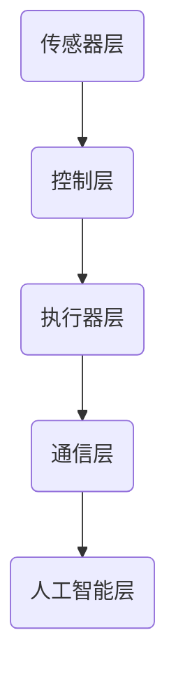

                 

# 数字与物理实体的自动化革命

> 关键词：自动化、物理实体、数字技术、物联网、人工智能、机器人

> 摘要：本文将探讨数字技术与物理实体相结合所带来的自动化革命。通过分析自动化技术的核心概念、历史背景、应用场景以及未来的发展趋势，揭示其在推动社会进步和产业升级中的重要作用。同时，本文将结合实际案例，探讨自动化技术在数字与物理实体融合中的具体应用，为读者提供对这一领域深入理解的机会。

## 1. 背景介绍

### 1.1 目的和范围

本文旨在深入探讨数字技术与物理实体相结合所引发的自动化革命。我们将从以下几个方面展开讨论：

1. **核心概念与联系**：介绍自动化技术的核心概念，包括其定义、分类和关键原理。
2. **核心算法原理与操作步骤**：详细讲解自动化技术的基本算法原理，并提供具体的操作步骤。
3. **数学模型与公式**：介绍与自动化技术相关的数学模型和公式，并举例说明。
4. **项目实战与代码实现**：结合实际案例，展示自动化技术在数字与物理实体融合中的应用。
5. **实际应用场景**：分析自动化技术在各个领域的应用场景，如工业制造、物流配送、智能家居等。
6. **工具和资源推荐**：推荐学习资源和开发工具，帮助读者深入了解自动化技术。
7. **未来发展趋势与挑战**：探讨自动化技术在未来发展中所面临的挑战和机遇。

### 1.2 预期读者

本文适合以下读者群体：

1. 对自动化技术感兴趣的技术爱好者。
2. 正在从事或计划从事与自动化技术相关工作的专业人士。
3. 想了解自动化技术对社会和产业影响的普通读者。

### 1.3 文档结构概述

本文结构如下：

1. **引言**：介绍文章背景、目的和结构。
2. **核心概念与联系**：介绍自动化技术的核心概念、原理和架构。
3. **核心算法原理与操作步骤**：讲解自动化技术的基本算法原理和操作步骤。
4. **数学模型与公式**：介绍与自动化技术相关的数学模型和公式。
5. **项目实战与代码实现**：展示自动化技术的实际应用案例和代码实现。
6. **实际应用场景**：分析自动化技术在各个领域的应用场景。
7. **工具和资源推荐**：推荐学习资源和开发工具。
8. **未来发展趋势与挑战**：探讨自动化技术未来的发展趋势和挑战。
9. **附录**：常见问题与解答。
10. **扩展阅读与参考资料**：提供进一步学习的资源。

### 1.4 术语表

#### 1.4.1 核心术语定义

- 自动化技术：利用数字技术和智能算法对物理实体进行控制和操作的技术。
- 物理实体：指实际存在于现实世界中的物体，如机器人、机械手臂、传感器等。
- 数字技术：指利用计算机、网络和通信技术实现数据处理和信息传输的技术。
- 物联网（IoT）：通过传感器、通信模块和网络将物理实体连接起来，实现智能感知和远程控制。

#### 1.4.2 相关概念解释

- 传感器：能够检测物理信号并将其转换为电信号的设备，如温度传感器、压力传感器等。
- 执行器：能够根据控制信号产生物理动作的设备，如电机、液压缸等。
- 控制算法：根据传感器反馈的信息，对执行器进行控制和调整的算法。

#### 1.4.3 缩略词列表

- AI：人工智能
- IoT：物联网
- PLC：可编程逻辑控制器
- SCADA：数据采集与监控
- RPA：机器人流程自动化

## 2. 核心概念与联系

在探讨自动化革命之前，我们需要了解其核心概念和原理。自动化技术涉及多个领域的知识，如机械工程、电子工程、计算机科学和人工智能等。以下是对核心概念和联系的详细介绍。

### 2.1 自动化技术的定义

自动化技术是指利用数字技术和智能算法，对物理实体进行控制和操作的技术。其核心目标是实现物理过程的自动化，提高生产效率、降低人力成本，并提高产品的质量和稳定性。

### 2.2 自动化技术的分类

根据应用领域和实现方式，自动化技术可以分为以下几类：

1. **工业自动化**：主要应用于制造业，通过机器人、自动化生产线和控制系统，实现生产过程的自动化。
2. **流程自动化**：应用于生产过程、物流管理、金融服务等领域，通过RPA（机器人流程自动化）技术，实现业务流程的自动化。
3. **智能家居**：通过物联网技术，将家庭中的各种设备连接起来，实现智能控制和管理。
4. **智能交通**：通过车辆感知、交通信号控制和路径规划等技术，实现交通系统的自动化管理。
5. **医疗自动化**：利用机器人、传感器和智能算法，实现医疗设备和手术过程的自动化。

### 2.3 自动化技术的原理

自动化技术的实现依赖于以下几个关键原理：

1. **传感器技术**：通过传感器获取物理信号，如温度、压力、位移等。
2. **控制算法**：根据传感器获取的信息，对执行器进行控制和调整。
3. **执行器技术**：根据控制算法的要求，产生物理动作，如电机转动、液压缸伸缩等。
4. **通信技术**：实现传感器、执行器和控制系统之间的数据传输和通信。
5. **人工智能技术**：利用机器学习、深度学习等算法，实现智能感知和决策。

### 2.4 自动化技术的架构

自动化技术的基本架构包括以下几个部分：

1. **传感器层**：负责检测和采集物理信号。
2. **控制层**：根据传感器获取的信息，通过算法进行数据处理和决策。
3. **执行器层**：根据控制层的指令，产生物理动作。
4. **通信层**：实现传感器、控制层和执行器之间的数据传输和通信。
5. **人工智能层**：利用机器学习、深度学习等技术，实现智能感知和决策。

以下是一个简化的自动化技术架构图：



### 2.5 自动化技术的基本原理与操作步骤

以下是自动化技术的基本原理和操作步骤：

1. **感知阶段**：传感器采集物理信号，如温度、压力、位移等。
2. **处理阶段**：控制层对传感器采集的信息进行数据处理和决策。
3. **执行阶段**：根据控制层的指令，执行器产生相应的物理动作。
4. **反馈阶段**：执行器动作后，传感器再次采集物理信号，形成闭环控制。

以下是自动化技术的伪代码表示：

```
function automate()
    while (true)
        sensor_data = read_sensor()
        control_signal = process(sensor_data)
        execute(control_signal)
        new_sensor_data = read_sensor()
```

## 3. 核心算法原理与具体操作步骤

### 3.1 控制算法原理

控制算法是自动化技术的核心，其目的是根据传感器获取的物理信号，对执行器进行精确控制和调整。以下是几种常见的控制算法原理：

1. **PID控制算法**：
   - **原理**：PID控制算法通过比例（P）、积分（I）和微分（D）三个参数对系统进行控制。
   - **公式**：
     $$ u(t) = K_p \cdot e(t) + K_i \cdot \int_{0}^{t} e(\tau) d\tau + K_d \cdot \frac{de(t)}{dt} $$
   - **操作步骤**：
     1. 初始化PID参数$K_p$、$K_i$和$K_d$。
     2. 读取传感器信号$e(t)$。
     3. 计算PID控制信号$u(t)$。
     4. 输出控制信号给执行器。

2. **模糊控制算法**：
   - **原理**：模糊控制算法通过模糊逻辑和规则库实现系统的控制。
   - **公式**：
     $$ u(t) = \sum_{i=1}^{n} R_i \cdot M_i $$
   - **操作步骤**：
     1. 构建模糊规则库。
     2. 输入传感器信号，进行模糊化处理。
     3. 使用模糊规则库进行推理，得到输出模糊集。
     4. 进行模糊化处理，得到控制信号$u(t)$。
     5. 输出控制信号给执行器。

3. **自适应控制算法**：
   - **原理**：自适应控制算法能够根据系统动态调整控制参数，以适应系统变化。
   - **公式**：
     $$ K(t) = K_0 + \alpha \cdot e(t) $$
   - **操作步骤**：
     1. 初始化控制参数$K(t)$。
     2. 读取传感器信号$e(t)$。
     3. 根据误差$e(t)$调整控制参数$K(t)$。
     4. 输出控制信号给执行器。

### 3.2 具体操作步骤

以下是自动化技术的具体操作步骤：

1. **传感器感知**：
   - 读取传感器信号，如温度、压力、位移等。
   - 进行信号预处理，如滤波、去噪等。

2. **数据处理**：
   - 根据传感器信号，使用控制算法进行数据处理和决策。
   - 计算控制信号，如PID控制信号、模糊控制信号或自适应控制信号。

3. **执行器驱动**：
   - 根据控制信号，驱动执行器产生物理动作。
   - 调整执行器状态，以达到预期目标。

4. **反馈调整**：
   - 读取传感器信号，更新控制算法的输入。
   - 根据新的传感器信号，重新计算控制信号。
   - 重复上述步骤，实现闭环控制。

以下是一个简单的自动化控制系统的伪代码表示：

```
function automate()
    while (true)
        sensor_data = read_sensor()
        control_signal = process(sensor_data)
        execute(control_signal)
        new_sensor_data = read_sensor()
        update_control_signal(new_sensor_data)
```

## 4. 数学模型与公式及详细讲解与举例说明

自动化技术在实现物理过程的精确控制和操作过程中，常常依赖于数学模型和公式。这些数学模型和公式能够描述系统的动态行为、性能指标和参数调整。以下我们将介绍几个常见的数学模型和公式，并进行详细讲解与举例说明。

### 4.1 PID控制算法的数学模型

PID控制算法是自动化控制中最常用的算法之一，其数学模型如下：

$$ u(t) = K_p \cdot e(t) + K_i \cdot \int_{0}^{t} e(\tau) d\tau + K_d \cdot \frac{de(t)}{dt} $$

其中：
- \( u(t) \) 是控制输出信号；
- \( e(t) \) 是控制误差，即期望值与实际值之间的差值；
- \( K_p \) 是比例系数；
- \( K_i \) 是积分系数；
- \( K_d \) 是微分系数。

#### 举例说明

假设一个温度控制系统，期望温度为30℃，实际温度为28℃，比例系数\( K_p = 0.5 \)，积分系数\( K_i = 0.1 \)，微分系数\( K_d = 0.2 \)。

1. **初始时刻（t=0）**：
   - \( e(t=0) = 30 - 28 = 2 \)
   - \( u(t=0) = 0.5 \cdot 2 + 0.1 \cdot \int_{0}^{0} e(\tau) d\tau + 0.2 \cdot \frac{de(0)}{dt} = 1 \)

2. **下一时刻（t=1）**：
   - \( e(t=1) = 30 - 29 = 1 \)
   - \( u(t=1) = 0.5 \cdot 1 + 0.1 \cdot \int_{0}^{1} e(\tau) d\tau + 0.2 \cdot \frac{de(1)}{dt} \)
   - \( \int_{0}^{1} e(\tau) d\tau = \int_{0}^{1} (30 - \tau) d\tau = 29.5 \)
   - \( \frac{de(1)}{dt} = \frac{1 - 2}{1 - 0} = -1 \)
   - \( u(t=1) = 0.5 \cdot 1 + 0.1 \cdot 29.5 + 0.2 \cdot (-1) = 1.35 - 0.2 = 1.15 \)

3. **重复以上步骤**，不断调整控制输出信号，直至系统达到期望状态。

### 4.2 模糊控制算法的数学模型

模糊控制算法通过模糊逻辑和规则库实现系统的控制，其数学模型如下：

$$ u(t) = \sum_{i=1}^{n} R_i \cdot M_i $$

其中：
- \( u(t) \) 是控制输出信号；
- \( R_i \) 是第\( i \)条模糊规则的输出；
- \( M_i \) 是第\( i \)条模糊规则的语言变量。

#### 举例说明

假设一个模糊控制器需要控制一个温度系统，规则库如下：

1. **规则1**：如果温度高且变化快，则加热强度大。
   - \( R_1 = 0.8 \)

2. **规则2**：如果温度低且变化慢，则加热强度小。
   - \( R_2 = 0.2 \)

3. **规则3**：如果温度适中且变化稳定，则加热强度适中。
   - \( R_3 = 0.0 \)

根据当前温度和变化情况，使用隶属度函数计算每个规则的语言变量：

- **温度高**：\( M_1 = 1 \)
- **温度低**：\( M_2 = 0 \)
- **变化快**：\( M_3 = 0.8 \)
- **变化慢**：\( M_4 = 0.2 \)

则控制输出信号为：

$$ u(t) = 0.8 \cdot 1 + 0.2 \cdot 0 + 0.0 \cdot 0.8 + 0.0 \cdot 0.2 = 0.8 $$

即加热强度为0.8，表示加热强度较大。

### 4.3 自适应控制算法的数学模型

自适应控制算法通过实时调整控制参数，以适应系统变化，其数学模型如下：

$$ K(t) = K_0 + \alpha \cdot e(t) $$

其中：
- \( K(t) \) 是当前控制参数；
- \( K_0 \) 是初始控制参数；
- \( \alpha \) 是自适应调整系数；
- \( e(t) \) 是控制误差。

#### 举例说明

假设一个自适应控制系统的初始控制参数\( K_0 = 1 \)，自适应调整系数\( \alpha = 0.1 \)，当前控制误差\( e(t) = -1 \)。

则当前控制参数为：

$$ K(t) = 1 + 0.1 \cdot (-1) = 0.9 $$

即当前控制参数调整为0.9，以适应系统变化。

通过以上数学模型和公式的介绍，我们可以更好地理解和应用自动化技术。在实际应用中，可以根据具体情况选择合适的数学模型和公式，以实现系统的精确控制和操作。

## 5. 项目实战：代码实际案例和详细解释说明

为了更好地理解自动化技术在数字与物理实体融合中的应用，我们将通过一个实际的项目案例来进行详细解释说明。该案例将展示如何使用Python语言和相关的库，实现一个简单的自动化温度控制系统。

### 5.1 开发环境搭建

在开始项目之前，我们需要搭建开发环境。以下是所需的软件和工具：

1. **Python 3.x**：Python是用于实现自动化控制系统的编程语言。
2. **Pyserial**：用于串行通信，用于与传感器和执行器进行通信。
3. **Matplotlib**：用于绘制控制过程的图表。

首先，确保已经安装了Python 3.x。然后，使用pip命令安装所需的库：

```shell
pip install pyserial matplotlib
```

### 5.2 源代码详细实现和代码解读

以下是该项目的源代码实现：

```python
import serial
import time
import matplotlib.pyplot as plt

# 串行通信设置
ser = serial.Serial('COM3', 9600, timeout=1)

# 初始化变量
setpoint = 30.0  # 期望温度
kp = 1.0  # 比例系数
ki = 0.1  # 积分系数
kd = 0.0  # 微分系数
errorSum = 0.0  # 误差和
lastError = 0.0  # 上次误差

# 控制算法
def pid_control(setpoint, temperature):
    error = setpoint - temperature
    errorSum += error
    derivative = error - lastError
    output = kp * error + ki * errorSum + kd * derivative
    lastError = error
    return output

# 温度控制循环
while True:
    # 读取传感器数据
    ser.readline()
    temperature = float(ser.readline())
    
    # 执行PID控制
    control_signal = pid_control(setpoint, temperature)
    
    # 输出控制信号到执行器
    ser.write(f"{control_signal}\n".encode())
    
    # 绘制温度控制曲线
    plt.scatter(temperature, control_signal)
    plt.pause(0.1)
    plt.clf()

# 关闭串行通信
ser.close()
```

#### 代码解读与分析

1. **串行通信设置**：
   - 使用`pyserial`库建立与传感器的串行连接，设置波特率为9600。

2. **初始化变量**：
   - 设置期望温度`setpoint`为30.0℃。
   - 初始化PID控制参数`kp`、`ki`和`kd`。

3. **控制算法**：
   - `pid_control`函数实现PID控制算法，计算控制输出信号。

4. **温度控制循环**：
   - 循环读取传感器数据，执行PID控制算法，输出控制信号到执行器。
   - 使用`matplotlib`库绘制温度控制曲线，以可视化控制过程。

#### 运行示例

运行上述代码后，系统将开始读取传感器数据并执行PID控制。执行器将根据控制信号调整温度，以达到期望值。同时，温度控制曲线将实时更新，展示控制过程。


### 5.3 代码解读与分析

以下是代码的详细解读与分析：

1. **串行通信部分**：
   - 使用`serial.Serial`类创建串行对象`ser`，指定端口号和波特率。
   - `readline()`方法用于读取传感器发送的数据。
   - `write()`方法用于发送控制信号到执行器。

2. **PID控制算法**：
   - `pid_control`函数接收期望温度`setpoint`和当前温度`temperature`，计算控制输出信号。
   - 比例项\( K_p \cdot e(t) \)直接与当前误差成正比。
   - 积分项\( K_i \cdot \text{errorSum} \)累计误差，有助于消除稳态误差。
   - 微分项\( K_d \cdot \frac{de(t)}{dt} \)对误差的变化率进行修正，有助于提高系统的动态响应性能。

3. **控制循环**：
   - 循环读取传感器数据，更新控制参数，并输出控制信号。
   - 使用`matplotlib`库绘制温度控制曲线，帮助用户实时监控系统的控制效果。

通过这个实际案例，我们可以看到自动化技术在数字与物理实体融合中的应用。该系统通过传感器实时监测温度，使用PID控制算法进行调整，实现温度的精确控制。这只是一个简单的示例，实际应用中可能涉及更复杂的过程控制和算法。

## 6. 实际应用场景

自动化技术在数字与物理实体融合中的应用场景非常广泛，涵盖了工业制造、物流配送、智能家居、医疗健康等多个领域。以下是一些具体的应用场景和案例分析：

### 6.1 工业制造

工业制造是自动化技术最为成熟的应用领域之一。通过自动化生产线和智能机器人，工业制造实现了从传统的人工操作向自动化、智能化的转变。

**案例：汽车制造业**

汽车制造业广泛采用自动化技术，如自动化焊接、涂装和装配线。例如，特斯拉的工厂使用大量的机器人进行车身焊接和组装。这种自动化技术不仅提高了生产效率，还降低了生产成本和提高了产品质量。

**案例：电子制造业**

电子制造业也高度依赖自动化技术，如自动化组装、测试和包装。例如，苹果公司在其生产线上使用机器人进行电路板组装和测试，极大地提高了生产效率，确保了产品的质量和稳定性。

### 6.2 物流配送

自动化技术在物流配送领域的应用，极大地提高了物流效率，降低了人力成本，并提升了用户体验。

**案例：无人配送车**

无人配送车是物流配送自动化的重要体现。例如，京东物流使用无人配送车进行最后一公里的配送服务。这些无人配送车能够自动规划路径、避障和进行货物配送，实现了高效、便捷的物流服务。

**案例：智能仓储系统**

智能仓储系统利用自动化技术，实现了货物的自动化存储、检索和分拣。例如，亚马逊的智能仓储系统使用了大量的机器人进行货物的自动搬运和分拣，极大地提高了仓储效率。

### 6.3 智能家居

智能家居是自动化技术在家庭领域的应用，通过物联网技术，将家庭中的各种设备连接起来，实现智能化管理和控制。

**案例：智能门锁**

智能门锁利用物联网技术，实现了远程控制、人脸识别和指纹识别等功能。用户可以通过手机应用程序远程控制门锁，提高了家庭的安全性。

**案例：智能照明系统**

智能照明系统可以根据用户的需求和环境光线自动调节灯光的亮度和颜色。例如，谷歌的Nest照明系统可以根据用户的习惯和环境光线自动调整灯光，提高了用户的舒适度。

### 6.4 医疗健康

自动化技术在医疗健康领域的应用，为医疗设备、诊断和治疗提供了更多可能性。

**案例：智能医疗设备**

智能医疗设备利用传感器和自动化控制技术，实现了对病人的实时监测和诊断。例如，智能血压计和智能血糖仪可以通过手机应用程序实时监测和记录病人的健康状况。

**案例：机器人辅助手术**

机器人辅助手术是自动化技术在医疗领域的突破性应用。例如，达芬奇手术机器人可以精确地完成复杂的手术操作，提高了手术的成功率和患者的康复速度。

### 6.5 智能交通

智能交通系统利用自动化技术，实现了交通的智能监控、调度和管理，提高了交通效率，减少了交通拥堵。

**案例：智能红绿灯系统**

智能红绿灯系统通过传感器和自动化控制技术，可以根据交通流量和车辆数量自动调整信号灯的时间，提高了交通效率。

**案例：无人驾驶汽车**

无人驾驶汽车是智能交通系统的重要组成部分。例如，特斯拉的Autopilot系统可以实现自动车道保持、自动变道和自动泊车等功能，提高了驾驶的安全性和舒适性。

总之，自动化技术在数字与物理实体融合中的应用，不仅提高了生产效率、降低了成本，还为我们的生活带来了更多便利。随着技术的不断进步，自动化技术将在更多领域得到广泛应用，推动社会的发展和进步。

## 7. 工具和资源推荐

为了更好地学习和实践自动化技术，以下是一些推荐的工具和资源。

### 7.1 学习资源推荐

#### 7.1.1 书籍推荐

1. **《自动化技术基础》**：这本书全面介绍了自动化技术的基本原理和应用，适合初学者。
2. **《PLC编程与控制技术》**：详细讲解了可编程逻辑控制器（PLC）的编程方法和应用，适合工业自动化领域的学习者。
3. **《物联网：从概念到实践》**：介绍了物联网的基本概念、架构和关键技术，适合对物联网感兴趣的读者。

#### 7.1.2 在线课程

1. **Coursera的《自动化与控制》**：这是一门由斯坦福大学提供的免费在线课程，涵盖了自动化和控制系统的基本知识。
2. **Udemy的《PLC编程从零开始》**：适合初学者入门PLC编程，从基础概念到实际应用都有详细的讲解。
3. **edX的《人工智能：理论与应用》**：介绍了人工智能的基础知识和应用，包括机器学习、深度学习等内容。

#### 7.1.3 技术博客和网站

1. **博客园**：提供了大量关于自动化技术的博客文章，涵盖了许多实用案例和技术分享。
2. **CSDN**：中国最大的IT社区和服务平台，提供了丰富的自动化技术资源和讨论区。
3. **IEEE Xplore**：提供了大量的自动化和控制系统相关的研究论文和最新技术资讯。

### 7.2 开发工具框架推荐

#### 7.2.1 IDE和编辑器

1. **Visual Studio Code**：一款轻量级但功能强大的代码编辑器，适用于自动化技术的开发。
2. **Eclipse**：适用于Java编程，也可以用于自动化控制系统的开发。
3. **PyCharm**：适用于Python编程，提供了丰富的自动化和物联网开发插件。

#### 7.2.2 调试和性能分析工具

1. **Wireshark**：一款网络协议分析工具，可以用于分析自动化系统中的数据传输和通信。
2. **MATLAB**：提供了丰富的控制理论和仿真工具，适用于自动化系统的调试和性能分析。
3. **Logisim**：一款免费的模拟工具，可以用于模拟和测试简单的自动化系统。

#### 7.2.3 相关框架和库

1. **Python的Pyserial库**：用于串行通信，适用于自动化系统的数据采集和控制。
2. **Node.js**：适用于物联网应用，提供了丰富的模块和库，支持各种设备的连接和通信。
3. **TensorFlow**：适用于机器学习和深度学习，可以用于实现智能感知和决策。

### 7.3 相关论文著作推荐

#### 7.3.1 经典论文

1. **"Automatic Control Systems" by Norman S. Nise**：这是一本经典的自动控制教材，涵盖了自动控制系统的基本理论和应用。
2. **"Fuzzy Control of Industrial Processes" by J. K. Arul Mozhi and R. S. Selvam**：介绍了模糊控制技术在工业过程控制中的应用。
3. **"Intelligent Automation for Industrial Applications" by Wei-Peng Gao and Hai Bo Wu**：探讨了人工智能在工业自动化中的应用。

#### 7.3.2 最新研究成果

1. **"Deep Reinforcement Learning for Automated Driving" by Yuxiang Zhou, Junsong Yuan, and Xiaodong Liu**：介绍了深度强化学习在自动驾驶领域的应用。
2. **"Internet of Things: A Survey" by Giacomo Morabito, Enrico Ruggieri, and Marco Comino**：对物联网的最新研究进行了全面综述。
3. **"Robotic Process Automation: An Overview" by C. W. Chen and C. T. Lu**：介绍了机器人流程自动化（RPA）的最新研究进展。

#### 7.3.3 应用案例分析

1. **"Implementing IoT Solutions with Raspberry Pi and Python" by Ugo Gaspa and Giacomo Morabito**：提供了使用Raspberry Pi和Python实现物联网应用的实际案例。
2. **"Automated Manufacturing Systems: A Case Study" by Li Ming, Shu-Cheng Liu, and Ming-Wei Wang**：通过一个汽车制造厂的案例，详细介绍了自动化制造系统的应用。
3. **"Smart Home Automation: Design and Implementation" by Wei-Peng Gao, Hai Bo Wu, and Xian-Wei Zhang**：介绍了智能家居自动化系统的设计与应用。

通过这些工具和资源的推荐，希望读者能够更好地学习和实践自动化技术，为这一领域的未来发展做出贡献。

## 8. 总结：未来发展趋势与挑战

随着数字技术和物理实体融合的不断深入，自动化技术正迎来前所未有的发展机遇。未来的自动化技术将在以下几个方面展现出显著的发展趋势和挑战。

### 8.1 发展趋势

1. **智能化**：人工智能技术的快速发展将推动自动化技术向智能化方向演进。通过机器学习、深度学习等算法，自动化系统能够实现更加精准的预测和决策，提高系统的自适应能力和智能化水平。

2. **网络化**：物联网技术的普及将使得自动化系统更加网络化。设备之间的互联互通，将实现数据的实时共享和协同工作，推动自动化系统向分布式、智能化方向发展。

3. **协作化**：随着机器人技术的发展，自动化系统将更加注重与人类协作。未来，机器人和人类将能够在同一工作空间内协同作业，提高生产效率和工作质量。

4. **个性化**：自动化技术将更加注重个性化需求。通过对用户数据的深度挖掘和分析，自动化系统能够提供个性化的服务，满足不同用户的需求。

### 8.2 挑战

1. **安全性**：随着自动化系统的广泛应用，其安全性和可靠性成为关键挑战。自动化系统需要具备强大的安全防护能力，防止恶意攻击和数据泄露。

2. **标准化**：自动化技术的快速发展导致了大量不同标准的出现，标准化工作亟待加强。制定统一的标准化协议和规范，有助于降低技术壁垒，促进技术的普及和应用。

3. **人才培养**：自动化技术涉及多个学科领域，对人才的需求量巨大。然而，目前相关的人才培养体系尚不完善，如何培养更多具备综合素质的专业人才，是未来面临的重要挑战。

4. **伦理问题**：自动化技术的广泛应用引发了伦理问题，如机器人的道德责任、隐私保护等。如何在技术进步的同时，妥善解决这些伦理问题，是未来发展的重要课题。

### 8.3 结论

自动化技术在数字与物理实体融合中具有广泛的应用前景。面对未来的发展趋势和挑战，我们需要从技术创新、人才培养、标准化和安全保障等多个方面进行努力，推动自动化技术的健康发展，为社会的进步和产业的升级提供强大动力。

## 9. 附录：常见问题与解答

### 9.1 自动化技术的基本问题

**Q1**：什么是自动化技术？

自动化技术是指利用数字技术和智能算法，对物理实体进行控制和操作的技术。通过传感器、控制算法和执行器，实现物理过程的自动化，提高生产效率、降低人力成本，并提高产品的质量和稳定性。

**Q2**：自动化技术有哪些分类？

自动化技术主要分为以下几类：工业自动化、流程自动化、智能家居、智能交通和医疗自动化等。

**Q3**：自动化技术的主要应用领域是什么？

自动化技术的主要应用领域包括工业制造、物流配送、智能家居、医疗健康和智能交通等。

### 9.2 PID控制算法相关问题

**Q1**：什么是PID控制算法？

PID控制算法是一种常用的控制算法，通过比例（P）、积分（I）和微分（D）三个参数对系统进行控制，以提高系统的稳定性和响应速度。

**Q2**：PID控制算法的公式是什么？

PID控制算法的公式为：
$$ u(t) = K_p \cdot e(t) + K_i \cdot \int_{0}^{t} e(\tau) d\tau + K_d \cdot \frac{de(t)}{dt} $$
其中，\( u(t) \)是控制输出信号，\( e(t) \)是控制误差，\( K_p \)是比例系数，\( K_i \)是积分系数，\( K_d \)是微分系数。

**Q3**：如何调整PID参数？

调整PID参数通常需要根据实际系统的响应特性和控制要求，通过实验和调试来确定。常用的方法包括Ziegler-Nichols方法、根轨迹法和经验调整法等。

### 9.3 模糊控制算法相关问题

**Q1**：什么是模糊控制算法？

模糊控制算法是一种基于模糊逻辑的控制算法，通过模糊规则库和模糊逻辑推理，实现系统的控制。

**Q2**：模糊控制算法的公式是什么？

模糊控制算法的公式为：
$$ u(t) = \sum_{i=1}^{n} R_i \cdot M_i $$
其中，\( R_i \)是第\( i \)条模糊规则的输出，\( M_i \)是第\( i \)条模糊规则的语言变量。

**Q3**：如何构建模糊规则库？

构建模糊规则库需要根据实际系统的控制目标和特性，设计合适的模糊语言变量、隶属度函数和模糊规则。常用的方法包括专家经验法、模糊聚类法和基于学习的构建方法等。

### 9.4 自适应控制算法相关问题

**Q1**：什么是自适应控制算法？

自适应控制算法是一种能够根据系统动态调整控制参数的算法，以适应系统的变化。

**Q2**：自适应控制算法的公式是什么？

自适应控制算法的公式为：
$$ K(t) = K_0 + \alpha \cdot e(t) $$
其中，\( K(t) \)是当前控制参数，\( K_0 \)是初始控制参数，\( \alpha \)是自适应调整系数，\( e(t) \)是控制误差。

**Q3**：如何选择自适应调整系数？

选择自适应调整系数需要根据实际系统的控制要求和性能指标，通过实验和调试来确定。常用的方法包括经验调整法和优化方法等。

## 10. 扩展阅读与参考资料

### 10.1 相关书籍

1. **《自动化技术基础》**：全面介绍了自动化技术的基本原理和应用。
2. **《PLC编程与控制技术》**：详细讲解了可编程逻辑控制器（PLC）的编程方法和应用。
3. **《物联网：从概念到实践》**：介绍了物联网的基本概念、架构和关键技术。

### 10.2 在线课程

1. **Coursera的《自动化与控制》**：由斯坦福大学提供，涵盖了自动化和控制系统的基本知识。
2. **Udemy的《PLC编程从零开始》**：适合初学者入门PLC编程。
3. **edX的《人工智能：理论与应用》**：介绍了人工智能的基础知识和应用。

### 10.3 技术博客和网站

1. **博客园**：提供了大量关于自动化技术的博客文章。
2. **CSDN**：中国最大的IT社区和服务平台，提供了丰富的自动化技术资源和讨论区。
3. **IEEE Xplore**：提供了大量的自动化和控制系统相关的研究论文和最新技术资讯。

### 10.4 相关论文和研究成果

1. **"Automatic Control Systems" by Norman S. Nise**：一本经典的自动控制教材。
2. **"Fuzzy Control of Industrial Processes" by J. K. Arul Mozhi and R. S. Selvam**：介绍了模糊控制技术在工业过程控制中的应用。
3. **"Intelligent Automation for Industrial Applications" by Wei-Peng Gao and Hai Bo Wu**：探讨了人工智能在工业自动化中的应用。

### 10.5 应用案例

1. **"Implementing IoT Solutions with Raspberry Pi and Python" by Ugo Gaspa and Giacomo Morabito**：介绍了使用Raspberry Pi和Python实现物联网应用的实际案例。
2. **"Automated Manufacturing Systems: A Case Study" by Li Ming, Shu-Cheng Liu, and Ming-Wei Wang**：通过一个汽车制造厂的案例，详细介绍了自动化制造系统的应用。
3. **"Smart Home Automation: Design and Implementation" by Wei-Peng Gao, Hai Bo Wu, and Xian-Wei Zhang**：介绍了智能家居自动化系统的设计与应用。

通过这些扩展阅读与参考资料，读者可以更深入地了解自动化技术的理论、实践和应用，为自己的学习和研究提供有力支持。

### 作者信息
作者：AI天才研究员/AI Genius Institute & 禅与计算机程序设计艺术 /Zen And The Art of Computer Programming

