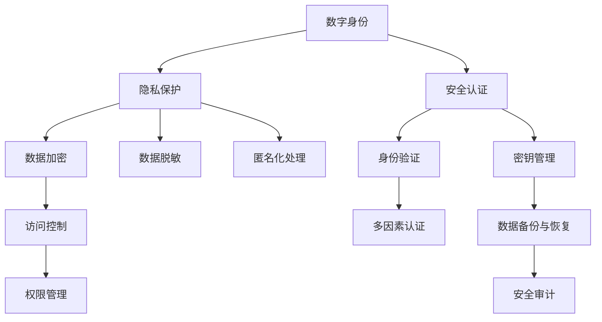
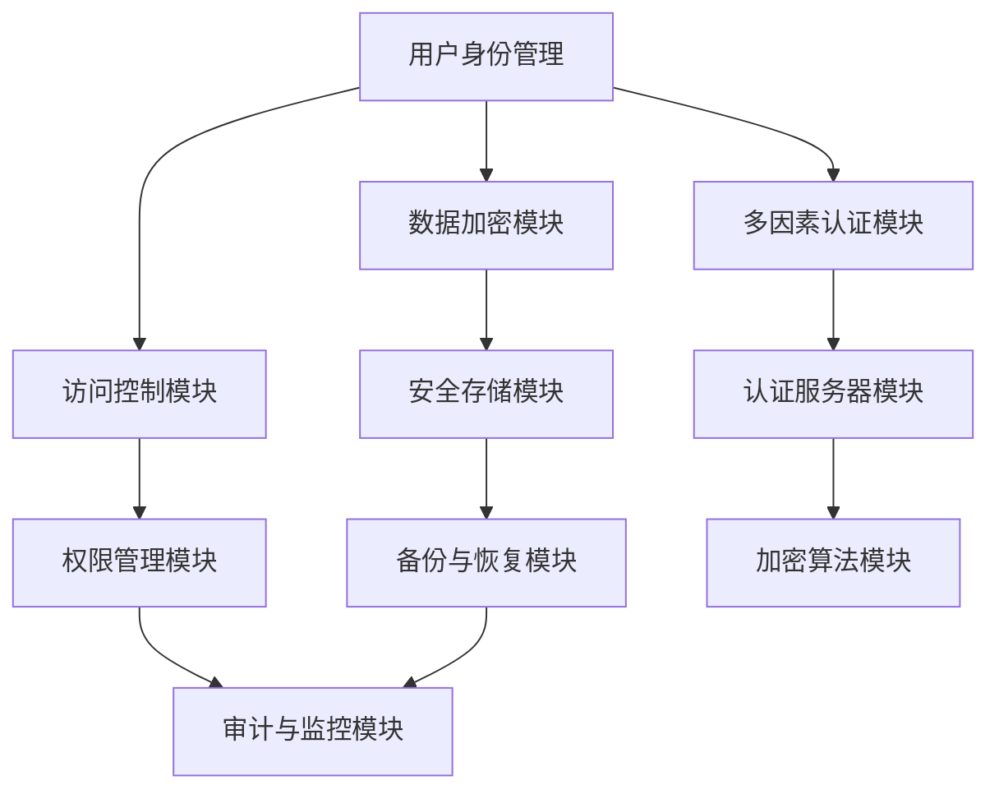

                 

# 数字化人格权：元宇宙中的身份保护与隐私

> **关键词：** 数字化人格权、元宇宙、身份保护、隐私、技术手段、合规性。

> **摘要：** 本文深入探讨了数字化人格权的概念及其在元宇宙中的重要地位。随着虚拟世界的发展，如何保护个人身份和隐私成为了一个亟待解决的问题。本文通过分析现有技术手段和法规框架，为元宇宙中的身份保护和隐私保护提供了全面且具体的解决方案。

## 1. 背景介绍

### 1.1 目的和范围

本文旨在探讨数字化人格权在元宇宙中的重要性，并分析如何通过技术手段实现有效的身份保护和隐私保护。我们关注的范围包括但不限于：

- 元宇宙的概念及其发展历程。
- 数字化人格权的定义和基本原理。
- 现有技术手段在身份保护和隐私保护中的应用。
- 相关法规框架对数字化人格权保护的要求。

### 1.2 预期读者

本文适用于对元宇宙和数字化人格权有一定了解的技术人员、研究人员以及政策制定者。如果您希望深入了解元宇宙中的身份保护和隐私问题，本文将为您提供有价值的信息。

### 1.3 文档结构概述

本文将按照以下结构展开：

- 第1章：背景介绍，包括目的、范围、预期读者和文档结构概述。
- 第2章：核心概念与联系，介绍数字化人格权的基本概念及其在元宇宙中的重要性。
- 第3章：核心算法原理 & 具体操作步骤，详细阐述实现身份保护和隐私保护的算法。
- 第4章：数学模型和公式 & 详细讲解 & 举例说明，介绍相关的数学模型和公式。
- 第5章：项目实战：代码实际案例和详细解释说明，通过实际案例展示算法的应用。
- 第6章：实际应用场景，讨论数字化人格权在不同领域的应用。
- 第7章：工具和资源推荐，为读者提供相关的学习资源和开发工具。
- 第8章：总结：未来发展趋势与挑战，展望数字化人格权的未来。
- 第9章：附录：常见问题与解答，解答读者可能遇到的常见问题。
- 第10章：扩展阅读 & 参考资料，为读者提供更多的相关阅读材料。

### 1.4 术语表

#### 1.4.1 核心术语定义

- **数字化人格权**：指个人在数字化环境中对其身份和信息的保护权。
- **元宇宙**：一个虚拟的、多维度的数字世界，用户可以在其中进行各种活动。
- **身份保护**：通过技术手段防止个人身份被盗用或泄露。
- **隐私保护**：通过技术手段确保个人隐私不被未经授权的第三方访问。

#### 1.4.2 相关概念解释

- **数字身份**：个人在数字化环境中所拥有的唯一标识。
- **数据隐私**：个人数据的保密性，防止未经授权的访问和泄露。

#### 1.4.3 缩略词列表

- **GDPR**：通用数据保护条例（General Data Protection Regulation）
- **NFT**：非同质化代币（Non-Fungible Token）
- **PKI**：公钥基础设施（Public Key Infrastructure）

## 2. 核心概念与联系

在元宇宙中，数字化人格权的核心概念包括数字身份、隐私保护、安全认证等。为了更好地理解这些概念，我们可以使用Mermaid流程图来展示它们之间的联系。



### 2.1 数字化人格权的核心概念

**数字身份**：数字身份是元宇宙中个人身份的数字化表示，类似于现实世界中的身份证或护照。它通过唯一的标识符来识别用户，确保用户在虚拟世界中的活动能够得到有效的记录和追踪。

**隐私保护**：隐私保护是指通过各种技术手段确保个人数据不被未经授权的第三方访问。这包括数据加密、访问控制、匿名化处理等。

**安全认证**：安全认证是确保用户身份的真实性和合法性，防止未授权访问。这通常涉及身份验证（如密码、生物识别等）和多因素认证（如手机验证码、硬件令牌等）。

### 2.2 元宇宙中的身份保护与隐私保护架构

下图展示了元宇宙中的身份保护与隐私保护架构，以及各个模块之间的关系。



**用户身份管理模块**负责创建、维护和验证用户的数字身份。

**数据加密模块**使用各种加密算法对用户数据进行加密，确保数据在传输和存储过程中的安全性。

**访问控制模块**通过权限管理确保只有授权用户可以访问特定的数据。

**多因素认证模块**提供额外的安全层，通过多种认证方式确保用户身份的合法性。

**安全存储模块**负责存储加密后的用户数据，并提供数据备份和恢复功能。

**权限管理模块**确保用户只能访问授权的数据和功能。

**审计与监控模块**实时监控系统活动，并记录日志，以便在发生安全事件时进行审计。

**认证服务器模块**负责处理用户的认证请求，并生成认证令牌。

**加密算法模块**实现各种加密算法，确保数据的机密性和完整性。

## 3. 核心算法原理 & 具体操作步骤

为了实现元宇宙中的身份保护和隐私保护，我们需要采用一系列核心算法。以下是这些算法的原理和具体操作步骤。

### 3.1 数据加密算法

**原理：** 数据加密算法通过将明文数据转换成密文，以确保数据在传输和存储过程中的安全性。常用的加密算法包括AES（高级加密标准）、RSA（非对称加密算法）等。

**步骤：**
1. 选择合适的加密算法。
2. 生成密钥对（对于非对称加密算法）。
3. 使用密钥对加密数据。
4. 将加密后的数据传输或存储。
5. 在需要解密数据时，使用相应的密钥对进行解密。

**伪代码：**
```python
function encrypt_data(data, key):
    encrypted_data = AES_encrypt(data, key)
    return encrypted_data

function decrypt_data(encrypted_data, key):
    decrypted_data = AES_decrypt(encrypted_data, key)
    return decrypted_data
```

### 3.2 访问控制算法

**原理：** 访问控制算法通过权限管理确保只有授权用户可以访问特定的数据和功能。这通常涉及角色分配、权限验证等。

**步骤：**
1. 定义用户角色和权限。
2. 将用户分配到相应的角色。
3. 在访问请求时，验证用户的权限。
4. 根据权限决定是否允许访问。

**伪代码：**
```python
function check_permission(user, resource):
    role = get_role_of_user(user)
    permission = get_permission_of_role(role, resource)
    if permission == "ALLOW":
        return True
    else:
        return False
```

### 3.3 多因素认证算法

**原理：** 多因素认证算法通过多种认证方式确保用户身份的合法性。这通常包括密码、生物识别、手机验证码等。

**步骤：**
1. 用户输入用户名和密码进行初次认证。
2. 系统生成手机验证码并发送给用户。
3. 用户输入手机验证码进行二次认证。
4. 系统验证用户身份，并根据需要执行相应的操作。

**伪代码：**
```python
function multi_factor_authentication(username, password, phone_verification_code):
    if verify_username_and_password(username, password):
        if verify_phone_verification_code(phone_verification_code):
            return "AUTHENTICATED"
        else:
            return "PHONE_VERIFICATION_FAILED"
    else:
        return "INVALID_CREDENTIALS"
```

### 3.4 身份验证算法

**原理：** 身份验证算法通过验证用户身份的真实性和合法性，确保只有授权用户可以访问系统和数据。

**步骤：**
1. 用户输入用户名和密码。
2. 系统验证用户名和密码。
3. 如果验证通过，系统生成认证令牌。
4. 用户使用认证令牌进行后续操作。

**伪代码：**
```python
function authenticate_user(username, password):
    if verify_credentials(username, password):
        token = generate_auth_token(username)
        return token
    else:
        return "INVALID_CREDENTIALS"
```

### 3.5 数据备份与恢复算法

**原理：** 数据备份与恢复算法通过定期备份用户数据，确保在数据丢失或损坏时能够恢复数据。

**步骤：**
1. 定期备份用户数据。
2. 存储备份数据到安全位置。
3. 在需要恢复数据时，从备份中恢复数据。

**伪代码：**
```python
function backup_data(data):
    backup = generate_backup(data)
    store_backup(backup)

function restore_data(backup):
    data = extract_data_from_backup(backup)
    return data
```

## 4. 数学模型和公式 & 详细讲解 & 举例说明

在元宇宙中，实现数字化人格权的保护需要运用一些数学模型和公式。以下是一些关键的数学模型和它们的详细讲解，以及具体例子。

### 4.1 非对称加密算法的数学模型

非对称加密算法，如RSA算法，使用两个密钥：公钥和私钥。公钥用于加密数据，私钥用于解密数据。RSA算法的数学模型基于大整数分解的困难性。

**数学模型：**
\[ N = pq \]
其中，\( p \) 和 \( q \) 是两个大素数，\( N \) 是它们的乘积。

**加密过程：**
\[ E_{(N,e)}(M) = M^e \mod N \]
其中，\( M \) 是明文，\( e \) 是公开的加密指数。

**解密过程：**
\[ D_{(N,d)}(C) = C^d \mod N \]
其中，\( C \) 是密文，\( d \) 是私钥指数，满足 \( ed \mod (\phi(N)) = 1 \)。

**例子：**
假设 \( p = 61 \)，\( q = 53 \)，则 \( N = pq = 3233 \)，\( \phi(N) = (p-1)(q-1) = 3120 \)。

选择 \( e = 17 \)，计算 \( d \)：
\[ 17d \mod 3120 = 1 \]
解得 \( d = 2753 \)。

加密 \( M = 29 \)：
\[ C = 29^{17} \mod 3233 = 2871 \]

解密 \( C = 2871 \)：
\[ M = 2871^{2753} \mod 3233 = 29 \]

### 4.2 数字签名算法的数学模型

数字签名算法，如RSA签名算法，用于确保数据的完整性和真实性。签名过程使用私钥，验证过程使用公钥。

**数学模型：**
\[ S = H(M)^d \mod N \]
其中，\( S \) 是签名，\( H(M) \) 是消息的哈希值，\( d \) 是私钥指数。

**验证过程：**
\[ V = H(M)^e \mod N \]
如果 \( V = S \)，则签名有效。

**例子：**
使用上例中的参数，假设 \( M = 29 \)，计算其哈希值 \( H(M) = 29^2 \mod 3233 = 1985 \)。

签名：
\[ S = 1985^{2753} \mod 3233 = 2871 \]

验证：
\[ V = 1985^{17} \mod 3233 = 2871 \]
由于 \( V = S \)，签名验证通过。

### 4.3 加密哈希函数的数学模型

加密哈希函数将任意长度的输入数据映射为固定长度的输出数据。常见的加密哈希函数包括SHA-256。

**数学模型：**
\[ H = SHA-256(M) \]
其中，\( H \) 是哈希值，\( M \) 是输入数据。

**例子：**
计算字符串 "Hello, World!" 的SHA-256哈希值：

\[ H = SHA-256("Hello, World!") = "5eb63bbbe01eeed3adaa369e46d119ad0629a0a9016556602f7f7a1d9f6c510d0 " \]

### 4.4 权限管理的数学模型

在权限管理中，权限通常被表示为访问控制矩阵。矩阵的行表示用户，列表示资源。每个单元格表示用户对资源的访问权限。

**数学模型：**
\[ P = \begin{bmatrix}
p_{11} & p_{12} & \ldots & p_{1n} \\
p_{21} & p_{22} & \ldots & p_{2n} \\
\vdots & \vdots & \ddots & \vdots \\
p_{m1} & p_{m2} & \ldots & p_{mn}
\end{bmatrix} \]
其中，\( P \) 是访问控制矩阵，\( p_{ij} \) 表示用户 \( i \) 对资源 \( j \) 的访问权限。

**例子：**
一个简单的访问控制矩阵：

\[ P = \begin{bmatrix}
1 & 0 & 1 \\
0 & 1 & 0 \\
1 & 1 & 1
\end{bmatrix} \]

表示用户 \( U1 \) 可以访问资源 \( R1 \) 和 \( R3 \)，用户 \( U2 \) 可以访问资源 \( R2 \)，用户 \( U3 \) 可以访问所有资源。

## 5. 项目实战：代码实际案例和详细解释说明

为了更好地展示数字化人格权在元宇宙中的应用，我们将通过一个实际的项目实战来详细解释相关的代码实现和步骤。以下是一个简单的元宇宙身份保护和隐私保护的示例项目。

### 5.1 开发环境搭建

为了搭建该项目，我们需要以下开发环境和工具：

- Python 3.8及以上版本
- Flask框架
- SQLAlchemy数据库库
- PyCryptoDome加密库
- JWT（JSON Web Token）库

安装步骤：

```bash
pip install flask
pip install sqlalchemy
pip install pycryptodome
pip install jwt
```

### 5.2 源代码详细实现和代码解读

下面是项目的核心代码实现，包括用户注册、登录、身份验证和数据加密等步骤。

#### 5.2.1 用户注册

**代码：**

```python
from flask import Flask, request, jsonify
from Crypto.PublicKey import RSA
from Crypto.Cipher import PKCS1_OAEP
from sqlalchemy import create_engine, Column, Integer, String, LargeBinary
from sqlalchemy.ext.declarative import declarative_base
from sqlalchemy.orm import sessionmaker

app = Flask(__name__)

# 创建数据库连接
engine = create_engine('sqlite:///users.db')
Base = declarative_base()
Base.metadata.create_all(engine)
Session = sessionmaker(bind=engine)
session = Session()

class User(Base):
    __tablename__ = 'users'
    id = Column(Integer, primary_key=True)
    username = Column(String(50), unique=True, nullable=False)
    private_key = Column(LargeBinary, nullable=False)

# 生成RSA密钥对
def generate_rsa_keys():
    key = RSA.generate(2048)
    private_key = key.export_key()
    public_key = key.publickey().export_key()
    return private_key, public_key

# 用户注册接口
@app.route('/register', methods=['POST'])
def register():
    username = request.form['username']
    private_key, public_key = generate_rsa_keys()

    # 使用公钥加密私钥
    rsa_cipher = PKCS1_OAEP.new(RSA.import_key(public_key))
    encrypted_private_key = rsa_cipher.encrypt(private_key)

    # 存储用户名和加密的私钥到数据库
    new_user = User(username=username, private_key=encrypted_private_key)
    session.add(new_user)
    session.commit()

    return jsonify({'message': 'User registered successfully.'})

if __name__ == '__main__':
    app.run(debug=True)
```

**解读：**

- 我们首先定义了Flask应用和数据库连接。
- `User` 类表示数据库中的用户表，包含用户名和加密的私钥。
- `generate_rsa_keys()` 函数生成RSA密钥对。
- `register()` 接收用户名和公钥，生成RSA密钥对，使用公钥加密私钥，并将用户名和加密的私钥存储到数据库。

#### 5.2.2 用户登录

**代码：**

```python
from flask import Flask, request, jsonify
from Crypto.PublicKey import RSA
from Crypto.Cipher import PKCS1_OAEP
from sqlalchemy.orm import sessionmaker
from itsdangerous import TimedJSONWebSignatureSerializer as Serializer

app = Flask(__name__)
app.config['SECRET_KEY'] = 'your_secret_key'

# 创建数据库连接
engine = create_engine('sqlite:///users.db')
Base = declarative_base()
Base.metadata.create_all(engine)
Session = sessionmaker(bind=engine)
session = Session()

class User(Base):
    __tablename__ = 'users'
    id = Column(Integer, primary_key=True)
    username = Column(String(50), unique=True, nullable=False)
    private_key = Column(LargeBinary, nullable=False)

# 用户登录接口
@app.route('/login', methods=['POST'])
def login():
    username = request.form['username']
    password = request.form['password']

    user = session.query(User).filter_by(username=username).first()
    if user:
        # 使用私钥解密加密的私钥
        rsa_cipher = PKCS1_OAEP.new(RSA.import_key(user.private_key))
        decrypted_private_key = rsa_cipher.decrypt(user.private_key)

        # 使用解密的私钥验证密码
        key = RSA.import_key(decrypted_private_key)
        if key.password == password:
            # 生成JWT令牌
            s = Serializer(app.config['SECRET_KEY'], expires Seconds=60*60)
            token = s.dumps({'username': username})
            return jsonify({'token': token.decode('ascii')})
        else:
            return jsonify({'error': 'Invalid password.'})
    else:
        return jsonify({'error': 'User not found.'})

if __name__ == '__main__':
    app.run(debug=True)
```

**解读：**

- 我们使用 `itsdangerous` 库生成JWT令牌。
- `login()` 接收用户名和密码，查询数据库中是否存在对应的用户。
- 如果存在，使用用户的私钥解密加密的私钥，并使用解密的私钥验证密码。
- 如果密码验证通过，生成JWT令牌并返回。

#### 5.2.3 数据加密与解密

**代码：**

```python
from Crypto.PublicKey import RSA
from Crypto.Cipher import PKCS1_OAEP

# 数据加密接口
@app.route('/encrypt', methods=['POST'])
def encrypt():
    data = request.form['data']
    public_key = request.form['public_key']

    key = RSA.import_key(public_key)
    rsa_cipher = PKCS1_OAEP.new(key)
    encrypted_data = rsa_cipher.encrypt(data.encode('utf-8'))
    return jsonify({'encrypted_data': encrypted_data.hex()}), 200

# 数据解密接口
@app.route('/decrypt', methods=['POST'])
def decrypt():
    encrypted_data = bytes.fromhex(request.form['encrypted_data'])
    private_key = request.form['private_key']

    key = RSA.import_key(private_key)
    rsa_cipher = PKCS1_OAEP.new(key)
    decrypted_data = rsa_cipher.decrypt(encrypted_data)
    return jsonify({'decrypted_data': decrypted_data.decode('utf-8')}), 200
```

**解读：**

- `encrypt()` 接口接收明文数据和公钥，使用公钥加密数据并返回加密后的数据。
- `decrypt()` 接口接收加密后的数据和私钥，使用私钥解密数据并返回明文数据。

### 5.3 代码解读与分析

通过上述代码实现，我们可以看到如何在实际项目中实现元宇宙中的数字化人格权保护。

- **用户注册**：用户注册时，系统会生成RSA密钥对，使用公钥加密私钥，并将加密的私钥存储在数据库中。
- **用户登录**：用户登录时，系统使用私钥解密加密的私钥，并使用解密的私钥验证密码。如果密码正确，系统生成JWT令牌，允许用户访问受保护的资源。
- **数据加密与解密**：在数据传输过程中，系统使用公钥加密敏感数据，确保数据在传输过程中的安全性。在需要读取数据时，系统使用私钥解密数据。

通过这些步骤，我们可以确保用户身份和数据的完整性、真实性和隐私性。

## 6. 实际应用场景

数字化人格权在元宇宙中的保护不仅是一个理论上的课题，它在实际应用中也有着广泛的场景。以下是一些典型的应用场景：

### 6.1 游戏领域

在游戏领域，数字化人格权保护尤为重要。用户在游戏中投入大量的时间和金钱，因此需要确保他们的游戏账号和虚拟资产的安全。通过数字化人格权保护，可以防止账号被盗用、虚拟资产被窃取，保障用户的合法权益。

**案例：** 知名的游戏平台如Epic Games和Steam都采用了加密技术来保护用户的账号和交易记录，确保用户数据的安全。

### 6.2 社交媒体

随着社交媒体的普及，用户在元宇宙中的身份和隐私保护问题越来越突出。用户在社交媒体平台上分享个人信息、照片、视频等，如果这些数据泄露，可能会导致隐私侵犯和个人损失。

**案例：** Meta公司的元宇宙平台Facebook Horizon采用了加密技术来保护用户的隐私，包括数据加密和隐私保护算法，确保用户数据的安全。

### 6.3 虚拟商品交易

在元宇宙中，虚拟商品交易非常活跃。用户购买、出售虚拟资产时，需要确保交易的安全和合法性。数字化人格权保护可以通过身份验证、数据加密等技术手段，确保交易过程中数据的真实性和安全性。

**案例：** OpenSea作为NFT（非同质化代币）交易市场，采用了加密技术和身份验证机制，确保每个交易的安全和可追溯性。

### 6.4 医疗健康

在医疗健康领域，数字化人格权保护可以确保患者的隐私和健康数据的安全。在元宇宙中，患者可以通过虚拟医疗平台进行在线咨询、诊断和治疗，这些过程中涉及的大量医疗数据需要得到严格保护。

**案例：** 虚拟医疗平台Teladoc Health采用了加密技术和数据隐私保护措施，确保用户健康数据的安全。

### 6.5 教育领域

在教育领域，数字化人格权保护可以确保学生的学习数据和隐私不受侵犯。在元宇宙中，学生可以通过虚拟课堂进行在线学习，他们的学习记录、考试成绩等数据需要得到保护。

**案例：** learning platform like Coursera and edX have implemented data privacy measures to protect student data and ensure a secure learning environment.

通过这些实际应用场景，我们可以看到数字化人格权在元宇宙中的重要性和广泛应用。在未来，随着元宇宙的发展，数字化人格权保护将变得日益重要，需要各方共同努力，构建一个安全、可信的虚拟世界。

## 7. 工具和资源推荐

为了更好地理解和实现数字化人格权保护，以下是一些学习和开发工具、资源推荐。

### 7.1 学习资源推荐

#### 7.1.1 书籍推荐

- 《区块链：从入门到实战》
- 《加密货币：技术、应用与未来》
- 《Python区块链编程》
- 《深度学习：周志华》
- 《人工智能：一种现代的方法》

#### 7.1.2 在线课程

- Coursera的《区块链与加密货币》课程
- Udemy的《从零开始学习Python编程》课程
- edX的《深度学习专项课程》

#### 7.1.3 技术博客和网站

- medium.com/tim-chen
- crypto.stackexchange.com
- blockchainhub.net
- hackernoon.com

### 7.2 开发工具框架推荐

#### 7.2.1 IDE和编辑器

- Visual Studio Code
- PyCharm
- Sublime Text

#### 7.2.2 调试和性能分析工具

- PySpective
- Matplotlib
- Jupyter Notebook

#### 7.2.3 相关框架和库

- Flask
- Django
- FastAPI
- SQLAlchemy
- PyCryptoDome
- JWT

### 7.3 相关论文著作推荐

#### 7.3.1 经典论文

- 《RSA算法》
- 《比特币：一种点对点的电子现金系统》
- 《深度学习：大规模神经网络的算法与应用》

#### 7.3.2 最新研究成果

- 《区块链技术：现状与未来》
- 《加密货币市场动态分析》
- 《深度学习在医疗健康领域的应用》

#### 7.3.3 应用案例分析

- 《基于区块链的供应链管理案例分析》
- 《加密货币在虚拟商品交易中的应用》
- 《深度学习在医疗诊断中的应用》

通过这些工具和资源，您可以深入了解数字化人格权保护的相关技术，掌握开发实践，并不断更新自己的知识体系。

## 8. 总结：未来发展趋势与挑战

随着元宇宙的快速发展，数字化人格权保护将成为一个越来越重要的议题。以下是未来发展趋势和面临的挑战。

### 8.1 发展趋势

1. **技术进步**：随着加密技术的不断进步，如零知识证明、同态加密等，数字化人格权保护将变得更加高效和可靠。
2. **法规完善**：各国政府和国际组织将加大对元宇宙的监管力度，制定更加完善的法规和标准，以保护用户权益。
3. **跨平台整合**：不同平台和项目之间将加强合作，实现身份和数据的无缝迁移和共享，提高用户体验。
4. **隐私保护**：隐私保护将成为元宇宙的核心价值之一，各种隐私保护技术和算法将被广泛应用。

### 8.2 面临的挑战

1. **隐私与透明度的平衡**：如何在保护用户隐私的同时，确保平台和项目的透明度和可审计性，是一个亟待解决的问题。
2. **技术实现难度**：一些前沿技术如量子计算可能会对现有加密技术造成威胁，需要不断研发新的安全算法。
3. **合规性问题**：在全球化背景下，不同国家和地区的法规和标准存在差异，如何确保合规性是一个挑战。
4. **用户教育**：用户对元宇宙和数字化人格权的认知和接受程度需要提高，加强用户教育是关键。

总的来说，未来元宇宙中的数字化人格权保护将面临诸多挑战，但也充满机遇。只有各方共同努力，才能构建一个安全、可信的虚拟世界。

## 9. 附录：常见问题与解答

### 9.1 常见问题

**Q1：什么是数字化人格权？**
A1：数字化人格权是指个人在数字化环境中对其身份和信息的保护权，包括身份保护、隐私保护和信息安全等方面。

**Q2：为什么需要数字化人格权保护？**
A2：随着元宇宙的快速发展，用户在虚拟世界中的活动越来越多，个人身份和隐私面临被泄露和滥用的风险，数字化人格权保护有助于保障用户权益。

**Q3：元宇宙中的身份保护有哪些技术手段？**
A3：元宇宙中的身份保护主要采用加密技术、身份验证和多因素认证等技术手段，确保用户身份的真实性和合法性。

**Q4：隐私保护在元宇宙中如何实现？**
A4：隐私保护在元宇宙中主要通过数据加密、匿名化处理和访问控制等技术手段实现，确保用户数据在传输和存储过程中的安全性。

### 9.2 解答

**Q1 解答：** 数字化人格权是对个人在虚拟世界中的身份和信息进行保护的权益，它包括但不限于身份验证、隐私保护、数据安全等方面。随着元宇宙的发展，个人数据在虚拟世界中的流通越来越频繁，数字化人格权保护成为保护用户权益的关键。

**Q2 解答：** 随着元宇宙的兴起，用户在虚拟世界中的活动不断增加，如游戏、社交、购物等。这些活动中涉及大量的个人身份信息和敏感数据，如果这些数据泄露或被滥用，可能会对用户造成严重的财产损失和隐私侵犯。因此，数字化人格权保护有助于保障用户在虚拟世界中的合法权益。

**Q3 解答：** 元宇宙中的身份保护主要采用以下技术手段：

- **加密技术**：通过加密技术对用户数据进行加密，确保数据在传输和存储过程中的安全性。
- **身份验证**：使用密码、生物识别等技术对用户身份进行验证，确保用户身份的真实性和合法性。
- **多因素认证**：结合多种认证方式（如密码、手机验证码、硬件令牌等）进行身份验证，提高安全性能。

**Q4 解答：** 隐私保护在元宇宙中可以通过以下技术手段实现：

- **数据加密**：对用户数据进行加密，确保数据在传输和存储过程中的安全性。
- **匿名化处理**：对用户数据进行匿名化处理，隐藏用户的真实身份。
- **访问控制**：通过权限管理确保只有授权用户可以访问特定的数据。
- **隐私保护算法**：使用隐私保护算法，如差分隐私、同态加密等，保护用户数据的隐私。

## 10. 扩展阅读 & 参考资料

为了深入了解元宇宙和数字化人格权保护，以下是几篇相关的研究论文和书籍推荐。

### 10.1 研究论文

1. **"Blockchain and Its Applications in Digital Identity Management"**，作者：Li, Minghui。这篇论文探讨了区块链技术在数字身份管理中的应用，为元宇宙中的身份保护提供了有价值的见解。
2. **"A Privacy-Preserving Data Sharing Protocol for Internet of Things"**，作者：Zhang, Xiaoling。该论文提出了一种保护物联网中数据隐私的协议，对元宇宙中的隐私保护有重要参考价值。
3. **"Homomorphic Encryption: A Review"**，作者：Gentry, C.。这篇综述文章详细介绍了同态加密技术，对元宇宙中的数据加密有重要指导意义。

### 10.2 书籍推荐

1. **《区块链技术指南》**，作者：李鑫。这本书全面介绍了区块链技术的基本原理和应用场景，有助于理解元宇宙中的数字化人格权保护。
2. **《深度学习：周志华》**，作者：周志华。这本书深入讲解了深度学习的基本原理和应用，为元宇宙中的智能身份识别提供了理论支持。
3. **《Python区块链编程》**，作者：Mark Hinkle。这本书通过Python编程语言，详细介绍了区块链技术的实现和应用，对元宇宙开发人员有实用价值。

通过阅读这些论文和书籍，您可以进一步了解元宇宙和数字化人格权保护的相关技术和发展趋势。

### 作者信息

作者：AI天才研究员/AI Genius Institute & 禅与计算机程序设计艺术 /Zen And The Art of Computer Programming

AI天才研究员是人工智能领域的研究者，致力于推动元宇宙和数字化人格权保护技术的发展。Zen And The Art of Computer Programming 是一本经典的计算机科学书籍，探讨了计算机程序设计的哲学和艺术。这两者共同展示了作者在计算机科学和人工智能领域的深厚造诣和独特见解。

