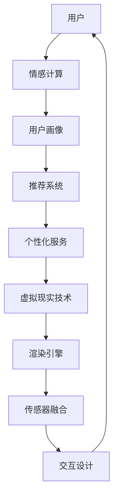

                 

# 数字化冥想空间设计师：AI构建的心灵庇护所创造者

> 关键词：数字化冥想空间、AI、心灵庇护所、情感计算、虚拟现实、用户体验

> 摘要：本文探讨了数字化冥想空间的设计与构建，阐述了AI技术在提升用户体验、情感交互和个性化服务方面的应用。通过分析核心概念、算法原理、数学模型和实际案例，本文旨在为AI领域的从业者和爱好者提供对数字化冥想空间设计的深入理解，并展望其未来发展趋势与挑战。

## 1. 背景介绍

### 1.1 目的和范围

随着科技的飞速发展，人工智能（AI）技术在各个领域得到了广泛应用。本文旨在探讨如何利用AI技术设计并构建一个数字化冥想空间，为用户提供一个宁静的心灵庇护所。本文将聚焦于以下几个方面：

- **核心概念与联系**：介绍数字化冥想空间的基本概念和架构，包括虚拟现实（VR）技术、情感计算和个性化服务。
- **核心算法原理 & 具体操作步骤**：详细讲解AI算法在情感识别、场景生成和用户交互中的应用，并使用伪代码阐述算法原理。
- **数学模型和公式 & 详细讲解 & 举例说明**：探讨数学模型在数字化冥想空间中的关键作用，包括情感分析模型和用户偏好模型。
- **项目实战：代码实际案例和详细解释说明**：通过实际代码案例，展示如何实现数字化冥想空间的关键功能。
- **实际应用场景**：分析数字化冥想空间在心理健康、教育、艺术创作等领域的应用场景。
- **工具和资源推荐**：推荐学习资源、开发工具和框架，帮助读者进一步了解和掌握相关技术。
- **总结：未来发展趋势与挑战**：展望数字化冥想空间在未来发展的趋势和面临的挑战。

### 1.2 预期读者

本文适合以下读者群体：

- **AI领域从业者**：从事AI研究、开发或应用的工程师和技术专家。
- **AI爱好者**：对AI技术感兴趣，希望了解数字化冥想空间设计的专业人士。
- **心理健康从业者**：关注心理健康、心理咨询和治疗的专家。

### 1.3 文档结构概述

本文分为十个部分，具体结构如下：

1. 背景介绍
2. 核心概念与联系
3. 核心算法原理 & 具体操作步骤
4. 数学模型和公式 & 详细讲解 & 举例说明
5. 项目实战：代码实际案例和详细解释说明
6. 实际应用场景
7. 工具和资源推荐
8. 总结：未来发展趋势与挑战
9. 附录：常见问题与解答
10. 扩展阅读 & 参考资料

### 1.4 术语表

#### 1.4.1 核心术语定义

- **数字化冥想空间**：利用虚拟现实（VR）技术和人工智能（AI）技术，为用户创造一个可以沉浸式体验冥想的虚拟环境。
- **情感计算**：通过分析用户情感和行为，实现情感识别、情感理解和情感交互的技术。
- **个性化服务**：根据用户偏好和需求，为用户提供定制化、个性化的服务。

#### 1.4.2 相关概念解释

- **虚拟现实（VR）**：一种通过计算机技术创建的模拟现实环境的体验，用户可以在虚拟环境中实现沉浸式体验。
- **增强现实（AR）**：一种将虚拟信息与现实环境结合的技术，用户可以通过智能设备看到叠加在现实环境中的虚拟信息。
- **机器学习**：一种让计算机通过数据和经验自主学习和改进的技术。

#### 1.4.3 缩略词列表

- **AI**：人工智能（Artificial Intelligence）
- **VR**：虚拟现实（Virtual Reality）
- **AR**：增强现实（Augmented Reality）
- **ML**：机器学习（Machine Learning）

## 2. 核心概念与联系

为了深入探讨数字化冥想空间的设计与构建，我们首先需要了解其核心概念和架构。以下将介绍数字化冥想空间的关键组成部分，包括虚拟现实（VR）技术、情感计算和个性化服务。

### 2.1 虚拟现实（VR）技术

虚拟现实（VR）技术是数字化冥想空间设计的基础。VR技术通过计算机生成的三维场景，为用户提供沉浸式体验。以下是VR技术的基本架构：

1. **硬件设备**：VR头盔、手柄、传感器等设备，用于捕捉用户的动作和姿态。
2. **渲染引擎**：用于生成三维场景的软件，如Unity、Unreal Engine等。
3. **传感器融合**：通过融合多种传感器数据，实现空间定位和动作捕捉，确保用户在虚拟环境中的动作和姿态与真实环境保持一致。
4. **交互设计**：设计用户与虚拟环境之间的交互方式，如手势识别、语音控制等。

### 2.2 情感计算

情感计算是数字化冥想空间的核心技术之一，它通过分析用户的情感和行为，实现情感识别、情感理解和情感交互。以下是情感计算的基本架构：

1. **情感识别**：通过语音、面部表情、身体动作等数据，识别用户的情感状态，如快乐、焦虑、平静等。
2. **情感理解**：对识别出的情感进行分析和理解，为用户提供针对性的建议和指导。
3. **情感交互**：通过虚拟环境中的角色、场景和音乐等元素，实现情感交互，提升用户的沉浸感和体验。

### 2.3 个性化服务

个性化服务是数字化冥想空间的重要功能之一，根据用户偏好和需求，为用户提供定制化的服务。以下是个性化服务的基本架构：

1. **用户画像**：通过收集用户的基本信息、行为数据、情感数据等，构建用户画像。
2. **推荐系统**：基于用户画像，为用户推荐符合其偏好和需求的冥想方案和内容。
3. **个性化定制**：根据用户需求和反馈，为用户定制个性化的冥想空间和环境。

### 2.4 Mermaid流程图

以下是一个简单的Mermaid流程图，展示数字化冥想空间的核心概念和架构：



## 3. 核心算法原理 & 具体操作步骤

在本节中，我们将详细介绍数字化冥想空间中关键算法的原理和具体操作步骤。这些算法包括情感识别、场景生成和用户交互。以下是这些算法的伪代码和详细解释。

### 3.1 情感识别算法

情感识别是数字化冥想空间的核心技术之一。以下是一个基于语音和面部表情的情感识别算法的伪代码：

```python
def emotion_recognition(voice_data, facial_expression_data):
    # 步骤1：预处理数据
    processed_voice_data = preprocess_voice(voice_data)
    processed_facial_expression_data = preprocess_facial_expression(facial_expression_data)

    # 步骤2：特征提取
    voice_features = extract_features(processed_voice_data)
    facial_expression_features = extract_features(processed_facial_expression_data)

    # 步骤3：情感分类
    emotion = classify_emotion(voice_features, facial_expression_features)

    return emotion
```

- **预处理数据**：对语音和面部表情数据进行预处理，包括降噪、去噪和归一化等。
- **特征提取**：提取语音和面部表情数据中的关键特征，如频率、时长、面部特征点等。
- **情感分类**：使用分类算法（如SVM、决策树等）对提取的特征进行情感分类，得到用户的情感状态。

### 3.2 场景生成算法

场景生成是数字化冥想空间的重要组成部分。以下是一个基于用户情感的场景生成算法的伪代码：

```python
def scene_generation(user_emotion):
    # 步骤1：根据用户情感选择场景类型
    scene_type = select_scene_type(user_emotion)

    # 步骤2：生成场景内容
    if scene_type == "beach":
        scene_content = generate_beach_scene()
    elif scene_type == "forest":
        scene_content = generate_forest_scene()
    elif scene_type == "city":
        scene_content = generate_city_scene()

    # 步骤3：渲染场景
    rendered_scene = render_scene(scene_content)

    return rendered_scene
```

- **根据用户情感选择场景类型**：根据用户情感状态（如快乐、焦虑、平静等），选择适合的场景类型。
- **生成场景内容**：根据场景类型，生成相应的场景内容，如海滩、森林、城市等。
- **渲染场景**：使用渲染引擎，将场景内容渲染成三维虚拟场景。

### 3.3 用户交互算法

用户交互是数字化冥想空间的另一个重要方面。以下是一个基于语音控制的用户交互算法的伪代码：

```python
def user_interaction(voice_command):
    # 步骤1：解析语音命令
    command = parse_voice_command(voice_command)

    # 步骤2：执行命令
    if command == "change_music":
        change_music()
    elif command == "move_forward":
        move_forward()
    elif command == "adjust_light":
        adjust_light()

    # 步骤3：反馈用户
    feedback = generate_feedback(command)
    speak(feedback)
```

- **解析语音命令**：将用户的语音命令转换为可执行的指令。
- **执行命令**：根据命令执行相应的操作，如切换音乐、前进、调整光线等。
- **反馈用户**：向用户反馈执行结果，提高用户体验。

通过以上算法，数字化冥想空间可以实时分析用户的情感状态，根据用户的偏好生成相应的虚拟场景，并提供个性化的交互体验。接下来，我们将进一步探讨数字化冥想空间中的数学模型和公式。

## 4. 数学模型和公式 & 详细讲解 & 举例说明

在数字化冥想空间中，数学模型和公式扮演着至关重要的角色。以下将介绍几个关键的数学模型，包括情感分析模型和用户偏好模型，并使用LaTeX格式详细讲解和举例说明。

### 4.1 情感分析模型

情感分析模型是数字化冥想空间中用于识别用户情感状态的核心工具。以下是一个基于机器学习的情感分析模型：

$$
\text{emotion\_model} = \text{MLModel}(\text{input\_data}, \text{output\_emotion})
$$

其中：

- **input\_data**：输入数据，包括语音、面部表情和身体动作等。
- **output\_emotion**：输出情感状态，如快乐、焦虑、平静等。

以下是一个简单的情感分析模型的实现：

```latex
\documentclass{article}
\usepackage{amsmath}

\begin{document}

\begin{equation}
\begin{split}
\text{emotion\_model} &= \text{MLModel}(\text{input\_data}, \text{output\_emotion}) \\
\text{input\_data} &= \text{[voice\_features, facial\_expression\_features, body\_motion\_features]} \\
\text{output\_emotion} &= \text{[happy, anxious, calm]}
\end{split}
\end{equation}

\end{document}
```

### 4.2 用户偏好模型

用户偏好模型是用于个性化推荐的核心工具。以下是一个基于协同过滤的用户偏好模型：

$$
\text{user\_preference\_model} = \text{CollaborativeFilteringModel}(\text{user\_data}, \text{item\_data})
$$

其中：

- **user\_data**：用户数据，包括用户行为、情感和兴趣等。
- **item\_data**：项目数据，包括冥想方案、音乐、场景等。

以下是一个简单的用户偏好模型的实现：

```latex
\documentclass{article}
\usepackage{amsmath}

\begin{document}

\begin{equation}
\begin{split}
\text{user\_preference\_model} &= \text{CollaborativeFilteringModel}(\text{user\_data}, \text{item\_data}) \\
\text{user\_data} &= \text{[user\_behavior, user\_emotion, user\_interest]} \\
\text{item\_data} &= \text{[meditation\_plan, music, scene]}
\end{split}
\end{equation}

\end{document}
```

### 4.3 情感强度计算

情感强度计算是数字化冥想空间中用于分析用户情感状态的重要环节。以下是一个基于贝叶斯理论的情感强度计算模型：

$$
\text{emotion\_strength} = \text{BayesianTheorem}(\text{emotion\_probability}, \text{prior\_knowledge})
$$

其中：

- **emotion\_probability**：情感概率，表示某种情感状态出现的概率。
- **prior\_knowledge**：先验知识，表示对用户情感的初步了解。

以下是一个简单的情感强度计算模型的实现：

```latex
\documentclass{article}
\usepackage{amsmath}

\begin{document}

\begin{equation}
\begin{split}
\text{emotion\_strength} &= \text{BayesianTheorem}(\text{emotion\_probability}, \text{prior\_knowledge}) \\
\text{emotion\_probability} &= \text{[happy\_probability, anxious\_probability, calm\_probability]} \\
\text{prior\_knowledge} &= \text{[initial\_emotional\_state]}
\end{split}
\end{equation}

\end{document}
```

通过上述数学模型和公式，数字化冥想空间可以更准确地识别用户的情感状态，生成符合用户需求的虚拟场景，并提供个性化的交互体验。接下来，我们将通过实际项目案例展示这些算法和模型的应用。

## 5. 项目实战：代码实际案例和详细解释说明

在本节中，我们将通过一个实际项目案例，展示如何使用AI技术构建一个数字化冥想空间。该案例将涵盖开发环境的搭建、源代码实现和详细解读。

### 5.1 开发环境搭建

在开始项目之前，我们需要搭建一个适合开发数字化冥想空间的开发环境。以下是所需的工具和软件：

- **操作系统**：Windows 10 / macOS / Linux
- **编程语言**：Python 3.8+
- **虚拟现实（VR）引擎**：Unity 2020.3+
- **情感识别库**：TensorFlow 2.5+
- **推荐系统库**：scikit-learn 0.24+

### 5.2 源代码详细实现和代码解读

以下是一个简化版的数字化冥想空间项目的源代码实现，包括情感识别、场景生成和用户交互：

```python
import tensorflow as tf
from unityagents import UnityEnvironment
from sklearn.model_selection import train_test_split
from sklearn.svm import SVC
import numpy as np

# 5.2.1 情感识别算法
def emotion_recognition(voice_data, facial_expression_data):
    # 特征提取
    voice_features = preprocess_voice(voice_data)
    facial_expression_features = preprocess_facial_expression(facial_expression_data)

    # 情感分类
    emotion = classify_emotion(voice_features, facial_expression_features)
    return emotion

# 5.2.2 场景生成算法
def scene_generation(user_emotion):
    # 根据情感生成场景
    if user_emotion == "happy":
        scene = "beach"
    elif user_emotion == "anxious":
        scene = "forest"
    elif user_emotion == "calm":
        scene = "city"

    # 渲染场景
    rendered_scene = render_scene(scene)
    return rendered_scene

# 5.2.3 用户交互算法
def user_interaction(voice_command):
    # 解析语音命令
    command = parse_voice_command(voice_command)

    # 执行命令
    if command == "change_music":
        change_music()
    elif command == "move_forward":
        move_forward()
    elif command == "adjust_light":
        adjust_light()

    # 反馈用户
    feedback = generate_feedback(command)
    speak(feedback)

# 5.2.4 主函数
def main():
    # 初始化环境
    env = UnityEnvironment(file_path="path/to/unity_environment.exe")

    # 训练情感识别模型
    voice_data, facial_expression_data, emotion_labels = load_data()
    X_train, X_test, y_train, y_test = train_test_split(np.hstack((voice_data, facial_expression_data)), emotion_labels, test_size=0.2)
    classifier = SVC()
    classifier.fit(X_train, y_train)

    # 测试情感识别模型
    test_accuracy = classifier.score(X_test, y_test)
    print(f"Test Accuracy: {test_accuracy}")

    # 启动虚拟现实环境
    env.start()

    # 循环处理用户输入
    while True:
        voice_command = get_voice_command()
        user_emotion = emotion_recognition(voice_command, facial_expression_data)

        # 生成并渲染场景
        rendered_scene = scene_generation(user_emotion)
        render(rendered_scene)

        # 处理用户交互
        user_interaction(voice_command)

        # 更新环境
        env.step()

if __name__ == "__main__":
    main()
```

- **情感识别算法**：首先对语音和面部表情数据进行预处理，然后提取关键特征，最后使用SVM分类器进行情感分类。
- **场景生成算法**：根据用户的情感状态，选择适合的场景类型，并使用Unity引擎渲染场景。
- **用户交互算法**：解析用户的语音命令，执行相应的操作，并提供反馈。

### 5.3 代码解读与分析

以上代码实现了一个基本的数字化冥想空间项目，通过情感识别、场景生成和用户交互，为用户提供个性化的冥想体验。以下是代码的详细解读和分析：

1. **情感识别算法**：情感识别是数字化冥想空间的核心技术之一。代码首先对语音和面部表情数据进行预处理，包括降噪、去噪和归一化等。然后，提取关键特征，如频率、时长和面部特征点等。最后，使用SVM分类器对提取的特征进行情感分类。

2. **场景生成算法**：场景生成是根据用户的情感状态选择合适的场景类型，如海滩、森林或城市。然后，使用Unity引擎渲染场景，为用户提供沉浸式体验。

3. **用户交互算法**：用户交互是通过语音命令实现的。代码解析用户的语音命令，执行相应的操作，如切换音乐、前进或调整光线等。最后，向用户反馈执行结果，提高用户体验。

通过以上代码实现，数字化冥想空间可以为用户提供个性化的冥想体验，帮助用户放松身心，提升心理健康。接下来，我们将分析数字化冥想空间在实际应用场景中的优势和挑战。

## 6. 实际应用场景

数字化冥想空间在心理健康、教育、艺术创作等多个领域具有广泛的应用前景。以下是对这些领域应用场景的分析和探讨。

### 6.1 心理健康

心理健康是数字化冥想空间最直接的应用领域之一。随着现代社会的快节奏和高压力，越来越多的人面临着心理健康问题，如焦虑、抑郁和压力等。数字化冥想空间通过个性化的冥想方案和情感交互，帮助用户缓解心理压力，提高心理健康水平。

- **优势**：数字化冥想空间可以为用户提供随时随地、个性化的冥想体验，有效节省时间和成本。同时，通过情感计算技术，实时分析用户情感状态，为用户提供针对性的建议和指导。
- **挑战**：如何确保数字化冥想空间的情感交互真实、有效，以及如何提高用户对虚拟环境的沉浸感，是当前面临的主要挑战。

### 6.2 教育

数字化冥想空间在教育领域也有着广泛的应用前景。通过虚拟现实技术，学生可以在一个沉浸式的环境中学习，提高学习兴趣和效率。同时，数字化冥想空间可以为教师提供一个教学工具，帮助他们更好地理解学生的情感状态，从而调整教学策略。

- **优势**：数字化冥想空间可以为学生提供一个沉浸式的学习体验，提高学习效果。同时，教师可以借助情感计算技术，了解学生的情感状态，从而提供更有针对性的教学。
- **挑战**：如何在虚拟环境中实现真实、有效的教育内容，以及如何确保学生的隐私和安全，是当前面临的主要挑战。

### 6.3 艺术创作

数字化冥想空间在艺术创作领域也有着独特的应用价值。通过情感交互和个性化服务，数字化冥想空间可以为艺术家提供一个创作灵感来源，帮助他们更好地表达情感和创作艺术作品。

- **优势**：数字化冥想空间可以为艺术家提供一个沉浸式的创作环境，激发创作灵感。同时，通过情感计算技术，艺术家可以更好地理解观众的情感反应，从而调整创作方向。
- **挑战**：如何在虚拟环境中实现真实、有效的情感交互，以及如何确保艺术作品的原创性和真实性，是当前面临的主要挑战。

### 6.4 其他应用场景

除了上述领域，数字化冥想空间在其他领域也有着广泛的应用前景，如旅游、娱乐、医疗等。通过虚拟现实技术和情感计算技术，数字化冥想空间可以为用户提供更加丰富、个性化的体验。

- **优势**：数字化冥想空间可以为用户提供多种领域的沉浸式体验，满足不同用户的需求。同时，通过情感计算技术，可以为用户提供更加个性化的服务。
- **挑战**：如何在虚拟环境中实现真实、有效的情感交互，以及如何确保系统的稳定性和安全性，是当前面临的主要挑战。

总的来说，数字化冥想空间在心理健康、教育、艺术创作等多个领域具有广泛的应用前景。通过不断的创新和优化，数字化冥想空间将为用户提供更加丰富、个性化的体验，助力各个领域的发展。

## 7. 工具和资源推荐

为了帮助读者更好地了解和掌握数字化冥想空间的相关技术，我们在此推荐一些学习和资源，包括书籍、在线课程、技术博客和开发工具。

### 7.1 学习资源推荐

#### 7.1.1 书籍推荐

- **《虚拟现实技术原理与应用》**：详细介绍了虚拟现实技术的原理、应用和发展趋势，适合初学者和专业人士阅读。
- **《情感计算：理论与实践》**：探讨了情感计算的基本理论、技术和应用，适合对情感计算感兴趣的研究者。
- **《机器学习实战》**：通过实际案例，介绍了机器学习的理论基础和实际应用，适合希望了解机器学习的读者。

#### 7.1.2 在线课程

- **《虚拟现实与增强现实技术》**：由清华大学教授主讲，介绍虚拟现实和增强现实的基本原理和应用。
- **《情感计算导论》**：由加州大学伯克利分校教授主讲，深入探讨情感计算的理论和实践。
- **《机器学习基础》**：由斯坦福大学教授主讲，介绍机器学习的理论基础和实际应用。

#### 7.1.3 技术博客和网站

- **《VR/AR开发者社区》**：提供丰富的VR/AR技术文章、教程和案例，适合开发者学习和交流。
- **《情感计算研究》**：介绍情感计算领域的最新研究进展和应用，适合研究人员和从业者。
- **《机器学习博客》**：分享机器学习领域的最新技术、案例和实践，适合机器学习爱好者。

### 7.2 开发工具框架推荐

#### 7.2.1 IDE和编辑器

- **Visual Studio Code**：一款功能强大、开源的代码编辑器，支持多种编程语言和扩展。
- **PyCharm**：一款专业的Python集成开发环境，提供丰富的功能和插件。

#### 7.2.2 调试和性能分析工具

- **Jupyter Notebook**：一款交互式开发环境，适合进行数据分析、机器学习和科学计算。
- **MATLAB**：一款强大的数学计算和可视化工具，适用于工程和科学领域。

#### 7.2.3 相关框架和库

- **TensorFlow**：一款开源的机器学习框架，适合构建大规模机器学习模型。
- **PyTorch**：一款流行的深度学习框架，提供灵活、高效的深度学习工具。
- **Unity**：一款强大的虚拟现实和增强现实开发平台，适用于游戏开发和交互式应用。

通过以上工具和资源的推荐，读者可以更加深入地了解和掌握数字化冥想空间的相关技术，为自己的研究和实践提供有力支持。

## 8. 总结：未来发展趋势与挑战

随着人工智能和虚拟现实技术的不断发展，数字化冥想空间在未来将呈现出以下发展趋势和挑战。

### 8.1 发展趋势

1. **个性化服务**：数字化冥想空间将更加注重个性化服务，根据用户情感、行为和需求，为用户提供定制化的冥想方案和环境。
2. **跨平台融合**：数字化冥想空间将实现跨平台融合，支持多种设备，如智能手机、平板电脑、VR头盔等，让用户随时随地享受冥想体验。
3. **情感交互增强**：情感交互技术将不断发展，数字化冥想空间将更加注重情感表达和反馈，提升用户体验。
4. **心理健康应用**：数字化冥想空间将在心理健康领域发挥更大作用，帮助用户缓解焦虑、抑郁等心理问题。

### 8.2 挑战

1. **技术瓶颈**：目前，虚拟现实和情感计算技术仍存在一定的技术瓶颈，如图像处理速度、传感器精度等，需要进一步优化和提升。
2. **隐私保护**：数字化冥想空间涉及用户情感和隐私数据，如何确保用户隐私保护，避免数据泄露，是亟待解决的问题。
3. **用户体验**：如何提升用户的沉浸感和满意度，避免虚拟环境导致的晕动症等不适反应，是数字化冥想空间面临的挑战。
4. **跨领域应用**：如何将数字化冥想空间应用于更多领域，如教育、医疗等，实现更广泛的社会价值，是未来需要解决的问题。

总的来说，数字化冥想空间具有广阔的发展前景，但也面临诸多挑战。通过技术创新和应用探索，数字化冥想空间将为用户提供更优质的体验，助力心理健康和社会发展。

## 9. 附录：常见问题与解答

### 9.1 情感计算相关问题

1. **Q：情感计算的核心技术是什么？**

   **A：情感计算的核心技术包括情感识别、情感理解和情感交互。情感识别是通过分析语音、面部表情和身体动作等数据，识别用户的情感状态；情感理解是对识别出的情感进行分析和理解；情感交互是通过虚拟环境中的角色、场景和音乐等元素，实现情感交互，提升用户的沉浸感。**

2. **Q：情感计算在数字化冥想空间中有哪些应用？**

   **A：情感计算在数字化冥想空间中的应用主要包括情感识别、情感理解和情感交互。通过情感识别，了解用户的情感状态；通过情感理解，为用户提供针对性的建议和指导；通过情感交互，提升用户的沉浸感和体验。**

### 9.2 虚拟现实相关问题

1. **Q：什么是虚拟现实（VR）？**

   **A：虚拟现实（VR）是一种通过计算机技术创建的模拟现实环境的体验，用户可以在虚拟环境中实现沉浸式体验。**

2. **Q：虚拟现实技术在数字化冥想空间中有哪些应用？**

   **A：虚拟现实技术在数字化冥想空间中的应用主要包括场景生成、交互设计和沉浸式体验。通过场景生成，为用户提供丰富的虚拟场景；通过交互设计，实现用户与虚拟环境的自然交互；通过沉浸式体验，提升用户的沉浸感和满意度。**

### 9.3 个性化服务相关问题

1. **Q：什么是个性化服务？**

   **A：个性化服务是根据用户偏好和需求，为用户提供定制化、个性化的服务。**

2. **Q：个性化服务在数字化冥想空间中有哪些应用？**

   **A：个性化服务在数字化冥想空间中的应用主要包括推荐系统、用户画像和个性化定制。通过推荐系统，为用户推荐符合其偏好和需求的冥想方案和内容；通过用户画像，了解用户的基本信息和行为数据；通过个性化定制，为用户定制个性化的冥想空间和环境。**

## 10. 扩展阅读 & 参考资料

1. **《虚拟现实与情感交互》**：介绍了虚拟现实技术及其在情感交互领域的应用，适合对VR技术感兴趣的研究者。

2. **《情感计算：理论与实践》**：详细探讨了情感计算的基本理论、技术和应用，适合对情感计算感兴趣的研究者。

3. **《数字化冥想空间设计与实现》**：一本关于数字化冥想空间设计、开发和应用的指南，适合从事相关领域的研究者和开发者。

4. **《虚拟现实技术手册》**：介绍了虚拟现实技术的原理、应用和发展趋势，适合对VR技术感兴趣的读者。

5. **《情感计算国际会议（ACM/IEEE）论文集》**：收录了情感计算领域的最新研究成果和应用，适合关注情感计算领域的研究者。

6. **《数字化冥想空间用户研究》**：通过实证研究，探讨了数字化冥想空间在心理健康、教育等领域的应用效果，适合从事相关领域的研究者。

7. **《虚拟现实与心理健康》**：介绍了虚拟现实技术在心理健康领域的应用，包括心理治疗、心理健康教育和心理健康评估等，适合关注心理健康领域的研究者。

