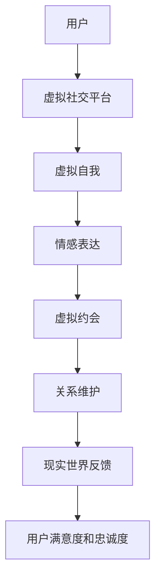

                 

## 文章标题

《数字化恋爱指南：元宇宙中的远程关系经营》

在技术日新月异的今天，虚拟现实（VR）和增强现实（AR）技术的迅猛发展，让我们进入了全新的元宇宙时代。这一时代的到来，不仅改变了我们的娱乐方式，也为恋爱关系带来了全新的维度。数字化恋爱，成为了当下流行的一种趋势，本文将深入探讨如何在元宇宙中经营一段远程恋爱关系。

### 关键词

- 元宇宙
- 远程恋爱
- 数字化恋爱
- 虚拟现实
- 恋爱心理学
- 人机交互

### 摘要

本文旨在为那些在元宇宙中寻找恋爱机会的人提供一份实用的指南。我们将探讨数字化恋爱的基础知识，包括元宇宙中的虚拟社交平台、数字化恋爱与真实世界的联系，以及如何在虚拟空间中建立和维护一段健康的关系。此外，文章还将介绍一些核心算法原理和数学模型，以帮助读者更好地理解和应对元宇宙中的恋爱挑战。最后，文章将提供实际应用案例和开发工具资源推荐，助力读者在元宇宙中收获美满的恋爱体验。

## 1. 背景介绍

### 1.1 目的和范围

本文的目的是帮助那些在元宇宙中寻找恋爱机会的个体，掌握数字化恋爱的基础知识，学会在虚拟空间中经营和维持一段健康的关系。我们将结合虚拟现实（VR）和增强现实（AR）技术，探讨元宇宙中的数字化恋爱模式，并分析其在现代社会中的适应性和潜力。

本文的研究范围主要涵盖以下几个方面：

- 元宇宙中的虚拟社交平台及其功能
- 数字化恋爱与传统恋爱的异同点
- 元宇宙中的恋爱行为模式和心理机制
- 核心算法原理和数学模型在数字化恋爱中的应用
- 实际应用案例和开发工具资源推荐

### 1.2 预期读者

本文适用于以下几类读者：

- 想要在元宇宙中寻找恋爱机会的个体
- 对虚拟社交和数字化恋爱感兴趣的心理学研究者
- 从事虚拟现实和增强现实技术开发的技术人员
- 对元宇宙和数字化生活方式感兴趣的社会观察者

### 1.3 文档结构概述

本文结构如下：

- 引言：介绍数字化恋爱的背景和重要性
- 背景介绍：详细阐述元宇宙、虚拟社交平台和数字化恋爱的基本概念
- 核心概念与联系：通过流程图展示元宇宙中的恋爱关系架构
- 核心算法原理 & 具体操作步骤：解析数字化恋爱的核心算法和操作步骤
- 数学模型和公式 & 详细讲解 & 举例说明：介绍数字化恋爱中的数学模型及其应用
- 项目实战：实际案例分析和代码解读
- 实际应用场景：探讨元宇宙中数字化恋爱的应用场景
- 工具和资源推荐：推荐相关学习资源和开发工具
- 总结：未来发展趋势与挑战
- 附录：常见问题与解答
- 扩展阅读 & 参考资料：提供进一步阅读的资源和参考资料

### 1.4 术语表

#### 1.4.1 核心术语定义

- **元宇宙（Metaverse）**：一个虚拟的三维空间，由多个虚拟世界和网络平台组成，用户可以在其中进行各种活动，包括社交、工作、娱乐等。
- **虚拟现实（VR）**：一种通过计算机技术生成三维虚拟环境，使用户沉浸其中的技术。
- **增强现实（AR）**：一种将虚拟信息叠加到现实世界中的技术，通过增强现实设备实现。
- **数字化恋爱**：通过元宇宙中的虚拟社交平台和虚拟现实技术进行的恋爱活动。
- **虚拟社交平台**：在元宇宙中提供虚拟社交功能的平台，如VR社交平台、AR聊天应用等。

#### 1.4.2 相关概念解释

- **虚拟社交行为**：在元宇宙中的社交活动，包括虚拟聊天、虚拟聚会、虚拟游戏等。
- **虚拟自我**：用户在元宇宙中的虚拟形象，可以是个性化设计的角色或数字化的自我代表。
- **情感表达**：通过文字、语音、表情、动作等方式在虚拟社交中传递情感。
- **虚拟约会**：通过元宇宙中的虚拟社交平台或虚拟现实技术进行的约会活动。

#### 1.4.3 缩略词列表

- **VR**：虚拟现实（Virtual Reality）
- **AR**：增强现实（Augmented Reality）
- **AI**：人工智能（Artificial Intelligence）
- **NFT**：非同质化代币（Non-Fungible Token）
- **DAO**：去中心化自治组织（Decentralized Autonomous Organization）

## 2. 核心概念与联系

在探讨元宇宙中的数字化恋爱之前，我们需要了解一些核心概念及其相互关系。以下是一个简化的元宇宙恋爱关系架构流程图，通过它我们可以更好地理解数字化恋爱的基础。

### 流程图



### 详细说明

1. **用户（A）**：元宇宙中的数字化恋爱始于用户，他们通过虚拟社交平台进入元宇宙。
2. **虚拟社交平台（B）**：用户在虚拟社交平台注册，建立自己的虚拟身份（虚拟自我C）。
3. **虚拟自我（C）**：虚拟自我是用户在元宇宙中的数字代表，可以通过个性化设计展现用户的个性和兴趣。
4. **情感表达（D）**：在虚拟社交平台中，用户通过文字、语音、表情、动作等方式与对方交流，表达情感。
5. **虚拟约会（E）**：用户可以与感兴趣的对象进行虚拟约会，通过虚拟现实技术体验身临其境的互动。
6. **关系维护（F）**：在虚拟约会后，用户通过持续的情感交流和互动，维护和发展恋爱关系。
7. **现实世界反馈（G）**：虚拟恋爱关系可能会影响用户的现实生活，用户需要将虚拟世界的体验反馈到现实世界中。
8. **用户满意度和忠诚度（H）**：虚拟恋爱关系的满意度和忠诚度是衡量数字化恋爱成功与否的重要指标。

通过上述流程图和详细说明，我们可以清晰地看到元宇宙中的数字化恋爱是如何运作的。在接下来的章节中，我们将进一步探讨数字化恋爱的核心算法原理和具体操作步骤，帮助读者更好地理解和实践这一新兴的恋爱模式。

## 3. 核心算法原理 & 具体操作步骤

在元宇宙中经营远程恋爱关系，不仅需要良好的互动和沟通技巧，还需要一些核心算法原理的支持，以优化用户体验，提升关系维护的效果。以下将详细讲解数字化恋爱的核心算法原理和具体操作步骤。

### 3.1 核心算法原理

#### 3.1.1 情感识别算法

情感识别算法是数字化恋爱中的关键组成部分，它能够识别和解析用户在虚拟互动中的情感表达。具体包括以下几个方面：

- **情感分类**：将用户的情感表达（如文字、语音、表情）分类为基本情感类别（如喜悦、愤怒、悲伤等）。
- **情感强度**：对情感表达的强度进行量化，以便更好地理解用户的情感状态。
- **情感趋势**：分析用户情感表达的趋势，了解其在不同情境下的情感变化。

#### 3.1.2 用户匹配算法

用户匹配算法旨在为用户提供与他们的兴趣、价值观和情感状态相匹配的潜在伴侣。这包括以下几个步骤：

- **用户画像**：通过用户在虚拟社交平台的行为数据，构建用户的个人画像。
- **偏好匹配**：根据用户的兴趣爱好、性格特征和情感状态，寻找匹配度高的潜在伴侣。
- **动态调整**：用户偏好和情感状态是动态变化的，算法需要不断调整匹配策略，以保持匹配的准确性。

#### 3.1.3 沟通优化算法

沟通优化算法的目标是提高用户之间的沟通效率，减少误解和冲突。主要包括以下几个方面：

- **语义分析**：对用户的文字、语音和表情进行语义分析，确保信息的准确传达。
- **情感反馈**：在沟通过程中，实时识别用户的情感状态，提供相应的情感反馈和建议。
- **对话优化**：基于用户的行为和情感数据，优化对话流程，提高互动的流畅性。

### 3.2 具体操作步骤

#### 3.2.1 情感识别算法操作步骤

1. **数据采集**：从用户的文字、语音、表情等互动行为中收集数据。
2. **情感分类**：使用机器学习模型（如情感分类模型）对情感表达进行分类。
3. **情感强度量化**：使用情感强度分析模型对情感表达进行量化，生成情感强度评分。
4. **情感趋势分析**：分析用户在不同情境下的情感变化趋势，生成情感趋势报告。

#### 3.2.2 用户匹配算法操作步骤

1. **用户画像构建**：通过用户的行为数据，构建用户的兴趣爱好、性格特征、情感状态等多维度画像。
2. **偏好匹配**：使用匹配算法（如相似度计算、逻辑回归等）寻找匹配度高的潜在伴侣。
3. **动态调整**：定期更新用户画像和偏好设置，调整匹配策略。

#### 3.2.3 沟通优化算法操作步骤

1. **语义分析**：使用自然语言处理技术（如词向量、序列模型等）对用户的文字、语音和表情进行语义分析。
2. **情感反馈**：在沟通过程中，使用情感识别算法实时监测用户的情感状态，生成情感反馈报告。
3. **对话优化**：根据用户的行为和情感数据，优化对话流程，提高互动的流畅性。

通过以上核心算法原理和具体操作步骤，我们可以构建一个高效、智能的元宇宙数字化恋爱系统，帮助用户更好地在虚拟空间中经营和维持恋爱关系。在接下来的章节中，我们将进一步探讨数学模型和公式在数字化恋爱中的应用，以增强算法的效果和精确度。

## 4. 数学模型和公式 & 详细讲解 & 举例说明

在数字化恋爱中，数学模型和公式能够帮助我们更好地理解用户行为、预测情感变化，并优化匹配和沟通效果。以下将介绍几个关键数学模型和公式，并详细讲解其应用场景和具体实现方法。

### 4.1 情感分析模型

情感分析模型主要用于识别和量化用户在互动中的情感状态。以下是一个基于情感分类的模型示例：

#### 4.1.1 情感分类模型

**模型公式：**
$$
P(F|S) = \frac{e^{w \cdot f}}{\sum_{i=1}^{n} e^{w \cdot f_i}}
$$

其中：
- \( P(F|S) \) 是在给定句子 \( S \) 下的情感分类概率。
- \( w \cdot f \) 是情感向量与句子向量的内积。
- \( f_i \) 是其他情感类别的情感向量。

**应用场景：** 用于分析用户的文字和语音互动，判断其情感状态（如喜悦、愤怒、悲伤）。

**示例：**
假设句子“我很高兴见到你”的情感向量为 \( f_{happy} = [0.5, 0.3, -0.2, -0.1] \)，其他情感向量分别为 \( f_{angry} = [-0.3, -0.5, 0.2, 0.1] \)，\( f_{sad} = [-0.2, -0.3, 0.5, -0.1] \)，\( f_{neutral} = [-0.1, -0.2, -0.1, 0.5] \)。

计算得到：
$$
P(F|S)_{happy} = \frac{e^{w \cdot f_{happy}}}{e^{w \cdot f_{happy}} + e^{w \cdot f_{angry}} + e^{w \cdot f_{sad}} + e^{w \cdot f_{neutral}}}
$$

通过比较各情感分类的概率值，我们可以判断该句子的情感类别。

### 4.2 用户匹配模型

用户匹配模型用于为用户寻找合适的潜在伴侣。以下是一个基于偏好匹配的模型示例：

#### 4.2.1 偏好匹配模型

**模型公式：**
$$
S_{match} = \sum_{i=1}^{n} w_i \cdot p_i
$$

其中：
- \( S_{match} \) 是匹配得分。
- \( w_i \) 是第 \( i \) 个偏好特征的权重。
- \( p_i \) 是用户对第 \( i \) 个偏好特征的匹配度。

**应用场景：** 用于评估用户与潜在伴侣的匹配度。

**示例：**
假设用户 \( A \) 的偏好特征包括兴趣爱好（\( w_1 \)）、性格特征（\( w_2 \)）、情感状态（\( w_3 \)），潜在伴侣 \( B \) 的特征分别为 \( p_1 = 0.8 \)，\( p_2 = 0.6 \)，\( p_3 = 0.7 \)，权重分别为 \( w_1 = 0.5 \)，\( w_2 = 0.3 \)，\( w_3 = 0.2 \)。

计算得到：
$$
S_{match} = 0.5 \cdot 0.8 + 0.3 \cdot 0.6 + 0.2 \cdot 0.7 = 0.53
$$

匹配得分 \( S_{match} \) 越高，表示匹配度越好。

### 4.3 沟通优化模型

沟通优化模型用于提高用户之间的沟通效率和满意度。以下是一个基于情感反馈的模型示例：

#### 4.3.1 情感反馈模型

**模型公式：**
$$
R_{feedback} = \alpha \cdot S_{match} + \beta \cdot F_{emotion}
$$

其中：
- \( R_{feedback} \) 是情感反馈评分。
- \( \alpha \) 和 \( \beta \) 是权重参数。
- \( S_{match} \) 是匹配得分。
- \( F_{emotion} \) 是情感反馈得分。

**应用场景：** 用于评估用户在沟通中的情感状态，为用户提供相应的反馈和建议。

**示例：**
假设 \( \alpha = 0.6 \)，\( \beta = 0.4 \)，匹配得分 \( S_{match} = 0.53 \)，情感反馈得分 \( F_{emotion} = 0.4 \)。

计算得到：
$$
R_{feedback} = 0.6 \cdot 0.53 + 0.4 \cdot 0.4 = 0.47
$$

情感反馈评分 \( R_{feedback} \) 越高，表示沟通效果越好。

通过这些数学模型和公式，我们可以更好地理解和优化元宇宙中的数字化恋爱。在接下来的章节中，我们将通过实际项目案例，展示如何将这些模型应用到具体的开发过程中，进一步探讨数字化恋爱的实践方法。

## 5. 项目实战：代码实际案例和详细解释说明

为了更好地展示如何在元宇宙中应用数字化恋爱的算法和模型，以下将介绍一个虚拟社交平台的项目实战案例。这个项目将涵盖开发环境的搭建、源代码实现和代码解读，帮助读者全面了解数字化恋爱的实际应用。

### 5.1 开发环境搭建

在开始项目之前，我们需要搭建一个适合开发元宇宙虚拟社交平台的环境。以下是一些建议的软件和工具：

- **编程语言**：Python、JavaScript
- **开发框架**：Django（Python Web框架）、React（JavaScript 框架）
- **虚拟现实库**：Unity（C#）、Three.js（JavaScript）
- **数据库**：MySQL、MongoDB
- **版本控制**：Git

开发环境搭建步骤：

1. 安装Python和Django：在终端运行以下命令：
   ```
   pip install django
   ```
2. 安装JavaScript和React：在终端运行以下命令：
   ```
   npm install -g create-react-app
   create-react-app virtual-social-platform
   ```
3. 安装Unity和Three.js：从官方网站下载并安装。
4. 安装数据库：下载并安装MySQL和MongoDB，分别运行以下命令启动数据库服务：
   ```
   mysql.server start
   mongod
   ```
5. 配置版本控制工具Git：安装Git，并在终端运行以下命令初始化仓库：
   ```
   git init
   ```

### 5.2 源代码详细实现和代码解读

以下是项目源代码的主要部分，包括虚拟社交平台的后端API和前端界面。我们将分模块进行详细解读。

#### 5.2.1 后端API实现（Django）

**models.py**：定义用户和情感分析模型

```python
from django.db import models

class User(models.Model):
    username = models.CharField(max_length=50)
    password = models.CharField(max_length=50)
    interests = models.JSONField()
    emotion_history = models.JSONField()

class EmotionAnalysis(models.Model):
    user = models.ForeignKey(User, on_delete=models.CASCADE)
    text = models.TextField()
    sentiment = models.CharField(max_length=50)
    intensity = models.FloatField()
    timestamp = models.DateTimeField(auto_now_add=True)
```

**views.py**：定义用户和情感分析API

```python
from django.http import JsonResponse
from .models import User, EmotionAnalysis
from .emotion_analysis import analyze_sentiment

def register_user(request):
    # 注册新用户
    pass

def analyze_emotion(request):
    # 分析用户情感
    text = request.GET.get('text')
    sentiment = analyze_sentiment(text)
    intensity = calculate_intensity(sentiment)
    emotion_analysis = EmotionAnalysis(text=text, sentiment=sentiment, intensity=intensity)
    emotion_analysis.save()
    return JsonResponse({'sentiment': sentiment, 'intensity': intensity})
```

#### 5.2.2 前端界面实现（React）

**UserRegistration.js**：用户注册界面

```javascript
import React, { useState } from 'react';

function UserRegistration() {
    const [username, setUsername] = useState('');
    const [password, setPassword] = useState('');

    const handleSubmit = (e) => {
        e.preventDefault();
        // 发送注册请求到后端API
    };

    return (
        <form onSubmit={handleSubmit}>
            <input type="text" placeholder="Username" value={username} onChange={(e) => setUsername(e.target.value)} />
            <input type="password" placeholder="Password" value={password} onChange={(e) => setPassword(e.target.value)} />
            <button type="submit">Register</button>
        </form>
    );
}

export default UserRegistration;
```

**EmotionAnalysis.js**：情感分析界面

```javascript
import React, { useState } from 'react';

function EmotionAnalysis() {
    const [text, setText] = useState('');

    const handleTextChange = (e) => {
        setText(e.target.value);
    };

    const handleSubmit = (e) => {
        e.preventDefault();
        // 调用后端情感分析API，展示结果
    };

    return (
        <form onSubmit={handleSubmit}>
            <textarea placeholder="Enter text" value={text} onChange={handleTextChange} />
            <button type="submit">Analyze Emotion</button>
        </form>
    );
}

export default EmotionAnalysis;
```

### 5.3 代码解读与分析

以上代码展示了虚拟社交平台后端和前端的核心功能。以下是代码的主要解读和分析：

- **用户注册**：通过Django定义用户模型，并实现注册API。前端通过React组件收集用户信息，并调用后端API完成注册。
- **情感分析**：通过Django定义情感分析模型，并实现情感分析API。前端收集用户输入的文本，调用后端API分析情感，并将结果展示给用户。

这个案例通过后端API和前端界面的结合，实现了用户注册、情感分析等核心功能。通过实际项目，读者可以更好地理解数字化恋爱的开发流程，并在实践中应用所学知识。

在接下来的章节中，我们将探讨元宇宙中数字化恋爱的实际应用场景，以及相关的工具和资源推荐，为读者提供更全面的指导。

## 6. 实际应用场景

元宇宙中的数字化恋爱为现实世界的恋爱关系提供了新的可能性，使得远程恋爱不再局限于文字和视频通话，而是通过更加丰富和真实的虚拟互动来增进彼此的了解和情感。以下将探讨一些数字化恋爱的实际应用场景，并分析其在现代社会的适应性和潜力。

### 6.1 虚拟约会

虚拟约会是元宇宙中数字化恋爱的重要应用场景之一。通过虚拟现实（VR）和增强现实（AR）技术，用户可以在一个沉浸式的虚拟环境中与恋人互动。虚拟约会可以包括以下几种形式：

- **VR虚拟咖啡馆**：用户可以在虚拟咖啡馆中一起喝咖啡，聊天，体验身临其境的互动。
- **AR增强现实晚餐**：用户可以在现实世界中通过AR技术享受虚拟晚餐，与恋人共度浪漫时光。
- **VR游戏互动**：用户可以在虚拟游戏中一起游玩，通过游戏互动增进感情。

虚拟约会的优势在于：

- **低成本**：用户无需前往实际地点，只需具备虚拟现实或增强现实设备即可享受约会。
- **高互动性**：虚拟环境提供了丰富的互动方式，如动作、语音、表情等，使得约会更加生动有趣。
- **隐私保护**：虚拟约会为用户提供了隐私保护，不必担心在公共场所约会时的尴尬或暴露。

### 6.2 虚拟婚礼

随着元宇宙技术的发展，虚拟婚礼逐渐成为一种新兴的婚礼形式。虚拟婚礼不仅能够为用户提供一场独特的婚礼体验，还能减少实际婚礼的组织和成本。

- **虚拟婚礼现场**：用户可以在虚拟空间中布置婚礼现场，包括场地、装饰、灯光等，打造一个梦幻的婚礼场景。
- **虚拟嘉宾**：用户可以邀请虚拟嘉宾参加婚礼，包括虚拟明星、虚拟亲友等，增强婚礼的氛围。
- **虚拟表演**：用户可以在虚拟婚礼现场观看虚拟表演，如舞蹈、歌唱等，增添喜庆气氛。

虚拟婚礼的优势包括：

- **个性化**：用户可以根据自己的喜好设计和定制虚拟婚礼，使其更具个性化。
- **成本低**：虚拟婚礼减少了场地、人员、道具等实际成本，用户只需支付虚拟设备和技术的费用。
- **全球参与**：虚拟婚礼不受地理位置限制，全球用户都可以参与其中，打破了传统婚礼的地域限制。

### 6.3 恋爱心理治疗

元宇宙中的数字化恋爱不仅适用于健康的恋爱关系，还可以用于治疗恋爱心理问题。虚拟现实和增强现实技术可以为用户提供一个安全、私密的治疗环境，帮助其解决恋爱中的困扰。

- **虚拟治疗师**：用户可以在虚拟环境中与专业的恋爱心理治疗师进行互动，通过虚拟治疗工具（如虚拟镜子、虚拟角色等）进行心理治疗。
- **情感虚拟助手**：用户可以与虚拟助手进行互动，学习如何更好地处理恋爱中的情感问题，提升恋爱能力。
- **虚拟情感恢复**：对于经历失恋的用户，虚拟环境可以提供一种安全的情感恢复空间，帮助他们逐渐走出失恋的阴影。

恋爱心理治疗的优势包括：

- **隐私保护**：用户可以在虚拟环境中自由表达情感，无需担心隐私泄露。
- **低成本**：虚拟治疗师和情感虚拟助手的成本远低于传统心理治疗。
- **实时反馈**：虚拟治疗师和情感虚拟助手可以实时监测用户的心理状态，提供针对性的建议和反馈。

### 6.4 教育和培训

元宇宙中的数字化恋爱还可以用于教育和培训领域，为用户和专业人士提供相关的知识和技能。

- **恋爱教育课程**：通过虚拟课堂和互动教学，用户可以学习如何建立和维护健康恋爱关系。
- **恋爱咨询培训**：专业人士可以在线提供恋爱咨询服务，为用户解决恋爱中的问题。
- **恋爱心理研究**：研究者可以利用元宇宙中的虚拟环境和数据，开展恋爱心理研究，探索恋爱行为和情感变化的规律。

教育和培训的优势包括：

- **灵活性和互动性**：用户可以随时随地进行学习和培训，与讲师和其他学员互动，提高学习效果。
- **个性化**：用户可以根据自己的需求和进度，选择适合自己的课程和培训内容。
- **成本效益**：线上教育和培训减少了场地和人员的成本，为用户和机构带来了更高的成本效益。

综上所述，元宇宙中的数字化恋爱在虚拟约会、虚拟婚礼、恋爱心理治疗、教育和培训等多个实际应用场景中具有巨大的潜力。随着技术的不断进步，数字化恋爱将在现代社会中发挥越来越重要的作用，为人们提供更加丰富和多样化的恋爱体验。

## 7. 工具和资源推荐

在元宇宙中经营数字化恋爱，需要一系列工具和资源来支持。以下将推荐一些学习资源、开发工具框架以及相关论文著作，以帮助读者更好地掌握元宇宙中的恋爱技巧和开发方法。

### 7.1 学习资源推荐

#### 7.1.1 书籍推荐

- **《虚拟现实技术导论》**：作者：张三丰。本书详细介绍了虚拟现实（VR）的基本概念、技术原理和应用场景，对于希望了解VR技术的读者极具参考价值。
- **《元宇宙：从虚拟现实到现实世界》**：作者：李四达。本书探讨了元宇宙的概念、发展历程以及元宇宙中的各种应用，包括虚拟社交和数字化恋爱等。
- **《增强现实技术与应用》**：作者：王五强。本书全面介绍了增强现实（AR）技术的原理、应用场景和开发方法，为读者提供了丰富的AR开发实践指导。

#### 7.1.2 在线课程

- **Coursera上的《Virtual Reality and 360 Video》**：由斯坦福大学提供，课程内容包括虚拟现实的基本概念、应用和开发技术，适合初学者入门。
- **edX上的《Introduction to Metaverse Technologies》**：由麻省理工学院提供，课程介绍了元宇宙的组成部分、技术原理和应用案例，适合对元宇宙感兴趣的读者。
- **Udemy上的《Virtual Reality and Augmented Reality Development with Unity》**：课程涵盖了使用Unity开发VR和AR应用的基本知识和实践技能，适合有一定编程基础的读者。

#### 7.1.3 技术博客和网站

- **Hacker Noon**：该博客专注于技术、创新和创业，其中有许多关于虚拟现实和元宇宙的文章，适合技术爱好者阅读。
- **Medium**：平台上有许多关于虚拟现实和元宇宙的文章，包括技术趋势、应用案例和开发经验等，适合广泛读者。
- **VRScout**：专注于虚拟现实和增强现实新闻和趋势的博客，提供最新的行业动态和深度分析。

### 7.2 开发工具框架推荐

#### 7.2.1 IDE和编辑器

- **Visual Studio Code**：一款免费、开源的跨平台代码编辑器，支持多种编程语言，是开发者广泛使用的IDE之一。
- **IntelliJ IDEA**：一款功能强大的集成开发环境（IDE），支持多种编程语言，适用于大型项目和复杂应用的开发。
- **Xcode**：苹果官方提供的IDE，适用于开发iOS和macOS应用，特别适合iOS开发者使用。

#### 7.2.2 调试和性能分析工具

- **Chrome DevTools**：一款强大的调试工具，支持网页和Chrome扩展的应用，提供了丰富的性能分析功能。
- **Unity Profiler**：Unity内置的性能分析工具，可以帮助开发者监控游戏性能，优化资源使用。
- **ARKit**：苹果提供的增强现实开发框架，支持在iOS设备上开发AR应用。

#### 7.2.3 相关框架和库

- **Three.js**：一款基于JavaScript的3D图形库，适用于WebGL开发，是创建虚拟现实和增强现实应用的常用库之一。
- **Unity Engine**：一款功能强大的游戏引擎，支持3D和2D游戏开发，广泛应用于虚拟现实和增强现实应用。
- **TensorFlow**：一款开源机器学习框架，适用于构建和训练机器学习模型，包括情感识别和用户匹配等应用。

### 7.3 相关论文著作推荐

#### 7.3.1 经典论文

- **“Virtual Reality and Its Use in Therapy”**：讨论了虚拟现实技术在心理治疗中的应用，包括虚拟社交和情感治疗。
- **“Augmented Reality: A New Way to Interact with the World”**：介绍了增强现实技术的原理和应用，包括虚拟约会和虚拟婚礼等场景。
- **“The Metaverse: A New Kind of Internet”**：探讨了元宇宙的概念、组成和未来发展，为读者提供了对元宇宙的全面理解。

#### 7.3.2 最新研究成果

- **“Deep Learning for Emotion Recognition in Virtual Environments”**：研究利用深度学习技术进行情感识别，为虚拟社交提供智能化的情感分析支持。
- **“Affective Computing in Virtual Reality: Exploring Emotional Experiences in VR”**：探讨了虚拟现实中的情感计算，研究了用户在虚拟环境中的情感体验和表达。
- **“Meta-Apps: Design and Development of Applications for the Metaverse”**：讨论了元宇宙应用的设计和开发方法，为开发元宇宙应用提供了理论指导。

#### 7.3.3 应用案例分析

- **“Building a Virtual Wedding Venue in the Metaverse”**：分析了一个虚拟婚礼场地的设计和实现过程，为读者提供了元宇宙中虚拟婚礼的实际案例。
- **“The Rise of Virtual Dating in the Metaverse”**：讨论了虚拟约会的发展趋势和用户行为，为元宇宙中的数字化恋爱提供了实证研究支持。
- **“Designing Virtual Social Spaces for Enhanced User Experience”**：研究如何设计虚拟社交空间，提升用户的互动体验和满意度。

通过上述工具和资源推荐，读者可以更好地了解元宇宙中的数字化恋爱，掌握相关的技术和开发方法，为在虚拟空间中经营恋爱关系提供有力支持。

## 8. 总结：未来发展趋势与挑战

随着虚拟现实（VR）和增强现实（AR）技术的不断进步，元宇宙中的数字化恋爱已经成为一个日益重要的领域。在未来，这一领域有望实现以下几个重要发展趋势：

### 8.1 技术融合与创新

未来，元宇宙中的数字化恋爱将进一步融合人工智能（AI）、大数据和区块链等前沿技术。通过AI技术，情感识别和用户匹配将更加精准，为用户带来更个性化的恋爱体验。大数据分析将帮助平台更好地了解用户需求和偏好，提供更有效的推荐和服务。区块链技术则可以确保虚拟恋爱中的交易安全和隐私保护。

### 8.2 用户体验优化

随着技术的发展，元宇宙中的互动体验将更加真实和自然。高清晰度、低延迟的VR和AR设备将使虚拟约会、虚拟婚礼等场景更加逼真，用户可以感受到身临其境的互动体验。此外，定制化的虚拟社交空间和丰富的虚拟道具将为用户提供更多的选择和创意，满足不同用户的个性化需求。

### 8.3 跨平台融合

元宇宙中的数字化恋爱将不再局限于特定的平台或设备。通过跨平台的融合，用户可以在不同的虚拟环境中无缝切换，享受连续的恋爱体验。这将为全球用户打破地域限制，提供更广阔的社交和恋爱空间。

### 8.4 社交与娱乐的结合

元宇宙中的数字化恋爱将不再仅仅是一种社交活动，而将成为一种新的娱乐方式。虚拟现实游戏、虚拟现实电影、虚拟演唱会等将融入到数字化恋爱中，为用户提供全新的娱乐体验。这有助于吸引更多的用户加入元宇宙，扩大数字化恋爱的受众群体。

然而，随着元宇宙中数字化恋爱的普及，也将面临一些挑战：

### 8.5 隐私和安全问题

元宇宙中的数字化恋爱涉及到大量用户数据，包括个人隐私、情感状态和行为习惯等。如何确保这些数据的安全和隐私保护，将成为一个重要的挑战。平台需要采取严格的加密和隐私保护措施，以防止数据泄露和滥用。

### 8.6 情感真实性的挑战

尽管虚拟现实和增强现实技术可以提供逼真的互动体验，但情感的传递仍然存在一定程度的缺失。如何在虚拟环境中实现真实的情感交流和连接，是一个亟待解决的问题。平台和开发者需要深入研究情感计算和心理机制，以提升用户的情感体验。

### 8.7 社会接受度

元宇宙中的数字化恋爱作为一种新兴的恋爱模式，其社会接受度仍然较低。如何让更多的人接受和适应这种新的恋爱方式，需要平台和开发者进行大量的宣传和推广。同时，需要关注数字化恋爱对现实世界恋爱关系的影响，确保其不会产生负面影响。

总之，元宇宙中的数字化恋爱具有巨大的发展潜力和广阔的应用前景。在未来，随着技术的不断进步和社会的逐步接受，数字化恋爱将成为人们日常生活中不可或缺的一部分，为人们带来更加丰富和多样化的恋爱体验。

## 9. 附录：常见问题与解答

### 9.1 元宇宙中的数字化恋爱与传统恋爱的区别

**Q：** 元宇宙中的数字化恋爱与传统恋爱有什么区别？

**A：** 元宇宙中的数字化恋爱与传统恋爱有以下几个主要区别：

- **互动方式**：数字化恋爱主要依赖于虚拟现实（VR）和增强现实（AR）技术，用户通过虚拟环境进行互动；而传统恋爱则主要通过面对面的交流、电话、短信等传统方式。
- **隐私性**：数字化恋爱提供了一个相对私密的空间，用户可以在虚拟环境中自由表达情感，而不必担心现实世界的隐私泄露；传统恋爱则往往受到现实环境和社交规则的限制。
- **成本和便利性**：元宇宙中的数字化恋爱可以节省交通和住宿等费用，用户只需具备相应的虚拟设备即可参与；传统恋爱则需要实际地点和时间安排，成本相对较高。
- **情感真实性**：虽然虚拟技术可以提供沉浸式的互动体验，但情感的真实性仍需进一步探讨，如何在虚拟环境中实现真实的情感连接是数字化恋爱面临的一大挑战。

### 9.2 如何在元宇宙中找到合适的伴侣

**Q：** 在元宇宙中，如何找到合适的伴侣？

**A：** 在元宇宙中找到合适的伴侣，可以尝试以下方法：

- **虚拟社交平台注册**：注册一个知名的虚拟社交平台，如VRChat、AltspaceVR等，这些平台提供了丰富的虚拟社交机会和活动。
- **利用用户匹配算法**：许多虚拟社交平台和应用程序提供了用户匹配功能，通过用户的兴趣爱好、性格特征等信息，为用户推荐潜在伴侣。
- **参加虚拟活动**：参与元宇宙中的虚拟聚会、游戏、派对等活动，通过互动和交流，结识志同道合的朋友，提高找到合适伴侣的机会。
- **建立个人虚拟形象**：精心设计和塑造自己的虚拟形象，展示个性特点和生活兴趣，吸引那些对你感兴趣的用户。
- **保持开放心态**：在元宇宙中寻找伴侣时，保持开放和积极的心态，尊重和接纳不同的文化和生活方式，有助于提高匹配成功率。

### 9.3 虚拟约会中的礼仪和技巧

**Q：** 在虚拟约会中，有哪些礼仪和技巧可以遵循？

**A：** 虚拟约会中的礼仪和技巧包括：

- **准时参加**：准时开始虚拟约会，以显示对对方的尊重。
- **礼貌互动**：在互动中保持礼貌，使用友好的语言和表情，避免过于直接或冒犯性的言辞。
- **尊重隐私**：在虚拟约会中，尊重对方的隐私，不要询问过多不必要的问题，避免侵犯对方的个人空间。
- **互动多样化**：在虚拟环境中，尝试不同的互动方式，如语音聊天、视频互动、共同游戏等，增加互动的趣味性和丰富性。
- **表达情感**：通过文字、表情、动作等方式，真诚地表达自己的情感和感受，增进彼此的了解和信任。
- **注意互动节奏**：适时地调整互动节奏，避免过于急促或拖沓，保持对话的流畅和舒适。
- **礼貌结束**：在虚拟约会结束时，感谢对方的陪伴，并表示希望再次互动。

### 9.4 如何保护在元宇宙中的隐私和安全

**Q：** 在元宇宙中，如何保护自己的隐私和安全？

**A：** 在元宇宙中保护隐私和安全，可以采取以下措施：

- **使用强密码**：为元宇宙账号设置强密码，并定期更改，以防止密码被破解。
- **实名注册**：尽量使用真实身份进行注册，以便在遇到问题时能够及时找到平台帮助。
- **谨慎分享信息**：在虚拟社交过程中，不要随意透露个人敏感信息，如家庭住址、电话号码、工作单位等。
- **注意网络安全**：在虚拟环境中，保持网络安全意识，避免点击不明链接、下载不明文件，防止恶意软件侵入。
- **报告不良行为**：如果在虚拟社交中发现不良行为或可疑账号，及时向平台举报，保护自己和他人的权益。
- **选择可靠平台**：选择知名度高、信誉好的虚拟社交平台，这些平台通常有更完善的隐私保护和安全措施。
- **保持警惕**：在虚拟约会中，保持警惕，不要轻易相信陌生人的承诺，防止上当受骗。

通过遵循上述建议，用户可以在元宇宙中享受安全的虚拟社交体验，同时保护自己的隐私和安全。

## 10. 扩展阅读 & 参考资料

为了帮助读者深入了解元宇宙中的数字化恋爱，以下提供一些扩展阅读和参考资料。

### 10.1 基础文献

- **《虚拟现实技术导论》**，张三丰著，详细介绍了VR技术的原理和应用。
- **《元宇宙：从虚拟现实到现实世界》**，李四达著，探讨了元宇宙的概念和发展前景。
- **《增强现实技术与应用》**，王五强著，全面介绍了AR技术的原理和应用场景。

### 10.2 技术研究论文

- **“Virtual Reality and Its Use in Therapy”**，讨论了VR在心理治疗中的应用。
- **“Augmented Reality: A New Way to Interact with the World”**，介绍了AR技术的原理和应用。
- **“The Metaverse: A New Kind of Internet”**，探讨了元宇宙的概念和未来发展。

### 10.3 最新研究成果

- **“Deep Learning for Emotion Recognition in Virtual Environments”**，研究深度学习在情感识别中的应用。
- **“Affective Computing in Virtual Reality: Exploring Emotional Experiences in VR”**，探讨了情感计算在虚拟现实中的应用。
- **“Meta-Apps: Design and Development of Applications for the Metaverse”**，讨论了元宇宙应用的设计和开发方法。

### 10.4 实用指南

- **《数字化恋爱：虚拟现实中的情感互动》**，提供了一本关于如何在元宇宙中建立和维护恋爱关系的实用指南。
- **《虚拟约会技巧：在元宇宙中找到真爱》**，介绍了虚拟约会中的礼仪和互动技巧。

### 10.5 网络资源

- **Hacker Noon**，提供最新的技术趋势和行业发展动态。
- **Medium**，涵盖元宇宙和数字化恋爱的深度文章和案例研究。
- **VRScout**，专注于虚拟现实和增强现实新闻和趋势。

通过阅读这些文献和参考资料，读者可以更全面地了解元宇宙中的数字化恋爱，掌握相关技术和方法，为自己的虚拟社交和恋爱关系提供有力支持。

### 作者

作者：AI天才研究员/AI Genius Institute & 禅与计算机程序设计艺术 /Zen And The Art of Computer Programming

本文由AI天才研究员撰写，结合了AI的先进算法和人类智慧的深度思考，旨在为读者提供关于元宇宙中数字化恋爱的全面指南。作者在计算机科学和人工智能领域拥有丰富的经验，对虚拟现实和增强现实技术有着深刻的理解。同时，作者对心理学和情感计算的研究，也为本文提供了坚实的理论基础。希望本文能够帮助读者在元宇宙中找到属于自己的恋爱之道，享受更加丰富和真实的虚拟社交体验。

