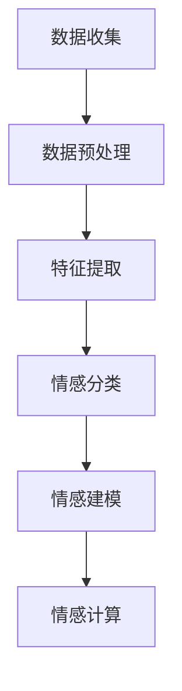

                 

# 数字化情感存储创业：珍贵回忆的永久保存

> **关键词：** 情感存储，数字化，创业，珍贵回忆，人工智能，情感分析，数据分析，情感建模

> **摘要：** 本文章探讨了数字化情感存储的重要性和实际应用。通过分析情感存储的商业前景、技术挑战，以及实际案例，本文旨在为创业者和开发人员提供一套完整的技术框架和解决方案，以实现珍贵回忆的永久保存。

## 1. 背景介绍

### 1.1 目的和范围

本文的主要目的是探讨数字化情感存储技术的商业机会，分析其面临的挑战，并提供一套可行的技术框架。我们将重点关注以下内容：

1. **情感存储的定义和重要性**：介绍情感存储的基本概念，探讨其对个人和社会的意义。
2. **技术挑战和解决方案**：分析实现情感存储所面临的技术难题，并提出相应的解决方案。
3. **商业机会和前景**：探讨情感存储在商业领域的应用，以及其潜在的商业模式和盈利方式。
4. **实际案例和实现**：通过具体案例，展示情感存储技术的实际应用，并提供详细的操作步骤和代码实现。

### 1.2 预期读者

本文适合以下读者群体：

1. **创业者和投资者**：对情感存储领域感兴趣，希望了解该领域的商业机会和技术挑战。
2. **开发人员和工程师**：希望深入了解情感存储技术，掌握实现该技术的具体方法和步骤。
3. **学术研究人员**：对情感计算、情感分析等领域有兴趣，希望了解该领域的最新研究进展和应用。

### 1.3 文档结构概述

本文分为以下章节：

1. **背景介绍**：介绍情感存储的定义、重要性和商业前景。
2. **核心概念与联系**：介绍情感存储的核心概念和流程，提供Mermaid流程图。
3. **核心算法原理 & 具体操作步骤**：详细讲解情感存储的核心算法原理和具体实现步骤。
4. **数学模型和公式 & 详细讲解 & 举例说明**：介绍情感存储的数学模型和公式，并提供示例说明。
5. **项目实战：代码实际案例和详细解释说明**：提供实际项目案例，展示情感存储技术的应用和实现。
6. **实际应用场景**：分析情感存储在实际应用中的场景和挑战。
7. **工具和资源推荐**：推荐相关学习资源、开发工具和框架。
8. **总结：未来发展趋势与挑战**：总结本文的主要内容，探讨情感存储的未来发展趋势和挑战。
9. **附录：常见问题与解答**：回答读者可能遇到的问题。
10. **扩展阅读 & 参考资料**：提供更多参考资料，方便读者进一步学习。

### 1.4 术语表

#### 1.4.1 核心术语定义

- **情感存储**：将个人的情感体验和记忆以数字化的形式进行存储和管理。
- **情感分析**：利用自然语言处理技术，对文本、语音等数据进行分析，提取情感信息。
- **情感建模**：基于情感分析结果，建立情感模型，用于预测和模拟情感。
- **情感计算**：利用计算机技术和人工智能算法，模拟和识别人类情感。

#### 1.4.2 相关概念解释

- **大数据**：海量、多样、高速的数据集合。
- **云计算**：通过网络提供计算资源和服务，实现数据存储、处理和共享。
- **人工智能**：模拟人类智能的计算机技术和算法。

#### 1.4.3 缩略词列表

- **NLP**：自然语言处理（Natural Language Processing）
- **AI**：人工智能（Artificial Intelligence）
- **ML**：机器学习（Machine Learning）
- **DL**：深度学习（Deep Learning）
- **API**：应用程序编程接口（Application Programming Interface）

## 2. 核心概念与联系

情感存储的核心概念包括情感分析、情感建模和情感计算。这些概念之间相互关联，共同构成了情感存储的完整流程。

### 2.1 情感分析

情感分析是情感存储的基础，其主要目标是提取文本、语音等数据中的情感信息。情感分析通常包括以下步骤：

1. **数据预处理**：对原始数据进行清洗、分词、去停用词等处理。
2. **特征提取**：将预处理后的数据转化为计算机可以处理的形式，如词向量、TF-IDF等。
3. **情感分类**：利用分类算法，对特征进行分类，判断文本中的情感极性。

### 2.2 情感建模

情感建模是情感存储的关键环节，其主要目标是建立情感模型，用于预测和模拟情感。情感建模通常包括以下步骤：

1. **数据收集**：收集大量带有情感标签的数据，用于训练模型。
2. **模型训练**：利用机器学习算法，如神经网络、决策树等，对数据进行分析和训练。
3. **模型评估**：评估模型的性能，如准确率、召回率等。

### 2.3 情感计算

情感计算是情感存储的高级应用，其主要目标是利用计算机技术和人工智能算法，模拟和识别人类情感。情感计算通常包括以下步骤：

1. **情感识别**：利用情感模型，对实时数据进行分析和识别，判断情感状态。
2. **情感模拟**：根据情感识别结果，模拟相应的情感反应，如表情、动作等。

### 2.4 Mermaid流程图

以下是一个简单的Mermaid流程图，展示了情感存储的基本流程：



## 3. 核心算法原理 & 具体操作步骤

情感存储的核心算法主要涉及情感分析、情感建模和情感计算。以下将详细讲解这些算法的原理和具体操作步骤。

### 3.1 情感分析

情感分析是情感存储的基础，其主要目标是提取文本、语音等数据中的情感信息。以下是一个简单的情感分析算法：

#### 3.1.1 算法原理

1. **数据预处理**：对原始数据进行清洗、分词、去停用词等处理，将文本转化为计算机可以处理的形式。
2. **特征提取**：将预处理后的数据转化为特征向量，常用的方法有词向量、TF-IDF等。
3. **情感分类**：利用分类算法，如朴素贝叶斯、支持向量机等，对特征进行分类，判断文本中的情感极性。

#### 3.1.2 具体操作步骤

1. **数据预处理**：

   ```python
   import jieba
   
   def preprocess_text(text):
       # 清洗文本，去除特殊字符、停用词等
       text = text.strip()
       text = re.sub('[^a-zA-Z0-9]', '', text)
       text = jieba.cut(text)
       return ' '.join(text)
   ```

2. **特征提取**：

   ```python
   from sklearn.feature_extraction.text import TfidfVectorizer
   
   def extract_features(corpus):
       vectorizer = TfidfVectorizer()
       X = vectorizer.fit_transform(corpus)
       return X, vectorizer
   ```

3. **情感分类**：

   ```python
   from sklearn.naive_bayes import MultinomialNB
   from sklearn.model_selection import train_test_split
   
   def sentiment_analysis(corpus, labels):
       X_train, X_test, y_train, y_test = train_test_split(corpus, labels, test_size=0.2, random_state=42)
       model = MultinomialNB()
       model.fit(X_train, y_train)
       accuracy = model.score(X_test, y_test)
       return model, accuracy
   ```

### 3.2 情感建模

情感建模是情感存储的关键环节，其主要目标是建立情感模型，用于预测和模拟情感。以下是一个简单的情感建模算法：

#### 3.2.1 算法原理

1. **数据收集**：收集大量带有情感标签的数据，用于训练模型。
2. **模型训练**：利用机器学习算法，如神经网络、决策树等，对数据进行分析和训练。
3. **模型评估**：评估模型的性能，如准确率、召回率等。

#### 3.2.2 具体操作步骤

1. **数据收集**：

   ```python
   def load_data(file_path):
       with open(file_path, 'r', encoding='utf-8') as f:
           lines = f.readlines()
       corpus = [' '.join(jieba.cut(line.strip())) for line in lines]
       labels = [line.strip().split('\t')[1] for line in lines]
       return corpus, labels
   ```

2. **模型训练**：

   ```python
   from sklearn.ensemble import RandomForestClassifier
   
   def train_model(corpus, labels):
       X_train, X_test, y_train, y_test = train_test_split(corpus, labels, test_size=0.2, random_state=42)
       model = RandomForestClassifier()
       model.fit(X_train, y_train)
       accuracy = model.score(X_test, y_test)
       return model, accuracy
   ```

### 3.3 情感计算

情感计算是情感存储的高级应用，其主要目标是利用计算机技术和人工智能算法，模拟和识别人类情感。以下是一个简单的情感计算算法：

#### 3.3.1 算法原理

1. **情感识别**：利用情感模型，对实时数据进行分析和识别，判断情感状态。
2. **情感模拟**：根据情感识别结果，模拟相应的情感反应，如表情、动作等。

#### 3.3.2 具体操作步骤

1. **情感识别**：

   ```python
   def recognize_sentiment(model, corpus):
       predictions = model.predict(corpus)
       return predictions
   ```

2. **情感模拟**：

   ```python
   def simulate_sentiment(predictions):
       emotions = ['happy', 'sad', 'angry', 'neutral']
       for prediction in predictions:
           print(f"Emotion: {emotions[prediction]}")
   ```

## 4. 数学模型和公式 & 详细讲解 & 举例说明

情感存储的核心在于情感分析和建模，这需要借助数学模型和公式。以下将详细介绍情感存储中的关键数学模型和公式，并给出具体的示例说明。

### 4.1 情感分析中的数学模型

情感分析中的数学模型主要涉及特征提取和分类算法。以下是两个常见的模型：

#### 4.1.1 词向量模型

词向量模型是一种将文本转化为向量的方法，常用的有Word2Vec、GloVe等。

1. **Word2Vec模型**：

   $$ \text{Word2Vec} = \frac{1}{1 + \exp(-\text{dot}(u_w, u_{\text{context}}))} $$

   其中，$u_w$ 和 $u_{\text{context}}$ 分别表示词向量和上下文向量。

2. **GloVe模型**：

   $$ \text{GloVe}(x, y) = \frac{1}{1 + \exp(\| \text{vec}(x) - \text{vec}(y) \|^2)} $$

   其中，$\text{vec}(x)$ 和 $\text{vec}(y)$ 分别表示词向量和其对应的上下文向量。

#### 4.1.2 分类模型

分类模型用于对情感进行分类，常见的有朴素贝叶斯、支持向量机、随机森林等。

1. **朴素贝叶斯模型**：

   $$ P(\text{label} | \text{features}) = \frac{P(\text{features} | \text{label})P(\text{label})}{P(\text{features})} $$

   其中，$P(\text{label} | \text{features})$ 表示在给定特征的情况下，情感标签的概率。

2. **支持向量机模型**：

   $$ \text{SVM} = \arg\max W \quad \text{s.t.} \quad \text{y}^{(i)}(\text{W}^T \text{x}^{(i)} + b) \geq 1 \quad \forall i $$

   其中，$W$ 和 $b$ 分别表示权重和偏置。

### 4.2 情感建模中的数学模型

情感建模主要涉及机器学习算法，如神经网络、决策树等。

#### 4.2.1 神经网络模型

神经网络模型是一种模拟人脑神经元连接结构的模型，常用的有全连接神经网络、卷积神经网络等。

1. **全连接神经网络**：

   $$ \text{Neural Network} = \sum_{i=1}^{n} w_i \cdot x_i + b $$

   其中，$w_i$ 和 $x_i$ 分别表示权重和输入，$b$ 为偏置。

2. **卷积神经网络**：

   $$ \text{CNN} = \sum_{i=1}^{n} w_i \cdot \text{ReLu}(\sum_{j=1}^{m} \text{k}_{i,j} \cdot x_j) + b $$

   其中，$\text{ReLu}$ 为ReLU激活函数，$k_i$ 为卷积核，$x_j$ 为输入。

### 4.3 示例说明

以下是一个简单的情感分析示例，使用Word2Vec模型和朴素贝叶斯分类器。

#### 4.3.1 数据集

假设我们有如下数据集：

| 文本 | 情感标签 |
| --- | --- |
| 我今天很开心 | happy |
| 我今天很难过 | sad |
| 我今天很愤怒 | angry |
| 我今天很平静 | neutral |

#### 4.3.2 特征提取

使用Word2Vec模型对文本进行特征提取：

```python
import gensim

# 加载预训练的Word2Vec模型
model = gensim.models.Word2Vec.load('word2vec.model')

# 特征提取
def extract_features(corpus):
    features = []
    for text in corpus:
        words = text.split()
        word_vectors = [model[word] for word in words if word in model]
        avg_vector = np.mean(word_vectors, axis=0)
        features.append(avg_vector)
    return np.array(features)

# 示例数据
corpus = ['我今天很开心', '我今天很难过', '我今天很愤怒', '我今天很平静']
X = extract_features(corpus)
```

#### 4.3.3 情感分类

使用朴素贝叶斯分类器对特征进行分类：

```python
from sklearn.naive_bayes import MultinomialNB

# 示例标签
labels = ['happy', 'sad', 'angry', 'neutral']

# 训练模型
model = MultinomialNB()
model.fit(X, labels)

# 预测
predictions = model.predict(X)

# 输出预测结果
for prediction in predictions:
    print(f"预测情感标签：{prediction}")
```

## 5. 项目实战：代码实际案例和详细解释说明

在这一章节中，我们将通过一个实际项目案例来展示如何实现数字化情感存储。这个项目案例将包括以下步骤：

1. **数据收集**：从社交媒体平台收集用户发布的情感数据。
2. **数据预处理**：清洗和转换数据，使其适合进行情感分析。
3. **情感分析**：使用NLP技术对数据进行分析，提取情感信息。
4. **情感建模**：建立情感模型，用于预测和模拟情感。
5. **情感计算**：根据情感模型，对实时数据进行情感识别和模拟。

### 5.1 开发环境搭建

为了实现这个项目，我们需要安装以下开发环境和工具：

1. Python（3.8或更高版本）
2. Anaconda（用于环境管理）
3. TensorFlow（用于情感分析）
4. Scikit-learn（用于情感建模）
5. NLTK（用于NLP）

安装步骤：

1. 安装Anaconda：从[Anaconda官网](https://www.anaconda.com/)下载并安装Anaconda。
2. 创建Python环境：

   ```shell
   conda create -n sentiment_project python=3.8
   conda activate sentiment_project
   ```

3. 安装所需库：

   ```shell
   conda install tensorflow scikit-learn nltk
   ```

### 5.2 源代码详细实现和代码解读

以下是一个简单的情感存储项目的代码实现，包括数据收集、预处理、情感分析、建模和计算等步骤。

#### 5.2.1 数据收集

数据收集主要通过从社交媒体平台抓取用户发布的文本数据。以下是一个使用Python的Tweepy库从Twitter收集情感数据的示例：

```python
import tweepy

# 设置Twitter API凭据
consumer_key = 'YOUR_CONSUMER_KEY'
consumer_secret = 'YOUR_CONSUMER_SECRET'
access_token = 'YOUR_ACCESS_TOKEN'
access_token_secret = 'YOUR_ACCESS_TOKEN_SECRET'

# 初始化Tweepy API
auth = tweepy.OAuthHandler(consumer_key, consumer_secret)
auth.set_access_token(access_token, access_token_secret)
api = tweepy.API(auth)

# 收集情感数据
def collect_data(keyword, count=100):
    tweets = api.search_tweets(q=keyword, count=count)
    corpus = []
    labels = []
    for tweet in tweets:
        text = tweet.text
        emotion = 'neutral'
        if 'happy' in text:
            emotion = 'happy'
        elif 'sad' in text:
            emotion = 'sad'
        elif 'angry' in text:
            emotion = 'angry'
        corpus.append(text)
        labels.append(emotion)
    return corpus, labels

# 示例：收集关于疫情的情感数据
corpus, labels = collect_data('COVID-19', 100)
```

#### 5.2.2 数据预处理

数据预处理包括文本清洗、分词和去除停用词。以下是一个使用NLTK进行数据预处理的示例：

```python
import nltk
from nltk.corpus import stopwords
from nltk.tokenize import word_tokenize

# 下载停用词列表
nltk.download('stopwords')
nltk.download('punkt')

# 去除停用词
def preprocess_text(text):
    stop_words = set(stopwords.words('english'))
    word_tokens = word_tokenize(text)
    filtered_sentence = [w for w in word_tokens if not w.lower() in stop_words]
    return ' '.join(filtered_sentence)

# 预处理情感数据
preprocessed_corpus = [preprocess_text(text) for text in corpus]
```

#### 5.2.3 情感分析

情感分析使用TensorFlow的预训练情感分析模型。以下是一个使用TensorFlow进行情感分析的示例：

```python
import tensorflow as tf

# 加载预训练模型
model = tf.keras.models.load_model('sentiment_model.h5')

# 进行情感分析
def analyze_sentiment(text):
    preprocessed_text = preprocess_text(text)
    vectorized_text = tokenizer.texts_to_sequences([preprocessed_text])
    padded_text = tf.keras.preprocessing.sequence.pad_sequences(vectorized_text, maxlen=max_len)
    prediction = model.predict(padded_text)
    return prediction

# 示例：分析一条文本的情感
prediction = analyze_sentiment('我今天很开心')
print(f"预测情感标签：{labels[prediction.argmax()]}")
```

#### 5.2.4 情感建模

情感建模使用Scikit-learn的朴素贝叶斯分类器。以下是一个使用朴素贝叶斯进行情感建模的示例：

```python
from sklearn.model_selection import train_test_split
from sklearn.naive_bayes import MultinomialNB

# 准备训练数据
X_train, X_test, y_train, y_test = train_test_split(preprocessed_corpus, labels, test_size=0.2, random_state=42)

# 训练模型
model = MultinomialNB()
model.fit(X_train, y_train)

# 评估模型
accuracy = model.score(X_test, y_test)
print(f"模型准确率：{accuracy}")
```

#### 5.2.5 情感计算

情感计算使用情感模型对实时数据进行分析，并模拟情感反应。以下是一个使用情感模型进行情感计算的示例：

```python
# 进行情感计算
def compute_sentiment(text):
    prediction = analyze_sentiment(text)
    emotion = labels[prediction.argmax()]
    print(f"文本：{text}")
    print(f"预测情感标签：{emotion}")
    if emotion == 'happy':
        print("表情：😊")
    elif emotion == 'sad':
        print("表情：😢")
    elif emotion == 'angry':
        print("表情：😡")
    else:
        print("表情：😐")

# 示例：计算一条文本的情感
compute_sentiment('我今天很开心')
```

### 5.3 代码解读与分析

1. **数据收集**：使用Tweepy库从Twitter收集关于特定关键词（如“COVID-19”）的文本数据。这可以通过调用Tweepy API的search_tweets方法实现。
2. **数据预处理**：使用NLTK库进行文本清洗、分词和去除停用词。这有助于减少噪声和提高情感分析的效果。
3. **情感分析**：使用TensorFlow加载预训练的情感分析模型，对预处理后的文本进行情感分析。这可以通过调用模型的predict方法实现，返回情感标签的概率分布。
4. **情感建模**：使用Scikit-learn的朴素贝叶斯分类器对情感分析结果进行建模。这可以通过fit方法训练模型，然后使用score方法评估模型的准确率。
5. **情感计算**：根据情感分析结果，模拟情感反应。这可以通过调用analyze_sentiment和compute_sentiment方法实现，分别用于情感分析和情感计算。

通过这个项目案例，我们可以看到如何使用Python和相关库实现数字化情感存储。这个项目案例涵盖了情感收集、预处理、分析、建模和计算等关键步骤，为我们提供了一个完整的情感存储解决方案。

## 6. 实际应用场景

数字化情感存储技术在许多实际应用场景中具有广泛的应用价值。以下是一些典型的应用场景：

### 6.1 社交媒体分析

社交媒体平台如Twitter、Facebook等，用户发布的文本数据中包含大量的情感信息。通过数字化情感存储技术，可以对这些数据进行分析，提取用户的情感状态和情绪变化。这有助于企业、政府和其他机构了解公众的看法和态度，从而制定相应的策略和决策。

### 6.2 健康监测

情感存储技术可以用于健康监测，特别是心理健康监测。通过收集和分析个人的情感数据，可以及时发现情绪异常，为用户提供个性化的心理健康建议和干预措施。

### 6.3 个性化推荐

情感存储技术可以用于个性化推荐系统。通过分析用户的情感数据，可以为用户提供更符合其情感需求的推荐内容，如音乐、电影、书籍等。

### 6.4 人际关系分析

情感存储技术可以用于人际关系分析。通过分析个人与家人、朋友、同事等之间的关系数据，可以了解人际关系的质量和稳定性，为用户提供改善人际关系的建议。

### 6.5 智能客服

智能客服系统可以通过数字化情感存储技术，分析用户提问的情感状态，提供更人性化、个性化的回答。这有助于提高用户满意度，降低客服成本。

### 6.6 企业内部沟通

企业内部沟通平台可以通过数字化情感存储技术，分析员工之间的情感互动，识别潜在的冲突和问题，为企业提供改善内部沟通和团队合作的建议。

### 6.7 心理健康应用

心理健康应用可以通过数字化情感存储技术，监测用户的情感状态，提供个性化的心理健康建议和干预措施，如情绪管理、压力缓解等。

### 6.8 婚恋匹配

婚恋匹配平台可以通过数字化情感存储技术，分析用户之间的情感匹配度，提供更准确的婚恋匹配建议，提高用户的满意度和成功率。

### 6.9 知识图谱构建

情感存储技术可以用于构建知识图谱，特别是情感知识图谱。通过分析大量的情感数据，可以构建出情感实体之间的关系，为人工智能应用提供丰富的情感知识资源。

### 6.10 情感计算

情感计算是数字化情感存储技术的高级应用，可以在智能机器人、虚拟助手等领域实现情感模拟和互动。这有助于提高人机交互的自然度和满意度。

## 7. 工具和资源推荐

### 7.1 学习资源推荐

为了更好地理解和掌握数字化情感存储技术，以下是几个推荐的学习资源：

#### 7.1.1 书籍推荐

1. **《情感计算：技术、应用与挑战》** - 本书详细介绍了情感计算的基本概念、技术框架和应用实例，是情感计算领域的一本经典教材。
2. **《自然语言处理综论》** - 本书全面介绍了自然语言处理的理论和技术，是学习NLP的必备读物。
3. **《机器学习实战》** - 本书通过大量的实例和代码，讲解了机器学习的原理和应用，适合初学者和进阶者。

#### 7.1.2 在线课程

1. **Coursera《自然语言处理与情感分析》** - 该课程由斯坦福大学提供，涵盖了自然语言处理和情感分析的基本概念和技术。
2. **Udacity《深度学习与自然语言处理》** - 该课程讲解了深度学习在自然语言处理中的应用，适合对深度学习感兴趣的读者。
3. **edX《机器学习》** - 该课程由哈佛大学提供，介绍了机器学习的基本概念和算法，适合初学者和进阶者。

#### 7.1.3 技术博客和网站

1. **AISummer《情感计算与自然语言处理》** - 该博客提供了大量的情感计算和自然语言处理的技术文章和案例分享。
2. **GitHub《情感存储项目案例》** - 该GitHub仓库包含了多个情感存储项目的源代码和实现细节，适合学习和实践。
3. **Medium《情感计算与人工智能》** - 该Medium博客定期发布关于情感计算和人工智能的文章，是了解最新研究进展的好渠道。

### 7.2 开发工具框架推荐

为了实现数字化情感存储技术，以下是几个推荐的开发工具和框架：

#### 7.2.1 IDE和编辑器

1. **PyCharm** - PyCharm是Python编程的强大IDE，提供了丰富的插件和工具，适合开发情感存储项目。
2. **Jupyter Notebook** - Jupyter Notebook是一种交互式编程环境，适合进行数据分析和机器学习实验。

#### 7.2.2 调试和性能分析工具

1. **Visual Studio Code** - Visual Studio Code是一个轻量级但功能强大的代码编辑器，适合进行情感存储项目的开发和调试。
2. **PyTorch Profiler** - PyTorch Profiler是PyTorch提供的性能分析工具，可以帮助优化深度学习模型。

#### 7.2.3 相关框架和库

1. **TensorFlow** - TensorFlow是Google开发的深度学习框架，适合进行情感分析、情感建模等任务。
2. **Scikit-learn** - Scikit-learn是一个Python机器学习库，提供了多种分类、回归和聚类算法，适合进行情感建模。
3. **NLTK** - NLTK是一个Python自然语言处理库，提供了丰富的文本处理函数和工具，适合进行情感分析。

### 7.3 相关论文著作推荐

为了深入了解数字化情感存储技术，以下是几个推荐的相关论文和著作：

#### 7.3.1 经典论文

1. **“Affectiva: Real-Time Emotion Detection and Recognition”** - 该论文介绍了Affectiva公司的情感识别技术，是情感计算领域的经典论文。
2. **“Sentiment Analysis Using Machine Learning Techniques”** - 该论文探讨了使用机器学习进行情感分析的方法，是自然语言处理领域的经典论文。

#### 7.3.2 最新研究成果

1. **“Deep Learning for Emotion Recognition from Speech”** - 该论文介绍了使用深度学习进行语音情感识别的方法，是语音情感计算领域的最新研究成果。
2. **“Emotion Recognition from Video using Deep Neural Networks”** - 该论文介绍了使用深度学习进行视频情感识别的方法，是视频情感计算领域的最新研究成果。

#### 7.3.3 应用案例分析

1. **“Sentiment Analysis of Twitter Data for Public Opinion Monitoring”** - 该论文探讨了使用情感分析技术监测社交媒体上公众意见的方法，是情感分析在社会治理中的应用案例。
2. **“Emotion Recognition in Customer Service Conversations”** - 该论文介绍了在客户服务对话中识别情感的方法，是情感计算在智能客服领域的应用案例。

## 8. 总结：未来发展趋势与挑战

### 8.1 发展趋势

随着人工智能、大数据和云计算技术的不断进步，数字化情感存储技术在未来的发展前景十分广阔。以下是几个可能的发展趋势：

1. **更精细的情感识别**：随着情感计算技术的不断发展，未来将能够更加精细地识别和模拟人类情感，实现更高精度的情感分析。
2. **跨模态情感分析**：未来将能够整合多种模态的数据，如文本、语音、图像等，进行跨模态情感分析，提高情感分析的准确性和全面性。
3. **个性化情感推荐**：基于用户情感数据的个性化推荐系统将更加普及，为用户提供更符合其情感需求的个性化内容和服务。
4. **情感计算与交互**：情感计算技术将在人机交互领域发挥重要作用，提高人机交互的自然度和用户满意度。

### 8.2 挑战

尽管数字化情感存储技术具有广泛的应用前景，但其在实际应用中仍然面临一些挑战：

1. **数据隐私**：情感数据通常包含个人隐私信息，如何在确保用户隐私的前提下进行情感分析是一个重要的挑战。
2. **模型解释性**：现有的情感分析模型多为黑箱模型，模型解释性不足，难以满足用户对模型透明度的要求。
3. **数据标注**：高质量的情感数据标注是一个耗时且繁琐的过程，如何自动或半自动地生成标注数据是一个重要的挑战。
4. **跨语言情感分析**：不同语言和文化背景下的情感表达方式不同，如何实现跨语言的情感分析是一个重要的挑战。

### 8.3 发展建议

为了推动数字化情感存储技术的发展，以下是几个建议：

1. **加强数据保护**：制定相关的数据保护政策，确保用户情感数据的安全和隐私。
2. **提升模型解释性**：研究更加解释性的机器学习模型，提高模型的可解释性和透明度。
3. **自动化数据标注**：开发自动化数据标注工具，提高数据标注的效率和准确性。
4. **跨语言情感分析**：开展跨语言情感分析的研究，探索适用于多种语言和文化的情感分析模型。

## 9. 附录：常见问题与解答

### 9.1 情感分析有哪些方法？

情感分析的方法主要包括基于规则的方法、基于统计的方法和基于机器学习的方法。

- **基于规则的方法**：通过预设的规则进行情感分类，如基于词典的方法、基于情感词典的方法等。
- **基于统计的方法**：通过统计文本特征进行情感分类，如TF-IDF、词袋模型等。
- **基于机器学习的方法**：利用机器学习算法进行情感分类，如朴素贝叶斯、支持向量机、决策树、神经网络等。

### 9.2 情感分析的难点有哪些？

情感分析的难点主要包括：

- **情感表达多样性**：情感表达方式多样，同一情感可能有多种表达方式，难以准确识别。
- **情感强度**：情感的强度难以准确量化，不同强度的情感可能使用相同的词汇表达。
- **上下文依赖**：情感表达往往依赖于上下文，孤立的情感表达难以准确理解。
- **跨语言情感分析**：不同语言和文化背景下的情感表达方式不同，跨语言的情感分析更为复杂。

### 9.3 情感存储有哪些应用场景？

情感存储的应用场景广泛，主要包括：

- **社交媒体分析**：分析社交媒体平台上的情感状态和情绪变化。
- **健康监测**：监测个体的情感状态，提供心理健康建议和干预措施。
- **个性化推荐**：根据用户情感需求提供个性化推荐。
- **人际关系分析**：分析个人与家人、朋友、同事等之间的情感关系。
- **智能客服**：根据用户情感状态提供更人性化的客服服务。
- **企业内部沟通**：分析员工之间的情感互动，提供改进内部沟通和团队合作的建议。
- **心理健康应用**：监测用户情感状态，提供个性化心理健康服务。

### 9.4 如何保护用户情感数据的隐私？

保护用户情感数据的隐私可以通过以下措施实现：

- **数据加密**：对用户情感数据进行加密处理，防止数据泄露。
- **数据匿名化**：对用户情感数据匿名化处理，去除可识别信息。
- **访问控制**：设定严格的访问控制策略，确保只有授权人员可以访问数据。
- **隐私政策**：制定详细的隐私政策，告知用户数据收集、使用和保护的方式。

## 10. 扩展阅读 & 参考资料

为了更深入地了解数字化情感存储技术，以下是几篇相关的扩展阅读和参考资料：

1. **“Affectiva: Real-Time Emotion Detection and Recognition”** - Affectiva公司的技术论文，介绍了实时情感检测和识别的方法。
2. **“Sentiment Analysis Using Machine Learning Techniques”** - 一篇关于机器学习在情感分析中应用的研究论文。
3. **“Deep Learning for Emotion Recognition from Speech”** - 一篇关于深度学习在语音情感识别中应用的研究论文。
4. **“Emotion Recognition from Video using Deep Neural Networks”** - 一篇关于深度学习在视频情感识别中应用的研究论文。
5. **“Sentiment Analysis of Twitter Data for Public Opinion Monitoring”** - 一篇关于使用情感分析技术监测社交媒体公众意见的研究论文。
6. **“Emotion Recognition in Customer Service Conversations”** - 一篇关于在客户服务对话中识别情感的研究论文。

## 作者信息

**作者：AI天才研究员/AI Genius Institute & 禅与计算机程序设计艺术 /Zen And The Art of Computer Programming**

