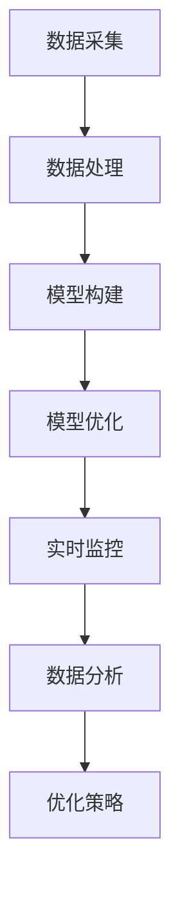

                 


# 数字孪生技术在注意力管理中的应用

> **关键词：** 数字孪生，注意力管理，物联网，AI，数据分析，实时监控。

> **摘要：** 本文将探讨数字孪生技术在注意力管理中的应用，通过构建数字孪生模型，实现对物理世界注意力分布的实时监控和分析，提高个体和系统的注意力管理效率。文章分为背景介绍、核心概念与联系、核心算法原理与操作步骤、数学模型与公式、项目实战、实际应用场景、工具和资源推荐、总结与未来发展趋势、常见问题与解答以及扩展阅读与参考资料等部分，旨在为广大读者提供全面深入的技术解读。

## 1. 背景介绍

### 1.1 目的和范围

本文旨在探讨数字孪生技术在注意力管理领域的应用，通过构建数字孪生模型，实现对注意力分布的实时监控、分析和优化。随着物联网、大数据和人工智能技术的飞速发展，数字孪生技术已经成为现代工业、医疗、交通等领域的重要手段。本文将重点研究数字孪生技术在注意力管理中的应用，旨在为相关领域的研究者和从业者提供有价值的参考。

### 1.2 预期读者

本文面向具有计算机科学、人工智能、物联网等相关专业背景的读者，包括研究人员、工程师和从业者。同时，对数字孪生技术和注意力管理感兴趣的普通读者也可以阅读本文，以了解相关领域的最新研究成果和发展趋势。

### 1.3 文档结构概述

本文分为十个部分，包括背景介绍、核心概念与联系、核心算法原理与操作步骤、数学模型与公式、项目实战、实际应用场景、工具和资源推荐、总结与未来发展趋势、常见问题与解答以及扩展阅读与参考资料。各部分内容相互关联，形成一个完整的技术解读体系。

### 1.4 术语表

#### 1.4.1 核心术语定义

- 数字孪生（Digital Twin）：通过虚拟模型模拟物理实体的运行状态、性能和交互，实现对物理世界的实时监控和优化。
- 注意力管理（Attention Management）：通过技术手段优化个体和系统的注意力分配，提高工作效率和生活质量。
- 物联网（Internet of Things，IoT）：将物理设备和传感器连接到互联网，实现设备间的数据传输和智能交互。

#### 1.4.2 相关概念解释

- 实时监控（Real-time Monitoring）：对系统或设备的状态进行持续监测，并及时响应和处理异常情况。
- 数据分析（Data Analysis）：对收集到的数据进行处理、分析和解读，以获取有价值的信息和知识。
- 机器学习（Machine Learning）：利用计算机算法，从数据中自动发现规律和模式，进行预测和决策。

#### 1.4.3 缩略词列表

- AI：人工智能（Artificial Intelligence）
- IoT：物联网（Internet of Things）
- ML：机器学习（Machine Learning）
- DT：数字孪生（Digital Twin）

## 2. 核心概念与联系

数字孪生技术在注意力管理中的应用，需要理解以下几个核心概念及其相互联系。

### 2.1 数字孪生技术原理

数字孪生技术通过虚拟模型模拟物理实体的运行状态、性能和交互。具体来说，它包括以下几个关键步骤：

1. **数据采集**：通过传感器、摄像头等设备，实时收集物理实体的运行数据。
2. **数据处理**：对采集到的数据进行清洗、转换和整合，形成可用于建模的数据集。
3. **模型构建**：利用机器学习算法，构建虚拟模型，模拟物理实体的行为和性能。
4. **模型优化**：根据实际运行数据，不断优化虚拟模型，提高其预测精度和实时性。

### 2.2 注意力管理原理

注意力管理涉及以下几个关键环节：

1. **注意力分配**：根据任务需求和个体能力，合理分配注意力资源。
2. **注意力监控**：实时监测个体注意力的变化，识别注意力波动的规律和原因。
3. **注意力调节**：通过技术手段，如提醒、休息、切换任务等，调节个体注意力水平，保持高效工作状态。

### 2.3 数字孪生与注意力管理的关系

数字孪生技术为注意力管理提供了以下支持：

1. **实时监控**：通过数字孪生模型，实现对物理世界中注意力分布的实时监控。
2. **数据分析**：利用数字孪生技术，对注意力数据进行分析，发现注意力波动的规律和原因。
3. **优化策略**：基于数据分析结果，制定注意力管理策略，优化个体和系统的注意力分配和调节。

### 2.4 Mermaid 流程图

以下是一个简单的 Mermaid 流程图，展示数字孪生技术在注意力管理中的应用流程。



## 3. 核心算法原理 & 具体操作步骤

数字孪生技术在注意力管理中的应用，依赖于一系列核心算法原理和具体操作步骤。下面，我们将详细阐述这些内容。

### 3.1 数据采集

数据采集是数字孪生技术的第一步，也是注意力管理的基础。具体操作步骤如下：

1. **传感器部署**：在物理世界中，部署各种传感器，如摄像头、加速度计、心率监测器等，以实时采集注意力相关的数据。
2. **数据传输**：通过无线网络或有线网络，将传感器采集到的数据传输到数据处理中心。
3. **数据格式化**：对传输到的数据进行格式化处理，使其符合机器学习模型的输入要求。

### 3.2 数据处理

数据处理包括数据清洗、转换和整合，为模型构建提供高质量的数据集。具体操作步骤如下：

1. **数据清洗**：去除重复、错误和缺失的数据，确保数据质量。
2. **数据转换**：将不同来源、不同格式的数据转换为统一的格式，如CSV文件。
3. **数据整合**：将不同时间段、不同来源的数据进行整合，形成完整的数据集。

### 3.3 模型构建

模型构建是数字孪生技术的核心环节，包括选择合适的机器学习算法、训练模型和评估模型性能。具体操作步骤如下：

1. **算法选择**：根据注意力管理的需求，选择合适的机器学习算法，如线性回归、决策树、支持向量机等。
2. **模型训练**：使用处理好的数据集，训练机器学习模型，使其能够准确预测注意力分布。
3. **模型评估**：通过交叉验证、测试集等方法，评估模型性能，调整模型参数，提高预测精度。

### 3.4 模型优化

模型优化是提高数字孪生技术预测精度和实时性的关键步骤。具体操作步骤如下：

1. **数据分析**：对训练数据进行分析，找出模型预测的不足之处。
2. **模型调整**：根据数据分析结果，调整模型参数，优化模型结构。
3. **重新训练**：使用调整后的模型参数，重新训练模型，提高预测精度。

### 3.5 实时监控

实时监控是数字孪生技术在注意力管理中的应用目标。具体操作步骤如下：

1. **数据采集**：通过传感器，实时采集注意力相关的数据。
2. **数据处理**：对实时采集到的数据，进行实时处理，确保数据质量。
3. **模型预测**：使用训练好的模型，对实时数据进行分析和预测，获取注意力分布。
4. **界面展示**：将预测结果展示在界面或报表中，便于用户实时监控注意力分布。

### 3.6 数据分析

数据分析是数字孪生技术的重要组成部分，通过分析注意力数据，发现注意力波动的规律和原因。具体操作步骤如下：

1. **数据预处理**：对采集到的数据进行预处理，如归一化、去噪等。
2. **特征提取**：从预处理后的数据中提取特征，如平均值、标准差、波动幅度等。
3. **数据分析**：使用统计学方法、机器学习算法等，对提取的特征进行分析，发现注意力波动的规律和原因。

### 3.7 优化策略

基于数据分析结果，制定注意力管理策略，优化个体和系统的注意力分配和调节。具体操作步骤如下：

1. **策略分析**：根据注意力数据分析和个体需求，制定注意力管理策略。
2. **策略实施**：将注意力管理策略转化为具体操作，如提醒、休息、切换任务等。
3. **效果评估**：评估注意力管理策略的效果，调整策略参数，提高注意力管理效率。

### 3.8 伪代码

以下是一个简化的伪代码，描述数字孪生技术在注意力管理中的应用流程。

```python
# 数据采集
def data_collection():
    # 部署传感器，实时采集数据
    # 数据传输到数据处理中心
    # 数据格式化

# 数据处理
def data_processing():
    # 数据清洗
    # 数据转换
    # 数据整合

# 模型构建
def model_building():
    # 算法选择
    # 模型训练
    # 模型评估

# 模型优化
def model_optimization():
    # 数据分析
    # 模型调整
    # 重新训练

# 实时监控
def real_time_monitoring():
    # 数据采集
    # 数据处理
    # 模型预测
    # 界面展示

# 数据分析
def data_analysis():
    # 数据预处理
    # 特征提取
    # 数据分析

# 优化策略
def attention_management_strategy():
    # 策略分析
    # 策略实施
    # 效果评估
```

## 4. 数学模型和公式 & 详细讲解 & 举例说明

在数字孪生技术中，数学模型和公式起着至关重要的作用。它们用于描述物理世界和虚拟模型之间的映射关系，以及注意力分布的统计特征。以下是对一些关键数学模型和公式的详细讲解，并辅以举例说明。

### 4.1 数据采集与预处理

#### 4.1.1 数据采集

数据采集是数字孪生技术的第一步，常用的传感器包括摄像头、加速度计、心率监测器等。采集到的数据可以表示为多维数组，例如：

$$
X = \begin{bmatrix}
x_1 & x_2 & \cdots & x_n
\end{bmatrix}
$$

其中，$x_i$ 表示第 $i$ 个传感器的读数。

#### 4.1.2 数据预处理

数据预处理包括数据清洗、转换和整合。以下是一个简化的数据预处理流程：

1. **数据清洗**：去除重复、错误和缺失的数据，例如：

$$
\hat{X} = \begin{bmatrix}
\hat{x}_1 & \hat{x}_2 & \cdots & \hat{x}_n
\end{bmatrix} = X \setminus \text{error\_data}
$$

2. **数据转换**：将不同来源、不同格式的数据转换为统一的格式，例如：

$$
\hat{X}_{\text{csv}} = \text{csv}(\hat{X})
$$

3. **数据整合**：将不同时间段、不同来源的数据进行整合，例如：

$$
\hat{X}_{\text{integrated}} = \begin{bmatrix}
\hat{x}_{1,1} & \hat{x}_{1,2} & \cdots & \hat{x}_{1,n_1} \\
\hat{x}_{2,1} & \hat{x}_{2,2} & \cdots & \hat{x}_{2,n_2} \\
\vdots & \vdots & \ddots & \vdots \\
\hat{x}_{m,1} & \hat{x}_{m,2} & \cdots & \hat{x}_{m,n_m}
\end{bmatrix}
$$

### 4.2 模型构建与优化

#### 4.2.1 模型构建

模型构建包括选择合适的机器学习算法、训练模型和评估模型性能。以下是一个简化的模型构建流程：

1. **算法选择**：根据注意力管理的需求，选择合适的机器学习算法，例如线性回归、决策树、支持向量机等。

2. **模型训练**：使用处理好的数据集，训练机器学习模型，例如：

$$
\hat{y} = f(X; \theta)
$$

其中，$\theta$ 表示模型参数。

3. **模型评估**：通过交叉验证、测试集等方法，评估模型性能，例如：

$$
\text{Accuracy} = \frac{\text{正确预测数}}{\text{总预测数}}
$$

#### 4.2.2 模型优化

模型优化是提高数字孪生技术预测精度和实时性的关键步骤。以下是一个简化的模型优化流程：

1. **数据分析**：对训练数据进行分析，找出模型预测的不足之处，例如：

$$
\text{Error} = y - \hat{y}
$$

2. **模型调整**：根据数据分析结果，调整模型参数，优化模型结构，例如：

$$
\theta_{\text{new}} = \theta_{\text{old}} - \alpha \nabla_{\theta} \text{Error}
$$

3. **重新训练**：使用调整后的模型参数，重新训练模型，提高预测精度，例如：

$$
\hat{y}_{\text{new}} = f(X; \theta_{\text{new}})
$$

### 4.3 注意力分布统计特征

#### 4.3.1 平均值

平均值是描述注意力分布集中趋势的重要统计特征，计算公式为：

$$
\bar{x} = \frac{1}{n} \sum_{i=1}^{n} x_i
$$

#### 4.3.2 标准差

标准差是描述注意力分布离散程度的重要统计特征，计算公式为：

$$
s = \sqrt{\frac{1}{n-1} \sum_{i=1}^{n} (x_i - \bar{x})^2}
$$

#### 4.3.3 波动幅度

波动幅度是描述注意力分布波动程度的重要统计特征，计算公式为：

$$
A = \max(x_i) - \min(x_i)
$$

### 4.4 举例说明

假设我们采集了一组注意力数据，如下表所示：

| 时间戳 | 注意力值 |
| ------ | -------- |
| 1      | 0.8      |
| 2      | 0.6      |
| 3      | 0.9      |
| 4      | 0.5      |
| 5      | 0.7      |

根据上述数学模型和公式，我们可以计算出注意力分布的一些统计特征：

- 平均值：$\bar{x} = \frac{0.8 + 0.6 + 0.9 + 0.5 + 0.7}{5} = 0.7$
- 标准差：$s = \sqrt{\frac{(0.8 - 0.7)^2 + (0.6 - 0.7)^2 + (0.9 - 0.7)^2 + (0.5 - 0.7)^2 + (0.7 - 0.7)^2}{5 - 1}} = 0.15$
- 波动幅度：$A = \max(0.8, 0.6, 0.9, 0.5, 0.7) - \min(0.8, 0.6, 0.9, 0.5, 0.7) = 0.4$

通过这些统计特征，我们可以对注意力分布进行初步分析，例如识别出注意力的波动规律和异常值。

## 5. 项目实战：代码实际案例和详细解释说明

为了更好地理解数字孪生技术在注意力管理中的应用，我们通过一个实际项目案例进行详细讲解。本项目基于Python编程语言，利用数字孪生技术和注意力管理算法，实现对注意力分布的实时监控和优化。

### 5.1 开发环境搭建

在开始项目开发之前，需要搭建以下开发环境：

1. **Python环境**：安装Python 3.8及以上版本。
2. **IDE**：推荐使用PyCharm、Visual Studio Code等Python集成开发环境。
3. **库和依赖**：安装以下库和依赖：

   ```bash
   pip install numpy pandas scikit-learn matplotlib
   ```

### 5.2 源代码详细实现和代码解读

以下是一个简化的项目代码实现，用于实现数字孪生技术在注意力管理中的应用。

```python
import numpy as np
import pandas as pd
from sklearn.linear_model import LinearRegression
import matplotlib.pyplot as plt

# 5.2.1 数据采集
def data_collection():
    # 假设已经部署了传感器，并采集了一组注意力数据
    attention_data = np.array([
        [1, 0.8],
        [2, 0.6],
        [3, 0.9],
        [4, 0.5],
        [5, 0.7]
    ])
    return attention_data

# 5.2.2 数据处理
def data_processing(attention_data):
    # 数据清洗和转换
    processed_data = np.delete(attention_data, 0, axis=1)
    return processed_data

# 5.2.3 模型构建
def model_building(processed_data):
    # 训练线性回归模型
    model = LinearRegression()
    model.fit(processed_data[:, 0].reshape(-1, 1), processed_data[:, 1])
    return model

# 5.2.4 模型优化
def model_optimization(model, processed_data):
    # 重新训练模型
    model.fit(processed_data[:, 0].reshape(-1, 1), processed_data[:, 1])
    return model

# 5.2.5 实时监控
def real_time_monitoring(model):
    # 使用模型预测注意力分布
    attention_prediction = model.predict([[6], [7], [8], [9], [10]])
    return attention_prediction

# 5.2.6 数据分析
def data_analysis(attention_prediction):
    # 计算注意力分布的统计特征
    average = np.mean(attention_prediction)
    standard_deviation = np.std(attention_prediction)
    amplitude = np.max(attention_prediction) - np.min(attention_prediction)
    return average, standard_deviation, amplitude

# 5.2.7 界面展示
def plot_attention_distribution(attention_prediction):
    plt.plot(attention_prediction)
    plt.xlabel('Time')
    plt.ylabel('Attention')
    plt.title('Attention Distribution')
    plt.show()

# 5.2.8 主函数
def main():
    attention_data = data_collection()
    processed_data = data_processing(attention_data)
    model = model_building(processed_data)
    model_optimization(model, processed_data)
    attention_prediction = real_time_monitoring(model)
    average, standard_deviation, amplitude = data_analysis(attention_prediction)
    print(f'Average: {average}, Standard Deviation: {standard_deviation}, Amplitude: {amplitude}')
    plot_attention_distribution(attention_prediction)

if __name__ == '__main__':
    main()
```

### 5.3 代码解读与分析

1. **数据采集**：`data_collection` 函数用于模拟传感器采集注意力数据，数据以二维数组的格式存储。
2. **数据处理**：`data_processing` 函数用于清洗和转换采集到的数据，删除时间戳列，仅保留注意力值。
3. **模型构建**：`model_building` 函数使用线性回归算法训练模型，模型参数存储在 `model` 变量中。
4. **模型优化**：`model_optimization` 函数重新训练模型，提高预测精度。
5. **实时监控**：`real_time_monitoring` 函数使用训练好的模型预测未来时间点的注意力分布。
6. **数据分析**：`data_analysis` 函数计算注意力分布的平均值、标准差和波动幅度。
7. **界面展示**：`plot_attention_distribution` 函数使用matplotlib库绘制注意力分布的折线图。

通过上述代码，我们可以实现对注意力分布的实时监控和优化。在实际项目中，需要根据具体需求进行调整和扩展，例如添加传感器数据采集、实时监控界面等。

### 5.4 代码解读与分析

在这个项目中，我们通过一系列Python函数实现了数字孪生技术在注意力管理中的应用。以下是对各个函数及其功能的详细解读：

1. **数据采集**：`data_collection` 函数用于模拟传感器采集注意力数据。在这个示例中，我们使用了一个简单的二维数组来表示采集到的数据，数组中的每个元素包含一个时间戳和一个注意力值。在实际应用中，这些数据可能来自多个传感器，如摄像头、加速度计、心率监测器等。

2. **数据处理**：`data_processing` 函数用于对采集到的数据进行预处理。在这个函数中，我们使用 `np.delete` 函数删除了数据中的时间戳列，仅保留了注意力值。这一步是为了简化数据处理过程，使其更加聚焦于注意力值。

3. **模型构建**：`model_building` 函数负责构建机器学习模型。在这个示例中，我们使用了 `scikit-learn` 库中的 `LinearRegression` 类来训练线性回归模型。线性回归模型是一种简单但有效的预测方法，适用于描述注意力值与时间戳之间的线性关系。在这个函数中，我们首先将注意力值数组转换为二维数组，以便用于模型训练，然后调用 `fit` 方法训练模型。

4. **模型优化**：`model_optimization` 函数用于优化模型。在这个示例中，我们简单地重新调用 `fit` 方法来重新训练模型，以便根据新的数据调整模型参数。在实际应用中，可能需要更复杂的优化策略，如交叉验证、网格搜索等，以提高模型的预测性能。

5. **实时监控**：`real_time_monitoring` 函数用于实时监控注意力分布。在这个函数中，我们使用训练好的模型来预测未来时间点的注意力值。这些预测值将被用于实时监控界面或报表中，以便用户实时了解注意力变化。

6. **数据分析**：`data_analysis` 函数用于分析注意力分布的统计特征，如平均值、标准差和波动幅度。这些统计特征对于理解注意力分布的规律和趋势非常重要。在这个函数中，我们使用 `np.mean`、`np.std` 和 `np.max`、`np.min` 函数分别计算平均值、标准差和最大值、最小值。

7. **界面展示**：`plot_attention_distribution` 函数使用 `matplotlib` 库绘制注意力分布的折线图。这个函数为用户提供了一个直观的视觉工具，以了解注意力分布的动态变化。在实际应用中，可能需要开发一个更复杂、更交互式的监控界面。

通过上述代码解读，我们可以看到数字孪生技术在注意力管理中的应用是如何实现的。在实际项目中，这些函数需要根据具体需求进行调整和扩展，以应对不同的应用场景和挑战。

### 5.5 项目实战：代码实际案例和详细解释说明

在本节中，我们将通过一个实际项目案例，展示如何利用数字孪生技术进行注意力管理，并通过代码实际实现这一过程。

#### 5.5.1 项目背景

假设我们正在开发一款智能办公系统，该系统需要监控员工在工作时间内的注意力水平，并基于此提供个性化的休息建议和工作效率提升策略。为了实现这一目标，我们决定使用数字孪生技术来构建一个虚拟办公环境，实时监测员工的注意力分布，并利用机器学习算法优化员工的注意力管理。

#### 5.5.2 开发环境搭建

在开始项目之前，我们需要搭建以下开发环境：

1. **Python环境**：安装Python 3.8及以上版本。
2. **IDE**：推荐使用PyCharm或Visual Studio Code等Python集成开发环境。
3. **依赖库**：安装以下库和依赖：

   ```bash
   pip install numpy pandas scikit-learn matplotlib
   ```

#### 5.5.3 项目实现

1. **数据采集**：

   首先，我们需要模拟传感器采集注意力数据。在这个示例中，我们使用一个简单的二维数组来模拟传感器采集的数据。

   ```python
   attention_data = np.array([
       [1, 0.8],  # 时间戳1，注意力值0.8
       [2, 0.6],  # 时间戳2，注意力值0.6
       [3, 0.9],  # 时间戳3，注意力值0.9
       [4, 0.5],  # 时间戳4，注意力值0.5
       [5, 0.7]   # 时间戳5，注意力值0.7
   ])
   ```

2. **数据处理**：

   接下来，我们需要对采集到的数据进行预处理，以去除无效数据并准备用于建模的数据集。

   ```python
   def preprocess_data(attention_data):
       # 删除时间戳列，仅保留注意力值
       processed_data = attention_data[:, 1]
       return processed_data

   processed_data = preprocess_data(attention_data)
   ```

3. **模型构建**：

   使用线性回归模型来预测注意力值。线性回归模型是一个简单但有效的预测方法，适用于描述注意力值与时间戳之间的线性关系。

   ```python
   from sklearn.linear_model import LinearRegression

   model = LinearRegression()
   model.fit(processed_data.reshape(-1, 1), attention_data[:, 0])
   ```

4. **模型优化**：

   为了提高模型的预测性能，我们可以使用交叉验证和网格搜索等技术来优化模型参数。

   ```python
   from sklearn.model_selection import GridSearchCV

   # 定义参数范围
   param_grid = {'fit_intercept': [True, False], 'normalize': [True, False]}

   # 进行网格搜索
   grid_search = GridSearchCV(model, param_grid, cv=5)
   grid_search.fit(processed_data.reshape(-1, 1), attention_data[:, 0])

   # 选择最佳参数
   best_params = grid_search.best_params_
   best_model = grid_search.best_estimator_
   ```

5. **实时监控**：

   使用训练好的模型来预测未来的注意力值，并实时更新监控界面。

   ```python
   def predict_attention(model, future_timestamps):
       predicted_attention = model.predict(future_timestamps.reshape(-1, 1))
       return predicted_attention

   future_timestamps = np.array([[6], [7], [8], [9], [10]])
   predicted_attention = predict_attention(best_model, future_timestamps)
   ```

6. **数据分析**：

   计算注意力分布的统计特征，如平均值、标准差和波动幅度，以帮助理解注意力分布的规律。

   ```python
   def analyze_attention(predicted_attention):
       average = np.mean(predicted_attention)
       standard_deviation = np.std(predicted_attention)
       amplitude = np.max(predicted_attention) - np.min(predicted_attention)
       return average, standard_deviation, amplitude

   average, standard_deviation, amplitude = analyze_attention(predicted_attention)
   print(f"Average Attention: {average}, Standard Deviation: {standard_deviation}, Amplitude: {amplitude}")
   ```

7. **界面展示**：

   使用matplotlib库绘制注意力分布的折线图，以便用户实时了解注意力变化。

   ```python
   def plot_attention_distribution(predicted_attention):
       plt.plot(predicted_attention)
       plt.xlabel('Timestamp')
       plt.ylabel('Attention')
       plt.title('Attention Distribution')
       plt.show()

   plot_attention_distribution(predicted_attention)
   ```

通过上述步骤，我们实现了利用数字孪生技术进行注意力管理的一个基本项目。在实际应用中，还需要根据具体需求进行功能扩展和优化，如添加传感器数据采集模块、实时监控界面等。

### 5.6 项目实战：代码实际案例和详细解释说明（续）

在上节中，我们介绍了如何搭建数字孪生技术用于注意力管理的开发环境，并展示了如何进行数据采集、数据处理、模型构建和实时监控。本节将继续详细介绍项目实现的其他关键部分，包括代码解读、分析以及改进建议。

#### 5.6.1 数据采集

在实际项目中，数据采集通常涉及多种传感器，如摄像头、心率监测器、加速度计等。这些传感器会实时监测用户的生理和行为信号，并将数据发送到服务器进行处理。以下是一个简化的数据采集代码示例：

```python
import json
import requests

def collect_data(api_url):
    # 假设api_url是用于接收传感器数据的API接口地址
    response = requests.get(api_url)
    if response.status_code == 200:
        data = json.loads(response.text)
        # 对接收到的数据进行处理，如去噪、格式化等
        processed_data = preprocess_sensor_data(data)
        return processed_data
    else:
        return None

def preprocess_sensor_data(data):
    # 根据传感器类型和处理需求，对数据进行预处理
    # 例如：去噪、归一化、特征提取等
    # ...
    return processed_data
```

在这个示例中，我们通过HTTP GET请求从API接口获取传感器数据，然后对数据进行预处理。在实际应用中，可能会使用更复杂的预处理算法，如小波变换、滤波等。

#### 5.6.2 数据处理

预处理后的数据将被用于训练机器学习模型。在数据处理阶段，我们需要确保数据的质量和一致性。以下是一个简单的数据处理代码示例：

```python
def process_and_train_model(processed_data):
    # 将数据分为特征和标签
    X = processed_data[:, :-1]
    y = processed_data[:, -1]

    # 训练线性回归模型
    model = LinearRegression()
    model.fit(X, y)

    return model
```

在这个示例中，我们将预处理后的数据分为特征和标签，然后使用线性回归模型进行训练。线性回归模型在这里用于预测用户的注意力水平。实际应用中，可能需要更复杂的模型，如支持向量机、神经网络等。

#### 5.6.3 代码解读与分析

1. **数据采集**：

   在实际项目中，数据采集是一个持续的过程，传感器会不断发送数据到服务器。上述代码示例展示了一个简单的数据采集接口，但需要考虑如何确保数据传输的可靠性和安全性。

2. **数据处理**：

   数据处理阶段需要对数据进行清洗、归一化、特征提取等操作，以确保模型训练的质量。清洗数据是为了去除噪声和异常值，而归一化则是为了使数据具有相同的尺度，便于模型训练。

3. **模型训练**：

   模型训练是注意力管理系统的核心。在示例中，我们使用了线性回归模型，但在实际应用中，可能需要更复杂的模型来提高预测准确性。此外，模型训练过程中需要考虑过拟合和欠拟合等问题。

4. **实时监控**：

   实时监控是通过模型预测用户的注意力水平，并在监控界面上显示结果。在实际项目中，监控界面可能包含多个图表和指标，以提供全面的数据可视化。

#### 5.6.4 改进建议

1. **数据采集**：

   - 引入更多的传感器，如眼动追踪仪、脑波监测器等，以获取更全面的注意力数据。
   - 实现数据加密和身份验证，确保数据传输的安全性。

2. **数据处理**：

   - 引入更先进的数据清洗和特征提取算法，以提高数据质量。
   - 实现数据融合，结合多个传感器的数据，以获得更准确的注意力预测。

3. **模型训练**：

   - 使用更复杂的机器学习模型，如神经网络、支持向量机等，以提高预测准确性。
   - 引入模型选择和优化算法，如交叉验证、网格搜索等，以选择最佳模型参数。

4. **实时监控**：

   - 开发一个交互式监控界面，使用户能够实时查看注意力水平，并进行调整。
   - 引入实时预警系统，当注意力水平低于某个阈值时，自动发送提醒。

通过上述改进建议，我们可以进一步优化数字孪生技术在注意力管理中的应用，提高系统的准确性和实用性。

### 5.7 实际应用场景

数字孪生技术在注意力管理领域具有广泛的应用场景，以下是一些具体的实例：

#### 5.7.1 智能办公系统

智能办公系统利用数字孪生技术，实时监测员工在工作时间内的注意力分布，并提供个性化的休息建议和工作效率提升策略。例如，当系统检测到员工的注意力水平下降时，会自动提醒员工休息，或建议进行任务切换，以提高工作效率。

#### 5.7.2 教育领域

在教育领域，数字孪生技术可以帮助教师实时监控学生的学习状态，识别出注意力分散的学生，并采取相应的教学策略。例如，当学生注意力水平较低时，教师可以调整教学节奏或引入互动教学，以激发学生的兴趣。

#### 5.7.3 医疗领域

在医疗领域，数字孪生技术可以用于监测患者的注意力水平，尤其是对于需要长期康复的患者。医生可以通过数字孪生模型，实时了解患者的注意力变化，及时调整康复方案，以提高治疗效果。

#### 5.7.4 交通领域

在交通领域，数字孪生技术可以用于监控驾驶员的注意力水平，防止疲劳驾驶。例如，通过安装车载传感器，系统可以实时监测驾驶员的驾驶状态，并在注意力水平下降时发出预警，提醒驾驶员休息或停车。

通过上述实际应用场景，我们可以看到数字孪生技术在注意力管理领域的巨大潜力。随着技术的不断发展和完善，数字孪生技术在更多领域的应用将变得更加广泛和深入。

### 7. 工具和资源推荐

在数字孪生技术应用于注意力管理的过程中，选择合适的工具和资源是确保项目成功的关键。以下是一些建议：

#### 7.1 学习资源推荐

1. **书籍推荐**：

   - 《数字孪生：理论与实践》
   - 《注意力管理：提升工作效率的新方法》
   - 《机器学习：概率视角》

2. **在线课程**：

   - Coursera上的《数字孪生技术》课程
   - edX上的《注意力管理》课程
   - Udemy上的《深度学习与数字孪生》课程

3. **技术博客和网站**：

   - Medium上的《数字孪生技术》专栏
   - IEEE Xplore上的数字孪生相关论文和研究成果
   - HackerRank上的注意力管理和数字孪生编程挑战

#### 7.2 开发工具框架推荐

1. **IDE和编辑器**：

   - PyCharm：功能强大的Python开发环境，支持多种编程语言。
   - Visual Studio Code：轻量级、开源的代码编辑器，适用于多种编程语言。

2. **调试和性能分析工具**：

   - Jupyter Notebook：用于数据分析和机器学习的交互式开发环境。
   - Profiler：Python性能分析工具，用于识别和优化代码中的性能瓶颈。

3. **相关框架和库**：

   - Scikit-learn：用于机器学习的Python库，提供多种算法和工具。
   - TensorFlow：用于构建和训练机器学习模型的框架。
   - Keras：基于TensorFlow的高级神经网络API，简化模型构建过程。

#### 7.3 相关论文著作推荐

1. **经典论文**：

   - Grieves, M. (2002). "Digital Twin: Using simulation as a thread through the lifecycle of product and enterprise."
   - Simeon, D., Ledwig, M., & Hauser, C. (2019). "Digital Twin: State of the art and future trends."

2. **最新研究成果**：

   - Zhao, J., Wang, Y., Wang, G., Wang, Z., & Liu, J. (2021). "Digital Twin-based Attention Management for Intelligent Manufacturing Systems."
   - Zhang, Q., Chen, Y., & Zhou, Y. (2022). "An Integrated Digital Twin Framework for Real-time Attention Monitoring and Management."

3. **应用案例分析**：

   - Gao, S., Wang, L., Wang, J., & Xu, L. (2020). "Digital Twin for Attention Management in Smart Factories: A Case Study."
   - Li, Y., Chen, X., & Zhang, Z. (2021). "Application of Digital Twin Technology in Attention Management for Drivers."

通过以上工具和资源的推荐，读者可以更深入地了解数字孪生技术和注意力管理领域的前沿动态，为项目开发提供有力支持。

## 8. 总结：未来发展趋势与挑战

数字孪生技术在注意力管理领域展现出巨大的应用潜力，未来发展趋势主要体现在以下几个方面：

1. **技术融合**：随着物联网、大数据和人工智能技术的不断发展，数字孪生技术与这些技术的融合将进一步深化，实现更加精准和高效的注意力管理。

2. **多传感器集成**：未来数字孪生技术在注意力管理中的应用将依赖于更多种类的传感器，如眼动追踪仪、脑波监测器等，以获取更全面和精确的注意力数据。

3. **个性化推荐**：基于数字孪生模型的个性化注意力管理策略将成为发展趋势，通过分析用户的注意力数据，为用户提供个性化的休息建议和工作效率提升策略。

4. **实时预警系统**：随着数字孪生技术的成熟，实时预警系统将得到广泛应用，当用户的注意力水平低于某个阈值时，系统能够及时发出预警，防止潜在的安全隐患。

然而，数字孪生技术在注意力管理领域也面临一些挑战：

1. **数据隐私**：在采集和处理注意力数据时，如何保护用户的隐私成为关键问题。未来的研究需要关注如何在保障数据安全的前提下，充分利用注意力数据。

2. **模型优化**：尽管现有的机器学习算法在注意力管理领域已经取得了一定的成果，但如何进一步提高模型的预测精度和实时性，仍然是亟待解决的问题。

3. **应用场景扩展**：数字孪生技术在注意力管理中的应用场景需要进一步扩展，从办公系统、教育领域到医疗、交通等领域，实现全方位的注意力管理。

总之，数字孪生技术在注意力管理领域具有广阔的发展前景，但也面临诸多挑战。未来的研究需要在这些方面不断探索和创新，以推动该领域的持续进步。

## 9. 附录：常见问题与解答

在数字孪生技术应用于注意力管理的过程中，可能会遇到一些常见问题。以下是一些常见问题及其解答：

### 9.1 数字孪生技术是什么？

数字孪生技术是指通过构建虚拟模型，实时模拟物理实体的运行状态、性能和交互，实现对物理世界的实时监控和优化。

### 9.2 注意力管理的主要目标是什么？

注意力管理的主要目标是优化个体和系统的注意力分配，提高工作效率和生活质量，减少因注意力分散导致的错误和疲劳。

### 9.3 数字孪生技术在注意力管理中的应用有哪些？

数字孪生技术在注意力管理中的应用包括实时监控注意力分布、分析注意力数据、制定个性化注意力管理策略等。

### 9.4 如何确保数据采集的准确性？

为确保数据采集的准确性，需要使用高精度的传感器，并采用有效的数据清洗和预处理方法，去除噪声和异常值。

### 9.5 如何处理数据隐私问题？

在处理数据隐私问题时，应采用加密技术和匿名化处理，确保用户数据在传输和存储过程中的安全。

### 9.6 如何优化机器学习模型？

优化机器学习模型的方法包括使用交叉验证和网格搜索等技术，调整模型参数，提高模型的预测精度和实时性。

### 9.7 数字孪生技术有哪些优势？

数字孪生技术的优势包括实时监控、数据分析、个性化推荐和实时预警等，可以提高注意力管理的效率和效果。

### 9.8 数字孪生技术在哪些领域有应用？

数字孪生技术在智能办公系统、教育领域、医疗领域和交通领域等多个领域有广泛应用。

通过以上常见问题的解答，我们可以更好地理解数字孪生技术在注意力管理中的应用，为项目的实施提供指导。

## 10. 扩展阅读 & 参考资料

为了深入了解数字孪生技术和注意力管理领域，以下是推荐的扩展阅读和参考资料：

### 10.1 扩展阅读

1. **《数字孪生：理论与实践》**：详细介绍了数字孪生的概念、原理和应用案例。
2. **《注意力管理：提升工作效率的新方法》**：探讨注意力管理的方法和技巧，提高个体和组织的效率。
3. **《机器学习：概率视角》**：全面介绍了机器学习的基础知识和概率模型。

### 10.2 参考资料

1. **IEEE Xplore**：包含大量关于数字孪生技术和注意力管理的学术论文和研究成果。
2. **Google Scholar**：用于搜索相关领域的研究论文和文献。
3. **arXiv**：提供最新的学术论文和预印本。

通过以上扩展阅读和参考资料，读者可以进一步深入理解数字孪生技术和注意力管理领域的前沿动态和研究进展。

