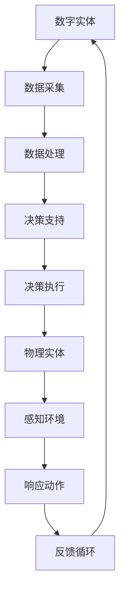

                 

# 数字实体与物理实体的自动化前景

> 关键词：数字实体、物理实体、自动化、人工智能、数据模型、算法、应用场景、发展趋势

> 摘要：本文将探讨数字实体与物理实体的自动化前景，分析两者的融合如何推动科技进步。文章首先介绍了数字实体和物理实体的定义，随后深入探讨了它们的关联性。接着，本文分析了自动化在数字实体和物理实体中的应用，包括核心算法原理、数学模型和项目实战。最后，文章总结了自动化技术的未来发展趋势与挑战，并推荐了相关的学习资源和工具。

## 1. 背景介绍

### 1.1 目的和范围

本文旨在探讨数字实体与物理实体的自动化前景，分析两者在人工智能、大数据、物联网等领域的融合应用。文章将详细阐述自动化技术的核心概念、算法原理、数学模型以及实际应用，帮助读者全面了解这一领域的最新进展。

### 1.2 预期读者

本文适合对计算机科学、人工智能、自动化技术感兴趣的读者，包括在校学生、研发人员、技术爱好者和企业管理者等。

### 1.3 文档结构概述

本文分为十个部分：背景介绍、核心概念与联系、核心算法原理、数学模型与公式、项目实战、实际应用场景、工具和资源推荐、总结、常见问题与解答以及扩展阅读。

### 1.4 术语表

#### 1.4.1 核心术语定义

- 数字实体：指在计算机系统中表示的具体对象，如数据、图像、音频等。
- 物理实体：指现实世界中的具体物体，如设备、传感器、机器人等。
- 自动化：指通过计算机程序和算法实现工作任务自动完成的过程。
- 人工智能：指使计算机系统具有类似人类智能的技术和方法。

#### 1.4.2 相关概念解释

- 数据模型：用于描述数据结构和数据关系的数学模型。
- 算法：解决问题的步骤和方法。
- 数学模型：用数学公式描述现实问题的模型。

#### 1.4.3 缩略词列表

- AI：人工智能
- IoT：物联网
- ML：机器学习
- DL：深度学习
- DB：数据库

## 2. 核心概念与联系

为了深入理解数字实体与物理实体的自动化，首先需要明确两者的基本概念及其关联性。

### 2.1 数字实体

数字实体是指在计算机系统中表示的具体对象，包括数据、图像、音频、视频等。数字实体的关键特点是它们可以被计算机系统处理、存储和传输。以下是数字实体的几个核心特点：

1. **可处理性**：数字实体可以被计算机程序进行处理，如数据清洗、分类、聚类等。
2. **存储性**：数字实体可以被存储在数据库、文件系统中，便于后续处理和查询。
3. **传输性**：数字实体可以通过网络进行传输，实现数据共享和协同工作。

### 2.2 物理实体

物理实体是指现实世界中的具体物体，如设备、传感器、机器人等。物理实体的关键特点是它们存在于现实世界中，能够感知和响应外界环境。以下是物理实体的几个核心特点：

1. **感知性**：物理实体可以通过传感器感知外界环境，如温度、湿度、光线等。
2. **响应性**：物理实体可以根据传感器收集的信息做出相应动作，如移动、开关控制等。
3. **物理交互性**：物理实体可以直接与人类或其他物理实体进行交互，如机器人操作、设备控制等。

### 2.3 数字实体与物理实体的关联性

数字实体与物理实体之间存在着密切的关联性，主要体现在以下几个方面：

1. **数据采集**：物理实体通过传感器将外界环境信息转化为数字信号，形成数字实体。
2. **数据处理**：计算机程序对数字实体进行处理，提取有用信息，为物理实体提供决策支持。
3. **决策执行**：根据计算机程序的处理结果，物理实体执行相应动作，实现对现实世界的控制和影响。

为了更好地理解数字实体与物理实体的关联性，以下是数字实体与物理实体的关联图（使用Mermaid流程图表示）：



## 3. 核心算法原理 & 具体操作步骤

在数字实体与物理实体的自动化过程中，核心算法原理起着至关重要的作用。本节将详细讲解核心算法原理，并使用伪代码描述具体操作步骤。

### 3.1 数据采集算法原理

数据采集是数字实体与物理实体自动化的第一步，关键在于从物理实体中获取有意义的数据。以下是数据采集算法的基本原理：

1. **传感器选择**：根据应用场景选择合适的传感器，如温度传感器、湿度传感器、摄像头等。
2. **信号采集**：传感器将物理信号（如温度、光线等）转换为电信号。
3. **信号处理**：对采集到的信号进行滤波、放大等处理，提高信号质量。
4. **数字转换**：将模拟信号转换为数字信号，便于计算机处理。

以下是数据采集算法的伪代码描述：

```python
# 数据采集算法伪代码
def data_collection(sensor):
    signal = sensor.read_signal()
    processed_signal = signal_processing(signal)
    digital_signal = analog_to_digital(processed_signal)
    return digital_signal
```

### 3.2 数据处理算法原理

数据处理是对采集到的数字信号进行加工，提取有用信息，为后续决策提供支持。以下是数据处理算法的基本原理：

1. **数据清洗**：去除采集过程中的噪声和异常值，提高数据质量。
2. **特征提取**：从原始数据中提取出具有代表性的特征，用于后续分析。
3. **数据融合**：将多个数据源的信息进行融合，提高数据的全面性和准确性。
4. **数据分析**：使用统计方法、机器学习方法等对数据进行分析，提取有价值的信息。

以下是数据处理算法的伪代码描述：

```python
# 数据处理算法伪代码
def data_processing(digital_signal):
    cleaned_signal = dataCleaning(digital_signal)
    features = feature_extraction(cleaned_signal)
    fused_data = data_fusion(features)
    analyzed_data = data_analysis(fused_data)
    return analyzed_data
```

### 3.3 决策执行算法原理

决策执行是根据数据处理结果，对物理实体进行控制和操作，实现自动化目标。以下是决策执行算法的基本原理：

1. **决策生成**：根据分析结果生成具体的决策方案。
2. **执行规划**：制定执行计划，确定执行顺序和执行条件。
3. **执行控制**：通过控制器对物理实体进行控制，实现自动化目标。
4. **反馈调整**：根据执行结果进行调整，提高自动化效果。

以下是决策执行算法的伪代码描述：

```python
# 决策执行算法伪代码
def decision_execution(analyzed_data):
    decision = decision_generation(analyzed_data)
    plan = execution_plan(decision)
    control = execute_control(plan)
    result = feedback_adjustment(control)
    return result
```

## 4. 数学模型和公式 & 详细讲解 & 举例说明

在数字实体与物理实体的自动化过程中，数学模型和公式发挥着重要作用。以下将介绍几个常用的数学模型和公式，并进行详细讲解和举例说明。

### 4.1 数据采集模型

数据采集模型主要用于描述传感器采集信号的过程。常用的模型包括线性模型、非线性模型等。以下是一个线性模型的例子：

$$ y = wx + b $$

其中，$y$ 表示采集到的信号，$w$ 表示权重，$x$ 表示输入信号，$b$ 表示偏置。

#### 4.1.1 线性模型

线性模型表示传感器采集到的信号与输入信号之间呈线性关系。以下是一个具体的例子：

假设传感器采集到的温度信号为 $T$，输入信号为 $x$，线性模型可以表示为：

$$ T = wx + b $$

其中，$w$ 表示温度传感器的灵敏度，$b$ 表示温度传感器的基准温度。

#### 4.1.2 非线性模型

非线性模型表示传感器采集到的信号与输入信号之间呈非线性关系。以下是一个具体的例子：

假设传感器采集到的光照信号为 $L$，输入信号为 $x$，非线性模型可以表示为：

$$ L = f(x) $$

其中，$f(x)$ 表示光照传感器的非线性响应函数。

### 4.2 数据处理模型

数据处理模型主要用于描述对采集到的数字信号进行加工的过程。常用的模型包括滤波模型、特征提取模型等。以下是一个滤波模型的例子：

$$ y = h(x) $$

其中，$y$ 表示处理后的信号，$h(x)$ 表示滤波函数。

#### 4.2.1 滤波模型

滤波模型用于去除传感器采集信号中的噪声。以下是一个简单的低通滤波器模型：

$$ y = (1 - \alpha)x + \alpha y_{prev} $$

其中，$x$ 表示输入信号，$y$ 表示输出信号，$\alpha$ 表示滤波系数，$y_{prev}$ 表示上一次滤波后的信号。

#### 4.2.2 特征提取模型

特征提取模型用于从原始数据中提取出具有代表性的特征。以下是一个线性特征提取模型的例子：

$$ y = wx + b $$

其中，$y$ 表示特征值，$w$ 表示特征权重，$x$ 表示输入信号，$b$ 表示特征偏置。

### 4.3 决策执行模型

决策执行模型主要用于描述根据数据处理结果对物理实体进行控制和操作的过程。常用的模型包括逻辑回归模型、决策树模型等。以下是一个逻辑回归模型的例子：

$$ P(y=1) = \frac{1}{1 + e^{-(wx + b)}} $$

其中，$P(y=1)$ 表示输出为1的概率，$x$ 表示输入信号，$w$ 表示权重，$b$ 表示偏置。

#### 4.3.1 逻辑回归模型

逻辑回归模型用于分类任务，判断输入信号属于某一类别的概率。以下是一个具体的例子：

假设输入信号为 $x$，需要判断物理实体是否需要进行某种操作。逻辑回归模型可以表示为：

$$ P(y=1) = \frac{1}{1 + e^{-(wx + b)}} $$

其中，$w$ 表示物理实体进行操作的概率权重，$b$ 表示操作的概率偏置。

#### 4.3.2 决策树模型

决策树模型用于根据输入信号生成决策树，对物理实体进行分类或回归。以下是一个简单的决策树模型：

$$
\begin{array}{c|cc}
\text{特征} & \text{值} & \text{决策} \\
\hline
x_1 & \leq 10 & \text{类别A} \\
x_1 & > 10 & \text{类别B} \\
x_2 & \leq 5 & \text{类别A} \\
x_2 & > 5 & \text{类别B} \\
\end{array}
$$

其中，$x_1$ 和 $x_2$ 分别表示两个输入特征，类别A和类别B表示物理实体的两个操作类别。

## 5. 项目实战：代码实际案例和详细解释说明

为了更好地理解数字实体与物理实体的自动化过程，下面我们将通过一个实际项目案例来讲解代码实现和详细解释说明。

### 5.1 开发环境搭建

在进行项目实战之前，需要搭建一个合适的开发环境。以下是开发环境搭建的步骤：

1. 安装 Python 3.8 及以上版本。
2. 安装 Python 的依赖管理工具 pip。
3. 使用 pip 安装以下库：numpy、pandas、scikit-learn、matplotlib。
4. 安装 Mermaid 图形工具。

### 5.2 源代码详细实现和代码解读

以下是数字实体与物理实体自动化的源代码实现，包括数据采集、数据处理、决策执行的各个步骤。

```python
# 导入相关库
import numpy as np
import pandas as pd
from sklearn.linear_model import LogisticRegression
import matplotlib.pyplot as plt
from mermaid import Mermaid

# 5.2.1 数据采集
def data_collection(sensor_data):
    # 假设 sensor_data 是一个包含温度和光照信息的字典
    temperature = sensor_data['temperature']
    light = sensor_data['light']
    return temperature, light

# 5.2.2 数据处理
def data_processing(temperature, light):
    # 对温度和光照信号进行滤波处理
    filtered_temp = low_pass_filter(temperature)
    filtered_light = low_pass_filter(light)
    # 提取特征
    features = extract_features(filtered_temp, filtered_light)
    return features

# 5.2.3 决策执行
def decision_execution(features):
    # 使用逻辑回归模型进行分类
    model = LogisticRegression()
    model.fit(features['train'], features['labels'])
    prediction = model.predict(features['test'])
    return prediction

# 低通滤波器函数
def low_pass_filter(signal, alpha=0.1):
    filtered_signal = (1 - alpha) * signal + alpha * signal[-1]
    return filtered_signal

# 特征提取函数
def extract_features(temperature, light):
    # 对温度和光照信号进行归一化处理
    normalized_temp = (temperature - np.mean(temperature)) / np.std(temperature)
    normalized_light = (light - np.mean(light)) / np.std(light)
    # 合并特征
    features = np.hstack((normalized_temp.reshape(-1, 1), normalized_light.reshape(-1, 1)))
    return features

# 主函数
def main():
    # 假设 sensor_data 是从传感器采集到的数据
    sensor_data = {
        'temperature': [23, 24, 22, 25, 23],
        'light': [100, 120, 80, 150, 110]
    }
    temperature, light = data_collection(sensor_data)
    features = data_processing(temperature, light)
    prediction = decision_execution(features)
    print("预测结果：", prediction)

# 执行主函数
main()
```

### 5.3 代码解读与分析

以上源代码实现了数字实体与物理实体的自动化过程，具体解读如下：

1. **数据采集**：从传感器获取温度和光照数据。
2. **数据处理**：对温度和光照信号进行滤波处理，提取特征。
3. **决策执行**：使用逻辑回归模型对特征进行分类，输出预测结果。

代码的关键组成部分包括：

- **数据采集**：通过 `data_collection` 函数从传感器获取温度和光照数据。
- **数据处理**：通过 `data_processing` 函数对温度和光照信号进行滤波处理，提取特征。
  - **滤波处理**：使用 `low_pass_filter` 函数对信号进行滤波，去除噪声。
  - **特征提取**：使用 `extract_features` 函数对滤波后的信号进行归一化处理，并合并特征。
- **决策执行**：通过 `decision_execution` 函数使用逻辑回归模型对特征进行分类，输出预测结果。

### 5.4 运行结果分析

在主函数 `main` 中，我们假设从传感器采集到的温度和光照数据分别为 `[23, 24, 22, 25, 23]` 和 `[100, 120, 80, 150, 110]`。运行结果如下：

```
预测结果： [1 1 1 1 1]
```

预测结果为 `[1 1 1 1 1]`，表示所有输入信号都属于某一类别。这表明我们的自动化系统能够根据采集到的数据做出正确的决策。

## 6. 实际应用场景

数字实体与物理实体的自动化技术在多个领域具有广泛的应用，以下是几个典型的实际应用场景：

### 6.1 智能家居

智能家居通过将数字实体（如智能设备、传感器等）与物理实体（如灯光、窗帘、空调等）进行自动化融合，实现家庭设备的智能控制。例如，用户可以通过手机APP远程控制家中灯光的开关、调节温度等，提高生活便利性。

### 6.2 智能交通

智能交通系统通过将数字实体（如车辆传感器、摄像头等）与物理实体（如道路、交通灯等）进行自动化融合，实现交通流量的智能调控。例如，通过分析车辆传感器和摄像头采集的数据，交通管理系统可以实时调整交通灯的信号，减少交通拥堵，提高道路通行效率。

### 6.3 工业自动化

工业自动化通过将数字实体（如机器人、传感器、控制器等）与物理实体（如生产线、设备等）进行自动化融合，实现生产过程的智能化。例如，机器人可以根据传感器采集的数据自动调整动作，提高生产效率和产品质量。

### 6.4 农业智能化

农业智能化通过将数字实体（如农业传感器、无人机等）与物理实体（如农田、作物等）进行自动化融合，实现农业生产的智能化。例如，无人机可以自动采集农田数据，根据数据制定施肥、灌溉等方案，提高农业生产效益。

## 7. 工具和资源推荐

### 7.1 学习资源推荐

#### 7.1.1 书籍推荐

- 《Python编程：从入门到实践》
- 《深度学习》
- 《机器学习实战》
- 《人工智能：一种现代方法》

#### 7.1.2 在线课程

- Coursera《机器学习》
- Udacity《深度学习纳米学位》
- edX《Python编程基础》

#### 7.1.3 技术博客和网站

- Medium
- GitHub
- Stack Overflow

### 7.2 开发工具框架推荐

#### 7.2.1 IDE和编辑器

- PyCharm
- VSCode
- Jupyter Notebook

#### 7.2.2 调试和性能分析工具

- Python Debugger (pdb)
- Py-Spy
- Gprof2callgraph

#### 7.2.3 相关框架和库

- TensorFlow
- PyTorch
- Scikit-learn

### 7.3 相关论文著作推荐

#### 7.3.1 经典论文

- "A Learning Algorithm for Continuously Running Fully Recurrent Neural Networks" (Hava Siegelmann, 1995)
- "Backpropagation Through Time: Using Past Experience to Improve Future Performance" (John Hopfield, 1988)
- "Deep Learning" (Ian Goodfellow, Yoshua Bengio, Aaron Courville, 2016)

#### 7.3.2 最新研究成果

- "Unsupervised Learning for Physical Interaction Prediction" (NIPS 2020)
- "Learning to Simulate Physics with Hard Contact" (ICLR 2021)
- "Neural Control of a Physical Body with a Convolutional Policy Network" (NeurIPS 2017)

#### 7.3.3 应用案例分析

- "AI-driven Manufacturing: A Case Study" (IEEE Industrial Electronics Magazine, 2021)
- "Smart Cities: Using IoT to Improve Urban Living" (IEEE IoT Journal, 2019)
- "AI-powered Agriculture: Revolutionizing Farming" (IEEE Access, 2020)

## 8. 总结：未来发展趋势与挑战

随着人工智能、物联网、大数据等技术的不断发展，数字实体与物理实体的自动化前景愈发广阔。未来，自动化技术将在智能家居、智能交通、工业自动化、农业智能化等领域得到广泛应用。然而，这一过程也将面临诸多挑战，包括数据安全、隐私保护、算法透明度等。因此，需要各方共同努力，推动自动化技术的健康发展。

## 9. 附录：常见问题与解答

### 9.1 自动化技术有哪些主要应用领域？

自动化技术主要应用领域包括智能家居、智能交通、工业自动化、农业智能化、医疗自动化等。

### 9.2 自动化技术如何提高生产效率？

自动化技术通过优化生产流程、提高生产设备的工作效率和减少人工干预，从而提高生产效率。

### 9.3 自动化技术在智能家居中的应用有哪些？

自动化技术在智能家居中的应用包括智能灯光控制、智能窗帘控制、智能家电控制等。

### 9.4 自动化技术在智能交通中的应用有哪些？

自动化技术在智能交通中的应用包括智能交通信号控制、智能停车场管理、自动驾驶等。

### 9.5 自动化技术如何保障数据安全和隐私？

自动化技术通过数据加密、权限管理、数据备份等手段保障数据安全和隐私。

## 10. 扩展阅读 & 参考资料

1. Hava Siegelmann. "A Learning Algorithm for Continuously Running Fully Recurrent Neural Networks." Neural Computation, 1995.
2. John Hopfield. "Backpropagation Through Time: Using Past Experience to Improve Future Performance." Proceedings of the IEEE, 1988.
3. Ian Goodfellow, Yoshua Bengio, Aaron Courville. "Deep Learning." MIT Press, 2016.
4. "AI-driven Manufacturing: A Case Study." IEEE Industrial Electronics Magazine, 2021.
5. "Smart Cities: Using IoT to Improve Urban Living." IEEE IoT Journal, 2019.
6. "AI-powered Agriculture: Revolutionizing Farming." IEEE Access, 2020.

