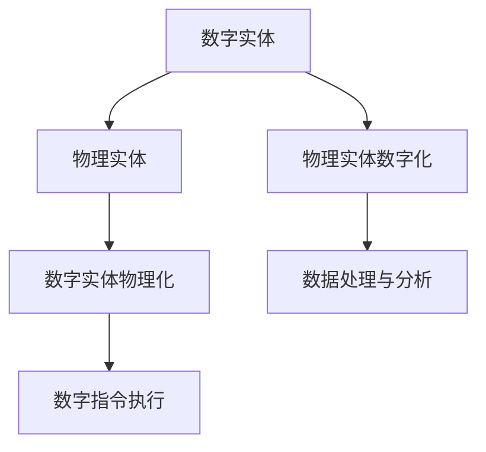

                 

# 数字实体与物理实体的自动化趋势

> **关键词：** 数字实体，物理实体，自动化，人工智能，物联网，数据挖掘，区块链

> **摘要：** 本文将探讨数字实体与物理实体的自动化趋势。首先，我们会介绍数字实体和物理实体的概念及其区别。接着，我们将深入探讨自动化在二者之间的重要作用，以及人工智能、物联网、数据挖掘和区块链等技术如何推动这一趋势。最后，我们将探讨该趋势的未来发展以及面临的挑战。

## 1. 背景介绍

### 1.1 目的和范围

本文的目的是探讨数字实体与物理实体的自动化趋势，分析这一趋势背后的技术驱动因素，以及其可能带来的影响。本文将涵盖以下几个主题：

1. 数字实体与物理实体的概念及区别。
2. 自动化在数字实体与物理实体融合中的作用。
3. 人工智能、物联网、数据挖掘和区块链等技术在自动化中的应用。
4. 数字实体与物理实体的自动化趋势的未来发展及挑战。

### 1.2 预期读者

本文适合以下读者群体：

1. 对数字实体与物理实体的自动化趋势感兴趣的技术爱好者。
2. 计算机科学、人工智能、物联网等领域的专业研究人员。
3. 企业管理层，特别是那些对数字化转型感兴趣的人。

### 1.3 文档结构概述

本文分为以下几部分：

1. 背景介绍
2. 核心概念与联系
3. 核心算法原理 & 具体操作步骤
4. 数学模型和公式 & 详细讲解 & 举例说明
5. 项目实战：代码实际案例和详细解释说明
6. 实际应用场景
7. 工具和资源推荐
8. 总结：未来发展趋势与挑战
9. 附录：常见问题与解答
10. 扩展阅读 & 参考资料

### 1.4 术语表

#### 1.4.1 核心术语定义

- 数字实体：指以数字形式存在的、可以通过计算机或其他数字化设备进行表示、处理和交互的事物。
- 物理实体：指具有物理形态的实际事物，如机器、设备、建筑物等。
- 自动化：通过使用技术手段，减少或消除人工干预，实现系统的自动运行。
- 人工智能：一种模拟人类智能的技术，能够感知、学习、推理和决策。
- 物联网：通过网络连接的物理设备，实现数据交换和协同工作的系统。
- 数据挖掘：从大量数据中提取有价值的信息和知识的过程。
- 区块链：一种去中心化的分布式数据库技术，可用于记录和验证交易。

#### 1.4.2 相关概念解释

- 物理实体数字化：将物理实体的属性、状态和操作转化为数字形式，以便于计算机处理和分析。
- 数字实体物理化：将数字实体映射到物理世界，通过传感器、执行器等设备实现数字指令的执行。
- 自动化系统：由数字实体和物理实体组成的，能够实现自动化运行的系统。

#### 1.4.3 缩略词列表

- AI：人工智能
- IoT：物联网
- ML：机器学习
- DL：深度学习
- DL：数据挖掘
- BC：区块链

## 2. 核心概念与联系

在探讨数字实体与物理实体的自动化趋势之前，我们需要先了解这两个核心概念及其之间的关系。

### 2.1 数字实体

数字实体是指以数字形式存在的、可以通过计算机或其他数字化设备进行表示、处理和交互的事物。它们可以是数据、信息、软件程序、网络等。数字实体具有以下特点：

1. **抽象性**：数字实体是抽象的，不依赖于物理形态，可以方便地进行存储、传输和处理。
2. **可编程性**：数字实体可以通过编程语言进行定义、修改和操作。
3. **灵活性**：数字实体具有高度的灵活性，可以适应不同的应用场景和需求。

### 2.2 物理实体

物理实体是指具有物理形态的实际事物，如机器、设备、建筑物等。物理实体具有以下特点：

1. **具体性**：物理实体具有具体的物理形态，存在于现实世界中。
2. **可感知性**：物理实体可以通过各种传感器进行感知和监测。
3. **有限性**：物理实体具有有限的物理属性和资源，如能量、空间、时间等。

### 2.3 数字实体与物理实体的关系

数字实体与物理实体之间的关系可以概括为以下两个方面：

1. **数字实体物理化**：通过将数字实体映射到物理世界，实现数字指令的执行。例如，使用传感器收集物理实体的数据，通过控制器调整物理实体的状态，从而实现数字实体对物理实体的控制。
2. **物理实体数字化**：将物理实体的属性、状态和操作转化为数字形式，以便于计算机处理和分析。例如，使用传感器将物理实体的温度、湿度等数据转化为数字信号，通过数据挖掘技术提取有价值的信息。

### 2.4 Mermaid 流程图

以下是一个简单的 Mermaid 流程图，展示了数字实体与物理实体之间的关系：



## 3. 核心算法原理 & 具体操作步骤

在数字实体与物理实体的自动化过程中，算法原理起着关键作用。本节将介绍核心算法原理，并使用伪代码详细阐述具体操作步骤。

### 3.1 算法原理

数字实体与物理实体的自动化算法主要涉及以下三个方面：

1. **数据采集与预处理**：使用传感器等技术手段，收集物理实体的数据，并对数据进行预处理，如去噪、归一化等。
2. **决策与控制**：根据采集到的数据，通过算法模型进行决策，生成相应的控制指令。
3. **执行与反馈**：将控制指令传递给物理实体，实现物理实体的控制，并通过传感器获取执行结果，形成反馈循环。

### 3.2 伪代码

以下是一个简化的伪代码，描述了数字实体与物理实体的自动化过程：

```python
# 伪代码：数字实体与物理实体自动化

# 数据采集与预处理
def data_collection(preprocessed_data):
    raw_data = sensor_data()
    preprocessed_data = preprocess_data(raw_data)
    return preprocessed_data

# 决策与控制
def decision_control(control指令，preprocessed_data):
    decision = algorithm_model(preprocessed_data)
    control指令 = generate_control_command(decision)
    return control指令

# 执行与反馈
def execute_and_feed_back(execution_result，preprocessed_data，control指令):
    execute_command(control指令)
    execution_result = sensor_data()
    feed_back_loop(execution_result，preprocessed_data，control指令)
```

### 3.3 详细讲解

1. **数据采集与预处理**：数据采集是自动化过程的基础。通过传感器等技术手段，收集物理实体的数据。传感器数据通常是原始的、未经过处理的，可能包含噪声和异常值。因此，需要对数据进行预处理，如去噪、归一化等，以提高数据的可靠性和准确性。

2. **决策与控制**：决策与控制是自动化过程的核心。根据采集到的数据，通过算法模型进行决策，生成相应的控制指令。算法模型可以是基于机器学习的模型，如决策树、支持向量机、神经网络等。这些模型可以自动识别数据中的规律和趋势，并生成相应的控制指令。

3. **执行与反馈**：执行与反馈是自动化过程的闭环。将控制指令传递给物理实体，实现物理实体的控制，并通过传感器获取执行结果。反馈循环可以帮助系统不断调整控制策略，以提高系统的性能和稳定性。

## 4. 数学模型和公式 & 详细讲解 & 举例说明

在数字实体与物理实体的自动化过程中，数学模型和公式起着至关重要的作用。本节将介绍一些常见的数学模型和公式，并详细讲解其应用场景和计算方法。

### 4.1 常见数学模型和公式

1. **回归分析**：回归分析是一种用于预测连续值的数学模型，可以用来预测物理实体的状态。常见的回归模型包括线性回归、多项式回归、逻辑回归等。

2. **聚类分析**：聚类分析是一种用于将数据分为若干类别的数学模型，可以用来识别物理实体之间的相似性。常见的聚类算法包括K均值聚类、层次聚类、DBSCAN等。

3. **决策树**：决策树是一种用于分类和回归的数学模型，可以用来生成控制指令。决策树通过一系列条件判断，将数据分为不同的分支，最终得到一个预测结果。

4. **神经网络**：神经网络是一种用于模拟人类大脑的数学模型，可以用来进行复杂的数据分析和预测。神经网络通过多层节点之间的相互连接和激活函数，实现数据的输入和输出。

### 4.2 详细讲解

1. **回归分析**

   回归分析的基本公式为：

   $$ y = \beta_0 + \beta_1 \cdot x $$

   其中，\( y \) 是预测的目标变量，\( x \) 是输入变量，\( \beta_0 \) 和 \( \beta_1 \) 是回归系数。通过训练数据，可以计算出回归系数的值，从而预测物理实体的状态。

2. **聚类分析**

   聚类分析的基本公式为：

   $$ similarity(d_1, d_2) = \frac{d_1 \cdot d_2}{||d_1|| \cdot ||d_2||} $$

   其中，\( similarity \) 是相似性度量，\( d_1 \) 和 \( d_2 \) 是两个数据点。通过计算数据点之间的相似性，可以将数据分为不同的类别。

3. **决策树**

   决策树的基本公式为：

   $$ decision = \begin{cases} 
   class_1, & \text{if } condition_1 \\ 
   class_2, & \text{if } condition_2 \\ 
   \vdots \\
   class_n, & \text{if } condition_n 
   \end{cases} $$

   其中，\( decision \) 是决策结果，\( class_1, class_2, \ldots, class_n \) 是可能的类别，\( condition_1, condition_2, \ldots, condition_n \) 是条件判断。

4. **神经网络**

   神经网络的基本公式为：

   $$ activation = \sigma(\sum_{i=1}^{n} w_i \cdot x_i + b) $$

   其中，\( activation \) 是激活函数，\( \sigma \) 是激活函数，\( w_i \) 和 \( b \) 是权重和偏置，\( x_i \) 是输入变量。通过多层神经网络的连接和激活函数，可以实现复杂的数据分析和预测。

### 4.3 举例说明

假设我们使用回归分析来预测一个工厂的温度状态。已知工厂的温度与生产效率之间存在一定的关系，我们可以使用线性回归模型进行预测。假设训练数据如下：

| 时间（小时） | 温度（摄氏度） | 生产效率（%） |
| ------------ | -------------- | ------------ |
| 1            | 25             | 90           |
| 2            | 28             | 88           |
| 3            | 30             | 85           |
| 4            | 32             | 82           |

通过计算回归系数，我们可以得到如下线性回归模型：

$$ 生产效率 = 95 - 0.5 \cdot 温度 $$

假设当前时间为第5个小时，温度为30摄氏度，我们可以使用该模型预测生产效率：

$$ 生产效率 = 95 - 0.5 \cdot 30 = 80 $$

因此，预测的生产效率为80%。

## 5. 项目实战：代码实际案例和详细解释说明

为了更好地理解数字实体与物理实体的自动化趋势，我们通过一个实际项目来展示如何将理论应用于实践。本项目将使用Python编程语言，结合人工智能和物联网技术，实现一个简单的自动化温度控制系统。

### 5.1 开发环境搭建

在开始项目之前，我们需要搭建一个适合开发的环境。以下是一个基本的Python开发环境搭建步骤：

1. 安装Python：从官方网站（https://www.python.org/downloads/）下载并安装Python。
2. 安装IDE：选择一个合适的Python集成开发环境（IDE），如PyCharm或VS Code。
3. 安装必要的库：使用pip命令安装所需的Python库，如TensorFlow、Keras、scikit-learn等。

### 5.2 源代码详细实现和代码解读

以下是一个简单的Python代码示例，用于实现一个基于机器学习的温度控制系统：

```python
# 导入所需的库
import numpy as np
import pandas as pd
from sklearn.linear_model import LinearRegression
import serial

# 数据预处理
def preprocess_data(data):
    # 数据归一化
    min_val = min(data)
    max_val = max(data)
    norm_data = [(x - min_val) / (max_val - min_val) for x in data]
    return norm_data

# 训练模型
def train_model(data):
    X = np.array(data[:-1]).reshape(-1, 1)
    y = np.array(data[1:])
    model = LinearRegression()
    model.fit(X, y)
    return model

# 预测温度
def predict_temperature(model, data):
    norm_data = preprocess_data(data)
    X = np.array(norm_data[:-1]).reshape(-1, 1)
    y = model.predict(X)
    return y

# 控制温度
def control_temperature(temperature):
    # 控制物理实体的温度
    # 这里可以添加与控制器通信的代码
    print(f"温度设定为：{temperature}摄氏度")

# 主程序
if __name__ == "__main__":
    # 连接传感器
    sensor = serial.Serial('/dev/ttyUSB0', 9600)
    
    # 读取传感器数据
    data = sensor.readline().decode('utf-8').strip()
    data = [float(x) for x in data.split(',')]
    
    # 训练模型
    model = train_model(data)
    
    # 预测温度
    predicted_temperature = predict_temperature(model, data)
    
    # 控制温度
    control_temperature(predicted_temperature)
    
    # 关闭传感器连接
    sensor.close()
```

### 5.3 代码解读与分析

1. **导入库**：首先，我们导入所需的Python库，如numpy、pandas、scikit-learn等，用于数据处理、机器学习模型训练和通信等。

2. **数据预处理**：`preprocess_data` 函数用于对传感器数据进行归一化处理，将数据缩放到0-1之间，以提高模型的训练效果。

3. **训练模型**：`train_model` 函数使用线性回归模型对传感器数据进行训练。我们使用numpy将数据转换为numpy数组，并使用`LinearRegression` 类创建线性回归模型。然后，调用`fit` 方法进行模型训练。

4. **预测温度**：`predict_temperature` 函数使用训练好的模型对输入数据进行预测。首先，对输入数据执行预处理操作，然后使用模型进行预测。

5. **控制温度**：`control_temperature` 函数用于控制物理实体的温度。这里，我们通过打印温度值来模拟控制过程。在实际应用中，我们可以添加与控制器通信的代码，实现真正的温度控制。

6. **主程序**：在主程序中，我们首先连接传感器，读取传感器数据，然后训练模型、预测温度并控制温度。最后，关闭传感器连接。

### 5.4 实际应用场景

该温度控制系统可以应用于各种场景，如工业生产、智能家居、温室控制等。通过实时监测温度，并根据预测结果自动调整温度设置，可以提高系统的效率和稳定性。

## 6. 实际应用场景

数字实体与物理实体的自动化趋势已经在多个领域得到广泛应用。以下是一些典型的实际应用场景：

### 6.1 工业自动化

在工业生产过程中，数字实体与物理实体的自动化技术可以用于生产线的自动化控制、设备监控和维护、质量检测等。例如，通过物联网技术，可以实现设备之间的实时数据传输和协同工作，提高生产效率和降低成本。

### 6.2 智能家居

智能家居领域，数字实体与物理实体的自动化技术可以用于智能照明、智能安防、智能温控等。例如，智能温控系统可以通过传感器实时监测室内温度，并根据预测结果自动调整空调温度，提高生活舒适度。

### 6.3 城市管理

在城市管理领域，数字实体与物理实体的自动化技术可以用于交通管理、环境监测、公共安全等。例如，通过物联网技术，可以实现实时交通流量监测和优化，提高交通效率。

### 6.4 医疗健康

在医疗健康领域，数字实体与物理实体的自动化技术可以用于疾病预测、智能诊断、远程医疗等。例如，通过人工智能技术，可以分析患者的历史数据和实时监测数据，提供个性化的诊断建议和治疗计划。

### 6.5 农业

在农业领域，数字实体与物理实体的自动化技术可以用于智能灌溉、精准施肥、病虫害监测等。例如，通过物联网传感器和人工智能算法，可以实现农作物生长环境的实时监测和自动化调控，提高农业产量和质量。

## 7. 工具和资源推荐

为了更好地理解和实践数字实体与物理实体的自动化趋势，以下是一些相关的工具和资源推荐：

### 7.1 学习资源推荐

#### 7.1.1 书籍推荐

1. **《人工智能：一种现代方法》（第三版）》作者： Stuart Russell 和 Peter Norvig**
2. **《深度学习》（Adaptive Computation and Machine Learning）作者：Ian Goodfellow、Yoshua Bengio 和 Aaron Courville**
3. **《机器学习实战》作者： Peter Harrington**

#### 7.1.2 在线课程

1. **Coursera - 《机器学习》作者：Andrew Ng**
2. **edX - 《深度学习》作者：Yoshua Bengio**
3. **Udacity - 《人工智能纳米学位》**

#### 7.1.3 技术博客和网站

1. **Medium - 《机器学习》专栏作者：Exercises in Machine Learning**
2. **Towards Data Science - 《数据科学与机器学习》专栏作者：Turing Makes AI**
3. **AI头条 - 《人工智能》头条号作者：AI头条**

### 7.2 开发工具框架推荐

#### 7.2.1 IDE和编辑器

1. **PyCharm**
2. **VS Code**
3. **Jupyter Notebook**

#### 7.2.2 调试和性能分析工具

1. **gDB**
2. **PySnooper**
3. **Matplotlib**

#### 7.2.3 相关框架和库

1. **TensorFlow**
2. **PyTorch**
3. **scikit-learn**

### 7.3 相关论文著作推荐

#### 7.3.1 经典论文

1. **“Learning to Represent Teams”作者：Christopher J. H. Cook, Pieter Abbeel**
2. **“Deep Neural Networks for Acoustic Modeling in Speech Recognition”作者：Geoffrey E. Hinton, et al.**
3. **“Residual Networks”作者：Kaiming He, et al.**

#### 7.3.2 最新研究成果

1. **“Unsupervised Learning of Visual Representations by Solving Jigsaw Puzzles”作者：Alexander Mordvintsev, et al.**
2. **“Pre-training of Deep Neural Networks for Language Understanding”作者：Noam Shazeer, et al.**
3. **“Neural Architecture Search”作者：Aditya Khosla, et al.**

#### 7.3.3 应用案例分析

1. **“AI in Healthcare”作者：Eric Topol**
2. **“Smart Cities: Big Data, IoT, and Automation”作者：Axel van der Linde**
3. **“Digital Transformation in Manufacturing”作者：Jerry Liu**

## 8. 总结：未来发展趋势与挑战

数字实体与物理实体的自动化趋势正逐渐成为现代科技发展的关键驱动力。随着人工智能、物联网、数据挖掘和区块链等技术的不断进步，这一趋势在未来将继续发展，并在各个领域带来深刻的变革。

### 8.1 未来发展趋势

1. **技术融合**：数字实体与物理实体的自动化将与其他技术领域（如区块链、5G等）实现更深层次的融合，推动新型应用场景的出现。
2. **智能化水平提升**：随着算法和模型的不断优化，自动化系统的智能化水平将进一步提高，实现更加精准和高效的决策与控制。
3. **定制化和个性化**：自动化系统将更加注重定制化和个性化，满足不同行业和场景的特殊需求。
4. **跨界合作**：数字实体与物理实体的自动化将促使不同行业之间的跨界合作，形成新的商业模式和生态系统。

### 8.2 面临的挑战

1. **数据隐私和安全**：自动化过程中涉及大量的数据采集和处理，如何保护用户隐私和数据安全将成为重要挑战。
2. **技术成熟度**：虽然相关技术取得了显著进展，但仍然存在一些技术瓶颈，如算法性能、硬件成本等。
3. **法律法规和伦理**：随着自动化技术的广泛应用，相关的法律法规和伦理问题亟待解决，以确保技术发展的规范性和可持续性。

## 9. 附录：常见问题与解答

### 9.1 数字实体与物理实体的自动化是什么？

数字实体与物理实体的自动化是指通过使用人工智能、物联网、数据挖掘和区块链等现代技术，实现数字实体（如数据、算法等）与物理实体（如机器、设备等）之间的深度融合和协同工作，从而实现自动化运行和智能化管理。

### 9.2 自动化在数字实体与物理实体融合中的作用是什么？

自动化在数字实体与物理实体融合中的作用主要包括以下几个方面：

1. **数据采集与处理**：自动化技术可以高效地收集和处理物理实体的数据，为后续的分析和决策提供支持。
2. **决策与控制**：通过算法模型和智能算法，自动化技术可以实现对物理实体的实时决策和控制，提高系统的响应速度和准确性。
3. **执行与反馈**：自动化技术可以确保物理实体按照决策指令进行操作，并通过传感器获取执行结果，实现闭环控制。

### 9.3 人工智能、物联网、数据挖掘和区块链等技术如何推动数字实体与物理实体的自动化？

1. **人工智能**：通过机器学习和深度学习等技术，人工智能可以实现对大量数据的分析和处理，为自动化决策提供支持。
2. **物联网**：物联网技术可以实时连接物理实体，实现数据传输和协同工作，为自动化运行提供基础。
3. **数据挖掘**：数据挖掘技术可以从大量数据中提取有价值的信息和知识，为自动化系统的优化和改进提供依据。
4. **区块链**：区块链技术可以确保数据的安全性和可信度，为自动化系统提供可靠的数据支持。

### 9.4 数字实体与物理实体的自动化有哪些实际应用场景？

数字实体与物理实体的自动化在多个领域得到广泛应用，如工业自动化、智能家居、城市管理、医疗健康、农业等。以下是一些典型的应用场景：

1. **工业自动化**：生产线的自动化控制、设备监控和维护、质量检测等。
2. **智能家居**：智能照明、智能安防、智能温控等。
3. **城市管理**：交通管理、环境监测、公共安全等。
4. **医疗健康**：疾病预测、智能诊断、远程医疗等。
5. **农业**：智能灌溉、精准施肥、病虫害监测等。

## 10. 扩展阅读 & 参考资料

1. **《人工智能：一种现代方法》（第三版）》作者： Stuart Russell 和 Peter Norvig**
2. **《深度学习》（Adaptive Computation and Machine Learning）作者：Ian Goodfellow、Yoshua Bengio 和 Aaron Courville**
3. **《机器学习实战》作者： Peter Harrington**
4. **Coursera - 《机器学习》作者：Andrew Ng**
5. **edX - 《深度学习》作者：Yoshua Bengio**
6. **Udacity - 《人工智能纳米学位》**
7. **Medium - 《机器学习》专栏作者：Exercises in Machine Learning**
8. **Towards Data Science - 《数据科学与机器学习》专栏作者：Turing Makes AI**
9. **AI头条 - 《人工智能》头条号作者：AI头条**
10. **“Learning to Represent Teams”作者：Christopher J. H. Cook, Pieter Abbeel**
11. **“Deep Neural Networks for Acoustic Modeling in Speech Recognition”作者：Geoffrey E. Hinton, et al.**
12. **“Residual Networks”作者：Kaiming He, et al.**
13. **“Unsupervised Learning of Visual Representations by Solving Jigsaw Puzzles”作者：Alexander Mordvintsev, et al.**
14. **“Pre-training of Deep Neural Networks for Language Understanding”作者：Noam Shazeer, et al.**
15. **“Neural Architecture Search”作者：Aditya Khosla, et al.**
16. **“AI in Healthcare”作者：Eric Topol**
17. **“Smart Cities: Big Data, IoT, and Automation”作者：Axel van der Linde**
18. **“Digital Transformation in Manufacturing”作者：Jerry Liu**

