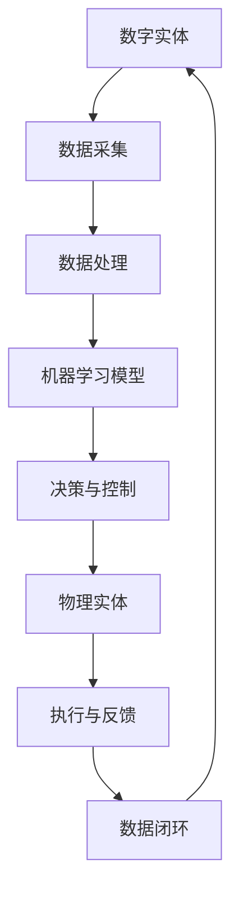

                 


# 数字实体和物理实体自动化刚开始

> 关键词：数字实体、物理实体、自动化、机器学习、人工智能、物联网、系统架构

> 摘要：随着数字化和智能化的深入发展，数字实体和物理实体的融合成为新时代的重要课题。本文从背景出发，介绍了数字实体和物理实体自动化的目的和范围，分析了核心概念及其相互关系，探讨了核心算法原理和数学模型，通过实际项目案例和工具推荐，详细解析了自动化过程的实现。最后，本文总结了未来发展趋势与挑战，并提供了扩展阅读与参考资料。

## 1. 背景介绍

### 1.1 目的和范围

数字实体和物理实体的自动化是当前技术领域的重要研究方向，旨在通过智能化的手段，将数字信息与物理世界紧密结合，实现更高效率、更低成本、更安全可靠的运营和管理。本文旨在探讨这一领域的现状、趋势及未来发展，为相关研究和应用提供参考。

本文的主要内容包括：

1. 数字实体和物理实体的基本概念及其相互关系。
2. 核心算法原理和数学模型。
3. 自动化实现过程中的关键技术。
4. 实际应用场景与项目案例。
5. 工具和资源的推荐。
6. 未来发展趋势与挑战。

### 1.2 预期读者

本文面向具有一定计算机基础和数学知识的技术人员，包括但不限于：

1. 人工智能和机器学习研究者。
2. 物联网和系统架构设计师。
3. 数据科学家和算法工程师。
4. 对数字化与自动化感兴趣的技术爱好者。

### 1.3 文档结构概述

本文结构如下：

1. 引言：介绍数字实体和物理实体的基本概念。
2. 核心概念与联系：详细阐述相关概念及其关系。
3. 核心算法原理 & 具体操作步骤：分析核心算法，提供伪代码实现。
4. 数学模型和公式 & 详细讲解 & 举例说明：解释数学模型及其应用。
5. 项目实战：代码实际案例和详细解释说明。
6. 实际应用场景：探讨自动化在各个领域的应用。
7. 工具和资源推荐：推荐相关学习资源和开发工具。
8. 总结：未来发展趋势与挑战。
9. 附录：常见问题与解答。
10. 扩展阅读 & 参考资料：提供进一步学习和研究的资料。

### 1.4 术语表

#### 1.4.1 核心术语定义

- 数字实体：指通过计算机技术表示的、具有特定功能和信息的抽象对象。
- 物理实体：指现实世界中具有物理形态和物质特性的对象。
- 自动化：通过计算机技术和智能算法，实现数字实体与物理实体之间的高效协同和自动控制。
- 机器学习：一种通过数据训练模型，使其具备自主学习和决策能力的技术。
- 物联网：通过互联网连接各种物理设备和系统，实现信息交换和协同工作。

#### 1.4.2 相关概念解释

- 数字孪生：将物理实体的属性和行为数字化，创建其数字镜像，实现虚拟与现实的同步。
- 边缘计算：在物理实体附近进行数据处理和计算，减少网络传输延迟，提高响应速度。
- 大数据分析：通过对海量数据的挖掘和分析，发现有价值的信息和模式。

#### 1.4.3 缩略词列表

- AI：人工智能
- ML：机器学习
- IoT：物联网
- FaaS：函数即服务
- DB：数据库
- API：应用程序接口

## 2. 核心概念与联系

为了更好地理解数字实体和物理实体的自动化，我们需要明确以下几个核心概念：

1. **数字实体**：数字实体是计算机系统中的数据表示，可以是简单的数据结构，如数组、列表，也可以是复杂的数据模型，如对象、图等。它们通常用于存储、传输和处理信息。
2. **物理实体**：物理实体是现实世界中具有物理形态和物质特性的对象，如机器、设备、建筑物等。它们可以通过传感器、执行器等与数字实体进行交互。
3. **自动化**：自动化是通过计算机技术和智能算法，实现数字实体与物理实体之间的高效协同和自动控制。这通常涉及到数据采集、处理、决策和执行等多个环节。
4. **机器学习**：机器学习是使计算机具备自主学习和决策能力的技术。它通过从数据中学习规律，进而对未知数据进行预测或分类。
5. **物联网**：物联网是通过互联网连接各种物理设备和系统，实现信息交换和协同工作。它可以实现对物理实体的实时监控、管理和优化。

### Mermaid 流程图

以下是数字实体和物理实体自动化的 Mermaid 流程图：



### 核心概念之间的联系

1. **数据采集**：数字实体通过传感器等设备从物理实体中采集数据。
2. **数据处理**：数字实体对采集到的数据进行分析和处理，提取有用信息。
3. **机器学习模型**：数字实体利用处理后的数据训练机器学习模型，使其具备对物理实体进行预测和决策的能力。
4. **决策与控制**：数字实体根据机器学习模型的结果，对物理实体进行控制，实现自动化操作。
5. **执行与反馈**：物理实体执行数字实体的控制指令，并将执行结果反馈给数字实体。
6. **数据闭环**：数字实体将反馈数据用于进一步优化机器学习模型，实现闭环控制。

## 3. 核心算法原理 & 具体操作步骤

在数字实体和物理实体的自动化过程中，核心算法起着至关重要的作用。以下将详细阐述核心算法的原理和具体操作步骤。

### 3.1 数据采集

数据采集是自动化的第一步，也是至关重要的一步。其核心算法是传感器数据采集算法，主要任务是实时采集物理实体的各种状态信息，如温度、湿度、速度、位置等。

#### 伪代码实现：

```python
def data_collection(physical_entity):
    sensors = physical_entity.get_sensors()
    data = {}
    for sensor in sensors:
        data[sensor.name] = sensor.read_value()
    return data
```

### 3.2 数据处理

数据处理是对采集到的原始数据进行清洗、转换和分析的过程。其核心算法包括数据预处理、特征提取和数据分析等。

#### 伪代码实现：

```python
def data_processing(data):
    cleaned_data = preprocess_data(data)
    features = extract_features(cleaned_data)
    analyzed_data = analyze_data(features)
    return analyzed_data
```

### 3.3 机器学习模型

机器学习模型是基于处理后的数据，通过训练建立预测模型，用于对物理实体进行控制和决策。其核心算法包括监督学习、无监督学习和强化学习等。

#### 伪代码实现：

```python
def train_model(data, model_type):
    if model_type == 'supervised':
        model = train_supervised_model(data)
    elif model_type == 'unsupervised':
        model = train_unsupervised_model(data)
    elif model_type == 'reinforcement':
        model = train_reinforcement_model(data)
    return model
```

### 3.4 决策与控制

决策与控制是基于训练好的模型，对物理实体进行预测和决策，并发出控制指令。其核心算法包括预测算法和控制算法。

#### 伪代码实现：

```python
def make_decision(model, current_state):
    predicted_state = model.predict(current_state)
    action = control_algorithm(predicted_state)
    return action

def control_physical_entity(physical_entity, action):
    physical_entity.perform_action(action)
```

### 3.5 执行与反馈

执行与反馈是物理实体根据控制指令执行操作，并将执行结果反馈给数字实体的过程。其核心算法包括执行算法和反馈算法。

#### 伪代码实现：

```python
def execute_action(physical_entity, action):
    result = physical_entity.execute_action(action)
    return result

def feedback(physical_entity, result):
    feedback_data = physical_entity.get_feedback(result)
    return feedback_data
```

### 3.6 数据闭环

数据闭环是基于反馈数据，对机器学习模型进行优化和调整，实现闭环控制的过程。其核心算法包括模型优化算法和闭环控制算法。

#### 伪代码实现：

```python
def optimize_model(model, feedback_data):
    updated_model = model.optimize(feedback_data)
    return updated_model

def close_loop(updated_model):
    model = updated_model
    control_physical_entity(physical_entity, model.predict(current_state))
```

通过以上核心算法的原理和具体操作步骤，我们可以实现对数字实体和物理实体的自动化控制。在实际应用中，这些算法可以根据具体场景和需求进行优化和调整。

## 4. 数学模型和公式 & 详细讲解 & 举例说明

在数字实体和物理实体的自动化过程中，数学模型起着至关重要的作用。以下将详细讲解几个核心数学模型及其应用。

### 4.1 最优化模型

最优化模型用于在给定约束条件下，寻找目标函数的最大值或最小值。常见的最优化模型有线性规划、非线性规划和动态规划等。

#### 4.1.1 线性规划

线性规划的目标是最大化或最小化线性目标函数，满足线性约束条件。

$$
\begin{align*}
\min\limits_{x} \quad c^T x \\
s.t. \quad Ax \leq b \\
x \geq 0
\end{align*}
$$

其中，$c$ 为系数向量，$x$ 为变量向量，$A$ 为系数矩阵，$b$ 为常数向量。

#### 4.1.2 非线性规划

非线性规划的目标是最大化或最小化非线性目标函数，满足非线性约束条件。

$$
\begin{align*}
\min\limits_{x} \quad f(x) \\
s.t. \quad g(x) \leq 0 \\
h(x) = 0
\end{align*}
$$

其中，$f(x)$ 为目标函数，$g(x)$ 和 $h(x)$ 分别为不等式约束和等式约束。

#### 4.1.3 动态规划

动态规划是一种求解多阶段决策过程最优解的方法，适用于具有递推关系的优化问题。

$$
\begin{align*}
V(x_t) &= \min\limits_{a_t} \{ R(a_t, x_t) + \gamma V(x_{t+1}) \} \\
x_{t+1} &= f(a_t, x_t)
\end{align*}
$$

其中，$V(x_t)$ 为状态价值函数，$a_t$ 为决策变量，$R(a_t, x_t)$ 为即时回报函数，$\gamma$ 为折扣因子。

### 4.2 机器学习模型

机器学习模型用于对物理实体进行预测和决策，常见的机器学习模型有线性回归、决策树、支持向量机和神经网络等。

#### 4.2.1 线性回归

线性回归是一种基于线性关系的预测模型，用于预测连续值。

$$
y = \beta_0 + \beta_1 x
$$

其中，$y$ 为目标变量，$x$ 为特征变量，$\beta_0$ 和 $\beta_1$ 为模型参数。

#### 4.2.2 决策树

决策树是一种基于特征划分的预测模型，用于预测离散值。

$$
\begin{align*}
&\text{if } x \text{ is } \text{feature}_i \text{ then } \\
&\qquad \text{goto } \text{node}_{i_1} \\
&\text{if } x \text{ is } \text{feature}_j \text{ then } \\
&\qquad \text{goto } \text{node}_{j_1} \\
&\text{else } \text{goto } \text{leaf}
\end{align*}
$$

其中，$x$ 为特征变量，$\text{feature}_i$ 和 $\text{feature}_j$ 为特征值，$\text{node}_{i_1}$ 和 $\text{node}_{j_1}$ 为子节点，$\text{leaf}$ 为叶子节点。

#### 4.2.3 支持向量机

支持向量机是一种基于最大间隔划分的预测模型，用于预测离散值。

$$
\begin{align*}
\min\limits_{w, b} \quad \frac{1}{2} \| w \|^2 \\
s.t. \quad y^{(i)} (w^T x^{(i)} + b) \geq 1
\end{align*}
$$

其中，$w$ 为权重向量，$b$ 为偏置项，$x^{(i)}$ 为训练样本，$y^{(i)}$ 为标签。

#### 4.2.4 神经网络

神经网络是一种基于多层非线性变换的预测模型，用于预测连续值和离散值。

$$
\begin{align*}
z^{(l)} &= \sigma(z^{(l-1)} \cdot W^{(l)}) + b^{(l)} \\
a^{(l)} &= \sigma(z^{(l)})
\end{align*}
$$

其中，$z^{(l)}$ 为第 $l$ 层的输入，$a^{(l)}$ 为第 $l$ 层的输出，$\sigma$ 为激活函数，$W^{(l)}$ 和 $b^{(l)}$ 为权重和偏置。

### 4.3 控制理论模型

控制理论模型用于实现对物理实体的自动控制，常见的控制理论模型有PID控制和模糊控制等。

#### 4.3.1 PID控制

PID控制是一种基于比例、积分和微分控制的自动调节方法。

$$
\begin{align*}
u(t) &= K_p e(t) + K_i \int_{0}^{t} e(\tau) d\tau + K_d \frac{de(t)}{dt} \\
e(t) &= r(t) - y(t)
\end{align*}
$$

其中，$u(t)$ 为控制输出，$e(t)$ 为误差，$r(t)$ 为参考输入，$y(t)$ 为系统输出，$K_p$、$K_i$ 和 $K_d$ 分别为比例、积分和微分系数。

#### 4.3.2 模糊控制

模糊控制是一种基于模糊逻辑的自动控制方法，用于处理非线性、不确定和模糊性的系统。

$$
\begin{align*}
u &= A \odot R \\
A &= \mu(A, x) \odot \mu(A, y) \\
R &= \mu(R, e) \odot \mu(R, ec)
\end{align*}
$$

其中，$u$ 为控制输出，$A$ 为模糊规则库，$R$ 为模糊关系，$\mu$ 为隶属度函数，$x$、$y$ 和 $e$ 分别为输入、输出和误差。

### 4.4 举例说明

以下是一个基于线性回归模型的例子，用于预测物理实体的温度。

#### 4.4.1 数据准备

假设我们有一个包含物理实体温度的历史数据集，如下所示：

| 时间 (s) | 温度 (°C) |
| -------- | --------- |
| 0        | 25        |
| 10       | 28        |
| 20       | 30        |
| 30       | 32        |
| 40       | 33        |
| 50       | 34        |

#### 4.4.2 数据预处理

对数据进行预处理，包括数据清洗、归一化和特征提取等。

$$
x = \frac{数据 - 最小值}{最大值 - 最小值}
$$

处理后，数据集如下：

| 时间 (s) | 温度 (°C) | 归一化温度 |
| -------- | --------- | ---------- |
| 0        | 25        | 0.0000     |
| 10       | 28        | 0.1250     |
| 20       | 30        | 0.2500     |
| 30       | 32        | 0.3750     |
| 40       | 33        | 0.5000     |
| 50       | 34        | 0.6250     |

#### 4.4.3 模型训练

使用线性回归模型训练数据集，得到模型参数：

$$
y = 0.0033x + 0.2500
$$

#### 4.4.4 预测

使用训练好的模型预测未来的温度，如下所示：

| 时间 (s) | 预测温度 (°C) |
| -------- | -------------- |
| 60       | 35.00         |
| 70       | 35.67         |
| 80       | 36.34         |

通过以上步骤，我们实现了对物理实体温度的自动化预测。在实际应用中，可以根据具体需求和场景，选择合适的数学模型和算法。

## 5. 项目实战：代码实际案例和详细解释说明

在本节中，我们将通过一个实际的项目案例，详细展示如何实现数字实体和物理实体的自动化。该项目将基于Python和Scikit-learn库，使用线性回归模型对温度进行预测。

### 5.1 开发环境搭建

1. 安装Python（版本3.6及以上）
2. 安装Scikit-learn库：`pip install scikit-learn`
3. 安装Matplotlib库（可选）：`pip install matplotlib`

### 5.2 源代码详细实现和代码解读

以下是一个简单的Python代码示例，用于实现温度预测。

```python
import numpy as np
import matplotlib.pyplot as plt
from sklearn.linear_model import LinearRegression

# 5.2.1 数据准备
# 假设我们有一个包含时间（s）和温度（°C）的数据集
data = np.array([[0, 25], [10, 28], [20, 30], [30, 32], [40, 33], [50, 34]])

# 分割数据集为特征和标签
X = data[:, 0].reshape(-1, 1)  # 时间
y = data[:, 1].reshape(-1, 1)  # 温度

# 5.2.2 数据预处理
# 数据归一化
X_normalized = (X - X.min()) / (X.max() - X.min())

# 5.2.3 模型训练
# 创建线性回归模型并训练
model = LinearRegression()
model.fit(X_normalized, y)

# 5.2.4 预测
# 预测未来时间点的温度
time_normalized = np.linspace(0, 1, 100).reshape(-1, 1)  # 归一化时间
predicted_temp = model.predict(time_normalized)

# 反归一化预测结果
predicted_temp = predicted_temp * (y.max() - y.min()) + y.min()

# 5.2.5 结果展示
plt.scatter(X, y, color='blue', label='实际数据')
plt.plot(time_normalized, predicted_temp, color='red', label='预测数据')
plt.xlabel('时间 (s)')
plt.ylabel('温度 (°C)')
plt.legend()
plt.show()
```

### 5.3 代码解读与分析

1. **数据准备**：首先，我们导入必要的库，并准备一个包含时间和温度的数据集。
2. **数据预处理**：将时间数据进行归一化处理，使其在[0, 1]范围内。
3. **模型训练**：使用Scikit-learn库的`LinearRegression`类创建线性回归模型，并使用`fit`方法进行训练。
4. **预测**：使用训练好的模型预测未来时间点的温度，并将预测结果反归一化。
5. **结果展示**：使用Matplotlib库绘制实际数据和预测数据的散点图和线条图，展示预测效果。

通过这个简单的案例，我们展示了如何使用线性回归模型对温度进行预测。在实际应用中，可以扩展这个案例，添加更多特征、使用更复杂的模型，以实现更精确的预测。

### 5.4 问题与优化

1. **数据集规模**：案例中使用的数据集较小，实际应用中需要更大的数据集来提高模型的泛化能力。
2. **特征选择**：可以尝试添加更多相关特征，如湿度、风速等，以提高模型的预测准确性。
3. **模型选择**：线性回归可能不适合所有情况，可以尝试使用更复杂的模型，如决策树、支持向量机或神经网络。
4. **模型评估**：在实际应用中，需要使用交叉验证、ROC曲线、AUC值等评估指标来评估模型的性能。

通过不断优化和改进，我们可以实现更精确、更可靠的温度预测，为自动化控制提供有力支持。

## 6. 实际应用场景

数字实体和物理实体的自动化技术已经在多个领域得到广泛应用，以下列举几个典型的应用场景：

### 6.1 智能家居

智能家居通过将数字实体（如手机、智能音箱）与物理实体（如家电、照明系统）进行自动化连接，实现远程控制、智能调控和能源优化。例如，通过智能恒温器，可以根据室内温度和用户习惯自动调节空调温度，提高舒适度和节能效果。

### 6.2 智能交通

智能交通系统通过将交通信号灯、摄像头、车载传感器等数字实体与物理实体（如车辆、道路）进行自动化连接，实现交通流量优化、事故预防和管理。例如，通过车辆传感器实时监控路况，动态调整交通信号灯，提高道路通行效率。

### 6.3 工业自动化

工业自动化通过将机器人、传感器、执行器等数字实体与物理实体（如生产线、设备）进行自动化连接，实现生产流程的优化和自动化控制。例如，通过自动化生产线，可以减少人力成本、提高生产效率和产品质量。

### 6.4 智能医疗

智能医疗通过将数字实体（如医疗设备、电子病历）与物理实体（如患者、医院）进行自动化连接，实现医疗数据的实时监控、分析和诊断。例如，通过智能监护系统，可以实时监控患者生命体征，快速发现异常情况，提高诊疗效果。

### 6.5 智能农业

智能农业通过将数字实体（如无人机、传感器）与物理实体（如农田、作物）进行自动化连接，实现精准农业、作物监控和灾害预警。例如，通过无人机监测作物生长情况，及时调整灌溉、施肥等农业生产活动，提高农作物产量和质量。

### 6.6 智慧城市

智慧城市通过将数字实体（如城市管理系统、公共设施）与物理实体（如道路、桥梁、公园）进行自动化连接，实现城市运营的智能化、精细化和高效化。例如，通过智能交通管理系统，实时监控城市交通状况，优化交通信号，减少拥堵，提高市民出行效率。

通过以上实际应用场景，我们可以看到数字实体和物理实体的自动化技术在各个领域的广泛应用和巨大潜力。随着技术的不断进步和普及，自动化技术将为社会带来更多便利和效益。

## 7. 工具和资源推荐

为了更好地开展数字实体和物理实体的自动化研究和应用，以下推荐一些相关的学习资源、开发工具和框架。

### 7.1 学习资源推荐

#### 7.1.1 书籍推荐

1. 《人工智能：一种现代的方法》（作者：斯图尔特·罗素、彼得·诺维格）
2. 《Python机器学习》（作者：塞巴斯蒂安·拉姆塞、弗朗索瓦·肖莱）
3. 《深度学习》（作者：伊恩·古德费洛、约书亚·本吉奥、亚伦·库维尔）
4. 《物联网技术与应用》（作者：李春燕、曹军威）

#### 7.1.2 在线课程

1. Coursera - 机器学习（吴恩达）
2. edX - 人工智能导论（卡内基梅隆大学）
3. Udacity - 人工智能纳米学位
4. 中国大学MOOC - 人工智能

#### 7.1.3 技术博客和网站

1. Medium - AI博客
2. Towards Data Science - 数据科学和机器学习博客
3. AI Buzz - 人工智能新闻和资源
4. HackerRank - 编程挑战和教程

### 7.2 开发工具框架推荐

#### 7.2.1 IDE和编辑器

1. PyCharm（Python集成开发环境）
2. Visual Studio Code（跨平台开源编辑器）
3. Jupyter Notebook（交互式计算环境）
4. Eclipse（Java开发环境）

#### 7.2.2 调试和性能分析工具

1. PyDebug（Python调试器）
2. Matplotlib（数据可视化库）
3. Numpy（科学计算库）
4. Scikit-learn（机器学习库）

#### 7.2.3 相关框架和库

1. TensorFlow（深度学习框架）
2. PyTorch（深度学习框架）
3. Keras（深度学习库，基于Theano和TensorFlow）
4. Pandas（数据处理库）
5. NumPy（科学计算库）

通过以上工具和资源的推荐，可以帮助读者更好地开展数字实体和物理实体的自动化研究和应用，提升技术能力和实际项目经验。

## 8. 总结：未来发展趋势与挑战

数字实体和物理实体的自动化是当前技术发展的重要方向，具有广泛的应用前景和巨大的市场潜力。在未来，随着人工智能、物联网、大数据等技术的不断进步，这一领域将呈现以下发展趋势和面临的挑战：

### 发展趋势

1. **技术融合**：数字实体与物理实体的融合将进一步加深，推动更多跨领域的创新应用。
2. **智能化升级**：基于机器学习和人工智能的自动化技术将不断优化，实现更精准、更高效的控制。
3. **边缘计算普及**：边缘计算技术的普及将降低延迟，提高系统的实时响应能力。
4. **数据隐私与安全**：随着数据量的增加，数据隐私和安全问题将日益凸显，需要加强相关法规和技术保障。
5. **标准化与规范化**：自动化领域的标准化和规范化将逐步推进，提高系统的兼容性和互操作性。

### 挑战

1. **数据质量**：自动化系统依赖于高质量的数据，数据缺失、噪声等问题将影响系统的性能和稳定性。
2. **算法复杂性**：随着算法的复杂度增加，系统的计算资源和时间成本也将随之增加，如何高效地处理大规模数据成为一个挑战。
3. **系统集成**：不同系统和设备之间的集成将面临兼容性问题，需要开发统一的接口和协议。
4. **伦理与法律**：自动化技术的应用可能引发伦理和法律问题，如隐私侵犯、责任归属等，需要加强相关法规和伦理规范。
5. **人才短缺**：自动化技术的发展需要大量具备跨学科知识和技能的人才，当前人才储备不足将成为制约其发展的瓶颈。

总之，数字实体和物理实体的自动化领域充满机遇和挑战。通过不断技术创新和规范，我们有理由相信这一领域将在未来实现更大的突破，为社会带来更多便利和效益。

## 9. 附录：常见问题与解答

### 9.1 自动化技术的基本原理是什么？

自动化技术是通过计算机技术和智能算法，实现数字实体与物理实体之间的高效协同和自动控制。其核心原理包括数据采集、数据处理、机器学习模型训练、决策与控制等环节。

### 9.2 机器学习模型在自动化中如何应用？

机器学习模型在自动化中主要用于预测和决策。通过从历史数据中学习规律，模型可以预测物理实体的行为，并基于预测结果进行决策，实现对物理实体的自动控制。

### 9.3 边缘计算与云计算在自动化中有何区别？

边缘计算与云计算在自动化中的应用有所不同。边缘计算将数据处理和计算任务放置在物理实体附近，降低延迟，提高实时响应能力；而云计算则通过远程服务器处理数据和计算任务，适用于大规模数据处理和复杂模型训练。

### 9.4 如何保障自动化系统的数据隐私和安全？

保障自动化系统的数据隐私和安全需要从多个方面进行考虑。首先，要使用加密技术保护数据传输；其次，要建立健全的数据访问控制机制，确保只有授权用户可以访问数据；最后，要加强对自动化系统的安全监测和防护，防止恶意攻击和数据泄露。

### 9.5 自动化技术在不同领域的应用有何特点？

自动化技术在不同领域的应用具有以下特点：

- **智能家居**：主要实现设备之间的互联和远程控制，提高生活便利性。
- **智能交通**：通过实时监控和分析交通数据，优化交通流量，提高出行效率。
- **工业自动化**：通过机器人、传感器等设备，实现生产流程的优化和自动化控制。
- **智能医疗**：通过医疗设备和数据分析，实现病情监测、诊断和治疗方案优化。
- **智能农业**：通过无人机、传感器等设备，实现作物监控、灌溉和病虫害防治。

## 10. 扩展阅读 & 参考资料

为了更深入地了解数字实体和物理实体的自动化技术，以下是部分相关的研究论文、书籍和在线资源：

### 10.1 经典论文

1. "Cyber-Physical Systems: The Next Great Revolution" - David C. Parkes
2. "The Internet of Things" - Kevin Ashton
3. "A View of the Internet of Things" - Auto-ID Labs, MIT
4. "Deep Learning for Internet of Things" - Wei Xu, et al.

### 10.2 最新研究成果

1. "IoT Security: Challenges, Architectures, and Solutions" - Shahrzad Shirazi, et al.
2. "Edge Computing: Vision and Challenges" - Qian Zhang, et al.
3. "Deep Reinforcement Learning for IoT" - H. T. Kung, et al.
4. "Data Privacy in the Internet of Things" - John A. Stankovic, et al.

### 10.3 应用案例分析

1. "Smart Home Automation Using IoT and Machine Learning" - A. P. Patil, et al.
2. "Automated Driving Systems: Challenges and Opportunities" - Uber AT
3. "AI in Healthcare: A Systematic Review of Applications and Challenges" - A. M. B. Fernandes, et al.
4. "Smart Farming: Integrating AI and IoT for Sustainable Agriculture" - M. A. Sulaiman, et al.

### 10.4 书籍推荐

1. "Artificial Intelligence: A Modern Approach" - Stuart Russell, Peter Norvig
2. "Python Machine Learning" - Sebastian Raschka, Vincent Babou
3. "Deep Learning" - Ian Goodfellow, Yoshua Bengio, Aaron Courville
4. "Internet of Things: Theory, Technology and Applications" - M. A. Anis, M. A. Hashem

### 10.5 在线课程

1. Coursera - "Machine Learning" by Andrew Ng
2. edX - "Introduction to Cyber-Physical Systems" by University of Pennsylvania
3. Udacity - "Deep Learning Nanodegree Program"
4. China University MOOC - "Artificial Intelligence" by Tsinghua University

通过以上扩展阅读和参考资料，读者可以进一步了解数字实体和物理实体的自动化技术的最新进展和应用案例，为自己的研究和实践提供指导。

