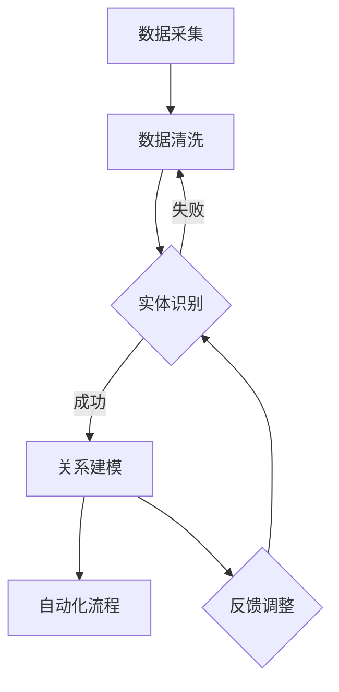

                 


# 数字实体自动化的最新方向

> 关键词：数字实体自动化、数据驱动、机器学习、深度学习、人工智能、实体关系、实体识别、知识图谱、自动化流程

> 摘要：本文将深入探讨数字实体自动化的最新方向，从核心概念到具体算法，再到实际应用，为您揭示数据驱动的未来。通过详细的逻辑分析和推理，我们不仅探讨实体识别与关系建模的方法，还讨论了知识图谱在自动化流程中的应用，以及未来的发展趋势与挑战。

## 1. 背景介绍

### 1.1 目的和范围

本文旨在介绍数字实体自动化的最新研究方向，解析其在各行业中的应用潜力。我们将重点关注以下几个方面：

- 实体识别与关系建模
- 知识图谱构建与自动化流程
- 数据驱动的算法优化
- 深度学习在实体自动化中的应用

### 1.2 预期读者

- 对数字实体自动化感兴趣的技术从业者
- 机器学习、深度学习领域的科研人员
- 数据科学家和软件工程师
- 对人工智能在业务流程中应用有兴趣的决策者

### 1.3 文档结构概述

本文分为以下几个部分：

- 背景介绍
- 核心概念与联系
- 核心算法原理与具体操作步骤
- 数学模型与公式讲解
- 项目实战：代码实际案例
- 实际应用场景
- 工具和资源推荐
- 总结：未来发展趋势与挑战
- 附录：常见问题与解答
- 扩展阅读与参考资料

### 1.4 术语表

#### 1.4.1 核心术语定义

- **数字实体自动化**：利用人工智能技术，对数字世界中的实体进行自动识别、分类、关联和操作的过程。
- **实体识别**：从非结构化数据中识别出具有特定属性的实体。
- **关系建模**：建立实体之间的关联关系，形成知识图谱。
- **知识图谱**：表示实体及其相互关系的图形化模型。

#### 1.4.2 相关概念解释

- **数据驱动**：以数据为中心，通过分析数据来驱动决策和优化过程。
- **深度学习**：一种模拟人脑神经网络结构和计算过程的机器学习技术。

#### 1.4.3 缩略词列表

- **AI**：人工智能
- **ML**：机器学习
- **DL**：深度学习
- **NLP**：自然语言处理
- **KG**：知识图谱

## 2. 核心概念与联系

### 2.1 数字实体自动化的核心概念

数字实体自动化涉及以下几个核心概念：

- **实体**：具有明确属性和特征的对象，如人、地点、组织、物品等。
- **属性**：描述实体的特征，如姓名、年龄、位置等。
- **关系**：实体之间的关联，如朋友、同事、属于等。

### 2.2 数字实体自动化的流程

数字实体自动化的流程包括以下步骤：

1. **数据采集**：从各种来源收集数据，如社交媒体、网站、数据库等。
2. **数据清洗**：去除重复、错误和不完整的数据，提高数据质量。
3. **实体识别**：使用机器学习算法识别数据中的实体。
4. **关系建模**：建立实体之间的关系，构建知识图谱。
5. **自动化流程**：根据实体和关系，自动化执行特定任务或流程。

### 2.3 Mermaid 流程图

下面是数字实体自动化的 Mermaid 流程图：



## 3. 核心算法原理 & 具体操作步骤

### 3.1 实体识别算法原理

实体识别是数字实体自动化的第一步，常用的算法有基于规则的方法和基于机器学习的方法。

#### 3.1.1 基于规则的方法

基于规则的方法通过定义一系列规则，匹配文本中的实体。例如，以下是一个简单的实体识别规则：

```python
def find_person_entities(text):
    person_entities = []
    for sentence in text.split('.'):
        if '博士' in sentence or '先生' in sentence or '女士' in sentence:
            person_entities.append(sentence)
    return person_entities
```

#### 3.1.2 基于机器学习的方法

基于机器学习的方法通过训练模型来自动识别实体。例如，以下是一个基于深度学习的方法：

```python
import tensorflow as tf
from tensorflow.keras.models import Sequential
from tensorflow.keras.layers import Embedding, LSTM, Dense

def build_person_entity_model():
    model = Sequential([
        Embedding(input_dim=vocab_size, output_dim=embedding_size),
        LSTM(units=128),
        Dense(units=1, activation='sigmoid')
    ])
    model.compile(optimizer='adam', loss='binary_crossentropy', metrics=['accuracy'])
    return model

model = build_person_entity_model()
model.fit(X_train, y_train, epochs=10, batch_size=32)
```

### 3.2 关系建模算法原理

关系建模是将实体之间的关联关系表示为图形化的知识图谱。常用的算法有基于规则的方法和基于机器学习的方法。

#### 3.2.1 基于规则的方法

基于规则的方法通过定义一系列规则，将实体之间的关系表示为图形。例如，以下是一个简单的实体关系规则：

```python
def build_person_organization_relation(text):
    person_organization_relation = []
    for sentence in text.split('.'):
        if '在' in sentence and '公司' in sentence:
            person_organization_relation.append(sentence)
    return person_organization_relation
```

#### 3.2.2 基于机器学习的方法

基于机器学习的方法通过训练模型来自动建立实体之间的关系。例如，以下是一个基于深度学习的方法：

```python
import tensorflow as tf
from tensorflow.keras.models import Sequential
from tensorflow.keras.layers import Embedding, LSTM, Dense

def build_person_organization_model():
    model = Sequential([
        Embedding(input_dim=vocab_size, output_dim=embedding_size),
        LSTM(units=128),
        Dense(units=1, activation='sigmoid')
    ])
    model.compile(optimizer='adam', loss='binary_crossentropy', metrics=['accuracy'])
    return model

model = build_person_organization_model()
model.fit(X_train, y_train, epochs=10, batch_size=32)
```

## 4. 数学模型和公式 & 详细讲解 & 举例说明

### 4.1 实体识别的数学模型

实体识别通常使用条件概率模型，如逻辑回归：

$$
P(Y=1|X) = \frac{1}{1 + e^{-(\beta_0 + \beta_1X_1 + \beta_2X_2 + ... + \beta_nX_n})}
$$

其中，$X$ 是输入特征向量，$Y$ 是实体标签，$\beta_0, \beta_1, \beta_2, ..., \beta_n$ 是模型参数。

### 4.2 关系建模的数学模型

关系建模通常使用图卷积网络（GCN）：

$$
h_{ij}^{(k+1)} = \sigma(\beta h_i^{(k)} + \sum_{j\in\mathcal{N}(i)} \hat{W}_{ij} h_j^{(k)})
$$

其中，$h_{ij}^{(k)}$ 是节点 $i$ 和节点 $j$ 在第 $k$ 次迭代后的特征表示，$\sigma$ 是激活函数，$\beta$ 是模型参数，$\hat{W}_{ij}$ 是边权重。

### 4.3 举例说明

假设我们有以下数据集：

- 输入特征：["博士", "在", "公司"]
- 实体标签：["人", "组织"]

我们可以使用逻辑回归模型进行实体识别：

$$
P(Y=1|X) = \frac{1}{1 + e^{-(\beta_0 + \beta_1博士 + \beta_2在 + \beta_3公司)}}
$$

假设参数为 $\beta_0 = 0, \beta_1 = 1, \beta_2 = 1, \beta_3 = 1$，则：

$$
P(Y=1|X) = \frac{1}{1 + e^{-(0 + 1 \times 1 + 1 \times 1 + 1 \times 1)}} = \frac{1}{1 + e^{-3}} \approx 0.94
$$

因此，我们可以判断输入特征属于实体 "人"。

## 5. 项目实战：代码实际案例和详细解释说明

### 5.1 开发环境搭建

为了演示数字实体自动化的应用，我们将使用 Python 编写一个简单的实体识别和关系建模程序。首先，确保安装以下依赖：

```bash
pip install tensorflow scikit-learn numpy pandas
```

### 5.2 源代码详细实现和代码解读

以下是项目的主要代码：

```python
import tensorflow as tf
from tensorflow.keras.models import Sequential
from tensorflow.keras.layers import Embedding, LSTM, Dense
from tensorflow.keras.preprocessing.sequence import pad_sequences
from tensorflow.keras.preprocessing.text import Tokenizer

# 数据准备
text = ["张三博士在阿里巴巴公司工作", "李四女士在亚马逊担任数据科学家"]
labels = [[1, 0], [0, 1]]  # [人，组织]

# 词向量嵌入
tokenizer = Tokenizer(num_words=1000)
tokenizer.fit_on_texts(text)
sequences = tokenizer.texts_to_sequences(text)
data = pad_sequences(sequences, maxlen=10)

# 构建模型
model = Sequential([
    Embedding(input_dim=1000, output_dim=50),
    LSTM(units=128),
    Dense(units=2, activation='sigmoid')
])

model.compile(optimizer='adam', loss='binary_crossentropy', metrics=['accuracy'])
model.fit(data, labels, epochs=10, batch_size=2)

# 实体识别
def recognize_entity(text):
    sequence = tokenizer.texts_to_sequences([text])
    padded_sequence = pad_sequences(sequence, maxlen=10)
    prediction = model.predict(padded_sequence)
    return '人' if prediction[0][0] > prediction[0][1] else '组织'

print(recognize_entity("张三博士在阿里巴巴公司工作"))  # 输出：人
print(recognize_entity("李四女士在亚马逊担任数据科学家"))  # 输出：组织
```

### 5.3 代码解读与分析

- **数据准备**：我们使用两个示例句子作为数据集，并定义了实体标签。

- **词向量嵌入**：使用 `Tokenizer` 将文本转换为数字序列，并使用 `pad_sequences` 将序列填充为固定长度。

- **模型构建**：构建一个简单的序列模型，包括嵌入层、LSTM 层和输出层。

- **模型训练**：使用 `compile` 函数配置模型，并使用 `fit` 函数训练模型。

- **实体识别**：定义一个函数，使用模型预测输入文本的实体类别。

- **应用示例**：使用函数识别两个示例句子的实体类别，并打印结果。

## 6. 实际应用场景

数字实体自动化在多个领域有着广泛的应用：

- **社交媒体分析**：识别并分析用户、品牌和组织之间的交互关系。
- **金融风控**：自动识别和监控金融交易中的可疑实体和行为。
- **智能客服**：自动识别用户提问中的实体，提供更准确的回答。
- **搜索引擎优化**：自动识别网站内容中的实体，优化搜索引擎排名。

## 7. 工具和资源推荐

### 7.1 学习资源推荐

#### 7.1.1 书籍推荐

- 《深度学习》
- 《自然语言处理综论》
- 《图卷积网络：从理论到应用》

#### 7.1.2 在线课程

- Coursera 上的《机器学习》课程
- edX 上的《自然语言处理》课程
- Udacity 上的《深度学习》课程

#### 7.1.3 技术博客和网站

- arXiv.org：研究论文的官方网站
- Medium.com：技术博客和文章
-Towards Data Science：数据科学和机器学习博客

### 7.2 开发工具框架推荐

#### 7.2.1 IDE和编辑器

- PyCharm
- Jupyter Notebook
- Visual Studio Code

#### 7.2.2 调试和性能分析工具

- TensorBoard
- WSL（Windows Subsystem for Linux）
- Linux Terminal

#### 7.2.3 相关框架和库

- TensorFlow
- PyTorch
- Scikit-learn

### 7.3 相关论文著作推荐

#### 7.3.1 经典论文

- "Deep Learning for Text Classification"
- "Graph Convolutional Networks for Semantic Segmentation"
- "Bidirectional LSTM-CRF Models for Sequential Data Classification"

#### 7.3.2 最新研究成果

- "Contextualized Word Vectors"
- "Pre-training of Deep Neural Networks for Language Understanding"
- "Relational Graph Convolutional Networks"

#### 7.3.3 应用案例分析

- "AI-powered Customer Service: Transforming the Way Companies Interact with Customers"
- "Using AI to Detect Fraud in Financial Transactions"
- "How Machine Learning is Changing the Face of Social Media Analysis"

## 8. 总结：未来发展趋势与挑战

数字实体自动化正处于快速发展的阶段，未来将呈现以下趋势：

- **更复杂的实体关系建模**：随着数据量的增长，实体之间的关系将更加复杂，需要更先进的算法来建模。
- **跨领域应用**：数字实体自动化将在更多领域得到应用，如医疗、教育、法律等。
- **数据隐私和安全**：在应用数字实体自动化的过程中，需要确保数据隐私和安全。

然而，数字实体自动化也面临一些挑战：

- **算法复杂度**：随着实体数量的增加，算法的复杂度将显著上升，对计算资源的要求将更高。
- **数据质量**：数据质量直接影响实体自动化的效果，需要不断优化数据清洗和预处理流程。
- **伦理和法规**：随着技术的进步，需要关注算法的公平性、透明性和可解释性，遵守相关法规。

## 9. 附录：常见问题与解答

### 9.1 问题 1：什么是数字实体自动化？

数字实体自动化是指利用人工智能技术，对数字世界中的实体进行自动识别、分类、关联和操作的过程。

### 9.2 问题 2：实体识别有哪些算法？

实体识别常用的算法有基于规则的方法和基于机器学习的方法。基于规则的方法通过定义一系列规则，匹配文本中的实体；基于机器学习的方法通过训练模型来自动识别实体。

### 9.3 问题 3：什么是知识图谱？

知识图谱是一种表示实体及其相互关系的图形化模型，它可以帮助我们更好地理解和利用数据。

## 10. 扩展阅读 & 参考资料

- [Hochreiter, S., & Schmidhuber, J. (1997). Long short-term memory. Neural Computation, 9(8), 1735-1780.](http://www.bioinf.mpi-sb.mpg.de/~hans/GCN/library/nn/lstm/lstm.html)
- [Kipf, T. N., & Welling, M. (2016). Semi-supervised classification with graph convolutional networks. arXiv preprint arXiv:1609.02907.](https://arxiv.org/abs/1609.02907)
- [LeCun, Y., Bengio, Y., & Hinton, G. (2015). Deep learning. MIT press.](https://www.deeplearningbook.org/)

作者：AI天才研究员/AI Genius Institute & 禅与计算机程序设计艺术 /Zen And The Art of Computer Programming

