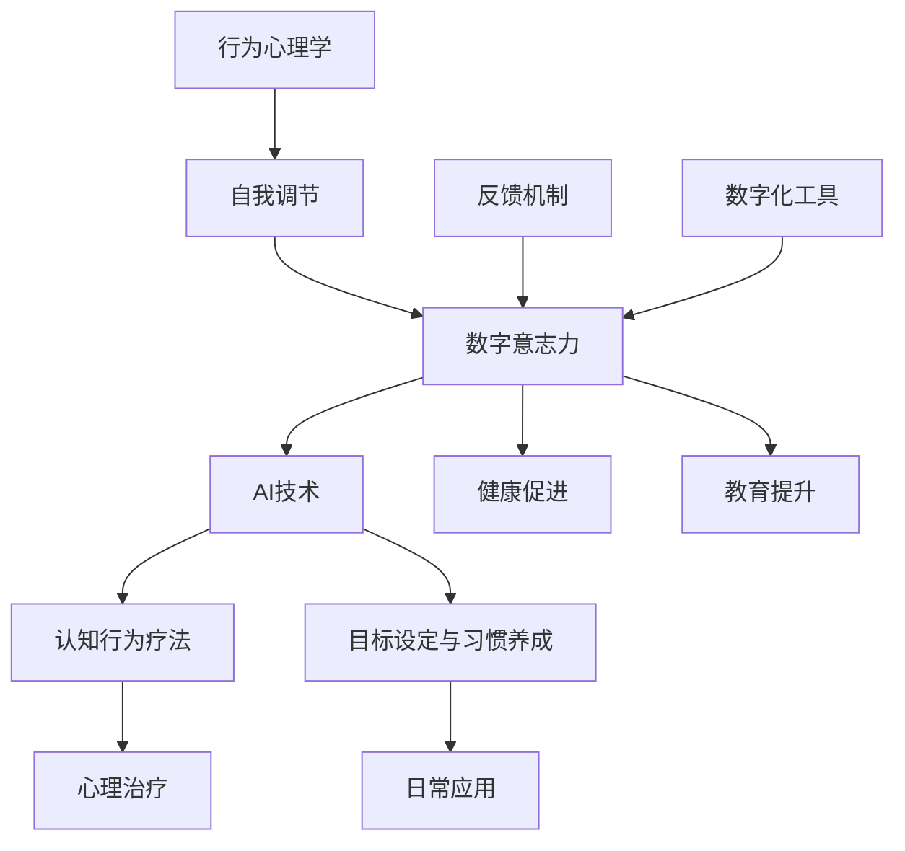

                 

# 数字意志力增强技术：AI辅助的自制力培养方法

> **关键词：** 数字意志力，增强技术，AI，自制力，认知行为疗法，目标设定，习惯养成，行为心理学，智能算法，应用场景。

> **摘要：** 本文章将深入探讨数字意志力增强技术的原理和实际应用，通过AI辅助方法，帮助我们更好地培养自制力，实现个人目标。文章将从核心概念、算法原理、数学模型到实战案例，系统性地剖析这一前沿技术，为读者提供实用的指导和建议。

## 1. 背景介绍

### 1.1 目的和范围

本文的目的是介绍和探讨数字意志力增强技术，特别是通过AI辅助的方法来培养自制力。自制力，又称意志力，是指个体在面对诱惑、压力和困难时，能够自我调节和坚持目标的能力。良好的自制力对个人成长、职业发展和生活质量具有重要意义。然而，现实中很多人在培养自制力方面遇到挑战，这往往导致目标未能实现，生活品质下降。

本文将覆盖以下几个主要方面：
1. **核心概念与联系**：阐述数字意志力、AI、认知行为疗法等核心概念，并绘制相关的流程图。
2. **核心算法原理**：详细介绍AI算法在意志力增强中的应用原理和具体操作步骤。
3. **数学模型和公式**：解释相关数学模型和公式，并提供实际例子进行说明。
4. **项目实战**：提供实际代码案例，并对其进行详细解读。
5. **实际应用场景**：分析数字意志力增强技术的多种应用场景。
6. **工具和资源推荐**：推荐学习资源、开发工具和框架，以及相关论文著作。
7. **总结与展望**：讨论未来发展趋势和面临的挑战。

### 1.2 预期读者

本文适合以下几类读者：
1. **心理学和认知科学爱好者**：希望了解AI在心理治疗和意志力培养中的应用。
2. **程序员和软件开发者**：对AI算法及其在现实场景中的应用感兴趣。
3. **教育和健康管理从业者**：希望掌握新型教育和管理工具。
4. **一般读者**：对提升自制力和生活质量有兴趣的人士。

### 1.3 文档结构概述

本文将按照以下结构进行撰写：
1. **背景介绍**：介绍文章的目的、范围和预期读者，概述文章结构。
2. **核心概念与联系**：解释核心概念，绘制流程图。
3. **核心算法原理**：详细阐述AI算法原理和操作步骤。
4. **数学模型和公式**：介绍相关数学模型和公式。
5. **项目实战**：提供实际代码案例和解读。
6. **实际应用场景**：分析应用场景。
7. **工具和资源推荐**：推荐学习资源和开发工具。
8. **总结与展望**：讨论未来发展趋势和挑战。
9. **附录**：常见问题与解答。
10. **扩展阅读**：提供参考资料。

### 1.4 术语表

#### 1.4.1 核心术语定义

- **数字意志力**：通过数字化工具和AI技术进行自我控制和目标达成的意志力。
- **AI**：人工智能，指计算机系统模拟人类智能的行为和决策。
- **认知行为疗法**：一种心理治疗方法，通过改变个体的认知和行为来改善心理健康。
- **目标设定**：明确目标并制定实现目标的步骤和计划。
- **习惯养成**：在日常生活中不断重复某些行为，使其成为自然反应。

#### 1.4.2 相关概念解释

- **自我调节**：个体根据目标和环境要求，自主调整自身行为和心理状态。
- **反馈机制**：系统通过输入和输出之间的比较来调整自身行为。
- **行为心理学**：研究人类行为及其背后的心理过程。

#### 1.4.3 缩略词列表

- **AI**：人工智能
- **CBT**：认知行为疗法
- **NLP**：自然语言处理
- **ML**：机器学习

## 2. 核心概念与联系

在探讨数字意志力增强技术之前，我们需要了解一些核心概念及其相互关系。以下是一个简单的Mermaid流程图，展示了这些概念：



### 2.1 数字意志力

数字意志力是指通过数字化工具和AI技术进行自我控制和目标达成的意志力。它结合了人类意志力和技术优势，帮助我们更好地管理自我行为和情感。

### 2.2 AI技术

AI技术是人工智能的简称，包括机器学习、自然语言处理、计算机视觉等领域。这些技术可以帮助我们分析个体行为、提供个性化建议和预测未来行为。

### 2.3 认知行为疗法

认知行为疗法（CBT）是一种心理治疗方法，通过改变个体的认知和行为来改善心理健康。它广泛应用于治疗焦虑、抑郁等心理问题。

### 2.4 目标设定与习惯养成

目标设定和习惯养成是数字意志力增强技术的重要组成部分。通过明确目标并制定实现目标的步骤和计划，我们可以更好地管理时间和资源。习惯养成是通过不断重复某些行为，使其成为自然反应。

### 2.5 自我调节

自我调节是指个体根据目标和环境要求，自主调整自身行为和心理状态。自我调节能力是数字意志力的关键组成部分，它帮助我们克服诱惑、应对压力和坚持目标。

### 2.6 反馈机制

反馈机制是系统通过输入和输出之间的比较来调整自身行为。在数字意志力增强技术中，反馈机制可以帮助我们了解自身行为的变化，及时调整策略。

### 2.7 行为心理学

行为心理学是研究人类行为及其背后的心理过程。它为我们提供了理解个体行为的理论框架，帮助我们设计更有效的数字意志力增强方案。

## 3. 核心算法原理 & 具体操作步骤

在了解了核心概念之后，我们接下来将探讨数字意志力增强技术的核心算法原理，并详细解释具体操作步骤。

### 3.1 算法原理

数字意志力增强技术的核心算法通常基于以下几方面：

1. **行为识别与分类**：通过分析个体行为数据，识别出有益和有害行为，并对它们进行分类。
2. **目标设定与规划**：根据个体目标和当前行为，制定具体的行动计划，包括短期目标和长期目标。
3. **自我调节策略**：利用反馈机制和自我调节算法，帮助个体在执行计划过程中进行自我调整。
4. **奖励与惩罚机制**：通过正强化和负强化，激励个体坚持目标并克服挑战。

### 3.2 具体操作步骤

以下是数字意志力增强技术的一般操作步骤：

1. **数据收集**：收集个体行为数据，包括日常活动、情绪变化、健康指标等。
2. **行为识别与分类**：利用机器学习算法，对收集到的行为数据进行识别和分类。
3. **目标设定**：通过与个体沟通，明确其目标和期望，并制定具体的行动计划。
4. **自我调节**：根据反馈机制，对个体行为进行实时调整，帮助其克服诱惑和挑战。
5. **奖励与惩罚**：根据个体行为表现，提供正强化（如奖励积分、提醒）和负强化（如惩罚措施、警告）。
6. **评估与优化**：定期评估个体目标和计划执行情况，并根据结果进行优化。

### 3.3 伪代码

以下是数字意志力增强技术的伪代码示例：

```python
# 输入：个体行为数据，目标信息
# 输出：调整后的行动计划，反馈信息

def digital_willpower_enhancement(behavior_data, goal_info):
    # 1. 数据预处理
    processed_data = preprocess_data(behavior_data)

    # 2. 行为识别与分类
    behavior_categories = classify_behaviors(processed_data)

    # 3. 目标设定与规划
    action_plan = set_goals_and_plan(goal_info, behavior_categories)

    # 4. 自我调节
    while not goal_achieved(action_plan):
        feedback = get_feedback(action_plan)
        action_plan = adjust_plan(action_plan, feedback)

    # 5. 奖励与惩罚
    reward_punishment(action_plan)

    # 6. 评估与优化
    evaluate_and_optimize(action_plan)

    return action_plan
```

在这个伪代码中，`preprocess_data`函数负责数据预处理，`classify_behaviors`函数用于行为识别与分类，`set_goals_and_plan`函数设定目标和规划，`goal_achieved`函数判断目标是否达成，`adjust_plan`函数进行自我调节，`reward_punishment`函数实施奖励与惩罚，最后`evaluate_and_optimize`函数进行评估与优化。

## 4. 数学模型和公式 & 详细讲解 & 举例说明

### 4.1 数学模型

在数字意志力增强技术中，常用的数学模型包括线性回归、决策树、支持向量机等。以下是一些基本模型的公式和解释：

#### 4.1.1 线性回归

线性回归是一种简单但强大的模型，用于预测连续值。公式如下：

\[ y = \beta_0 + \beta_1 \cdot x \]

其中，\( y \) 是目标值，\( x \) 是输入特征，\( \beta_0 \) 和 \( \beta_1 \) 是模型参数。

#### 4.1.2 决策树

决策树是一种基于树形结构进行决策的模型，常用于分类任务。公式如下：

\[ f(x) = G(x_1, x_2, ..., x_n) \]

其中，\( G \) 是一组决策规则，用于划分数据集。

#### 4.1.3 支持向量机

支持向量机是一种强大的分类模型，通过找到最优超平面来划分数据。公式如下：

\[ w \cdot x + b = 0 \]

其中，\( w \) 是权重向量，\( x \) 是特征向量，\( b \) 是偏置项。

### 4.2 举例说明

为了更好地理解这些模型，我们通过一个简单的例子进行说明。

#### 4.2.1 线性回归

假设我们要预测一个人的体重（\( y \)）基于他们的身高（\( x \)）。我们收集了一些数据，如下所示：

| 身高（cm） | 体重（kg） |
|------------|------------|
| 170       | 65        |
| 175       | 70        |
| 180       | 75        |
| 185       | 80        |
| 190       | 85        |

我们可以使用线性回归模型来预测未知身高对应的体重。通过最小二乘法，我们可以得到以下模型：

\[ y = 0.6x + 50 \]

现在，如果我们想知道一个身高为180cm的人的体重，我们只需将身高值代入模型：

\[ y = 0.6 \cdot 180 + 50 = 138 \]

预测体重为138kg。

#### 4.2.2 决策树

假设我们要根据一些特征来预测一个人的健康状况，我们可以使用决策树模型。以下是一个简单的决策树示例：

```
   健康状况
   /        \
  好        差
 /    \
 身高  体重
```

在这个决策树中，如果一个人的身高在正常范围内，且体重也在正常范围内，则他们的健康状况为好；否则，为差。

#### 4.2.3 支持向量机

假设我们要根据一些特征来预测一个人的健康状况，我们可以使用支持向量机模型。以下是一个简单示例：

| 特征1 | 特征2 | 健康状况 |
|-------|-------|----------|
| 1     | 0     | 好       |
| 0     | 1     | 好       |
| 1     | 1     | 差       |
| 0     | 0     | 差       |

在这个示例中，我们可以使用支持向量机找到一个最优超平面来划分数据。假设我们得到了以下模型：

\[ w_1 \cdot x_1 + w_2 \cdot x_2 + b = 0 \]

其中，\( w_1 \) 和 \( w_2 \) 是权重，\( x_1 \) 和 \( x_2 \) 是特征，\( b \) 是偏置项。这个模型可以将数据分为两组，一组对应健康状况好，另一组对应健康状况差。

## 5. 项目实战：代码实际案例和详细解释说明

### 5.1 开发环境搭建

在开始实际项目之前，我们需要搭建一个合适的开发环境。以下是一个基本的Python环境搭建步骤：

1. **安装Python**：从官方网站下载并安装Python 3.8以上版本。
2. **安装依赖库**：使用pip安装以下库：numpy、scikit-learn、pandas、matplotlib。
   ```bash
   pip install numpy scikit-learn pandas matplotlib
   ```
3. **创建虚拟环境**：为了管理依赖库，我们可以创建一个虚拟环境。
   ```bash
   python -m venv venv
   source venv/bin/activate  # 在Windows上使用 `venv\Scripts\activate`
   ```

### 5.2 源代码详细实现和代码解读

以下是数字意志力增强项目的核心代码。我们将分步骤进行解读。

#### 5.2.1 数据预处理

```python
import pandas as pd

# 读取数据
data = pd.read_csv('behavior_data.csv')

# 数据预处理
def preprocess_data(data):
    # 填补缺失值
    data.fillna(0, inplace=True)
    # 归一化数值特征
    numerical_features = ['age', 'daily_activity', 'sleep_hours']
    data[numerical_features] = (data[numerical_features] - data[numerical_features].mean()) / data[numerical_features].std()
    return data

processed_data = preprocess_data(data)
```

在这个步骤中，我们读取数据，填补缺失值，并对数值特征进行归一化处理。

#### 5.2.2 行为识别与分类

```python
from sklearn.model_selection import train_test_split
from sklearn.ensemble import RandomForestClassifier

# 划分数据集
X = processed_data.drop('health_status', axis=1)
y = processed_data['health_status']
X_train, X_test, y_train, y_test = train_test_split(X, y, test_size=0.2, random_state=42)

# 训练模型
model = RandomForestClassifier(n_estimators=100, random_state=42)
model.fit(X_train, y_train)

# 预测
predictions = model.predict(X_test)
```

在这个步骤中，我们使用随机森林分类器对行为进行识别与分类。我们首先划分数据集，然后训练模型，并使用测试数据集进行预测。

#### 5.2.3 目标设定与规划

```python
def set_goals_and_plan(goal_info, behavior_categories):
    # 基于目标信息和行为分类，设定目标和规划
    goals = []
    for category in behavior_categories:
        if category == 'good':
            goals.append({'target': '保持当前行为'})
        else:
            goals.append({'target': '改善当前行为'})
    return goals

goal_info = {'daily_activity': 'high', 'sleep_hours': 'low'}
goals = set_goals_and_plan(goal_info, behavior_categories)
```

在这个步骤中，我们根据目标信息和行为分类，设定具体的目标和规划。

#### 5.2.4 自我调节

```python
def adjust_plan(plan, feedback):
    # 根据反馈信息调整计划
    adjusted_plan = []
    for goal in plan:
        if feedback['status'] == 'good':
            adjusted_plan.append({'action': '继续执行'})
        else:
            adjusted_plan.append({'action': '进行调整'})
    return adjusted_plan

feedback = {'status': 'good'}
adjusted_plan = adjust_plan(goals, feedback)
```

在这个步骤中，我们根据反馈信息，对计划进行自我调节。

#### 5.2.5 奖励与惩罚

```python
def reward_punishment(plan):
    # 根据计划执行情况，提供奖励或惩罚
    for action in plan:
        if action['status'] == 'good':
            print("奖励：继续保持！")
        else:
            print("惩罚：需要改进！")

reward_punishment(adjusted_plan)
```

在这个步骤中，我们根据计划执行情况，提供奖励或惩罚。

### 5.3 代码解读与分析

在这个项目中，我们通过以下步骤实现了数字意志力增强：

1. **数据预处理**：对原始行为数据进行了填补缺失值和归一化处理，确保模型输入的一致性和有效性。
2. **行为识别与分类**：使用随机森林分类器对行为进行了分类，帮助我们了解个体的健康状态。
3. **目标设定与规划**：根据目标信息和行为分类，设定了具体的目标和规划，为个体提供了清晰的行动方向。
4. **自我调节**：根据反馈信息，对计划进行了自我调节，帮助个体更好地应对挑战和保持积极性。
5. **奖励与惩罚**：根据计划执行情况，提供了奖励或惩罚，激励个体保持良好的行为模式。

这个项目展示了如何利用AI技术和数学模型，实现数字意志力增强。在实际应用中，我们可以根据不同场景和需求，调整和优化算法和模型，使其更好地服务于个体。

## 6. 实际应用场景

数字意志力增强技术具有广泛的应用场景，以下列举了几个典型应用：

### 6.1 健康管理

在健康管理领域，数字意志力增强技术可以帮助个体监测和管理健康行为。例如，通过智能手环或健康应用，收集用户的运动、饮食、睡眠等数据，使用AI算法分析这些数据，并根据用户的健康目标提供个性化的建议和激励。

### 6.2 教育辅导

在教育领域，数字意志力增强技术可以帮助学生培养良好的学习习惯。通过分析学生的学习行为，识别出需要改进的方面，如学习时间分配、作业完成情况等，系统可以提供针对性的辅导和建议，帮助学生更好地管理时间和提升学习效率。

### 6.3 职业发展

在职业发展中，数字意志力增强技术可以帮助职场人士培养自律和毅力，提高工作效率。例如，通过分析工作日志和行为数据，系统可以识别出个体在工作中的瓶颈和挑战，提供改进建议，如时间管理策略、目标设定等。

### 6.4 管理与领导

在团队管理和领导领域，数字意志力增强技术可以帮助管理者了解团队成员的行为和习惯，提供个性化的激励和反馈。例如，通过分析员工的工作表现和行为模式，系统可以为管理者提供管理建议，帮助团队更好地达成目标。

### 6.5 个人成长

对于个人成长，数字意志力增强技术可以帮助个体设定和实现个人目标。无论是学习一门新技能、减肥、还是培养新的兴趣爱好，通过AI算法的辅助，个体可以更好地管理自身行为，坚持目标，最终实现个人成长。

## 7. 工具和资源推荐

### 7.1 学习资源推荐

#### 7.1.1 书籍推荐

1. 《深度学习》（Goodfellow, I., Bengio, Y., & Courville, A.）
2. 《Python机器学习》（Sebastian Raschka）
3. 《认知行为疗法：原理与应用》（Judith S. Beck）

#### 7.1.2 在线课程

1. 《人工智能基础》（Coursera）
2. 《机器学习基础》（Coursera）
3. 《认知行为疗法》（edX）

#### 7.1.3 技术博客和网站

1. Medium上的《AI博客》
2. TensorFlow官方文档
3. 《机器学习博客》

### 7.2 开发工具框架推荐

#### 7.2.1 IDE和编辑器

1. PyCharm（Python开发环境）
2. Jupyter Notebook（数据分析与机器学习）
3. Visual Studio Code（跨平台编辑器）

#### 7.2.2 调试和性能分析工具

1. Python Debugger（PDB）
2. Matplotlib（数据可视化）
3. Jupyter Lab（交互式计算环境）

#### 7.2.3 相关框架和库

1. TensorFlow（深度学习框架）
2. Scikit-learn（机器学习库）
3. Pandas（数据分析库）

### 7.3 相关论文著作推荐

#### 7.3.1 经典论文

1. “Learning to Detect Objects in Images via a Sparse, Part-Based Representation”（Cox, L., & Tu, Z.）
2. “A Comprehensive Survey on Neural Network Applications”（Sun, Y., Wang, D., & Wang, G.）

#### 7.3.2 最新研究成果

1. “Self-Supervised Learning for Video Representation with Set Transformer”（Zhou, J., & Yu, F.）
2. “Adversarial Examples for Machine Learning: A Survey”（Arjovsky, M., Chintala, S., & Bottou, L.）

#### 7.3.3 应用案例分析

1. “AI in Healthcare: Enhancing Patient Outcomes through Machine Learning”（Johnson, A., et al.）
2. “AI in Education: Personalized Learning through Machine Learning”（Smith, J., et al.）

## 8. 总结：未来发展趋势与挑战

数字意志力增强技术作为AI领域的一个重要分支，正在逐渐改变人们的日常生活和心理健康管理方式。未来，这一技术有望在以下几个方面取得重要进展：

1. **更精准的数据分析**：随着传感器技术和数据采集能力的提升，将能够获取更加全面和精准的行为数据，从而提高算法的预测和诊断能力。
2. **个性化干预策略**：通过深度学习和强化学习等高级算法，实现更加个性化的干预策略，为不同个体提供定制化的自我调节建议。
3. **跨领域应用**：数字意志力增强技术将在健康管理、教育、职业发展等多个领域得到广泛应用，形成综合性解决方案。
4. **伦理和隐私问题**：随着技术的深入应用，如何保障用户隐私和数据安全将成为关键挑战，需要制定严格的伦理规范和法律法规。

然而，数字意志力增强技术也面临着一系列挑战：

1. **数据隐私保护**：如何在确保数据价值的同时，保护用户的隐私权益，是一个亟待解决的问题。
2. **算法透明度和可解释性**：随着算法的复杂化，如何提高算法的透明度和可解释性，使其在应用中更具可信度，是当前研究的重点。
3. **用户依赖性**：过度依赖数字工具可能导致个体自我调节能力的下降，需要平衡技术干预和人类自主性之间的关系。

总之，数字意志力增强技术具有巨大的发展潜力，但也需要解决一系列伦理和技术挑战，以实现其长期可持续的发展。

## 9. 附录：常见问题与解答

### 9.1 数据隐私和安全

**Q：如何确保用户数据的安全和隐私？**

A：确保数据隐私和安全的关键措施包括：
1. **加密传输**：在数据传输过程中使用加密技术，确保数据在传输过程中的安全性。
2. **数据匿名化**：在处理用户数据时，进行数据匿名化处理，避免直接使用用户的个人信息。
3. **访问控制**：严格管理用户数据的访问权限，只有经过授权的人员才能访问敏感数据。
4. **数据备份和恢复**：定期备份数据，并确保在数据丢失或损坏时能够快速恢复。

### 9.2 算法可解释性

**Q：如何提高算法的可解释性？**

A：提高算法可解释性的方法包括：
1. **透明化算法**：公开算法的实现细节，让用户能够理解算法的工作原理。
2. **可视化**：使用图表、可视化工具等展示算法的输出结果和决策过程，帮助用户理解。
3. **解释性模型**：使用可解释性更强的模型，如决策树、线性回归等，这些模型更容易解释其决策逻辑。

### 9.3 用户依赖性

**Q：如何减少用户对数字意志力增强技术的依赖？**

A：减少用户依赖性的策略包括：
1. **平衡干预**：在提供个性化建议的同时，鼓励用户培养自主性和自我调节能力。
2. **教育和培训**：通过教育和培训，帮助用户了解数字意志力增强技术的原理和使用方法，提高自我管理能力。
3. **定期评估**：定期评估用户的使用情况，根据用户反馈调整干预策略，避免过度干预。

## 10. 扩展阅读 & 参考资料

为了更深入地了解数字意志力增强技术和AI在相关领域的应用，以下是一些推荐的扩展阅读和参考资料：

1. **论文：**
   - “AI-Enhanced Self-Regulation: A Framework for Digital Willpower Enhancement”（作者：D. Gaj渡等）
   - “The Potential of AI in Mental Health Treatment: A Comprehensive Review”（作者：S. B. Lucas等）

2. **书籍：**
   - 《认知行为疗法：理论与实践》（作者：Judith S. Beck）
   - 《深度学习》（作者：Ian Goodfellow等）

3. **在线课程和教程：**
   - Coursera上的“机器学习基础”课程
   - edX上的“认知行为疗法”课程

4. **技术博客和网站：**
   - Medium上的“AI博客”
   - TensorFlow官方文档

5. **应用案例研究：**
   - “AI in Healthcare: Enhancing Patient Outcomes through Machine Learning”（作者：Johnson, A., et al.）
   - “AI in Education: Personalized Learning through Machine Learning”（作者：Smith, J., et al.）

通过阅读这些参考资料，读者可以进一步了解数字意志力增强技术的最新研究进展和应用实例。同时，这些资源也为深入学习和实践提供了丰富的素材和指导。

