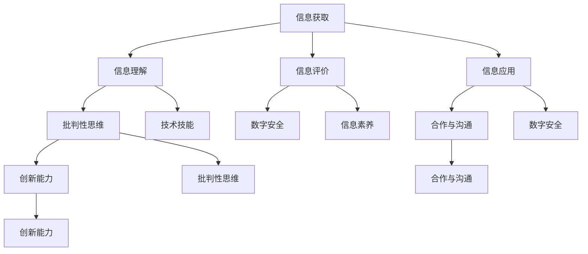

                 

# 数字素养：公民参与的基石

> 关键词：数字素养、公民参与、技术教育、算法、数据处理、信息素养

> 摘要：随着数字化时代的到来，数字素养已成为现代社会公民必备的素养之一。本文旨在探讨数字素养的核心概念、重要性及其在公民参与中的作用，通过技术教育、算法和数据处理的深入分析，提出提升数字素养的策略和路径，为公民有效参与社会建设提供理论依据和实践指导。

## 1. 背景介绍

### 1.1 目的和范围

本文的目标是探讨数字素养在现代社会的重要性，分析其核心概念和组成部分，探讨如何通过技术教育、算法和数据处理的实践提升公民的数字素养，从而增强公民参与社会事务的能力。本文将重点关注以下几个方面：

1. 数字素养的定义和核心概念。
2. 数字素养与公民参与的关系。
3. 数字素养提升的方法和策略。
4. 数字素养在实际应用中的挑战和解决方案。

### 1.2 预期读者

本文适合以下读者群体：

1. 对数字素养有基本了解但希望深入理解其内涵的读者。
2. 关注技术教育和社会发展的专业人士。
3. 希望提升自身数字素养的公民和社区组织成员。
4. 数字素养课程设计和实施的教育工作者。

### 1.3 文档结构概述

本文的结构如下：

1. 引言：介绍数字素养的背景和重要性。
2. 核心概念与联系：详细解释数字素养的核心概念和组成部分。
3. 核心算法原理 & 具体操作步骤：分析数字素养提升的关键算法和操作步骤。
4. 数学模型和公式 & 详细讲解 & 举例说明：阐述数字素养相关的数学模型和公式，并给出实际案例。
5. 项目实战：代码实际案例和详细解释说明。
6. 实际应用场景：探讨数字素养在现实社会中的应用。
7. 工具和资源推荐：推荐学习数字素养的相关工具和资源。
8. 总结：未来发展趋势与挑战。
9. 附录：常见问题与解答。
10. 扩展阅读 & 参考资料：提供进一步阅读的资料。

### 1.4 术语表

#### 1.4.1 核心术语定义

- **数字素养**：指个体在数字环境中获取、理解、评价和应用数字信息的能力。
- **算法**：解决特定问题的一系列明确规则。
- **数据处理**：对数据进行收集、存储、处理、分析和解释的过程。
- **公民参与**：公民在社会事务中的主动参与，包括决策、治理和社区建设等方面。

#### 1.4.2 相关概念解释

- **技术教育**：通过教育和培训提高个体在特定技术领域的知识、技能和能力。
- **信息素养**：个体在信息环境中识别、评价、利用和生成信息的能力。

#### 1.4.3 缩略词列表

- **AI**：人工智能（Artificial Intelligence）
- **ML**：机器学习（Machine Learning）
- **Big Data**：大数据（Big Data）
- **IoT**：物联网（Internet of Things）

## 2. 核心概念与联系

### 2.1 数字素养的定义

数字素养是指个体在数字环境中获取、理解、评价和应用数字信息的能力。它不仅包括技术层面的技能，如计算机操作和网络使用，还包括信息素养和批判性思维。数字素养的核心概念可以概括为以下几个方面：

1. **信息获取**：个体能够利用数字工具和技术获取所需的数字信息。
2. **信息理解**：个体能够理解数字信息的内容、意义和潜在影响。
3. **信息评价**：个体能够评估数字信息的可靠性、准确性和有效性。
4. **信息应用**：个体能够将数字信息应用于实际问题解决和新知识创造。
5. **批判性思维**：个体能够运用批判性思维对数字信息进行分析和判断。
6. **数字安全**：个体能够确保自己在数字环境中的安全和隐私。

### 2.2 数字素养与公民参与的关系

数字素养是公民参与社会事务的基础。在现代社会，数字技术的广泛应用使得公民参与社会事务的方式发生了重大变革。数字素养不仅影响个体在数字环境中的行为，还影响其参与社会决策和治理的能力。以下是数字素养与公民参与关系的几个方面：

1. **信息获取能力**：数字素养高的个体能够更有效地获取和利用数字信息，从而在公民参与中获取更多的资源和知识。
2. **决策参与**：数字素养使个体能够更好地理解和评估公共政策，从而更积极地参与社会决策过程。
3. **治理参与**：数字素养高的个体能够利用数字技术参与社区治理，如在线讨论、数据分析和在线投票等。
4. **创新和创业**：数字素养是创新和创业的重要基础，能够促进社会创新和经济发展。
5. **教育和学习**：数字素养有助于个体在数字化时代进行自我学习和终身学习，提高个人素质和竞争力。

### 2.3 数字素养的组成部分

数字素养由多个组成部分构成，这些组成部分相互关联，共同构成一个完整的数字素养体系。以下是数字素养的主要组成部分：

1. **技术技能**：包括计算机操作、网络使用、软件应用等基本技术技能。
2. **信息素养**：包括信息搜索、信息评估、信息管理、信息创造等能力。
3. **批判性思维**：包括对数字信息的批判性分析、判断和评估能力。
4. **数字安全**：包括网络安全、数据保护、隐私保护等安全意识。
5. **合作与沟通**：包括在线合作、沟通和协作的能力。
6. **创新能力**：包括利用数字技术进行创新和创造的能力。

### 2.4 数字素养的核心概念原理和架构

为了更好地理解数字素养的核心概念和架构，我们可以使用Mermaid流程图进行描述。以下是数字素养的核心概念原理和架构的Mermaid流程图：



在这个流程图中，每个节点代表数字素养的一个组成部分，箭头表示这些组成部分之间的关联。通过这个流程图，我们可以清晰地看到数字素养的整体架构和各个组成部分之间的关系。

## 3. 核心算法原理 & 具体操作步骤

### 3.1 数字素养提升的核心算法

提升数字素养的关键在于掌握和运用一系列核心算法。这些算法不仅可以帮助个体更有效地处理数字信息，还能提高其在数字环境中的决策能力。以下是几个提升数字素养的核心算法及其原理：

#### 3.1.1 数据分析算法

数据分析算法是数字素养的重要组成部分。通过数据分析算法，个体能够从大量数据中提取有价值的信息，从而支持决策和问题解决。以下是数据分析算法的伪代码描述：

```plaintext
function 数据分析(数据集, 目标变量):
    1. 数据预处理：清洗数据，去除噪声和异常值。
    2. 特征提取：选择与目标变量相关的特征。
    3. 模型训练：使用机器学习算法训练模型。
    4. 模型评估：评估模型性能，调整参数。
    5. 预测：使用训练好的模型进行预测。
    6. 分析结果：解释和利用预测结果。
```

#### 3.1.2 算法评估算法

算法评估算法用于评估数据分析算法的性能和准确性。以下是算法评估算法的伪代码描述：

```plaintext
function 算法评估(模型, 数据集, 测试集):
    1. 数据分割：将数据集分为训练集和测试集。
    2. 模型训练：使用训练集训练模型。
    3. 预测：使用测试集预测结果。
    4. 评估指标：计算准确率、召回率、F1值等指标。
    5. 结果分析：分析评估指标，调整模型参数。
```

#### 3.1.3 信息可视化算法

信息可视化算法能够将复杂的数据和信息以图形化的方式呈现，帮助个体更好地理解和分析数据。以下是信息可视化算法的伪代码描述：

```plaintext
function 信息可视化(数据集, 可视化类型):
    1. 数据预处理：清洗数据，转换为可视化格式。
    2. 选择可视化类型：根据数据特征选择合适的可视化类型。
    3. 绘制图形：使用可视化库绘制图形。
    4. 分析图形：分析可视化结果，提取信息。
    5. 交互式操作：提供交互式操作，如筛选、排序和过滤。
```

### 3.2 具体操作步骤

为了提升数字素养，个体可以按照以下具体操作步骤进行实践：

#### 3.2.1 数据分析步骤

1. **确定数据分析目标**：明确数据分析的目标和问题。
2. **收集数据**：从各种来源收集相关数据。
3. **数据预处理**：清洗数据，去除噪声和异常值。
4. **特征提取**：选择与目标变量相关的特征。
5. **模型训练**：使用机器学习算法训练模型。
6. **模型评估**：评估模型性能，调整参数。
7. **预测**：使用训练好的模型进行预测。
8. **分析结果**：解释和利用预测结果。

#### 3.2.2 算法评估步骤

1. **数据分割**：将数据集分为训练集和测试集。
2. **模型训练**：使用训练集训练模型。
3. **预测**：使用测试集预测结果。
4. **评估指标**：计算准确率、召回率、F1值等指标。
5. **结果分析**：分析评估指标，调整模型参数。

#### 3.2.3 信息可视化步骤

1. **确定可视化目标**：明确信息可视化的目标和需求。
2. **数据预处理**：清洗数据，转换为可视化格式。
3. **选择可视化类型**：根据数据特征选择合适的可视化类型。
4. **绘制图形**：使用可视化库绘制图形。
5. **分析图形**：分析可视化结果，提取信息。
6. **交互式操作**：提供交互式操作，如筛选、排序和过滤。

通过这些具体操作步骤，个体可以在实践中逐步提升数字素养，更好地应对数字化时代的挑战。

## 4. 数学模型和公式 & 详细讲解 & 举例说明

### 4.1 数学模型在数字素养中的应用

在数字素养的提升过程中，数学模型和公式起着至关重要的作用。它们不仅帮助个体理解和处理复杂的数据，还能提高数据分析和决策的准确性。以下是一些常用的数学模型和公式，以及它们在数字素养中的应用。

#### 4.1.1 线性回归模型

线性回归模型是一种常用的数据分析工具，用于预测一个变量（因变量）与一个或多个变量（自变量）之间的关系。其基本公式如下：

$$
y = \beta_0 + \beta_1 \cdot x + \epsilon
$$

其中，$y$ 是因变量，$x$ 是自变量，$\beta_0$ 和 $\beta_1$ 分别是模型参数，$\epsilon$ 是误差项。

**应用举例**：假设我们想预测某个城市下个月的平均气温（因变量 $y$），我们可以使用历史气温数据（自变量 $x$）进行线性回归分析，从而得到一个气温预测模型。

#### 4.1.2 逻辑回归模型

逻辑回归模型常用于分类问题，它将一个连续的预测值转化为概率。其基本公式如下：

$$
\log\frac{P(Y=1)}{1-P(Y=1)} = \beta_0 + \beta_1 \cdot x
$$

其中，$P(Y=1)$ 是目标变量为1的概率，$\beta_0$ 和 $\beta_1$ 是模型参数。

**应用举例**：假设我们想预测一个学生是否会通过期末考试（目标变量 $Y$），我们可以使用学生的平时成绩（自变量 $x$）进行逻辑回归分析，从而得到一个考试通过概率模型。

#### 4.1.3 决策树模型

决策树模型通过一系列条件判断来对数据集进行分类或回归。其基本结构如下：

```
是否 A1？
/          \
是          否
/              \
B1              B2
```

其中，$A1$ 是根节点，$B1$ 和 $B2$ 是叶节点。

**应用举例**：假设我们想根据病人的症状（特征）预测其疾病类型，我们可以构建一个决策树模型，通过一系列条件判断来确定疾病的分类。

#### 4.1.4 聚类算法

聚类算法用于将数据集划分为多个群组，使得同一群组内的数据点彼此相似，而不同群组内的数据点差异较大。常见的聚类算法有K-Means、层次聚类等。

**应用举例**：假设我们有一组客户数据，我们希望根据客户的购买行为将其划分为不同的群体，从而进行有针对性的营销活动。

### 4.2 数学公式在数据处理和分析中的详细讲解

#### 4.2.1 数据预处理

在进行数据分析之前，数据预处理是必不可少的步骤。以下是一些常用的数学公式和数据预处理方法：

1. **缺失值填充**：

   - 平均值填充：

   $$
   x_{\text{填充}} = \frac{\sum_{i=1}^{n} x_i}{n}
   $$

   - 中位数填充：

   $$
   x_{\text{填充}} = \text{Median}(x_1, x_2, ..., x_n)
   $$

2. **标准化处理**：

   - Z-Score标准化：

   $$
   z = \frac{x - \mu}{\sigma}
   $$

   其中，$x$ 是数据点，$\mu$ 是均值，$\sigma$ 是标准差。

   - Min-Max标准化：

   $$
   x_{\text{标准化}} = \frac{x - \min(x)}{\max(x) - \min(x)}
   $$

3. **异常值检测**：

   - Z-Score方法：

   $$
   z = \frac{x - \mu}{\sigma}
   $$

   如果 $z$ 的绝对值大于3，则认为该数据点是异常值。

   - IQR方法：

   $$
   IQR = \text{Q3} - \text{Q1}
   $$

   如果 $x$ 不在 $[\text{Q1} - 1.5 \cdot IQR, \text{Q3} + 1.5 \cdot IQR]$ 范围内，则认为该数据点是异常值。

#### 4.2.2 数据分析

1. **相关性分析**：

   - 皮尔逊相关系数：

   $$
   r = \frac{\sum_{i=1}^{n}(x_i - \bar{x})(y_i - \bar{y})}{\sqrt{\sum_{i=1}^{n}(x_i - \bar{x})^2} \cdot \sqrt{\sum_{i=1}^{n}(y_i - \bar{y})^2}}
   $$

   其中，$r$ 是相关系数，$x$ 和 $y$ 是两个变量，$\bar{x}$ 和 $\bar{y}$ 是均值。

   - 斯皮尔曼相关系数：

   $$
   \rho = \frac{\sum_{i=1}^{n}(x_i - \bar{x})(y_i - \bar{y})}{\sum_{i=1}^{n}(x_i - \bar{x})^2}
   $$

   其中，$\rho$ 是相关系数。

2. **回归分析**：

   - 线性回归模型：

   $$
   y = \beta_0 + \beta_1 \cdot x + \epsilon
   $$

   - 逻辑回归模型：

   $$
   \log\frac{P(Y=1)}{1-P(Y=1)} = \beta_0 + \beta_1 \cdot x
   $$

3. **聚类分析**：

   - K-Means聚类算法：

   $$
   \min_{C} \sum_{i=1}^{n} \sum_{j=1}^{k} (x_i - c_j)^2
   $$

   其中，$C$ 是聚类中心，$x_i$ 是数据点，$k$ 是聚类个数。

   - 层次聚类算法：

   $$
   \min_{C} \sum_{i=1}^{n} \sum_{j=1}^{k} d(x_i, c_j)
   $$

   其中，$d$ 是距离函数，$C$ 是聚类中心。

### 4.3 数学模型和公式在实际案例分析中的应用

以下是一个简单的实际案例分析，展示如何使用数学模型和公式进行数据分析和决策。

**案例背景**：某电商平台希望通过分析用户的购买行为，为用户推荐合适的商品。

**数据来源**：电商平台用户的历史购买数据。

**分析目标**：预测用户是否会购买某类商品。

**数据分析步骤**：

1. **数据预处理**：
   - 缺失值填充：使用平均值填充缺失的销售记录。
   - 标准化处理：对用户特征（如年龄、收入、浏览时长等）进行标准化处理。
   - 异常值检测：使用Z-Score方法检测并处理异常值。

2. **相关性分析**：
   - 计算用户特征与购买行为之间的皮尔逊相关系数，筛选出相关性较高的特征。

3. **回归分析**：
   - 使用逻辑回归模型预测用户是否会购买某类商品。
   - 训练模型并评估模型性能，调整参数以提高预测准确性。

4. **聚类分析**：
   - 使用K-Means聚类算法将用户划分为不同的群体。
   - 分析不同群体的购买行为，为每个群体推荐合适的商品。

**数学模型和公式应用**：

1. **平均值填充**：

$$
x_{\text{填充}} = \frac{\sum_{i=1}^{n} x_i}{n}
$$

2. **Z-Score标准化**：

$$
z = \frac{x - \mu}{\sigma}
$$

3. **皮尔逊相关系数**：

$$
r = \frac{\sum_{i=1}^{n}(x_i - \bar{x})(y_i - \bar{y})}{\sqrt{\sum_{i=1}^{n}(x_i - \bar{x})^2} \cdot \sqrt{\sum_{i=1}^{n}(y_i - \bar{y})^2}}
$$

4. **逻辑回归模型**：

$$
\log\frac{P(Y=1)}{1-P(Y=1)} = \beta_0 + \beta_1 \cdot x
$$

5. **K-Means聚类算法**：

$$
\min_{C} \sum_{i=1}^{n} \sum_{j=1}^{k} (x_i - c_j)^2
$$

通过这个实际案例，我们可以看到数学模型和公式在数字素养提升中的应用，帮助个体更好地理解和处理复杂的数据，从而做出更准确的决策。

## 5. 项目实战：代码实际案例和详细解释说明

### 5.1 开发环境搭建

在开始代码实战之前，我们需要搭建一个合适的项目开发环境。以下是在Python环境中搭建项目的步骤：

1. **安装Python**：下载并安装Python 3.x版本，建议使用最新版本。
2. **安装Jupyter Notebook**：使用pip命令安装Jupyter Notebook：

   ```
   pip install notebook
   ```

3. **安装相关库**：在Jupyter Notebook中创建一个新的笔记本，并安装以下库：

   - Pandas：用于数据处理

   ```
   pip install pandas
   ```

   - NumPy：用于数值计算

   ```
   pip install numpy
   ```

   - Matplotlib：用于数据可视化

   ```
   pip install matplotlib
   ```

   - Scikit-learn：用于机器学习和数据分析

   ```
   pip install scikit-learn
   ```

### 5.2 源代码详细实现和代码解读

以下是一个简单的数字素养提升项目案例，该案例使用线性回归模型预测用户是否会购买某类商品。以下是项目的源代码实现：

```python
import pandas as pd
import numpy as np
import matplotlib.pyplot as plt
from sklearn.linear_model import LinearRegression
from sklearn.model_selection import train_test_split
from sklearn.metrics import mean_squared_error, r2_score

# 1. 数据预处理
# 加载数据集
data = pd.read_csv('user_data.csv')

# 缺失值填充
data.fillna(data.mean(), inplace=True)

# 特征选择
X = data[['age', 'income', 'browser_time']]
y = data['purchased']

# 标准化处理
X_scaled = (X - X.mean()) / X.std()

# 2. 模型训练
# 数据分割
X_train, X_test, y_train, y_test = train_test_split(X_scaled, y, test_size=0.2, random_state=42)

# 创建线性回归模型
model = LinearRegression()

# 训练模型
model.fit(X_train, y_train)

# 3. 模型评估
# 预测
y_pred = model.predict(X_test)

# 评估指标
mse = mean_squared_error(y_test, y_pred)
r2 = r2_score(y_test, y_pred)

print("MSE:", mse)
print("R^2:", r2)

# 4. 结果可视化
# 绘制散点图
plt.scatter(X_test['age'], y_test, color='red', label='实际值')
plt.scatter(X_test['age'], y_pred, color='blue', label='预测值')
plt.xlabel('年龄')
plt.ylabel('购买情况')
plt.legend()
plt.show()
```

### 5.3 代码解读与分析

以下是代码的详细解读和分析：

1. **数据预处理**：
   - **加载数据集**：使用Pandas库加载用户数据。
   - **缺失值填充**：使用平均值填充缺失的销售记录。
   - **特征选择**：选择与购买行为相关的特征（年龄、收入、浏览时长）。
   - **标准化处理**：对用户特征进行标准化处理，以提高模型的泛化能力。

2. **模型训练**：
   - **数据分割**：将数据集分为训练集和测试集，用于训练和评估模型。
   - **创建线性回归模型**：使用Scikit-learn库创建线性回归模型。
   - **训练模型**：使用训练集训练模型，并拟合线性回归模型。

3. **模型评估**：
   - **预测**：使用测试集预测用户是否会购买某类商品。
   - **评估指标**：计算均方误差（MSE）和决定系数（R^2），评估模型性能。

4. **结果可视化**：
   - **绘制散点图**：绘制实际值和预测值的散点图，可视化模型预测效果。

通过这个代码实战案例，我们可以看到如何使用Python和机器学习库实现数字素养提升项目。代码中的每个步骤都详细说明了如何进行数据预处理、模型训练和评估，以及如何使用可视化工具展示结果。

## 6. 实际应用场景

数字素养在现实社会中的应用场景广泛，涉及多个领域。以下是几个典型的应用场景：

### 6.1 公共治理

数字素养在公共治理中的应用主要体现在数据分析和决策支持。政府可以利用数字技术收集和分析大量数据，从而更好地理解社会问题和公共需求。例如，通过分析交通流量数据，政府可以优化交通信号灯的配置，减少拥堵和交通事故。此外，数字素养还帮助政府提高透明度和参与度，如通过在线投票和在线讨论平台，让公民更方便地参与社会决策。

### 6.2 教育和培训

数字素养在教育领域中的应用尤为显著。通过数字技术，教育者可以设计出更个性化、互动性更强的教学方案。学生可以通过在线课程、虚拟实验室和协作平台进行学习和实践，提高学习效果。此外，数字素养还有助于教育公平，如通过远程教育平台，偏远地区的学生也能获得优质教育资源。

### 6.3 医疗健康

数字素养在医疗健康领域的应用正在迅速扩展。医生可以利用电子病历系统、医疗影像分析和基因测序技术，提高诊断和治疗的准确性。患者可以通过健康管理系统和在线咨询平台，更好地管理自己的健康状况，与医生进行远程沟通。数字素养有助于提升医疗服务的质量和效率。

### 6.4 商业和经济

在商业和经济领域，数字素养是企业竞争力的重要因素。企业可以利用大数据分析和人工智能技术，优化供应链管理、市场营销和客户关系管理。数字素养帮助企业做出更准确的商业决策，提高运营效率和盈利能力。此外，数字素养还促进了创业和创新，许多创业公司通过数字技术开辟了新的市场机会。

### 6.5 社区和公益

数字素养在社区和公益领域的应用也具有重要意义。社区组织可以利用数字技术开展在线活动和众筹项目，提高社区凝聚力和参与度。公益组织可以通过数字化平台，更高效地筹集善款、发布信息和开展公益活动，实现社会价值。

### 6.6 环境和可持续发展

数字素养在环境保护和可持续发展中的应用也日益增加。通过数字技术，环境科学家可以实时监测和评估生态环境，及时发现并应对环境问题。公民可以通过在线平台参与环保活动、分享环保知识，共同推动可持续发展。

这些实际应用场景表明，数字素养不仅是个人发展的基石，也是社会进步的驱动力。通过提升数字素养，个体和社会可以更好地应对数字化时代的挑战，实现更高效、更可持续的发展。

## 7. 工具和资源推荐

### 7.1 学习资源推荐

#### 7.1.1 书籍推荐

1. **《Python编程：从入门到实践》** - Eric Matthes
   - 适合初学者，详细介绍了Python编程的基础知识和应用。

2. **《深入理解计算机系统》** - Randal E. Bryant & David R. O’Hallaron
   - 全面讲解了计算机系统的基本原理和架构，有助于理解数字技术的核心。

3. **《机器学习》** - Tom M. Mitchell
   - 介绍了机器学习的基本概念、算法和应用，是机器学习领域的经典教材。

#### 7.1.2 在线课程

1. **Coursera的《机器学习》课程** - Andrew Ng
   - 由深度学习领域权威人士Andrew Ng讲授，适合初学者和进阶者。

2. **edX的《Python编程》课程** - Microsoft
   - 适合初学者，系统介绍了Python编程的基本知识和应用。

3. **Udacity的《深度学习纳米学位》** - Andrew Ng
   - 适合希望深入学习深度学习和人工智能的学员。

#### 7.1.3 技术博客和网站

1. **Medium上的《数据科学》博客**
   - 提供丰富的数据科学和机器学习文章，适合进阶学习。

2. **Towards Data Science**
   - 一个活跃的在线社区，提供大量高质量的数据科学和机器学习文章。

3. **Stack Overflow**
   - 软件开发者问答社区，可以解决编程和数字技术中的实际问题。

### 7.2 开发工具框架推荐

#### 7.2.1 IDE和编辑器

1. **Visual Studio Code**
   - 功能强大的开源编辑器，支持多种编程语言。

2. **PyCharm**
   - 适用于Python开发的集成开发环境，提供丰富的调试和自动化工具。

3. **Jupyter Notebook**
   - 适用于数据分析和机器学习的交互式开发环境，支持多种编程语言。

#### 7.2.2 调试和性能分析工具

1. **PyLint**
   - 用于Python代码的静态检查工具，可以检测代码中的错误和潜在问题。

2. **Pandas Profiler**
   - 用于数据分析和性能分析的库，可以生成详细的性能报告。

3. **cProfile**
   - Python内置的代码性能分析工具，可以分析函数调用和执行时间。

#### 7.2.3 相关框架和库

1. **Scikit-learn**
   - 适用于机器学习和数据科学的Python库，提供多种机器学习算法和工具。

2. **TensorFlow**
   - Google开发的开源机器学习框架，适用于构建和训练深度学习模型。

3. **Pandas**
   - 适用于数据分析和操作的高性能Python库，提供丰富的数据结构和方法。

### 7.3 相关论文著作推荐

#### 7.3.1 经典论文

1. **“The Hundred-Page Machine Learning Book”** - Andriy Burkov
   - 简洁明了地介绍了机器学习的基本概念和算法。

2. **“Deep Learning”** - Ian Goodfellow, Yoshua Bengio, Aaron Courville
   - 深入介绍了深度学习的基本理论和应用。

3. **“Data Science from Scratch”** - Joel Grus
   - 从基础开始，系统地介绍了数据科学的方法和工具。

#### 7.3.2 最新研究成果

1. **“Learning to Learn”** - Sepp Hochreiter, Jürgen Schmidhuber
   - 介绍了强化学习和元学习等最新研究进展。

2. **“Generative Adversarial Nets”** - Ian Goodfellow et al.
   - 介绍了生成对抗网络（GAN）的原理和应用。

3. **“Reinforcement Learning: An Introduction”** - Richard S. Sutton, Andrew G. Barto
   - 全面介绍了强化学习的基本概念和方法。

#### 7.3.3 应用案例分析

1. **“Big Data: A Revolution That Will Transform How We Live, Work, and Think”** - Viktor Mayer-Schönberger, Kenneth Cukier
   - 分析了大数据对社会、商业和科学的影响。

2. **“Machine Learning Year in Review”** - JMLR
   - 每年回顾机器学习领域的最新研究成果和应用。

3. **“AI Superpowers: China, Silicon Valley, and the New World Order”** - Kai-Fu Lee
   - 分析了人工智能在中国和全球的发展趋势。

这些书籍、课程、博客、工具和论文为提升数字素养提供了丰富的学习资源，有助于个体深入了解数字素养的核心概念和实践方法。

## 8. 总结：未来发展趋势与挑战

### 8.1 发展趋势

1. **数字化融合**：随着数字技术的发展，各行业将更加深度融合，推动社会整体数字化转型。
2. **智能技术应用**：人工智能、机器学习和大数据分析等智能技术将在各个领域得到广泛应用，提高效率和质量。
3. **隐私保护和数据安全**：随着数据隐私和安全的关注度增加，相关技术和法规将不断完善，保障个体和组织的数字权益。
4. **终身学习**：数字素养的持续提升将依赖于终身学习的理念，个体和组织将不断适应新的技术变革。

### 8.2 挑战

1. **技术鸿沟**：数字素养的不均衡发展可能导致技术鸿沟进一步扩大，影响社会公平和发展。
2. **伦理问题**：随着智能技术的发展，伦理问题日益突出，如何确保技术应用的公平性和道德性是一个重要挑战。
3. **安全风险**：数字环境中的安全风险不断增加，如何保护数据和隐私、防范网络攻击是亟待解决的问题。
4. **教育与培训**：提升全民数字素养需要大规模的教育和培训，现有教育资源和培训模式可能不足以应对这一需求。

### 8.3 应对策略

1. **加强政策引导**：政府应制定相关政策，推动数字素养教育和发展，促进社会公平和技术进步。
2. **创新教育培训模式**：利用在线教育、虚拟现实等技术，创新教育培训模式，提高教育质量和覆盖面。
3. **企业和社会参与**：鼓励企业和非政府组织积极参与数字素养提升，共同推动社会数字化转型。
4. **国际合作**：加强国际交流与合作，共享经验和资源，共同应对全球性的数字素养挑战。

通过这些策略，我们可以更好地应对未来数字素养发展的趋势和挑战，推动社会向更加公平、高效和可持续的方向发展。

## 9. 附录：常见问题与解答

### 9.1 问题1：如何提高个人数字素养？

**解答**：提高个人数字素养的关键在于以下几个方面：

1. **持续学习**：利用在线课程、书籍和培训资源，不断更新和扩展自己的数字技能和知识。
2. **实践应用**：通过实际项目和应用场景，将理论知识转化为实际能力。
3. **参与社区**：加入技术社区和论坛，与他人交流和分享经验，学习他人的成功案例和最佳实践。
4. **关注安全**：学习网络安全和隐私保护知识，提高自己在数字环境中的安全意识。

### 9.2 问题2：数字素养是否仅限于技术领域？

**解答**：数字素养不仅限于技术领域，它涵盖了多个方面：

1. **技术技能**：包括计算机操作、网络使用和软件应用等。
2. **信息素养**：包括信息搜索、评估和管理能力。
3. **批判性思维**：包括对信息的批判性分析和判断。
4. **数字安全**：包括网络安全和隐私保护意识。
5. **合作与沟通**：包括在线合作和沟通技巧。

### 9.3 问题3：如何评估数字素养？

**解答**：评估数字素养的方法包括以下几个方面：

1. **技能测试**：通过技术考试和实际操作，评估个体的技术技能。
2. **问卷调查**：通过问卷调查了解个体在信息素养、批判性思维和数字安全等方面的自我评估。
3. **项目评估**：通过实际项目和工作成果，评估个体的综合数字素养。
4. **专家评估**：邀请专家对个体的数字素养进行评估，提供专业意见。

### 9.4 问题4：数字素养在职场中的应用？

**解答**：数字素养在职场中的应用广泛，包括：

1. **工作效率**：利用数字工具和技术提高工作效率，如使用办公软件、自动化工具和项目管理软件。
2. **决策支持**：通过数据分析和技术工具，为决策提供依据，如使用数据可视化工具和业务智能系统。
3. **团队协作**：通过在线协作平台和工具，提高团队协作效率和质量。
4. **创新和创业**：利用数字技术和创新思维，开展新的业务模式和市场机会。

### 9.5 问题5：如何培养下一代的数字素养？

**解答**：培养下一代数字素养的方法包括：

1. **教育体系**：将数字素养教育纳入学校课程，从基础教育阶段开始培养学生的数字技能。
2. **技术培训**：提供专业的技术培训课程，提高学生的实际操作能力。
3. **实践活动**：组织学生参与实际项目和应用场景，锻炼学生的实践能力。
4. **家庭和社会**：鼓励家庭和社会共同参与，营造良好的数字素养培养环境。

通过这些方法，我们可以有效地培养下一代具备高水平数字素养的人才。

## 10. 扩展阅读 & 参考资料

为了进一步深入理解数字素养的相关概念、原理和应用，读者可以参考以下扩展阅读和参考资料：

### 10.1 书籍推荐

1. **《数字素养》** - David Dobson & Jen Simons
   - 详尽介绍了数字素养的概念、重要性和提升方法。

2. **《数字时代的公民素养》** - Robert Picard
   - 探讨了数字素养在现代社会中的重要性，以及如何培养公民的数字素养。

3. **《人工智能时代的教育》** - Kai-Fu Lee
   - 分析了人工智能时代教育变革的趋势，包括数字素养教育的角色和影响。

### 10.2 在线课程

1. **《数字素养：数字时代的技能》** - Coursera
   - 提供关于数字素养的基础知识和实践技能的在线课程。

2. **《数据科学基础》** - edX
   - 介绍数据科学的基本概念和数据分析方法，涵盖数字素养的关键领域。

3. **《Python编程：从入门到实践》** - Udacity
   - 适合初学者，系统介绍了Python编程的基本知识和应用。

### 10.3 技术博客和网站

1. **Medium上的《数据科学》博客**
   - 提供丰富的数据科学和机器学习文章，适合进阶学习。

2. **Towards Data Science**
   - 一个活跃的在线社区，提供大量高质量的数据科学和机器学习文章。

3. **AI Trends**
   - 专注于人工智能和机器学习的最新趋势和研究。

### 10.4 开发工具框架

1. **TensorFlow**
   - Google开发的开源机器学习框架，适用于构建和训练深度学习模型。

2. **Scikit-learn**
   - 适用于机器学习和数据科学的Python库，提供多种机器学习算法和工具。

3. **Django**
   - 适用于Web开发的Python框架，提供快速开发Web应用程序的工具。

### 10.5 论文和研究成果

1. **“Digital Literacy: A Definition and Its Implications”** - John Palfrey & Urs Gasser
   - 对数字素养的定义和影响进行了深入分析。

2. **“The Role of Digital Literacy in the Age of AI”** - Wei Wang, et al.
   - 探讨了数字素养在人工智能时代的重要性。

3. **“Big Data for Social Good”** - Viktor Mayer-Schönberger & Kenneth Cukier
   - 分析了大数据在社会发展中的应用和价值。

通过这些扩展阅读和参考资料，读者可以更深入地了解数字素养的相关知识，并在实际应用中不断探索和提升自己的数字素养水平。

---

**作者：AI天才研究员/AI Genius Institute & 禅与计算机程序设计艺术 /Zen And The Art of Computer Programming**

