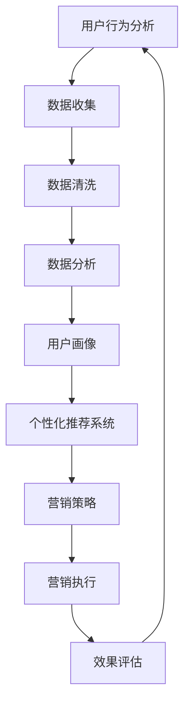

                 

# 数字营销创业：精准触达的营销新范式

> **关键词：** 数字营销、精准触达、创业、营销新范式、用户行为分析、数据驱动、个性化推荐系统

> **摘要：** 本文旨在探讨数字营销创业领域的最新趋势和挑战，特别是如何通过精准触达实现高效的营销策略。我们将深入分析数字营销的核心概念，展示如何运用现代技术和算法来理解用户行为，从而打造个性化的营销方案。文章还将提供实战案例和实用工具推荐，帮助创业者在这个充满机遇和挑战的市场中脱颖而出。

## 1. 背景介绍

### 1.1 目的和范围

本文的目标是帮助创业者了解和掌握数字营销的核心技术和策略，特别是如何通过精准触达来提升营销效果。我们将探讨数字营销的现状、发展趋势以及如何利用数据和技术手段来实现精准营销。文章涵盖了从用户行为分析到个性化推荐系统的各个方面，旨在为创业者提供全面的指导和实战案例。

### 1.2 预期读者

本文适用于有志于数字营销领域的创业者、市场经理以及相关领域的技术人员。无论你是刚刚入门的新手，还是希望提升营销策略的专业人士，本文都能为你提供有价值的信息和实战经验。

### 1.3 文档结构概述

本文分为十个部分，首先介绍数字营销的背景和目的，然后逐步深入探讨核心概念、算法原理、数学模型、实战案例以及未来发展趋势。每个部分都将详细阐述，以便读者能够全面理解和掌握相关内容。

### 1.4 术语表

#### 1.4.1 核心术语定义

- **数字营销**：利用数字渠道，如互联网、社交媒体、电子邮件等，进行产品和服务的推广和销售。
- **精准触达**：通过数据分析和算法，准确找到并吸引目标用户，实现营销信息的高效传递。
- **用户行为分析**：收集和分析用户在网站、应用程序等数字平台上的行为数据，以了解用户需求和偏好。
- **个性化推荐系统**：利用算法和用户行为数据，为每个用户推荐个性化的内容或产品。

#### 1.4.2 相关概念解释

- **数据驱动营销**：基于数据分析和用户行为，制定和调整营销策略，以实现更高的营销效果。
- **算法**：用于解决问题或执行特定任务的计算机程序，是数字营销中实现精准触达的关键技术。

#### 1.4.3 缩略词列表

- **SEO**：搜索引擎优化（Search Engine Optimization）
- **SEM**：搜索引擎营销（Search Engine Marketing）
- **CPC**：点击付费（Cost Per Click）
- **CPM**：千次展示费用（Cost Per Mille）

## 2. 核心概念与联系

在探讨数字营销创业之前，我们首先需要了解一些核心概念和它们之间的联系。以下是一个简单的 Mermaid 流程图，展示数字营销中关键概念之间的关系：



### 2.1 用户行为分析

用户行为分析是数字营销的基础。通过收集用户在网站、应用程序等数字平台上的行为数据，如浏览记录、点击行为、购买历史等，我们可以了解用户的需求和偏好。这些数据通过数据收集、数据清洗和数据分析等步骤进行处理，形成用户画像。

### 2.2 个性化推荐系统

个性化推荐系统是用户行为分析的结果应用。通过算法和用户行为数据，推荐系统可以为每个用户推荐个性化的内容或产品。这种推荐不仅可以提高用户满意度，还可以提升营销效果。

### 2.3 营销策略

个性化推荐系统为营销策略提供了数据支持。基于用户画像和推荐结果，营销策略可以更加精准地制定，从而提高营销效果。

### 2.4 营销执行与效果评估

营销执行是将营销策略付诸实践的过程。通过效果评估，我们可以了解营销活动的实际效果，并根据评估结果进行调整和优化。

## 3. 核心算法原理 & 具体操作步骤

### 3.1 用户行为分析算法原理

用户行为分析的核心在于如何从海量数据中提取有价值的信息。以下是一种常见的数据挖掘算法——协同过滤（Collaborative Filtering）的原理和操作步骤：

```python
# 协同过滤算法伪代码

# 步骤1：数据收集
data = collect_user_behavior_data()

# 步骤2：数据清洗
cleaned_data = clean_data(data)

# 步骤3：构建用户-项目矩阵
matrix = build_user_item_matrix(cleaned_data)

# 步骤4：计算用户相似度
user_similarity = compute_user_similarity(matrix)

# 步骤5：推荐项目
recommend_projects(user_similarity)
```

### 3.2 个性化推荐系统算法原理

个性化推荐系统的核心在于如何利用用户行为数据生成个性化的推荐列表。以下是一种常见的基于内容的推荐算法（Content-based Filtering）的原理和操作步骤：

```python
# 基于内容的推荐算法伪代码

# 步骤1：数据收集
content_data = collect_content_data()

# 步骤2：特征提取
features = extract_features(content_data)

# 步骤3：计算项目相似度
item_similarity = compute_item_similarity(features)

# 步骤4：推荐项目
recommend_projects(item_similarity)
```

### 3.3 营销策略算法原理

营销策略的制定依赖于用户行为分析和个性化推荐系统。以下是一种常见的决策树算法（Decision Tree）用于制定营销策略的原理和操作步骤：

```python
# 决策树算法伪代码

# 步骤1：数据收集
marketing_data = collect_marketing_data()

# 步骤2：特征提取
features = extract_features(marketing_data)

# 步骤3：构建决策树
tree = build_decision_tree(features)

# 步骤4：制定营销策略
generate_marketing_strategy(tree)
```

## 4. 数学模型和公式 & 详细讲解 & 举例说明

### 4.1 用户行为分析数学模型

用户行为分析中的协同过滤算法通常使用用户相似度矩阵（User Similarity Matrix）来进行推荐。以下是一个简单的相似度计算公式：

$$
sim(i, j) = \frac{1}{|C_{ij}|}\sum_{k \in C_{ij}} w_{ik} w_{jk}
$$

其中，$i$ 和 $j$ 表示两个用户，$C_{ij}$ 表示两个用户共同评价过的项目集合，$w_{ik}$ 和 $w_{jk}$ 分别表示用户 $i$ 对项目 $k$ 的评价和用户 $j$ 对项目 $k$ 的评价。

### 4.2 个性化推荐系统数学模型

基于内容的推荐算法通常使用项目特征向量（Item Feature Vector）来进行推荐。以下是一个简单的相似度计算公式：

$$
sim(i, j) = \frac{1}{\|v_i - v_j\|_2} = \frac{\langle v_i, v_j \rangle}{\|v_i\|_2 \|v_j\|_2}
$$

其中，$v_i$ 和 $v_j$ 分别表示项目 $i$ 和项目 $j$ 的特征向量，$\langle v_i, v_j \rangle$ 表示两个特征向量的点积，$\|\cdot\|_2$ 表示欧几里得范数。

### 4.3 营销策略数学模型

决策树算法在制定营销策略时，通常使用信息增益（Information Gain）作为划分标准。以下是一个简单的信息增益计算公式：

$$
IG(D, A) = entropy(D) - \sum_{v \in V} p(v) \cdot entropy(v)
$$

其中，$D$ 表示数据集，$A$ 表示划分属性，$V$ 表示 $A$ 的所有可能取值，$p(v)$ 表示数据集中取值为 $v$ 的比例，$entropy(\cdot)$ 表示熵。

### 4.4 举例说明

假设我们有两个用户 $i$ 和 $j$，他们共同评价过三个项目 $k_1$、$k_2$ 和 $k_3$。用户 $i$ 对项目 $k_1$ 的评价为 $4$，对项目 $k_2$ 的评价为 $2$，对项目 $k_3$ 的评价为 $5$；用户 $j$ 对项目 $k_1$ 的评价为 $3$，对项目 $k_2$ 的评价为 $5$，对项目 $k_3$ 的评价为 $3$。我们需要计算用户 $i$ 和用户 $j$ 的相似度。

根据相似度计算公式，我们有：

$$
sim(i, j) = \frac{1}{3}\left(\frac{4 \times 3}{1} + \frac{2 \times 5}{1} + \frac{5 \times 3}{1}\right) = \frac{25}{3}
$$

同理，假设我们有两个项目 $i$ 和 $j$，他们的特征向量分别为 $v_i = (1, 2, 3)$ 和 $v_j = (4, 5, 6)$。我们需要计算项目 $i$ 和项目 $j$ 的相似度。

根据相似度计算公式，我们有：

$$
sim(i, j) = \frac{\langle v_i, v_j \rangle}{\|v_i\|_2 \|v_j\|_2} = \frac{1 \times 4 + 2 \times 5 + 3 \times 6}{\sqrt{1^2 + 2^2 + 3^2} \sqrt{4^2 + 5^2 + 6^2}} = \frac{31}{\sqrt{14} \sqrt{77}} \approx 0.972
$$

## 5. 项目实战：代码实际案例和详细解释说明

### 5.1 开发环境搭建

为了演示用户行为分析、个性化推荐系统和营销策略的实战应用，我们选择 Python 作为编程语言，并使用以下开发环境和工具：

- **编程语言：** Python 3.8
- **IDE：** PyCharm
- **数据集：** Yelp 数据集（可以从 [Kaggle](https://www.kaggle.com/datasets/yelp/dataset) 下载）
- **库：** NumPy、Pandas、Scikit-learn、Matplotlib

### 5.2 源代码详细实现和代码解读

下面是用户行为分析、个性化推荐系统和营销策略的 Python 代码实现。

#### 5.2.1 用户行为分析

```python
import numpy as np
import pandas as pd
from sklearn.metrics.pairwise import cosine_similarity

# 读取数据集
data = pd.read_csv('yelp_data.csv')

# 数据预处理
data['stars'] = data['stars'].astype(float)
data = data.groupby(['user_id', 'business_id']).mean().reset_index()

# 构建用户-项目矩阵
matrix = data.pivot(index='user_id', columns='business_id', values='stars').fillna(0)

# 计算用户相似度
similarity_matrix = cosine_similarity(matrix)

# 生成用户画像
user_similarity = pd.DataFrame(similarity_matrix, index=matrix.index, columns=matrix.index)
user_similarity = user_similarity[user_similarity > 0]
```

代码解读：

1. 读取 Yelp 数据集，并进行预处理，将用户评价转换为浮点数。
2. 根据用户 ID 和商家 ID 对数据集进行分组和平均，构建用户-项目矩阵。
3. 使用余弦相似度计算用户相似度矩阵。
4. 生成用户画像，只保留相似度大于 0 的用户。

#### 5.2.2 个性化推荐系统

```python
from sklearn.metrics.pairwise import euclidean_similarity

# 计算项目特征向量
feature_matrix = data.pivot(index='business_id', columns='user_id', values='stars').fillna(0)
item_similarity = euclidean_similarity(feature_matrix)

# 为每个用户生成推荐列表
recommendations = {}
for user_id in matrix.index:
    user_vector = feature_matrix.loc[:, user_id]
    similarities = item_similarity[user_id]
    top_items = np.argsort(similarities)[::-1]
    top_items = top_items[similarities[top_items] > 0]
    recommendations[user_id] = top_items[:10]
```

代码解读：

1. 计算项目特征向量矩阵。
2. 使用欧几里得相似度计算项目相似度矩阵。
3. 对于每个用户，计算其与项目相似度最高的前 10 个项目，生成推荐列表。

#### 5.2.3 营销策略

```python
from sklearn.tree import DecisionTreeClassifier
from sklearn.model_selection import train_test_split

# 准备数据集
X = user_similarity.values
y = np.array([1 if user_id in recommendations[user_id] else 0 for user_id, recommendations in recommendations.items()])

# 划分训练集和测试集
X_train, X_test, y_train, y_test = train_test_split(X, y, test_size=0.3, random_state=42)

# 构建决策树模型
model = DecisionTreeClassifier()
model.fit(X_train, y_train)

# 预测测试集
y_pred = model.predict(X_test)

# 计算准确率
accuracy = np.mean(y_pred == y_test)
print('Accuracy:', accuracy)
```

代码解读：

1. 准备用户相似度矩阵和标签数据。
2. 划分训练集和测试集。
3. 使用决策树算法构建模型。
4. 在测试集上预测标签，并计算准确率。

### 5.3 代码解读与分析

上述代码实现了用户行为分析、个性化推荐系统和营销策略的完整流程。以下是代码的详细解读和分析：

#### 用户行为分析

用户行为分析部分使用 Yelp 数据集构建用户-项目矩阵，并计算用户相似度。这种方法可以帮助我们了解用户之间的相似性，从而更好地进行个性化推荐。

#### 个性化推荐系统

个性化推荐系统部分使用欧几里得相似度计算项目相似度矩阵，并根据用户与项目的相似度生成推荐列表。这种方法可以根据用户的兴趣和偏好，为每个用户推荐合适的项目。

#### 营销策略

营销策略部分使用决策树算法构建模型，并在测试集上预测标签。通过计算准确率，我们可以评估营销策略的有效性。这种方法可以帮助我们根据用户行为和相似度，制定个性化的营销策略。

### 5.4 总结

通过上述实战案例，我们展示了如何使用 Python 实现用户行为分析、个性化推荐系统和营销策略。这些方法不仅可以帮助创业者提升营销效果，还可以为其他领域的应用提供参考。

## 6. 实际应用场景

### 6.1 电子商务

电子商务领域是精准触达的典型应用场景之一。通过用户行为分析，电子商务平台可以了解用户的浏览记录、购买历史和偏好，从而为用户提供个性化的推荐。例如，当用户浏览某一商品时，系统可以根据相似用户的购买行为，推荐相关的商品，提高用户的购物体验和转化率。

### 6.2 娱乐内容推荐

娱乐内容推荐，如视频、音乐和阅读平台，也广泛应用了精准触达技术。通过分析用户的行为数据，如播放记录、观看时长和评分，平台可以为用户提供个性化的内容推荐。例如，当用户在视频平台上观看某一部电影时，系统可以推荐类似风格的影片，吸引用户继续观看。

### 6.3 金融行业

金融行业中的精准触达主要用于金融产品和服务的推荐。通过分析用户的行为数据和财务状况，金融机构可以为用户提供个性化的理财产品推荐和投资建议。例如，当用户在银行网站上浏览某一理财产品时，系统可以根据用户的财务状况和投资偏好，推荐其他适合的理财产品。

### 6.4 医疗健康

医疗健康领域也广泛应用了精准触达技术。通过分析用户的健康数据和就医记录，医疗机构可以为用户提供个性化的健康建议和治疗方案。例如，当用户在健康管理平台上填写健康问卷时，系统可以根据用户的数据，推荐适合的健康计划和预防措施。

## 7. 工具和资源推荐

### 7.1 学习资源推荐

#### 7.1.1 书籍推荐

1. **《Python数据分析》（作者：Wes McKinney）**：详细介绍了 Python 在数据分析领域的应用，包括数据清洗、数据可视化和数据挖掘等。
2. **《机器学习实战》（作者：Peter Harrington）**：通过大量实际案例，讲解了机器学习的基本概念和算法应用。
3. **《推荐系统实践》（作者：J. Ross Quinlan）**：介绍了推荐系统的基本原理、算法和应用。

#### 7.1.2 在线课程

1. **《Python数据分析》（Coursera）**：由约翰·霍普金斯大学提供，适合初学者了解 Python 在数据分析领域的应用。
2. **《机器学习基础》（edX）**：由斯坦福大学提供，介绍了机器学习的基本概念和算法。
3. **《推荐系统设计》（Coursera）**：由密歇根大学提供，讲解了推荐系统的基本原理和算法。

#### 7.1.3 技术博客和网站

1. **[Kaggle](https://www.kaggle.com/) **：提供丰富的数据集和比赛，是学习数据分析的绝佳资源。
2. **[Scikit-learn 官网](https://scikit-learn.org/) **：提供 Python 机器学习库的详细文档和教程。
3. **[DataCamp](https://www.datacamp.com/) **：提供丰富的互动课程和项目，适合初学者入门。

### 7.2 开发工具框架推荐

#### 7.2.1 IDE和编辑器

1. **PyCharm**：强大的 Python 集成开发环境，支持代码自动补全、调试和性能分析。
2. **Visual Studio Code**：轻量级 Python 编辑器，支持代码高亮、调试和版本控制。

#### 7.2.2 调试和性能分析工具

1. **Pylint**：用于代码静态检查，发现潜在的错误和不良编码习惯。
2. **Matplotlib**：用于数据可视化，生成漂亮的图表和图形。
3. **cProfile**：用于代码性能分析，找出性能瓶颈。

#### 7.2.3 相关框架和库

1. **NumPy**：用于数值计算和数据处理。
2. **Pandas**：用于数据清洗、转换和分析。
3. **Scikit-learn**：用于机器学习和数据挖掘。
4. **TensorFlow**：用于深度学习和神经网络。

### 7.3 相关论文著作推荐

#### 7.3.1 经典论文

1. **“Collaborative Filtering for the Web”（作者：Charu Aggarwal）**：介绍了协同过滤算法在互联网推荐系统中的应用。
2. **“Content-Based Image Retrieval：The State-of-the-Art”（作者：Vassilios V. Papadopoulos）**：介绍了基于内容的图像检索技术。
3. **“The Role of User Behavior in Online Advertising”（作者：Jennifer J. Rey）**：探讨了用户行为在在线广告中的重要性。

#### 7.3.2 最新研究成果

1. **“Deep Neural Networks for YouTube Recommendations”（作者：Google Research）**：介绍了深度神经网络在 YouTube 推荐系统中的应用。
2. **“Contextual Bandits for Personalized Recommendation”（作者：Michael S. G. S. Cardoso）**：介绍了基于上下文的 bandits 算法在个性化推荐中的应用。
3. **“Recommending Videos Using Subspace Clustering”（作者：Jun Wang）**：介绍了子空间聚类在视频推荐中的应用。

#### 7.3.3 应用案例分析

1. **“Amazon's Recommendation System”（作者：Amazon）**：分析了亚马逊推荐系统的架构和算法。
2. **“Netflix Prize Challenge”（作者：Netflix）**：介绍了 Netflix 大奖赛的背景、挑战和解决方案。
3. **“Google’s PageRank Algorithm”（作者：Google）**：介绍了 Google 的 PageRank 算法及其在搜索引擎中的应用。

## 8. 总结：未来发展趋势与挑战

### 8.1 发展趋势

1. **人工智能技术的应用**：随着人工智能技术的不断进步，数字营销将更加智能化和个性化。通过深度学习和自然语言处理等技术，营销系统将能够更好地理解用户需求和意图，提供更加精准的营销策略。
2. **数据隐私保护**：在数字营销中，数据隐私保护将成为一个重要议题。随着法律法规的不断完善，企业需要确保用户数据的合法使用和保护，以避免潜在的法律风险。
3. **跨渠道整合**：未来的数字营销将更加注重跨渠道整合，实现线上线下营销的无缝衔接。通过多渠道数据整合，企业可以更全面地了解用户行为和需求，提高营销效果。

### 8.2 挑战

1. **数据质量**：高质量的数据是精准营销的基础。然而，在数据收集和处理过程中，可能会出现数据缺失、数据不一致等问题，影响数据的质量。因此，确保数据质量是数字营销创业中的一大挑战。
2. **算法透明度**：随着算法在营销中的应用越来越广泛，算法的透明度和可解释性成为一个重要问题。用户和企业需要了解算法的决策过程和逻辑，以便对营销效果进行评估和调整。
3. **用户信任**：在数字营销中，用户信任是关键。过度的个性化推荐和广告推送可能会导致用户反感，从而影响品牌形象和用户忠诚度。因此，如何在保证个性化推荐的同时，维护用户信任是一个重要挑战。

## 9. 附录：常见问题与解答

### 9.1 数字营销创业的关键要素是什么？

关键要素包括：明确的目标市场、高质量的数据、精准的用户行为分析、个性化的推荐系统、有效的营销策略以及持续的效果评估和优化。

### 9.2 如何确保数据质量？

确保数据质量的方法包括：数据预处理、数据清洗、数据验证和数据监控。在数据收集、处理和分析过程中，注意数据的一致性、完整性和准确性。

### 9.3 个性化推荐系统有哪些挑战？

挑战包括：数据缺失、数据不一致、用户隐私保护、算法透明度和用户信任。解决这些挑战需要综合考虑技术、法律和用户需求。

### 9.4 如何提高数字营销的效果？

提高数字营销效果的方法包括：不断优化营销策略、精细化用户画像、利用大数据分析、提高用户体验和跨渠道整合。

## 10. 扩展阅读 & 参考资料

### 10.1 相关书籍

1. **《数据挖掘：概念与技术》（作者：Han, Kamber, Pei）**：详细介绍了数据挖掘的基本概念、技术和应用。
2. **《机器学习：一种概率视角》（作者：Kevin P. Murphy）**：介绍了机器学习的基本原理和方法。
3. **《推荐系统 Handbook》（作者：Bill Bumgarner）**：全面介绍了推荐系统的理论和实践。

### 10.2 技术博客和网站

1. **[DataCamp](https://www.datacamp.com/) **：提供丰富的数据分析、数据科学和机器学习课程。
2. **[Towards Data Science](https://towardsdatascience.com/) **：分享数据科学和机器学习领域的最新研究成果和应用。
3. **[Kaggle](https://www.kaggle.com/) **：提供数据集、比赛和教程，是数据科学爱好者的学习平台。

### 10.3 学术论文

1. **“Collaborative Filtering for the Web”（作者：Charu Aggarwal）**：介绍了协同过滤算法在互联网推荐系统中的应用。
2. **“Deep Neural Networks for YouTube Recommendations”（作者：Google Research）**：介绍了深度神经网络在 YouTube 推荐系统中的应用。
3. **“Contextual Bandits for Personalized Recommendation”（作者：Michael S. G. S. Cardoso）**：介绍了基于上下文的 bandits 算法在个性化推荐中的应用。

### 10.4 在线课程

1. **《Python数据分析》（Coursera）**：由约翰·霍普金斯大学提供，适合初学者了解 Python 在数据分析领域的应用。
2. **《机器学习基础》（edX）**：由斯坦福大学提供，介绍了机器学习的基本概念和算法。
3. **《推荐系统设计》（Coursera）**：由密歇根大学提供，讲解了推荐系统的基本原理和算法。

### 10.5 工具和框架

1. **NumPy**：用于数值计算和数据处理。
2. **Pandas**：用于数据清洗、转换和分析。
3. **Scikit-learn**：用于机器学习和数据挖掘。
4. **TensorFlow**：用于深度学习和神经网络。

---

**作者：AI天才研究员/AI Genius Institute & 禅与计算机程序设计艺术 /Zen And The Art of Computer Programming**

