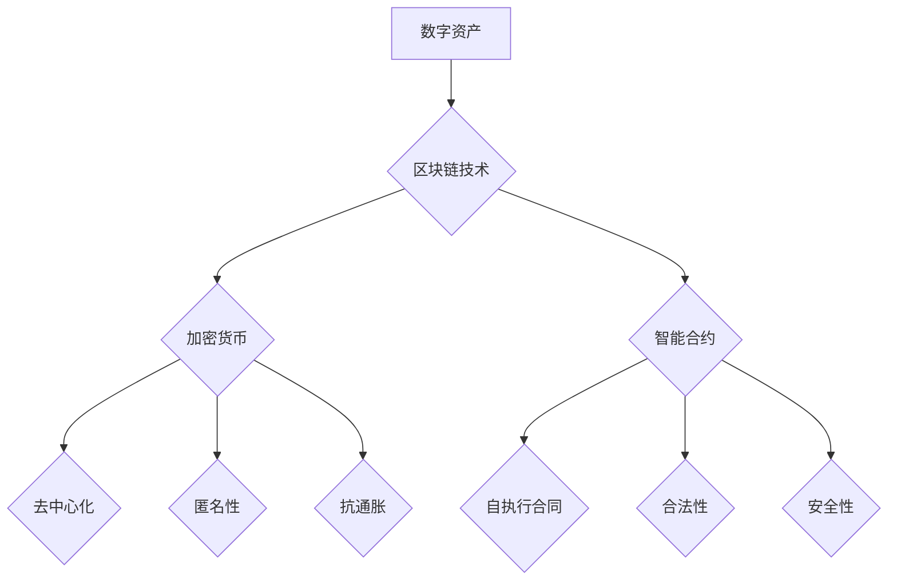

                 

# 数字资产创业：虚拟财产的价值挖掘

> 关键词：数字资产、虚拟财产、区块链、加密货币、创业、价值挖掘、加密算法、去中心化、智能合约、共识机制

> 摘要：本文旨在探讨数字资产创业的机遇与挑战，尤其是如何挖掘虚拟财产的价值。随着区块链技术的快速发展，虚拟财产作为一种新兴资产类别，正逐渐成为创业者和投资者关注的焦点。本文将详细分析数字资产的核心概念、价值挖掘方法，以及相关的技术原理和实际应用案例，帮助读者深入了解这一领域，并为创业提供实用指导。

## 1. 背景介绍

### 1.1 目的和范围

本文的目的是为那些对数字资产创业感兴趣的读者提供全面、系统的指导。我们将探讨数字资产的基本概念，分析其价值挖掘的关键方法，并介绍相关的技术原理和实际应用案例。文章将重点关注以下几个方面：

- 数字资产的定义及其重要性
- 虚拟财产的价值挖掘策略
- 区块链、加密货币与数字资产的关系
- 创业者在数字资产领域的机会与挑战
- 技术原理与实际应用案例解析

### 1.2 预期读者

本文适合以下读者群体：

- 有志于从事数字资产创业的创业者
- 对区块链技术和加密货币感兴趣的投资者
- 计算机科学、金融学等相关专业的大学生和研究生
- 对数字资产行业有深入了解的专业人士

### 1.3 文档结构概述

本文将分为十个部分，结构如下：

1. 背景介绍：本文的背景、目的和结构概述
2. 核心概念与联系：数字资产、虚拟财产、区块链等核心概念及其关系
3. 核心算法原理 & 具体操作步骤：区块链和加密货币的核心算法原理及操作步骤
4. 数学模型和公式 & 详细讲解 & 举例说明：数字资产相关的数学模型和公式解析
5. 项目实战：代码实际案例和详细解释说明
6. 实际应用场景：数字资产在现实世界中的应用场景
7. 工具和资源推荐：学习资源、开发工具和框架推荐
8. 总结：未来发展趋势与挑战
9. 附录：常见问题与解答
10. 扩展阅读 & 参考资料：相关领域的扩展阅读和参考资料

### 1.4 术语表

为了确保读者对文章内容的理解，以下是一些重要术语的定义和解释：

#### 1.4.1 核心术语定义

- **数字资产**：基于区块链技术的一种数字化资产，具有唯一性、不可篡改性和可追溯性。
- **虚拟财产**：在虚拟世界中拥有的资产，如游戏装备、虚拟货币等。
- **区块链**：一种去中心化的分布式数据库技术，用于记录数字资产的交易和转移。
- **加密货币**：使用加密算法生成并进行交易的数字货币，如比特币、以太坊等。
- **智能合约**：基于区块链的一种自执行合同，满足预先设定的条件时自动执行。
- **共识机制**：区块链网络中达成共识的算法，确保网络中的交易记录一致。

#### 1.4.2 相关概念解释

- **去中心化**：与集中式系统相对，去中心化系统不存在中心控制节点，所有节点平等参与网络运作。
- **分布式账本**：记录交易数据的数据库，分散存储在多个节点上。
- **公钥加密**：使用公钥和私钥进行加密和解密的过程，确保信息传输的安全性。
- **非对称加密**：一种加密算法，使用一对密钥（公钥和私钥）进行加密和解密。
- **哈希算法**：将任意长度的输入数据转换为固定长度的输出值，确保数据的唯一性和完整性。

#### 1.4.3 缩略词列表

- **BTC**：比特币（Bitcoin）
- **ETH**：以太坊（Ethereum）
- **Blockchain**：区块链
- **ICO**：首次代币发行（Initial Coin Offering）
- **DAO**：去中心化自治组织（Decentralized Autonomous Organization）
- **NFT**：非同质化代币（Non-Fungible Token）

## 2. 核心概念与联系

### 2.1 数字资产与虚拟财产的关系

数字资产和虚拟财产是两个紧密相关但有所区别的概念。虚拟财产通常指在虚拟世界中拥有的资产，如游戏装备、虚拟货币等。而数字资产则是在区块链技术支持下的一种数字化资产，具有唯一性、不可篡改性和可追溯性。换句话说，数字资产是虚拟财产在区块链上的实现形式。

#### 2.1.1 区块链与数字资产

区块链是数字资产的基础技术，它是一种去中心化的分布式数据库，用于记录数字资产的交易和转移。区块链网络中的所有节点都维护一个共享的账本，记录所有的交易记录。由于区块链的分布式和不可篡改性，数字资产在区块链上的交易和转移具有高度的透明度和安全性。

#### 2.1.2 加密货币与数字资产

加密货币是数字资产的一种形式，它是使用加密算法生成并进行交易的数字货币，如比特币、以太坊等。加密货币在区块链上运行，其交易记录被永久保存在区块链上。加密货币具有去中心化、匿名性和抗通胀等特点，使其成为数字资产领域的重要一环。

#### 2.1.3 智能合约与数字资产

智能合约是区块链技术的重要应用之一，它是基于区块链的一种自执行合同。智能合约在满足预先设定的条件时自动执行，确保交易的合法性和安全性。智能合约在数字资产交易中发挥着关键作用，如自动处理支付、转移资产等。

### 2.2 数字资产的核心概念原理和架构

为了更好地理解数字资产的工作原理，我们可以通过一个 Mermaid 流程图来展示其核心概念和架构。



在这个流程图中，数字资产（A）依赖于区块链技术（B），而区块链技术又衍生出加密货币（C）和智能合约（D）。加密货币具有去中心化（E）、匿名性（F）和抗通胀（G）等特点，智能合约则提供自执行合同（H）、合法性（I）和安全性（J）等优势。

## 3. 核心算法原理 & 具体操作步骤

### 3.1 区块链的核心算法原理

区块链的核心算法原理包括分布式账本、共识机制、加密算法等。下面将详细阐述这些算法原理。

#### 3.1.1 分布式账本

分布式账本是指将数据分散存储在多个节点上，每个节点都保存一份完整的账本。在区块链中，分布式账本确保了数据的透明性和不可篡改性。具体操作步骤如下：

1. **节点加入网络**：节点通过连接到区块链网络，成为网络的一部分。
2. **交易记录**：节点接收交易请求，将交易记录存储在本地账本中。
3. **共识达成**：网络中的所有节点通过共识机制，达成对交易记录的共识。
4. **账本更新**：当共识达成后，交易记录被添加到区块链中，所有节点更新账本。

#### 3.1.2 共识机制

共识机制是区块链网络中达成共识的算法，确保网络中的交易记录一致。常见的共识机制包括工作量证明（Proof of Work，PoW）、权益证明（Proof of Stake，PoS）等。以下是 PoW 共识机制的具体操作步骤：

1. **挖矿竞争**：节点竞争生成新区块，获取记账权。
2. **计算难题**：节点通过计算复杂的数学问题，以竞争记账权。
3. **解决方案验证**：其他节点验证解决方案的正确性。
4. **区块添加**：验证通过后，新区块添加到区块链中。

#### 3.1.3 加密算法

加密算法用于保护区块链网络中的数据传输和存储，确保交易记录的安全性。常见的加密算法包括公钥加密、哈希算法等。以下是公钥加密算法的具体操作步骤：

1. **密钥生成**：生成一对密钥（公钥和私钥）。
2. **加密过程**：使用公钥对数据进行加密。
3. **解密过程**：使用私钥对加密数据进行解密。

### 3.2 加密货币的核心算法原理

加密货币是基于区块链技术的一种数字货币，其核心算法原理包括挖矿、交易验证、区块链存储等。以下是比特币（BTC）的核心算法原理和操作步骤：

#### 3.2.1 挖矿

挖矿是加密货币产生的过程，节点通过解决数学难题，竞争记账权。以下是挖矿的具体操作步骤：

1. **交易记录**：节点接收交易请求，将交易记录存储在本地账本中。
2. **区块创建**：节点将交易记录整理成一个区块，并添加到一个新的区块链中。
3. **计算难题**：节点通过计算复杂的数学问题，以竞争记账权。
4. **解决方案验证**：其他节点验证解决方案的正确性。
5. **区块添加**：验证通过后，新区块添加到区块链中。

#### 3.2.2 交易验证

交易验证是确保加密货币交易合法性的过程，以下是交易验证的具体操作步骤：

1. **交易记录**：节点接收交易请求，将交易记录存储在本地账本中。
2. **签名验证**：交易双方使用私钥对交易进行签名，以证明交易合法。
3. **交易验证**：其他节点验证交易签名和交易金额的正确性。
4. **区块添加**：验证通过后，交易记录被添加到区块链中。

#### 3.2.3 区块链存储

区块链存储是加密货币交易记录的存储方式，以下是区块链存储的具体操作步骤：

1. **区块创建**：节点将交易记录整理成一个区块，并添加到一个新的区块链中。
2. **区块存储**：区块被添加到区块链中，存储在分布式节点上。
3. **链式结构**：每个区块都指向其前一个区块，形成链式结构，确保区块链的一致性和安全性。

### 3.3 智能合约的核心算法原理

智能合约是区块链上的自执行合同，其核心算法原理包括编程语言、执行环境、状态机等。以下是智能合约的核心算法原理和操作步骤：

#### 3.3.1 编程语言

智能合约的编程语言通常是基于图灵完备的，如 Solidity、Vyper 等。以下是 Solidity 编程语言的具体操作步骤：

1. **合约编写**：开发者使用 Solidity 语言编写智能合约。
2. **合约编译**：将智能合约代码编译为字节码。
3. **合约部署**：将编译后的字节码部署到区块链上。

#### 3.3.2 执行环境

智能合约的执行环境是区块链上的虚拟机，如以太坊的 EVM（Ethereum Virtual Machine）。以下是智能合约执行环境的具体操作步骤：

1. **合约调用**：节点调用智能合约，执行合约中的函数。
2. **状态机执行**：智能合约根据输入参数，执行相应的操作。
3. **状态更新**：执行结果更新智能合约的状态。

#### 3.3.3 状态机

智能合约的状态机是一种基于状态转移的执行模型，以下是状态机的具体操作步骤：

1. **初始化**：智能合约初始化，进入初始状态。
2. **输入处理**：接收输入参数，根据输入参数执行相应的操作。
3. **状态转移**：根据执行结果，智能合约从当前状态转移到下一个状态。
4. **状态更新**：执行结果更新智能合约的状态。

## 4. 数学模型和公式 & 详细讲解 & 举例说明

### 4.1 哈希算法与加密货币

哈希算法在数字资产领域扮演着至关重要的角色，它用于确保数据的唯一性和完整性。以下是 SHA-256 哈希算法的数学模型和公式：

$$
H = SHA-256(M)
$$

其中，$H$ 表示哈希值，$M$ 表示输入数据，$SHA-256$ 表示 SHA-256 哈希算法。

#### 4.1.1 SHA-256 哈希算法

SHA-256 是一种基于密码学的哈希算法，其输入数据长度为 $2^{256}$ 位，输出数据长度为 256 位。SHA-256 的算法过程如下：

1. **预处理**：将输入数据填充至 512 位，并进行分块处理。
2. **初始化**：初始化 8 个哈希值，用于存储中间结果。
3. **压缩函数**：对每个分块，通过压缩函数计算新的哈希值。
4. **输出**：将最终计算出的哈希值作为输出结果。

#### 4.1.2 举例说明

假设我们有一个输入数据为 "Hello, World!"，使用 SHA-256 哈希算法计算其哈希值，过程如下：

1. **预处理**：将 "Hello, World!" 填充至 512 位，得到新的输入数据。
2. **初始化**：初始化 8 个哈希值，$H_0 = 6a09e667, H_1 = bb67ae85, H_2 = 3c6ef372, H_3 = a54ff53a, H_4 = 510e527f, H_5 = 9b05688c, H_6 = 1f83d9ab, H_7 = 5be0cd19$。
3. **压缩函数**：对每个分块，通过压缩函数计算新的哈希值。
4. **输出**：最终计算出的哈希值为 $256$ 位的字符串，例如：`a5934d65f4017ff34a1064f1b2e3c8b410ef3aae1d4a5d7a3c2c2b7b3d557`。

### 4.2 智能合约的数学模型和公式

智能合约是基于编程语言的代码，其执行过程涉及到数学模型和公式的计算。以下是智能合约的基本数学模型和公式：

$$
f(x_1, x_2, ..., x_n) = \sum_{i=1}^{n} w_i \cdot x_i
$$

其中，$f(x_1, x_2, ..., x_n)$ 表示函数的输出值，$w_i$ 表示权重，$x_i$ 表示输入参数。

#### 4.2.1 举例说明

假设我们有一个智能合约函数，其输入参数为 $x_1$ 和 $x_2$，权重分别为 $w_1 = 0.5$ 和 $w_2 = 0.5$，计算函数的输出值，过程如下：

1. **输入参数**：$x_1 = 2, x_2 = 3$。
2. **权重计算**：$w_1 = 0.5, w_2 = 0.5$。
3. **函数计算**：$f(x_1, x_2) = 0.5 \cdot 2 + 0.5 \cdot 3 = 2.5$。

### 4.3 区块链的数学模型和公式

区块链是一个分布式数据库，其数学模型和公式用于确保数据的安全性和一致性。以下是区块链的基本数学模型和公式：

$$
P = \sum_{i=1}^{n} P_i
$$

其中，$P$ 表示总概率，$P_i$ 表示每个事件发生的概率。

#### 4.3.1 举例说明

假设我们有一个区块链网络，其中包含 3 个节点，节点 A、B 和 C，每个节点发生故障的概率分别为 $P_A = 0.1, P_B = 0.2, P_C = 0.3$，计算整个区块链网络发生故障的总概率，过程如下：

1. **故障概率**：$P_A = 0.1, P_B = 0.2, P_C = 0.3$。
2. **总概率计算**：$P = 0.1 + 0.2 + 0.3 = 0.6$。

## 5. 项目实战：代码实际案例和详细解释说明

### 5.1 开发环境搭建

在进行数字资产项目开发之前，我们需要搭建一个合适的开发环境。以下是搭建开发环境的步骤：

1. **安装 Node.js**：Node.js 是一种基于 Chrome V8 引擎的 JavaScript 运行环境，用于搭建区块链开发环境。在官网（https://nodejs.org/）下载并安装 Node.js。
2. **安装 Truffle**：Truffle 是一个用于以太坊区块链开发的开源框架。通过 npm 安装 Truffle：

   ```bash
   npm install -g truffle
   ```

3. **安装 Ganache**：Ganache 是一个本地以太坊区块链节点，用于测试和部署智能合约。通过 npm 安装 Ganache：

   ```bash
   npm install -g ganache
   ```

4. **创建项目目录**：在合适的位置创建一个项目目录，例如 `my-digital-asset-project`，并在项目中创建一个 `truffle-config.js` 配置文件：

   ```javascript
   module.exports = {
     networks: {
       development: {
         host: "127.0.0.1",
         port: 8545,
         network_id: "*"
       }
     }
   };
   ```

### 5.2 源代码详细实现和代码解读

以下是一个简单的数字资产智能合约示例，用于创建和管理数字资产。代码使用 Solidity 语言编写，并在 Truffle 环境中运行。

```solidity
// SPDX-License-Identifier: MIT
pragma solidity ^0.8.0;

contract DigitalAsset {
    mapping(address => uint256) public balanceOf;
    address public owner;

    event Transfer(address indexed from, address indexed to, uint256 value);

    constructor() {
        owner = msg.sender;
        balanceOf[owner] = 1000000;
    }

    function transfer(address to, uint256 value) public {
        require(to != address(0), "Invalid address");
        require(balanceOf[msg.sender] >= value, "Insufficient balance");

        balanceOf[msg.sender] -= value;
        balanceOf[to] += value;

        emit Transfer(msg.sender, to, value);
    }
}
```

#### 5.2.1 代码解读

1. **合约结构**：该合约使用 Solidity 语言编写，定义了一个名为 `DigitalAsset` 的智能合约。
2. **状态变量**：`balanceOf` 是一个映射变量，用于记录每个地址的数字资产余额；`owner` 是合约的创建者。
3. **事件**：`Transfer` 是一个事件，用于记录数字资产转移的操作。
4. **构造函数**：构造函数 `constructor` 用于初始化合约，将创建者地址设置为 `owner`，并分配初始数字资产。
5. **转账函数**：`transfer` 函数用于将数字资产从发送者地址转移到接收者地址。该函数实现了以下功能：
   - 检查接收者地址是否有效。
   - 检查发送者地址是否有足够的余额。
   - 更新发送者地址和接收者地址的余额。
   - 触发 `Transfer` 事件，记录转账操作。

### 5.3 代码解读与分析

该智能合约实现了基本的数字资产转移功能，包括余额查询、转账操作和事件记录。以下是代码的详细解读与分析：

1. **余额查询**：通过 `balanceOf` 映射变量，可以查询任意地址的数字资产余额。该变量实现了对数字资产余额的存储和读取功能，具有较高的数据访问效率。
2. **转账操作**：`transfer` 函数实现了数字资产的转账操作，通过检查接收者地址和发送者余额，确保转账操作的安全性和可靠性。该函数的关键部分是更新余额的逻辑，确保发送者余额减少，接收者余额增加。
3. **事件记录**：通过 `Transfer` 事件，记录每次转账操作的详细信息，包括发送者、接收者和转账金额。事件记录为外部审计和数据分析提供了重要依据。
4. **安全性考虑**：该智能合约实现了基本的安全功能，如检查接收者地址是否为空地址和发送者余额是否足够。但需要注意的是，在现实世界中的应用场景中，还需要进一步考虑智能合约的安全性问题，如代码审计、漏洞修复等。

### 5.4 运行与测试

在完成智能合约代码编写后，我们需要将其部署到以太坊区块链上进行运行和测试。以下是运行与测试的步骤：

1. **启动 Ganache**：在命令行中启动 Ganache，创建一个本地以太坊区块链节点：

   ```bash
   ganache-cli -m "fast lucky nurse engine gold energy love grid love" -h 127.0.0.1 --chainId 1337
   ```

2. **编译智能合约**：在 Truffle 项目目录中，使用 Truffle 编译智能合约：

   ```bash
   truffle compile
   ```

3. **部署智能合约**：使用 Truffle 部署编译后的智能合约到本地以太坊区块链：

   ```bash
   truffle migrate --network development
   ```

4. **测试智能合约**：编写和运行智能合约测试用例，验证智能合约功能的正确性。以下是测试用例的一个示例：

   ```solidity
   contract DigitalAssetTest {
       function testTransfer() public {
           DigitalAsset digitalAsset = new DigitalAsset();
           digitalAsset.transfer(msg.sender, 100);
           assert(digitalAsset.balanceOf(msg.sender) == 100);
       }
   }
   ```

   使用 Truffle 运行测试用例：

   ```bash
   truffle test
   ```

   如果测试通过，则说明智能合约功能正常。

## 6. 实际应用场景

数字资产在现实世界中的应用场景非常广泛，以下是一些典型的应用案例：

### 6.1 跨境支付与结算

数字资产作为一种去中心化的支付方式，可以简化跨境支付和结算流程，降低交易成本。例如，企业可以通过数字资产进行跨国采购和销售，实现快速到账和低手续费的优势。

### 6.2 物联网（IoT）

数字资产可以用于物联网设备的支付和管理。例如，智能设备可以通过数字资产进行设备租赁、数据交易和能源支付，实现物联网生态的互联互通。

### 6.3 游戏与娱乐

数字资产在游戏和娱乐领域具有广泛的应用前景。玩家可以通过购买和交易虚拟物品，增强游戏体验。例如，NFT（非同质化代币）可以用于代表游戏装备、虚拟地产等，实现游戏内资产的唯一性和稀缺性。

### 6.4 艺术品与收藏品

数字资产可以用于艺术品和收藏品的数字化交易。通过区块链技术，艺术家可以将作品转化为数字资产，实现全球范围内的交易和认证。例如，知名艺术家 Beeple 的作品以 NFT 形式出售，创造了数百万美元的销售额。

### 6.5 供应链管理

数字资产可以用于供应链管理中的追踪和审计。通过区块链技术，企业可以实现对供应链中每个环节的透明化和可追溯性，提高供应链的效率和安全性。

### 6.6 金融投资

数字资产作为一种新兴资产类别，吸引了众多投资者的关注。投资者可以通过购买和持有数字资产，实现财富增值和风险分散。例如，加密货币市场已经成为全球最大的金融资产市场之一。

## 7. 工具和资源推荐

### 7.1 学习资源推荐

#### 7.1.1 书籍推荐

- 《区块链技术指南》
- 《智能合约开发指南》
- 《加密货币投资策略》
- 《区块链应用开发实战》

#### 7.1.2 在线课程

- Coursera：区块链与加密货币课程
- Udemy：区块链开发实战课程
- edX：加密货币与区块链课程

#### 7.1.3 技术博客和网站

- CoinDesk：加密货币新闻和资讯
- Ethereum Wiki：以太坊开发文档和教程
- Blockchains.com：区块链基础知识

### 7.2 开发工具框架推荐

#### 7.2.1 IDE和编辑器

- Visual Studio Code：一款功能强大的开源编辑器，支持多种编程语言。
- Truffle Suite：一款用于以太坊区块链开发的集成开发环境，包括 Truffle、Ganache 等。
- Remix：一款在线智能合约开发环境，支持 Solidity 语言。

#### 7.2.2 调试和性能分析工具

- EthPM：一款以太坊智能合约打包和部署工具，支持调试和性能分析。
- Tracer：一款以太坊区块链性能分析工具，用于优化智能合约性能。
- Web3.js：一款 JavaScript 库，用于与以太坊区块链进行交互，支持调试和监控。

#### 7.2.3 相关框架和库

- Ethereumjs：一款基于 JavaScript 的以太坊客户端库，用于构建以太坊应用。
- Solidity-REM：一款用于 Solidity 智能合约的静态分析工具，用于识别潜在的安全漏洞。
- OpenZeppelin：一款开源智能合约框架，提供一系列安全、高效的智能合约实现。

### 7.3 相关论文著作推荐

#### 7.3.1 经典论文

- Satoshi Nakamoto（中本聪）：《比特币：一种点对点电子现金系统》
- Nick Szabo：《智能合约：设计、应用与影响》
- Andreev、Papadopoulos、Shameem、Zyskind、Di Pietro、Rivosecchi：《Enigma：一个用于智能合约的区块链平台》

#### 7.3.2 最新研究成果

- Alexei Zhukov、Vadim Raygorodetsky：《区块链技术的应用与挑战》
- Alex Bosworth、Chris Oh、Rakesh Verma、Arun Mehta：《区块链在供应链管理中的应用》
- David Chaum：《匿名通信与数字货币》

#### 7.3.3 应用案例分析

- Coinbase：《如何构建一个安全的加密货币交易平台》
- Ripple：《跨行支付与结算的区块链解决方案》
- Decentraland：《虚拟现实与区块链的结合》

## 8. 总结：未来发展趋势与挑战

数字资产作为区块链技术的重要应用，正逐渐改变着我们的生活方式和经济体系。未来，数字资产将在以下几个方面取得重要发展：

1. **市场规模扩大**：随着加密货币市场的不断扩大，数字资产的市场规模将继续增长。预计未来几年，加密货币市值将突破数万亿美元。
2. **应用场景拓展**：数字资产将在更多领域得到应用，如物联网、供应链管理、艺术品收藏等。数字资产将逐渐成为全球贸易和金融体系的重要组成部分。
3. **技术进步**：区块链技术和加密算法将持续演进，提高数字资产的安全性、可扩展性和性能。新型共识机制、隐私保护技术等将不断涌现。
4. **监管加强**：各国政府将加强对数字资产市场的监管，确保市场的公平、透明和稳定。监管政策的出台将有助于推动数字资产市场的健康发展。

然而，数字资产领域也面临一些挑战：

1. **技术风险**：区块链技术尚不成熟，存在漏洞和安全隐患。智能合约漏洞、网络攻击等问题可能对数字资产安全构成威胁。
2. **市场波动**：加密货币市场波动较大，投资者需要谨慎对待。市场风险可能导致数字资产价格大幅波动，影响市场信心。
3. **监管政策**：各国监管政策的不确定性可能对数字资产市场产生重大影响。监管政策的变化可能对数字资产的发行、交易和投资产生限制。
4. **用户教育**：数字资产市场的普及需要大量用户的参与。然而，许多用户对数字资产的了解有限，缺乏正确的投资理念和方法。

总之，数字资产领域具有巨大的发展潜力和广阔的应用前景。在未来的发展中，我们需要不断克服技术、市场和监管等方面的挑战，推动数字资产市场的健康发展。

## 9. 附录：常见问题与解答

### 9.1 数字资产的基本概念

**Q1**：什么是数字资产？

**A1**：数字资产是基于区块链技术的一种数字化资产，具有唯一性、不可篡改性和可追溯性。数字资产可以是加密货币、虚拟物品、智能合约等。

**Q2**：数字资产与虚拟财产有什么区别？

**A2**：虚拟财产通常指在虚拟世界中拥有的资产，如游戏装备、虚拟货币等。而数字资产是在区块链技术支持下的一种数字化资产，具有更高的安全性和透明度。

### 9.2 区块链技术

**Q3**：什么是区块链？

**A3**：区块链是一种分布式数据库技术，用于记录数字资产的交易和转移。区块链具有去中心化、不可篡改、透明等特点。

**Q4**：区块链有哪些主要应用？

**A4**：区块链的主要应用包括加密货币、智能合约、供应链管理、跨境支付、物联网等。区块链技术可以提高数据的安全性和透明度，降低交易成本。

### 9.3 加密货币

**Q5**：什么是加密货币？

**A5**：加密货币是一种使用加密算法生成并进行交易的数字货币，如比特币、以太坊等。加密货币具有去中心化、匿名性和抗通胀等特点。

**Q6**：加密货币的价值是如何决定的？

**A6**：加密货币的价值取决于市场供需、投资者信心、政策环境等多方面因素。市场供需的变化、媒体报道、监管政策等都会影响加密货币的价格。

### 9.4 智能合约

**Q7**：什么是智能合约？

**A7**：智能合约是一种基于区块链的自执行合同，满足预先设定的条件时自动执行。智能合约通过编程语言编写，确保交易的合法性和安全性。

**Q8**：智能合约有哪些应用？

**A8**：智能合约广泛应用于金融、供应链管理、物流、版权保护等领域。智能合约可以用于自动化交易、合同执行、支付处理等，提高效率和降低成本。

## 10. 扩展阅读 & 参考资料

为了深入了解数字资产创业、虚拟财产的价值挖掘等领域，读者可以参考以下扩展阅读和参考资料：

- **书籍**：
  - 《区块链革命》：作者唐·塔普斯科特，详细介绍了区块链技术的原理和应用。
  - 《智能合约编程》：作者安德烈·马泰伊，讲解了智能合约的编程方法和实际应用。
  - 《加密货币投资策略》：作者克里斯·伯恩，提供了加密货币投资的分析方法和策略。

- **在线课程**：
  - Coursera 上的《区块链与加密货币》课程，由康奈尔大学提供。
  - Udemy 上的《区块链开发实战》课程，由多位区块链专家联合授课。

- **技术博客和网站**：
  - CoinDesk：提供加密货币市场的最新新闻和分析。
  - Ethereum Wiki：以太坊开发文档和教程。
  - Blockchains.com：区块链基础知识。

- **相关论文和研究成果**：
  - Satoshi Nakamoto（中本聪）：《比特币：一种点对点电子现金系统》。
  - Nick Szabo：《智能合约：设计、应用与影响》。
  - Alexei Zhukov、Vadim Raygorodetsky：《区块链技术的应用与挑战》。

- **应用案例分析**：
  - Coinbase：《如何构建一个安全的加密货币交易平台》。
  - Ripple：《跨行支付与结算的区块链解决方案》。

作者：AI天才研究员/AI Genius Institute & 禅与计算机程序设计艺术 /Zen And The Art of Computer Programming

