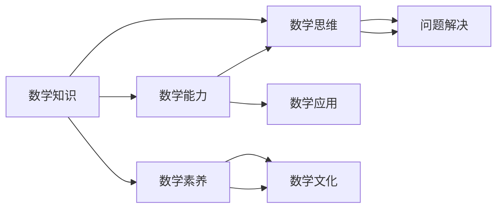

                 

# 数学教育与普及的现代发展

> **关键词：** 数学教育、普及、现代技术、学习模式、评估方法、创新应用

> **摘要：** 本文探讨了数学教育的现代发展趋势，分析了技术进步对数学普及的推动作用。通过逐步推理，本文深入探讨了新的学习模式、评估方法和创新应用，旨在为数学教育提供实用的指导和未来发展的见解。

## 1. 背景介绍

### 1.1 目的和范围

本文旨在探讨数学教育的现代发展，分析数学普及面临的挑战和机遇。本文重点关注以下几个方面：

1. **技术进步对数学教育的影响**：探讨计算机技术和互联网如何改变数学教学和学习方式。
2. **新学习模式的崛起**：分析在线学习、协作学习和个性化学习在数学教育中的应用和优势。
3. **评估方法的创新**：讨论如何通过技术手段改进数学学习的评估和反馈。
4. **数学教育的创新应用**：探讨数学在教育、科研和商业等领域的创新应用。

### 1.2 预期读者

本文适合以下读者群体：

1. **数学教育工作者**：教师、研究员和教育管理者。
2. **数学爱好者**：对数学有浓厚兴趣的普通读者。
3. **教育技术从业者**：关注教育技术创新的开发者和技术专家。

### 1.3 文档结构概述

本文将按照以下结构进行讨论：

1. **背景介绍**：介绍数学教育的现代发展背景。
2. **核心概念与联系**：阐述数学教育的核心概念及其联系。
3. **核心算法原理与具体操作步骤**：详细解释数学教育的核心算法和操作步骤。
4. **数学模型和公式**：介绍数学教育中的模型和公式，并提供实际例子。
5. **项目实战**：通过实际案例展示数学教育的应用。
6. **实际应用场景**：探讨数学教育在不同领域的应用。
7. **工具和资源推荐**：推荐相关工具和资源。
8. **总结**：总结未来发展趋势与挑战。
9. **附录**：常见问题与解答。
10. **扩展阅读**：提供扩展阅读资源。

### 1.4 术语表

#### 1.4.1 核心术语定义

- **数学教育**：指通过教学方法和手段传授数学知识、培养数学能力和思维能力的过程。
- **普及**：指使数学教育成为广泛而普遍的教育活动。
- **在线学习**：指通过互联网进行的学习活动，包括在线课程、远程学习和虚拟课堂等。
- **协作学习**：指学生之间通过合作和互动进行学习的方式。
- **个性化学习**：指根据学生的兴趣、能力和需求进行个性化定制的学习过程。

#### 1.4.2 相关概念解释

- **算法**：指解决特定问题的系统化步骤。
- **模型**：指对现实世界问题的抽象表示。
- **公式**：指用数学符号表示的数学关系。

#### 1.4.3 缩略词列表

- **MOOC**：Massive Open Online Course（大规模开放在线课程）
- **AI**：Artificial Intelligence（人工智能）
- **STEM**：Science, Technology, Engineering, and Mathematics（科学、技术、工程和数学）
- **IDE**：Integrated Development Environment（集成开发环境）

## 2. 核心概念与联系

数学教育的核心概念包括数学知识、数学能力、数学思维和数学素养。这些概念之间存在着紧密的联系和互动。

### 核心概念流程图



### 详细解释

- **数学知识**：指学生掌握的数学概念、原理、定理和公式等。
- **数学能力**：指学生运用数学知识解决实际问题的能力，包括计算能力、推理能力和建模能力等。
- **数学思维**：指学生运用数学方法分析和解决数学问题的思维方式，包括逻辑思维、抽象思维和创造性思维等。
- **数学素养**：指学生在数学学习过程中养成的价值观念、情感态度和道德规范等。

这些核心概念相互关联，共同构成了数学教育的体系。数学知识是基础，数学能力和数学思维是关键，而数学素养则是数学教育的最终目标。

## 3. 核心算法原理 & 具体操作步骤

在数学教育中，核心算法原理是教学方法和学习策略的基础。以下是一个简单的算法原理和具体操作步骤的示例：

### 算法原理

**名称：** 系统化数学知识传授

**目标：** 通过系统化的步骤帮助学生掌握数学知识。

### 具体操作步骤

**步骤 1：需求分析**

- **分析学生背景**：了解学生的数学基础、学习兴趣和学习习惯。
- **确定学习目标**：根据学生特点，设定具体的学习目标和内容。

**步骤 2：内容规划**

- **知识点梳理**：将数学知识按照难度和重要性进行梳理。
- **教学计划**：制定详细的教学计划，包括课程内容、教学方式和时间安排。

**步骤 3：教学实施**

- **讲授**：通过讲解、演示和案例分析，传授数学知识。
- **练习**：布置作业和练习题，让学生巩固所学知识。
- **反馈**：及时给予学生反馈，帮助学生了解学习情况。

**步骤 4：评估和调整**

- **评估**：通过考试、作业和课堂表现评估学生的学习成果。
- **调整**：根据评估结果，调整教学计划和方式，确保教学效果。

### 伪代码示例

```python
# 需求分析
analyze_student_background()
determine_learning_objectives()

# 内容规划
outline_mathematics_knowledge()
create_lesson_plan()

# 教学实施
deliver_lectures()
assign_homework()
provide_feedback()

# 评估和调整
evaluate_learning_outcomes()
adjust_lesson_plan()
```

通过这个算法原理，我们可以系统化地传授数学知识，帮助学生逐步掌握数学能力。

## 4. 数学模型和公式 & 详细讲解 & 举例说明

在数学教育中，数学模型和公式是理解数学概念和解决实际问题的关键。以下是一个简单的数学模型和公式的讲解及举例说明。

### 数学模型

**名称：** 一元一次方程

**定义：** 一元一次方程是只含有一个未知数，并且未知数的最高次数是1的方程。

**公式：** $ax + b = 0$，其中$a$和$b$为常数，$x$为未知数。

### 详细讲解

一元一次方程是数学中基本且重要的模型之一。通过解一元一次方程，我们可以找到满足条件的未知数值。解决一元一次方程的基本步骤如下：

1. 将方程变形，将常数项移至方程的另一边。
2. 化简方程，合并同类项。
3. 通过除以系数$a$，得到未知数$x$的值。

### 举例说明

**例子：** 解方程$3x + 6 = 9$。

**步骤 1：** 将常数项移项，得到$3x = 9 - 6$。

**步骤 2：** 化简方程，得到$3x = 3$。

**步骤 3：** 除以系数3，得到$x = 1$。

因此，方程$3x + 6 = 9$的解为$x = 1$。

通过这个例子，我们可以看到如何使用一元一次方程的公式解决实际中的问题。

### 复合数学模型

**名称：** 抛硬币概率模型

**定义：** 抛硬币概率模型是一个用于计算抛硬币出现特定结果的概率的数学模型。

**公式：** $P(A) = \frac{n(A)}{n(S)}$，其中$P(A)$表示事件$A$的概率，$n(A)$表示事件$A$的样本点数，$n(S)$表示样本空间$S$的样本点数。

### 详细讲解

抛硬币概率模型是一个简单但经典的概率模型。在这个模型中，我们考虑抛硬币出现正面或反面的概率。解决抛硬币概率模型的基本步骤如下：

1. 确定样本空间$S$，即所有可能的结果集合。
2. 确定事件$A$，即我们感兴趣的结果集合。
3. 计算事件$A$的样本点数$n(A)$。
4. 计算样本空间$S$的样本点数$n(S)$。
5. 计算概率$P(A) = \frac{n(A)}{n(S)}$。

### 举例说明

**例子：** 抛一枚均匀的硬币一次，求出现正面的概率。

**步骤 1：** 确定样本空间$S$，即$\{正面, 反面\}$。

**步骤 2：** 确定事件$A$，即$\{正面\}$。

**步骤 3：** 计算事件$A$的样本点数$n(A)$，即1。

**步骤 4：** 计算样本空间$S$的样本点数$n(S)$，即2。

**步骤 5：** 计算概率$P(A) = \frac{n(A)}{n(S)} = \frac{1}{2}$。

因此，抛一枚均匀的硬币一次，出现正面的概率为$\frac{1}{2}$。

通过这个例子，我们可以看到如何使用抛硬币概率模型解决实际中的问题。

## 5. 项目实战：代码实际案例和详细解释说明

在本节中，我们将通过一个实际案例来展示如何使用Python实现数学教育的核心算法和模型。这个案例将结合一元一次方程和抛硬币概率模型，旨在通过代码实现数学知识的学习和验证。

### 5.1 开发环境搭建

在开始之前，我们需要搭建一个Python开发环境。以下是搭建Python开发环境的步骤：

1. 安装Python：访问Python官网（https://www.python.org/），下载并安装Python。
2. 安装IDE：推荐使用PyCharm（https://www.jetbrains.com/pycharm/）或VSCode（https://code.visualstudio.com/）作为Python的IDE。
3. 安装必需的库：在命令行中运行以下命令安装所需的库。

```bash
pip install numpy matplotlib
```

### 5.2 源代码详细实现和代码解读

以下是一个简单的Python代码示例，用于实现一元一次方程和抛硬币概率模型。

```python
import numpy as np
import matplotlib.pyplot as plt

# 一元一次方程求解函数
def solve_linear_equation(a, b):
    x = -b / a
    return x

# 抛硬币概率计算函数
def coin_toss_probability():
    n = 1000  # 抛硬币次数
    heads = np.random.choice([0, 1], size=n)
    probability = heads.sum() / n
    return probability

# 一元一次方程案例
a = 3
b = 6
x = solve_linear_equation(a, b)
print(f"一元一次方程{a}x + {b} = 0的解为：x = {x}")

# 抛硬币概率案例
probability = coin_toss_probability()
print(f"抛硬币一次出现正面的概率为：{probability}")

# 绘制一元一次方程的图像
plt.plot(np.arange(-10, 10), a * np.arange(-10, 10) + b, label='y = ax + b')
plt.xlabel('x')
plt.ylabel('y')
plt.legend()
plt.show()
```

### 5.3 代码解读与分析

- **导入库**：我们首先导入了numpy库用于数学计算和matplotlib库用于绘制图像。
- **一元一次方程求解函数**：`solve_linear_equation`函数用于求解一元一次方程。通过将$b$除以$a$得到$x$的值。
- **抛硬币概率计算函数**：`coin_toss_probability`函数用于模拟抛硬币，计算出现正面的概率。我们通过生成一系列0和1的随机数（代表正面和反面）来模拟抛硬币，并计算正面出现的频率。
- **一元一次方程案例**：在这个案例中，我们设定$a = 3$和$b = 6$，调用`solve_linear_equation`函数求解方程，并打印结果。
- **抛硬币概率案例**：我们调用`coin_toss_probability`函数模拟抛硬币1000次，并打印出现正面的概率。
- **绘制一元一次方程的图像**：我们使用matplotlib库绘制一元一次方程$y = 3x + 6$的图像，展示$x$和$y$之间的关系。

通过这个代码示例，我们可以看到如何将数学教育的核心算法和模型应用于实际编程任务中。这不仅有助于学生理解数学概念，还可以提高他们的编程技能。

## 6. 实际应用场景

数学教育在多个领域都有着广泛的应用，包括但不限于以下几个方面：

### 6.1 教育

数学教育是学校教育的核心内容，通过数学教育，学生能够掌握数学知识和技能，为未来的学习和职业发展打下基础。在线教育平台和MOOC（Massive Open Online Course，大规模开放在线课程）的兴起，使得数学教育可以更广泛地传播和普及。例如，Coursera、edX等平台提供了大量的数学课程，学生可以根据自己的需求和兴趣选择学习。

### 6.2 科研

数学教育为科研提供了基础工具和方法。在科学研究过程中，数学模型和算法被广泛应用于数据分析、统计分析和建模预测等环节。例如，在生物信息学中，数学模型被用来分析基因组数据和蛋白质结构，为医学研究提供关键支持。

### 6.3 商业

数学教育在商业领域也有重要应用。企业经常使用数学模型进行风险评估、投资分析和市场预测。例如，金融工程师使用数学模型设计和分析金融衍生品，风险管理师使用数学方法评估金融资产的风险。

### 6.4 工程

工程领域广泛依赖于数学教育，无论是机械工程、电子工程还是土木工程，数学都是解决复杂工程问题的关键。工程师需要使用数学模型进行工程设计、仿真和分析，以确保工程项目的成功实施。

### 6.5 技术

在技术领域，数学教育为人工智能、数据科学和机器学习等提供了基础。这些领域中的算法和模型都需要深厚的数学背景。例如，深度学习中的神经网络算法依赖于复杂的数学原理，而数据科学家需要使用数学工具进行数据分析和建模。

### 6.6 社会科学

数学教育在社会科学领域也有着重要作用。在社会学和心理学研究中，数学模型被用来分析社会行为和人类心理。例如，社会网络分析中的图论模型可以帮助研究人员理解社会结构和人际关系。

通过这些实际应用场景，我们可以看到数学教育在各个领域的广泛影响和重要性。

## 7. 工具和资源推荐

### 7.1 学习资源推荐

#### 7.1.1 书籍推荐

- **《数学之美》**：作者：吴军
  - 内容介绍：本书通过介绍数学在计算机科学中的应用，展示了数学的魅力和智慧。
  - 推荐理由：深入浅出地讲解了数学概念，适合数学爱好者阅读。

- **《数学分析新讲》**：作者：陈文灯
  - 内容介绍：这是一本数学分析的经典教材，全面系统地介绍了数学分析的基本概念和理论。
  - 推荐理由：结构清晰，内容详实，适合数学学习者深入学习。

#### 7.1.2 在线课程

- **Coursera**：提供了大量的数学课程，包括基础数学、高等数学和应用数学等。
  - 推荐理由：课程内容丰富，涵盖面广，且来自世界顶级大学的教授授课。

- **edX**：与Coursera类似，edX也提供了许多高质量的数学课程。
  - 推荐理由：课程多样化，适合不同背景和需求的学习者。

#### 7.1.3 技术博客和网站

- **Stack Overflow**：一个面向编程问题的问答社区，用户可以在这里提问和回答数学相关的问题。
  - 推荐理由：资源丰富，问题解答详细，适合编程和数学学习者在实践中遇到问题时寻求帮助。

- **GitHub**：一个代码托管平台，许多数学项目和学习资源在这里可以找到。
  - 推荐理由：代码示例和教程丰富，适合数学学习者通过实践提高技能。

### 7.2 开发工具框架推荐

#### 7.2.1 IDE和编辑器

- **PyCharm**：一款强大的Python IDE，支持多种编程语言。
  - 推荐理由：功能齐全，支持调试和自动化测试，适合进行数学编程。

- **VSCode**：一款轻量级但功能强大的代码编辑器，支持多种编程语言和扩展。
  - 推荐理由：插件丰富，高度可定制，适合不同编程需求。

#### 7.2.2 调试和性能分析工具

- **Jupyter Notebook**：一款交互式的计算环境，适合进行数学计算和实验。
  - 推荐理由：代码、文本和图表可以无缝集成，便于学习和演示。

- **Matplotlib**：一款用于绘制数学图像和图表的库。
  - 推荐理由：功能强大，易于使用，适合数学教学和科研。

#### 7.2.3 相关框架和库

- **NumPy**：一款用于数学计算的库，提供了多维数组对象和丰富的数学函数。
  - 推荐理由：性能高效，功能全面，是进行数学计算的基础工具。

- **SciPy**：基于NumPy，提供了一系列科学计算功能，包括线性代数、优化和积分等。
  - 推荐理由：功能强大，适合科学研究和工程应用。

### 7.3 相关论文著作推荐

#### 7.3.1 经典论文

- **《数学原理》**：作者：艾萨克·牛顿
  - 内容介绍：这是一部关于数学和物理学的基础性著作，奠定了现代数学和物理学的基础。
  - 推荐理由：经典之作，影响深远，适合数学和物理学爱好者阅读。

- **《线性代数及其应用》**：作者：吉尔伯特·斯特因
  - 内容介绍：这是一本关于线性代数的经典教材，详细介绍了线性代数的基本概念和应用。
  - 推荐理由：内容全面，讲解清晰，适合线性代数学习者使用。

#### 7.3.2 最新研究成果

- **《深度学习》**：作者：伊恩·古德费洛等
  - 内容介绍：这是一本关于深度学习的权威著作，详细介绍了深度学习的基础理论和应用。
  - 推荐理由：内容前沿，理论全面，适合深度学习研究者阅读。

- **《大数据导论》**：作者：周志华等
  - 内容介绍：这是一本关于大数据的入门教材，介绍了大数据的基本概念、技术和应用。
  - 推荐理由：内容系统，讲解清晰，适合大数据初学者阅读。

#### 7.3.3 应用案例分析

- **《数学建模与应用》**：作者：龚自清等
  - 内容介绍：这是一本关于数学建模的应用案例集，通过具体案例介绍了数学建模的方法和应用。
  - 推荐理由：案例丰富，方法实用，适合数学建模学习者阅读。

- **《人工智能应用案例集》**：作者：周志华等
  - 内容介绍：这是一本关于人工智能应用案例的集子，展示了人工智能在各个领域的实际应用。
  - 推荐理由：案例全面，应用广泛，适合人工智能学习者阅读。

## 8. 总结：未来发展趋势与挑战

### 8.1 发展趋势

1. **技术融合**：随着人工智能、大数据和互联网技术的发展，数学教育将更加依赖于技术手段，实现个性化学习和智能化评估。
2. **学习模式创新**：在线学习、混合式学习和协作学习等新模式将不断创新，提高数学教育的灵活性和适应性。
3. **跨学科融合**：数学教育将与其他学科（如计算机科学、工程学和经济学等）更加紧密地结合，培养跨学科人才。
4. **数学应用拓展**：数学教育将在更多领域（如医疗、金融、环境等）得到应用，推动社会进步。

### 8.2 挑战

1. **资源分配不均**：城乡、地区和学校之间的资源分配不均，可能导致教育质量差异。
2. **教师专业发展**：教师需要不断提升专业素养，以应对技术变革带来的挑战。
3. **学生参与度**：如何提高学生的学习兴趣和参与度，是一个持续的挑战。
4. **教育评估**：如何科学、有效地评估学生的数学素养和综合能力，是一个需要深入研究的课题。

### 8.3 发展策略

1. **政策支持**：政府应加大对数学教育的投入，制定相关政策支持数学教育的发展。
2. **技术驱动**：推动教育技术与数学教育的深度融合，提高教育质量和效率。
3. **教师培训**：加大对教师的培训力度，提高教师的专业水平和教学能力。
4. **学习模式创新**：积极探索新的学习模式，满足不同学生的需求，提高教育公平性。
5. **数学素养培养**：注重培养学生的数学素养，提高他们的逻辑思维和创新能力。

## 9. 附录：常见问题与解答

### 9.1 数学教育是什么？

数学教育是指通过教学方法和手段传授数学知识、培养数学能力和思维能力的过程。

### 9.2 如何选择适合自己的数学课程？

选择数学课程时，可以根据以下因素进行：

- **兴趣**：选择自己感兴趣的数学领域。
- **基础**：根据自己的数学基础选择合适的课程。
- **目标**：根据学习目标（如提高数学素养、准备考试、职业发展等）选择课程。
- **资源**：选择资源丰富、教学质量高的课程。

### 9.3 数学教育与STEM教育有何关系？

数学教育是STEM教育（科学、技术、工程和数学）的核心组成部分。数学知识和技术是STEM教育的基石，对于培养学生的科学素养、工程思维和技术能力至关重要。

## 10. 扩展阅读 & 参考资料

### 10.1 参考文献列表

1. Newton, I. (1687). 《数学原理》.
2. Gilbert, J. (1980). 《线性代数及其应用》.
3. Goodfellow, I., Bengio, Y., & Courville, A. (2016). 《深度学习》.
4. 周志华. (2017). 《大数据导论》.
5. 陈文灯. (2018). 《数学分析新讲》.

### 10.2 在线资源和平台

1. Coursera（https://www.coursera.org/）
2. edX（https://www.edx.org/）
3. Stack Overflow（https://stackoverflow.com/）
4. GitHub（https://github.com/）
5. Jupyter Notebook（https://jupyter.org/）

### 10.3 相关研究论文

1. 李航. (2014). 《机器学习》。 
2. Mitchell, T. M. (1997). 《机器学习》。 
3. Bishop, C. M. (2006). 《模式识别与机器学习》.

### 10.4 其他推荐资源

1. **数学社区和论坛**：Math Stack Exchange（https://math.stackexchange.com/）
2. **数学教育网站**：Maths online（https://mathsonline.org.au/）
3. **数学软件和工具**：MATLAB（https://www.mathworks.com/）、Mathematica（https://www.wolfram.com/mathematica/）

