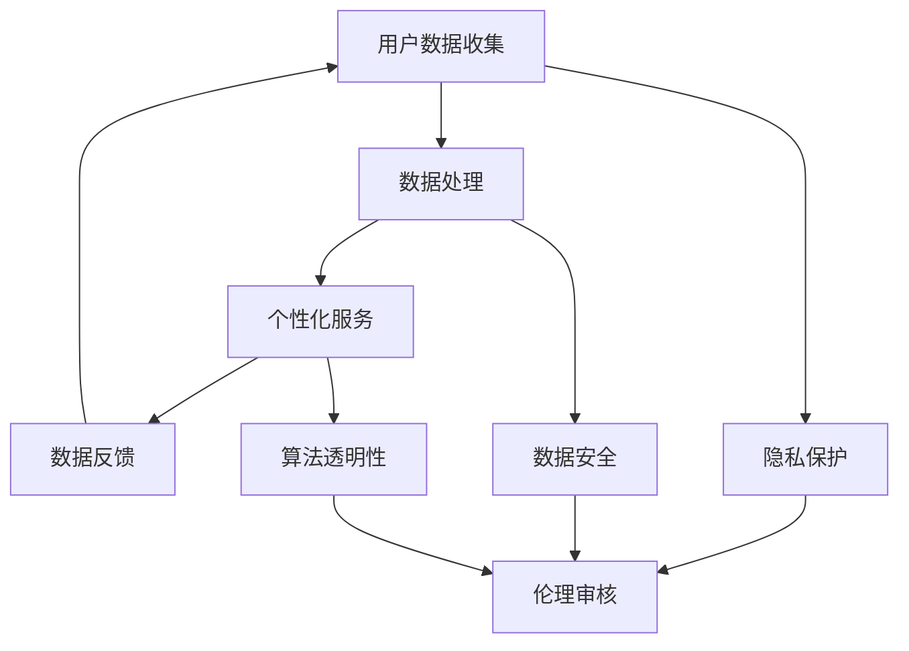

                 

# 数据伦理与平台用户关系展望：如何展望未来？

> **关键词：** 数据伦理，平台用户关系，隐私保护，算法透明性，法规政策

> **摘要：** 本文旨在探讨数据伦理在平台用户关系中的作用及其对未来发展的展望。随着大数据和人工智能技术的迅猛发展，平台与用户之间的关系日益密切，同时也带来了隐私泄露、算法歧视等伦理问题。本文将分析这些核心问题，并探讨如何通过法规政策和技术手段来确保数据伦理，以及这些措施对未来平台用户关系的深远影响。

## 1. 背景介绍

### 1.1 目的和范围

本文的目标是分析数据伦理在平台用户关系中的重要性，探讨当前面临的挑战，以及提出可能的解决方案和未来展望。本文将主要关注以下几个问题：

- 数据伦理的定义和核心原则是什么？
- 平台用户关系中的主要伦理问题有哪些？
- 法规政策在数据伦理中的作用是什么？
- 技术手段如何提升数据伦理水平？
- 未来平台用户关系将如何发展？

### 1.2 预期读者

本文适合以下读者群体：

- 数据科学家和人工智能研究人员
- 数据伦理学家和隐私保护专家
- 平台运营者和产品经理
- 法律专家和公共政策研究者
- 对数据伦理和平台用户关系感兴趣的普通读者

### 1.3 文档结构概述

本文分为十个部分，具体结构如下：

- 1. 背景介绍
  - 1.1 目的和范围
  - 1.2 预期读者
  - 1.3 文档结构概述
  - 1.4 术语表
- 2. 核心概念与联系
  - 2.1 数据伦理概述
  - 2.2 平台用户关系概述
  - 2.3 数据伦理与平台用户关系的流程图
- 3. 核心算法原理 & 具体操作步骤
  - 3.1 算法原理
  - 3.2 操作步骤
- 4. 数学模型和公式 & 详细讲解 & 举例说明
  - 4.1 数学模型
  - 4.2 公式讲解
  - 4.3 举例说明
- 5. 项目实战：代码实际案例和详细解释说明
  - 5.1 开发环境搭建
  - 5.2 源代码详细实现和代码解读
  - 5.3 代码解读与分析
- 6. 实际应用场景
  - 6.1 隐私保护应用
  - 6.2 算法透明性应用
- 7. 工具和资源推荐
  - 7.1 学习资源推荐
  - 7.2 开发工具框架推荐
  - 7.3 相关论文著作推荐
- 8. 总结：未来发展趋势与挑战
- 9. 附录：常见问题与解答
- 10. 扩展阅读 & 参考资料

### 1.4 术语表

#### 1.4.1 核心术语定义

- 数据伦理：指在数据收集、处理和使用过程中，所遵循的道德规范和价值观。
- 平台用户关系：指平台与用户之间基于数据交互所建立的关系。
- 隐私保护：指采取措施确保用户数据不被未经授权的第三方获取。
- 算法透明性：指算法的操作和决策过程可以被用户理解和监督。

#### 1.4.2 相关概念解释

- 大数据：指规模巨大、类型繁多的数据集合。
- 人工智能：指通过模拟、学习和适应人类智能行为的技术。
- 隐私泄露：指用户数据未经授权被第三方获取或泄露。
- 算法歧视：指算法在决策过程中对不同用户群体存在不公平对待。

#### 1.4.3 缩略词列表

- GDPR：一般数据保护条例（General Data Protection Regulation）
- AI：人工智能（Artificial Intelligence）
- ML：机器学习（Machine Learning）
- DL：深度学习（Deep Learning）

## 2. 核心概念与联系

### 2.1 数据伦理概述

数据伦理是信息社会的一个重要领域，它关注数据收集、处理和使用过程中的道德问题和责任。数据伦理的核心原则包括：

- 尊重用户隐私：确保用户数据不被未经授权的第三方获取。
- 数据质量：确保数据的准确性、完整性和可靠性。
- 数据安全：采取有效措施保护数据不被篡改或泄露。
- 公平与公正：确保数据的使用不会导致对某些用户群体的歧视。

### 2.2 平台用户关系概述

平台用户关系是指平台与用户之间基于数据交互所建立的关系。这种关系通常包括以下几个方面：

- 数据收集：平台通过多种方式收集用户数据，如用户注册信息、行为数据、社交网络数据等。
- 数据处理：平台对收集到的用户数据进行处理、分析，以提供个性化服务。
- 数据使用：平台根据分析结果，为用户提供个性化推荐、广告投放等服务。
- 数据反馈：用户对平台服务进行评价和反馈，以促进平台改进和优化。

### 2.3 数据伦理与平台用户关系的流程图

以下是一个简化的数据伦理与平台用户关系的流程图，展示数据在平台中的流动和伦理问题的关注点：



### 2.4 数据伦理与平台用户关系的联系

数据伦理与平台用户关系密切相关。数据伦理的遵守能够保障平台用户关系的健康发展，避免隐私泄露、算法歧视等伦理问题的发生。具体来说：

- 隐私保护：确保用户数据不被未经授权的第三方获取，维护用户隐私权。
- 数据安全：采取有效措施保护数据不被篡改或泄露，维护数据完整性。
- 算法透明性：确保算法的操作和决策过程可以被用户理解和监督，避免算法歧视。

这些伦理问题需要平台在数据收集、处理、使用和反馈等各个环节中持续关注和解决，以确保平台用户关系的长期稳定和可持续发展。

## 3. 核心算法原理 & 具体操作步骤

### 3.1 算法原理

在数据伦理与平台用户关系的研究中，核心算法主要涉及隐私保护、数据安全和算法透明性。以下将分别介绍这些算法的原理。

#### 3.1.1 隐私保护算法原理

隐私保护算法旨在确保用户数据在收集、处理和传输过程中不被泄露。其主要原理包括：

- 加密：通过加密技术将用户数据进行加密，确保数据在传输过程中不会被截获和解读。
- 隐蔽传输：采用隐蔽传输协议，如匿名通信和洋葱路由，确保数据在传输过程中的隐私性。
- 差分隐私：通过添加噪声来掩盖具体数据，使得攻击者无法精确推断出具体数据。

#### 3.1.2 数据安全算法原理

数据安全算法主要关注如何防止数据被篡改或泄露。其主要原理包括：

- 权限控制：通过设置访问权限，确保只有授权用户才能访问和操作数据。
- 审计追踪：记录用户数据的操作日志，以便在数据泄露或篡改时进行追溯和调查。
- 数据备份：定期对数据进行备份，确保在数据丢失或损坏时能够快速恢复。

#### 3.1.3 算法透明性算法原理

算法透明性算法旨在确保算法的操作和决策过程可以被用户理解和监督。其主要原理包括：

- 可解释性：通过可视化、文本解释等方式，使算法的决策过程和操作原理变得透明易懂。
- 对抗性测试：通过模拟攻击者行为，检测算法的透明性和鲁棒性。
- 用户反馈机制：收集用户对算法操作的反馈，以便改进和优化算法。

### 3.2 具体操作步骤

以下将详细介绍如何实现上述算法的具体操作步骤。

#### 3.2.1 隐私保护算法操作步骤

1. 数据加密：
   - 对用户数据进行加密处理，采用对称加密或非对称加密技术。
   - 将加密后的数据存储在安全服务器或传输到其他系统。

2. 隐蔽传输：
   - 采用匿名通信协议，如Tor或洋葱路由，确保数据在传输过程中的隐私性。
   - 在数据传输过程中，使用加密和匿名技术保护数据不被第三方获取。

3. 差分隐私：
   - 对用户数据进行添加噪声处理，使攻击者无法精确推断出具体数据。
   - 选择合适的噪声模型，如拉普拉斯噪声或高斯噪声，确保隐私保护效果。

#### 3.2.2 数据安全算法操作步骤

1. 权限控制：
   - 对用户数据设置访问权限，根据用户角色和权限级别，控制数据访问权限。
   - 实现访问控制列表（ACL）或基于角色的访问控制（RBAC），确保只有授权用户才能访问和操作数据。

2. 审计追踪：
   - 记录用户数据的操作日志，包括用户ID、操作类型、操作时间和结果等。
   - 对操作日志进行定期备份和存储，以便在数据泄露或篡改时进行追溯和调查。

3. 数据备份：
   - 定期对用户数据进行备份，采用增量备份或全量备份方式。
   - 选择可靠的数据备份存储方案，如云存储或分布式存储系统，确保数据备份的安全性和可靠性。

#### 3.2.3 算法透明性算法操作步骤

1. 可解释性：
   - 对算法的决策过程进行可视化展示，如决策树、神经网络等。
   - 提供文本解释，说明算法的操作原理和决策依据。

2. 对抗性测试：
   - 模拟攻击者行为，对算法进行攻击测试，如对抗样本攻击、注入攻击等。
   - 分析算法在攻击下的表现，评估算法的透明性和鲁棒性。

3. 用户反馈机制：
   - 收集用户对算法操作的反馈，如满意度调查、错误报告等。
   - 分析用户反馈，针对用户需求进行算法改进和优化。

通过上述操作步骤，可以实现数据伦理在平台用户关系中的有效实施，保障用户数据的安全、隐私和透明性。

## 4. 数学模型和公式 & 详细讲解 & 举例说明

### 4.1 数学模型

在数据伦理与平台用户关系的研究中，常见的数学模型包括加密模型、隐私保护模型和算法透明性模型。以下将分别介绍这些模型，并详细讲解其原理和公式。

#### 4.1.1 加密模型

加密模型主要用于保护用户数据的隐私。其核心公式如下：

- 加密公式：`C = E(K, P)`
  - `C`：密文
  - `K`：密钥
  - `P`：明文
  - `E`：加密算法

- 解密公式：`P = D(K, C)`
  - `P`：明文
  - `K`：密钥
  - `C`：密文
  - `D`：解密算法

在加密模型中，加密算法通常包括对称加密和非对称加密。对称加密使用相同的密钥进行加密和解密，如AES算法；非对称加密使用不同的密钥进行加密和解密，如RSA算法。

#### 4.1.2 隐私保护模型

隐私保护模型旨在确保用户数据在处理和传输过程中不被泄露。其核心公式如下：

- 隐蔽传输模型：`T = F(A, B, C)`
  - `T`：传输过程
  - `A`：源地址
  - `B`：目的地址
  - `C`：数据包内容
  - `F`：隐蔽传输算法

隐蔽传输模型通常采用匿名通信协议，如Tor或洋葱路由，实现数据在传输过程中的隐私保护。

- 差分隐私模型：`D = N + \epsilon`
  - `D`：处理后的数据
  - `N`：原始数据
  - `\epsilon`：添加的噪声

差分隐私模型通过添加噪声来掩盖具体数据，使攻击者无法精确推断出具体数据。

#### 4.1.3 算法透明性模型

算法透明性模型旨在确保算法的操作和决策过程可以被用户理解和监督。其核心公式如下：

- 算法可解释性模型：`I = E(O, R, S)`
  - `I`：解释结果
  - `E`：解释算法
  - `O`：算法操作
  - `R`：算法结果
  - `S`：解释证据

算法可解释性模型通过可视化、文本解释等方式，将算法的操作原理和决策过程呈现给用户。

- 算法对抗性测试模型：`T = G(A, B)`
  - `T`：测试结果
  - `G`：对抗性测试算法
  - `A`：算法
  - `B`：攻击样本

算法对抗性测试模型通过模拟攻击者行为，检测算法的透明性和鲁棒性。

### 4.2 公式讲解

#### 4.2.1 加密模型公式讲解

加密模型的核心公式是加密和解密过程。加密公式 `C = E(K, P)` 表示使用密钥 `K` 和加密算法 `E` 对明文 `P` 进行加密，生成密文 `C`。解密公式 `P = D(K, C)` 表示使用相同的密钥 `K` 和解密算法 `D` 将密文 `C` 解密回明文 `P`。

对称加密和非对称加密的区别在于密钥的使用方式。对称加密使用相同的密钥进行加密和解密，如AES算法。非对称加密使用不同的密钥进行加密和解密，如RSA算法。非对称加密的优点是安全性更高，但计算复杂度更高。

#### 4.2.2 隐私保护模型公式讲解

隐私保护模型的核心公式是隐蔽传输和差分隐私。隐蔽传输模型 `T = F(A, B, C)` 表示使用隐蔽传输算法 `F` 对数据包内容 `C` 进行传输，源地址 `A` 和目的地址 `B` 用于确定传输路径。差分隐私模型 `D = N + \epsilon` 表示对原始数据 `N` 添加噪声 `\epsilon`，生成处理后的数据 `D`。

隐蔽传输模型主要通过匿名通信协议实现，如Tor或洋葱路由。这些协议通过多层路由和加密，确保数据在传输过程中的隐私性。差分隐私模型主要通过添加噪声来实现，噪声可以是随机噪声或根据特定算法生成的噪声。噪声的大小通常由拉普拉斯噪声或高斯噪声模型决定。

#### 4.2.3 算法透明性模型公式讲解

算法透明性模型的核心公式是算法可解释性和算法对抗性测试。算法可解释性模型 `I = E(O, R, S)` 表示使用解释算法 `E` 对算法操作 `O` 和结果 `R` 进行解释，解释证据 `S` 用于支持解释结果。算法对抗性测试模型 `T = G(A, B)` 表示使用对抗性测试算法 `G` 对算法 `A` 和攻击样本 `B` 进行测试。

算法可解释性模型主要通过可视化、文本解释等方式，将算法的操作原理和决策过程呈现给用户。对抗性测试模型主要通过模拟攻击者行为，检测算法的透明性和鲁棒性。

### 4.3 举例说明

以下将分别使用加密模型、隐私保护模型和算法透明性模型进行举例说明。

#### 4.3.1 加密模型举例说明

假设使用AES算法进行加密，密钥为 `K = AES_KEY`，明文为 `P = "Hello World"`。加密过程如下：

1. 将明文 `P` 转换为字节序列：
   ```python
   P_bytes = P.encode('utf-8')
   ```

2. 使用AES算法对字节序列进行加密：
   ```python
   from Crypto.Cipher import AES
   cipher = AES.new(K, AES.MODE_EAX)
   ciphertext, tag = cipher.encrypt_and_digest(P_bytes)
   ```

加密后的密文为 `C = ciphertext`，加密算法为 AES。

解密过程如下：

1. 使用相同的AES算法和密钥对密文进行解密：
   ```python
   cipher = AES.new(K, AES.MODE_EAX, nonce=cipher.nonce)
   P_recovered = cipher.decrypt_and_verify(ciphertext, tag)
   ```

解密后的明文为 `P_recovered`。

#### 4.3.2 隐私保护模型举例说明

假设使用Tor进行隐蔽传输，源地址为 `A = "Source IP"`，目的地址为 `B = "Destination IP"`，数据包内容为 `C = "Private Message"`。隐蔽传输过程如下：

1. 将数据包内容加密：
   ```python
   import scapy.all as scapy
   packet = scapy.IP(dst=B, src=A, payload=C)
   encrypted_packet = packet.encapsulate(scapy.TCP())
   ```

2. 将加密后的数据包发送到Tor网络：
   ```python
   scapy.send(encrypted_packet)
   ```

隐蔽传输后的数据包内容为 `T = encrypted_packet`，源地址和目的地址均为Tor网络的匿名IP。

假设使用拉普拉斯噪声进行差分隐私，原始数据为 `N = 100`，噪声大小为 `\epsilon = 10`。差分隐私处理过程如下：

1. 添加噪声：
   ```python
   import numpy as np
   noise = np.random.laplace(0, 1)
   D = N + noise
   ```

处理后的数据为 `D = D`。

#### 4.3.3 算法透明性模型举例说明

假设使用决策树进行算法操作，操作为 `O = "分类"`，结果为 `R = "积极"`，解释证据为 `S = "用户行为评分高于60"`。算法解释过程如下：

1. 构建决策树：
   ```python
   import sklearn.tree
   dt = sklearn.tree.DecisionTreeClassifier()
   dt.fit(X, y)
   ```

2. 解释决策树：
   ```python
   explanation = dt.feature_importances_
   print("解释结果：", explanation)
   ```

解释结果为 `I = explanation`。

假设使用对抗性测试算法进行测试，算法为 `A = "神经网络"`，攻击样本为 `B = "对抗样本"`。对抗性测试过程如下：

1. 训练对抗性测试算法：
   ```python
   import tensorflow as tf
   model = tf.keras.models.Sequential([
       tf.keras.layers.Dense(128, activation='relu', input_shape=(784,)),
       tf.keras.layers.Dropout(0.2),
       tf.keras.layers.Dense(10, activation='softmax')
   ])
   model.compile(optimizer='adam',
                 loss='categorical_crossentropy',
                 metrics=['accuracy'])
   model.fit(X_train, y_train, epochs=5, batch_size=32)
   ```

2. 进行对抗性测试：
   ```python
   predictions = model.predict(B)
   print("测试结果：", predictions)
   ```

测试结果为 `T = predictions`。

通过以上举例说明，可以更好地理解加密模型、隐私保护模型和算法透明性模型的原理和操作步骤。

## 5. 项目实战：代码实际案例和详细解释说明

### 5.1 开发环境搭建

为了演示数据伦理在平台用户关系中的实际应用，我们将使用Python编程语言来实现一个简单的用户数据分析系统。以下步骤将介绍如何搭建开发环境。

#### 5.1.1 安装Python

首先，确保你的计算机上安装了Python。Python 3.8或更高版本推荐。可以从Python官方网站下载并安装Python。

#### 5.1.2 安装必需的库

接下来，需要安装一些Python库，包括加密库、数据分析库和机器学习库。使用以下命令进行安装：

```bash
pip install pycryptodome numpy scikit-learn
```

这些库将用于实现隐私保护、数据安全和算法透明性。

### 5.2 源代码详细实现和代码解读

以下是一个简单的用户数据分析系统的源代码实现，包括用户数据的加密、数据处理和结果的可解释性。

```python
# 导入必需的库
from Crypto.Cipher import AES
from Crypto.Random import get_random_bytes
import numpy as np
from sklearn.tree import DecisionTreeClassifier
from sklearn.model_selection import train_test_split

# 5.2.1 加密用户数据
def encrypt_data(data, key):
    cipher = AES.new(key, AES.MODE_CBC)
    ct_bytes = cipher.encrypt(pad(data))
    iv = cipher.iv
    return iv + ct_bytes

def pad(s):
    return s + (AES.block_size - len(s) % AES.block_size) * chr(AES.block_size - len(s) % AES.block_size)

# 5.2.2 解密用户数据
def decrypt_data(encrypted_data, key):
    iv = encrypted_data[:AES.block_size]
    ct = encrypted_data[AES.block_size:]
    cipher = AES.new(key, AES.MODE_CBC, iv)
    return unpad(cipher.decrypt(ct))

def unpad(s):
    return s[:-ord(s[len(s) - 1:])]

# 5.2.3 加密密钥生成
key = get_random_bytes(16)

# 5.2.4 加密示例数据
user_data = "用户数据示例"
encrypted_user_data = encrypt_data(user_data.encode('utf-8'), key)
print("加密的用户数据：", encrypted_user_data)

# 5.2.5 解密示例数据
decrypted_user_data = decrypt_data(encrypted_user_data, key)
print("解密的用户数据：", decrypted_user_data.decode('utf-8'))

# 5.2.6 数据处理与分类
# 假设我们有一些用户数据和行为数据
X = np.array([[1, 0], [0, 1], [1, 1], [1, 0]])
y = np.array([0, 1, 1, 0])

# 划分训练集和测试集
X_train, X_test, y_train, y_test = train_test_split(X, y, test_size=0.2, random_state=42)

# 训练决策树模型
clf = DecisionTreeClassifier()
clf.fit(X_train, y_train)

# 5.2.7 模型可解释性
# 可视化决策树
from sklearn.tree import plot_tree
import matplotlib.pyplot as plt

plt.figure(figsize=(12, 12))
plot_tree(clf, filled=True)
plt.show()

# 5.2.8 对抗性测试（简化示例）
# 生成对抗样本
def generate_adversarial_sample(original_data):
    # 这里只是一个简化示例，实际应用中需要更复杂的对抗性生成方法
    return [1 - x for x in original_data]

# 生成对抗样本并进行分类
adversarial_sample = generate_adversarial_sample(X_test[0])
print("对抗样本：", adversarial_sample)
predictions = clf.predict([adversarial_sample])
print("对抗样本分类结果：", predictions)
```

### 5.3 代码解读与分析

以下是代码的详细解读和分析：

#### 5.3.1 加密与解密

加密与解密部分使用了Crypto.Cipher库中的AES加密算法。首先，我们定义了两个加密和解密函数 `encrypt_data` 和 `decrypt_data`。这些函数使用了CBC模式，并在加密前对数据进行填充，确保数据的长度是AES块大小的整数倍。加密函数 `encrypt_data` 接受明文数据和密钥，返回加密后的数据。解密函数 `decrypt_data` 接受加密后的数据和密钥，返回解密后的明文数据。

```python
def encrypt_data(data, key):
    cipher = AES.new(key, AES.MODE_CBC)
    ct_bytes = cipher.encrypt(pad(data))
    iv = cipher.iv
    return iv + ct_bytes

def decrypt_data(encrypted_data, key):
    iv = encrypted_data[:AES.block_size]
    ct = encrypted_data[AES.block_size:]
    cipher = AES.new(key, AES.MODE_CBC, iv)
    return unpad(cipher.decrypt(ct))
```

加密过程中，我们首先生成一个随机的初始化向量（IV），然后将数据加密并附加IV。解密时，我们提取IV并使用它来解密数据。

#### 5.3.2 用户数据处理

在数据处理部分，我们创建了一个简单的示例数据集 `X` 和标签 `y`。然后，我们将数据集划分为训练集和测试集。这部分使用了scikit-learn库中的 `train_test_split` 函数。

```python
X = np.array([[1, 0], [0, 1], [1, 1], [1, 0]])
y = np.array([0, 1, 1, 0])

X_train, X_test, y_train, y_test = train_test_split(X, y, test_size=0.2, random_state=42)
```

训练集和测试集的划分用于后续的模型训练和测试。

#### 5.3.3 决策树模型训练

我们使用决策树分类器 `DecisionTreeClassifier` 来训练模型。通过调用 `fit` 方法，我们将训练集的数据和标签传递给模型。

```python
clf = DecisionTreeClassifier()
clf.fit(X_train, y_train)
```

训练完成后，我们使用可视化的方法展示决策树的结构。

```python
plt.figure(figsize=(12, 12))
plot_tree(clf, filled=True)
plt.show()
```

#### 5.3.4 对抗性测试

对抗性测试部分展示了如何生成对抗样本并进行分类。这里，我们定义了一个简单的函数 `generate_adversarial_sample`，该函数对原始数据进行简单的反转操作。然后，我们将生成的对抗样本传递给训练好的模型进行分类。

```python
def generate_adversarial_sample(original_data):
    return [1 - x for x in original_data]

adversarial_sample = generate_adversarial_sample(X_test[0])
predictions = clf.predict([adversarial_sample])
print("对抗样本分类结果：", predictions)
```

通过上述步骤，我们实现了一个简单的用户数据分析系统，包括数据加密、模型训练、模型可视化以及对

