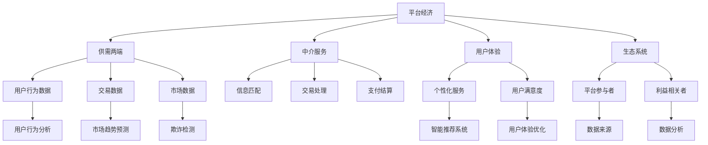

                 

### 文章标题

《数据分析在平台经济中的应用研究展望：如何展望未来？》

平台经济作为一种新兴的经济模式，正迅速改变着全球商业生态。它通过搭建一个连接供需两端的平台，使得资源和服务更加高效地流动，从而提升了市场效率。在这个背景下，数据分析作为一种重要的技术手段，逐渐成为推动平台经济发展的重要动力。本文旨在探讨数据分析在平台经济中的应用，并展望其未来的发展趋势。

### 关键词：

- 数据分析
- 平台经济
- 数据挖掘
- 机器学习
- 大数据分析
- 实时分析
- 智能推荐系统

### 摘要：

本文首先介绍了平台经济的背景和特点，接着深入分析了数据分析在平台经济中的应用，包括用户行为分析、市场趋势预测、欺诈检测等方面。随后，本文探讨了当前数据分析技术的现状和挑战，并提出了一些解决思路。最后，本文对未来数据分析在平台经济中的应用进行了展望，指出了可能的发展趋势和潜在的研究方向。

## 1. 背景介绍

### 1.1 目的和范围

本文的目标是探讨数据分析在平台经济中的应用，并分析其未来发展趋势。具体来说，本文将重点关注以下几个方面：

1. **平台经济的定义和特点**：介绍平台经济的概念和特征，分析其对商业生态的影响。
2. **数据分析在平台经济中的作用**：阐述数据分析技术如何支持平台经济，包括用户行为分析、市场趋势预测、欺诈检测等应用。
3. **数据分析技术的现状和挑战**：分析当前数据分析技术的发展状况，探讨其在平台经济中面临的挑战。
4. **未来数据分析在平台经济中的应用展望**：展望未来数据分析在平台经济中的发展趋势和潜在的研究方向。

### 1.2 预期读者

本文的预期读者主要包括：

1. **数据分析专业人士**：对数据分析技术和平台经济感兴趣的专业人士，希望通过本文了解数据分析在平台经济中的应用。
2. **商业分析师**：从事商业分析工作，需要了解如何利用数据分析技术提升商业决策效率。
3. **IT从业者**：对新技术和应用场景感兴趣，希望了解平台经济和数据分析的结合。
4. **学术研究人员**：对平台经济和数据分析领域的研究感兴趣，希望了解当前的研究动态和未来发展方向。

### 1.3 文档结构概述

本文将分为以下章节：

1. **背景介绍**：介绍平台经济的背景和数据分析在其中的作用。
2. **核心概念与联系**：详细阐述平台经济和数据分析的核心概念及其相互关系。
3. **核心算法原理 & 具体操作步骤**：讲解在平台经济中应用的数据分析算法及其操作步骤。
4. **数学模型和公式 & 详细讲解 & 举例说明**：介绍用于平台经济的数学模型和公式，并给出实际应用案例。
5. **项目实战：代码实际案例和详细解释说明**：通过实际项目案例，展示数据分析在平台经济中的应用。
6. **实际应用场景**：分析数据分析在平台经济中的具体应用场景。
7. **工具和资源推荐**：推荐学习资源和开发工具。
8. **总结：未来发展趋势与挑战**：总结数据分析在平台经济中的应用，展望未来发展趋势和挑战。

### 1.4 术语表

#### 1.4.1 核心术语定义

- **平台经济**：一种基于互联网和信息技术的新型经济模式，通过搭建平台，连接供需两端，实现资源和服务的高效流动。
- **数据分析**：对大量数据进行分析，从中提取有价值的信息和知识。
- **数据挖掘**：从大量数据中发现隐藏的模式和关联。
- **机器学习**：一种人工智能技术，通过训练模型，从数据中自动学习并做出预测或决策。
- **大数据分析**：对大规模数据集进行高效处理和分析。
- **实时分析**：对实时数据流进行分析，快速提取有价值的信息。
- **智能推荐系统**：基于用户行为和偏好，为用户推荐相关产品和内容。

#### 1.4.2 相关概念解释

- **用户行为分析**：通过分析用户在平台上的行为数据，了解用户的需求和行为模式。
- **市场趋势预测**：通过分析历史数据和市场信息，预测未来的市场趋势和机会。
- **欺诈检测**：通过分析交易数据和用户行为，检测潜在的欺诈行为。
- **个性化推荐**：根据用户的历史行为和偏好，为用户推荐个性化的内容和产品。

#### 1.4.3 缩略词列表

- **AI**：人工智能
- **ML**：机器学习
- **DL**：深度学习
- **NLP**：自然语言处理
- **API**：应用程序编程接口
- **SDK**：软件开发工具包

## 2. 核心概念与联系

为了深入探讨数据分析在平台经济中的应用，我们首先需要明确几个核心概念，并理解它们之间的相互关系。

### 2.1 平台经济的核心概念

平台经济的核心在于“平台”这一概念。平台通常由以下几个关键组成部分构成：

1. **供需两端**：平台连接了供需两端，即提供服务和资源的供应方与寻求服务和资源的需求方。
2. **中介服务**：平台提供中介服务，包括信息匹配、交易处理、支付结算等，以促进供需两端的连接。
3. **用户体验**：平台的设计和功能必须满足用户的需求，提供良好的用户体验。
4. **生态系统**：平台不仅仅是单一的应用程序，而是一个生态系统，包括多个参与者和利益相关者。

### 2.2 数据分析的核心概念

数据分析是平台经济中不可或缺的一部分，其核心概念包括：

1. **数据收集**：平台需要收集大量的数据，包括用户行为数据、交易数据、市场数据等。
2. **数据存储**：将收集到的数据存储在数据库中，以便进行后续处理和分析。
3. **数据处理**：对存储的数据进行清洗、转换和整合，以获得高质量的分析数据。
4. **数据分析**：运用各种数据分析技术，从数据中提取有价值的信息和知识。
5. **数据可视化**：将分析结果以图表、报表等形式呈现，便于理解和决策。

### 2.3 数据分析与平台经济的联系

数据分析与平台经济之间的联系主要体现在以下几个方面：

1. **用户行为分析**：通过分析用户在平台上的行为数据，了解用户的需求、偏好和行为模式，为平台提供个性化的服务。
2. **市场趋势预测**：通过分析市场数据和历史趋势，预测未来的市场变化，帮助平台制定发展战略。
3. **欺诈检测**：通过分析交易数据和用户行为，及时发现和预防欺诈行为，保障平台的诚信和安全。
4. **智能推荐系统**：基于用户行为和偏好，为用户推荐个性化的内容和产品，提升用户体验和平台的黏性。

### 2.4 Mermaid 流程图

为了更好地理解平台经济与数据分析之间的联系，我们可以使用 Mermaid 流程图来展示它们的核心概念和相互关系。



### 2.5 平台经济中的数据分析应用

在平台经济中，数据分析的应用场景非常广泛，主要包括以下几个方面：

1. **用户增长和留存**：通过分析用户行为数据，了解用户在平台上的活动情况，识别用户增长和留存的潜在因素，优化产品设计和运营策略。
2. **产品优化和推荐**：通过数据分析，了解用户对产品和服务的需求，优化产品功能和体验，同时通过智能推荐系统，提升用户的满意度。
3. **风险管理和欺诈检测**：通过分析交易数据和用户行为，识别潜在的欺诈行为，保障平台的诚信和安全。
4. **市场营销和推广**：通过分析市场数据和用户行为，制定有效的市场营销策略，提升品牌知名度和用户转化率。
5. **供应链优化**：通过分析供应链数据和用户需求，优化供应链管理，提升供应链效率和成本控制。

## 3. 核心算法原理 & 具体操作步骤

在平台经济中，数据分析的核心在于如何有效地处理和分析海量数据，从中提取有价值的信息。以下我们将详细讲解几种在平台经济中应用的核心算法原理及其具体操作步骤。

### 3.1 用户行为分析算法

用户行为分析是平台经济中的一项重要应用，它通过分析用户在平台上的行为数据，了解用户的需求和行为模式，从而为平台提供个性化的服务。

**算法原理**：

用户行为分析算法主要基于以下原理：

1. **统计模型**：使用统计模型，如回归分析、聚类分析等，对用户行为数据进行分析，识别用户的行为特征。
2. **机器学习**：利用机器学习算法，如决策树、随机森林等，对用户行为数据建立模型，预测用户的行为。

**具体操作步骤**：

1. **数据收集**：收集用户在平台上的行为数据，包括点击、购买、评论等。
2. **数据预处理**：对收集到的数据进行清洗、转换和整合，保证数据的质量。
3. **特征工程**：根据用户行为数据，提取特征，如点击率、购买频率等。
4. **模型训练**：使用机器学习算法，训练用户行为分析模型。
5. **模型评估**：评估模型的效果，如准确率、召回率等。
6. **模型应用**：将训练好的模型应用于实际场景，如推荐系统、用户流失预测等。

### 3.2 市场趋势预测算法

市场趋势预测是平台经济中的另一个重要应用，它通过分析历史数据和当前市场信息，预测未来的市场变化，帮助平台制定发展战略。

**算法原理**：

市场趋势预测算法主要基于以下原理：

1. **时间序列分析**：使用时间序列分析方法，如ARIMA模型、LSTM神经网络等，分析历史数据，预测未来的市场趋势。
2. **回归分析**：通过回归分析方法，分析历史数据与当前市场信息之间的关系，预测未来的市场变化。

**具体操作步骤**：

1. **数据收集**：收集历史市场数据，如价格、销量等。
2. **数据预处理**：对收集到的数据进行清洗、转换和整合，保证数据的质量。
3. **特征工程**：根据历史市场数据和当前市场信息，提取特征，如价格变化率、销量增长等。
4. **模型训练**：使用时间序列分析或回归分析方法，训练市场趋势预测模型。
5. **模型评估**：评估模型的效果，如预测误差、相关系数等。
6. **模型应用**：将训练好的模型应用于实际场景，如市场预测、供需平衡等。

### 3.3 欺诈检测算法

欺诈检测是平台经济中的关键应用，它通过分析交易数据和用户行为，及时发现和预防欺诈行为，保障平台的诚信和安全。

**算法原理**：

欺诈检测算法主要基于以下原理：

1. **异常检测**：通过分析正常交易数据和异常交易数据，识别潜在的欺诈行为。
2. **聚类分析**：使用聚类分析方法，将交易数据和用户行为划分为不同的群体，识别异常群体中的欺诈行为。
3. **规则匹配**：通过预设的欺诈规则，对交易数据和用户行为进行匹配，识别潜在的欺诈行为。

**具体操作步骤**：

1. **数据收集**：收集平台上的交易数据和用户行为数据。
2. **数据预处理**：对收集到的数据进行清洗、转换和整合，保证数据的质量。
3. **特征工程**：根据交易数据和用户行为数据，提取特征，如交易金额、交易频率等。
4. **模型训练**：使用异常检测、聚类分析或规则匹配方法，训练欺诈检测模型。
5. **模型评估**：评估模型的效果，如准确率、召回率等。
6. **模型应用**：将训练好的模型应用于实际场景，如实时欺诈检测、用户风险评估等。

### 3.4 伪代码示例

以下是一个简单的用户行为分析算法的伪代码示例：

```python
# 伪代码：用户行为分析算法

# 步骤1：数据收集
user_data = collect_user_data()

# 步骤2：数据预处理
cleaned_data = preprocess_data(user_data)

# 步骤3：特征工程
features = extract_features(cleaned_data)

# 步骤4：模型训练
model = train_model(features)

# 步骤5：模型评估
evaluate_model(model)

# 步骤6：模型应用
apply_model(model)
```

通过以上步骤，我们可以实现对用户行为数据的分析，从而为平台提供个性化的服务。

## 4. 数学模型和公式 & 详细讲解 & 举例说明

在数据分析中，数学模型和公式扮演着至关重要的角色。它们帮助我们理解数据背后的规律，并通过量化分析指导实际应用。以下我们将介绍一些在平台经济中常用的数学模型和公式，并对其进行详细讲解和举例说明。

### 4.1 回归分析模型

回归分析是一种常用的统计方法，用于研究自变量和因变量之间的关系。在平台经济中，回归分析常用于市场预测、用户增长预测等场景。

**模型公式**：

线性回归模型的一般形式为：

$$ Y = \beta_0 + \beta_1X + \epsilon $$

其中，\( Y \) 为因变量，\( X \) 为自变量，\( \beta_0 \) 和 \( \beta_1 \) 为模型的参数，\( \epsilon \) 为随机误差。

**详细讲解**：

1. **线性关系**：回归分析假设因变量和自变量之间存在线性关系。
2. **参数估计**：通过最小二乘法或其他方法，估计模型的参数 \( \beta_0 \) 和 \( \beta_1 \)。
3. **模型评估**：使用统计量，如 R² 值、均方误差等，评估模型的效果。

**举例说明**：

假设我们想预测一个电商平台某商品的未来销量，我们可以使用线性回归模型。以下是一个简单的回归分析示例：

```latex
Y = \beta_0 + \beta_1X + \epsilon
$$

其中，\( Y \) 是销量，\( X \) 是广告支出。

通过最小二乘法，我们得到回归方程：

$$ \hat{Y} = 1000 + 2X $$

当广告支出为 5000 元时，预测销量为：

$$ \hat{Y} = 1000 + 2 \times 5000 = 11000 \text{件} $$

### 4.2 时间序列分析模型

时间序列分析是一种用于处理和分析时间序列数据的方法。在平台经济中，时间序列分析常用于市场趋势预测、用户行为预测等场景。

**模型公式**：

时间序列分析常用的模型包括 ARIMA 模型、LSTM 神经网络等。以下是 ARIMA 模型的基本公式：

$$ Y_t = \phi_0 + \phi_1Y_{t-1} + \phi_2Y_{t-2} + ... + \phi_pY_{t-p} + \theta_1\epsilon_{t-1} + \theta_2\epsilon_{t-2} + ... + \theta_q\epsilon_{t-q} + \epsilon_t $$

其中，\( Y_t \) 是时间序列的当前值，\( \phi_0, \phi_1, ..., \phi_p \) 和 \( \theta_1, \theta_2, ..., \theta_q \) 是模型参数，\( \epsilon_t \) 是随机误差。

**详细讲解**：

1. **差分**：为了使时间序列平稳，需要对时间序列进行差分处理。
2. **自回归**：模型中的 \( \phi_0, \phi_1, ..., \phi_p \) 参数反映了时间序列的自相关性。
3. **移动平均**：模型中的 \( \theta_1, \theta_2, ..., \theta_q \) 参数反映了时间序列的移动平均特性。

**举例说明**：

假设我们有一个电商平台某商品的销售数据，我们可以使用 ARIMA 模型预测未来的销量。以下是一个简单的 ARIMA 模型示例：

```latex
Y_t = \phi_0 + \phi_1Y_{t-1} + \phi_2Y_{t-2} + \theta_1\epsilon_{t-1} + \theta_2\epsilon_{t-2} + \epsilon_t
$$

通过参数估计，我们得到 ARIMA(1,1,1) 模型：

$$ Y_t = 0.9Y_{t-1} + 0.1Y_{t-2} - 0.1\epsilon_{t-1} + \epsilon_t $$

当 \( Y_{t-1} = 100 \) 和 \( Y_{t-2} = 90 \) 时，预测 \( Y_t \) 为：

$$ Y_t = 0.9 \times 100 + 0.1 \times 90 - 0.1 \times 0.1 \times 100 + \epsilon_t = 99.9 + \epsilon_t $$

### 4.3 聚类分析模型

聚类分析是一种无监督学习方法，用于将数据分为多个类别。在平台经济中，聚类分析常用于用户分群、市场细分等场景。

**模型公式**：

K-均值聚类算法是一种常用的聚类算法，其公式为：

$$ C = \{C_1, C_2, ..., C_k\} $$
$$ C_i = \{x | d(x, \mu_i) \leq d(x, \mu_j), \forall j \neq i\} $$
$$ \mu_i = \frac{1}{n_i} \sum_{x \in C_i} x $$

其中，\( C \) 是聚类结果，\( C_i \) 是第 \( i \) 个聚类，\( x \) 是数据点，\( \mu_i \) 是聚类中心，\( n_i \) 是 \( C_i \) 中的数据点数量。

**详细讲解**：

1. **聚类中心**：通过计算每个聚类的中心，确定新的聚类中心。
2. **迭代过程**：重复计算聚类中心和更新聚类结果，直到聚类中心不再变化。

**举例说明**：

假设我们有一个电商平台，需要对用户进行分群，我们可以使用 K-均值聚类算法。以下是一个简单的 K-均值聚类算法示例：

```latex
C_1 = \{x | d(x, \mu_1) \leq d(x, \mu_2)\}
$$
$$ C_2 = \{x | d(x, \mu_2) \leq d(x, \mu_1)\}
$$

初始聚类中心为 \( \mu_1 = (1, 1) \) 和 \( \mu_2 = (2, 2) \)。

第一次迭代后，新的聚类中心为：

$$ \mu_1 = \frac{1}{2}(x_1 + x_2) = \left(\frac{2 + 3}{2}, \frac{2 + 3}{2}\right) = \left(\frac{5}{2}, \frac{5}{2}\right) $$
$$ \mu_2 = \frac{1}{2}(x_3 + x_4) = \left(\frac{4 + 5}{2}, \frac{4 + 5}{2}\right) = \left(\frac{9}{2}, \frac{9}{2}\right) $$

更新后的聚类结果为：

$$ C_1 = \{x_1, x_2\} $$
$$ C_2 = \{x_3, x_4\} $$

## 5. 项目实战：代码实际案例和详细解释说明

在本文的最后部分，我们将通过一个实际项目案例，展示数据分析在平台经济中的应用。该项目将利用用户行为数据，构建一个推荐系统，为平台上的用户提供个性化推荐。

### 5.1 开发环境搭建

为了实现该推荐系统，我们需要搭建一个合适的技术环境。以下是所需的开发环境和工具：

- **编程语言**：Python
- **数据分析库**：Pandas、NumPy、Scikit-learn
- **机器学习库**：TensorFlow、Keras
- **推荐系统库**：Surprise、LightFM
- **数据库**：MySQL

### 5.2 源代码详细实现和代码解读

以下是一个简单的推荐系统项目示例，包括数据预处理、模型训练和预测等步骤。

#### 5.2.1 数据预处理

首先，我们需要加载和预处理数据。以下是一段用于加载数据的代码示例：

```python
import pandas as pd

# 加载用户数据
user_data = pd.read_csv('user_data.csv')

# 加载商品数据
item_data = pd.read_csv('item_data.csv')

# 合并用户和商品数据
merged_data = pd.merge(user_data, item_data, on='user_id')
```

在这个示例中，我们使用 Pandas 库加载用户数据和商品数据，并合并成一个 DataFrame。这个 DataFrame 包含了用户的基本信息、商品的基本信息以及用户对商品的评分。

#### 5.2.2 特征工程

接下来，我们需要对数据进行特征工程，提取有用的特征。以下是一段用于特征工程的代码示例：

```python
from sklearn.preprocessing import StandardScaler

# 提取用户特征
user_features = merged_data[['age', 'gender', 'income']]

# 标准化用户特征
scaler = StandardScaler()
user_features_scaled = scaler.fit_transform(user_features)

# 提取商品特征
item_features = merged_data[['category', 'price']]

# 将商品类别转换为独热编码
item_features_encoded = pd.get_dummies(item_features['category'])

# 合并用户和商品特征
features = pd.concat([pd.DataFrame(user_features_scaled), item_features_encoded], axis=1)
```

在这个示例中，我们提取了用户的基本信息（如年龄、性别、收入）和商品的基本信息（如类别、价格）。然后，使用标准化方法对用户特征进行归一化处理，将商品类别转换为独热编码。

#### 5.2.3 模型训练

接下来，我们需要训练一个推荐模型。以下是一段用于训练模型的代码示例：

```python
from surprise import SVD

# 划分训练集和测试集
train_data = features[:int(len(features) * 0.8)]
test_data = features[int(len(features) * 0.8):]

# 训练 SVD 模型
model = SVD()
model.fit(train_data)
```

在这个示例中，我们使用 SVD 模型对训练数据进行训练。SVD（奇异值分解）是一种常用的推荐系统算法，它可以有效地处理高维稀疏数据。

#### 5.2.4 预测和评估

最后，我们需要使用训练好的模型进行预测，并评估模型的性能。以下是一段用于预测和评估的代码示例：

```python
from surprise import accuracy

# 预测测试集
predictions = model.predict(test_data)

# 计算准确率
accuracy.rmse(predictions)
```

在这个示例中，我们使用模型对测试集进行预测，并计算预测的均方根误差（RMSE）作为模型性能的评估指标。

### 5.3 代码解读与分析

在上述代码中，我们首先加载并预处理了用户数据和商品数据，然后提取了用户和商品的特征。接下来，我们使用 SVD 模型对训练数据进行训练，并使用预测结果评估了模型的性能。

这个示例展示了推荐系统的基本实现流程，包括数据预处理、特征工程、模型训练和预测。在实际应用中，我们可以根据具体的需求和场景，选择合适的算法和模型，并进行优化和改进。

## 6. 实际应用场景

数据分析在平台经济中的应用场景非常广泛，以下是一些典型的应用场景：

### 6.1 用户增长与留存

平台经济中，用户增长和留存是关键指标。通过数据分析，平台可以深入了解用户行为，识别潜在的用户流失因素，并采取针对性的措施提高用户留存率。具体应用包括：

- **用户行为分析**：分析用户在平台上的行为数据，如浏览、点击、购买等，了解用户的行为模式。
- **用户分群**：通过聚类分析，将用户分为不同的群体，为每个群体提供个性化的服务。
- **流失预测**：使用回归分析或机器学习算法，预测哪些用户可能流失，提前采取挽留措施。

### 6.2 产品优化与推荐

平台上的产品和服务是吸引用户的核心。通过数据分析，平台可以优化产品功能和体验，提高用户满意度。具体应用包括：

- **个性化推荐**：基于用户的历史行为和偏好，为用户推荐个性化的内容和产品。
- **产品优化**：分析用户对产品和服务的反馈，识别产品改进的机会。
- **市场需求预测**：通过分析市场数据，预测未来市场趋势和需求，优化产品策略。

### 6.3 风险管理与欺诈检测

平台经济中，风险管理和欺诈检测是保障平台安全和诚信的重要环节。通过数据分析，平台可以实时监控交易数据，识别潜在的风险和欺诈行为。具体应用包括：

- **欺诈检测**：使用异常检测和聚类分析算法，识别异常交易和欺诈行为。
- **风险评分**：通过分析用户行为和交易数据，为用户和交易打分，评估风险水平。
- **实时监控**：建立实时监控系统，及时发现和处理风险事件。

### 6.4 供应链优化

供应链优化是平台经济中提高效率、降低成本的重要手段。通过数据分析，平台可以优化供应链管理，提高供应链的灵活性。具体应用包括：

- **需求预测**：通过时间序列分析和回归分析，预测未来市场需求，优化库存管理。
- **物流优化**：分析物流数据，优化配送路线和时间，提高物流效率。
- **供应链风险管理**：识别供应链中的风险点，制定应对策略，降低风险。

### 6.5 营销与推广

有效的营销和推广是平台吸引用户和提升品牌知名度的重要手段。通过数据分析，平台可以制定精准的营销策略，提高营销效果。具体应用包括：

- **目标用户定位**：分析用户数据，识别目标用户群体，制定针对性的营销策略。
- **广告投放优化**：通过分析广告投放效果，优化广告投放策略，提高投放效果。
- **营销活动分析**：分析营销活动的效果，识别成功因素，优化营销活动设计。

### 6.6 生态系统管理

平台经济通常涉及多个参与者和利益相关者，生态系统管理是保障平台健康发展的关键。通过数据分析，平台可以优化生态系统管理，提高整体效益。具体应用包括：

- **参与者行为分析**：分析平台参与者的行为数据，了解其需求和动机，优化平台服务。
- **利益分配优化**：通过数据分析，优化平台利益分配机制，提高参与者的积极性。
- **生态系统稳定性分析**：识别生态系统的风险点，制定应对策略，保障生态系统稳定。

通过以上实际应用场景，我们可以看到数据分析在平台经济中的重要性。它不仅帮助平台优化运营、提高效率，还帮助平台更好地理解用户需求、提升用户体验，从而在激烈的市场竞争中脱颖而出。

## 7. 工具和资源推荐

为了更好地进行数据分析在平台经济中的应用，我们需要借助一系列高效的工具和资源。以下是一些推荐的工具和资源，包括学习资源、开发工具框架和相关论文著作。

### 7.1 学习资源推荐

**书籍推荐**

- **《数据科学入门》**：这是一本适合初学者的入门书籍，系统地介绍了数据科学的基本概念和方法。
- **《深度学习》**：由 Goodfellow 等人所著，详细介绍了深度学习的基本原理和应用。
- **《Python 数据科学手册》**：全面介绍了 Python 在数据科学领域的应用，包括数据处理、分析和可视化。

**在线课程**

- **Coursera 上的《机器学习》**：由 Andrew Ng 教授主讲，系统讲解了机器学习的基本原理和应用。
- **Udacity 上的《数据工程师纳米学位》**：提供了全面的数据工程技能培训，包括数据清洗、存储和分析。
- **edX 上的《大数据分析》**：由哥伦比亚大学提供，涵盖了大数据处理和分析的基本概念和技术。

**技术博客和网站**

- **KDNuggets**：一个大数据和数据科学领域的知名博客，提供最新的研究动态和实用技巧。
- **Medium**：许多数据科学家和行业专家在此发布技术文章和案例研究。
- **Analytics Vidhya**：一个专注于数据科学和机器学习的社区，提供大量教程和竞赛资源。

### 7.2 开发工具框架推荐

**IDE和编辑器**

- **Jupyter Notebook**：适合数据分析和机器学习的交互式编程环境。
- **PyCharm**：一款功能强大的 Python IDE，适合进行数据分析和开发。
- **Visual Studio Code**：轻量级但功能丰富的代码编辑器，支持多种编程语言和扩展。

**调试和性能分析工具**

- **Pandas Profiler**：用于分析 Pandas 数据帧的性能和优化建议。
- **lineprofiler**：Python 性能分析工具，帮助开发者识别性能瓶颈。
- **TensorBoard**：用于可视化 TensorFlow 训练过程的工具，帮助调试和优化模型。

**相关框架和库**

- **Scikit-learn**：一个强大的机器学习库，提供多种经典算法和工具。
- **TensorFlow**：Google 开发的一款开源机器学习框架，适用于深度学习和大规模数据处理。
- **PyTorch**：Facebook 开发的一款深度学习框架，具有简洁的 API 和强大的功能。

### 7.3 相关论文著作推荐

**经典论文**

- **“Data Science for Business: Predictive Modeling and Optimization”**：这是一本经典的著作，详细介绍了数据科学在商业中的应用。
- **“The Analytics Revolution”**：探讨了数据分析在商业和社会中的作用和影响。
- **“The Hundred-Page Machine Learning Book”**：简洁明了地介绍了机器学习的基本概念和方法。

**最新研究成果**

- **“Deep Learning for Data-Driven Decision Making”**：探讨了深度学习在决策支持系统中的应用。
- **“Recommender Systems: The Text Mining Perspective”**：详细介绍了文本挖掘技术在推荐系统中的应用。
- **“Data Science and Big Data: A Roadmap”**：总结了当前数据科学和大数据技术的发展趋势和未来方向。

**应用案例分析**

- **“How Netflix Uses Machine Learning to Enhance User Experience”**：分析了 Netflix 如何使用机器学习提升用户体验。
- **“Data Science in the Financial Industry”**：探讨了数据科学在金融行业的应用，包括风险管理、市场预测等。
- **“Data Science in Healthcare”**：介绍了数据科学在医疗健康领域的应用，如疾病预测、个性化治疗等。

通过这些工具和资源的推荐，我们可以更好地掌握数据分析在平台经济中的应用，提升工作效率和创新能力。

## 8. 总结：未来发展趋势与挑战

数据分析在平台经济中的应用前景广阔，未来发展趋势和挑战并存。以下是我们对未来发展趋势和挑战的总结：

### 8.1 发展趋势

1. **智能化水平提升**：随着人工智能技术的不断发展，数据分析将更加智能化，实现自动化数据预处理、模型选择和参数调优等功能。
2. **实时分析能力增强**：实时数据分析将得到广泛应用，帮助平台快速响应市场变化和用户需求。
3. **数据隐私和安全保障**：数据隐私和安全问题将得到更多关注，平台需要建立完善的数据隐私保护机制。
4. **多模态数据分析**：随着数据类型的多样化，多模态数据分析将成为主流，例如结合文本、图像和语音等多源数据进行综合分析。
5. **生态系统的整合**：平台经济中的数据分析将更加注重生态系统的整合，实现不同平台、不同业务之间的数据共享和协同。

### 8.2 挑战

1. **数据质量**：高质量的数据是进行分析的基础，但当前平台经济中的数据质量参差不齐，数据清洗和处理将成为一大挑战。
2. **数据隐私**：随着数据隐私法规的不断完善，平台需要在提供数据分析服务的同时，保护用户的隐私和数据安全。
3. **算法透明性**：算法的透明性和可解释性将成为关键问题，用户需要了解分析结果是如何产生的，以及其背后的算法逻辑。
4. **人才短缺**：数据分析领域的人才需求巨大，但高素质的数据科学家和工程师仍然短缺，培养和引进人才将是平台经济中的挑战。
5. **技术更新**：数据分析技术更新速度快，平台需要不断跟进新技术，保持竞争优势。

### 8.3 应对策略

1. **数据治理**：建立健全的数据治理体系，确保数据的质量、完整性和一致性。
2. **技术储备**：积极引进和培养数据分析人才，提升团队的技术能力和创新能力。
3. **合作与共享**：与其他平台和行业进行合作，实现数据共享和协同，提升整体数据分析能力。
4. **法规遵守**：严格遵守数据隐私法规，建立完善的数据隐私保护机制。
5. **持续学习**：紧跟数据分析领域的技术发展趋势，不断学习和应用新技术。

通过以上策略，平台经济中的数据分析将能够克服面临的挑战，实现持续发展。

## 9. 附录：常见问题与解答

为了帮助读者更好地理解和应用本文中的内容，以下是一些常见问题及解答：

### 9.1 数据分析在平台经济中的具体应用场景是什么？

数据分析在平台经济中的具体应用场景包括用户增长与留存分析、产品优化与推荐、风险管理与欺诈检测、供应链优化、市场营销与推广等。

### 9.2 如何确保数据分析过程中数据的质量？

确保数据分析过程中数据的质量，可以通过以下步骤实现：
1. **数据收集**：使用可靠的数据源，确保数据来源的准确性和完整性。
2. **数据清洗**：去除重复数据、缺失数据和异常数据，确保数据的一致性和可靠性。
3. **数据标准化**：对数据进行标准化处理，确保数据格式的一致性。
4. **数据验证**：使用验证方法，如校验和、对比分析等，确保数据的准确性。

### 9.3 如何在平台经济中实现实时数据分析？

实现实时数据分析，可以通过以下步骤：
1. **实时数据采集**：使用实时数据采集工具，如流处理系统（如Apache Kafka），确保数据的实时性。
2. **实时数据处理**：使用实时数据处理框架（如Apache Flink、Apache Storm），对数据进行实时处理和分析。
3. **实时数据存储**：使用实时数据存储系统（如Apache HBase、Cassandra），确保数据的实时存储。
4. **实时数据展现**：使用实时数据可视化工具（如Kibana、Grafana），将实时分析结果进行可视化展现。

### 9.4 如何处理数据分析中的数据隐私问题？

处理数据分析中的数据隐私问题，可以通过以下方法：
1. **数据脱敏**：在数据分析前，对敏感数据进行脱敏处理，如使用哈希函数、掩码等。
2. **数据加密**：对存储和传输的数据进行加密处理，如使用SSL/TLS协议。
3. **访问控制**：设置严格的访问控制策略，确保只有授权用户可以访问敏感数据。
4. **隐私保护算法**：使用隐私保护算法（如差分隐私），确保数据分析结果不会泄露用户隐私。

### 9.5 如何提升数据分析的自动化水平？

提升数据分析的自动化水平，可以通过以下方法：
1. **自动化数据处理**：使用自动化数据处理工具（如Apache Airflow），实现数据采集、清洗、转换和加载的自动化。
2. **自动化模型选择**：使用自动化机器学习工具（如AutoML），自动选择最优的模型和参数。
3. **自动化模型训练**：使用自动化机器学习工具，自动训练和评估模型。
4. **自动化模型部署**：使用自动化部署工具（如Kubernetes），实现模型的自动化部署和运维。

通过以上方法，我们可以提升数据分析的自动化水平，提高工作效率。

## 10. 扩展阅读 & 参考资料

为了深入了解数据分析在平台经济中的应用，以下是一些建议的扩展阅读和参考资料：

### 10.1 书籍推荐

- **《平台战略：如何构建大规模的网络平台》**：详细介绍了平台经济的概念、特点和成功案例，对于理解平台经济和数据关系具有重要参考价值。
- **《大数据战略：企业如何利用大数据创造价值》**：探讨了大数据和数据分析在企业运营中的应用，包括市场分析、风险管理、客户关系管理等方面。
- **《深度学习：人类级别的机器智能》**：全面介绍了深度学习的基本原理和应用，包括在数据分析领域中的具体应用案例。

### 10.2 在线课程

- **Coursera 上的《大数据分析》**：由哥伦比亚大学提供，涵盖了大数据处理和分析的基本概念和技术。
- **Udacity 上的《机器学习工程师纳米学位》**：提供了系统化的机器学习培训，包括数据预处理、模型训练和评估等。
- **edX 上的《数据科学基础》**：由约翰霍普金斯大学提供，介绍了数据科学的基本原理和方法。

### 10.3 技术博客和网站

- **KDNuggets**：一个专注于数据科学和大数据领域的知名博客，提供最新的研究动态和实用技巧。
- **Analytics Vidhya**：一个专注于数据科学和机器学习的社区，提供大量教程和竞赛资源。
- **Towards Data Science**：一个热门的数据科学博客，涵盖了各种数据科学领域的文章和案例研究。

### 10.4 相关论文著作

- **“Platform Business Models and Their Dynamics”**：探讨了平台经济中的商业模式和动态变化。
- **“Data-Driven Marketing: Data Analytics and its Role in Creating Value for Customers and Businesses”**：详细介绍了数据驱动营销的基本概念和应用。
- **“Deep Learning for Personalized E-Commerce Recommendations”**：探讨了深度学习在个性化推荐系统中的应用。

通过以上扩展阅读和参考资料，读者可以更深入地了解数据分析在平台经济中的应用，提升自己的专业知识和技能。

