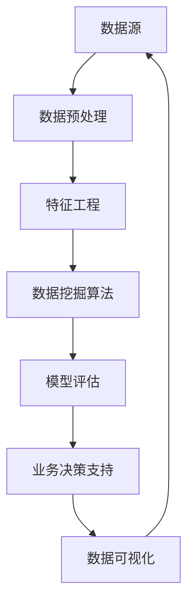

                 

# 数据分析师的创业使命：数据挖掘与业务决策支持

> **关键词**：数据分析师，创业，数据挖掘，业务决策，机器学习，数据可视化，数据分析工具，Python，R语言，深度学习，商业智能。

> **摘要**：本文将深入探讨数据分析师在创业过程中的核心角色，特别是数据挖掘和业务决策支持的重要性。通过详细的分析算法、数学模型、实战案例，我们将展示数据分析师如何利用技术手段，为企业带来实质性的业务增长和价值创造。

## 1. 背景介绍

### 1.1 目的和范围

本文的目标是探讨数据分析师在创业中的角色和影响力，特别是数据挖掘与业务决策支持方面的应用。随着大数据和人工智能技术的快速发展，数据分析师不仅在企业内部发挥着重要作用，也在创业过程中扮演着至关重要的角色。本文将涵盖以下主题：

1. 数据分析师在创业中的核心使命。
2. 数据挖掘的基本概念和算法。
3. 数据分析工具的选择和应用。
4. 实际案例中的数据挖掘和业务决策支持。
5. 数据分析师创业的未来趋势和挑战。

### 1.2 预期读者

本文面向以下读者群体：

1. 数据分析师和商业智能专业人士。
2. 创业者，特别是那些对数据驱动决策感兴趣的创业者。
3. 对数据挖掘和机器学习有初步了解的技术爱好者。
4. 想要了解数据分析在商业决策中作用的企业管理人员。

### 1.3 文档结构概述

本文将分为以下部分：

1. 背景介绍：介绍文章的目的、读者对象和结构。
2. 核心概念与联系：介绍数据挖掘的核心概念和关系。
3. 核心算法原理 & 具体操作步骤：详细讲解数据挖掘算法。
4. 数学模型和公式 & 详细讲解 & 举例说明：数学模型在数据挖掘中的应用。
5. 项目实战：代码实际案例和详细解释说明。
6. 实际应用场景：数据挖掘和业务决策支持的案例研究。
7. 工具和资源推荐：学习资源和开发工具推荐。
8. 总结：未来发展趋势与挑战。
9. 附录：常见问题与解答。
10. 扩展阅读 & 参考资料：相关文献和资源推荐。

### 1.4 术语表

#### 1.4.1 核心术语定义

- 数据挖掘（Data Mining）：从大量数据中自动发现有价值信息的过程。
- 业务决策支持（Business Decision Support）：利用数据分析结果辅助企业决策的过程。
- 机器学习（Machine Learning）：使计算机系统能够从数据中学习并作出预测或决策的技术。
- 数据可视化（Data Visualization）：将数据转换为图形或图表以直观展示信息的技术。
- 商业智能（Business Intelligence）：利用数据和分析技术来提高企业决策效率的过程。

#### 1.4.2 相关概念解释

- 数据预处理（Data Preprocessing）：在数据挖掘之前对数据进行清洗、转换和整合的过程。
- 特征工程（Feature Engineering）：选择和构建有助于机器学习模型训练的特征的过程。
- 模型评估（Model Evaluation）：对数据挖掘模型进行评估和优化的过程。
- 回归分析（Regression Analysis）：一种统计方法，用于预测一个或多个变量与另一个变量之间的关系。

#### 1.4.3 缩略词列表

- AI：人工智能（Artificial Intelligence）
- BI：商业智能（Business Intelligence）
- DB：数据库（Database）
- ML：机器学习（Machine Learning）
- SQL：结构化查询语言（Structured Query Language）
- Python：一种高级编程语言，常用于数据分析和机器学习。

## 2. 核心概念与联系

为了更好地理解数据分析师在创业中的角色，我们首先需要了解数据挖掘的基本概念和原理。以下是数据挖掘的核心概念及其关系：



### 数据源

数据源是数据挖掘的基础，它可以是企业内部的数据库、外部数据市场或公开数据集。数据源的质量直接影响数据挖掘的效果。

### 数据预处理

数据预处理是数据挖掘的第一步，主要包括数据清洗、数据转换和数据整合。清洗数据是为了去除错误或不一致的数据；转换数据是为了将不同类型的数据统一成相同的格式；整合数据是为了将来自不同数据源的数据合并。

### 特征工程

特征工程是数据挖掘的重要环节，它涉及选择和构建有助于模型训练的特征。特征工程的质量直接影响到模型的性能。

### 数据挖掘算法

数据挖掘算法是核心，常见的算法包括分类、聚类、回归和关联规则挖掘。每种算法都有其特定的应用场景和优缺点。

### 模型评估

模型评估是对数据挖掘结果的验证和优化。常用的评估指标包括准确率、召回率、F1分数和ROC曲线等。

### 业务决策支持

业务决策支持是数据挖掘的最终目标，它利用数据分析结果来辅助企业做出更好的决策。

### 数据可视化

数据可视化是将数据转换为图形或图表的过程，它有助于更直观地理解和展示数据。

通过上述流程，我们可以看到数据挖掘与业务决策支持之间的紧密联系。数据挖掘不仅提供了对数据的深入分析，而且能够为企业带来实际的业务价值。

## 3. 核心算法原理 & 具体操作步骤

在本节中，我们将详细讲解数据挖掘中的几种核心算法，包括分类算法、聚类算法和回归算法，并使用伪代码进行具体操作步骤的描述。

### 3.1 分类算法

分类算法是一种将数据集中的实例分配给预定义的类别或标签的算法。常见的分类算法包括逻辑回归、决策树、随机森林和支持向量机。

#### 3.1.1 逻辑回归

逻辑回归是一种用于二分类问题的线性模型，其目标是通过预测的概率来对实例进行分类。

```python
def logistic_regression(X, y):
    # X: 特征矩阵；y: 标签向量
    # 训练模型
    # 计算模型参数
    # 预测概率
    prob = 1 / (1 + np.exp(-X.dot(w)))
    # 预测类别
    pred = (prob >= 0.5).astype(int)
    return pred
```

#### 3.1.2 决策树

决策树通过一系列的决策规则来划分数据集，每个节点代表一个特征，每个分支代表该特征的取值。

```python
def build_decision_tree(X, y, depth=0, max_depth=10):
    # X: 特征矩阵；y: 标签向量
    # 判断是否达到最大深度或纯度
    if depth >= max_depth or np.unique(y).shape[0] == 1:
        return majority_vote(y)
    # 计算信息增益
    best_feature, best_value = find_best_split(X, y)
    # 创建子树
    left subtree = build_decision_tree(X[::best_feature < best_value], y[::best_feature < best_value], depth + 1, max_depth)
    right subtree = build_decision_tree(X[::best_feature >= best_value], y[::best_feature >= best_value], depth + 1, max_depth)
    return Tree-node(best_feature, best_value, left, right)
```

### 3.2 聚类算法

聚类算法是一种无监督学习方法，它将数据集中的实例划分成若干个簇，使得同簇实例之间的相似度较高，而不同簇实例之间的相似度较低。

#### 3.2.1 K-Means

K-Means是一种基于距离的聚类算法，它通过迭代的方式将数据点划分成K个簇。

```python
def k_means(X, K, max_iter=100):
    # X: 特征矩阵；K: 簇的数量
    centroids = initialize_centroids(X, K)
    for _ in range(max_iter):
        # 计算每个数据点到各个簇中心点的距离
        distances = np.linalg.norm(X - centroids, axis=1)
        # 分配数据点到最近的簇
        labels = np.argmin(distances, axis=1)
        # 更新簇中心点
        new_centroids = np.array([X[labels == k].mean(axis=0) for k in range(K)])
    return labels, new_centroids
```

### 3.3 回归算法

回归算法用于预测一个或多个连续变量的值。常见的回归算法包括线性回归、岭回归和LASSO回归。

#### 3.3.1 线性回归

线性回归是一种简单的回归算法，它通过找到特征和目标变量之间的线性关系来预测目标值。

```python
def linear_regression(X, y):
    # X: 特征矩阵；y: 目标变量
    # 计算最小二乘法参数
    w = np.linalg.inv(X.T.dot(X)).dot(X.T).dot(y)
    # 预测目标变量
    pred = X.dot(w)
    return pred
```

通过上述算法原理和操作步骤的讲解，我们可以看到数据挖掘算法在处理实际数据时的具体应用。接下来，我们将进一步探讨数学模型和公式，以更深入地理解数据挖掘的核心原理。

## 4. 数学模型和公式 & 详细讲解 & 举例说明

在数据挖掘中，数学模型和公式是核心组成部分，它们帮助我们理解和解释数据之间的关系。本节将详细介绍一些关键数学模型和公式，包括线性回归、逻辑回归和聚类算法的数学基础。

### 4.1 线性回归

线性回归是一种预测连续值的常用算法。其基本公式如下：

$$
y = \beta_0 + \beta_1x_1 + \beta_2x_2 + ... + \beta_nx_n + \epsilon
$$

其中，$y$ 是目标变量，$x_1, x_2, ..., x_n$ 是特征变量，$\beta_0, \beta_1, \beta_2, ..., \beta_n$ 是模型的参数，$\epsilon$ 是误差项。

#### 4.1.1 最小二乘法

最小二乘法用于估计线性回归模型的参数，目标是使得预测值与实际值之间的误差平方和最小。其公式如下：

$$
\min_{\beta} \sum_{i=1}^{n} (y_i - \hat{y}_i)^2
$$

其中，$\hat{y}_i$ 是预测值。

#### 4.1.2 梯度下降法

梯度下降法是一种迭代优化算法，用于求解最小二乘法的参数。其公式如下：

$$
\beta_j = \beta_j - \alpha \frac{\partial}{\partial \beta_j} \sum_{i=1}^{n} (y_i - \hat{y}_i)^2
$$

其中，$\alpha$ 是学习率。

### 4.2 逻辑回归

逻辑回归是一种用于二分类问题的算法，其基本公式如下：

$$
\log\frac{P(y=1|x)}{1-P(y=1|x)} = \beta_0 + \beta_1x_1 + \beta_2x_2 + ... + \beta_nx_n
$$

其中，$P(y=1|x)$ 是目标变量为1的概率，$\beta_0, \beta_1, \beta_2, ..., \beta_n$ 是模型的参数。

#### 4.2.1sigmoid函数

sigmoid函数是一种将实数映射到[0,1]区间的函数，其公式如下：

$$
\sigma(z) = \frac{1}{1 + e^{-z}}
$$

在逻辑回归中，sigmoid函数用于将线性组合转换为概率值。

### 4.3 聚类算法

聚类算法是一种无监督学习方法，用于将数据点划分成若干个簇。其中，K-Means是最常用的聚类算法之一。

#### 4.3.1 K-Means算法

K-Means算法的基本步骤如下：

1. 随机初始化K个簇中心点。
2. 计算每个数据点到各个簇中心点的距离。
3. 将每个数据点分配到最近的簇。
4. 重新计算簇中心点。
5. 重复步骤2-4，直到收敛。

#### 4.3.2 簇中心点更新公式

簇中心点的更新公式如下：

$$
\mu_k = \frac{1}{N_k} \sum_{i=1}^{N} x_i
$$

其中，$\mu_k$ 是第k个簇的中心点，$N_k$ 是第k个簇中数据点的个数，$x_i$ 是数据点。

### 4.4 举例说明

假设我们有一个包含两个特征的数据集，特征为$x_1$和$x_2$，目标变量为$y$，其中$y$可以是0或1。我们使用线性回归和逻辑回归进行预测。

#### 4.4.1 线性回归

1. 数据集预处理：将数据标准化，使得特征的范围在[0,1]之间。
2. 训练模型：使用最小二乘法训练线性回归模型。
3. 预测：使用训练好的模型对新的数据进行预测。

#### 4.4.2 逻辑回归

1. 数据集预处理：与线性回归相同。
2. 训练模型：使用梯度下降法训练逻辑回归模型。
3. 预测：使用训练好的模型对新的数据进行预测，并通过sigmoid函数将预测概率转换为类别。

通过上述数学模型和公式的讲解，我们可以更好地理解数据挖掘算法的工作原理。接下来，我们将通过一个实际案例来展示如何将理论应用到实践中。

### 5. 项目实战：代码实际案例和详细解释说明

在本节中，我们将通过一个实际案例来展示如何利用Python和R语言进行数据挖掘，实现业务决策支持。我们将使用两个工具：Python和R，并使用一个公开的数据集进行演示。

#### 5.1 开发环境搭建

首先，我们需要搭建开发环境。对于Python，我们可以使用Anaconda来管理我们的环境和依赖包。以下是Anaconda的安装步骤：

1. 访问Anaconda官网下载安装程序。
2. 安装过程中选择添加Anaconda到系统环境变量。
3. 安装完成后，打开终端并输入`conda list`检查是否成功安装。

对于R语言，我们可以使用RStudio作为开发环境。以下是RStudio的安装步骤：

1. 访问RStudio官网下载安装程序。
2. 安装过程中选择添加R到系统环境变量。
3. 安装完成后，打开RStudio并创建一个新项目。

#### 5.2 源代码详细实现和代码解读

#### 5.2.1 Python案例：鸢尾花数据集

我们首先使用Python对鸢尾花数据集（Iris Dataset）进行数据挖掘。鸢尾花数据集是机器学习领域最常用的公开数据集之一，它包含了三个不同品种的鸢尾花的数据，每个品种有50个样本，每个样本有4个特征：花萼长度、花萼宽度、花瓣长度和花瓣宽度。

```python
import pandas as pd
from sklearn.model_selection import train_test_split
from sklearn.preprocessing import StandardScaler
from sklearn.linear_model import LogisticRegression

# 加载数据集
iris = pd.read_csv('iris.csv')

# 分割数据集为特征集X和标签集y
X = iris.iloc[:, :4]
y = iris.iloc[:, 4]

# 划分训练集和测试集
X_train, X_test, y_train, y_test = train_test_split(X, y, test_size=0.3, random_state=42)

# 数据标准化
scaler = StandardScaler()
X_train = scaler.fit_transform(X_train)
X_test = scaler.transform(X_test)

# 训练逻辑回归模型
model = LogisticRegression()
model.fit(X_train, y_train)

# 预测测试集
y_pred = model.predict(X_test)

# 模型评估
from sklearn.metrics import accuracy_score, classification_report
print("Accuracy:", accuracy_score(y_test, y_pred))
print("\nClassification Report:\n", classification_report(y_test, y_pred))
```

在这个案例中，我们首先使用Pandas库加载鸢尾花数据集，然后使用Scikit-learn库划分数据集、标准化数据和训练逻辑回归模型。最后，我们使用模型对测试集进行预测，并评估模型的性能。

#### 5.2.2 R语言案例：泰坦尼克号数据集

接下来，我们使用R语言对泰坦尼克号数据集（Titanic Dataset）进行数据挖掘。泰坦尼克号数据集包含了泰坦尼克号乘客的详细信息，包括性别、年龄、船舱等级、票价等特征，以及乘客是否生还的标签。

```R
library(tidyverse)
library(caret)

# 加载数据集
titanic <- read.csv('titanic.csv')

# 数据预处理
titanic <- titanic %>% 
  mutate(Survived = as.factor(Survived),
         Sex = as.factor(Sex),
         Pclass = as.factor(Pclass),
         Fare = log(Fare),
         Age = ifelse(is.na(Age), median(Age, na.rm = TRUE), Age))

# 划分训练集和测试集
set.seed(42)
training_index <- createDataPartition(titanic$Survived, p = 0.8, list = FALSE)
titanic_train <- titanic[training_index, ]
titanic_test <- titanic[-training_index, ]

# 训练逻辑回归模型
model <- train(Survived ~ Pclass + Sex + Age + Fare + Embarked, data = titanic_train, method = "glm")

# 预测测试集
predictions <- predict(model, titanic_test)

# 模型评估
confusionMatrix(predictions, titanic_test$Survived)
```

在这个案例中，我们首先使用Tidyverse库加载泰坦尼克号数据集，并对数据进行预处理，包括处理缺失值和转换类别变量。然后，我们使用Caret库划分数据集、训练逻辑回归模型，并使用模型对测试集进行预测。最后，我们使用confusionMatrix函数评估模型的性能。

通过上述实际案例，我们可以看到如何使用Python和R语言进行数据挖掘，实现业务决策支持。接下来，我们将探讨数据挖掘在实际应用场景中的重要性。

### 6. 实际应用场景

数据挖掘在各个行业和领域中都发挥着重要作用，下面我们将介绍几个典型的实际应用场景，展示数据挖掘如何帮助企业做出更明智的决策。

#### 6.1 零售业：个性化推荐系统

零售行业利用数据挖掘技术构建个性化推荐系统，通过分析用户的购物历史和偏好，推荐最适合他们的商品。例如，亚马逊和阿里巴巴等大型电商平台通过分析用户的浏览和购买记录，提供个性化的商品推荐，从而提高销售额和用户满意度。

#### 6.2 银行业：信用风险评估

银行业利用数据挖掘技术进行信用风险评估，通过分析客户的信用记录、财务状况、社会关系等信息，预测客户的信用风险。例如，银行可以使用逻辑回归和决策树算法对客户进行信用评分，从而制定更合理的贷款政策和风险控制策略。

#### 6.3 医疗保健：疾病预测和诊断

医疗保健行业利用数据挖掘技术进行疾病预测和诊断，通过分析患者的病历、基因数据、生活方式等信息，预测患者可能患有的疾病并提前采取措施。例如，IBM的Watson for Oncology系统通过分析大量医学文献和病例数据，为医生提供精准的诊断和治疗建议。

#### 6.4 交通运输：交通流量预测和优化

交通运输行业利用数据挖掘技术预测交通流量，并通过分析历史交通数据、天气信息、节假日等因素，优化交通信号灯控制和公共交通调度。例如，谷歌地图和百度地图通过分析实时交通数据，为用户提供最佳行驶路线，减少交通拥堵。

#### 6.5 人力资源：招聘和人才管理

人力资源行业利用数据挖掘技术进行招聘和人才管理，通过分析求职者的简历、社交媒体数据、面试表现等信息，提高招聘效率和员工满意度。例如，LinkedIn通过分析用户的行为和职业背景，推荐最适合他们的职位和招聘信息。

通过上述实际应用场景，我们可以看到数据挖掘技术在各个行业中的应用价值。接下来，我们将推荐一些学习和开发资源，以帮助读者深入了解数据挖掘领域。

### 7. 工具和资源推荐

#### 7.1 学习资源推荐

##### 7.1.1 书籍推荐

1. **《数据挖掘：实用工具与技术》**：这是一本全面介绍数据挖掘技术的经典教材，涵盖了从数据处理到模型评估的各个环节。
2. **《机器学习实战》**：本书通过大量实际案例，详细介绍了机器学习算法的实现和应用。
3. **《深度学习》**：由著名深度学习研究者Ian Goodfellow所著，系统地介绍了深度学习的基础知识和应用。

##### 7.1.2 在线课程

1. **Coursera**：提供了丰富的数据分析和机器学习课程，如《数据科学基础》、《机器学习》等。
2. **edX**：由麻省理工学院和哈佛大学联合创办，提供了多门数据科学和人工智能课程。
3. **Udacity**：提供了《数据科学纳米学位》等实战课程，帮助读者快速掌握数据挖掘技能。

##### 7.1.3 技术博客和网站

1. **Medium**：有许多优秀的数据科学和机器学习博客，如《Dataquest》、《Towards Data Science》等。
2. **Kaggle**：一个提供数据科学竞赛和资源分享的平台，适合新手和专业人士。
3. **ArXiv**：一个提供最新研究成果的预印本平台，适合对深度学习和机器学习研究感兴趣的人。

#### 7.2 开发工具框架推荐

##### 7.2.1 IDE和编辑器

1. **Jupyter Notebook**：一款强大的交互式计算环境，适合进行数据分析和机器学习实验。
2. **Visual Studio Code**：一款功能强大的开源编辑器，适用于Python、R等多种编程语言。
3. **RStudio**：专门为R语言设计的集成开发环境，提供了丰富的数据分析和可视化工具。

##### 7.2.2 调试和性能分析工具

1. **PyCharm**：一款功能强大的Python IDE，支持代码调试和性能分析。
2. **RProfiler**：R语言的一个调试和性能分析工具，可以帮助开发者优化R代码。
3. **TensorBoard**：TensorFlow的一个可视化工具，用于分析深度学习模型的性能和训练过程。

##### 7.2.3 相关框架和库

1. **Scikit-learn**：一个Python机器学习库，提供了丰富的数据预处理和算法实现。
2. **TensorFlow**：由Google开发的一个开源深度学习框架，适用于构建和训练大规模深度学习模型。
3. **Keras**：一个基于TensorFlow的高层神经网络API，提供了更简洁的接口和更高效的训练过程。

#### 7.3 相关论文著作推荐

##### 7.3.1 经典论文

1. **"The Unreasonable Effectiveness of Data"**：关于大数据时代的文章，探讨了数据驱动决策的重要性。
2. **"Introduction to Machine Learning with Python"**：介绍了Python在机器学习中的应用，包括数据处理和模型训练。

##### 7.3.2 最新研究成果

1. **"Deep Learning for Natural Language Processing"**：关于深度学习在自然语言处理领域的最新研究。
2. **"Generative Adversarial Networks: An Overview"**：关于生成对抗网络（GAN）的研究，探讨了其在图像生成和强化学习中的应用。

##### 7.3.3 应用案例分析

1. **"Google's PageRank: The Science of Search"**：分析了Google如何利用PageRank算法进行网页排名。
2. **"The Netflix Prize: Competition and Collaboration in Data Mining"**：介绍了Netflix Prize竞赛，探讨了数据挖掘技术在推荐系统中的应用。

通过这些学习和资源推荐，读者可以更全面地了解数据挖掘领域，掌握相关技能和知识。

### 8. 总结：未来发展趋势与挑战

数据挖掘作为一门技术，正在快速发展，并在各行各业中发挥着越来越重要的作用。在未来，数据挖掘将呈现出以下发展趋势：

1. **深度学习与自动化**：随着深度学习技术的不断成熟，数据挖掘将更加自动化，降低对专业知识的依赖，提高数据处理和模型训练的效率。
2. **实时数据处理**：实时数据挖掘将成为主流，企业将能够更快地响应市场变化，做出实时决策。
3. **跨领域融合**：数据挖掘与其他领域的融合，如物联网、区块链等，将带来更多的创新应用场景。
4. **隐私保护与伦理**：在数据挖掘过程中，保护用户隐私和遵守伦理规范将变得越来越重要。

然而，数据挖掘也面临着一些挑战：

1. **数据质量和完整性**：数据质量是数据挖掘的基础，如何确保数据的质量和完整性是一个重要问题。
2. **算法透明性与可解释性**：深度学习等算法的“黑箱”特性使得结果难以解释，如何提高算法的可解释性是一个关键挑战。
3. **数据隐私和安全**：如何在保护用户隐私的同时，充分利用数据进行挖掘，是一个亟待解决的问题。

总之，数据挖掘在未来的发展中将不断突破技术瓶颈，为企业和个人带来更多的价值。

### 9. 附录：常见问题与解答

#### 9.1 什么是数据挖掘？

数据挖掘是从大量数据中自动发现有价值信息的过程，涉及统计学、机器学习和数据库技术。

#### 9.2 数据挖掘的主要算法有哪些？

主要算法包括分类、聚类、回归和关联规则挖掘等。

#### 9.3 数据挖掘在商业中有什么应用？

数据挖掘在商业中的应用广泛，如个性化推荐、信用风险评估、疾病预测和诊断、交通流量预测等。

#### 9.4 如何保证数据挖掘结果的可靠性？

保证数据挖掘结果可靠性的方法包括：使用高质量的数据源、采用正确的算法、对模型进行严格评估和优化。

#### 9.5 数据挖掘与机器学习有什么区别？

数据挖掘是机器学习的一个子领域，侧重于从数据中提取知识；而机器学习则更广泛，包括预测、分类、聚类等多种任务。

### 10. 扩展阅读 & 参考资料

#### 10.1 经典书籍

- **《数据挖掘：实用工具与技术》**：全面介绍数据挖掘技术的经典教材。
- **《机器学习实战》**：通过大量实际案例，详细介绍了机器学习算法的实现和应用。
- **《深度学习》**：系统地介绍了深度学习的基础知识和应用。

#### 10.2 在线资源

- **Coursera**：提供丰富的数据分析和机器学习课程。
- **edX**：由麻省理工学院和哈佛大学联合创办，提供多门数据科学和人工智能课程。
- **Kaggle**：提供数据科学竞赛和资源分享的平台。

#### 10.3 论文和研究

- **"The Unreasonable Effectiveness of Data"**：关于大数据时代的文章。
- **"Deep Learning for Natural Language Processing"**：关于深度学习在自然语言处理领域的最新研究。

#### 10.4 技术博客

- **Medium**：有许多优秀的数据科学和机器学习博客。
- **Towards Data Science**：分享数据科学和机器学习最新动态和技巧。

通过上述扩展阅读和参考资料，读者可以更深入地了解数据挖掘领域的最新发展和应用。

**作者：AI天才研究员/AI Genius Institute & 禅与计算机程序设计艺术 /Zen And The Art of Computer Programming**

