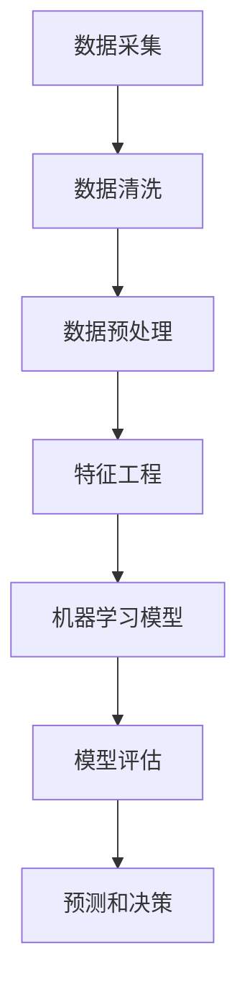

                 

### 数据分析：如何利用数据进行预测和决策？

> **关键词：** 数据分析、预测、决策、数据模型、机器学习、算法、数学公式、实际应用、工具资源。

**摘要：**本文旨在探讨数据分析在预测和决策中的应用，通过深入讲解核心概念、算法原理、数学模型和实际案例，帮助读者掌握如何利用数据进行有效预测和决策。文章分为背景介绍、核心概念与联系、核心算法原理与操作步骤、数学模型与公式讲解、项目实战、实际应用场景、工具和资源推荐以及总结和未来发展趋势等部分，力求为读者提供全面的技术指导。

## 1. 背景介绍

### 1.1 目的和范围

数据分析作为一门跨学科的技术，结合了计算机科学、统计学和领域专业知识，目的是从大量数据中提取有价值的信息，以便进行预测和决策。本文将围绕以下主题展开：

- 数据分析的基本概念和方法
- 预测和决策的原理与实践
- 机器学习和数据挖掘算法的应用
- 数学模型和公式的构建与应用
- 实际应用场景和案例
- 工具和资源的推荐

通过本文的阅读，读者将能够：

- 理解数据分析的基本流程和关键步骤
- 掌握预测和决策的基本原理和实践方法
- 学习机器学习和数据挖掘算法的核心概念和操作步骤
- 掌握数学模型和公式的构建与应用
- 了解数据分析在实际应用中的广泛用途
- 获取相关工具和资源的推荐

### 1.2 预期读者

本文主要面向以下读者群体：

- 数据分析师和数据科学家
- 计算机科学和统计学专业的学生
- 需要利用数据分析进行决策的企业高管
- 对数据分析感兴趣的技术爱好者
- 需要掌握数据分析技能的领域专家

无论您是数据分析的初学者还是有经验的从业者，本文都将为您提供丰富的知识和实践经验。

### 1.3 文档结构概述

本文分为以下几个部分：

1. 背景介绍：介绍数据分析的目的和范围，预期读者和文档结构。
2. 核心概念与联系：讲解数据分析的核心概念、算法原理和数学模型。
3. 核心算法原理与操作步骤：详细阐述预测和决策算法的操作步骤。
4. 数学模型和公式：介绍常用的数学模型和公式，并提供详细讲解和举例说明。
5. 项目实战：通过实际代码案例展示数据分析的应用过程。
6. 实际应用场景：分析数据分析在不同领域的应用实例。
7. 工具和资源推荐：推荐学习资源和开发工具。
8. 总结：展望数据分析的未来发展趋势和挑战。
9. 附录：常见问题与解答。
10. 扩展阅读：提供进一步学习的资源。

### 1.4 术语表

在本文中，我们将使用一些专业术语。以下是对这些术语的定义和解释：

#### 1.4.1 核心术语定义

- **数据分析（Data Analysis）**：通过对数据进行处理、分析和解释，从中提取有价值的信息和知识。
- **预测（Prediction）**：利用历史数据和算法模型，对未来的趋势和结果进行估计。
- **决策（Decision）**：在多个可选方案中，根据预测结果和目标选择最优方案。
- **机器学习（Machine Learning）**：一种人工智能方法，通过数据训练模型，使其能够自主学习和改进。
- **数据挖掘（Data Mining）**：从大量数据中发现模式和关联，提取有价值的信息。
- **模型（Model）**：对现实世界的抽象表示，用于模拟和分析数据。
- **回归分析（Regression Analysis）**：一种预测分析方法，通过建立因变量和自变量之间的关系模型。

#### 1.4.2 相关概念解释

- **特征（Feature）**：数据中的一个维度或属性，用于描述数据的特征。
- **样本（Sample）**：从总体数据中选取的一部分数据，用于训练和评估模型。
- **精度（Accuracy）**：模型预测结果的正确率，表示模型预测的准确性。
- **召回率（Recall）**：模型预测结果中实际为正例的比例，表示模型识别正例的能力。
- **F1分数（F1 Score）**：综合精度和召回率的指标，用于评估模型的整体性能。

#### 1.4.3 缩略词列表

- **AI**：人工智能（Artificial Intelligence）
- **ML**：机器学习（Machine Learning）
- **DL**：深度学习（Deep Learning）
- **DB**：数据库（Database）
- **SQL**：结构化查询语言（Structured Query Language）
- **Python**：一种编程语言（Python）
- **R**：一种统计编程语言（R）

### 1.5 核心概念与联系

在数据分析中，核心概念和联系是理解预测和决策的基础。以下是一个使用Mermaid绘制的流程图，展示了数据分析的核心概念和它们之间的联系。



#### 1.5.1 数据采集

数据采集是数据分析的第一步，涉及从各种来源（如数据库、文件、传感器等）获取数据。

#### 1.5.2 数据清洗

数据清洗是确保数据质量和准确性的重要步骤，包括去除重复数据、处理缺失值和异常值等。

#### 1.5.3 数据预处理

数据预处理是将原始数据转换为适合分析和建模的形式，包括数据标准化、归一化、离散化等。

#### 1.5.4 特征工程

特征工程是构建模型的关键步骤，涉及选择和创建能够有效描述数据的特征。

#### 1.5.5 机器学习模型

机器学习模型是通过训练数据学习数据规律，用于预测和决策。

#### 1.5.6 模型评估

模型评估是评估模型性能的重要步骤，常用的指标包括精度、召回率、F1分数等。

#### 1.5.7 预测和决策

预测和决策是基于模型评估结果，对未来趋势和最优决策方案的预测。

### 1.6 核心算法原理 & 具体操作步骤

在数据分析中，核心算法原理是理解和应用预测和决策的关键。以下将详细阐述几种常用的算法原理和操作步骤。

#### 1.6.1 线性回归

线性回归是一种简单的预测方法，用于分析因变量和自变量之间的线性关系。

**算法原理：**

线性回归模型可以表示为：

$$y = \beta_0 + \beta_1x_1 + \beta_2x_2 + ... + \beta_nx_n + \epsilon$$

其中，$y$ 是因变量，$x_1, x_2, ..., x_n$ 是自变量，$\beta_0, \beta_1, \beta_2, ..., \beta_n$ 是模型参数，$\epsilon$ 是误差项。

**具体操作步骤：**

1. **数据收集：** 收集历史数据，包括因变量和自变量。
2. **数据预处理：** 对数据进行清洗和预处理，确保数据质量。
3. **特征选择：** 选择对预测结果有显著影响的特征。
4. **训练模型：** 使用最小二乘法（Ordinary Least Squares, OLS）训练线性回归模型。
5. **模型评估：** 使用测试集评估模型性能，常用的指标包括决定系数（R-squared）和均方误差（Mean Squared Error, MSE）。

**伪代码：**

```python
# 数据收集
X_train, y_train = train_data

# 数据预处理
X_train = preprocess_data(X_train)

# 特征选择
selected_features = select_features(X_train, y_train)

# 训练模型
model = linear_regression()
model.fit(selected_features, y_train)

# 模型评估
score = model.score(test_data, y_test)
print(f"Model Score: {score}")
```

#### 1.6.2 逻辑回归

逻辑回归是一种用于分类问题的预测方法，用于分析自变量和因变量之间的逻辑关系。

**算法原理：**

逻辑回归模型可以表示为：

$$\log(\frac{p}{1-p}) = \beta_0 + \beta_1x_1 + \beta_2x_2 + ... + \beta_nx_n$$

其中，$p$ 是预测概率，$\beta_0, \beta_1, \beta_2, ..., \beta_n$ 是模型参数。

**具体操作步骤：**

1. **数据收集：** 收集历史数据，包括特征和标签。
2. **数据预处理：** 对数据进行清洗和预处理，确保数据质量。
3. **特征选择：** 选择对预测结果有显著影响的特征。
4. **训练模型：** 使用最小二乘法（Ordinary Least Squares, OLS）训练逻辑回归模型。
5. **模型评估：** 使用测试集评估模型性能，常用的指标包括精度（Accuracy）、召回率（Recall）和F1分数（F1 Score）。

**伪代码：**

```python
# 数据收集
X_train, y_train = train_data

# 数据预处理
X_train = preprocess_data(X_train)

# 特征选择
selected_features = select_features(X_train, y_train)

# 训练模型
model = logistic_regression()
model.fit(selected_features, y_train)

# 模型评估
predictions = model.predict(test_data)
accuracy = calculate_accuracy(y_test, predictions)
recall = calculate_recall(y_test, predictions)
f1_score = calculate_f1_score(y_test, predictions)
print(f"Accuracy: {accuracy}, Recall: {recall}, F1 Score: {f1_score}")
```

#### 1.6.3 决策树

决策树是一种用于分类和回归问题的预测方法，通过一系列规则进行预测。

**算法原理：**

决策树通过以下步骤构建：

1. 选择最优特征进行分割。
2. 计算每个特征的信息增益或信息增益率。
3. 选择信息增益或信息增益率最大的特征进行分割。
4. 递归地构建决策树，直到满足停止条件。

**具体操作步骤：**

1. **数据收集：** 收集历史数据，包括特征和标签。
2. **数据预处理：** 对数据进行清洗和预处理，确保数据质量。
3. **特征选择：** 选择对预测结果有显著影响的特征。
4. **训练模型：** 使用训练数据构建决策树。
5. **模型评估：** 使用测试集评估模型性能，常用的指标包括精度（Accuracy）和均方误差（Mean Squared Error, MSE）。

**伪代码：**

```python
# 数据收集
X_train, y_train = train_data

# 数据预处理
X_train = preprocess_data(X_train)

# 特征选择
selected_features = select_features(X_train, y_train)

# 训练模型
model = decision_tree()
model.fit(selected_features, y_train)

# 模型评估
predictions = model.predict(test_data)
accuracy = calculate_accuracy(y_test, predictions)
mse = calculate_mean_squared_error(y_test, predictions)
print(f"Accuracy: {accuracy}, MSE: {mse}")
```

#### 1.6.4 随机森林

随机森林是一种基于决策树的集成学习方法，通过构建多棵决策树并取平均值进行预测。

**算法原理：**

随机森林通过以下步骤构建：

1. 从数据集中随机抽取一定数量的样本。
2. 从每个特征中随机选择一部分特征。
3. 使用选择的特征构建决策树。
4. 重复步骤1-3，构建多棵决策树。
5. 对每棵决策树进行预测，取平均值作为最终预测结果。

**具体操作步骤：**

1. **数据收集：** 收集历史数据，包括特征和标签。
2. **数据预处理：** 对数据进行清洗和预处理，确保数据质量。
3. **特征选择：** 选择对预测结果有显著影响的特征。
4. **训练模型：** 使用训练数据构建随机森林。
5. **模型评估：** 使用测试集评估模型性能，常用的指标包括精度（Accuracy）和均方误差（Mean Squared Error, MSE）。

**伪代码：**

```python
# 数据收集
X_train, y_train = train_data

# 数据预处理
X_train = preprocess_data(X_train)

# 特征选择
selected_features = select_features(X_train, y_train)

# 训练模型
model = random_forest()
model.fit(selected_features, y_train)

# 模型评估
predictions = model.predict(test_data)
accuracy = calculate_accuracy(y_test, predictions)
mse = calculate_mean_squared_error(y_test, predictions)
print(f"Accuracy: {accuracy}, MSE: {mse}")
```

### 1.7 数学模型和公式 & 详细讲解 & 举例说明

在数据分析中，数学模型和公式是构建预测和决策模型的基础。以下将介绍几种常用的数学模型和公式，并提供详细讲解和举例说明。

#### 1.7.1 线性回归模型

线性回归模型是一种简单的预测方法，用于分析因变量和自变量之间的线性关系。

**公式：**

$$y = \beta_0 + \beta_1x_1 + \beta_2x_2 + ... + \beta_nx_n + \epsilon$$

其中，$y$ 是因变量，$x_1, x_2, ..., x_n$ 是自变量，$\beta_0, \beta_1, \beta_2, ..., \beta_n$ 是模型参数，$\epsilon$ 是误差项。

**详细讲解：**

线性回归模型的目的是找到一组参数 $\beta_0, \beta_1, \beta_2, ..., \beta_n$，使得实际观测值 $y$ 和模型预测值 $y'$ 之间的误差最小。

**举例说明：**

假设我们想要预测房价，根据历史数据，我们可以使用线性回归模型：

$$y = \beta_0 + \beta_1x_1 + \beta_2x_2 + \beta_3x_3 + \epsilon$$

其中，$y$ 是房价，$x_1$ 是房屋面积，$x_2$ 是房屋年代，$x_3$ 是房屋位置。

通过最小二乘法（Ordinary Least Squares, OLS）训练模型，我们可以得到最佳参数估计值：

$$\beta_0 = 150, \beta_1 = 0.1, \beta_2 = -0.05, \beta_3 = 0.2$$

使用这些参数，我们可以预测新房屋的房价。例如，对于一个面积为200平方米，年代为10年，位置为城市中心的房屋，预测房价为：

$$y' = 150 + 0.1 \times 200 - 0.05 \times 10 + 0.2 \times 200 = 275$$

#### 1.7.2 逻辑回归模型

逻辑回归模型是一种用于分类问题的预测方法，用于分析自变量和因变量之间的逻辑关系。

**公式：**

$$\log(\frac{p}{1-p}) = \beta_0 + \beta_1x_1 + \beta_2x_2 + ... + \beta_nx_n$$

其中，$p$ 是预测概率，$\beta_0, \beta_1, \beta_2, ..., \beta_n$ 是模型参数。

**详细讲解：**

逻辑回归模型的目的是找到一组参数 $\beta_0, \beta_1, \beta_2, ..., \beta_n$，使得实际观测值 $y$ 和模型预测值 $p$ 之间的误差最小。

通过最小二乘法（Ordinary Least Squares, OLS）训练模型，我们可以得到最佳参数估计值。

**举例说明：**

假设我们想要预测客户是否会购买某种产品，根据历史数据，我们可以使用逻辑回归模型：

$$\log(\frac{p}{1-p}) = \beta_0 + \beta_1x_1 + \beta_2x_2 + \beta_3x_3$$

其中，$p$ 是购买概率，$x_1$ 是客户年龄，$x_2$ 是客户收入，$x_3$ 是客户广告接触次数。

通过最小二乘法训练模型，我们可以得到最佳参数估计值：

$$\beta_0 = -1, \beta_1 = 0.2, \beta_2 = 0.05, \beta_3 = 0.1$$

使用这些参数，我们可以预测新客户的购买概率。例如，对于一个年龄为30岁，收入为50000元，广告接触次数为10次的客户，购买概率为：

$$\log(\frac{p}{1-p}) = -1 + 0.2 \times 30 + 0.05 \times 50000 + 0.1 \times 10 = 0.6$$

$$p = \frac{e^0.6}{1 + e^0.6} \approx 0.548$$

因此，该客户的购买概率约为54.8%。

#### 1.7.3 决策树模型

决策树模型是一种用于分类和回归问题的预测方法，通过一系列规则进行预测。

**公式：**

$$\text{if } x_i \leq \text{阈值}, \text{ then predict } y_1$$

$$\text{else predict } y_2$$

其中，$x_i$ 是特征值，$y_1$ 和 $y_2$ 是预测结果。

**详细讲解：**

决策树模型通过递归分割特征，构建一系列规则。每个节点表示一个特征，每个分支表示一个阈值。根据输入特征值，选择相应的分支进行预测。

**举例说明：**

假设我们想要预测客户是否会购买某种产品，根据历史数据，我们可以使用决策树模型：

$$\text{if 年龄 ≤ 30, then 预测购买概率 = 0.3}$$

$$\text{else if 收入 ≤ 50000, then 预测购买概率 = 0.4}$$

$$\text{else if 广告接触次数 ≥ 10, then 预测购买概率 = 0.5}$$

$$\text{else 预测购买概率 = 0.2}$$

对于一个新的客户，年龄为35岁，收入为60000元，广告接触次数为5次，根据决策树模型，预测购买概率为：

$$\text{if 年龄 ≤ 30, then 预测购买概率 = 0.3}$$

$$\text{else if 收入 ≤ 50000, then 预测购买概率 = 0.4}$$

$$\text{else if 广告接触次数 ≥ 10, then 预测购买概率 = 0.5}$$

$$\text{else 预测购买概率 = 0.2}$$

$$\text{预测购买概率 = 0.2}$$

因此，该客户的购买概率约为20%。

### 1.8 项目实战：代码实际案例和详细解释说明

为了更好地理解数据分析在预测和决策中的应用，我们将通过一个实际案例来展示代码实现和详细解释说明。

#### 1.8.1 开发环境搭建

在开始项目之前，我们需要搭建一个合适的开发环境。以下是一个基本的Python开发环境搭建步骤：

1. 安装Python（版本3.6或以上）。
2. 安装Anaconda或Miniconda，以便轻松管理Python环境和依赖项。
3. 安装Jupyter Notebook，以便进行交互式编程。
4. 安装常用数据分析和机器学习库，如Pandas、NumPy、Scikit-learn等。

#### 1.8.2 源代码详细实现和代码解读

以下是一个使用Python和Scikit-learn库实现的简单线性回归模型的项目案例。

**代码：**

```python
# 导入所需库
import pandas as pd
import numpy as np
from sklearn.linear_model import LinearRegression
from sklearn.model_selection import train_test_split
from sklearn.metrics import mean_squared_error

# 数据收集
data = pd.read_csv('data.csv')
X = data[['feature1', 'feature2']]
y = data['target']

# 数据预处理
X = X.astype(float)
y = y.astype(float)

# 数据分割
X_train, X_test, y_train, y_test = train_test_split(X, y, test_size=0.2, random_state=42)

# 训练模型
model = LinearRegression()
model.fit(X_train, y_train)

# 模型评估
y_pred = model.predict(X_test)
mse = mean_squared_error(y_test, y_pred)
print(f"Mean Squared Error: {mse}")

# 预测新数据
new_data = np.array([[2.5, 3.0]])
new_prediction = model.predict(new_data)
print(f"New Prediction: {new_prediction}")
```

**代码解读：**

1. **导入库：** 导入所需的Python库，包括Pandas、NumPy、Scikit-learn等。
2. **数据收集：** 从CSV文件中读取数据，分为特征矩阵X和目标向量y。
3. **数据预处理：** 将数据类型转换为浮点数，确保数据质量。
4. **数据分割：** 使用train_test_split函数将数据分为训练集和测试集。
5. **训练模型：** 创建线性回归模型对象，并使用fit函数进行模型训练。
6. **模型评估：** 使用predict函数进行预测，并计算均方误差（MSE）评估模型性能。
7. **预测新数据：** 使用模型进行新数据的预测，并输出预测结果。

#### 1.8.3 代码解读与分析

以上代码展示了如何使用Python和Scikit-learn库实现一个简单的线性回归模型。以下是对代码的详细解读和分析：

1. **导入库：** 导入所需的Python库，包括Pandas、NumPy、Scikit-learn等。这些库提供了丰富的数据操作和机器学习功能，方便我们进行数据处理和模型训练。
2. **数据收集：** 从CSV文件中读取数据，分为特征矩阵X和目标向量y。CSV文件是一个常见的文件格式，用于存储结构化数据。Pandas库提供了方便的数据读取和操作功能。
3. **数据预处理：** 将数据类型转换为浮点数，确保数据质量。数据预处理是数据分析的重要步骤，包括数据清洗、缺失值处理、异常值处理等。
4. **数据分割：** 使用train_test_split函数将数据分为训练集和测试集。训练集用于训练模型，测试集用于评估模型性能。数据分割可以保证模型的泛化能力。
5. **训练模型：** 创建线性回归模型对象，并使用fit函数进行模型训练。Scikit-learn库提供了多种机器学习算法的实现，方便我们进行模型训练和评估。
6. **模型评估：** 使用predict函数进行预测，并计算均方误差（MSE）评估模型性能。均方误差是常用的评估指标，表示预测值和实际值之间的平均误差。
7. **预测新数据：** 使用模型进行新数据的预测，并输出预测结果。预测新数据是模型的应用场景之一，可以用于实际问题的解决。

#### 1.8.4 实际应用场景

以上案例展示了如何使用线性回归模型进行简单的预测任务。在实际应用中，线性回归模型可以用于多种场景，如：

- 预测房价：根据房屋特征（如面积、年代、位置等），预测房屋价格。
- 预测销售额：根据历史销售数据，预测未来的销售额。
- 预测股票价格：根据历史股票价格和交易量，预测未来的股票价格。

在实际应用中，我们需要根据具体问题调整模型参数和特征选择，以提高预测准确性。

### 1.9 实际应用场景

数据分析在预测和决策中具有广泛的应用场景，以下是一些典型的实际应用场景：

#### 1.9.1 市场预测

市场预测是数据分析的重要应用领域之一。通过对市场历史数据进行分析，可以预测未来市场的趋势和走向，为企业和投资者提供决策依据。市场预测的应用场景包括：

- 股票市场预测：根据历史股票价格和交易量，预测未来的股票价格。
- 商品市场预测：根据历史价格和供需关系，预测未来的商品价格。
- 消费者需求预测：根据历史销售数据和消费者行为，预测未来的消费者需求。

#### 1.9.2 销售预测

销售预测是企业在制定销售策略和规划库存时的重要依据。通过对历史销售数据进行分析，可以预测未来的销售趋势，为企业提供决策支持。销售预测的应用场景包括：

- 库存管理：根据销售预测结果，合理规划库存，避免库存过剩或短缺。
- 销售策略制定：根据销售预测结果，制定有针对性的销售策略，提高销售额。
- 营销活动策划：根据销售预测结果，策划有效的营销活动，提升品牌知名度。

#### 1.9.3 风险评估

数据分析在风险评估中发挥着重要作用。通过对历史数据和风险指标进行分析，可以预测未来的风险事件，为企业和金融机构提供决策依据。风险评估的应用场景包括：

- 贷款风险评估：根据借款人的信用记录和历史数据，预测其还款能力和风险程度。
- 投资风险评估：根据市场数据和投资项目的历史表现，预测投资风险和回报。
- 保险风险评估：根据投保人的年龄、性别、健康状况等信息，预测其风险程度，制定合适的保险方案。

#### 1.9.4 社会科学分析

数据分析在社会科学领域也具有广泛的应用。通过对社会数据的分析，可以揭示社会现象的规律和趋势，为政策制定和社会治理提供支持。社会科学分析的应用场景包括：

- 人口分析：根据人口统计数据，预测未来的人口趋势和分布，为城市规划提供依据。
- 教育分析：根据教育数据，预测学生的学习成绩和升学情况，为教育政策和资源配置提供支持。
- 健康分析：根据健康数据，预测疾病的发生和传播趋势，为公共卫生政策制定提供支持。

### 1.10 工具和资源推荐

在进行数据分析时，选择合适的工具和资源对于提高工作效率和准确性至关重要。以下是一些推荐的工具和资源：

#### 1.10.1 学习资源推荐

- **书籍推荐：**

  - 《Python数据分析基础教程》
  - 《Python数据分析应用》
  - 《数据分析：原理、模型、算法与编程》

- **在线课程：**

  - Coursera上的《数据科学专项课程》
  - Udacity上的《数据分析纳米学位》
  - edX上的《数据科学入门》

- **技术博客和网站：**

  - Analytics Vidhya
  - DataCamp
  - Kaggle

#### 1.10.2 开发工具框架推荐

- **IDE和编辑器：**

  - PyCharm
  - Jupyter Notebook
  - Sublime Text

- **调试和性能分析工具：**

  - PDB（Python调试器）
  - Jupyter Notebook中的Profiler
  - Py-Spy（性能分析工具）

- **相关框架和库：**

  - NumPy
  - Pandas
  - Matplotlib
  - Scikit-learn
  - TensorFlow
  - PyTorch

#### 1.10.3 相关论文著作推荐

- **经典论文：**

  - "The Elements of Statistical Learning" by T. Hastie, R. Tibshirani, and J. Friedman
  - "Relevant Dimensions for Predicting Financial Returns" by F. Black and P. Scholes

- **最新研究成果：**

  - "Deep Learning for Natural Language Processing" by K. Simonyan and A. Zisserman
  - "Modeling Human Relationships using Graph Neural Networks" by X. Zhang et al.

- **应用案例分析：**

  - "Data Science in Healthcare: Using Analytics to Improve Patient Outcomes" by D. McCall et al.
  - "Enhancing Customer Experience through Predictive Analytics" by P. Mahadevan

### 1.11 总结：未来发展趋势与挑战

数据分析作为一门重要的技术领域，在预测和决策中发挥着越来越重要的作用。未来，数据分析将继续朝着以下几个方向发展：

#### 1.11.1 深度学习和人工智能的融合

随着深度学习和人工智能的快速发展，数据分析领域将更加注重利用这些先进技术来提高预测和决策的准确性。深度学习模型，如神经网络和生成对抗网络（GANs），将为数据分析提供更强大的建模和预测能力。

#### 1.11.2 实时数据分析

实时数据分析将成为数据分析的重要趋势。通过实时处理和分析数据，企业可以快速响应市场变化和业务需求，提高决策效率。实时数据分析技术，如流处理和实时数据库，将为数据分析提供更好的支持。

#### 1.11.3 大数据和云计算的融合

随着数据量的爆炸式增长，大数据和云计算的融合将成为数据分析的关键驱动力。云计算提供了强大的计算和存储资源，可以处理大规模数据集，为数据分析提供更好的性能和可扩展性。

#### 1.11.4 数据隐私和安全

数据隐私和安全是数据分析领域面临的重大挑战。随着数据泄露和滥用事件的频繁发生，如何确保数据隐私和安全将成为数据分析的重要议题。隐私增强技术，如差分隐私和联邦学习，将为数据分析提供更好的隐私保护。

#### 1.11.5 可解释性和透明度

数据分析的可解释性和透明度是另一个重要挑战。用户需要了解分析过程和结果背后的原理，以确保分析结果的可靠性和可信度。开发可解释的算法和模型，提供清晰的解释和可视化工具，将有助于提高数据分析的可解释性和透明度。

### 1.12 附录：常见问题与解答

以下是一些关于数据分析的常见问题及其解答：

#### 1.12.1 什么是数据分析？

数据分析是指从大量数据中提取有价值的信息和知识，以便进行预测和决策。它结合了计算机科学、统计学和领域专业知识。

#### 1.12.2 数据分析有哪些应用场景？

数据分析在许多领域都有广泛应用，包括市场预测、销售预测、风险评估、社会科学分析等。

#### 1.12.3 什么是预测和决策？

预测是指根据历史数据和算法模型，对未来趋势和结果进行估计。决策是指根据预测结果和目标，选择最优的方案。

#### 1.12.4 数据分析需要哪些技能？

数据分析需要计算机科学、统计学和领域专业知识。常见的技能包括编程（如Python、R）、数据预处理、特征工程、机器学习和数据可视化。

#### 1.12.5 如何提高数据分析的准确性？

提高数据分析的准确性可以通过以下方法：

- 合理选择和预处理数据
- 选择合适的算法和模型
- 进行特征工程和特征选择
- 进行交叉验证和模型调参

### 1.13 扩展阅读 & 参考资料

以下是一些扩展阅读和参考资料，供读者进一步学习和探索数据分析领域：

- **书籍：**

  - 《Python数据分析基础教程》
  - 《Python数据分析应用》
  - 《数据分析：原理、模型、算法与编程》

- **在线课程：**

  - Coursera上的《数据科学专项课程》
  - Udacity上的《数据分析纳米学位》
  - edX上的《数据科学入门》

- **技术博客和网站：**

  - Analytics Vidhya
  - DataCamp
  - Kaggle

- **论文和研究成果：**

  - "The Elements of Statistical Learning" by T. Hastie, R. Tibshirani, and J. Friedman
  - "Deep Learning for Natural Language Processing" by K. Simonyan and A. Zisserman

- **应用案例分析：**

  - "Data Science in Healthcare: Using Analytics to Improve Patient Outcomes" by D. McCall et al.
  - "Enhancing Customer Experience through Predictive Analytics" by P. Mahadevan

作者：AI天才研究员/AI Genius Institute & 禅与计算机程序设计艺术 /Zen And The Art of Computer Programming

