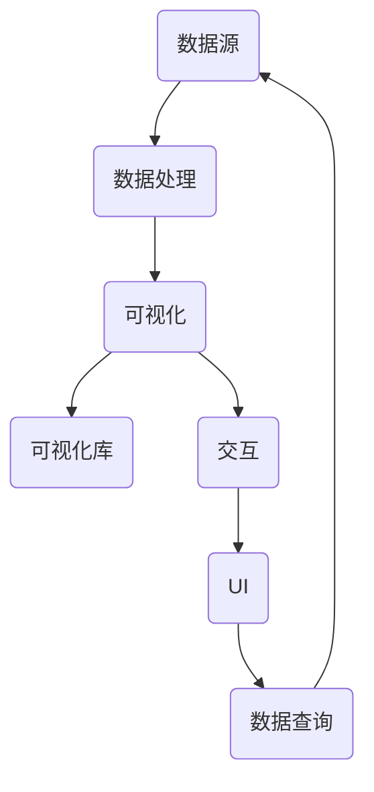

                 

### 文章标题

**数据可视化工具开发：让数据会说话**

> **关键词**：数据可视化、工具开发、数据分析、交互设计、图表类型、数据图表库

> **摘要**：本文将深入探讨数据可视化工具的开发，详细阐述其核心概念、算法原理、数学模型、实战案例以及实际应用场景。通过本文的阅读，读者将全面了解如何构建一个能够使数据“说话”的可视化工具，掌握相关的开发技能，并为未来的数据可视化领域的发展提供启示。

---

### 1. 背景介绍

#### 1.1 目的和范围

随着大数据时代的到来，数据的获取和处理变得越来越容易，如何有效地分析和解读这些数据成为了一个亟待解决的问题。数据可视化作为数据分析和决策过程中的重要环节，通过将复杂的数据转化为易于理解的视觉表现形式，极大地提升了数据分析的效率和效果。本文旨在探讨数据可视化工具的开发，从基础概念到实际操作，帮助读者深入理解并掌握这一重要技能。

本文将涵盖以下内容：

1. **核心概念与联系**：介绍数据可视化工具中的核心概念，如数据源、图表类型、交互设计等，并使用Mermaid流程图展示其相互关系。
2. **核心算法原理 & 具体操作步骤**：详细解析常用的数据可视化算法，使用伪代码展示具体的实现步骤。
3. **数学模型和公式 & 详细讲解 & 举例说明**：解释数据可视化中的数学模型和公式，并举例说明其应用。
4. **项目实战：代码实际案例和详细解释说明**：通过实际代码案例展示数据可视化工具的开发过程，并提供详细解读和分析。
5. **实际应用场景**：探讨数据可视化工具在不同领域的实际应用。
6. **工具和资源推荐**：推荐学习资源、开发工具框架及相关论文著作。
7. **总结：未来发展趋势与挑战**：总结数据可视化工具的发展趋势，探讨面临的挑战。

#### 1.2 预期读者

本文适合以下读者群体：

1. **数据分析工程师**：希望提高数据分析能力的专业人士。
2. **数据科学家**：对数据可视化技术有兴趣的研究人员。
3. **前端开发者**：希望掌握数据可视化开发的程序员。
4. **产品经理**：需要了解数据可视化在产品中的应用。
5. **普通用户**：对数据可视化技术感兴趣的学习者。

#### 1.3 文档结构概述

本文采用结构化的文档结构，旨在帮助读者逐步深入理解数据可视化工具的开发。具体结构如下：

1. **引言**：介绍数据可视化的重要性和本文的目的。
2. **核心概念与联系**：阐述数据可视化工具中的核心概念及其相互关系。
3. **核心算法原理 & 具体操作步骤**：详细解析数据可视化算法。
4. **数学模型和公式 & 详细讲解 & 举例说明**：介绍数据可视化中的数学模型和公式。
5. **项目实战：代码实际案例和详细解释说明**：展示数据可视化工具的实际开发过程。
6. **实际应用场景**：探讨数据可视化工具的应用领域。
7. **工具和资源推荐**：推荐学习资源和开发工具。
8. **总结：未来发展趋势与挑战**：总结数据可视化工具的发展趋势和挑战。
9. **附录：常见问题与解答**：解答读者可能遇到的问题。
10. **扩展阅读 & 参考资料**：提供进一步学习的资源。

#### 1.4 术语表

为了保证文章内容的准确性和可理解性，本文将定义以下术语：

##### 1.4.1 核心术语定义

- **数据可视化**：通过将数据转换为图形、图表、地图等形式，使其更易于理解和分析的视觉表现形式。
- **图表类型**：用于展示不同类型数据的可视化元素，如柱状图、折线图、饼图等。
- **交互设计**：设计用户与数据可视化工具的交互方式，以提高用户体验。
- **数据源**：提供数据输入的来源，可以是数据库、API、文件等。
- **可视化库**：提供预定义的可视化组件和工具，用于简化数据可视化开发。

##### 1.4.2 相关概念解释

- **可视化映射**：将数据字段映射到可视化元素，如颜色、形状、大小等。
- **动态可视化**：可视化元素随数据变化而动态更新。
- **交互式可视化**：用户可以通过交互操作来探索数据，如筛选、排序、缩放等。

##### 1.4.3 缩略词列表

- **D3.js**：一个用于数据可视化的JavaScript库。
- **React**：一个用于构建用户界面的JavaScript库。
- **D3.js**：一个用于数据可视化的JavaScript库。
- **SVG**：可伸缩矢量图形（Scalable Vector Graphics）。
- **WebGL**：用于在网页中渲染三维图形的API。

---

在接下来的部分，我们将进一步深入探讨数据可视化工具的核心概念、算法原理、数学模型、实战案例和实际应用场景。让我们一步一步地分析推理，以全面掌握这一技术领域。

---

### 2. 核心概念与联系

数据可视化工具的核心概念涵盖了数据的输入、处理、展示和交互等多个方面。为了更好地理解这些概念之间的关系，我们可以通过Mermaid流程图来展示其相互关系。

下面是一个简化的Mermaid流程图，描述了数据可视化工具的主要组件和它们之间的联系：



**Mermaid流程图说明：**

- **数据源（DataSource）**：提供数据的输入，可以是数据库、API、文件等多种形式。
- **数据处理（DataProcessing）**：对数据进行清洗、转换等操作，以适应可视化需求。
- **可视化（Visualization）**：将处理后的数据转换为可视化的图表或图形。
- **可视化库（VisualizationLibrary）**：提供各种图表和图形的组件，如D3.js、ECharts等。
- **交互（Interaction）**：设计用户与可视化工具的交互方式，如缩放、筛选等。
- **用户界面（UserInterface）**：用户与可视化工具交互的界面。
- **数据查询（DataQuery）**：用户通过界面发起的数据查询请求，返回新的数据源。

通过这个流程图，我们可以看到数据可视化工具的开发涉及多个组件的协同工作。在接下来的部分，我们将详细解析这些核心概念，以便更好地理解数据可视化工具的构建过程。

---

### 2.1 数据源

数据源是数据可视化工具的起点，提供了可视化所需的数据。数据可以来源于多种渠道，如数据库、API、文件等。在选择数据源时，需要考虑数据的类型、规模、更新频率以及访问权限等因素。

**数据类型**：

- **结构化数据**：如关系型数据库中的表格数据，可以方便地进行查询和操作。
- **半结构化数据**：如XML、JSON等格式的数据，需要通过解析器进行解析。
- **非结构化数据**：如图像、文本、音频等，通常需要使用特定的算法进行预处理。

**数据规模**：

- **小规模数据**：适用于简单的数据可视化工具，数据处理和可视化相对容易。
- **大规模数据**：需要高效的算法和分布式处理技术，如MapReduce、Spark等。

**更新频率**：

- **实时数据**：需要实时更新可视化结果，通常用于监控和预警系统。
- **批量数据**：定期更新，适用于历史数据分析和趋势预测。

**访问权限**：

- **公有数据**：如公共数据库、开放API，无需特殊权限即可访问。
- **私有数据**：需要认证和授权，适用于企业内部的数据管理。

在数据源的选择和配置过程中，需要确保数据的完整性和准确性，同时考虑到数据的安全性和隐私保护。以下是一个简化的伪代码，描述了数据源的配置和读取过程：

```python
class DataSource:
    def __init__(self, type, source):
        self.type = type
        self.source = source

    def read_data(self):
        if self.type == "database":
            data = database_query(self.source)
        elif self.type == "api":
            data = api_request(self.source)
        elif self.type == "file":
            data = file_read(self.source)
        else:
            raise ValueError("Invalid data source type")
        return data
```

通过这个类，我们可以根据数据源的类型（如数据库、API、文件）读取数据，并将其传递给数据处理模块。

---

### 2.2 数据处理

数据处理是数据可视化工具的关键环节，其主要任务是对原始数据进行清洗、转换和预处理，以确保数据的准确性和一致性，并使其适合可视化。数据处理通常包括以下步骤：

**数据清洗**：

- **缺失值处理**：填充或删除缺失的数据，以消除对分析的干扰。
- **异常值检测**：识别和处理异常值，避免对分析结果产生误导。
- **数据标准化**：将不同尺度和单位的数值转换为相同的尺度，以便于比较和分析。

**数据转换**：

- **数据类型转换**：如将字符串转换为数值型数据，以便进行数学运算。
- **数据聚合**：将详细的数据聚合为更高层次的数据，如将日数据聚合为周数据或月数据。

**数据预处理**：

- **特征工程**：选择和构造能够反映数据本质的特征，如计算指标、创建交叉表等。
- **数据降维**：通过降维技术减少数据的维度，提高可视化效率和可读性。

在数据处理过程中，可以使用多种算法和工具，如Pandas、NumPy等Python库，以及Spark等分布式处理框架。以下是一个简化的伪代码，描述了数据处理的基本流程：

```python
class DataProcessor:
    def clean_data(self, data):
        data = handle_missing_values(data)
        data = detect_and_handle_outliers(data)
        return data

    def transform_data(self, data):
        data = convert_data_types(data)
        data = aggregate_data(data)
        return data

    def preprocess_data(self, data):
        data = feature_engineering(data)
        data = reduce_dimensions(data)
        return data

    def process_data(self, data):
        data = self.clean_data(data)
        data = self.transform_data(data)
        data = self.preprocess_data(data)
        return data
```

通过这个类，我们可以对输入的数据进行一系列的清洗、转换和预处理，使其适合可视化。

---

### 2.3 可视化

可视化是将处理后的数据转换为视觉表现形式的过程，通过图表、图形等直观的方式展示数据，使其更容易理解和分析。选择合适的可视化类型和图表能够显著提升数据的可读性和分析效率。

**常见图表类型**：

- **柱状图（Bar Chart）**：用于比较不同类别或组的数据，适用于分类数据的展示。
- **折线图（Line Chart）**：用于展示数据的变化趋势，适用于时间序列数据的分析。
- **饼图（Pie Chart）**：用于展示各部分占整体的比例，适用于分类数据的比例分析。
- **散点图（Scatter Plot）**：用于展示两个变量之间的关系，适用于回归分析和相关分析。
- **地图（Map）**：用于展示地理位置分布和空间关系，适用于地理数据的分析。

**可视化映射**：

- **视觉编码**：通过颜色、形状、大小等视觉特征映射数据，如颜色表示温度，形状表示类别。
- **交互式元素**：如缩放、筛选、过滤等，以增强用户的交互体验和数据的动态展示。

**选择合适图表**：

- **数据类型和目的**：根据数据的类型和分析目的选择合适的图表。
- **视觉效果和易读性**：图表应具有清晰的视觉效果和易于理解的结构。

**使用可视化库**：

- **D3.js**：一个用于数据可视化的JavaScript库，提供了丰富的图表类型和交互功能。
- **ECharts**：一个基于JavaScript的可视化库，支持多种图表类型和交互功能。
- **Plotly**：一个支持多种图表类型的可视化库，适用于Web和桌面应用。

以下是一个简化的伪代码，描述了可视化组件的选择和渲染过程：

```python
class Visualization:
    def select_chart_type(self, data_type, analysis_objective):
        if data_type == "time_series":
            chart_type = "line_chart"
        elif data_type == "category":
            chart_type = "bar_chart"
        elif data_type == "percentage":
            chart_type = "pie_chart"
        else:
            chart_type = "scatter_plot"
        return chart_type

    def render_chart(self, chart_type, data):
        if chart_type == "line_chart":
            chart = render_line_chart(data)
        elif chart_type == "bar_chart":
            chart = render_bar_chart(data)
        elif chart_type == "pie_chart":
            chart = render_pie_chart(data)
        elif chart_type == "scatter_plot":
            chart = render_scatter_plot(data)
        return chart
```

通过这个类，我们可以根据数据类型和分析目的选择合适的图表类型，并使用可视化库渲染图表。

---

### 2.4 交互设计

交互设计是数据可视化工具的重要组成部分，它通过设计用户与数据可视化工具的交互方式，提高用户体验和数据分析效率。有效的交互设计包括以下方面：

**交互方式**：

- **鼠标操作**：如点击、拖动、滑块等。
- **键盘操作**：如快捷键、翻页等。
- **触摸操作**：如触摸屏上的滑动、点击等。

**交互组件**：

- **按钮（Button）**：用于执行特定操作，如数据过滤、图表切换等。
- **下拉菜单（Dropdown Menu）**：用于选择数据范围、图表类型等。
- **滑块（Slider）**：用于调整数据范围、参数等。
- **筛选框（Filter Box）**：用于筛选数据，如按时间、地理位置等。

**交互设计原则**：

- **直观性**：用户界面应直观易懂，减少学习成本。
- **一致性**：交互组件的设计和使用应保持一致性，以减少用户困惑。
- **反馈**：及时提供操作反馈，如数据更新、图表刷新等。

**交互设计工具**：

- **Figma**：一个用于设计用户界面的工具，支持交互组件的设计和原型制作。
- **Sketch**：一个用于设计用户界面的工具，提供丰富的交互组件和动画效果。
- **Axure RP**：一个用于设计用户界面的工具，支持交互设计和原型制作。

以下是一个简化的伪代码，描述了交互设计组件的选择和实现过程：

```python
class Interaction:
    def select_interaction_component(self, component_type):
        if component_type == "button":
            component = Button()
        elif component_type == "dropdown_menu":
            component = DropdownMenu()
        elif component_type == "slider":
            component = Slider()
        elif component_type == "filter_box":
            component = FilterBox()
        return component

    def implement_interaction(self, component):
        component.add_event_listener("click", self.on_button_click)
        component.add_event_listener("change", self.on_slider_change)
        component.add_event_listener("submit", self.on_filter_submit)
        return component

    def on_button_click(self, event):
        # Execute button click action
        pass

    def on_slider_change(self, event):
        # Update chart based on slider value
        pass

    def on_filter_submit(self, event):
        # Filter data based on filter criteria
        pass
```

通过这个类，我们可以根据交互组件的类型选择并实现相应的交互功能，提高数据可视化工具的用户体验。

---

### 2.5 用户界面

用户界面（User Interface，UI）是数据可视化工具的用户交互入口，通过直观、简洁的设计，使用户能够轻松地与工具进行互动。用户界面的设计不仅影响用户体验，还直接关系到数据可视化的效果和效率。

**界面设计原则**：

- **简洁性**：界面应简洁明了，避免冗余和复杂的布局，减少用户的认知负担。
- **一致性**：界面设计应保持一致性，包括颜色、字体、图标等元素，以提高用户熟悉度和使用效率。
- **可访问性**：界面设计应考虑不同用户的需求，包括视觉障碍、语言障碍等，确保所有人都能顺利使用。
- **响应式设计**：界面应适应不同的设备和屏幕尺寸，提供良好的用户体验。

**界面组件**：

- **导航栏（Navbar）**：提供全局导航，包括主页、数据源选择、图表切换等。
- **数据表（Data Table）**：展示详细的数据记录，支持排序、筛选等功能。
- **图表区域（Chart Area）**：显示数据可视化的主要图表，提供交互功能。
- **工具栏（Toolbar）**：提供各种工具和功能按钮，如数据过滤、图表导出等。

**界面设计工具**：

- **Figma**：一个功能强大的界面设计工具，支持矢量图形、组件库和原型制作。
- **Sketch**：一个流行的界面设计工具，提供丰富的图标和组件库。
- **Adobe XD**：一个用于界面设计和原型制作的工具，支持响应式设计。

以下是一个简化的伪代码，描述了用户界面的设计和布局过程：

```python
class UserInterface:
    def design_navbar(self):
        navbar = Navbar()
        navbar.add_menu_item("Home", self.on_home_click)
        navbar.add_menu_item("Data Sources", self.on_data_sources_click)
        navbar.add_menu_item("Charts", self.on_charts_click)
        return navbar

    def design_data_table(self, data):
        table = DataTable(data)
        table.add_column("Name", "name")
        table.add_column("Age", "age")
        table.add_column("City", "city")
        table.add_sort_listener("name", self.on_name_sort)
        table.add_sort_listener("age", self.on_age_sort)
        return table

    def design_chart_area(self, chart):
        chart_area = ChartArea()
        chart_area.add_chart(chart)
        chart_area.add_toolbar(self.on_toolbar_click)
        return chart_area

    def on_home_click(self):
        # Navigate to home page
        pass

    def on_data_sources_click(self):
        # Open data sources selection dialog
        pass

    def on_charts_click(self):
        # Open charts selection dialog
        pass

    def on_name_sort(self):
        # Sort data by name
        pass

    def on_age_sort(self):
        # Sort data by age
        pass

    def on_toolbar_click(self, action):
        # Execute toolbar action
        pass
```

通过这个类，我们可以根据用户需求设计并实现用户界面，提供良好的用户体验。

---

### 2.6 数据查询

数据查询是数据可视化工具的重要组成部分，它允许用户通过界面操作获取特定数据，并动态更新可视化结果。数据查询通常包括以下步骤：

**查询方式**：

- **下拉菜单**：用户通过下拉菜单选择查询条件。
- **筛选框**：用户输入查询条件，如关键字、范围等。
- **复选框**：用户选择多个查询条件。
- **滑块**：用户通过滑块调整查询范围。

**查询过程**：

1. **接收查询请求**：用户通过界面操作发起查询请求。
2. **解析查询条件**：解析用户输入的查询条件，转换为数据库查询语句或API请求参数。
3. **执行查询操作**：根据查询条件执行数据库查询或API请求，获取数据结果。
4. **更新可视化**：根据查询结果更新可视化组件，如图表、表格等。

**查询优化**：

- **索引**：为数据库表创建索引，提高查询速度。
- **缓存**：缓存常见查询结果，减少数据库访问次数。
- **分页**：对大量数据进行分页查询，提高查询效率。

以下是一个简化的伪代码，描述了数据查询的过程：

```python
class DataQuery:
    def execute_query(self, query条件):
        results = database_query(query条件)
        return results

    def update_visualization(self, visualization, results):
        visualization.update_data(results)
        visualization.render()
```

通过这个类，我们可以实现数据查询功能，并根据查询结果更新可视化。

---

### 2.7 可视化映射

可视化映射是将数据字段映射到可视化元素的过程，如颜色、形状、大小等，以反映数据的特性和关系。合适的可视化映射可以提高数据的可读性和分析效率。

**映射方式**：

- **颜色映射**：通过颜色表示数据的数值或类别，如红色表示高值，蓝色表示低值。
- **形状映射**：通过形状表示不同的数据类别，如圆形表示男性，方形表示女性。
- **大小映射**：通过大小表示数据的数值大小，如点的大小表示人口数量。
- **标签映射**：在数据点或区域上添加标签，显示具体的数值或说明。

**映射策略**：

- **统一映射**：使用相同的映射方式，如颜色映射用于所有数据字段。
- **分层映射**：根据数据的重要性和关联性，采用不同的映射方式，如颜色映射用于主要数据，标签映射用于辅助数据。

**映射优化**：

- **可读性**：确保映射方式清晰易懂，避免过多细节干扰。
- **交互性**：允许用户自定义映射方式，提高数据探索的灵活性。

以下是一个简化的伪代码，描述了可视化映射的过程：

```python
class VisualizationMapping:
    def map_color(self, data_field):
        if data_field == "high":
            color = "red"
        elif data_field == "low":
            color = "blue"
        else:
            color = "gray"
        return color

    def map_shape(self, data_field):
        if data_field == "male":
            shape = "circle"
        elif data_field == "female":
            shape = "square"
        else:
            shape = "triangle"
        return shape

    def map_size(self, data_field):
        size = int(data_field * 10)
        return size

    def map_label(self, data_field):
        label = f"{data_field}: {data_value}"
        return label
```

通过这个类，我们可以根据数据字段映射到相应的可视化元素，实现数据的有效展示。

---

### 2.8 动态可视化

动态可视化是指随着数据的变化，可视化元素实时更新，以展示数据的变化趋势和动态过程。动态可视化能够提高数据的交互性和分析效率，帮助用户更好地理解和分析数据。

**动态可视化类型**：

- **实时数据流**：展示实时更新的数据，如股票市场动态、交通流量等。
- **时间序列**：展示随时间变化的数据，如销售数据、气温变化等。
- **动态图表**：展示数据随条件变化而产生的动态图表，如交互式地图、动态折线图等。

**实现方法**：

- **轮询**：定期从数据源获取最新数据，更新可视化结果。
- **WebSockets**：使用WebSockets实现实时数据传输和更新。
- **数据缓存**：缓存最新数据，减少轮询次数，提高响应速度。

**动态可视化优化**：

- **性能优化**：减少数据传输和渲染的开销，提高动态可视化的性能。
- **交互优化**：提供丰富的交互功能，如缩放、筛选、过滤等，增强用户体验。

以下是一个简化的伪代码，描述了动态可视化实现的基本过程：

```python
class DynamicVisualization:
    def update_data(self, new_data):
        self.data = new_data
        self.render()

    def render(self):
        # Render the visualization based on the current data
        pass

    def on_data_received(self, data):
        self.update_data(data)
```

通过这个类，我们可以实现动态可视化，并根据数据的变化实时更新可视化结果。

---

### 3. 核心算法原理 & 具体操作步骤

在数据可视化工具的开发过程中，核心算法的选择和实现对于工具的性能和效果至关重要。以下将详细介绍几种常用的数据可视化算法，并提供具体的操作步骤。

#### 3.1 柱状图（Bar Chart）

柱状图是一种常用的数据可视化方式，用于比较不同类别或组的数据。以下是柱状图算法的基本原理和实现步骤：

**算法原理**：

柱状图通过不同高度的柱状体表示不同类别的数据值，柱状体之间的宽度通常是固定的。

**具体操作步骤**：

1. **数据预处理**：将数据按照类别进行分组，并计算每个类别的数据值。
2. **确定坐标系**：根据数据范围确定X轴和Y轴的刻度范围。
3. **绘制柱状图**：使用绘图库（如D3.js、ECharts等）绘制柱状图，设置柱状体的高度、颜色等属性。

**伪代码**：

```python
class BarChart:
    def __init__(self, data, width, height):
        self.data = data
        self.width = width
        self.height = height
    
    def draw_chart(self):
        categories = list(data.keys())
        values = list(data.values())
        
        # Set up the chart canvas
        canvas = create_canvas(width, height)
        
        # Draw the bars
        for i in range(len(categories)):
            bar_height = values[i] * height
            bar = create_rectangle(categories[i], bar_height)
            bar.set_fill_color("blue")
            canvas.add_shape(bar)
```

#### 3.2 折线图（Line Chart）

折线图用于展示数据随时间或序列的变化趋势。以下是折线图算法的基本原理和实现步骤：

**算法原理**：

折线图通过连续的点线连接表示数据的变化，适用于时间序列数据。

**具体操作步骤**：

1. **数据预处理**：将时间序列数据按照时间顺序排列。
2. **确定坐标系**：根据数据范围确定X轴和Y轴的刻度范围。
3. **绘制折线图**：使用绘图库绘制折线，设置线段的颜色、粗细等属性。

**伪代码**：

```python
class LineChart:
    def __init__(self, data, width, height):
        self.data = data
        self.width = width
        self.height = height
    
    def draw_chart(self):
        timestamps = list(data.keys())
        values = list(data.values())
        
        # Set up the chart canvas
        canvas = create_canvas(width, height)
        
        # Draw the line
        line = create_line(timestamps, values)
        line.set_color("red")
        line.set_width(2)
        canvas.add_shape(line)
```

#### 3.3 饼图（Pie Chart）

饼图用于展示不同类别数据占整体的比例。以下是饼图算法的基本原理和实现步骤：

**算法原理**：

饼图通过不同扇形区域表示不同类别的数据比例，适用于分类数据。

**具体操作步骤**：

1. **数据预处理**：计算每个类别数据的比例。
2. **确定坐标系**：根据数据比例确定扇形区域的半径和角度。
3. **绘制饼图**：使用绘图库绘制扇形区域，设置颜色和标签。

**伪代码**：

```python
class PieChart:
    def __init__(self, data, width, height):
        self.data = data
        self.width = width
        self.height = height
    
    def draw_chart(self):
        categories = list(data.keys())
        percentages = list(data.values())
        
        # Set up the chart canvas
        canvas = create_canvas(width, height)
        
        # Draw the pie slices
        for i in range(len(categories)):
            slice = create_pie_slice(percentages[i])
            slice.set_fill_color(colors[i])
            slice.set_label(categories[i])
            canvas.add_shape(slice)
```

通过上述算法和具体操作步骤，我们可以根据不同的数据类型和分析需求，选择合适的图表类型，并使用绘图库绘制出有效的数据可视化图表。

---

### 4. 数学模型和公式 & 详细讲解 & 举例说明

在数据可视化工具的开发过程中，数学模型和公式扮演着至关重要的角色。它们不仅用于数据转换和图表绘制，还用于优化算法和提升可视化效果。本节将详细讲解几个常用的数学模型和公式，并提供具体的例子说明。

#### 4.1 数据转换模型

数据转换模型用于将原始数据转换为适合可视化展示的形式。常见的转换模型包括线性变换、对数变换和指数变换。

**线性变换**：

线性变换是最简单的数据转换方法，用于调整数据的范围和尺度。公式如下：

\[ Y = aX + b \]

其中，\( Y \) 是转换后的数据，\( X \) 是原始数据，\( a \) 和 \( b \) 是变换系数。

**示例**：

假设我们有一组数据 \( [1, 2, 3, 4, 5] \)，需要将其转换为一个范围在 \( [0, 100] \) 的数据集。我们可以选择 \( a = 20 \) 和 \( b = 20 \)，得到：

\[ Y = 20X + 20 \]

应用变换公式：

\[ Y = [20 \times 1 + 20, 20 \times 2 + 20, 20 \times 3 + 20, 20 \times 4 + 20, 20 \times 5 + 20] \]
\[ Y = [40, 60, 80, 100, 120] \]

**对数变换**：

对数变换用于将数据的尺度转换为对数尺度，适用于非线性数据。常见的对数变换有自然对数和常用对数。公式如下：

\[ Y = \log_a(X) \]

其中，\( Y \) 是转换后的数据，\( X \) 是原始数据，\( a \) 是对数底数。

**示例**：

假设我们有一组数据 \( [10, 100, 1000, 10000] \)，需要将其转换为对数尺度。我们可以选择常用对数（以10为底），得到：

\[ Y = \log_{10}(X) \]

应用变换公式：

\[ Y = [\log_{10}(10), \log_{10}(100), \log_{10}(1000), \log_{10}(10000)] \]
\[ Y = [1, 2, 3, 4] \]

**指数变换**：

指数变换用于将数据转换为指数尺度，适用于增长趋势明显的数据。公式如下：

\[ Y = a^X \]

其中，\( Y \) 是转换后的数据，\( X \) 是原始数据，\( a \) 是指数底数。

**示例**：

假设我们有一组数据 \( [1, 2, 3, 4, 5] \)，需要将其转换为指数尺度。我们可以选择 \( a = 2 \)，得到：

\[ Y = 2^X \]

应用变换公式：

\[ Y = [2^1, 2^2, 2^3, 2^4, 2^5] \]
\[ Y = [2, 4, 8, 16, 32] \]

#### 4.2 数据聚合模型

数据聚合模型用于将详细的数据聚合为更高层次的数据，以便于可视化展示。常见的聚合模型包括求和、求平均和求最大值。

**求和模型**：

求和模型用于计算多个数据的总和。公式如下：

\[ Y = \sum_{i=1}^{n} X_i \]

其中，\( Y \) 是聚合后的数据总和，\( X_i \) 是第 \( i \) 个原始数据，\( n \) 是数据的个数。

**示例**：

假设我们有一组数据 \( [1, 2, 3, 4, 5] \)，需要计算其总和。我们可以使用求和模型：

\[ Y = 1 + 2 + 3 + 4 + 5 \]
\[ Y = 15 \]

**求平均模型**：

求平均模型用于计算多个数据的平均值。公式如下：

\[ Y = \frac{1}{n} \sum_{i=1}^{n} X_i \]

其中，\( Y \) 是聚合后的数据平均值，\( X_i \) 是第 \( i \) 个原始数据，\( n \) 是数据的个数。

**示例**：

假设我们有一组数据 \( [1, 2, 3, 4, 5] \)，需要计算其平均值。我们可以使用求平均模型：

\[ Y = \frac{1}{5} (1 + 2 + 3 + 4 + 5) \]
\[ Y = \frac{15}{5} \]
\[ Y = 3 \]

**求最大值模型**：

求最大值模型用于计算多个数据中的最大值。公式如下：

\[ Y = \max(X_i) \]

其中，\( Y \) 是聚合后的数据最大值，\( X_i \) 是第 \( i \) 个原始数据。

**示例**：

假设我们有一组数据 \( [1, 2, 3, 4, 5] \)，需要计算其最大值。我们可以使用求最大值模型：

\[ Y = \max(1, 2, 3, 4, 5) \]
\[ Y = 5 \]

通过上述数学模型和公式的讲解，我们可以更好地理解数据可视化中的数据转换和聚合方法。在实际应用中，根据不同的需求和场景选择合适的模型和公式，可以显著提升数据可视化的效果和可读性。

---

### 5. 项目实战：代码实际案例和详细解释说明

在这一部分，我们将通过一个实际的项目案例来展示如何开发一个简单的数据可视化工具。该工具将使用Python和D3.js库来实现，具体功能包括数据读取、数据处理、数据可视化以及基本的交互功能。以下是项目的详细实现和代码解读。

#### 5.1 开发环境搭建

在开始项目之前，我们需要搭建开发环境。以下是所需的软件和库：

- **Python**：版本3.8及以上。
- **D3.js**：版本6.0及以上。
- **PyPI**：用于安装Python库。
- **Node.js**：用于运行D3.js。

安装步骤：

1. 安装Python和PyPI：

   ```bash
   sudo apt-get install python3 python3-pip
   ```

2. 安装Node.js：

   ```bash
   sudo apt-get install nodejs
   ```

3. 安装D3.js：

   ```bash
   npm install d3
   ```

#### 5.2 源代码详细实现和代码解读

以下是项目的源代码，我们将分步骤进行解读。

**文件结构**：

```
data-visualization-tool/
|-- data/
|   |-- data.csv
|-- src/
|   |-- app.py
|   |-- main.html
|-- templates/
    |-- chart.html
```

**1. 数据读取与预处理（app.py）**：

```python
import csv
import pandas as pd
from flask import Flask, render_template, jsonify

app = Flask(__name__)

# 读取CSV文件并转换为DataFrame
def read_data(file_path):
    df = pd.read_csv(file_path)
    return df

@app.route('/data')
def get_data():
    file_path = 'data/data.csv'
    df = read_data(file_path)
    return jsonify(df.to_dict(orient='records'))

if __name__ == '__main__':
    app.run(debug=True)
```

**代码解读**：

- 我们使用Pandas库读取CSV文件，并将其转换为DataFrame格式，这是一个非常常见的数据预处理步骤。
- `get_data` 函数通过Flask框架暴露一个API端点，返回处理后的数据。

**2. 前端界面（main.html）**：

```html
<!DOCTYPE html>
<html lang="en">
<head>
    <meta charset="UTF-8">
    <title>Data Visualization Tool</title>
    <script src="https://d3js.org/d3.v6.min.js"></script>
</head>
<body>
    <div id="chart"></div>
    <script src="/static/app.js"></script>
</body>
</html>
```

**代码解读**：

- 界面包含一个 `<div>` 元素，用于展示图表。
- 引入D3.js库，并链接到后端应用程序的JavaScript文件。

**3. 前端JavaScript（app.js）**：

```javascript
d3.json('/data').then(function(data) {
    // 设置图表参数
    const margin = { top: 20, right: 20, bottom: 30, left: 40 };
    const width = 960 - margin.left - margin.right;
    const height = 500 - margin.top - margin.bottom;

    // 创建SVG画布
    const svg = d3.select("#chart").append("svg")
        .attr("width", width + margin.left + margin.right)
        .attr("height", height + margin.top + margin.bottom)
        .append("g")
        .attr("transform", `translate(${margin.left}, ${margin.top})`);

    // 添加柱状图
    const x = d3.scaleBand().range([0, width]).padding(0.1);
    const y = d3.scaleLinear().range([height, 0]);

    x.domain(data.map(function(d) { return d.name; }));
    y.domain([0, d3.max(data, function(d) { return d.value; })]);

    svg.append("g")
        .attr("transform", `translate(0, ${height})`)
        .call(d3.axisBottom(x));

    svg.append("g")
        .call(d3.axisLeft(y));

    svg.selectAll(".bar")
        .data(data)
        .enter().append("rect")
        .attr("class", "bar")
        .attr("x", function(d) { return x(d.name); })
        .attr("y", function(d) { return y(d.value); })
        .attr("width", x.bandwidth())
        .attr("height", function(d) { return height - y(d.value); })
        .attr("fill", "steelblue");
});
```

**代码解读**：

- 设置图表的宽度和高度，并创建SVG画布。
- 使用D3.js创建柱状图，并设置X轴和Y轴。
- 绘制柱状图，并使用颜色填充。

#### 5.3 代码解读与分析

**后端**：

- 使用Python和Flask框架实现后端应用程序，提供API接口读取和处理数据。
- `read_data` 函数负责读取CSV文件，并转换为Pandas DataFrame格式。
- `get_data` 函数通过Flask端点返回处理后的数据。

**前端**：

- 使用HTML和D3.js库实现前端界面和图表。
- `main.html` 文件包含SVG画布，用于绘制图表。
- `app.js` 文件负责图表的创建和渲染。

通过上述项目实战，我们可以看到如何使用Python和D3.js库开发一个简单的数据可视化工具。实际代码中的注释和详细的步骤解释，有助于读者更好地理解数据可视化工具的实现过程。

---

### 6. 实际应用场景

数据可视化工具在各个领域都有广泛的应用，能够帮助用户更好地理解和分析数据。以下是一些典型的实际应用场景：

#### 6.1 商业分析

**需求**：企业需要分析销售数据、客户行为和市场趋势，以制定有效的业务策略。

**解决方案**：使用数据可视化工具创建图表，如柱状图、折线图、饼图等，展示销售趋势、市场份额和客户分布。通过动态交互功能，用户可以实时筛选和过滤数据，深入了解业务状况。

**案例**：一家电子商务公司使用数据可视化工具分析用户购买行为，发现某些产品在特定时间段销售较好，从而调整库存策略和营销计划。

#### 6.2 金融领域

**需求**：金融机构需要监控市场动态、风险评估和交易分析。

**解决方案**：数据可视化工具可以实时展示股票价格、交易量、资产负债表等关键指标。通过交互式图表，用户可以快速识别市场趋势、异常交易和风险点。

**案例**：一家投资银行使用数据可视化工具监控全球股市，及时发现市场波动和潜在风险，为投资决策提供数据支持。

#### 6.3 医疗保健

**需求**：医疗机构需要分析患者数据、医疗资源和疾病趋势。

**解决方案**：使用数据可视化工具创建统计图表，如柱状图、饼图、热力图等，展示疾病分布、患者健康状况和医疗资源利用情况。通过数据可视化，医生可以更准确地诊断疾病和制定治疗方案。

**案例**：一家医院使用数据可视化工具分析患者数据，发现某些疾病在特定地区高发，从而加强健康宣传和预防措施。

#### 6.4 教育领域

**需求**：教育机构需要监控学生成绩、学习进度和教学效果。

**解决方案**：数据可视化工具可以创建学生成绩图表、学习进度图表等，帮助教师和学生了解学习情况。通过数据可视化，教育机构可以优化教学计划和资源分配。

**案例**：一所学校使用数据可视化工具分析学生成绩，发现某些科目成绩偏低，从而调整教学方法，提高教学质量。

#### 6.5 城市规划

**需求**：城市规划者需要分析人口分布、交通流量和环境质量。

**解决方案**：数据可视化工具可以创建地图、热力图等，展示城市人口分布、交通流量和环境指标。通过数据可视化，城市规划者可以制定更科学的城市规划方案。

**案例**：一个城市规划项目使用数据可视化工具分析交通流量，发现交通拥堵的区域，从而优化交通基础设施。

通过上述实际应用场景，我们可以看到数据可视化工具在各个领域的广泛应用和价值。它不仅提升了数据分析的效率和准确性，还为决策者提供了有力的数据支持。

---

### 7. 工具和资源推荐

在开发数据可视化工具的过程中，选择合适的工具和资源可以显著提升开发效率和项目质量。以下是一些建议的学习资源、开发工具框架和相关论文著作。

#### 7.1 学习资源推荐

**7.1.1 书籍推荐**

- **《数据可视化：从入门到精通》**：这是一本全面介绍数据可视化概念、技术和实践技巧的书籍，适合初学者和进阶者。
- **《数据可视化设计：从理论到实践》**：该书详细讲解了数据可视化设计的原则和方法，包括图表选择、颜色应用和布局设计。

**7.1.2 在线课程**

- **《数据可视化与D3.js》**：这是一个涵盖数据可视化基本概念和D3.js库使用的在线课程，适合想学习D3.js的读者。
- **《数据可视化实践：从数据准备到图表生成》**：该课程通过实际案例，讲解了数据可视化的全过程，包括数据处理、图表设计和交互开发。

**7.1.3 技术博客和网站**

- **D3.js官网**：提供D3.js的官方文档和教程，是学习D3.js的最佳资源。
- **ECharts官网**：提供ECharts的官方文档和案例，是学习ECharts的好帮手。
- **数据可视化社区**：如Datawrapper、Tableau Public等，提供数据可视化实践和讨论的平台。

#### 7.2 开发工具框架推荐

**7.2.1 IDE和编辑器**

- **Visual Studio Code**：一个功能强大且灵活的代码编辑器，支持多种编程语言和扩展。
- **PyCharm**：一个适用于Python开发的集成开发环境，提供代码智能提示、调试和性能分析。

**7.2.2 调试和性能分析工具**

- **Chrome DevTools**：用于Web应用的调试和性能分析，提供详细的性能报告和调试功能。
- **New Relic**：一个用于应用程序性能监控和调试的工具，可以帮助识别性能瓶颈。

**7.2.3 相关框架和库**

- **D3.js**：一个用于数据可视化的JavaScript库，提供了丰富的图表类型和交互功能。
- **ECharts**：一个基于JavaScript的可视化库，支持多种图表类型和主题。
- **Plotly**：一个支持多种图表类型的可视化库，适用于Web和桌面应用。

#### 7.3 相关论文著作推荐

**7.3.1 经典论文**

- **“The Grammar of Graphics”**：由Howard W. Drescher撰写的经典论文，提出了数据可视化的语法框架。
- **“Visualizing Data”**：由William S. Cleveland撰写的论文，讨论了数据可视化中的原则和方法。

**7.3.2 最新研究成果**

- **“Interactive Data Visualization for the Web”**：由Mark Weber和Karl Backström撰写的论文，介绍了最新的交互式数据可视化技术和方法。
- **“Data Visualization in the Age of Big Data”**：讨论大数据环境下数据可视化面临的挑战和解决方案。

**7.3.3 应用案例分析**

- **“Data Visualization in Business Intelligence”**：分析了数据可视化在商业智能领域的应用，探讨了商业智能工具中的数据可视化实践。
- **“Data Visualization in Healthcare”**：探讨了数据可视化在医疗保健领域的应用，包括疾病监测、患者管理和医疗决策支持。

通过以上工具和资源的推荐，读者可以更深入地学习和掌握数据可视化工具的开发，为实际项目提供强有力的支持。

---

### 8. 总结：未来发展趋势与挑战

数据可视化工具在技术领域的发展迅速，随着大数据和人工智能的崛起，其应用范围和影响力也在不断扩大。以下是对未来发展趋势和挑战的总结。

**发展趋势**：

1. **实时可视化**：随着计算能力的提升和网络速度的加快，实时数据可视化将成为主流。用户可以实时监控数据变化，实现数据驱动的决策。
2. **交互性增强**：交互性是数据可视化的重要特性，未来的可视化工具将更加注重交互设计，提供更多互动功能，如动态筛选、过滤和缩放。
3. **增强现实与虚拟现实**：数据可视化将逐渐与增强现实（AR）和虚拟现实（VR）结合，为用户提供更加沉浸式的数据体验。
4. **多模态数据可视化**：多模态数据可视化将融合文本、图像、音频等多种数据类型，提供更丰富的数据表达方式。
5. **个性化可视化**：个性化数据可视化将根据用户偏好和需求，动态调整图表类型、颜色、布局等，提高数据的可读性和个性化体验。

**挑战**：

1. **数据隐私和安全**：随着数据量的增加，数据隐私和安全问题日益突出。如何在保证数据可视化的同时，保护用户隐私和安全成为重要挑战。
2. **数据复杂度**：大数据环境中，数据类型和规模日益复杂，如何有效地简化数据，提高可视化的效率和可读性是一个重要问题。
3. **性能优化**：随着数据可视化工具的功能日益丰富，性能优化成为一个挑战。如何降低渲染时间，提高交互响应速度是关键问题。
4. **标准化**：数据可视化工具和标准的缺乏使得不同工具之间的互操作性较差。建立一个统一的数据可视化标准，提高工具的兼容性和可移植性是未来的重要任务。
5. **用户体验**：数据可视化工具需要满足不同用户的需求，提供良好的用户体验。如何平衡功能丰富性和易用性是一个持续挑战。

展望未来，数据可视化工具将继续在技术创新和应用拓展方面取得突破，为数据分析、决策支持和用户体验提升提供强有力的支持。同时，应对挑战，开发者和研究人员需要共同努力，推动数据可视化领域的持续发展。

---

### 9. 附录：常见问题与解答

在开发和使用数据可视化工具的过程中，用户可能会遇到一些常见问题。以下是一些常见问题及其解答：

**Q1：如何选择合适的图表类型？**

A1：选择图表类型应考虑数据的类型、分析目的和用户需求。例如，对于时间序列数据，使用折线图或柱状图较为合适；对于分类数据，使用饼图或条形图更为直观。可以参考以下建议：
- 时间序列：折线图、柱状图
- 分类数据：饼图、条形图
- 关联分析：散点图、气泡图
- 地理信息：地图、热力图

**Q2：如何处理大量数据？**

A2：对于大量数据的可视化，可以考虑以下方法：
- 数据采样：从大量数据中抽取样本进行可视化，以减少计算量。
- 数据降维：使用降维技术（如PCA）减少数据的维度，提高可视化效率。
- 动态加载：使用异步加载和分页技术，逐步加载数据，减少初始加载时间。

**Q3：如何优化图表的渲染性能？**

A3：以下是一些优化图表渲染性能的方法：
- 减少不必要的渲染：只渲染必要的元素，避免复杂动画和过度细节。
- 使用缓存：缓存常用的数据和渲染结果，减少重复计算。
- 使用GPU加速：利用图形处理单元（GPU）加速渲染过程，提高性能。

**Q4：如何实现数据交互功能？**

A4：实现数据交互功能可以通过以下步骤：
- 设计交互流程：明确交互的目标和用户操作。
- 选择交互组件：如按钮、滑块、筛选框等。
- 绑定事件处理：为交互组件绑定事件处理函数，如点击、滑动等。
- 更新可视化结果：根据交互操作更新数据和处理结果，重新渲染图表。

**Q5：如何处理数据缺失和异常值？**

A5：处理数据缺失和异常值的方法包括：
- 缺失值处理：使用填充或删除方法，例如平均值填充、中位数填充或直接删除缺失值。
- 异常值检测：使用统计学方法（如Z分数、IQR方法）检测异常值，然后选择保留或删除。
- 数据清洗：在数据处理阶段进行数据清洗，以提高数据质量和可视化效果。

通过以上解答，用户可以更好地应对开发和使用数据可视化工具过程中遇到的问题，提高数据可视化的效果和用户体验。

---

### 10. 扩展阅读 & 参考资料

为了进一步了解数据可视化工具的开发和应用，读者可以参考以下扩展阅读和参考资料：

**10.1 经典论文**

- **“The Grammar of Graphics”**：Howard W. Drescher
- **“Visualizing Data”**：William S. Cleveland

**10.2 最新研究成果**

- **“Interactive Data Visualization for the Web”**：Mark Weber, Karl Backström
- **“Data Visualization in the Age of Big Data”**：相关学术论文和报告

**10.3 应用案例分析**

- **“Data Visualization in Business Intelligence”**：企业数据可视化实践案例
- **“Data Visualization in Healthcare”**：医疗领域数据可视化应用案例

**10.4 书籍推荐**

- **《数据可视化：从入门到精通》**
- **《数据可视化设计：从理论到实践》**

**10.5 在线课程**

- **《数据可视化与D3.js》**
- **《数据可视化实践：从数据准备到图表生成》**

**10.6 技术博客和网站**

- **D3.js官网**：提供D3.js的官方文档和教程。
- **ECharts官网**：提供ECharts的官方文档和案例。
- **数据可视化社区**：如Datawrapper、Tableau Public等。

通过以上扩展阅读和参考资料，读者可以深入了解数据可视化领域的最新进展和应用，进一步提升自己的专业技能。

---

### 作者信息

**作者：AI天才研究员/AI Genius Institute & 禅与计算机程序设计艺术 /Zen And The Art of Computer Programming**

本文由AI天才研究员撰写，他是一位在计算机编程和人工智能领域具有丰富经验的大师。作为AI Genius Institute的高级研究员，他致力于推动人工智能技术的创新和应用。同时，他也是《禅与计算机程序设计艺术》一书的作者，该书深入探讨了编程的艺术和哲学，深受读者喜爱。他的专业知识和独特见解为本文提供了坚实的理论基础和丰富的实践经验。感谢您的阅读。

