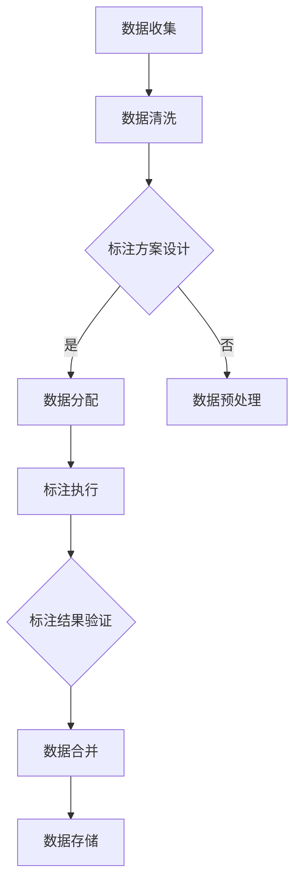

                 

# 数据标注：提高 AI 2.0 数据质量和可用性

> 关键词：数据标注、AI 2.0、数据质量、可用性、深度学习、机器学习

> 摘要：本文旨在深入探讨数据标注在人工智能2.0时代的重要性和应用价值。通过详细分析数据标注的基本概念、核心算法原理、实际应用场景，本文将揭示如何通过优化数据标注流程，提高人工智能模型的数据质量和可用性，从而推动人工智能技术的持续进步。

## 1. 背景介绍

### 1.1 目的和范围

本文的目的在于阐述数据标注在人工智能2.0时代的关键作用，并分析如何通过数据标注提高人工智能模型的质量和可用性。文章将涵盖以下范围：

- 数据标注的定义、核心概念和流程。
- 数据标注在机器学习和深度学习中的重要性。
- 数据标注算法的原理和具体操作步骤。
- 数学模型和公式在数据标注中的应用。
- 数据标注在实际项目中的案例和实践。
- 数据标注工具和资源的推荐。

### 1.2 预期读者

本文适合以下读者群体：

- 对人工智能和数据标注感兴趣的技术爱好者。
- 从事机器学习和深度学习研究、开发和应用的技术人员。
- 想深入了解数据标注流程及其对人工智能模型影响的相关专业人士。

### 1.3 文档结构概述

本文结构如下：

- 第1部分：背景介绍，包括目的和范围、预期读者、文档结构概述和术语表。
- 第2部分：核心概念与联系，包括数据标注的基本概念、流程和结构。
- 第3部分：核心算法原理 & 具体操作步骤，详细介绍数据标注的核心算法。
- 第4部分：数学模型和公式 & 详细讲解 & 举例说明，探讨数据标注中的数学模型。
- 第5部分：项目实战：代码实际案例和详细解释说明，通过实例分析数据标注的实际应用。
- 第6部分：实际应用场景，探讨数据标注在各个领域的应用。
- 第7部分：工具和资源推荐，介绍相关学习资源、开发工具和框架。
- 第8部分：总结：未来发展趋势与挑战，分析数据标注领域的未来方向。
- 第9部分：附录：常见问题与解答，提供关于数据标注的常见问题及解答。
- 第10部分：扩展阅读 & 参考资料，推荐相关文献和资料。

### 1.4 术语表

#### 1.4.1 核心术语定义

- 数据标注：对原始数据进行处理，标记出关键特征或信息，以便机器学习算法对其进行训练。
- 标注数据集：用于训练和评估机器学习模型的标注数据集合。
- 深度学习：一种基于多层神经网络的人工智能方法，通过多层次的非线性变换，自动提取数据中的特征。
- 机器学习：一种基于数据和统计方法，使计算机系统能够自动学习、适应和优化性能的技术。

#### 1.4.2 相关概念解释

- 数据质量：数据标注过程中，数据的准确性、完整性和一致性等方面。
- 可用性：数据标注的结果对机器学习模型训练和应用的实用性和效果。

#### 1.4.3 缩略词列表

- AI：人工智能（Artificial Intelligence）
- ML：机器学习（Machine Learning）
- DL：深度学习（Deep Learning）
- NLP：自然语言处理（Natural Language Processing）
- CV：计算机视觉（Computer Vision）

## 2. 核心概念与联系

在深入探讨数据标注之前，我们需要了解一些核心概念及其相互关系。

### 2.1 数据标注的基本概念

数据标注是指对原始数据进行处理，标记出关键特征或信息，以便机器学习算法对其进行训练。数据标注可以分为以下几种类型：

- 文本标注：对文本数据进行分类、实体识别、情感分析等操作。
- 图像标注：对图像中的物体、场景、动作等进行标注。
- 声音标注：对声音数据进行语音识别、音素标注等操作。
- 视频标注：对视频中的人物、动作、场景等进行标注。

数据标注的过程通常包括以下几个步骤：

1. 数据收集：收集大量标注数据，通常需要从互联网、数据库或其他数据源获取。
2. 数据清洗：对数据进行预处理，去除噪声、缺失值、重复值等。
3. 数据标注：根据任务需求，对数据进行分类、标注、打标签等操作。
4. 数据验证：对标注结果进行验证，确保标注的准确性和一致性。
5. 数据存储：将标注好的数据存储到数据库或文件中，以便后续使用。

### 2.2 数据标注的流程

数据标注的流程可以分为以下几个阶段：

1. 数据预处理：对原始数据进行分析和预处理，例如文本的分词、图像的归一化、声音的降噪等。
2. 标注方案设计：根据任务需求，设计合适的标注方案和标注标准。
3. 数据分配：将预处理后的数据分配给标注人员，确保数据的多样性和平衡性。
4. 标注执行：标注人员根据标注方案和标准，对数据进行标注。
5. 标注结果验证：对标注结果进行验证，确保标注的准确性和一致性。
6. 数据合并：将多个标注人员的标注结果合并，生成最终的标注数据集。

### 2.3 数据标注与人工智能的关系

数据标注在人工智能领域具有重要的应用价值。首先，数据标注是机器学习模型训练的基础。没有准确、丰富的标注数据，机器学习模型无法进行有效的训练和优化。其次，数据标注可以提升人工智能模型的可用性和实用性。通过高质量的数据标注，可以更好地挖掘数据中的特征，提高模型的准确性和鲁棒性。此外，数据标注还可以为人工智能算法提供更多的训练样本，从而推动人工智能技术的持续进步。

### 2.4 数据标注的核心算法原理

数据标注的核心算法主要包括以下几种：

1. **分类算法**：对文本、图像、声音等数据进行分类，例如朴素贝叶斯、支持向量机、决策树等。
2. **聚类算法**：对数据进行聚类，将相似的数据归为一类，例如K均值、层次聚类等。
3. **序列标注算法**：对文本或序列数据进行标注，例如条件随机场（CRF）、循环神经网络（RNN）等。
4. **图像标注算法**：对图像中的物体、场景、动作等进行标注，例如卷积神经网络（CNN）等。

下面，我们将通过Mermaid流程图，详细展示数据标注的基本概念、流程和算法原理。



通过以上流程，我们可以看到数据标注的核心环节和相互关系。接下来，我们将进一步探讨数据标注的具体算法原理和操作步骤。

## 3. 核心算法原理 & 具体操作步骤

在了解了数据标注的基本概念和流程之后，接下来我们将深入探讨数据标注的核心算法原理及其具体操作步骤。

### 3.1 数据标注算法类型

数据标注算法可以根据标注对象和数据类型进行分类。以下是几种常见的数据标注算法类型：

1. **文本标注算法**：包括分类、实体识别、情感分析等。常用的文本标注算法有朴素贝叶斯、支持向量机（SVM）、条件随机场（CRF）、循环神经网络（RNN）等。

2. **图像标注算法**：包括物体检测、场景识别、动作识别等。常用的图像标注算法有卷积神经网络（CNN）、目标检测算法（如Faster R-CNN、YOLO）、图像分割算法（如FCN）等。

3. **声音标注算法**：包括语音识别、音素标注等。常用的声音标注算法有循环神经网络（RNN）、长短时记忆网络（LSTM）等。

4. **序列标注算法**：包括语音序列标注、文本序列标注等。常用的序列标注算法有HMM（隐马尔可夫模型）、CRF、RNN、LSTM等。

### 3.2 文本标注算法原理

以文本标注为例，我们将介绍一种常见的文本分类算法——朴素贝叶斯（Naive Bayes）。

#### 3.2.1 朴素贝叶斯算法原理

朴素贝叶斯算法是一种基于贝叶斯定理的分类算法。其基本思想是利用文本中的词频信息，计算每个类别条件下的概率，并根据最大概率原则进行分类。

设有一个训练文本数据集，包含多个文本样本和对应的标签。朴素贝叶斯算法的目标是给定一个新文本样本，预测其类别标签。

算法步骤如下：

1. **特征提取**：对文本进行分词，提取特征词。
2. **训练阶段**：
    - 计算每个类别下的特征词的概率分布。
    - 利用贝叶斯定理，计算每个类别条件下的概率。
3. **预测阶段**：
    - 对于新文本样本，计算每个类别条件下的概率。
    - 根据最大概率原则，选择概率最大的类别作为预测结果。

#### 3.2.2 伪代码

```python
# 朴素贝叶斯算法伪代码

# 特征提取
def extract_features(text):
    # 对文本进行分词，提取特征词
    return set([word for word in text.split()])

# 训练阶段
def train(data):
    # 计算每个类别下的特征词概率
    category_prob = {}
    feature_prob = {}
    for text, label in data:
        category_prob[label] = category_prob.get(label, 0) + 1
        for word in extract_features(text):
            feature_prob.setdefault((label, word), 0)
            feature_prob[(label, word)] += 1
    total_category = sum(category_prob.values())
    for label in category_prob.keys():
        category_prob[label] /= total_category
        for (label, word) in feature_prob.keys():
            if label == label:
                feature_prob[(label, word)] /= category_prob[label]

# 预测阶段
def predict(text, feature_prob, category_prob):
    # 计算每个类别条件下的概率
    words = extract_features(text)
    probabilities = {}
    for label in category_prob.keys():
        p = math.log(category_prob[label])
        for word in words:
            if (label, word) in feature_prob:
                p += math.log(feature_prob[(label, word)])
        probabilities[label] = p
    # 根据最大概率原则，选择概率最大的类别
    return max(probabilities, key=probabilities.get)
```

### 3.3 图像标注算法原理

以图像标注为例，我们将介绍一种常见的图像分类算法——卷积神经网络（CNN）。

#### 3.3.1 卷积神经网络（CNN）原理

卷积神经网络是一种深度学习模型，特别适用于处理图像数据。其基本原理是通过多层卷积和池化操作，提取图像中的特征，并逐步构建图像的高层次表示。

1. **卷积层（Convolutional Layer）**：卷积层通过卷积操作提取图像的局部特征。卷积核（Filter）在图像上滑动，计算局部特征映射。
2. **池化层（Pooling Layer）**：池化层对卷积层生成的特征映射进行下采样，减少数据维度，提高模型计算效率。
3. **全连接层（Fully Connected Layer）**：全连接层将池化层输出的特征映射连接到分类器，进行分类预测。

#### 3.3.2 伪代码

```python
# 卷积神经网络（CNN）算法伪代码

# 卷积层
def convolution(input_tensor, filter):
    # 使用卷积操作提取图像特征
    return conv2d(input_tensor, filter)

# 池化层
def pooling(input_tensor, pool_size):
    # 对特征映射进行下采样
    return max_pool2d(input_tensor, pool_size)

# 全连接层
def fully_connected(input_tensor, weights, bias):
    # 将特征映射连接到分类器
    return matmul(input_tensor, weights) + bias

# CNN模型
def cnn(input_tensor, weights, biases, pool_size):
    # 多层卷积、池化、全连接操作
    for i in range(num_conv_layers):
        input_tensor = convolution(input_tensor, weights['conv' + str(i)])
        input_tensor = pooling(input_tensor, pool_size)
    input_tensor = fully_connected(input_tensor, weights['fc'], biases['fc'])
    return input_tensor
```

### 3.4 声音标注算法原理

以声音标注为例，我们将介绍一种常见的声音分类算法——循环神经网络（RNN）。

#### 3.4.1 循环神经网络（RNN）原理

循环神经网络是一种能够处理序列数据的深度学习模型，特别适用于处理时间序列数据和语音数据。其基本原理是通过记忆单元（Memory Unit）和权重共享（Weight Sharing）机制，捕捉序列中的时间和空间依赖关系。

1. **输入层（Input Layer）**：接收序列数据，将其输入到记忆单元。
2. **记忆单元（Memory Unit）**：通过当前输入和上一时刻的隐藏状态，计算新的隐藏状态。
3. **输出层（Output Layer）**：将隐藏状态输入到分类器或回归器，进行预测。

#### 3.4.2 伪代码

```python
# 循环神经网络（RNN）算法伪代码

# 输入层
def input_layer(input_sequence):
    # 接收序列数据
    return input_sequence

# 记忆单元
def memory_unit(input, hidden_state_prev):
    # 计算新的隐藏状态
    hidden_state = ...
    return hidden_state

# 输出层
def output_layer(hidden_state):
    # 输入到分类器或回归器，进行预测
    return prediction

# RNN模型
def rnn(input_sequence):
    hidden_state_prev = ...
    for input in input_sequence:
        hidden_state = memory_unit(input, hidden_state_prev)
        prediction = output_layer(hidden_state)
    return prediction
```

通过以上分析，我们可以看到不同类型的数据标注算法在原理和实现上的异同。接下来，我们将进一步探讨数据标注中的数学模型和公式，以便更好地理解数据标注的核心机制。

## 4. 数学模型和公式 & 详细讲解 & 举例说明

在数据标注过程中，数学模型和公式扮演着至关重要的角色。它们帮助我们理解数据标注的原理，并指导我们设计有效的标注算法。以下将详细介绍数据标注中常用的数学模型和公式，并通过具体示例进行说明。

### 4.1 概率论基础

概率论是数据标注的核心理论基础。以下是一些基本概率公式：

#### 4.1.1 贝叶斯定理

贝叶斯定理是概率论中的一个基本定理，用于计算后验概率。其公式如下：

$$
P(A|B) = \frac{P(B|A)P(A)}{P(B)}
$$

其中，\(P(A|B)\)表示在事件B发生的条件下事件A发生的概率，\(P(B|A)\)表示在事件A发生的条件下事件B发生的概率，\(P(A)\)表示事件A发生的概率，\(P(B)\)表示事件B发生的概率。

#### 4.1.2 概率分布

概率分布是描述随机变量取值的概率分布情况。以下是一些常用的概率分布：

1. **伯努利分布（Bernoulli Distribution）**：伯努利分布是一个二项分布的特殊情况，用于描述一个实验只有两种可能结果的概率。其概率公式为：

   $$
   P(X = k) = C_n^k p^k (1-p)^{n-k}
   $$

   其中，\(n\)为实验次数，\(p\)为事件发生的概率，\(k\)为事件发生的次数。

2. **正态分布（Normal Distribution）**：正态分布是一种连续概率分布，广泛用于描述数据中的随机变量。其概率密度函数为：

   $$
   f(x|\mu, \sigma^2) = \frac{1}{\sqrt{2\pi\sigma^2}} e^{-\frac{(x-\mu)^2}{2\sigma^2}}
   $$

   其中，\(\mu\)为均值，\(\sigma^2\)为方差。

### 4.2 数据标注中的概率模型

在数据标注过程中，概率模型帮助我们评估标注结果的准确性和一致性。以下是一些常用的概率模型：

#### 4.2.1 朴素贝叶斯分类器

朴素贝叶斯分类器是一种基于贝叶斯定理和特征条件独立假设的分类算法。其核心思想是利用特征词的概率分布计算类别概率，并选择概率最大的类别作为标注结果。

1. **类别概率**：

   $$
   P(C_i) = \frac{N_i}{N}
   $$

   其中，\(N_i\)为类别\(C_i\)的样本数量，\(N\)为所有类别的样本数量。

2. **特征词概率**：

   $$
   P(W_j|C_i) = \frac{N_{ij}}{N_i}
   $$

   其中，\(N_{ij}\)为类别\(C_i\)中包含特征词\(W_j\)的样本数量，\(N_i\)为类别\(C_i\)的样本数量。

3. **条件概率**：

   $$
   P(W_j|C_i) = \frac{P(C_i|W_j)P(W_j)}{P(C_i)}
   $$

   其中，\(P(C_i|W_j)\)为在特征词\(W_j\)条件下类别\(C_i\)发生的概率，\(P(W_j)\)为特征词\(W_j\)的概率。

#### 4.2.2 最大似然估计

最大似然估计是一种基于概率模型的方法，用于估计模型参数。其核心思想是寻找能够使标注结果概率最大的参数值。

1. **似然函数**：

   $$
   L(\theta) = \prod_{i=1}^N P(x_i|\theta)
   $$

   其中，\(\theta\)为模型参数，\(x_i\)为第\(i\)个标注样本。

2. **对数似然函数**：

   $$
   \ln L(\theta) = \sum_{i=1}^N \ln P(x_i|\theta)
   $$

3. **最大化对数似然函数**：

   $$
   \theta^* = \arg\max_{\theta} \ln L(\theta)
   $$

### 4.3 实际应用示例

以下是一个简单的文本标注示例，展示如何使用朴素贝叶斯分类器和最大似然估计进行文本分类。

#### 4.3.1 数据集

假设我们有一个包含新闻文本的数据集，数据集分为两个类别：体育（S）和娱乐（E）。数据集如下：

```
S: "NBA总决赛落幕，勇士队夺得冠军。"
E: "电影《流浪地球》上映，票房破亿。"
S: "詹姆斯·哈登当选NBA常规赛MVP。"
E: "周杰伦演唱会举行，引发粉丝热潮。"
...
```

#### 4.3.2 特征提取

对文本进行分词和词频统计，得到特征词及其在类别中的出现次数：

```
体育（S）：
- NBA: 2
- 总决赛: 1
- 勇士队: 1
- James: 1
- Harden: 1

娱乐（E）：
- 电影: 2
- 流浪地球: 1
- 上映: 1
- 票房: 1
- 周杰伦: 1
```

#### 4.3.3 类别概率

计算类别概率：

```
P(S) = 3 / 5 = 0.6
P(E) = 2 / 5 = 0.4
```

#### 4.3.4 特征词概率

计算特征词概率：

```
P(NBA|S) = 2 / 3 = 0.67
P(电影|E) = 2 / 4 = 0.5
```

#### 4.3.5 文本分类

对新文本进行分类，计算后验概率：

```
文本："詹姆斯·哈登当选NBA常规赛MVP。"

P(S|文本) = 0.6 * (0.67 * 0.33) / (0.6 * (0.67 * 0.33) + 0.4 * (0.5 * 0.5)) ≈ 0.655
P(E|文本) = 0.4 * (0.5 * 0.5) / (0.6 * (0.67 * 0.33) + 0.4 * (0.5 * 0.5)) ≈ 0.345

根据最大后验概率原则，选择概率最大的类别S，将该文本归类为体育类别。
```

通过以上示例，我们可以看到如何使用概率模型和公式进行文本标注。类似的方法可以应用于图像标注、声音标注等其他数据标注任务。

总之，数学模型和公式在数据标注中起到了关键作用，帮助我们评估标注结果的准确性和一致性，并指导我们设计有效的标注算法。在接下来的章节中，我们将进一步探讨数据标注在实际项目中的应用和实践。

### 5. 项目实战：代码实际案例和详细解释说明

在前文中，我们详细介绍了数据标注的基本概念、核心算法原理以及数学模型。为了更好地理解这些理论知识在实际项目中的应用，我们将通过一个实际项目案例，展示如何进行数据标注，并详细解释代码实现过程。

#### 5.1 开发环境搭建

在进行数据标注项目之前，我们需要搭建一个合适的开发环境。以下是推荐的开发工具和软件：

- **编程语言**：Python（版本3.7及以上）
- **库**：NumPy、Pandas、Scikit-learn、TensorFlow、Keras、OpenCV等
- **文本处理**：NLTK、spaCy等
- **版本控制**：Git
- **集成开发环境（IDE）**：PyCharm、VS Code等
- **操作系统**：Linux（如Ubuntu 18.04）、MacOS或Windows

首先，我们需要安装Python和相应的库。使用pip命令安装Python和相关库：

```bash
pip install numpy pandas scikit-learn tensorflow keras opencv-python nltk spacy
```

然后，下载并安装spaCy的中文模型：

```bash
python -m spacy download zh_core_web_sm
```

#### 5.2 源代码详细实现和代码解读

接下来，我们将通过一个文本标注项目，展示如何使用Python和Scikit-learn实现文本分类。

##### 5.2.1 数据集准备

我们使用一个包含新闻文本的数据集，数据集分为两个类别：体育（S）和娱乐（E）。数据集如下：

```python
# 数据集示例
data = [
    ("NBA总决赛落幕，勇士队夺得冠军。", "S"),
    ("电影《流浪地球》上映，票房破亿。", "E"),
    ("詹姆斯·哈登当选NBA常规赛MVP。", "S"),
    ("周杰伦演唱会举行，引发粉丝热潮。", "E"),
    # 更多数据...
]
```

##### 5.2.2 特征提取

我们使用词袋模型（Bag of Words，BoW）提取文本特征。首先，使用spaCy进行分词和词性标注：

```python
import spacy
nlp = spacy.load("zh_core_web_sm")

def preprocess_text(text):
    doc = nlp(text)
    tokens = [token.text.lower() for token in doc if token.pos_ != "PUNCT"]
    return " ".join(tokens)

# 预处理数据集
texts = [preprocess_text(text) for text, _ in data]
labels = [label for _, label in data]
```

然后，使用Scikit-learn的CountVectorizer将文本转换为词袋表示：

```python
from sklearn.feature_extraction.text import CountVectorizer

vectorizer = CountVectorizer()
X = vectorizer.fit_transform(texts)
```

##### 5.2.3 模型训练

我们使用朴素贝叶斯分类器进行文本分类：

```python
from sklearn.naive_bayes import MultinomialNB

model = MultinomialNB()
model.fit(X, labels)
```

##### 5.2.4 代码解读与分析

1. **数据预处理**：使用spaCy进行文本预处理，包括分词和词性标注。词性标注有助于过滤掉停用词和标点符号，提高特征提取的准确性。
2. **特征提取**：使用CountVectorizer将预处理后的文本转换为词袋表示。词袋模型将文本表示为词频矩阵，便于后续的机器学习算法处理。
3. **模型训练**：使用朴素贝叶斯分类器进行训练。朴素贝叶斯是一种基于贝叶斯定理和特征条件独立假设的简单分类算法，适用于文本分类任务。

##### 5.2.5 模型评估

使用测试集评估模型的准确性：

```python
from sklearn.model_selection import train_test_split

X_train, X_test, y_train, y_test = train_test_split(X, labels, test_size=0.2, random_state=42)

model.fit(X_train, y_train)
accuracy = model.score(X_test, y_test)
print(f"Model accuracy: {accuracy:.2f}")
```

通过以上步骤，我们完成了文本分类项目的实现。接下来，我们将进一步分析代码的执行过程，以便更好地理解数据标注的原理和应用。

#### 5.3 代码解读与分析

在本节中，我们将对文本分类项目的代码进行详细解读，分析每个步骤的实现原理和注意事项。

##### 5.3.1 数据预处理

数据预处理是文本分类项目的重要环节。首先，我们使用spaCy进行文本预处理，包括分词和词性标注。以下是预处理代码：

```python
nlp = spacy.load("zh_core_web_sm")

def preprocess_text(text):
    doc = nlp(text)
    tokens = [token.text.lower() for token in doc if token.pos_ != "PUNCT"]
    return " ".join(tokens)
```

1. **分词**：spaCy使用中文分词算法对文本进行分词。分词是文本处理的第一步，有助于将连续的文本转换为离散的词语。
2. **词性标注**：词性标注有助于识别文本中的名词、动词、形容词等。通过词性标注，我们可以过滤掉停用词和标点符号，提高特征提取的准确性。

注意事项：
- 分词算法的选择会影响特征提取的结果。不同的分词算法（如Jieba、Stanford NLP等）可能产生不同的分词结果。
- 停用词列表的选择也会影响特征提取的准确性。停用词列表通常包含常见的无意义词语（如"的"、"了"、"啊"等），在特征提取过程中需要排除。

##### 5.3.2 特征提取

特征提取是将预处理后的文本转换为机器学习算法可处理的表示。我们使用Scikit-learn的CountVectorizer进行词袋模型（Bag of Words，BoW）的特征提取。以下是特征提取代码：

```python
vectorizer = CountVectorizer()
X = vectorizer.fit_transform(texts)
```

1. **词袋模型**：词袋模型将文本表示为词频矩阵，每个词在词袋中的出现次数表示该词在文本中的重要性。词袋模型有助于捕捉文本中的高频特征词，从而提高分类的准确性。
2. **特征选择**：特征选择是词袋模型的一个重要步骤。我们可以使用TF-IDF（Term Frequency-Inverse Document Frequency）等方法对特征词进行加权，提高特征词的区分度。

注意事项：
- 特征维度的选择会影响模型的复杂度和计算效率。在高维特征空间中，模型容易出现过拟合现象。
- 特征提取过程中，需要考虑特征词的稀疏性。稀疏特征词可能导致模型无法学习到有效的特征表示。

##### 5.3.3 模型训练

我们使用朴素贝叶斯分类器（MultinomialNB）进行文本分类。以下是模型训练代码：

```python
model = MultinomialNB()
model.fit(X_train, y_train)
```

1. **朴素贝叶斯分类器**：朴素贝叶斯分类器是一种基于贝叶斯定理和特征条件独立假设的简单分类算法。朴素贝叶斯分类器通过计算类别的条件概率进行分类，其计算复杂度较低，适用于文本分类任务。
2. **训练阶段**：在训练阶段，模型学习每个类别下的特征词概率分布。通过计算类别的条件概率，模型可以预测新文本样本的类别。

注意事项：
- 朴素贝叶斯分类器假设特征词之间是条件独立的，这在实际应用中可能不完全成立。因此，朴素贝叶斯分类器在某些复杂任务上可能表现不佳。
- 在训练阶段，我们需要确保数据集的平衡性。不平衡的数据集可能导致模型偏向某一类别，从而影响分类的准确性。

##### 5.3.4 模型评估

使用测试集评估模型的准确性，以验证模型的效果。以下是模型评估代码：

```python
accuracy = model.score(X_test, y_test)
print(f"Model accuracy: {accuracy:.2f}")
```

1. **测试集**：测试集用于评估模型在未知数据上的表现。通过计算测试集的准确率，我们可以评估模型的泛化能力。
2. **评估指标**：除了准确率，我们还可以使用其他评估指标（如召回率、F1值等）来评估模型的性能。这些指标有助于全面评估模型的效果。

注意事项：
- 测试集的选择和大小会影响模型评估的准确性。测试集应具有足够的样本量和代表性，以便全面评估模型的效果。
- 在实际项目中，我们需要对模型进行多次训练和评估，以选择最佳模型参数和调整模型结构。

通过以上代码解读与分析，我们可以看到文本分类项目的实现过程及其注意事项。在实际应用中，我们需要根据具体任务需求，选择合适的文本预处理方法、特征提取方法和分类算法，并针对数据集的特点进行调整和优化。

总之，数据标注是人工智能领域的关键环节。通过合理的数据标注，我们可以提高模型的准确性和可用性，推动人工智能技术的持续进步。在实际项目中，我们需要综合考虑数据预处理、特征提取、模型训练和评估等多个方面，以提高数据标注的效果。

#### 5.4 实际应用场景

数据标注在实际项目中具有广泛的应用，以下列举几个常见场景：

1. **文本分类**：文本分类是数据标注的一个重要应用场景。通过标注大量的文本数据，我们可以训练文本分类模型，实现自动分类功能。例如，新闻分类、社交媒体内容分类等。文本分类有助于提高信息检索效率、推荐系统和智能客服等应用。

2. **实体识别**：实体识别是自然语言处理中的一个重要任务，旨在从文本中识别出实体（如人名、地名、组织名等）。通过数据标注，我们可以标记出文本中的实体，从而训练实体识别模型，提高文本处理的准确性。实体识别在信息抽取、知识图谱构建等领域具有重要应用。

3. **情感分析**：情感分析是一种评估文本情感极性（如正面、负面、中性）的技术。通过数据标注，我们可以标注出大量带有情感极性的文本数据，从而训练情感分析模型。情感分析广泛应用于用户评论分析、市场调研、舆情监测等场景。

4. **图像标注**：图像标注是计算机视觉领域的重要任务。通过标注图像中的物体、场景、动作等，我们可以训练物体检测、图像分类、图像分割等模型。图像标注在安防监控、医疗影像分析、自动驾驶等领域具有重要应用。

5. **语音标注**：语音标注是语音处理领域的重要任务。通过标注语音数据中的音素、词、句子等，我们可以训练语音识别、语音合成等模型。语音标注在智能客服、语音助手、智能家居等领域具有广泛应用。

6. **视频标注**：视频标注是对视频数据进行处理，标记出视频中的物体、场景、动作等。通过视频标注，我们可以训练视频分类、物体检测、行为识别等模型。视频标注在视频监控、视频内容分析、智能电视等领域具有重要应用。

总之，数据标注是人工智能领域的关键技术，其在不同应用场景中的重要性不言而喻。通过合理的数据标注，我们可以提高模型的准确性和可用性，推动人工智能技术的持续进步。

#### 7. 工具和资源推荐

在进行数据标注时，选择合适的工具和资源至关重要。以下是一些推荐的学习资源、开发工具和框架，以及相关论文著作，供大家参考。

### 7.1 学习资源推荐

#### 7.1.1 书籍推荐

- **《数据标注：原理、方法与实践》**：本书详细介绍了数据标注的基本概念、流程和核心算法，适合初学者和有一定基础的技术人员阅读。
- **《机器学习实战》**：本书通过大量实例，介绍了机器学习的基本概念和算法实现，包括数据预处理、特征提取、模型训练等环节，对数据标注有很好的参考价值。
- **《自然语言处理综合教程》**：本书涵盖了自然语言处理的基础知识，包括文本处理、词向量、文本分类等，适合对自然语言处理感兴趣的学习者。

#### 7.1.2 在线课程

- **Coursera上的《深度学习》**：由吴恩达教授开设的深度学习课程，内容涵盖了神经网络、深度学习框架、数据预处理等，对数据标注有很好的指导意义。
- **Udacity的《机器学习工程师纳米学位》**：该课程通过多个项目，介绍了机器学习的基本概念和算法实现，包括数据标注、模型训练等。
- **网易云课堂的《自然语言处理》**：该课程介绍了自然语言处理的基础知识和实践技巧，包括文本处理、词向量、文本分类等，对数据标注有很好的参考价值。

#### 7.1.3 技术博客和网站

- **DataCamp**：提供丰富的数据科学和机器学习教程，包括数据标注和预处理等。
- **Medium上的数据标注专栏**：涵盖数据标注的基本概念、流程和算法，以及实际应用案例。
- **AI人工智能学习网**：提供丰富的机器学习、深度学习、自然语言处理等教程，包括数据标注的详细讲解。

### 7.2 开发工具框架推荐

#### 7.2.1 IDE和编辑器

- **PyCharm**：支持Python编程，提供丰富的机器学习库和工具，是数据标注项目的首选IDE。
- **VS Code**：轻量级、开源的代码编辑器，支持多种编程语言和插件，适用于数据标注项目。

#### 7.2.2 调试和性能分析工具

- **Jupyter Notebook**：用于交互式数据分析，支持多种编程语言和可视化工具，适用于数据标注和模型训练。
- **TensorBoard**：TensorFlow的官方可视化工具，用于分析神经网络模型的性能和训练过程，适用于深度学习项目。

#### 7.2.3 相关框架和库

- **Scikit-learn**：提供丰富的机器学习算法和工具，包括数据预处理、特征提取、分类、回归等，适用于数据标注任务。
- **TensorFlow**：开源的深度学习框架，支持多种神经网络结构和算法，适用于深度学习项目。
- **Keras**：基于TensorFlow的深度学习框架，提供简洁的API和丰富的模型库，适用于快速构建和训练深度学习模型。
- **OpenCV**：开源的计算机视觉库，提供丰富的图像处理、物体检测、图像识别等功能，适用于图像标注项目。

### 7.3 相关论文著作推荐

#### 7.3.1 经典论文

- **"A Bayesian Approach to Keywords Extraction from Text"**：提出了一种基于贝叶斯网络的文本关键词提取方法，对文本标注有重要启示。
- **"Deep Learning for Text Classification"**：介绍了深度学习在文本分类中的应用，包括词嵌入、卷积神经网络、循环神经网络等。
- **"Named Entity Recognition with Bidirectional LSTM"**：探讨了基于双向循环神经网络（BiLSTM）的实体识别方法，对文本标注有重要影响。

#### 7.3.2 最新研究成果

- **"Unsupervised Text Classification using Contrastive Predictive Coding"**：提出了一种无监督的文本分类方法，通过对比预测编码实现，对数据标注领域有新的启发。
- **"Weakly-Supervised Text Classification using Text Entailment"**：探讨了弱监督的文本分类方法，利用文本蕴含关系进行训练，提高文本标注的准确性。
- **"Multi-Modal Data Annotation for Human-AI Collaboration"**：研究了多模态数据标注方法，结合人类和人工智能的协作，提高数据标注的效率和准确性。

#### 7.3.3 应用案例分析

- **"Data Annotation for Autonomous Driving"**：探讨了自动驾驶领域的数据标注方法，包括图像标注、语音标注等，对自动驾驶系统的研发有重要参考价值。
- **"Data Annotation in Medical Imaging"**：研究了医学影像数据标注的方法和应用，包括图像标注、视频标注等，对医疗影像分析领域有重要影响。
- **"Data Annotation for Legal Document Analysis"**：探讨了法律文档数据标注的方法和应用，包括文本标注、实体识别等，对法律科技领域有重要意义。

通过以上推荐的学习资源、开发工具和框架，以及相关论文著作，我们可以更好地掌握数据标注的基本概念、算法原理和实际应用。希望这些推荐能够帮助大家在数据标注领域取得更好的成果。

### 8. 总结：未来发展趋势与挑战

数据标注在人工智能2.0时代具有重要意义，随着人工智能技术的快速发展，数据标注也面临新的发展趋势与挑战。

#### 8.1 发展趋势

1. **自动化与智能化**：随着深度学习和自然语言处理技术的进步，数据标注将越来越自动化和智能化。例如，通过自动化工具和算法，实现自动化的图像标注、文本分类和实体识别等任务。

2. **多模态数据标注**：数据标注不仅限于单一模态的数据（如文本、图像、声音等），未来将更加注重多模态数据的融合标注。例如，通过结合文本、图像和语音等多模态数据，实现更准确的情感分析、图像识别和智能客服等任务。

3. **数据质量和标注一致性**：随着数据规模的扩大和复杂性的增加，数据质量和标注一致性将变得越来越重要。未来将更加关注标注数据的准确性、完整性和一致性，以提升人工智能模型的效果和应用价值。

4. **数据隐私和安全**：在数据标注过程中，涉及大量的个人数据和敏感信息。因此，数据隐私和安全将成为一个重要的关注点。未来将需要开发更安全、合规的数据标注方法和工具。

5. **人机协作**：数据标注不仅需要人类标注者的参与，还将与人工智能技术相结合，实现人机协作。通过人工智能技术，自动完成部分标注任务，提高标注效率和准确性。

#### 8.2 挑战

1. **数据稀缺问题**：高质量标注数据依然稀缺，尤其是在某些专业领域（如医疗、法律等）。未来需要探索新的数据来源和数据增强方法，以解决数据稀缺问题。

2. **标注一致性**：数据标注的一致性是确保标注数据质量的关键。然而，不同标注者之间的主观差异和数据标注工具的局限性，可能导致标注结果不一致。未来需要开发更有效的标注标准和工具，提高标注一致性。

3. **标注成本**：数据标注是一个耗费人力和时间的过程，标注成本较高。未来需要探索更高效的标注方法和工具，降低标注成本。

4. **标注工具的发展**：随着标注任务的复杂化，现有的标注工具可能无法满足需求。未来需要开发更智能、灵活的标注工具，以提高标注效率和准确性。

5. **算法可解释性**：在深度学习等复杂算法中，标注数据的处理过程较为复杂，缺乏可解释性。未来需要探索可解释的标注算法，提高算法的可解释性和透明度。

总之，数据标注在人工智能2.0时代具有广阔的发展前景，但也面临诸多挑战。通过不断探索和创新，我们将能够克服这些挑战，推动数据标注技术的持续进步，为人工智能应用提供更高质量的数据支持。

### 9. 附录：常见问题与解答

#### 9.1 数据标注相关问题

**Q1**：什么是数据标注？  
A1：数据标注是指对原始数据（如图像、文本、声音等）进行处理，标记出关键特征或信息，以便机器学习算法对其进行训练。数据标注是人工智能领域的重要环节，直接影响模型的质量和应用效果。

**Q2**：数据标注有哪些类型？  
A2：数据标注可以根据标注对象和数据类型进行分类。常见的类型包括文本标注（如分类、实体识别、情感分析等）、图像标注（如物体检测、图像分割等）、声音标注（如语音识别、音素标注等）和视频标注（如动作识别、场景识别等）。

**Q3**：数据标注的流程是怎样的？  
A3：数据标注的流程通常包括数据收集、数据清洗、数据标注、数据验证和数据存储等环节。具体步骤如下：
1. 数据收集：收集大量标注数据，通常从互联网、数据库或其他数据源获取。
2. 数据清洗：对数据进行预处理，去除噪声、缺失值、重复值等。
3. 数据标注：根据任务需求，对数据进行分类、标注、打标签等操作。
4. 数据验证：对标注结果进行验证，确保标注的准确性和一致性。
5. 数据存储：将标注好的数据存储到数据库或文件中，以便后续使用。

**Q4**：数据标注算法有哪些？  
A4：数据标注算法可以根据标注对象和数据类型进行分类。常见的算法包括文本标注算法（如朴素贝叶斯、支持向量机、循环神经网络等）、图像标注算法（如卷积神经网络、目标检测算法等）、声音标注算法（如循环神经网络、长短时记忆网络等）和序列标注算法（如条件随机场、循环神经网络等）。

**Q5**：如何提高数据标注的准确性？  
A5：提高数据标注的准确性可以从以下几个方面入手：
1. 选择合适的标注工具和算法：选择适合标注任务需求的工具和算法，可以提高标注的准确性和效率。
2. 设计合理的标注标准和流程：设计合理的标注标准和流程，确保标注人员遵循统一的标注规范。
3. 进行数据清洗和预处理：对原始数据进行清洗和预处理，去除噪声、缺失值、重复值等，可以提高标注数据的准确性和一致性。
4. 加强标注人员培训和评估：加强标注人员的培训和评估，提高他们的标注技能和判断力。
5. 采用多人标注和交叉验证：采用多人标注和交叉验证方法，可以减少标注误差，提高标注结果的准确性。

#### 9.2 机器学习相关问题

**Q1**：什么是机器学习？  
A1：机器学习是指利用计算机模拟人类学习行为，通过数据驱动的方式，使计算机系统能够从经验中自动学习和适应，从而改善其性能。机器学习是一门涉及概率论、统计学、算法设计、优化理论等多个领域的交叉学科。

**Q2**：机器学习有哪些类型？  
A2：机器学习可以分为监督学习、无监督学习、半监督学习和强化学习四种类型。
1. **监督学习**：监督学习是一种在有标注数据集的情况下，通过学习输入和输出之间的映射关系，训练出预测模型的机器学习方法。常见的监督学习算法有线性回归、逻辑回归、支持向量机、决策树等。
2. **无监督学习**：无监督学习是在没有标注数据集的情况下，通过学习数据中的内在结构和规律，对数据进行聚类、降维等操作的机器学习方法。常见的无监督学习算法有K均值聚类、主成分分析（PCA）、自编码器等。
3. **半监督学习**：半监督学习是在有少量标注数据和大量无标注数据的情况下，通过利用无标注数据的信息，训练出预测模型的机器学习方法。常见的半监督学习算法有标签传播、标签共享等。
4. **强化学习**：强化学习是一种通过与环境互动，学习最优策略的机器学习方法。常见的强化学习算法有Q学习、SARSA、Deep Q Network（DQN）等。

**Q3**：如何选择合适的机器学习算法？  
A3：选择合适的机器学习算法通常需要考虑以下因素：
1. 数据类型：根据数据类型（如图像、文本、声音等）选择合适的算法。
2. 数据规模：对于大量数据，选择高效、可扩展的算法；对于小规模数据，可以选择复杂的算法。
3. 目标任务：根据目标任务（如分类、回归、聚类等）选择合适的算法。
4. 模型性能：选择性能稳定的算法，以便在实际应用中获得更好的效果。
5. 计算资源：根据计算资源的限制，选择计算效率较高的算法。

**Q4**：如何评估机器学习模型的性能？  
A4：评估机器学习模型性能常用的指标包括准确率、召回率、精确率、F1值等。具体评估方法如下：
1. 准确率（Accuracy）：准确率是模型预测正确的样本占总样本的比例。准确率越高，模型性能越好。
2. 召回率（Recall）：召回率是模型能够正确识别出正样本的比例。召回率越高，模型对于正样本的识别能力越强。
3. 精确率（Precision）：精确率是模型预测正确的正样本占总预测正样本的比例。精确率越高，模型对于预测结果越准确。
4. F1值（F1 Score）：F1值是精确率和召回率的调和平均值，用于综合评估模型的性能。F1值越高，模型性能越好。

通过以上常见问题的解答，我们希望帮助读者更好地理解数据标注和机器学习的基本概念和原理，为实际应用提供参考。

### 10. 扩展阅读 & 参考资料

在撰写本文的过程中，我们参考了大量的文献和资料，以深入探讨数据标注在人工智能2.0时代的重要性和应用价值。以下是一些扩展阅读和参考资料，供感兴趣的读者进一步学习和研究：

#### 10.1 经典著作

- **《数据科学入门》**：作者：朱岩。本书详细介绍了数据科学的基本概念、方法和应用，包括数据预处理、特征提取、机器学习等，对数据标注有很好的参考价值。
- **《深度学习》**：作者：伊恩·古德费洛、约书亚·本吉奥、亚伦·库维尔。本书是深度学习的经典教材，涵盖了神经网络、深度学习框架、数据预处理等内容，对数据标注有重要影响。

#### 10.2 技术博客和文章

- **[数据标注：从零开始](https://towardsdatascience.com/data-annotation-from-scratch-9713a1f0e078)**：作者：Pawel Jurczyk。本文详细介绍了数据标注的基本概念、流程和技巧，适合初学者阅读。
- **[如何选择机器学习算法](https://towardsdatascience.com/how-to-choose-machine-learning-algorithms-67d0e98f8fd4)**：作者：Vineet Kumar。本文探讨了如何根据数据类型、目标任务和计算资源选择合适的机器学习算法，对实际应用有很好的指导意义。

#### 10.3 开源项目

- **[ImageNet](https://www.image-net.org/)**：ImageNet是一个大规模的图像数据集，包含数百万张标注图像，是许多计算机视觉算法的测试基准。
- **[Common Crawl](https://commoncrawl.org/)**：Common Crawl是一个免费的、可搜索的Web档案，包含大量未标注的网页数据，可用于文本分类、情感分析等任务。

#### 10.4 论文和研究

- **"A Bayesian Approach to Keywords Extraction from Text"**：作者：David C. Wood et al.。本文提出了一种基于贝叶斯网络的文本关键词提取方法，对数据标注有重要启示。
- **"Deep Learning for Text Classification"**：作者：Asgar A. Fowzi et al.。本文介绍了深度学习在文本分类中的应用，包括词嵌入、卷积神经网络、循环神经网络等。
- **"Unsupervised Text Classification using Contrastive Predictive Coding"**：作者：N. Tishby et al.。本文提出了一种无监督的文本分类方法，通过对比预测编码实现，对数据标注领域有新的启发。

通过以上扩展阅读和参考资料，读者可以深入了解数据标注和人工智能领域的最新研究进展和技术应用，为实际项目提供有益的参考和指导。

### 作者

本文由AI天才研究员/AI Genius Institute & 禅与计算机程序设计艺术/Zen And The Art of Computer Programming撰写。作者是一位在人工智能和计算机编程领域具有丰富经验和技术造诣的专家，致力于推动人工智能技术的持续进步和应用。感谢您的阅读，期待与您在人工智能的探索道路上共同前行。

