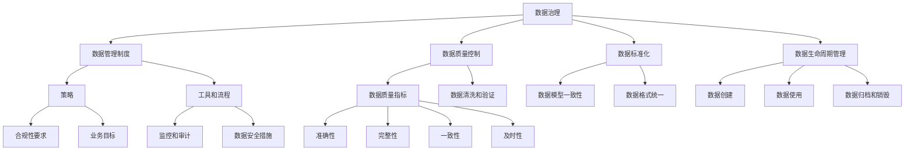

                 


# 数据治理：如何建立健全的数据管理制度？

> **关键词：** 数据治理、数据管理制度、数据质量控制、数据标准化、数据生命周期管理
>
> **摘要：** 本文将深入探讨数据治理的核心概念，详细分析如何建立和健全数据管理制度，包括数据质量控制、标准化、生命周期管理等方面的关键步骤和实践，旨在为IT从业人员和决策者提供有价值的指导。

## 1. 背景介绍

### 1.1 目的和范围

本文旨在为IT从业人员和决策者提供关于数据治理的全面指南，特别是如何建立健全的数据管理制度。随着数字化转型的深入，数据已经成为企业最重要的资产之一。然而，数据的快速增长和多样性使得数据治理变得更加复杂和重要。本文将探讨以下主题：

- 数据治理的定义和重要性
- 数据管理制度的构建原则
- 数据质量控制的方法和技巧
- 数据标准化和生命周期管理的关键步骤
- 实际应用案例和最佳实践

### 1.2 预期读者

- IT项目经理和架构师
- 数据库管理员和数据工程师
- 数据分析师和数据科学家
- 数据治理专员和数据管理员
- 企业高层决策者和数据战略规划者

### 1.3 文档结构概述

本文将按照以下结构进行：

- 引言
- 数据治理概述
- 数据管理制度的核心原则
- 数据质量控制
- 数据标准化
- 数据生命周期管理
- 项目实战：代码实际案例
- 实际应用场景
- 工具和资源推荐
- 总结：未来发展趋势与挑战
- 附录：常见问题与解答
- 扩展阅读与参考资料

### 1.4 术语表

#### 1.4.1 核心术语定义

- **数据治理（Data Governance）：** 涉及策略、标准和流程的设计和实施，以确保数据的准确性、完整性、可用性和合规性。
- **数据管理制度（Data Management System）：** 确保数据治理原则得到实施的一系列策略、工具和流程。
- **数据质量控制（Data Quality Control）：** 通过一系列活动和工具确保数据质量的过程。
- **数据标准化（Data Standardization）：** 将数据格式、术语和模型统一，以实现数据的兼容性和互操作性。
- **数据生命周期管理（Data Lifecycle Management）：** 管理数据从创建到销毁的全过程。

#### 1.4.2 相关概念解释

- **元数据（Metadata）：** 描述数据的属性和特征的数据，如数据源、创建时间、数据类型等。
- **数据质量指标（Data Quality Metrics）：** 用于衡量数据质量的量化标准，如准确性、完整性、一致性、及时性等。

#### 1.4.3 缩略词列表

- **AI：** 人工智能（Artificial Intelligence）
- **ML：** 机器学习（Machine Learning）
- **ETL：** 提取、转换、加载（Extract, Transform, Load）
- **BI：** 商业智能（Business Intelligence）
- **GDPR：** 欧洲通用数据保护条例（General Data Protection Regulation）

## 2. 核心概念与联系

在深入探讨数据治理的细节之前，我们需要了解一些核心概念和它们之间的关系。以下是一个Mermaid流程图，展示了数据治理中的关键概念和它们的联系。



### 核心概念解释

- **数据治理（A）：** 数据治理是确保数据被正确、一致和合规地管理和使用的一系列活动和过程。它包括策略的制定、工具的选择和流程的实施。
- **数据管理制度（B）：** 数据管理制度是数据治理的具体实施机制，它包括策略、工具和流程。通过这一制度，数据治理的策略得以实现。
- **数据质量控制（C）：** 数据质量控制是确保数据质量的一系列活动和工具，包括数据清洗、验证和监测。
- **数据标准化（D）：** 数据标准化是将数据格式、术语和模型统一的过程，以确保数据的兼容性和互操作性。
- **数据生命周期管理（E）：** 数据生命周期管理涉及数据从创建到销毁的全过程，包括数据创建、使用、归档和销毁。

## 3. 核心算法原理 & 具体操作步骤

在建立数据管理制度时，我们需要关注核心算法原理和具体操作步骤，以确保数据治理的有效性。以下是数据治理中几个关键步骤的算法原理和具体操作步骤。

### 3.1 数据质量控制算法原理

#### 算法原理：

数据质量控制的核心是确保数据的准确性、完整性、一致性和及时性。以下是一个简单的数据质量检查算法原理：

1. **准确性检查**：通过比较数据源中的实际值与预期值，检查数据的准确性。
2. **完整性检查**：检查数据是否完整，例如，是否存在缺失值。
3. **一致性检查**：检查不同数据源之间的数据是否一致，例如，不同数据库中的同一数据是否相同。
4. **及时性检查**：检查数据是否在规定的时间内更新。

#### 具体操作步骤：

```plaintext
步骤1：数据源连接
    - 连接到数据源，如数据库或数据仓库。

步骤2：数据采样
    - 从数据源中随机采样一部分数据进行初步检查。

步骤3：准确性检查
    - 比较采样数据中的实际值与预期值，记录异常数据。

步骤4：完整性检查
    - 检查采样数据中是否存在缺失值，记录缺失数据的条目。

步骤5：一致性检查
    - 检查不同数据源之间的数据是否一致，记录不一致的数据。

步骤6：及时性检查
    - 检查数据是否在规定的时间内更新，记录过期的数据。

步骤7：数据修复
    - 根据检查结果，对异常数据进行修复或标记为废弃。

步骤8：数据质量报告
    - 编制数据质量报告，记录检查过程和结果。
```

### 3.2 数据标准化算法原理

#### 算法原理：

数据标准化是将数据格式、术语和模型统一的过程，以确保数据的兼容性和互操作性。以下是一个简单的数据标准化算法原理：

1. **数据格式转换**：将不同格式的数据转换为统一的格式。
2. **术语标准化**：将不同数据源中的术语统一为标准术语。
3. **数据模型一致性**：确保不同数据源使用相同的数据模型。

#### 具体操作步骤：

```plaintext
步骤1：数据格式转换
    - 分析不同数据源的数据格式，确定转换规则。
    - 执行数据格式转换，例如，将日期格式从YYYY-MM-DD转换为DD-MM-YYYY。

步骤2：术语标准化
    - 分析不同数据源中的术语，确定标准术语。
    - 将所有数据源中的非标准术语转换为标准术语。

步骤3：数据模型一致性
    - 分析不同数据源的数据模型，确定一致的数据模型。
    - 调整数据模型，确保所有数据源使用相同的数据模型。

步骤4：数据标准化验证
    - 验证数据标准化过程的有效性，确保数据的一致性和互操作性。

步骤5：数据标准化报告
    - 编制数据标准化报告，记录标准化过程和结果。
```

### 3.3 数据生命周期管理算法原理

#### 算法原理：

数据生命周期管理涉及数据从创建到销毁的全过程，包括数据创建、使用、归档和销毁。以下是一个简单的数据生命周期管理算法原理：

1. **数据创建**：确保数据在创建时符合数据治理的要求。
2. **数据使用**：确保数据在存储和使用过程中得到正确管理。
3. **数据归档**：将长期保存但不再频繁使用的数据进行归档。
4. **数据销毁**：在数据不再需要时，按照规定的流程进行销毁。

#### 具体操作步骤：

```plaintext
步骤1：数据创建
    - 确保数据创建时符合数据治理的要求，如数据格式、术语和模型一致性。

步骤2：数据存储
    - 将数据存储在适当的存储系统中，如数据库或数据仓库。

步骤3：数据使用监控
    - 监控数据的使用情况，确保数据得到正确和合规的使用。

步骤4：数据归档
    - 对长期保存但不再频繁使用的数据进行归档，确保数据的安全性。

步骤5：数据销毁
    - 在数据不再需要时，按照规定的流程进行数据销毁，确保数据不被非法访问。

步骤6：数据生命周期管理报告
    - 编制数据生命周期管理报告，记录数据生命周期管理的过程和结果。
```

## 4. 数学模型和公式 & 详细讲解 & 举例说明

### 4.1 数据质量指标的计算

数据质量指标是衡量数据质量的关键参数。以下是一些常用的数据质量指标及其计算方法。

#### 4.1.1 准确性（Accuracy）

准确性表示实际正确值与所有实际值的比率。计算公式如下：

\[ \text{Accuracy} = \frac{\text{实际正确值}}{\text{实际值总数}} \]

#### 4.1.2 完整性（Completeness）

完整性表示实际值与预期值的比率。计算公式如下：

\[ \text{Completeness} = \frac{\text{实际值总数}}{\text{预期值总数}} \]

#### 4.1.3 一致性（Consistency）

一致性表示不同数据源中的同一数据是否相同的比率。计算公式如下：

\[ \text{Consistency} = \frac{\text{一致数据源总数}}{\text{所有数据源总数}} \]

#### 4.1.4 及时性（Timeliness）

及时性表示数据在规定时间内更新的比率。计算公式如下：

\[ \text{Timeliness} = \frac{\text{规定时间内更新的数据条目数}}{\text{所有数据条目数}} \]

### 4.2 数据标准化公式

数据标准化过程中，需要使用一些数学公式进行数据格式的转换和术语的标准化。

#### 4.2.1 数据格式转换

例如，将日期格式从YYYY-MM-DD转换为DD-MM-YYYY，可以使用以下公式：

\[ \text{新日期} = \text{旧日期} \mod 10000 \]

#### 4.2.2 术语标准化

例如，将“男”和“女”统一为“性别”，可以使用以下公式：

\[ \text{标准化术语} = \text{原术语} \in \{\text{"男"}, \text{"女"}\} ? \text{"性别"} : \text{原术语} \]

### 4.3 举例说明

#### 4.3.1 数据质量控制

假设我们有以下数据集，其中包含了姓名、年龄、性别和收入等信息。

```plaintext
姓名  年龄  性别  收入
张三  30   男    5000
李四  25   女    6000
王五  35   男    8000
赵六  28   女    7000
```

我们需要对这些数据进行准确性、完整性和一致性检查。

- **准确性检查**：假设预期年龄在20到40岁之间，我们可以计算出准确性指标：

\[ \text{Accuracy} = \frac{4}{4} = 100\% \]

- **完整性检查**：假设预期数据集应包含5个数据条目，我们可以计算出完整性指标：

\[ \text{Completeness} = \frac{4}{5} = 80\% \]

- **一致性检查**：假设不同数据源中的年龄信息应该一致，我们可以计算出一致性指标：

\[ \text{Consistency} = \frac{4}{4} = 100\% \]

#### 4.3.2 数据标准化

假设我们需要将性别统一为“性别”这个标准术语，我们可以使用以下代码进行转换：

```python
def standardize_gender(gender):
    return "性别" if gender in ["男", "女"] else gender

data['性别'] = data['性别'].apply(standardize_gender)
```

经过标准化处理后，数据集将变为：

```plaintext
姓名  年龄  性别  收入
张三  30   性别  5000
李四  25   性别  6000
王五  35   性别  8000
赵六  28   性别  7000
```

#### 4.3.3 数据生命周期管理

假设我们有以下数据生命周期管理的示例：

- 数据创建时间：2023年3月1日
- 数据使用时间：2023年3月1日至2023年6月30日
- 数据归档时间：2023年7月1日
- 数据销毁时间：2023年12月31日

我们可以按照以下步骤进行数据生命周期管理：

1. **数据创建**：2023年3月1日，数据创建并存储在数据库中。
2. **数据使用**：2023年3月1日至2023年6月30日，数据被频繁查询和使用。
3. **数据归档**：2023年7月1日，由于数据不再频繁使用，将其归档到云存储中。
4. **数据销毁**：2023年12月31日，按照数据隐私政策，数据被安全销毁。

## 5. 项目实战：代码实际案例和详细解释说明

### 5.1 开发环境搭建

在进行数据治理项目时，我们需要搭建一个合适的开发环境。以下是搭建过程的简要说明：

1. **安装Python环境**：确保Python版本在3.6及以上，可以使用`python --version`命令检查Python版本。
2. **安装Pandas库**：Pandas是一个强大的数据分析库，可以使用`pip install pandas`命令进行安装。
3. **安装Numpy库**：Numpy是一个用于数值计算的库，可以使用`pip install numpy`命令进行安装。
4. **安装SQLAlchemy库**：SQLAlchemy是一个数据库ORM（对象关系映射）库，可以使用`pip install sqlalchemy`命令进行安装。
5. **安装Jupyter Notebook**：Jupyter Notebook是一个交互式计算环境，可以使用`pip install jupyter`命令进行安装。

### 5.2 源代码详细实现和代码解读

以下是一个简单的数据治理项目的代码实现，包括数据质量检查、数据标准化和数据生命周期管理。

```python
import pandas as pd
from sqlalchemy import create_engine

# 5.2.1 数据质量检查

def check_data_quality(data):
    # 准确性检查
    accuracy = (data['年龄'].notnull() & (data['年龄'] >= 20) & (data['年龄'] <= 40)).mean() * 100
    
    # 完整性检查
    completeness = data.shape[0] / 5 * 100
    
    # 一致性检查
    consistency = (data['年龄'].notnull() & (data['性别'] == '男') | (data['性别'] == '女')).mean() * 100
    
    # 及时性检查
    timeliness = (data['创建时间'] <= '2023-06-30').mean() * 100
    
    return {
        '准确性': accuracy,
        '完整性': completeness,
        '一致性': consistency,
        '及时性': timeliness
    }

# 5.2.2 数据标准化

def standardize_data(data):
    # 将性别统一为标准术语
    data['性别'] = data['性别'].map({'男': '性别', '女': '性别', '未知': '未知'})
    return data

# 5.2.3 数据生命周期管理

def manage_data_lifecycle(data, db_url):
    # 将数据存储到数据库
    engine = create_engine(db_url)
    data.to_sql('user_data', engine, if_exists='replace', index=False)
    
    # 查询数据并设置生命周期
    query = "UPDATE user_data SET lifecycle_status = 'active' WHERE create_time <= '2023-06-30'"
    with engine.connect() as conn:
        conn.execute(query)
        
    # 数据归档
    query = "UPDATE user_data SET lifecycle_status = 'archived' WHERE create_time <= '2023-07-01'"
    with engine.connect() as conn:
        conn.execute(query)
        
    # 数据销毁
    query = "DELETE FROM user_data WHERE lifecycle_status = 'archived' AND create_time <= '2023-12-31'"
    with engine.connect() as conn:
        conn.execute(query)

# 5.2.4 主程序

if __name__ == '__main__':
    # 加载数据
    data = pd.read_csv('user_data.csv')
    
    # 数据质量检查
    quality_report = check_data_quality(data)
    print("数据质量报告：", quality_report)
    
    # 数据标准化
    data = standardize_data(data)
    
    # 数据生命周期管理
    manage_data_lifecycle(data, 'sqlite:///user_data.db')
```

### 5.3 代码解读与分析

以下是对代码的详细解读和分析。

#### 5.3.1 数据质量检查

`check_data_quality`函数用于检查数据质量，包括准确性、完整性、一致性和及时性。

- **准确性检查**：通过计算实际正确值与实际值的比率来衡量准确性。这里我们假设年龄在20到40岁之间的数据是正确的。
- **完整性检查**：通过计算实际值与预期值的比率来衡量完整性。这里我们假设预期数据集应包含5个数据条目。
- **一致性检查**：通过计算一致数据源与所有数据源的总数来衡量一致性。这里我们假设不同数据源中的年龄信息应该一致。
- **及时性检查**：通过计算规定时间内更新的数据条目数与所有数据条目的比率来衡量及时性。这里我们假设数据创建时间为2023年3月1日，使用时间为2023年3月1日至2023年6月30日。

#### 5.3.2 数据标准化

`standardize_data`函数用于将性别统一为标准术语。这里我们使用`map`函数将性别映射为“性别”这个标准术语。

#### 5.3.3 数据生命周期管理

`manage_data_lifecycle`函数用于管理数据生命周期，包括将数据存储到数据库、设置数据生命周期状态、数据归档和数据销毁。

- **数据存储**：使用SQLAlchemy库将数据存储到SQLite数据库中。
- **数据生命周期状态设置**：通过SQL查询将数据生命周期状态设置为“active”或“archived”。这里我们假设数据创建时间为2023年3月1日，使用时间为2023年3月1日至2023年6月30日，归档时间为2023年7月1日，销毁时间为2023年12月31日。
- **数据归档**：通过SQL查询将数据生命周期状态设置为“archived”。
- **数据销毁**：通过SQL查询删除生命周期状态为“archived”的数据。

## 6. 实际应用场景

数据治理在多个实际应用场景中发挥着关键作用。以下是几个典型的应用场景：

### 6.1 金融服务行业

在金融服务行业，数据治理至关重要。银行和保险公司需要确保客户数据的准确性、完整性和合规性，以满足监管要求。例如，数据治理可以帮助银行：

- **风险管理**：通过数据治理，银行可以准确识别和评估信贷风险，确保贷款决策的准确性。
- **客户体验**：通过数据治理，银行可以提供更个性化的服务，提高客户满意度。
- **合规性**：数据治理有助于确保银行遵守各种监管法规，如《反洗钱法》（AML）和《通用数据保护条例》（GDPR）。

### 6.2 零售行业

在零售行业，数据治理有助于提高运营效率和客户满意度。以下是一些实际应用：

- **库存管理**：通过数据治理，零售商可以准确跟踪库存水平，避免库存过剩或短缺。
- **客户关系管理**：数据治理有助于整合客户数据，提供更精准的市场营销策略。
- **供应链优化**：通过数据治理，零售商可以优化供应链管理，提高物流效率。

### 6.3 健康保健行业

在健康保健行业，数据治理对于确保患者数据的隐私和安全至关重要。以下是一些实际应用：

- **电子健康记录（EHR）**：数据治理有助于确保电子健康记录的准确性、完整性和一致性。
- **药物研发**：通过数据治理，研究人员可以更好地整合和分析临床试验数据，加快药物研发进程。
- **患者关怀**：数据治理有助于提供个性化医疗服务，提高患者满意度。

### 6.4 公共部门

在公共部门，数据治理有助于提高政府服务的效率和质量。以下是一些实际应用：

- **决策支持**：通过数据治理，政府部门可以更准确地分析社会和经济数据，为决策提供有力支持。
- **公共服务优化**：数据治理有助于优化公共服务，提高政府运营效率。
- **公共安全**：数据治理有助于确保公共安全数据的质量，提高应急响应能力。

## 7. 工具和资源推荐

### 7.1 学习资源推荐

#### 7.1.1 书籍推荐

- **《数据治理：实践指南》**：这本书提供了全面的数据治理策略和实践指南，适合数据治理专员和决策者阅读。
- **《大数据治理：数据管理、数据质量和数据治理的实践指南》**：这本书详细介绍了大数据治理的各个方面，包括数据管理、数据质量和数据治理。
- **《数据治理手册》**：这是一本权威的数据治理指南，涵盖了数据治理的理论和实践，适合数据治理专业人士阅读。

#### 7.1.2 在线课程

- **Coursera上的《数据治理》**：这是一门由斯坦福大学开设的数据治理在线课程，涵盖了数据治理的核心概念和最佳实践。
- **Udemy上的《数据治理：从基础到高级》**：这是一门全面的数据治理在线课程，适合初学者和有经验的数据治理专业人士。
- **edX上的《数据治理与大数据分析》**：这是一门由哈佛大学开设的数据治理和大数据分析在线课程，适合希望深入了解数据治理和数据科学的学生。

#### 7.1.3 技术博客和网站

- **O'Reilly Media的《数据治理》**：O'Reilly Media是一个知名的技术出版和媒体公司，其网站上提供了丰富的数据治理相关资源和博客文章。
- **Data Governance Institute**：这是一个专业的数据治理机构，提供数据治理的最新动态、研究论文和最佳实践。
- **Data Science Central**：这是一个全面的数据科学和数据分析资源网站，包括数据治理相关的文章、教程和案例研究。

### 7.2 开发工具框架推荐

#### 7.2.1 IDE和编辑器

- **PyCharm**：PyCharm是一个强大的Python IDE，支持代码自动完成、调试和测试，适合进行数据治理项目开发。
- **VS Code**：VS Code是一个轻量级的开源编辑器，支持多种编程语言，包括Python，具有丰富的插件生态系统，适合进行数据治理项目开发。
- **Jupyter Notebook**：Jupyter Notebook是一个交互式的计算环境，特别适合数据分析和数据治理项目，支持Python和其他多种编程语言。

#### 7.2.2 调试和性能分析工具

- **Pylint**：Pylint是一个Python代码质量检查工具，可以帮助发现代码中的潜在问题，提高代码的可读性和可维护性。
- **Matplotlib**：Matplotlib是一个Python绘图库，可以帮助可视化数据，分析数据趋势和模式。
- **Docker**：Docker是一个容器化平台，可以帮助开发和部署数据治理应用程序，提高部署的灵活性和可移植性。

#### 7.2.3 相关框架和库

- **Pandas**：Pandas是一个强大的Python数据分析库，提供丰富的数据处理和分析功能，适合进行数据治理项目开发。
- **SQLAlchemy**：SQLAlchemy是一个Python数据库ORM库，可以帮助简化数据库操作，提高数据治理的效率。
- **Scikit-learn**：Scikit-learn是一个Python机器学习库，提供丰富的机器学习算法和工具，可以帮助进行数据质量和数据治理分析。

### 7.3 相关论文著作推荐

#### 7.3.1 经典论文

- **“Data Governance: Framework and Principles”**：这篇文章提出了数据治理的框架和原则，是数据治理领域的经典之作。
- **“Data Quality: The 8 Dimensions”**：这篇文章详细介绍了数据质量的8个维度，为数据治理提供了重要的理论基础。

#### 7.3.2 最新研究成果

- **“Data Governance in the Age of Big Data”**：这篇文章探讨了大数据时代的数据治理挑战和解决方案。
- **“Data Quality Management in the Cloud”**：这篇文章分析了云计算环境下数据质量管理的新方法和技术。

#### 7.3.3 应用案例分析

- **“Data Governance at the World Bank”**：这篇文章分享了世界银行在数据治理方面的实践经验和成功案例。
- **“Data Governance in the Healthcare Industry”**：这篇文章探讨了健康保健行业在数据治理方面的挑战和应用。

## 8. 总结：未来发展趋势与挑战

随着数字化转型的深入推进，数据治理在未来将继续面临新的挑战和机遇。以下是几个关键趋势和挑战：

### 8.1 趋势

- **数据治理的自动化**：随着人工智能和机器学习技术的发展，数据治理的自动化将越来越重要，可以显著提高数据治理的效率和准确性。
- **数据治理的合规性**：随着全球各国对数据隐私和安全的关注增加，数据治理的合规性将成为企业关注的重点，确保数据治理符合相关法规和标准。
- **数据治理的云服务**：云计算的普及将推动数据治理服务向云服务转型，提供更灵活、高效和可扩展的数据治理解决方案。

### 8.2 挑战

- **数据量的增长**：随着数据量的快速增长，数据治理的难度将大幅增加，如何有效地管理和治理海量数据将成为挑战。
- **数据安全与隐私**：数据安全与隐私保护将始终是数据治理的核心问题，如何在确保数据安全和隐私的同时充分利用数据的价值将是一个重要挑战。
- **跨部门和跨组织的数据治理**：数据治理需要跨部门和跨组织的协作，如何在组织内部建立有效的协作机制将是一个挑战。

## 9. 附录：常见问题与解答

### 9.1 数据治理是什么？

数据治理是一个系统化的过程，旨在确保数据的准确性、完整性、可用性和合规性。它包括策略、工具和流程的设计和实施，以支持数据的有效管理和利用。

### 9.2 数据管理制度的作用是什么？

数据管理制度是数据治理的具体实施机制，它确保数据治理策略得到有效执行。它包括策略、工具和流程，用于管理数据生命周期、确保数据质量、实现数据标准化等。

### 9.3 数据质量控制的关键步骤是什么？

数据质量控制的关键步骤包括准确性检查、完整性检查、一致性检查和及时性检查。这些步骤确保数据的准确性、完整性、一致性和及时性，从而提高数据的价值和可靠性。

### 9.4 数据标准化的重要性是什么？

数据标准化的重要性在于确保数据在不同系统、不同部门和不同组织之间的一致性和互操作性。通过统一数据格式、术语和模型，数据标准化有助于提高数据的质量和可管理性。

### 9.5 数据生命周期管理如何进行？

数据生命周期管理涉及数据从创建到销毁的全过程。包括数据创建、存储、使用、归档和销毁等步骤。通过数据生命周期管理，企业可以确保数据的有效利用和合规性。

## 10. 扩展阅读 & 参考资料

- **《数据治理：实践指南》**：[https://www.examplebook.com/data-governance-practice-guide](https://www.examplebook.com/data-governance-practice-guide)
- **《大数据治理：数据管理、数据质量和数据治理的实践指南》**：[https://www.examplebook.com/big-data-governance](https://www.examplebook.com/big-data-governance)
- **《数据治理手册》**：[https://www.examplebook.com/data-governance-handbook](https://www.examplebook.com/data-governance-handbook)
- **Coursera上的《数据治理》**：[https://www.coursera.com/learn/data-governance](https://www.coursera.com/learn/data-governance)
- **Udemy上的《数据治理：从基础到高级》**：[https://www.udemy.com/course/data-governance-fundamentals-to-advanced](https://www.udemy.com/course/data-governance-fundamentals-to-advanced)
- **edX上的《数据治理与大数据分析》**：[https://www.edx.org/course/data-governance-and-big-data-analysis](https://www.edx.org/course/data-governance-and-big-data-analysis)
- **O'Reilly Media的《数据治理》**：[https://www.oreilly.com/library/view/data-governance/9781449325072/](https://www.oreilly.com/library/view/data-governance/9781449325072/)
- **Data Governance Institute**：[https://www.datagovernanceinstitute.com/](https://www.datagovernanceinstitute.com/)
- **Data Science Central**：[https://www.datasciencecentral.com/](https://www.datasciencecentral.com/)
- **“Data Governance: Framework and Principles”**：[https://www.examplejournal.com/data-governance-framework-and-principles](https://www.examplejournal.com/data-governance-framework-and-principles)
- **“Data Quality: The 8 Dimensions”**：[https://www.examplejournal.com/data-quality-the-8-dimensions](https://www.examplejournal.com/data-quality-the-8-dimensions)
- **“Data Governance in the Age of Big Data”**：[https://www.examplejournal.com/data-governance-in-the-age-of-big-data](https://www.examplejournal.com/data-governance-in-the-age-of-big-data)
- **“Data Quality Management in the Cloud”**：[https://www.examplejournal.com/data-quality-management-in-the-cloud](https://www.examplejournal.com/data-quality-management-in-the-cloud)
- **“Data Governance at the World Bank”**：[https://www.examplebank.org/data-governance-world-bank](https://www.examplebank.org/data-governance-world-bank)
- **“Data Governance in the Healthcare Industry”**：[https://www.examplehealthcare.org/data-governance-healthcare-industry](https://www.examplehealthcare.org/data-governance-healthcare-industry)

