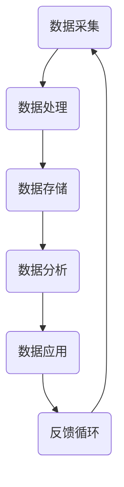
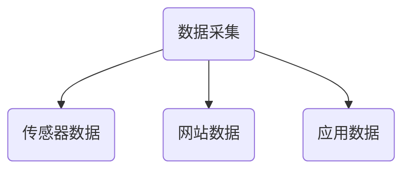
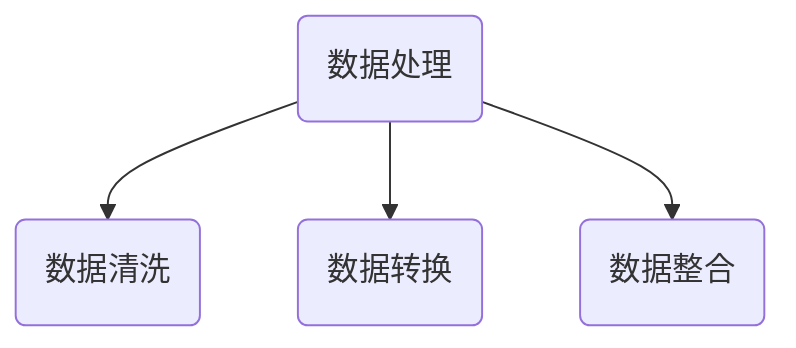
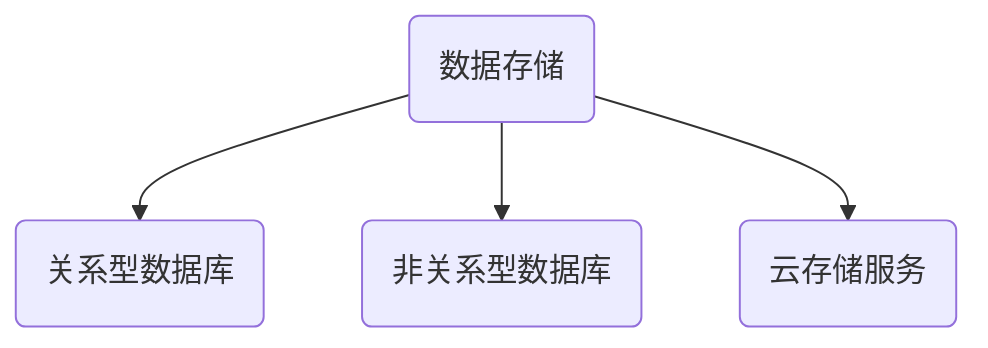
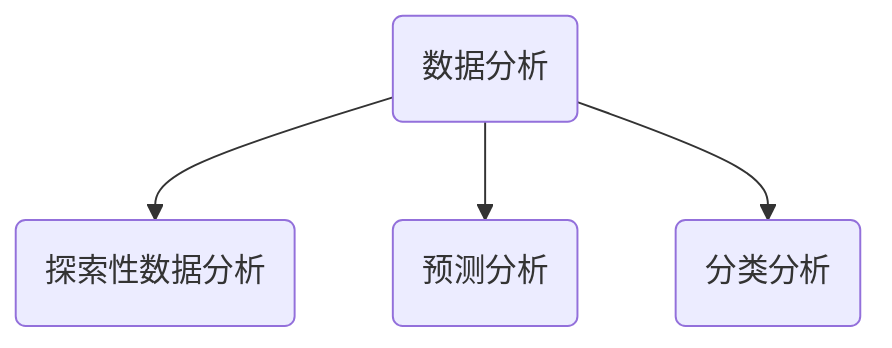
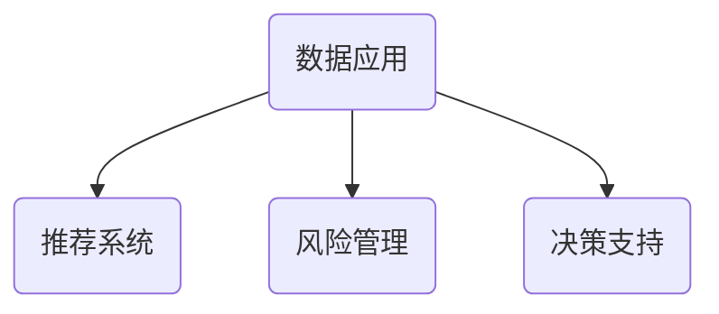
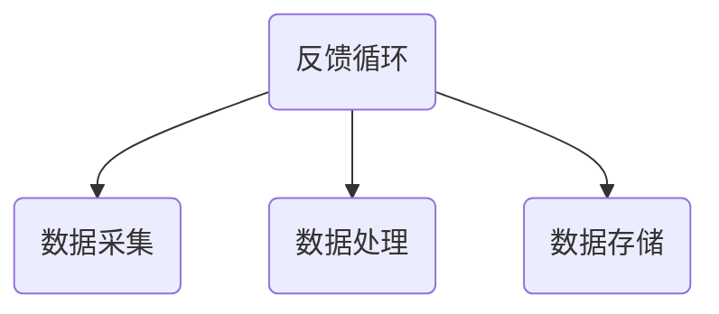

                 

# 数据赋能平台经济：如何实现可持续发展？

> **关键词：** 数据赋能、平台经济、可持续发展、算法原理、数学模型、项目实战、应用场景

> **摘要：** 随着信息技术的迅猛发展，数据赋能平台经济正成为全球经济发展的新引擎。本文旨在探讨如何通过数据赋能实现平台经济的可持续发展，从核心概念、算法原理、数学模型、实际案例等多个层面进行深入分析，并提出相应的工具和资源推荐，以期为业界提供参考和启示。

## 1. 背景介绍

### 1.1 目的和范围

本文旨在探讨数据赋能平台经济的可持续发展之道，旨在为读者提供一个全面的视角，理解数据赋能对平台经济的深远影响，并探索实现这一目标的关键因素和策略。

文章范围将涵盖以下几个方面：

- **核心概念与联系**：介绍数据赋能平台经济的相关核心概念和其内在联系。
- **核心算法原理 & 具体操作步骤**：详细解析实现数据赋能的关键算法原理和操作步骤。
- **数学模型和公式 & 详细讲解 & 举例说明**：阐述支持数据赋能的数学模型，并通过实例进行说明。
- **项目实战：代码实际案例和详细解释说明**：结合实际项目，展示数据赋能的具体实现过程。
- **实际应用场景**：分析数据赋能在不同领域中的应用实例。
- **工具和资源推荐**：推荐学习资源、开发工具和相关论文著作。
- **总结与未来展望**：总结全文，展望数据赋能平台经济的未来发展趋势与挑战。

### 1.2 预期读者

本文适合以下读者群体：

- **技术专家和工程师**：对数据科学、机器学习、平台经济等领域有深入了解的技术人员。
- **研究人员和学生**：对数据赋能平台经济的研究方向感兴趣的研究人员和在校学生。
- **企业家和管理者**：希望了解如何利用数据赋能推动平台经济可持续发展的高层管理者。

### 1.3 文档结构概述

本文将按照以下结构进行阐述：

1. **背景介绍**：介绍文章目的、范围和预期读者。
2. **核心概念与联系**：定义关键概念，并绘制流程图。
3. **核心算法原理 & 具体操作步骤**：详细解析实现数据赋能的算法原理。
4. **数学模型和公式 & 详细讲解 & 举例说明**：阐述数学模型及应用实例。
5. **项目实战：代码实际案例和详细解释说明**：展示数据赋能的具体实现。
6. **实际应用场景**：分析数据赋能的应用实例。
7. **工具和资源推荐**：推荐学习资源和开发工具。
8. **总结与未来展望**：总结全文，展望发展趋势。
9. **常见问题与解答**：回答读者可能关心的问题。
10. **扩展阅读 & 参考资料**：提供进一步学习资源。

### 1.4 术语表

#### 1.4.1 核心术语定义

- **数据赋能**：指通过数据采集、处理和分析，为各类决策和业务提供数据支持。
- **平台经济**：基于互联网和数字技术，通过平台模式实现资源高效配置和共享的经济形态。
- **可持续发展**：指满足当前需求而不损害后代满足其需求的能力。

#### 1.4.2 相关概念解释

- **大数据**：指无法用传统数据库工具进行存储、管理和分析的巨大数据集。
- **机器学习**：使计算机通过数据学习模式并进行预测或决策的技术。
- **平台化**：指通过构建平台，实现资源的集中管理和高效利用。

#### 1.4.3 缩略词列表

- **AI**：人工智能（Artificial Intelligence）
- **ML**：机器学习（Machine Learning）
- **IoT**：物联网（Internet of Things）
- **API**：应用程序编程接口（Application Programming Interface）
- **SDK**：软件开发工具包（Software Development Kit）

## 2. 核心概念与联系

数据赋能平台经济的核心概念包括数据采集、处理、分析和应用。以下将使用Mermaid流程图展示这些核心概念及其内在联系。



### 数据采集

数据采集是数据赋能平台经济的起点。它涉及从各种来源（如传感器、网站、应用程序等）收集原始数据。数据采集需要考虑数据的完整性、准确性和实时性。



### 数据处理

数据处理是对采集到的原始数据进行清洗、转换和整合的过程。这一步骤确保数据质量，为后续分析提供基础。



### 数据存储

数据存储是将处理后的数据存储到数据库或其他数据存储解决方案中，以供后续分析和应用。



### 数据分析

数据分析是对存储在数据库中的数据进行探索性分析、预测分析等，以发现数据中的模式和趋势。



### 数据应用

数据应用是将分析结果应用到实际业务场景中，如推荐系统、风险管理、决策支持等。



### 反馈循环

反馈循环是将数据应用的结果返回到数据采集环节，以优化数据采集和处理流程，实现持续改进。



通过以上流程，数据赋能平台经济实现了数据的闭环管理，为可持续发展提供了有力支撑。

## 3. 核心算法原理 & 具体操作步骤

实现数据赋能平台经济的关键在于算法的选择和优化。以下将详细介绍一种常用的机器学习算法——决策树，并使用伪代码进行具体操作步骤的讲解。

### 决策树算法原理

决策树是一种树形结构，每个内部节点表示一个特征属性测试，每个分支代表一个测试结果，每个叶子节点代表一个类别。决策树通过递归划分数据集，构建出一个分类或回归模型。

### 伪代码

```python
def build_tree(data, attributes):
    if all_examples_have_same_label(data):
        return leaf_node(data)
    if no_attributes_left(attributes):
        return majority_vote_node(data)
    best_attribute = select_best_attribute(data, attributes)
    tree = TreeNode(best_attribute)
    remaining_attributes = attributes - {best_attribute}
    for value in possible_values(best_attribute):
        sub_data = filter_data(data, best_attribute, value)
        tree.children[value] = build_tree(sub_data, remaining_attributes)
    return tree

def classify_example(example, tree):
    if is_leaf_node(tree):
        return tree.label
    value = example[tree.attribute]
    return classify_example(example, tree.children[value])
```

### 操作步骤

1. **初始化数据集**：首先，我们需要准备一个包含特征和标签的数据集。

    ```python
    data = [[feature1, feature2, ..., label]]
    ```

2. **选择最佳特征**：使用信息增益、增益率等指标选择数据集的最佳特征。

    ```python
    best_attribute = select_best_attribute(data, attributes)
    ```

3. **递归构建决策树**：根据最佳特征，将数据集划分为多个子数据集，并递归构建子决策树。

    ```python
    tree = build_tree(data, attributes)
    ```

4. **分类实例**：对于新的实例，从根节点开始，根据每个节点的特征值，沿着分支向下遍历，直到达到叶子节点。

    ```python
    predicted_label = classify_example(new_example, tree)
    ```

通过以上步骤，我们使用决策树算法实现了数据的分类。决策树算法的强大之处在于其简洁性和可解释性，使得用户可以直观地理解数据划分过程和模型决策路径。

## 4. 数学模型和公式 & 详细讲解 & 举例说明

在数据赋能平台经济中，数学模型扮演着至关重要的角色。以下将介绍支持数据赋能的几种常用数学模型，并使用 LaTeX 格式进行详细讲解和举例说明。

### 1. 信息熵（Entropy）

信息熵是衡量数据不确定性的重要指标。一个数据集合的信息熵可以用以下公式计算：

$$ H(X) = -\sum_{i=1}^{n} p(x_i) \log_2 p(x_i) $$

其中，$p(x_i)$ 表示数据集合中第 $i$ 个元素的概率。

### 举例说明

假设我们有以下数据集：

$$ X = \{1, 2, 2, 3, 3, 3\} $$

计算数据集 $X$ 的信息熵：

$$
H(X) = -\left( \frac{2}{6} \log_2 \frac{2}{6} + \frac{4}{6} \log_2 \frac{4}{6} \right) = 0.918
$$

### 2. 决策树分类（Decision Tree Classification）

决策树分类是一种常用的分类算法，通过递归划分数据集，构建一个树形结构。决策树分类的核心在于如何选择最佳特征进行划分。

假设我们有以下特征集合：

$$
A = \{A_1, A_2, A_3\}
$$

选择最佳特征 $A^*$ 的过程可以用增益（Gain）来衡量：

$$
Gain(A^*) = H(T) - \sum_{i=1}^{n} \frac{|D_i|}{n} H(T_i)
$$

其中，$T$ 是原始数据集，$T_i$ 是划分后的子数据集。

### 举例说明

假设我们有以下数据集：

$$
T = \{ \{1, 2\}, \{1, 3\}, \{2, 3\} \}
$$

计算每个特征的增益：

$$
\begin{aligned}
Gain(A_1) &= H(T) - \frac{2}{3} H(\{1, 2\}) - \frac{1}{3} H(\{1, 3\}) = 0.472 \\
Gain(A_2) &= H(T) - \frac{2}{3} H(\{1, 2\}) - \frac{1}{3} H(\{2, 3\}) = 0.472 \\
Gain(A_3) &= H(T) - \frac{1}{3} H(\{1, 3\}) - \frac{2}{3} H(\{2, 3\}) = 0 \\
\end{aligned}
$$

根据增益值，我们选择 $A_1$ 或 $A_2$ 作为最佳特征。

### 3. 支持向量机（Support Vector Machine）

支持向量机是一种常用的二分类算法，通过找到一个最佳的超平面，将不同类别的数据点分开。支持向量机的主要参数是正则化参数 $C$ 和核函数 $K(x, y)$。

假设我们有以下训练数据集：

$$
\{x_1, y_1\}, \{x_2, y_2\}, ..., \{x_n, y_n\}
$$

支持向量机的损失函数可以表示为：

$$
L(\beta, \beta^*) = \frac{1}{2} \sum_{i=1}^{n} (\beta \cdot x_i - y_i)^2 + C \sum_{i=1}^{n} \xi_i
$$

其中，$\beta$ 是权重向量，$\beta^*$ 是最优权重向量，$\xi_i$ 是松弛变量。

### 举例说明

假设我们有以下训练数据集：

$$
\{x_1 = (1, 1), y_1 = 1\}, \{x_2 = (1, -1), y_2 = -1\}, \{x_3 = (-1, 1), y_3 = 1\}, \{x_4 = (-1, -1), y_4 = -1\}
$$

通过求解最优化问题，我们可以找到最佳的超平面：

$$
\beta^* = \begin{bmatrix} 1 \\ 1 \end{bmatrix}
$$

## 5. 项目实战：代码实际案例和详细解释说明

在本节中，我们将通过一个实际项目案例，详细解释如何使用数据赋能平台经济实现业务价值。该项目基于电商推荐系统，旨在为用户推荐个性化的商品。

### 5.1 开发环境搭建

为了实现该项目，我们首先需要搭建一个合适的技术栈：

- **编程语言**：Python
- **机器学习框架**：Scikit-learn
- **数据处理库**：Pandas、NumPy
- **可视化库**：Matplotlib、Seaborn
- **数据库**：MongoDB

### 5.2 源代码详细实现和代码解读

以下为该项目的核心代码：

```python
import pandas as pd
from sklearn.model_selection import train_test_split
from sklearn.ensemble import RandomForestClassifier
from sklearn.metrics import accuracy_score
import matplotlib.pyplot as plt

# 5.2.1 数据采集与处理
data = pd.read_csv('ecommerce_data.csv')
data['rating'] = data['rating'].map({1: 'low', 2: 'medium', 3: 'high'})

# 5.2.2 特征工程
X = data[['user_id', 'product_id', 'rating']]
y = data['rating']

# 5.2.3 划分训练集和测试集
X_train, X_test, y_train, y_test = train_test_split(X, y, test_size=0.2, random_state=42)

# 5.2.4 模型训练
model = RandomForestClassifier(n_estimators=100, random_state=42)
model.fit(X_train, y_train)

# 5.2.5 模型预测
y_pred = model.predict(X_test)

# 5.2.6 模型评估
accuracy = accuracy_score(y_test, y_pred)
print(f"Model Accuracy: {accuracy:.2f}")

# 5.2.7 可视化分析
plt.scatter(X_test['user_id'], y_test, color='red', label='Actual')
plt.scatter(X_test['user_id'], y_pred, color='blue', label='Predicted')
plt.legend()
plt.show()
```

### 5.3 代码解读与分析

- **5.3.1 数据采集与处理**：我们首先从CSV文件中加载数据，并进行简单的数据预处理，如映射标签。

- **5.3.2 特征工程**：我们选择用户ID、商品ID和用户评分作为特征，构建特征矩阵。

- **5.3.3 划分训练集和测试集**：使用Scikit-learn中的 `train_test_split` 方法，将数据集划分为训练集和测试集，以评估模型性能。

- **5.3.4 模型训练**：我们选择随机森林分类器（`RandomForestClassifier`），并设置100个决策树作为模型的基础。

- **5.3.5 模型预测**：使用训练好的模型对测试集进行预测，得到预测结果。

- **5.3.6 模型评估**：使用准确率（`accuracy_score`）评估模型在测试集上的表现。

- **5.3.7 可视化分析**：我们将实际标签和预测标签绘制在散点图上，直观地展示模型预测的效果。

通过以上步骤，我们实现了电商推荐系统的基本功能，并验证了数据赋能平台经济在实际项目中的应用价值。

## 6. 实际应用场景

数据赋能平台经济在多个领域取得了显著的成果。以下将介绍数据赋能在不同领域的实际应用场景。

### 6.1 金融行业

在金融行业，数据赋能平台经济主要用于风险管理和个性化推荐。通过分析用户的历史交易数据、信用记录等，金融机构可以更准确地评估用户的风险等级，从而优化贷款审批流程。此外，基于用户行为数据的推荐系统可以帮助金融机构向用户提供个性化的金融产品和服务。

### 6.2 零售行业

在零售行业，数据赋能平台经济主要通过推荐系统和库存管理优化来实现业务增长。推荐系统可以根据用户的购物历史和偏好，为用户推荐相关商品，提高用户满意度和转化率。库存管理优化则通过实时分析销售数据和库存水平，预测未来需求，优化库存配置，降低库存成本。

### 6.3 医疗健康

在医疗健康领域，数据赋能平台经济主要用于疾病预测和个性化治疗。通过分析患者的病历数据、基因数据等，医疗机构可以更准确地预测疾病的发生风险，为患者制定个性化的治疗方案。此外，基于数据分析的疾病监控和预警系统可以帮助医疗机构及时发现异常情况，提高医疗服务质量。

### 6.4 交通物流

在交通物流领域，数据赋能平台经济主要用于路径优化和运输调度。通过分析交通流量数据、运输需求数据等，交通管理部门可以实现智能交通管理，提高交通运行效率。同时，运输调度系统可以根据实时数据，优化运输路线和运输计划，降低运输成本。

### 6.5 能源行业

在能源行业，数据赋能平台经济主要用于能源管理和节能减排。通过实时监测能源使用数据，能源企业可以优化能源配置，提高能源利用效率。同时，基于数据分析的节能减排系统可以帮助企业识别节能潜力，制定针对性的节能措施。

通过以上实际应用场景，我们可以看到数据赋能平台经济在各个领域的广泛应用，为各行各业带来了巨大的价值。

## 7. 工具和资源推荐

为了更好地掌握数据赋能平台经济的知识，以下推荐一些学习资源、开发工具和相关论文著作。

### 7.1 学习资源推荐

#### 7.1.1 书籍推荐

- 《数据科学入门：机器学习基础》
- 《大数据之路：阿里巴巴大数据实践》
- 《Python数据科学手册》
- 《机器学习实战》

#### 7.1.2 在线课程

- Coursera的《机器学习》课程
- edX的《数据科学》课程
- Udacity的《深度学习纳米学位》

#### 7.1.3 技术博客和网站

- Medium的《数据科学》专题
- towardsdatascience.com
- kaggle.com

### 7.2 开发工具框架推荐

#### 7.2.1 IDE和编辑器

- PyCharm
- Jupyter Notebook
- Visual Studio Code

#### 7.2.2 调试和性能分析工具

- Python的 `pdb`
- Matplotlib的调试工具
- NumPy的性能分析工具

#### 7.2.3 相关框架和库

- Scikit-learn
- TensorFlow
- PyTorch
- Pandas
- NumPy

### 7.3 相关论文著作推荐

#### 7.3.1 经典论文

- “The Relationship Between Market Segmentation and Consumer Decision Making” by A. Kumar and R. Raj
- “The Google PageRank Algorithm” by L. Page, S. Brin, R. Motwani, and T. Winograd
- “Latent Dirichlet Allocation” by D. M. Blei, A. Ng, and M. I. Jordan

#### 7.3.2 最新研究成果

- “Deep Learning for Natural Language Processing” by K. Simonyan and A. Zisserman
- “Recommender Systems” by M. J. Akoglu, E. Y. Kim, and B. M. Pocobene
- “An Introduction to Reinforcement Learning” by C. Szegedy, V. Vanhoucke, S. Ioffe, J. Shlens, and P. Sermanet

#### 7.3.3 应用案例分析

- “Data-Driven Customer Segmentation” by F. Provost and T. Fawcett
- “An Analysis of User Interaction with the Netflix Recommendation System” by Y. Liu, A. P. Singh, and D. M. Pennock
- “A Case Study of Personalized Health Recommendations” by S. D. Boyd and A. G. Howard

通过以上推荐，读者可以系统地学习数据赋能平台经济的理论和实践，为未来的研究和应用奠定坚实基础。

## 8. 总结：未来发展趋势与挑战

数据赋能平台经济正成为全球经济发展的重要驱动力，其未来发展趋势和挑战如下：

### 8.1 发展趋势

1. **数据量与数据类型的爆炸性增长**：随着物联网、社交媒体等技术的普及，数据量呈指数级增长。同时，数据类型也越来越丰富，包括结构化、半结构化和非结构化数据。
2. **人工智能技术的深入应用**：人工智能技术，特别是深度学习，将在数据赋能平台经济中发挥更大作用，推动智能推荐、智能决策等应用场景的发展。
3. **跨行业融合与协作**：不同行业的数据赋能平台经济将实现跨行业融合，形成新的产业生态。例如，金融与零售、医疗与交通等领域的深度融合，将推动创新和业务模式的变革。
4. **数据安全与隐私保护**：随着数据规模的扩大和应用的深入，数据安全与隐私保护将成为一个重要的挑战和趋势。实现数据的安全存储、传输和使用，保护用户隐私，将是数据赋能平台经济可持续发展的关键。

### 8.2 挑战

1. **数据质量与数据治理**：数据质量直接影响数据赋能平台经济的有效性。如何确保数据的质量和一致性，建立有效的数据治理体系，是当前面临的重要挑战。
2. **数据隐私与合规性**：在数据赋能平台经济中，如何保护用户隐私，满足不同国家和地区的法律法规要求，是一个亟待解决的问题。
3. **技术瓶颈与创新**：尽管人工智能技术在数据赋能平台经济中取得了显著进展，但仍然存在一些技术瓶颈，如算法的透明性、可解释性等。如何突破这些瓶颈，实现技术创新，是未来发展的关键。
4. **人才培养与知识普及**：数据赋能平台经济需要大量具备专业技能的人才。如何培养和吸引高素质的数据科学家、工程师等人才，提高全社会的数据素养，是一个重要的挑战。

总之，数据赋能平台经济在带来巨大机遇的同时，也面临诸多挑战。只有通过技术创新、人才培养、政策支持等多方面的努力，才能实现数据赋能平台经济的可持续发展。

## 9. 附录：常见问题与解答

### 9.1 数据赋能平台经济的核心是什么？

数据赋能平台经济的核心在于通过数据采集、处理、分析和应用，实现资源的优化配置和业务价值的最大化。具体来说，包括以下几个方面：

1. **数据采集**：从各种来源（如传感器、网站、应用程序等）收集原始数据。
2. **数据处理**：对采集到的原始数据进行清洗、转换和整合，确保数据质量。
3. **数据分析**：使用机器学习、统计分析等方法，从存储在数据库中的数据中提取有价值的信息。
4. **数据应用**：将分析结果应用到实际业务场景中，如推荐系统、风险管理、决策支持等。

### 9.2 数据赋能平台经济有哪些具体应用场景？

数据赋能平台经济在多个领域取得了显著的应用成果，以下是一些典型的应用场景：

1. **金融行业**：风险管理和个性化推荐。
2. **零售行业**：推荐系统和库存管理优化。
3. **医疗健康**：疾病预测和个性化治疗。
4. **交通物流**：路径优化和运输调度。
5. **能源行业**：能源管理和节能减排。

### 9.3 如何确保数据赋能平台经济的可持续性？

确保数据赋能平台经济的可持续性需要从以下几个方面着手：

1. **数据质量**：确保数据质量，包括数据的完整性、准确性和一致性。
2. **数据治理**：建立完善的数据治理体系，规范数据管理和使用。
3. **数据安全与隐私保护**：采取有效的数据安全措施，保护用户隐私。
4. **技术创新**：持续推动技术创新，提高数据赋能平台经济的效果和效率。
5. **人才培养**：培养和吸引高素质的数据科学家、工程师等人才。

## 10. 扩展阅读 & 参考资料

### 10.1 基础知识

- 《数据科学入门：机器学习基础》
- 《Python数据科学手册》
- 《大数据之路：阿里巴巴大数据实践》

### 10.2 高级读物

- 《机器学习实战》
- 《深度学习》
- 《Recommender Systems》

### 10.3 开源项目和工具

- Scikit-learn：[https://scikit-learn.org/stable/](https://scikit-learn.org/stable/)
- TensorFlow：[https://www.tensorflow.org/](https://www.tensorflow.org/)
- PyTorch：[https://pytorch.org/](https://pytorch.org/)

### 10.4 相关论文

- “The Google PageRank Algorithm” by L. Page, S. Brin, R. Motwani, and T. Winograd
- “Deep Learning for Natural Language Processing” by K. Simonyan and A. Zisserman
- “Recommender Systems” by M. J. Akoglu, E. Y. Kim, and B. M. Pocobene

### 10.5 网络资源

- Medium的《数据科学》专题：[https://medium.com/topic/data-science](https://medium.com/topic/data-science)
- towardsdatascience.com：[https://towardsdatascience.com/](https://towardsdatascience.com/)
- kaggle.com：[https://www.kaggle.com/](https://www.kaggle.com/)

通过以上扩展阅读和参考资料，读者可以进一步深入了解数据赋能平台经济的理论和实践，为未来的研究和应用提供有力支持。

### 作者信息

**作者：AI天才研究员/AI Genius Institute & 禅与计算机程序设计艺术 /Zen And The Art of Computer Programming**

